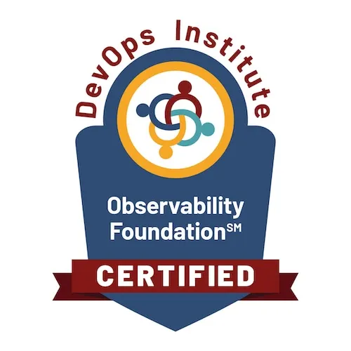

## 课程简介

* 交付形式：线上或线下
* 时长：2天

可观测性（Observability）课程介绍了一系列结合应用程序生命周期和复杂体系架构中推进可观测性的核心概念和实践。为关注全栈可观测性（Full Stack Observability）和站点可靠性工程（SRE）的学员量身定制。

微服务和云原生架构一直是许多组织提高速度和灵活性的目标，但随着复杂性的增加，系统的观察变得越来越困难。当出现问题时，这些问题往往难以定位并确定根本原因。

可观测性（Observability）课程介绍了在组织内实现可观测性的方法。它探讨了通过可观测性关键要素：包括事件（Events）、指标 （Metrics）、跟踪（Tracing）和上下文（Context），通过构建智能的异常检测、故障排除、根因定位能力，实现全栈可观测性，提升组织的故障处理、业务洞察、跨职能协作能力。

本课程旨在为学员提供实践、方法和工具，通过使用真实场景和案例故事，让组织内参与可观测性的人员参与进来。课程中介绍了一系列提高弹性的实践，并教授如何构建云原生应用程序的端到端可观测性。介绍了构建全栈度量、事件、日志和分布式跟踪的优势，以及 DevSecOps 对可观测性的影响，以及 AIOP 如何增强可观测性能力。本课程还介绍了网络和安全可观测性如何在建立可靠性方面发挥关键作用，以及安全操作和自动响应的关键方面。

本课程旨在通过使用真实场景和案例故事，为参与者提供实践、方法和工具，以吸引组织内参与可观测性的人员。课程结束后，学员将获得切实的收获，以充分利用各种情况，如有效实施 MELT 模型，满足其组织环境，通过设计构建分布式跟踪和弹性。

本课程的开发利用了遥测领域的关键专家、知识来源和与可观测性领域的思想领袖的接触，并与跨越现代可观测性鸿沟的组织合作，以提取现实生活中的最佳实践。本课程帮助学员成功完成可观测性基础认证考试。

## 课程对象

* 任何关注大规模服务可扩展性和可靠性的人
* 任何对现代IT领导力和组织变革方法感兴趣的人
* 企业I负责人、CIO、信息中心主任或负责人
* IT运维人员
* IT研发人员
* IT测试人员
* DevOps从业者
* IT主管
* IT经理
* 产品所有者
* Scrum Master
* 软件工程师
* SRE站点可靠性工程师
* 系统集成商
* 平台厂商

## 课程目标

课程结束时，将实现以下学习目标：

1. 如何在您的组织中成功实施富有吸引力的可观测性文化的实用观点
2. 可观测性的基本原则，以及理解为什么在基于微服务的容器化环境中，单独监测无法提供所需的结果。
3. 理解可观测性的三大支柱
4. 采用开放遥测标准有助于以无缝方式实现创新和分布式跟踪
5. 可观测性成熟度模型和实际可观测性的度量
6. 实现全栈可观测性和分布式跟踪将实现 DevSecOps 文化
7. 利用人工智能控制可观测性，从被动事件管理转向主动和预测事件管理。此外，如何使用DataOps 构建可观测数据的数据体系
8. 实施网络、容器级可观测性，以及为什么安全是构建可观测性文化的优先考虑
9. 什么是基于时间的拓扑，以及它如何为分布式环境的可观测性增加价值
10. 数据悖论，以及我们如何使用系统方法（DataOps）解决数据问题，以构建一个干净的可观测性流水线
11. 我们如何将 DevSecOps智慧反馈到可观测性中
12. DevSecOps 和 SRE 的可观测性实

## 学习模式

* 16小时的讲师指导培训
* 课堂练习和讨论
* 行业案例故事
* 示例文档、模板、工具和技术
* 作业练习
* 动手实验

## 课程大纲

### 第一天

> 破冰之旅

* 可观测性发展历程
* 可观测性和 SRE 认证简介
* 可观测性知识体

> 模块1：可观测性探索

* 什么是可观测性？
* 为什么可观测性很重要？
* 为什么传统监控做不到？
* 可观测性成熟度模型（OMM）

> 模块2：可观测性的支柱

* 遥测（Telemetry）
* 可观测性三大支柱
* 分布式跟踪
* 跟踪的样例和实现

> 模块3：开源应用格局

* 可观测性由什么组成？
* OpenTelemetry
* 开源生态系统的其余部分
* 成功案例介绍：
* 《GitHub 迁移到 OpenTelemetry》

> 模块4：服务地图和拓扑

* 时间旅行拓扑和服务地图
* 实时可观测性
* 添加实时拓扑
* 跟踪实时变更

> 行业案例故事

* 成功案例介绍：《采用可观测性为零售企业节省成本》
* 案例分析

### 第二天

> 模块5：DataOps 和可观测性

* 可观测性和数据悖论
* 为什么可观测性需要 DataOps
* 数据所有权和治理
* 数据隐私和可观测性

> 模块6：AIOps 增强了可观测能力

* 可观测性即服务和 AIOps 的收益
* 事件聚类和动态阈值
* 异常检测
* 原因和缺陷分析
* 实时数据关联

> 行业案例故

* 成功案例介绍:《实现 24X7全天候高性能业务服务》
* 案例分析

> 模块7：可观测性与网络安全

* 具有可观测性的安全性和网络
* 安全集成
* 容器安全
* 网络管理集成
* 云网络的可观测性

> 模块8: DevOps 和 SRE 的可观测性实践

* SRE 和 DevOps 的可观测性
* 可观测性的注意事项
* 可观测性监控
* 扩展可观测性
* 观测性指标
* 可视化良好实践

> 模块9：平台演示

* 结合工具实现可观测

> 总结回顾

* 总结回顾

## 认证考试

* 考试题型 ：单选题
* 考题数量 ：40題
* 考试时长 ：60分钟
* 考试语言 ：英文
* 过线分数 ：65分（答对40个选择题中的至少26题）
* 是否要求授权培训？ ：是（需参加 DevOps Institute 指定培训合作伙伴教授的 Observability Foundation课程）。
* 认证机构 ：顺利通过考试的学员，将获得由DevOps Institute颁发的Observability Foundation®认证证书。
