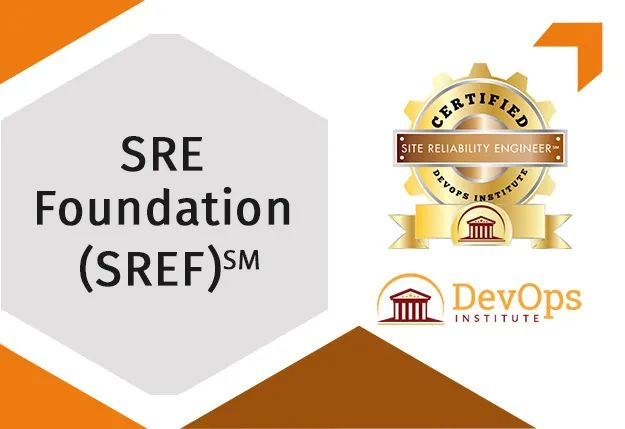
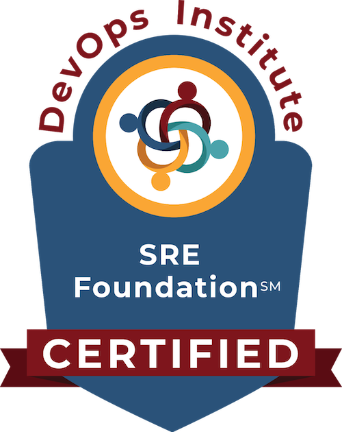

## 概述

当今的组织在更复杂的技术环境中处理更多的变化，导致更高的中断和事故风险。IT团队必须提高服务可靠性和系统弹性。随着自动化和可观察性成为更高效、更快速部署的关键因素，SRE职位已成为增长最快的职位之一。

SRE Foundation 认证课程重点介绍了SRE的发展及其未来方向，并为参与者提供了实践，方法和工具，以使整个组织中的人们参与到可靠性和稳定性中，这些案例通过使用真实场景和案例来证明。完成课程后，学员将在回到公司后可以切实地利用诸如了解，设置和跟踪服务水平目标（SLO）的内容。

DevOps Institute （DOI）是本认证课程的官方所有者，官网SRE Foundation 认证课程概述：<https://devopsinstitute.com/certification/sre-foundation/>

SRE Foundation 认证课程所使用的教材和 SRE 资源，基于 DOI 同业内 SRE 领域的思想领袖的共创，以及同 SRE 相关企业/组织的合作；汲取了各种真实的最佳实践案例，旨在传授启动 SRE 所必须的关键原则和实践。本课程能够帮助使学习者成功完成 SRE Foundation 认证考试。

## 课程对象

* 任何致力于提高可靠性的人
* 服务经理
* SRE工程师
* 业务经理
* 业务利益干系人
* 顾问
* DevOps从业者
* IT主管
* IT经理
* IT团队负责人
* 产品经理/产品负责人
* Scrum Master
* 软件工程师
* 系统集成商
* 工具开发者/工具厂商
* 敏捷教练

## 课程目标

SRE Foundation 认证课程的学习目标包括对下列内容的探讨与理解：

* SRE的历史，及其在Google的应用
* SRE与DevOps和其他流行框架的相互关系
* SRE背后的基本原则
* 定义服务质量目标（SLO），及聚焦用户的关注点
* 定义服务质量指标（SLI），及流行的监控环境和方式
* 设定错误预算和错误预算策略
* 通过服务的可观测性跟踪服务的运行状况
* SRE对于工具、自动化技术和信息安全的重要性
* 实践反脆弱性，并通过混沌工程进行测试的方法
* SRE导入给组织带来的影响

## 课程大纲

### 第一天

> 模块1：SRE原则和实践

* 什么是站点可靠性工程？
* SRE和DevOps的区别
* SRE原则与日常

> 模块2：服务质量目标和错误预算

* 服务质量目标（SLO）
* 错误预算
* 错误预算策略

> 模块3：消减琐事

* 什么是琐事？
* 琐事的根源和消减方式

> 模块4：监控和服务质量指标

* 服务质量指标（SLI）
* 监控
* 可观测性

### 第二天

> 模块5：SRE工具和自动化

* 定义自动化
* 自动化的要点
* 自动化类型的层次结构
* 信息安全管理自动化
* 自动化工具

> 模块6：反脆弱和从故障中学习

* 为什么要从故障中学习
* 构建反脆性的收益
* 转型为可恢复性组织

> 模块7：SRE对组织的影响

* 组织为何要采用SRE
* SRE导入的模式
* OnCall 轮值管理
* 事后回顾与反思总结
* 推广和规模化 SRE

> 模块8: SRE、其他框架和趋势

* SRE和其他框架
* 发展趋势

> 总结回顾

* 总结回顾

## 认证考试

* 考试题型 ：多选题
* 考题数量 ：40題
* 考试时长 ：60分钟
* 考试语言 ：英文
* 过线分数 ：65分（答对40个选择题中的至少26题）
* 是否要求授权培训？ ：是（需参加 DevOps Institute 指定培训合作伙伴教授的 Observability Foundation课程）。
* 认证机构 ：顺利通过考试的学员，将获得由DevOps Institute颁发的 SRE Foundation®认证证书。

## 课程收获

> 个人收益：

* 能平衡和提升当前工作，按计划进行改进
* 降低轮值 OnCall 体验的压力，减少对外沟通成本总量
* 拓展技术实力，应用最新的自动化技术和思想
* 提升职场的工作文化
* 能帮助开发团队提供更可靠的服务，识别和实施各种“左移”的机会
* 提升职业发展的议价筹码，进入一线头部企业
* 提升薪酬待遇，平均最低 15k，一线城市可达 40~50K
* 取得 DevOps Institute 颁发的国际化证书

> 企业收益：

* 提高服务的稳定性和可靠性
* 更好地了解服务在生产环境中是如何运作
* 在技术投资和客户体验之间取得更高的平衡性
* 更好地认识到开发团队的服务对业务的影响
* 提高员工士气和稳定员工
