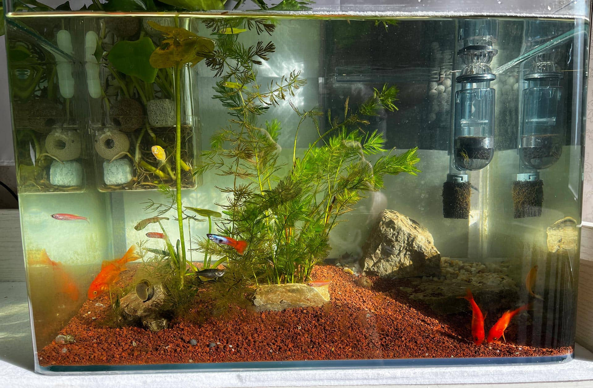

从欣赏和磨练耐心性的角度看，养护鱼缸里的生态系统也值得推敲的，是一件很有意思，而且可以是非常技术流的事情。

大概是去年的冬天，在鱼缸里生长了 10+年的那一条金鱼寿终正寝了。它是一条从租住屋里搬进家的普通红白金鱼，它是其它几个同伴中唯一的幸存者；到最后，我也没有想到它能独自生长这么多年。它的生存环境应该说是极其简陋的，每两周会给它换掉鱼缸里的一半的水，偶尔用增氧泵给它开几个小时，它快死的那几个月，增氧泵用的多一些。想想这条鱼的一生也是挺艰难的，偶尔还会遇到我们全家出游一个多月的时候。然而，它却和我们不离不弃的，坚强的活到了最后。最后应该是得了什么病了，肚子肿大，身体无法保持平衡，最后静静的离去。

最近由于弹窗 3 的缘故，从十一前开始，就没有好好在北京呆过几天，应该有一个多月的时间都在燕郊，好处是可以安心的陪着妈妈天天做饭吃饭；然而，这有家不能回的烦恼也是显而易见的。

说回到下面这个鱼缸的故事。

这是一个 35 cm 宽的白玻璃鱼缸。由于疫情的缘故，在家里呆着的时间会比较多。几乎所有社交也都减免了，天天过着几乎是隐居一般的生活。养几条鱼，让屋子里多一些生机，能看着小鱼儿们在水草间游弋，也是一种非常减压的举动。

养鱼先养水，我用很多 5 升的矿泉水桶装满自来水晒在阳台，一周后这些水就都困好了，水里的有害物质也几乎挥发殆尽。为了更加贴近大自然，我去河里采集了两桶河水，然后混入了困好的自来水。去河边还采集了一些免费的水草和石头，这样在继续养水的过程中，还能让缸里的景观不至于单调。河里的石头上还有，免费附赠的一些田螺，它们是鱼缸里最初的原住民。

混合河水的鱼缸在稳定了一周以后，我去买了一些小鱼，鱼缸里一下子充满了生机。随后又添加了一个小型的瀑布式过滤器。还加入了一个方形的水培绿萝的小盒子，固定在鱼缸的一个角落，里面放了几颗滤材。

鱼缸生态系统浅谈：

1. 水质是根本。鱼会在水中排出粪便等污染水质的物质，污染物的来源是鱼食，显然喂鱼是整个这件事情最有意思的部分。净化水质的手段不仅依靠水泵的循环，还依靠看不见的硝化细菌。
2. 硝化细菌的培养依赖于，水利的底纱、过滤器里的滤材和水中的石头等因素，这些环境物质给硝化细菌提供了条件。
3. 鱼的生存还依赖于氧气，氧气的获取来自水泵和水草。在中午日光最强的时候，冬天的低角度日光可以直接照射水草三四十分钟，日光的光合作用是最明显的，可以看到水草上成串的放出光合作用的产物氧气。
4. 水草的生长依赖阳光和二氧化碳，鱼能产生少量的二氧化碳，但是缸里能自己产生的二氧化碳的量也不至于让水草疯长，但足够水草维持生命。

在鱼缸里的生态系统非常健康的情况下，水会非常干净，鱼的排泄物会被很快的分解的无影无踪。甚至于鱼缸的内壁上的沉积物也没有，鱼缸从外部看起来清澈透明。

为了保持这个生态系统的持续性，我从不给鱼缸大换水；只加水不换水。鱼缸自然蒸发导致水位下降了两厘米左右的时候，我就会加相应容量的困好的氺。喂鱼也尽量忍住不频繁投喂，目前这是最大的水质污染来源。目前的硝化细菌还比较弱势，缸内壁的附着物两周不管，就会比较影响缸壁的透明度，这是最亟待改善的部分。所有的鱼都是小型鱼，它们的耗氧量本来就比较少，因此都非常活跃。河里的田螺不知道为什么，死亡了几只。买过一些黑壳虾，它们能躲在水草上，吃水藻，观赏性也不错，但是由于一次新水泵的测试，一夜之间都几乎被水泵吸入后阵亡了。

总之，维持鱼缸里合理的生态系统并不难。从观赏性和嗜好的角度都算是高投入产出比的事情。养鱼这件事还是很好玩，后期会注重与水草和造景，尝试更多种类的小型鱼。