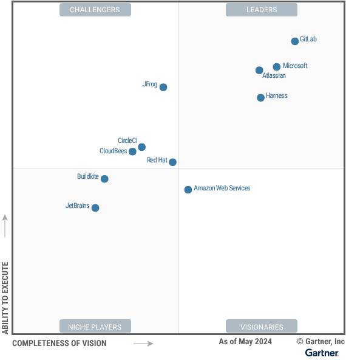
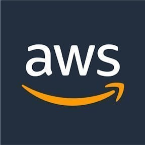
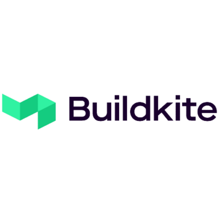
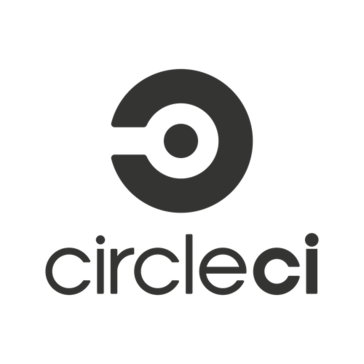
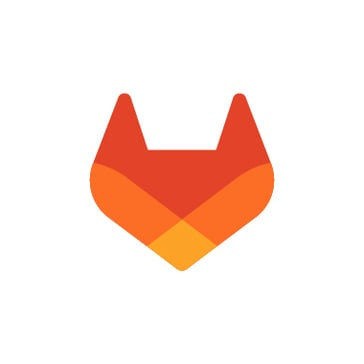
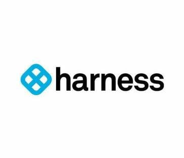
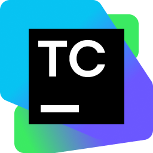
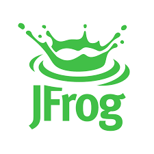

DevOps 平台提供了集成化的工具替代方案，帮助组织优化软件开发流程，减少工具链复杂性。软件工程领导者应评估这些平台，以降低开发复杂性、提升安全性，并加速软件交付进程。

**战略规划假设**

预计到 2027 年，80% 的组织将采用 DevOps 平台来简化工具链并优化软件交付流程，这一比例将从 2023 年的 25% 大幅上升。

## 市场定义与描述

Gartner 将 DevOps 平台定义为能够提供完整集成功能的平台，支持通过敏捷 (Agile) 和 DevOps 实践实现软件的持续交付。该平台功能覆盖了持续集成/持续交付 (CI/CD) 管道的开发和交付生命周期，包括版本控制、测试、安全性、文档及合规性等。DevOps 平台能够促进团队协作、一致性、简化工具使用，并衡量软件交付的各项指标。

DevOps 平台简化了现代软件应用交付中所需组件的创建、维护和管理过程。平台提供统一的工作流和数据模型，简化用户访问，保证一致的用户体验 (UX)，有效减轻用户的操作负担。这些平台还能提升软件开发过程中的可见性、可审计性和可追溯性，鼓励团队采用系统化的思维方式，并加速反馈循环。

企业通过使用 DevOps 平台，减少因复杂工具链、手动交接和整个软件开发生命周期 (SDLC) 中可见性不足所引发的工具摩擦。这样，产品团队能够在确保质量的前提下更快地为客户交付价值。DevOps 平台市场反映了开发、安全、基础设施和运营技术的整合，旨在简化软件交付流程。

DevOps 平台支持多种应用场景，包括但不限于：

- 敏捷软件交付——实现敏捷开发实践的运营
- 云原生应用交付——在混合和多云环境中构建并交付云原生应用
- MLOps——支持对机器学习模型的管理，包括版本控制和反馈循环
- 移动应用交付——构建、测试和交付本地移动应用和移动 Web 应用
- 平台工程——提供自助服务的内部开发者平台，扩展 DevOps 和软件工程实践
- 受监管的交付——支持合规、审计、可追溯性及治理

### 必备功能

该市场的强制性功能包括：

- 持续集成——原生支持持续构建代码，并协调验证和验证流程，如测试自动化、安全性和合规扫描。
- 持续交付和发布协调——支持无审批的持续部署，以及通过审批机制进行的发布协调（如满足监管要求或正处于 ITIL 过渡期的组织）。
- Web 应用的交付——包括但不限于容器化应用的交付。

### 常见功能

该市场的常见功能包括：

- 团队协作与开发流程的可视化——通过统一仪表板支持多角色用户的工作流展示。
- 价值流分析——如吞吐量指标、DORA 指标等。
- 安全功能的协调——涵盖源代码、软件包和配置管理。
- 配置自动化——支持环境管理，包括基础设施的部署、配置管理及漂移检测。
- 产品规划与管理——包括功能和缺陷管理、路线图规划、待办事项管理、看板和 Scrum 方法。
- 源代码库、工件库和集成开发环境 (IDEs)。
- 软件测试自动化——支持功能性和非功能性测试的执行、测试管理、代码覆盖率分析、性能测试、混沌测试、模糊测试、渗透测试以及通过自动化工具进行的验收测试。
- 应用监控与可观测性——帮助提高服务质量目标 (SLO)，收集生产数据（如日志、指标、事件、跟踪），并支持自动化事故响应。
- AI 辅助和 AI 驱动的持续集成与部署——优化 DevOps 流程，如软件测试自动化、基础设施部署、安全漏洞检测和操作数据分析。
- 集成开发者门户——提供软件目录和可定制的仪表板，帮助团队深入了解软件组件及其依赖关系和环境；此外，还可包括基础设施 KPIs、协作论坛和知识库等功能。

## 魔力象限

图 1：DevOps 平台魔力象限

### 供应商优劣分析

### Amazon Web Services

亚马逊网络服务 (AWS) 在此魔力象限中被列为具有远见的领导者。其 DevOps 平台 Amazon CodeCatalyst 集成了多项 AWS 工具，包括 AWS CodeArtifact、AWS CodeBuild、AWS CodeCommit、AWS CodeDeploy、AWS CodePipeline 和 AWS CodeStar。（评估期间，亚马逊已停止为 CodeCommit 接受新用户。）Amazon CodeCatalyst 平台正在迅速开发更多的协作和报告功能。

AWS 拥有全球业务网络，为各类规模和行业的客户提供服务。Amazon CodeCatalyst 于 2023 年 4 月正式推出，通过支持 Amazon Elastic Kubernetes Service (EKS) 和 Terraform，增强了计划工作流和账户管理等功能。此外，AWS 进一步拓展了 CodeCatalyst 的集成功能，支持 GitHub 以外的平台，如 GitLab 和 Bitbucket，并与 Amazon Q for Developers 进行了集成。

#### 优势

- 深度集成 AWS 云服务：AWS 一直在 IaaS 和 PaaS 市场中占据领导地位，提供的工具使用户能够随时跟进最新技术。然而，过去的工具较为零散，CodeCatalyst 通过一个统一的平台简化了构建和部署流程，让用户能够更高效地使用 AWS 云服务。
- 价格竞争力：相比其他 DevOps 平台，CodeCatalyst 提供从规划到交付的完整功能，且价格更具优势。这是因为最终用户的应用程序将推动 AWS 云服务的收入。
- 安全开发环境：AWS 响应了客户对更高安全性和隐私的需求。过去一年中，AWS 添加了单点登录功能，并通过 Amazon 虚拟专用网 (VPC) 创建了隔离的开发和测试环境。AWS PrivateLink 允许 AWS CodeBuild、Amazon EC2 和本地应用程序之间建立私密安全的连接，客户无需借助额外的访问网关技术就能限制网络流量。

#### 劣势

- 功能仍在发展：Amazon CodeCatalyst 推出时间较短，尽管功能全面，但仍缺少如 DORA 等 DevOps 指标的支持。此外，平台缺乏内置的 wiki，且第三方工作流的数量有限（不过用户可以使用 GitHub Actions）。
- 第三方集成有限：虽然 Amazon CodeCatalyst 提供了与第三方开发工具和服务的扩展，但目前只有少数供应商与其进行集成。这也是 AWS DevOps 工具链（如 AWS CodePipeline）的历史问题之一。
- 内置安全功能不足：在代码和应用程序安全的支持上，Amazon CodeCatalyst 相较市场仍有不足。

### Atlassian

Atlassian 被评为本魔力象限中的领导者。其 DevOps 平台由多个工具组成，包括 Jira、Bitbucket、Jira Service Management、Confluence、Compass 和 Jira Product Discovery。这些工具提供了从产品发现到工作管理、问题跟踪、源代码管理、发布编排、CI/CD、事故管理、变更管理和团队协作的全方位支持。

Atlassian 的业务遍布全球，为各行各业、不同规模的客户提供服务。自 2023 年以来，Atlassian 在 DevSecOps 方面的能力得到了提升，尤其是在敏捷工作流中的漏洞管理。此外，Atlassian 还持续改进其内部开发者门户 Compass。

#### 优势

- **工作和服务管理以及协作**：Atlassian 有效地将 Jira、Jira Service Management 和 Confluence 集成在一起，帮助 DevOps 团队高效协作管理工作。客户普遍认为，这些工具已经成为他们日常工作中的关键组成部分。尤其是 Confluence 作为知识管理工具，几乎没有直接竞争者，并且在许多软件开发团队中被广泛使用。
- **强大的平台生态系统**：Atlassian Marketplace 提供了成千上万的第三方应用程序和插件，扩展了平台的功能。此外，Atlassian 还拥有一个全球合作伙伴网络，提供强大的实施、咨询和支持服务。
- **持续创新**：Atlassian 持续推出创新功能，如集成的 DevSecOps 规划工具，进一步强化了平台的敏捷工作管理能力。通过通用数据模型，该平台还能在 AI 和数据分析领域推动更多创新。

#### 劣势

- **销售模式受限**：Atlassian 主要采用固定价格的销售模式，这让部分客户感到不满。一些客户希望通过合作伙伴获得更多的定制化服务和折扣，尤其是企业客户可以通过企业许可协议获得更多灵活性和价格优惠。
- **CI/CD 采用率较低**：虽然 Atlassian 的 Bitbucket 提供了与其他产品相当的源代码管理和 CI/CD 功能，但其客户采用率相对较低。为实现功能开关（标志）管理等特定功能，客户往往需要依赖外部工具的集成。
- **云产品的法规合规性不足**：目前，Atlassian 的云产品尚未通过如 FedRAMP 这样的重要法规认证。同时，在 2024 年初 Atlassian 停止了对本地 Server 产品的支持，这意味着一些受监管行业的客户可能只能选择更昂贵的本地 Data Center 产品。

### Buildkite

Buildkite 是本次魔力象限中的利基玩家。其 DevOps 平台包含 Pipelines、Packages 和 Test Analytics，支持 CI/CD 流水线、包管理（测试版）以及测试套件优化和分析功能。

Buildkite 的主要业务位于北美，同时在亚太地区也有一定的客户基础，服务于多个行业的客户。2023 年，Buildkite 收购了 Packagecloud，一个软件制品包管理平台，从而进一步扩展了其 DevOps 平台，支持多种现代编程语言的包格式，并以 Buildkite Packages 的形式交付给用户。

#### 优势

- **高扩展性与优异性能**：Buildkite 旨在帮助大型企业实现构建代理的无限并行运行，缩短构建和测试周期，提升开发效率。一些大型企业用户已经实现了超过 13 万个并行流水线的应用。
- **智能化工作流**：Buildkite 平台支持智能化工作流，可以根据不同的运行时条件（例如分支、环境或前置步骤的结果）灵活执行构建过程中的不同步骤，满足用户的特定需求。
- **测试优化功能**：通过 Buildkite 的测试分析工具，用户可以监控测试套件的性能与可靠性。该工具提供详细的跟踪与报告，帮助开发团队识别长时间运行或不稳定的测试，并为优化测试套件和加快测试周期提供洞见。

#### 劣势

- **功能覆盖较窄**：Buildkite 仅覆盖 CI/CD 流程的部分环节，用户如果需要构建完整的 CI/CD 流水线，仍需依赖其他工具或平台进行集成。
- **云数据中心的区域支持有限**：Buildkite 的服务主要托管在美国的云数据中心，非美国用户无法在当地托管 Buildkite。需要确保 Buildkite 提供的数据驻留解决方案符合要求。此外，Buildkite 不提供备份或灾难恢复数据中心的选择。
- **托管服务较新**：由于 Buildkite 的托管服务刚刚推出，用户需要关注其性能反馈，同时在便捷的全托管服务与需要更多运维投入的混合自管基础设施之间做出平衡选择。

### CircleCI

CircleCI 是本次魔力象限中的挑战者。它的 DevOps 平台同样叫做 CircleCI，提供托管和自托管的构建基础设施、自托管运行器、CI/CD 流水线、测试自动化、构建性能洞察以及支持 LLM 的应用程序。

CircleCI 的业务主要集中在北美，同时在欧洲也有一定的客户群，覆盖多个行业，尤其是技术行业。2023 年，CircleCI 推出了新的安全功能，包括 OpenID Connect (OIDC)、组管理和配置策略，以更好地满足企业客户的需求。此外，CircleCI 还增强了其智能平台，支持成本优化，并通过改进测试执行、自愈流水线和智能发布编排器，提升了开发者体验。

#### 优势

- **FedRAMP 和 SOC 2 Type II 认证**：CircleCI 是市场上为数不多的通过 FedRAMP 和 SOC 2 Type II 认证的平台之一，非常适合在高度受监管行业中的客户使用。
- **客户满意度高**：在 Gartner Peer Insights 上，CircleCI 的 DevOps 平台获得了 4.7 分的高评分，尤其是在产品评估、合同签订和功能表现方面，得分达到了 4.8 分。客户普遍认为该平台可靠，并且与其他常见的 DevOps 工具集成良好。
- **操作简便**：CircleCI 在使用方便性方面表现出色，客户特别赞赏其部署、管理、配置和调试的简便性。在 Peer Insights 的评审中，86% 的用户推荐使用 CircleCI。平台还集成了 AI，帮助开发者在工作流程中进行调试并提供智能建议。

#### 劣势

- **功能覆盖有限**：CircleCI 的主要功能是优化开发者的构建和测试流程，但在 DevOps 生命周期的 Ops 阶段功能较弱。要部署完整的 CI/CD 解决方案，用户仍需结合其他工具或平台。
- **数据中心覆盖不足**：CircleCI 目前的云数据中心仅限于美国和加拿大，对于有数据驻留需求的国际客户来说选择有限。
- **定价模式复杂**：虽然 CircleCI 提供免费套餐，但随着使用量的增长，费用可能迅速增加。由于定价基于点卡（信用）消耗，客户在依赖该平台时需要仔细查看定价表。

### CloudBees

CloudBees 是魔力象限中的挑战者，其 DevOps 平台包括 CloudBees CI、CloudBees 持续交付与发布编排 (CD/RO)、特性管理和合规工具。

CloudBees 主要在北美运营，同时在欧洲也有一定业务，客户涵盖多个行业。2023 年，CloudBees 加强了其平台的高可用性和扩展性架构，确保大规模企业能够持续高效地运行 CI/CD 流水线，提升负载管理和流水线执行的效率。

#### 优势

- **持续合规支持**：CloudBees 在支持高度合规的行业中表现出色。其合规工具帮助客户自动遵守多种安全标准，如 CIS、NIST 和 HIPAA 等，减少安全漏洞的风险。
- **强大的特性管理**：CloudBees 是少数几家原生支持特性管理的 DevOps 平台之一，功能媲美第三方专用工具。随着用户对功能测试的需求增加，平台的简化和合规能力体现了价值，且提供区域数据保护。
- **客户参与度高**：CloudBees 在客户参与和运营方面表现出色。这得益于其在 Jenkins 领域的深厚经验、CloudBees CI 和 University 项目的支持，以及其强大的企业客户群。客户评价也证明了这一点。

#### 劣势

- **功能覆盖不足**：CloudBees 平台主要优化了开发者的构建、测试和发布流程，但在 DevOps 生命周期的其他阶段（如版本控制、开发和工件管理）功能较弱，需要与其他工具整合才能实现完整的 DevOps 流程。
- **客户满意度较低**：CloudBees 的 Peer Insights 评分为 4.3（满分 5 分），在同行中相对较低，客户对其文档质量和 Kubernetes 支持表现出不满。
- **Jenkins 的传统印象**：尽管 CloudBees 基于 Jenkins 平台，但用户普遍认为它是一个传统工具。随着企业寻求更现代的开发工具，CloudBees 的营销策略未能有效吸引对云原生平台感兴趣的客户，这使得许多企业转向其他具有更广泛功能的平台。

### GitLab

GitLab 是魔力象限中的领导者，其 DevOps 平台包括 GitLab 和 GitLab Duo，涵盖了计划、源代码管理、CI、部署自动化、可观测性、应用安全测试、软件供应链安全、合规报告、价值流分析和事故管理等多项功能。

GitLab 的业务遍布全球，客户群涵盖各行业的不同规模企业。2023 年，GitLab 对其平台进行了更新，新增了对生成式 AI、云开发环境、合规报告、价值流仪表板以及构建基础设施改进的支持。公司频繁发布新功能和安全更新，所有版本（托管、自管理和专用版）都能获得这些更新。

#### 优势

- **内置安全功能强大**：GitLab 持续扩展其安全能力，并通过收购如 Oxeye 这样的公司进一步加强了这些功能。这使 GitLab 能在 DevOps 安全领域保持领先地位，并提升了其在 2023 年应用安全测试魔力象限中的表现。
- **广泛的市场理解力**：GitLab 提供了覆盖软件开发全生命周期的工具，从任务管理、计划，到代码库创建、云开发环境、解决方案安全以及部署，全面支持开发人员的工作。GitLab 的这一战略显著提升了其在企业开发者中的价值。
- **客户满意度高**：在 Gartner Peer Insights 中，GitLab 的客户净推荐值非常高，92% 的用户愿意推荐 GitLab。客户尤其看重其全功能平台和对 DevSecOps 的全面支持。

#### 劣势

- **销售策略不够灵活**：GitLab 针对企业客户的折扣策略较为保守，尤其是在其高级产品方面。这对希望获得优惠定价的客户来说是个挑战。
- **单一产品模式**：GitLab 将其 DevOps 平台作为一个整体产品出售，这对仅需要部分功能的客户来说可能不够灵活。虽然最近有所改进，客户可以为现有的 GitLab Ultimate 许可证添加企业敏捷规划功能，但整体选择依然有限。
- **文档和功能支持不足**：GitLab 通过整合开源软件快速扩展了平台功能，但部分新功能的文档支持较弱，且功能质量参差不齐。此外，一些新功能还处于测试版，且尚未给出明确的全面上线时间表。

### Harness

Harness 是本魔力象限的领导者之一，其 DevOps 平台包括代码库、持续集成、持续交付和 GitOps、特性管理、服务可靠性管理、混沌工程、软件工程洞察、内部开发者门户、安全测试编排、基础设施即代码管理、软件供应链保障和云成本管理等模块。

Harness 的业务遍及北美、欧洲和印度，客户主要为来自多个行业的大型组织，分布在北美、欧洲和亚洲。2023 年，Harness 通过收购 Propelo 扩展了其软件工程智能分析能力。同时，Harness 推出了基于开源项目 Gitness 的代码库、基于 Backstage 的内部开发者门户 (IDP) 和基础设施即代码管理 (IaCM)。此外，通过 Harness AIDA 引入生成式 AI，使平台具备了多种应用场景，例如安全漏洞检测与修复。

#### 优势

- **云原生支持强大**：Harness 为平台工程团队提供了丰富的功能，能够全面支持云原生 DevOps。近期收购的 Armory 等公司进一步增强了其平台能力，覆盖了整个产品交付生命周期。
- **迅速响应市场需求**：在过去一年中，Harness 增加了更多 DevOps 特定功能，包括推出 Harness 代码库，减少了对其他工具的依赖；通过 IaCM 扩展了 Terraform 的使用，同时加强了安全性和管理控制；并通过 Harness IDP 更好地支持平台工程团队。
- **特性管理功能强大**：Harness 平台自带的特性管理功能可取代专用的第三方工具。它使产品团队能够通过将发布与部署分离，实现渐进式交付，并提供特性监控和报告，帮助识别和移除不再需要的功能标志（功能开关）。

#### 劣势

- **客户满意度欠佳**：根据 Gartner Peer Insights 的反馈，Harness 在集成、部署、服务支持和产品功能方面的评分低于其他竞争对手。客户主要不满的是文档不完整以及客户支持的不足。
- **数据驻留限制**：目前 Harness 仅提供美国地区的云托管服务，这对需要满足数据驻留合规要求的非美国客户来说是一个难题。
- **学习曲线陡峭**：随着 Harness 不断扩展其 DevSecOps 支持，用户发现难以跟上新功能的更新节奏，尤其是平台的界面不够直观，且缺乏详细的最佳实践和标准使用指导。

### JetBrains

JetBrains 是本次魔力象限中的一个利基玩家，其 DevOps 平台由 Space、TeamCity 和 YouTrack 组成。（在本次评估过程中，JetBrains 宣布将停止支持 Space，并计划推出新产品。）此外，JetBrains 拥有多款面向不同编程语言的集成开发环境 (IDE)。YouTrack 主要提供项目管理和知识管理功能，适用于传统和敏捷开发方式；而 TeamCity 是 JetBrains 的 CI/CD 平台，可在本地部署或云上使用。

JetBrains 的业务遍及全球，但未公布其客户的具体规模或细节。自 2023 年以来，JetBrains 推出了静态代码分析工具 Qodana，并在其 IDE 和 YouTrack 中集成了生成式 AI 功能，帮助开发者减少上下文切换，提升工作体验。

#### 优势

- **平台安全性强**：JetBrains 在平台安全性方面表现突出，采用了全面的“红队”安全策略。在过去一年中，JetBrains 保持了零安全漏洞的记录。
- **协作功能出色**：JetBrains 的 DevOps 平台在支持软件开发团队的协作与沟通方面表现优异。据 Gartner 2024 年的调查，开发人员普遍认为这类工具是提高生产力的关键。
- **市场认知度高**：JetBrains 在 IDE 市场有很强的影响力，且是最早提供 CI 工具的厂商之一，这让其在开发者社区中获得了较高的认知度。

#### 劣势

- **创新能力不足**：JetBrains 的主要精力集中在其 IDE 产品上，因此在 DevOps 工具的创新上显得相对不足。公司也没有通过收购其他企业来增强创新能力。
- **销售执行力和定价策略存疑**：与其他供应商相比，JetBrains 在销售执行和定价策略上表现一般。客户可能会通过与其合作伙伴建立联系来谈判购买条款。
- **市场营销战略有限**：与竞争对手相比，JetBrains 的市场营销策略相对薄弱，这可能会影响其在市场上推行愿景的能力。

### JFrog

JFrog 是本次魔力象限中的一位挑战者，其 DevOps 平台包括 JFrog Artifactory、JFrog Pipelines、JFrog Distribution、JFrog Security Essentials（Xray）、JFrog Advanced Security、JFrog Curation、JFrog Connect 和 JFrog Catalog。

JFrog 的业务主要集中在北美和欧洲，拥有来自各行业、不同规模的客户。自 2023 年以来，JFrog 新增了主动拦截恶意或高风险开源包的功能，并提供了这些新包的审计跟踪。此外，JFrog 还增加了机器学习模型的管理功能，并进一步提升了发布生命周期的管理能力。

#### 优势

- **工件管理的广泛认可**：Artifactory 是 JFrog 最为人熟知的产品，它在二进制工件的管理和分发方面拥有广泛的用户基础。JFrog 通过新增例如 ML 模型管理等功能，不断提升其平台的能力，并借此扩大 DevOps 平台的市场。
- **对安全需求的快速响应**：JFrog 针对软件供应链的安全性需求，推出了 Xray、Curation 和 Advanced Security 等工具，帮助客户提高安全性和可审计性。此外，JFrog Pipelines 满足了客户对于简化工具链的需求。
- **出色的客户支持和体验**：与同类供应商相比，JFrog 在客户满意度、服务质量和技术支持方面表现突出。例如，所有客户支持问题都会自动进行总监级别的升级处理。

#### 劣势

- **CI/CD 能力较弱**：虽然 JFrog 主要专注于软件供应链管理，但其 CI/CD 工具 JFrog Pipelines 的能力相对较弱。大多数客户虽然使用 JFrog Artifactory，但仍选择与第三方 CI/CD 解决方案集成，而非使用 Pipelines。
- **协作与规划工具的缺乏**：在协作和规划工具方面，JFrog 落后于竞争对手，公司的创新更多集中在 Artifactory 的功能扩展，如 ML 模型管理和安全性提升。
- **合作伙伴渠道发展有限**：尽管 JFrog 拥有全球合作伙伴，但通过合作伙伴渠道的销售额仅占总销售额的一小部分，渠道建设还有待加强。

### Microsoft

Microsoft 是本次魔力象限中的领导者，提供 GitHub 和 Azure DevOps 两个独立的 DevOps 平台。当前，Microsoft 更加专注于 GitHub 平台，平台功能包括 Dependabot、GitHub Actions、GitHub Advisory Database、GitHub Codespaces、GitHub Copilot、GitHub Discussions、GitHub Issues、GitHub Packages、GitHub Projects 和 GitHub Repositories。

Microsoft 的业务遍布全球，服务于来自各行各业的客户。在 2023 年，Microsoft 扩展了 GitHub Copilot 的功能，改进了 GitHub Codespaces 的所有权和计费管理，新增了 GitHub Projects 的模板和 Copilot 集成，并提升了与 Azure DevOps（例如 Azure Boards）的集成。为提升性能和能源效率，Microsoft 还增加了 macOS runners 和对 ARM64 的支持。此外，GitHub 在安全功能上继续提升，并成为 Gartner 2023 年应用安全测试魔力象限中的挑战者。

#### 优势

- **庞大的开发者社区**：Microsoft 拥有强大的开发者基础。根据 Gartner Peer Insights 数据，96% 的评测者推荐使用 GitHub，这在所有平台中得分最高。GitHub 也是全球最大开源项目的集合地，Microsoft 利用其强大的开发者社区，通过反馈和测试项目来持续改进产品功能。
- **生成式 AI 的创新**：通过 GitHub Copilot，Microsoft 引入了大量创新功能，推动了生成式 AI 在 DevOps 流程中的应用。GitHub Copilot 的吸引力也是许多用户选择投资 GitHub 平台的重要原因之一。
- **协作功能的突出表现**：GitHub 平台高度重视团队协作，其功能如 Discussions、支持自动化工作流的 Actions、强大的代码审查工具和移动设备操作支持，凸显了其社交编码的理念。

#### 劣势

- **平台选择的困惑**：GitHub 和 Azure DevOps 是两个独立平台，某些功能有所重叠，另一些则各有特色。虽然 GitHub 是创新的核心，但对于 Azure DevOps 的大批用户来说，平台定位信息可能并不清晰。Azure DevOps 的发展方向主要集中在与 GitHub 的功能整合上。
- **使用复杂度**：与某些 CI 工具相比，GitHub 缺乏可视化的管道构建界面，因此如果用户不熟悉 YAML 语言，学习曲线较为陡峭。尽管 GitHub 支持多种集成，但其设置和管理过程可能较为复杂。
- **缺少高层次管理功能**：虽然 GitHub 适合大型团队使用，并专注于提升开发者体验，但它在满足工程管理或项目组合管理者的需求方面相对不足，例如缺少对价值流指标或企业级敏捷开发的支持。用户通常需要结合使用 Azure Boards 才能获得这些功能。

### Red Hat

Red Hat 是本次魔力象限中的挑战者。它通过 Red Hat OpenShift 和 Red Hat Ansible Automation Platform 提供 DevOps 功能支持，涵盖 CI/CD 和基础设施自动化。这一平台利用云开发环境、标准模板和 playbooks，支持平台工程的实施，基于 Kubernetes、Tekton、Ansible 和 Argo CD 等开源技术构建。

Red Hat 的业务遍布全球，客户来自各个行业和不同规模的企业。在 2023 年，Red Hat 发布了 Red Hat Developer Hub，这是一个基于 Backstage 的内部开发者门户。同时，Red Hat 将 IBM watsonX 集成到其 DevOps 平台中，提供基于大语言模型的代码辅助功能。Red Hat 还推出了 Event-Driven Ansible，并增加了集成功能，帮助应对实时自动化场景，减少重复工作。

#### 优势

- **全球覆盖**：Red Hat 的 DevOps 平台作为 SaaS 服务在全球范围内（除中国外）均可使用。
- **支持混合云与多云**：借助 Red Hat Ansible Automation Platform 和 Red Hat OpenShift，用户可以将应用程序部署到各种云平台，支持自动扩展，并拥有从边缘设备到 IBM 主机的强大管理工具。
- **服务承诺**：Red Hat 提供的服务质量协议（SLA）相较于其他供应商，具备更快速的响应时间和更高的服务可用性。

#### 劣势

- **OpenShift 定向**：Red Hat 的 DevOps 平台主要围绕 OpenShift 容器平台构建。使用其他容器管理平台的用户可能会觉得它比本次象限中的其他供应商更难实施。
- **报告功能有限**：虽然 Red Hat 的各个组件能够收集丰富的数据，但缺乏一个统一的报告系统。它集成了 Prometheus 来进行数据收集，需要通过 Grafana 来构建可视化仪表板。
- **Ansible 与第三方工具集成较少**：尽管 Red Hat Ansible 可以与多种第三方工具集成，但与其他供应商的 DevOps 平台相比，其直接支持的集成数量较少。

## 供应商的新增与删除

随着市场的不断变化，我们会定期审查并调整魔力象限的纳入标准。因此，魔力象限中的供应商组合可能会随时间变化。某个供应商在某一年出现，下一年没有出现，并不一定意味着我们对该供应商的看法发生了变化。这可能更多反映了市场的变化，从而导致评估标准的调整，或是供应商自身业务重心的改变。

### 新增

- **Buildkite**

### 删除

- **Bitrise**：Gartner 将 2024 年的魔力象限焦点收窄至不包括专注于单一 DevOps 用例的供应商，例如 Bitrise 专注于移动开发，而是更多关注具有通用功能的平台。
- **Codefresh**：该供应商未能在 Gartner 定义的客户兴趣指标（CII）中进入前 20 名，因此未被纳入。
- **Google Cloud Platform**：该供应商已停止提供专门的 DevOps 平台服务。
- **VMware**：该供应商未达到客户数量和收入增长的相关标准。

## 纳入与排除标准

为了确保魔力象限集中评估市场上最具影响力的供应商，Gartner 将供应商数量限制为 20 家。

以下为本次评估中，供应商必须满足的纳入标准。

### 市场参与标准

截至 2024 年 1 月 1 日，入选魔力象限的 DevOps 平台供应商需要满足以下条件：

- 提供一个正式发布的、可供购买的 DevOps 平台，并且在公开的定价页面中可以找到该产品。
- 直接向客户销售解决方案，并提供至少一级的支持，无需客户购买额外的专业服务支持。
- 展示积极的产品规划和市场销售策略。
- 提供全面的客户支持，包括电话、邮件和网络服务，且支持英语。
- 客户群体至少有 10% 分布在以下三个地区中的两个：
  - 美国和加拿大
  - 欧洲（包括英国和爱尔兰）
  - 亚太地区

### 平台功能标准

DevOps 平台需要具备以下功能：

- **持续集成（CI）**：支持代码的持续构建和验证，包括自动化测试、安全性和合规扫描。
- **持续交付（CD）与发布管理**：支持无门槛的持续部署以及满足合规性要求的门控审批机制。
- **集成的安全开发与团队协作平台**，能够在多个用户角色之间提供统一的工作流可视化。
- **提供价值流度量工具**：用于衡量整个软件交付过程中的工作流效率和价值传递（例如，吞吐量指标、DORA 指标）。
- **安全软件交付**：将安全功能作为软件开发生命周期（SDLC）中的核心部分进行管理和协调。

### 表现纳入标准

供应商必须满足以下财务标准（以美元为单位）。默认采用公认会计准则（GAAP）：

1. DevOps 平台在截至 2024 年 1 月前的 12 个月内，年收入需达到至少 6000 万美元。同时，该平台应拥有至少 200 名付费的实际生产环境用户（不包括托管服务提供商），每个客户平均需使用至少 75 个席位的 CI/CD 功能。
2. 或者，DevOps 平台在 2023 日历年内年收入需至少达到 1500 万美元，并且与 2022 年相比，新增了 35 名净新客户，这些客户均使用了 CI/CD 核心功能。

此外，供应商必须在 Gartner 定义的客户兴趣指标（CII）中位居前 20 名。CII 基于以下平衡的指标计算：

- Gartner 客户的搜索、查询量和价格请求。
- 在 Gartner 同行洞察论坛中，作为其他供应商的竞争对手出现的频率（截至 2024 年 1 月 1 日）。
- 在 Gartner 同行洞察中的评分和提及频率。
- 主要市场创新、产品更新、行业奖项等方面的表现。
- 企业的重大动态（如并购活动）。
- 在美洲、欧洲和亚太地区的招聘网站上，相关岗位的发布数量。

### 排除标准

以下供应商不被纳入分析：

- 主要用于低代码应用程序、业务应用程序或 SaaS 应用交付的 DevOps 平台（如 Salesforce、Microsoft Dynamics 365、Oracle、SAP、ServiceNow 的开发或定制）。这类平台的市场需求和功能与本魔力象限定义的不同。
- 平台仅作为定制软件开发或专业服务的一部分销售。

### 荣誉提名

- **Alauda**：Alauda 提供基于 Kubernetes 的 DevOps 平台，称为 Alauda Container Platform (ACP)，利用开源组件为云原生开发和交付提供集成功能，适合平台工程应用。功能还包括容器管理、Kubernetes 集群管理、服务网格、多云管理等。Alauda 未满足 Gartner 的 CII 标准，因此未入选本魔力象限。
- **Bitrise**：Bitrise 提供专为移动平台构建应用的 DevOps 平台，但未能满足本魔力象限的市场定义要求。
- **CodeNOW**：CodeNOW 通过开源组件提供云原生持续交付 (CD) 平台。CodeNOW 未达到本魔力象限的最低收入和增长要求。
- **华为**：华为 CodeArts 是一个 DevSecOps 平台，覆盖整个软件开发生命周期，具备需求管理、源代码管理、自动化测试等功能。尽管 CodeArts 在中国市场表现突出，但其未能满足全球化扩展要求。
- **Opsera**：Opsera 提供一个统一的 DevOps 平台，覆盖整个 SDLC，集成了开源工具和预配置工作流，提供软件交付指标的可视化。Opsera 未达到最低收入和增长要求，因此未入选本魔力象限。

❤️ Photo by RealToughCandy.com from Pexels: <https://www.pexels.com/photo/a-person-holding-red-and-white-card-11035388/>
