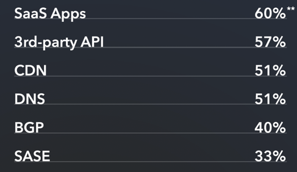

>英文报告 PDF 下载链接：[《2024 年 SRE 报告》](sre-report-2024.pdf)

## 前言

![前言作者：Steve McGhee [SRE, Reliability Advocate, Google]](2024-06-06_21-35-48.png)

当我在加州大学圣巴巴拉分校学习计算机科学时（加油，Gauchos！），我在校园的一个小部门做兼职系统管理员。我一边编程，一边管理：工作时我配置和更新机器，同时编写一个编译器。我拉以太网电缆，并尝试在 UDP 上添加 TCP 功能。我为一个跨校区的研究项目维护一个繁忙的邮件服务器，同时研究 Lamport 时钟。当时还没有 SRE 这个概念，但我已不知不觉中积累了相关知识和技能。

今天，当我看到人们对系统管理员、DevOps、SRE 或平台工程等重叠角色和头衔感到困惑时，我能理解他们的感受。SRE 来源于系统管理员和程序员。程序员编写产品代码，系统管理员负责“其他所有事情”。很难定义这些“其他事情”，我们往往会陷入其中。

SRE 用一个词“可靠性”来概括“其他所有事情”。与“鲁棒性”或“韧性”等类似词语相比，这可能会让人困惑，但我们暂且用“可靠性”来简化“保持系统运行”的概念。这与“防止入侵”（安全）或“构建受欢迎的产品”（产品）不同。随着团队的成长，每个领域都会有专门的人负责；专业化逐渐出现。职责和人员的复杂分工往往导致职责划分不明确。将这些团队独立建立起来，并固设定特定的职责是有诱惑力的，但如果这种方法行不通呢？你能打破这种孤立并不断进化吗？我们常认为是头衔和角色阻碍了我们进化，于是发明了新的头衔。但我们需要记住的是，改变的是工作内容，而不仅仅是职位头衔。

角色或团队范围等约束条件可以带来自由。知道你只需做到某个界限，之后由别人接手，可以让你专注于自己的工作。人们喜欢明确的职责范围。但当系统进化而约束和模型没有跟上时，会出现不协调和缺位，导致重复投入和成本。如何防止这种情况？我们可以关注端到端的成果，而不是一盘散沙式的一堆孤立的指标。我们可以跨越这些约束（组织架构）来进行度量，而不是局限于其中。看看你今天用来评估成功的指标。它们跨团队吗？它们对最终用户有意义吗？

在孤立的领域内度量的一个糟糕例子是：过度关注单一事物的效率或“好坏”。确保你考虑指标是否有意义，而不仅仅是它是否易于测量。例如，MTBF 和 MTTR 在机械系统中很受欢迎且有意义，但在复杂的数字系统中并不适用。在这些系统中，组件的失效不仅仅是由于一些常见的磨损模式，而是通过各种细微的失效模式（参见 Fred Hebert 的“柏拉图的仪表盘”）。如果我们不适当地调整约束和指标，最终会执行不再提供价值的操作。团队在合理的行动和过去认为“正确”的行动之间进退两难。当我们用错误的指标评估团队时，可能会导致琐事增多、人员倦怠，甚至造成实际伤害。

不要试图孤身一人的去完成这一切，要向他人学习。像这份报告这样的调查分析是很好的资源，但不要忘记运用批判性思维。知道你从哪里获得建议，不要在不了解的情况下采用模型。通过关注其他人在做什么、参加会议、订阅新闻简报，以及阅读和参与这样的调查和报告，你将更好地理解人类和机器的复杂系统，提高其可靠性。

请贡献并帮助建立这个实践社区，因为它需要许多不同的声音才能真正成功。阅读完这份报告后，我鼓励你与团队和社区分享你的想法。这如何改变你对过去的看法？你将来想做什么？你会帮助谁？谁会帮助你？我真诚地感谢 Catchpoint 每年继续进行这项研究，因为我们的社区在不断成长和适应，无论我们使用什么职位头衔。

## 简介

![简介作者：Mehdi Daoudi [CEO, Catchpoint]](2024-06-06_21-48-42.png)

在 Catchpoint，我们很荣幸再次呈现年度 SRE 报告，这一传统见证了我们在可靠性领域提供深入、独立评估的承诺。今年是我们报告的第六版，由 SRE 状态调查所收集的数据分析而形成。我们的参与者主要包括个人贡献者，同时我们也收到了来自各级管理层的可靠性领导者的反馈。

站点可靠性工程 (SRE) 在提升客户满意度、增强韧性和减少事故等方面的重要性毋庸置疑。我们的 SRE 报告提供了关于可靠性实际应用的独特见解，为您的商业对话提供宝贵的知识。

今年的报告，包括调查本身，得到了前所未有的社区参与和反馈。我们的贡献者普遍认为，对数据的解释会因读者的视角而异。因此，我们选择在本版中尽量减少建议性内容，而是以最纯粹的形式呈现数据，并辅以领域实践者的额外见解。我们相信这种方法既新颖又有启发性。

展望明年，我们期待看到许多《财富》2000 强公司任命首席可靠性或韧性官。随着每年在可观测性上的巨额投资，企业及其董事会必须将韧性维度纳入他们的战略中，类似于他们对安全性的重视，因为这同样具有重大的风险和回报。

## 关键见解

今年的报告分为七个部分，提供了对可靠性实践的新见解，并涵盖了广泛的主题。从 AI 的感知价值和从事件中学习的需求等热点趋势，到 SRE 的基本原理如工程活动所花费的时间，我们都进行了探讨。

### 失去控制带来了建立关系和学习的新机会

> 64% 的组织认为，即使这些端点不在他们的物理控制范围内，他们也应该监控那些影响生产力或用户体验的端点。罕见的是，各个组织层级在“需要战术性监控那些影响生产力或用户体验的端点”这一点上达成了一致意见，即便这些端点在他们的物理控制范围之外。

调查问题：你是否同意可靠性从业者应该战术性地监控那些影响生产力或用户体验的端点，即使这些端点不在他们的物理控制范围内？

图表解释：回答 7~10 分的为“同意”，回答 0~3 分的为“不同意”，回答 4~6 分的为“不确定”。

现代可靠性实践将越来越多地整合第三方服务。这对从个人贡献者到业务线所有者都有影响。软件开发和计算资源被作为服务购买，这也在更广泛的生态系统中产生了影响。

这些数据表明，行业认识到这种动态，并认识到在可靠性范围内纳入第三方服务的必要性。因此，可靠性工程必须适应这种多方协作的服务构建方式。

**额外的调查背景：**

有许多端点不在我们的控制范围内，当它们出现故障时，会对外部或内部产生影响（例如，影响生产力或客户体验）。例如，SaaS 应用（如 Microsoft 365/Google Workspace）、云间连接或家庭/住宅 ISP。

调查问题：你是否同意可靠性从业者应该战术性地监控那些影响生产力或用户体验的端点，即使这些端点不在他们的物理控制范围内（按职位等级划分）？

图表解释：职位等级分别是 - 个体贡献者、团队负责人、一个管理层、两个管理层

**可靠性是团队协作的结果。**

罕见的是，所有组织层级都一致认为需要战术性地监控某些端点，即使这些端点不在他们的物理控制范围内。和去年的报告一样，我们根据受访者的等级对各种问题的回答进行了细分。今年我们决定有选择地继续这样做。然而，由于三、四和五/五级以上管理层的受访者数量不足，我们不得不排除这些类别，以确保见解的有效性。

在调查中，一个管理层被表示为“我有一个级别的直接下属”，两个管理层被表示为“我有最多两个级别的直接下属”。换句话说，两个管理层意味着“一个有经理向其汇报的主管，以及向那个经理汇报的人员”。基于这一意图，我们发现随着组织层级的提高，对这个问题的认同度呈上升趋势。

调查问题：你或你的团队监控这些内容吗？

图表解释：总是、经常、偶尔、很少、从不、不确定

为了提升可靠性和韧性，监控策略中越来越需要纳入第三方供应商。毕竟，让 SRE 与第三方合作是解决问题的一种有效方法。

互联网的复杂网络基础设施（即互联网堆栈）中的任何单点故障都可能导致系统崩溃。随着互联网日益复杂，我们需要监控的内容也越来越多。

我们认为，这个可靠性工作的领域提供了一个新的机遇，不仅要与公司的“墙外”建立更好的关系，还可以增加对互联网堆栈中监控较少的领域（如 BGP 和 SASE）的了解。虽然在“你是否监控这些”问题中不可能列出所有可能的端点，但这一见解应被用来深化，或创建关于将第三方供应商纳入工作手册的对话。

**额外的调查背景：**

SaaS 应用指的是“由他人提供”；提供者可能在同一个组织内。例如，如果你不负责维护或支持 Microsoft 365/Google Workspace，你还会监控它们吗？SASE 指的是安全访问服务边缘。

**领域专家观察**

随着服务的不断进步，维护和运营关键组件的工作越来越多地外包给第三方供应商。这种控制力的流失导致了更加分散的架构。

通过将部分责任转移到组织边界之外，团队可以专注于核心能力，同时依赖他人在非核心领域的专业知识。这种动态通常是必要且有益的，因为它在复杂的社会技术系统中引入了新的工作方式，同时也带来了新的故障模式。“多方困境”描述了在相互依赖的各方之间，尤其是在时间紧迫且后果严重的事件（如事故）中，边界上所面临的挑战。大多数情况下，对这些供应商的依赖“刚好能用”。日常运维负担的大部分由一方处理，跨组织边界协调这些共享系统的负担通常较小。然而，在应对异常时，各方立即面临跨组织边界工作的挑战，包括协调成本增加、信息不对称和目标不一致的问题。

成功整合第三方供应商需要认识和接受新的故障模式和合作方式。虽然关于多方困境的研究仍在进行中，但初步发现指出了一些有助于管理这一新动态的活动，这些活动旨在增进互利关系，建立共享的参照框架，并减少信息不对称。在关键事件发生之前参与这些活动，可以帮助组织更成功地应对多方困境带来的挑战。

这些活动的例子包括：

* 通过联合演练或桌面演练，为准备跨边界事故做好准备
* 开发高效的双向通信手段
* 进行知识引导和专题深度探讨，识别系统间的松散耦合与紧密耦合关系，以及隐藏的故障传递依赖层
* 通过办公时间等渠道分享系统配置、健康指标（包括监控）和使用情况的额外背景信息，以及在共享流程（如初始故障排除步骤）上的协作

### SRE 不是平台工程，但它们都在发展相关能力

>44% 的组织表示，他们采用了按平台或能力划分的团队结构。
>随着公司规模的扩大，这种团队结构的使用趋势上升。

调查问题：您的组织在以下服务类别中使用了多少第三方供应商？

图表解释：没有、一个、一个以上（现在或未来）、不确定

工程活动可能包括开发工具、工作流程或相关能力。它们可能是供开发者使用，或提供给内部员工、团队成员，或增强第三方人员。

这些活动通常也会依赖第三方服务。基于缺乏控制这一主题，我们希望探讨对互联网堆栈部分使用第三方服务的情况，即使我们没有明确询问这些服务的最终用户。

例如，62% 的组织使用多个云提供商，这一点显而易见。再考虑一个可能使用第三方 API（例如用于身份验证）的平台能力，或者一个由第三方提供商前置的 DNS 解析工具。因此，团队需要考虑使用第三方供应商的关系和影响。例如，组织如何监控这些互联网堆栈组件，当它们出现故障时会发生什么，以及它们是否提供随着业务需求变化而调整的灵活性。

调查问题：这些团队结构是否在你的组织中使用？

图表解释：

* 集中支持各种产品/服务、平台和/或堆栈组件
* 按产品或服务划分；例如，我们有一个专门的团队支持我们的地图产品
* 按平台或能力划分；例如，我们有一个专门的团队在我们的云平台上开发功能
* 按堆栈组件划分；例如，我们有一个专门的团队维护应用程序或基础设施堆栈

SRE 和一般的可靠性实践具有多层次和多维度。我们询问了受访者关于组织中使用不同团队结构的情况，并允许他们提供多个示例类型。超过一半的受访者表示他们有集中化的团队，而另有 51%（部分可能重叠）表示他们的团队按业务产品或服务划分。44% 的受访者提到按平台或能力划分的团队。然而，按公司规模细分时，这些数据的趋势有所不同（见下一页）。

除了团队结构外，文化或其他因素也可能影响不同公司如何应对新的问题或挑战。

调查问题：您的组织中是否使用了这些团队结构（按公司规模）？

图表解释：公司规模分别是 100 名员工以下、101-1000 名员工、1001-10000 名员工、超过 10000 名员工

可靠性从业者本质上既执行操作活动也进行工程活动。他们可能会响应事件，也可能会开发自动化功能以提高工作效率。

在这个图示中，随着公司规模的增加，集中化团队结构的使用呈下降趋势，而“按平台或能力划分”的使用呈上升趋势（“按产品或服务划分”的使用也随着公司规模的增加而上升）。我们明确表示，按平台或能力划分的结构并不等同于平台工程。然而，我们希望这些数据可以作为企业讨论平台工程时的参考。

**领域专家观察**

站点可靠性工程师会开发各种资产来简化他们的工作。这些资产可能包括工具（什么是工具？），脚本，文档，工作流程等。当他们为自己开发时，可能不太注重优雅，因为功能比形式更重要。但是，如果一个资产能够提高效率，考虑一下它是否能为原始团队之外的其他团队提供能力，并将其分享给组织中的其他成员。

将能力提供给组织其他成员的概念并不是为了区分站点可靠性工程师、平台工程师或其他角色，而是为了让组织更好。如果任务是根据成功的倾向来分配的，这比任何标签、头衔或名称都重要。

最终，我们都是在解决问题。最适合解决这些问题的人应该参与路径的创建。头衔无关紧要，无论他们是 SRE、DevOps 工程师、产品经理还是市场传播者。相反，当某种结构化的好处在可度量和具体的结果中显现时，那就是成功。

### 从事故中学习是一个普遍的业务机会

> 47% 的人认为，从事故中学习（LFI）在整体事故管理活动中有最大的改进空间。这一数字并没有随着公司规模的增加而显著变化。

调查问题：在过去的 30 天内，你或你的团队响应了多少次事故？

图表解释：非工单/无跟踪、工单/跟踪； 没有、十多个、100、1000、10000

问题不在于你是否需要响应事故，而在于你何时会响应事故。为了理解学习的重要性，我们首先想了解事故响应工作的量级。

我们发现，71% 和 84% 的 SRE 每月分别响应数十次或数百次非工单和工单事故。

调查范围故意设定得很大，如数十次、数百次和数千次。这意味着百分比的差异比看起来更大。

由于非工单事故的数量很大（数十次和数百次），可靠性从业者的工作可能没有得到充分的认可。鉴于（我们稍后会探讨）对工作的自豪感是大多数 SRE 的动力，这需要在组织层面深入研究。

调查问题：最近的事故中哪些部分最难处理？

图表解释：

* 检测事故的发生
* 诊断问题
* 升级或协调责任方
* 解决问题
* 验证修复是否成功
* 证明事故不是我们的责任
* 花时间从事故中学习
* 说实话，这些都不是

在审查这个问题的答案时，重要的是要记住，管理事故的各个环节并不是线性进行的。

不过，我们尝试提供了一个典型事故管理响应的顺序。

迄今为止，被认为最难的部分是准确诊断问题，其次是升级或协调责任方。有趣的是，解决实际问题排在第四位。

调查问题：在你的组织中，哪些事故最受关注？

图表解释：

* 对客户有广泛影响
* 高严重性
* 高度可见的公共事故
* 对领导层重要
* 持续时间长
* 令人困惑或惊讶的事故
* 其他

毫不奇怪，影响最大的事故通常最受关注。然而，我们认为，令人困惑或惊讶的事故应该排在更高的优先级。

为什么？因为这些异常事故往往代表了组织知识的空白，从中可以学到很多。

有韧性的团队认识到，调查那些让 SRE 感到惊讶或难以入眠的事故是很重要的。即使这些事故对客户影响不大或严重程度不高，他们也会进行调查。因为虽然这次影响不大，但它们可能是下一次重大停机的早期预警。

调查问题：在你的组织中，哪些事故最受关注（按公司规模）？

图表解释：雇员数量分别是 100 名员工以上、101-1000 名员工、1001-10000 名员工、超过 10000 名员工

* 对客户有广泛影响
* 高严重性
* 对领导层重要
* 持续时间长
* 令人困惑或惊讶的事故

与其他问题一样，我们将这一问题的回答与公司规模进行了关联。有趣的是，小公司表示对领导层重要的事故得到了较多关注。相比之下，随着组织规模的扩大，这种趋势下降。这是否意味着在大公司中 SRE 与高层领导之间的沟通正在减弱？还是因为领导层离事故较远，因此关注较少？这可能是因为有效的可靠性工作让他们不需要担心事故，或者因为他们与日常工作距离过远。

调查问题：在你的组织中，谁负责领导或推动事故后的工作？

了解谁领导事故后的工作以及其在 SRE 工作中的普及程度为什么重要？主要是为了资源分配。

SRE 在不同公司规模中领导事故后工作的事实表明，他们需要有专门的时间参与事故后的工作。同时，其他团队也时常在事故后工作中担任领导角色，这显示了跨学科合作的价值。事故后工作的领导者可以影响学习的方向和重点。

完整的部门参与比例：

* SRE 44%
* 管理层 32%
* 其他工程师 32%
* 专门的事故团队 21%
* 产品团队 9%
* 客户支持 7%
* 其他 6%
* 业务分析师 3%
* 市场营销 2%
* 法务 1%

调查问题：在你的组织中，谁领导或推动事故后的工作（按公司规模）？

当我们将公司规模与此相关联时可以看到，随着公司规模的增长，专门的事故团队的使用呈上升趋势。更多的资源意味着更有可能设立专门的小组来处理事故响应工作。相比之下，只有 3% 的小型组织有这种专门的团队，而超过 1000 名员工的公司中有三分之一拥有这样的团队。

采用“卓越中心”或“实践社区”的方法可以带来显著的好处，如更明确的目标、更高的效能、更清晰的焦点以及对问题的深入了解。

此外，在当今快速发展的环境中，尽可能广泛、清晰和简洁地分享从事故后工作中获得的最佳实践信息（专门的事故团队将有时间和职责来这样做）将使整个组织受益。

调查问题：您的组织花多少时间从事故中学习？

图表解释：对于重大事故和非重大事故，分析没有、少于应有的量、适量、多于应有的量、不确定 的情况

我们可以看到，组织花在从重大事故中学习的时间比从非重大事故中学习的时间更多（“适量”和“多于应有的量”）。虽然重大事故在当前优先得到处理是可以理解的，但我们认为从非重大事故中学习的普遍投资不足是一个错失的机会。

从非重大事故中学习的时间应该有效地为团队应对重大事故做好准备。那些在没有高压、没有高层或客户关注的情况下发生的事故更有利于学习（记住，学习发生在事故期间以及前后）。这就是为什么我们认为非重大事故中“没有”和“少于应有的量”的高比例代表了可靠性从业者的巨大机会。

调查问题：你或你的团队在事故后的工作中，通常多少部分集中在以下方面？

图表解释：对“没有或轻微、中等或重大”级别的事故进行了后续活动分组。

* 识别行动项
* 理解系统性问题/组织学习
* 完成所需文档
* 增强个人学习
* 整合每月事故指标

在事故后工作的重点上，我们发现“增强个人学习”（近 70% “没有或轻微”）排在倒数第二，而“识别行动项”排在首位（65% “中等或重大”）。为什么会这样呢？

研究表明，专注于“做什么”往往会抑制与学习相关的反思性工作。在事故后响应中，若公司更关注组织利益而非工程师和个人响应者的需求，那么这些以组织为重点的活动如果没有切实影响到个人工程师的需求，可能会无意中削弱韧性。

例如，专注于文档、指标或行动项的事故后工作，其好处通常是针对离“键盘”较远的人，意味着它们对组织有更广泛的好处，但由于它们不有助于个人学习或识别系统性障碍，因此会削弱韧性潜力。

调查问题：在哪些事故领域中你的组织最需要改进？

图表解释：

* 强调学习而非修复
* 跨事故分析
* 完成行动项
* 创建行动项
* 促进无责事故回顾
* 撰写报告
* 说实话，没有需要改进的领域

可靠性从业者似乎已经意识到在个人层面从事故中学习存在问题。

在回答组织需要优先考虑什么时，最常见的答案是“强调学习而非修复”。团队如何在组织层面改变心态，以便从事故中实现更大的个人学习（以及公司的长期韧性）？

有趣的是，完成行动项比创建行动项排在更高的位置。我们可以创建所有我们想要的工作任务（“创建行动项”），但如果不去执行它们（“完成行动项”），任何列表都是毫无意义的。为了避免“不能什么都不说，所以必须说些什么”的情况，我们需要确保行动项有价值、可实现，并被适当优先处理。

调查问题：在你的组织中，哪些事故领域最需要改进（按公司规模）？

图表解释：雇员数量分别是 100 名员工以上、101-1000 名员工、1001-10000 名员工、超过 10000 名员工

回顾各组织在事故管理方面最需要改进的领域，无论公司规模大小，可靠性从业者最常提到的是“强调学习而非修复”。如你所见，随着公司规模的增长，这一回答没有显著变化。这表明，从事故中学习（LFI）是一个普遍的商业机会。

在排名较低的项目中，有趣的是，大型组织在跨事故分析方面的差距更大，而在“撰写报告”方面的差距比小型组织小。这可能反映出大型组织处理的事故更多，因此更需要完成“文书工作”。

**领域专家观察**

在复杂的现代软件环境中，事故是日常工作的一部分，问题不在于事故是否会发生，而在于何时发生。因此，能够快速有效地从事故中学习是 SRE 工作中的一个关键部分，也是一个热门话题。有效的事故后活动可以减少意外，通过增加响应人员对系统在不同条件下如何响应的了解，从而更有效地处理未来的事故。这些见解能确保响应团队具备灵活应对困难和意外事故的必要知识，推动未来的韧性响应。

投入时间、工具和精力为团队创造条件，更有效地从事故中学习，表明您的组织认识到待命工作的压力和技术要求。这显示了公司致力于确保响应人员做好充分准备，并得到支持以应对挑战性事件。

在当今的生态系统中，管理事故越来越多地涉及跨组织边界的有效合作，以确保获得必要的系统访问权限，并汇集内部和外部的专业知识。这部分原因是由于对第三方的依赖增加。这意味着高效的事故解决不仅仅是熟练处理技术问题，还需要在所有相关方之间进行有效协作。考虑技术和协作方面的事故处理的事故回顾有助于改进团队在压力、不确定性和时间压力下的合作方式。它们提高了对技术故障源和预期系统性能的理解，增加了团队成员之间的理解，因为他们对彼此的技能和知识有了更多的了解，可以在未来的事故中更好地协调工作。

随着软件系统速度、规模和复杂性的增加，SRE 需要具备能够快速灵活地应对新颖和非结构化问题的深厚技术知识。提高您的组织从事故中提取有意义学习成果的能力，是对未来可靠性和关键人员更高保留率的投资，因为这使待命工作成为站点可靠性工程工作中更易管理、压力更小的一部分。

### AI 短期内不会取代人类智能

>4% 的受访者认为 AI 会取代他们。
>53% 的受访者表示 AI 会“使我的工作更轻松”。
>对 AI 影响的看法因组织级别而有所不同。

调查问题：在未来两年内，AI 将对你的工作或角色产生什么个人影响？

图表解释：

* 使我的工作更轻松
* 改变我所做的工作类型
* 减少我的工作量
* 我不确定会有什么影响
* 没有影响
* 增加我的工作量
* 使我的工作更困难
* 取代我

自上次报告以来，我们看到了大量关于 AI 的报道。然而，目前社区认为 AI 在未来两年内不会取代人类智能。

完全负面的情绪很低：只有 4% 的受访者选择了“AI 会取代我”，15% 的人表示 AI 要么会增加工作量，要么会使工作更困难。换句话说，AI 现在被认为是有助于完成工作的。

值得注意的是，有 25% 的人回答说他们不确定 AI 的可能影响。这里还有很多已知和未知的未知因素。

调查问题：在未来两年内，AI 将对你的工作或角色产生什么个人影响（按级别）？

图表解释：个人级别分别是个体贡献者、团队负责人、一个管理层、两个管理层

在另一个级别分歧的例子中，AI 在未来两年内的预期影响因组织级别而异。例如，高层管理人员更倾向于认为 AI 会使他们的工作更轻松（43%），并且对其影响的不确定性较小（10%），而个体贡献者的信任度较低（分别为 26% 和 18%）。

在涉及 AI 的更大业务战略时，将有许多决策需要做出。偏见、社交媒体和营销的影响、大量数据（可能不会转化为有价值的信息）等因素也可能会模糊或延迟决策。对于参数明确的现有业务模型，增量式改进可能更容易成功，特别是在生产领域。然而，现实是我们正在处理只部分了解的技术，关于可持续价值的真正来源有许多根本上不可预测的因素。

调查问题：在未来两年内，人工智能（“AI”）在以下活动中的作用将有多大？

图表解释：对下面的工作感觉 “完全没有”或“稍微有点”、中等、很大或非常大、不确定。

* 容量管理
* 写代码
* 事故管理
* 服务水平管理
* 发布管理

在用于生成《SRE 报告 2023》的 SRE 状态调查中，我们询问了受访者从 AIOps 中获得的价值（偏向于没有或较低的价值）。然而，对于《2024 年SRE 报告》，我们决定将问题扩展到 AI 的整体应用，并添加“在未来两年内”的限定。

“写代码”和“容量管理”在“很大或非常大”有用的选项中各占 44%。鉴于生成式 AI 的巨大增长，“写代码”成为最受欢迎的回答之一并不令人意外。

所有给定类别都得到了认可（事故管理为 38%，服务水平管理为 33%，发布管理为 27%）。然而，事故管理和服务水平管理的“中等”选项的下降可能表明这些用例的观点两极分化。

调查问题：你的工作中平均有多少百分比是琐事？

图表解释：《2023&2024年 SRE 报告》中位数琐事值

Google 将琐事定义为:与运行生产服务相关的工作，通常是手动的、重复的、可自动化的、战术性的、缺乏持久价值的，并且随着服务数量的增长而线性扩展。我们并不认为之前的 AI 影响问题和这个琐事问题之间存在因果关系。然而，我们在这里提到它是因为 AI 与自动化的关系。

编辑注：我们认为这种中位数琐事百分比的变化不是因为 ChatGPT 或其他 GenAI 资产。用于生成此报告的调查数据是在 ChatGPT 发布大约八个月后完成的。

在用于生成此报告的调查中，我们开放式地问了一个问题：“什么是阻止你自动化更多手动、重复工作负载的最大障碍？”按照本报告部分的精神，我们然后请求一个 GenAI 资产对答案进行分类（见下一页）。

**Bing 聊天在 2023 年 11 月的回应：**

你能将这些答案分类吗？你能给出每个类别的百分比吗？你能给出每个类别的答案吗？

我根据答案的内容和格式将其分为几类。以下是每个类别的百分比及其示例答案：

* 资源限制：38.3%。这些答案提到缺乏时间、资金、人员、工具或能力来实现全面自动化。通常表明自动化不是当前的优先事项或可行的选项。一些资源限制的示例答案包括：缺乏领导层的时间和优先级分配、预算、缺乏工程能力来消除琐事、缺乏时间寻找合适的解决方案、积压和能力不足
* 技术挑战：34.0%。这些答案提到系统、流程或数据的复杂性、可变性、依赖性或遗留问题。通常表明自动化需要大量的工程努力、专业知识或合作来克服技术难题。一些技术挑战的示例答案包括：复杂和动态的数据源、依赖地狱、不一致的代码库、缺乏功能性 API 的依赖项、遗留基础设施
* 人为因素：14.9%。这些答案提到涉及自动化的人的恐惧、抵抗、文化或知识。通常表明自动化需要改变心态、行为或沟通，以获得信任、接受或支持。
一些人为因素的示例答案包括：害怕改变长期运行的系统、团队缺乏认同、恐惧文化、缺乏组织沟通与合作、缺乏自动化知识
* 其他：12.8%。这些答案不属于上述任何类别，或过于模糊、含糊或无关紧要而无法分类。一些其他的示例答案包括：一切都不能自动化！、变化太大、ITGC、库存使用、基于例外的使用案例

我希望这能帮助你理解自动化的常见主题和挑战。

**领域专家观察**

很难判断这是另一个 AI 炒作周期，还是之前炒作的进一步加剧，但感觉在 AIOps（推广中细节不足）和 GenAI 之间确实存在一些本质上的不同。

AIOps 在某种程度上（仍然？）专注于异常发现和分析，非常符合指挥和控制框架。它是常规业务的加速器。而 GenAI 可以在该框架之外独立运作，因此将其视为另一个固定范围的工具似乎并不合适。它更像是一个非常初级的同事，需要培训、投资和不断的审查，但有时会非常有价值。

从概念上讲，我们会开始用它以特定方式改进我们熟悉的现有事物，因为渐进式改进使复杂性更易于处理——但可以肯定的是，更大规模的方法也将会出现。

### 谈到服务水平，小公司无知即幸福

>24% 的组织在过去 12 个月内违反了约定的服务水平协议（根据 2023 年 6 月/7 月的调查数据）。
>服务水平违约的数量随着公司规模的增加而上升。

调查问题：你或你的团队今天监控或度量哪些指标？

图表解释：

* 正常运行时间/可用性
* 性能/响应时间
* 延迟
* 错误率
* 吞吐量（例如，MB/s 或每秒请求数）
* 未经授权的请求
* 饱和度

调查问题：你监控或度量的指标是否与任何服务水平目标（SLO）相关？

图表解释：对 Uptime SLO 和 性能 SLO 的使用率，如图。

* 始终（42%）
* 经常（48%）
* 偶尔（37%）
* 很少（33%）
* 从不（36%）
* 不确定（3%）

服务水平指标是确定适当服务水平目标的基础。这些目标不应在孤立情况下决定，而需要多方利益相关者的输入。

因此，我们询问了监控或度量的指标。自 2022 年我们提出这个问题以来，监控或度量的前三个指标没有变化。正常运行时间仍然是最广泛监控的指标，性能/响应时间紧随其后。

看到与性能相关的 SLO 使用率如此之高（性能 SLO 的“经常”和“始终”使用率明显高于“从不”或“很少”）非常有意义——并且基本上与正常运行时间的 SLO 相当。如果“慢”是新的“停机”，那么可靠性从业者正在相应地调整他们的可靠性策略。

调查问题：在过去的 12 个月中，你的组织是否违反了任何合同 SLA？

图表解释：

* 没有（我们达到了）
* 没有（我们故意装不知道）
* 是的
* 我不知道
* 不愿回答

调查问题：SLA 违约对你的组织造成了什么财务影响？

图表解释：没有 轻微 中等 高 极端 不知道。

我们给受访者留了相当大的空间来说明他们的组织是如何满足约定的 SLA 。虽然“没有（我们达到了）”是最常见的回答，但有 15% 选择了“没有（我们故意装不知道）”。

事实上，许多组织直接表示他们在过去一年中违反了约定的 SLA，这让我们感到惊讶。我们也在想，那 10% 选择“不愿回答”的人是否实际上意味着“是的”？

无论如何，服务水平指标、目标和合同协议是与业务互动的关键工具（因此我们将它们包含在本报告的这一部分中）。

关于业务互动，很多受访者并不知道 SLA 违约的财务影响，这点非常令人担忧。这种知识缺乏可能是故意无视的一部分，但也可能表明 SRE 专注于目标而业务专注于合同条款。

这是唯一一个关于违约影响的问题，并未考虑品牌、声誉、信任或时间成本等其他方面的影响。

调查问题：在过去的 12 个月中，你的组织是否违反了任何合同 SLA（按公司规模）？

让我们分析一下 SLA 违约与公司规模的关系。有趣的是，随着公司规模的增加，故意装不知道的部分显著下降。随着公司规模的增加，选择“是的”的比例上升，而故意装不知道的部分相应减少。

服务水平指标（SLI）、服务水平目标（SLO）和服务水平协议（SLA）彼此之间有密切的关系和依赖。虽然企业更关注协议中的条款，但这些企业希望可靠性从业者能投资于监控或度量服务水平指标，并将其与既定目标进行对比。

**领域专家观察**

能力是连接监控和度量指标（光谱的一端）与可靠性和业务成果（光谱的另一端）的桥梁。管理服务水平并回答诸如“我们是否在速度和可靠性之间保持健康的平衡？”的问题就是一个例子。

在过去 12 个月内，大约 25% 的组织违反了约定的 SLA（调查时）。因此，强调使用服务水平指标和服务水平目标的重要性尤为关键。虽然许多人将核心正常运行时间和性能作为监控或度量的指标，但我们真正需要度量的应该是客户（包括你的员工）的体验。

我们都面临着诸多挑战和限制。比如决定投资哪些工具或每天只有 24 小时。当今天的投资在很久以后才能体现价值时，很难证明其合理性——这就是典型的领先指标与滞后指标的对话。

归根结底，服务水平指标和目标是可靠性实践的关键组成部分。它们为预算提供依据，使我们能专注于重要目标。虽然服务水平协议充满了术语，但重要的是要记住它们的双向作用。一方面，供应商或服务提供商使用它们来为客户设定期望，确保是否达到了期望。另一方面，客户使用它们来追究供应商和服务提供商的责任。

### 靠某一个监控工具不可能完成所有任务（并在暗处统治着一切）

>66% 的组织使用 2-5 个监控或可观测性工具。
>随着公司规模的增加，使用的监控工具数量也随之上升。

调查问题：你的组织使用多少个监控或可观测性工具？

由于许多组织使用多种工具，可以推测这些工具有其价值。换句话说，不要让讨论偏向“堆栈中有太多工具”，而是应该关注“这些工具带来的价值是否大于它们的成本（成本可以有多种形式）”。

调查问题：你的组织使用多少个监控或可观测性工具（按公司规模）？

随着公司规模的增加，使用 2-5 个工具的比例下降，而使用 6 个或更多工具的比例上升。由于使用多种监控工具的主要原因是功能性需求（见下一页），我们建议在讨论工具价值时采用“多样性带来韧性”的策略。【*由于样本量小，零工具未包含在分析中。】

调查问题：为什么你的组织使用多种监控或可观测性工具？

图表解释：

* 它们监控不同的内容
* 它们在不同情况下或用例中有独特的功能
* 我们的组织是孤立或分散的
* 一些工具从未正确停用
* 我们的组织有鼓励选择的文化
* 它们监控监控工具
* 我们的组织有不同的信念（例如，自建与购买）

我们看过其他研究问‘你们使用多少监控工具？’，但我们还想进一步问为什么。排名前两位的回答是‘它们监控不同的内容’（70%）和‘它们在不同用例中有独特的功能’（54%），这表明没有一款工具可以监控所有内容。基于这些发现，我们建议对任何供应商关于工具整合的言论持怀疑态度。具体来说，讨论不应仅仅为了整合而整合工具。

此外，在讨论工具价值时，确保技术债务或其他债务也是讨论的一部分。虽然‘一些工具从未正确停用’只是使用多种监控工具的第四大原因（30%），但这表明了债务的积累。换句话说，遗留工具可能不会增加价值。更糟的是，它们可能通过团队间沟通问题、遗忘的维护合同、人工维护，或导致警报疲劳的形式减少价值。

调查问题：在过去的 12 个月中，你的组织是否违反了任何约定的 SLA（按监控工具数量）？

在为工具采购或自建资源投资辩护时，可靠性从业者可能难以传达业务价值。一方面，他们知道既定的正常运行时间和性能目标，但也知道没可能靠某一个工具可以监控所有内容，因此多种工具的需求可能永远存在。另一方面，业务负责人总是会关注成本。

我们进行了这项调查，以研究监控工具数量与 SLA 违背数量的关系，举例说明如何进行新的或更好的业务对话。在这组数据中，随着监控或可观测性工具数量的增加，“是的，我们违背了约定的 SLA”的回答呈下降趋势。基于此，可以更容易地确定 SLA 违约的成本，然后将其与工具的成本进行比较。

请注意，这只是一个例子。一些组织没有正式的服务水平协议。在这种情况下，讨论将围绕创收应用程序进行；无论如何，讨论首先应该围绕解决问题和创造价值展开。

调查问题：你的监控或可观测性框架使用哪些遥测数据源？

图表解释：

* 基础设施；例如，服务器、数据库、虚拟机管理程序或存储的利用率指标
* 应用程序；例如，安装代理以发现组件或执行跟踪
* 网络；例如，流量、SNMP 或数据包捕获
* 前端体验；例如，合成事务或探测器，或放置真实用户标签
* 客户端设备；例如，从任务管理器或活动监视器获取的数据
* SaaS 应用监控；例如，如果你不是 Microsoft/Google，你是否仍然监控 M365/Workspace
* 业务 KPI；例如，网站转换率或 NPS 分数
* 公众情绪/社交媒体；例如，社交平台上的推文或呼叫
* 竞争基准测试；例如，比较你的网站性能与竞争对手的网站性能

除了监控工具的数量，我们还想探讨其类型。根据之前的问题，基础设施（76%）和应用程序（67%）是最常被选择的。这些以及网络和前端体验也是去年最常见的类别。我们还新增了两个类别：SaaS 应用监控和业务 KPI。每个类别可能需要不同的监控工具。

调查问题：[推导] 对于使用多个监控工具的组织，有多少种不同类型的遥测数据源为你的监控或可观测性框架提供数据？

根据之前的问题“哪些遥测数据源为你的监控或可观测性框架提供数据”，我们推导出这些框架有多少种类型的遥测数据源。例如，如果一个受访者选择了“应用程序监控”和“前端体验监控”，那么在图表中就会标记为两种数据源。

如你所见，这个图表强化了“它们监控不同的内容”作为“为什么你的组织使用多种监控或可观测性工具”的首要答案。

**领域专家观察**

显然，监控和可观测性能力以及数据驱动决策的价值是无可置疑的。随着这些能力需求的增加，涵盖应用堆栈、基础设施堆栈、互联网堆栈等多个方面，将越来越需要解决“监控不同内容”的问题。

拥有多个工具不可避免地会引发关于冗余和投资回报率（ROI）的讨论。当这些讨论发生时，应引导其理解所获得的价值是否大于成本，或至少了解这些能力在讨论中的作用。例如，如果一个监控工具或平台本身支持服务水平目标跟踪，那么就不必自己构建和维护它。

考虑到之前关于控制和第三方的见解，OpenTelemetry 将如何影响这场讨论将会很有趣，特别是与第三方支持相关的部分。如果这样的开放标准能带来更好的所有权、管理或联合合作，也可能会影响所获得的价值。不管怎样，它们需要被纳入你的遥测流水线。

关于使用多个监控工具的问题：我在这方面是孤单的吗？这完全不必担心。随着我们的环境变化，我们的流程和实践也会变化。如果使用多个工具能提供额外的背景信息，从而更快地识别和解决事故，那么采用多管齐下的方法可能是明智之举。

### 效率是自豪感的敌人

>63% 的人表示，对工作感到自豪是他们最看重的。
>然而，不幸的是，随着受访者职位的升高，这一比例在下降。

调查问题：以下哪一项对你最重要？

图表解释：

* 对工作的自豪感
* 高效
* 有能力
* 受尊重
* 专业领域专家
* 受喜欢
* 被惧怕

业务重要性经常在市场研究中讨论，但我们认为讨论个人层面的重要性也很关键，因为没有人，企业就无法存在。虽然我们很高兴看到效率排名很高，但更高兴的是“对工作的自豪感”占据了首位。绝大多数人表示，对工作感到自豪——紧随其后的是高效——是最重要的。

调查问题：以下哪一项对你最重要（按职位等级）？

虽然总体上大多数人认为对工作感到自豪最重要，但这种观点因职位等级而异。职位越高，表明对整体业务绩效的压力越大，他们需要注意不要在日常工作中忽视自豪感、能力和尊重的重要性。

调查问题：你参与轮班值守吗？

图表解释：是的、不是、我只参与升级

如同往年一样，这里是我们的基准数据，展示了 SRE 时间的投资方式。我们建议你将其与运营与工程活动的平衡进行比较。正如 Google 提醒我们的那样，保持 SRE 运营在控制之内的重要性在于避免任何 SRE 组织或子团队无意间变成纯粹的运营团队。了解你的时间分配并将其与同行进行比较，对于将个人和团队转变为“时间投资”的心态至关重要。

调查问题：你参与值班轮换吗（按职位等级）？

随着职位等级的增加，参与值班轮换（与“我只参与升级”区分开来）的比例下降。这对我们来说很合理。

更高职位的权衡可能包括技术技能的退化，但同时也带来了更好的业务敏锐度。无论如何，请记住，我们不只是花费时间，而是在投资时间。

调查问题：在一个典型的工作周中，当你不值班时，大约多少时间用于工程活动？

调查问题：在一个典型的工作周中，当你不值班时，大约多少时间用于运营活动？

在所有调查受访者中，工程活动和运营活动的时间中位数分别为 50% 和 25%。

调查中列出的工程活动示例包括“写代码”和“开发自动配置功能”。列出的运营活动示例包括“响应告警”和“手动启动新主机/实例”。

我们通常以分布图的形式呈现这些数据，因为我们相信单一的平均值可能会掩盖真实情况。

调查问题：在一个典型的工作周中，当你不值班时，大约多少时间用于响应中断？

不可避免地，我们都会遇到有人拍肩膀或发通知，问“嘿，你有时间聊一下吗？”或“嘿，你能参加这个电话吗？”更糟糕的是，这些中断可能会让我们完全切换上下文，从而增加中断时间。

这是我们第二年提出这个中断问题。中位数时间为 15%（组织级别越高，自报的中断时间越多），低于 2023 年 SRE 报告中的 20%。考虑到处理事故中大量非记功的工作，值得怀疑这个自报数字实际上是否更高。

调查问题：实现成功可靠性实施的主要障碍是什么？

图表解释：

* 成本或预算
* 对齐或优先级
* 管理架构复杂性
* 展示业务价值
* 学习、培训或教育
* 平衡速度与可靠性
* 缺乏认同
* 人才招募或保留
* 沟通或协作
* 缺乏端到端的可见性

可靠性从业者认为，成本或预算是实现成功可靠性实施的最大挑战。这也是为什么我们在第六条见解中提到，需要围绕 SRE 工具和业务价值进行不同类型的对话。

紧随其后的是“对齐或优先级”，这也说明了 SRE 需要与管理层进行价值导向的对话，以更好地实现他们的可靠性优先级。

调查问题：可靠性工程实践增加业务价值的主要方式有哪些？

图表解释：

* 提高运营效率
* 改善客户体验或满意度
* 提升品牌信任度、诚信或声誉
* 缩短维修时间
* 提高员工生产力
* 降低总拥有成本
* 保留现有客户或收入
* 增加业务速度或竞争力
* 避免 SLA 罚款
* 增加新客户数量或收入

企业需要人来创造或维护收入。反过来，人们需要健康的企业来支付他们的租金和房贷。这就是为什么通过业务视角来考虑基于结果的对话很重要。

“提高运营效率”是可靠性工程实践增加业务价值的首要方式，紧随其后的是“改善客户体验或满意度”。

去年我们以开放式问题询问时，主要回答是“降低成本”和“改善客户体验、情感或满意度”并列第一。

我们希望可靠性领域的各个级别都能利用本报告中的数据和背景，通过数据驱动的对话来指导一致的决策。

**领域专家观察**

SRE 是网站和服务可靠性背后的无形力量。个人的成功往往体现在大量的指标中，但对工作感到自豪常常是唯一的动力源泉。我们都在寻求个人成就感和使命感。对项目或复杂问题的高质量、创新性贡献能够带来深刻的成就感，同时也挑战并推动我们不断成长。

对于管理者而言，挑战在于平衡团队成员的激励和发展、战略努力、运营问题和行政任务之间的时间分配。这要求我们减少时间、精力和资源的投入。但具体在哪个领域？如果作为 SRE 经理，对工作的自豪感等同于对团队成功的自豪感，那么在关注团队激励和发展时是否应该追求效率？尤其是当“对工作感到自豪”是 SREs 最重要的？

组织如果能够减少行政任务，腾出更多时间进行沟通技巧、教练技能和战略思维技能的培训，将大大受益。这将把心态从追求效率转向追求效能，从而提升团队的价值，并增加团队成员的自豪感。

## 明年再见

当我想到控制，我想起了在 Ask.com（前身为 Ask Jeeves）担任生产运营团队成员的时光。我们与 Google 有合作关系，Google 广告调用是我们最常监控的端点之一。为什么？因为当这个调用出现问题时（即当我们的收入来源之一出现问题时），我们的 CEO 会来到我们的办公室，而不是 Google 的，问什么时候能修复。当涉及到依赖我们无法控制的外部事物时，我看到事故发生时双方的立场分歧。一方面，我看到那些充满同理心的人，他们理解这些东西能正常运作已是奇迹。但我担心这种同理心可能会被滥用，这可能是另一方存在的原因：冷漠的人。这群人可能是有意或无意的。像大多数情况一样，这些对立的力量应该帮助我们找到平衡（至少我希望如此）。

还有很多其他维度或层次需要考虑（是的，可靠性从业者和实践就像洋葱）。这份报告也很好地按一些维度（如组织级别或公司规模）进行了分解。但还有许多其他维度。例如时间维度。如果你调查了 100 个人，那么你会得到一组见解。如果你在一年后再次调查这 100 个人，那么你可能会得到另一组见解。因此，在阅读（并希望重新阅读）这份报告时，请考虑这些和其他情境，以更好地理解报告中的内容。

我很自豪能为这个更大的社区贡献这份报告。但如果你问我“在这份报告上工作时，哪一个对你来说最重要？”，我的回答是感激。我会这么回答，因为是这个社区使这份报告成为可能，我很感激能成为其中的一部分。

我期待 2025 年的 SRE 报告。它无疑会包含新的见解、故事和惊喜。来吧！

## 后记

> Steve McGhee

我们希望只做足够的可靠性工作让客户满意，不要做得过多。我们希望避免“优化陷阱”，专注于真正阻碍我们的因素。但我们如何知道该怎么做呢？我们通过进化和适应来专注于结果。不要过分关注工具重叠和团队“越界”的问题。预期复杂的人机系统会产生新兴行为，并做好应对准备。不要把任何事情固定不变。记录你做决定的理由，即使理由只是“我们猜的”。确保人们知道在做决定时，其他人知道（或不知道）什么。赋予团队改变系统的权力。新员工和老员工有不同的顺从或遵守的理由；确保你关注这两者。让团队发现这些理由，并质疑它们是否仍然相关（或曾经相关）。预算持有者，让你的团队知道他们的开支是多少。让他们知道其他团队的开支。给他们数据、激励和明确的结果，让他们可以做出良好的系统级决策。

领导者，让报告事故变得安全。不要通过要求减少事故来激励团队隐瞒事故。目标是了解受影响系统的性质。我们“从事故中学习”，而不是“关于事故学习”——通过其可观察的问题了解系统。我们能完全了解我们的系统吗？它们以千兆赫的速度运行，遍布全球，我们怎么能做到？事故是了解你以为已经理解的事物的新途径；不要错过这个机会！

认识到新兴行为，并理解虽然它是不可预测的，但你可以适应它。适应新的故障模式是 SRE 的核心，这些是复杂、社会影响系统的新管理者。这是一种很大的责任，但要准备好，因为更多的挑战正在到来：AI。那些与新 AI 系统一起构建产品的人将面临新的挑战，他们需要一种新的思维方式：不期待预定义的最佳实践或已知故障模式的分类，而是愿意探测、感知和应对这些复杂系统，永远如此。这些系统不会取代 SRE，但 SRE 必须适应它们。

你已经知道不要“瀑布式”管理 SRE。抵制提前定义理想可靠性的诱惑。相反，利用你在这里和其他地方学到的知识，从事故中了解你的系统，并让你的团队变得更加适应。

## 调查人群统计

为本报告提供见解的 SRE 调查在 2023 年 6 月和 7 月的六周内进行。该调查共收到来自世界各地、各种可靠性角色的 423 份回复。Catchpoint 向国际红十字委员会捐赠了 2,115 美元。

## 致谢

Catchpoint 感谢 SRE 社区提供了用于创建《2024 年 SRE 报告》的调查数据。我们还要感谢整个报告制作团队的辛勤工作、奉献和坚韧。如果没有社区和制作团队，这份报告是不可能完成的。

* 调查作者和报告分析师：Leo Vasiliou 和 Kurt Andersen
* 报告撰写者：Leo Vasiliou 和 Kurt Andersen
* 报告编辑：Anna Jones 和 Leo Vasiliou
* 报告平面设计师：Beril Unal
* 报告项目协调员：Jennay Wangen
* 报告热心支持者：Steve McGhee
* 报告贡献者（按出现顺序）：Sarah Butt, Alex Elman, Kurt Andersen, Dr. Laura Maguire, Niall Murphy, Alex Hidalgo, Leon Johnson, Susan Shimamura
* 执行赞助人：Drit Suljoti, Gerardo Dada, Howard Beader 和 Mehdi Daoudi

## 关于 Catchpoint

Catchpoint 是一家互联网韧性公司™。世界顶级在线零售商、全球 2000 强、CDN、云服务提供商和 xSP 依赖 Catchpoint 提高其韧性，通过在问题影响其业务之前捕捉互联网堆栈中的任何问题。Catchpoint 的互联网性能监控（IPM）套件提供 Web 合成、互联网合成、RUM、性能优化、高保真数据和灵活的可视化以及高级分析。它利用成千上万个全球视角（包括无线网络内部、BGP、主干、最后一英里、终端、企业、ISP 等）提供无与伦比的可观测性，帮助您了解任何影响客户、员工、网络、网站性能、应用程序和 API 的问题。
