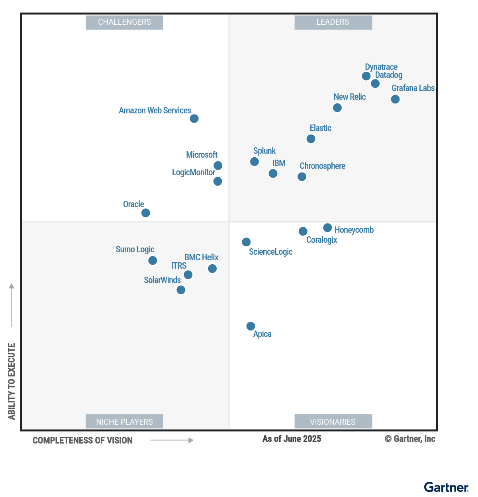
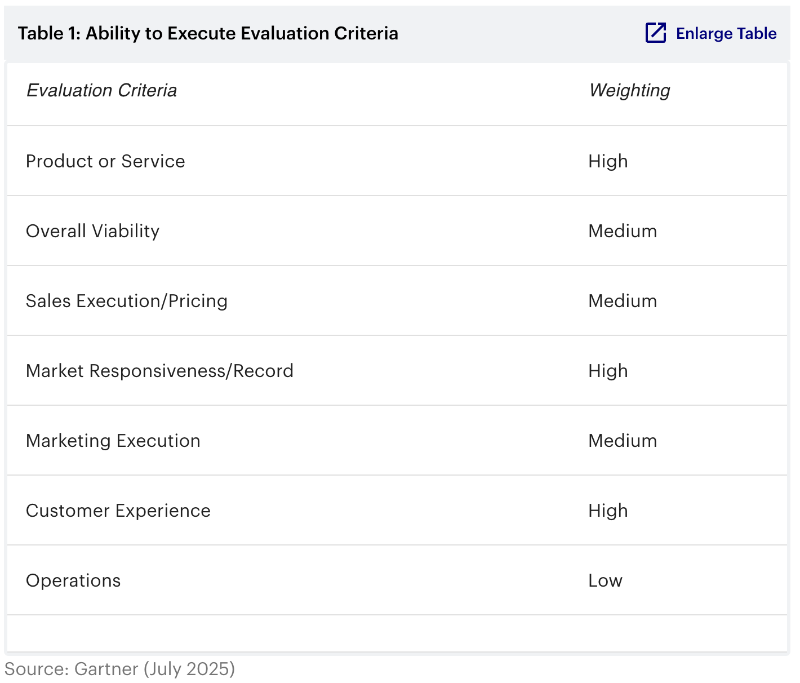
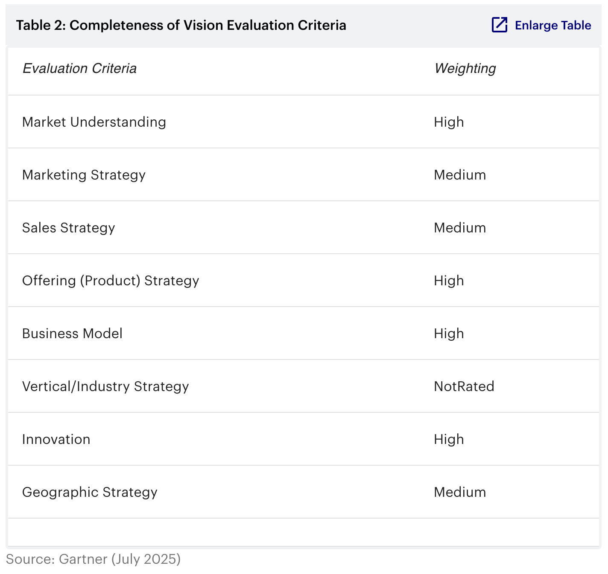

可观测性平台正在彻底改变企业管理系统健康状况的方式，这一变革由分析技术的创新、成本优化及 AI 可观测性（AI observability）的兴起所推动。基础架构与运营（I&O）负责人可以借助本研究，评估供应商格局，把握不断演进的解决方案市场。

## 市场定义／描述

*本文于 2025 年 7 月 17 日修订。您当前查看的是更正版本。更多信息请访问 gartner.com 上的更正页面。*

Gartner 将可观测性平台定义为：帮助用户了解应用、服务和基础设施的健康状况、性能及行为的产品。平台通过采集来自日志、指标、事件、追踪等多个来源的遥测数据（telemetry，运营数据），再由人工或机器智能进行分析，以识别可能影响终端用户体验的系统行为变化，如故障或性能下降。借助这些能力，团队能够及早发现甚至主动预防问题。使用这些平台的包括 IT 运维人员、**站点可靠性工程师（Site Reliability Engineer）** 、云与平台团队、应用开发者及产品负责人等。

现代企业高度依赖关键的数字化应用与服务，这些系统不仅创收且面向客户，同时关系到整体业务效率。因此，系统宕机、性能下降或不稳定将直接影响收入、客户感知与品牌形象。

组织通过可观测性平台掌握这些系统的运行状况，并持续优化其可用性、性能与弹性。投入并成功部署这类平台有助于避免营收损失，加快产品交付速度，并提升品牌形象。

以下是可观测性平台在不同场景中的典型用途：

- **IT 运维：** 生产环境中的 IT 团队需确保系统在任何时刻，尤其是高负载期间，始终保持可用、高效与稳定。可观测性平台能够及时发出告警，并帮助团队深入分析数据，查明问题根源。

- **平台工程：** 平台工程师的使用方式融合了运维和开发两类实践。平台不仅帮助保障服务满足服务级别目标（SLO），也推动基于数据的持续改进与平台升级。

- **软件开发：** 开发团队将可观测性能力集成进 CI/CD 流水线，从而在代码部署后迅速获得反馈。这不仅加快了新功能的上线，也增强了系统的弹性。

- **业务分析：** 分析师可以利用平台追踪关键业务指标，这些指标通常具有行业或客户特定性。例如，零售商可能会关注购物车放弃成本和客户平均消费水平等数据。

### 强制性功能

可观测性平台至少应具备以下能力：

- 支持采集、存储和分析各类运营遥测数据，包括但不限于指标、事件、日志和追踪信息。
- 能识别并分析应用、服务和基础设施的行为变化，明确宕机或性能下降的根因，并量化其对终端用户体验的影响。
- 提供拓扑依赖、服务映射等上下文信息，以丰富遥测数据内容。
- 支持构建或映射被监控服务与其在业务流程中角色之间的关系。
- 能从主流公有云服务（如 Amazon Web Services、Microsoft Azure、Oracle Cloud Infrastructure）中采集遥测数据。
- 支持对追踪、指标、日志等多种遥测数据进行交互式分析，从而洞察用户和应用行为。

### 常见功能

在本市场中，主流可观测性平台通常具备以下特性：

- 支持监控通过浏览器、移动应用及 API 提供的应用和服务的数字化用户体验。
- 能与其他运维、服务管理与开发工具集成，包括 IT 服务管理（ITSM）、配置管理数据库（CMDB）、事件与故障响应、编排与自动化系统，以及各类 DevOps 工具。
- 利用高级分析与机器学习技术，提供传统人工分析难以获得的深度洞察。
- 自动发现并建立基础设施、网络、应用组件与服务之间的关系映射。
- 提供成本管理功能，既能衡量与优化应用工作负载的成本，也可评估与优化平台自身的资源使用与开销。
- 支持对用户行为路径进行业务流程和活动监控，如从登录到结账、转化率漏斗分析、客户注册流程或贷款申请等。
- 提供 AI 可观测性能力，支持分析大语言模型（LLM）及其生成式 AI（Generative AI）负载的性能、成本、容量与合规性。
- 具备自动化功能，能够对应用和基础设施的代码或配置发起更改，以优化成本、容量、性能，或在出现故障与性能下降时采取修复行动。
- 提供应用安全功能，能识别受监控应用中的已知漏洞，并阻止相关利用行为的发生。

## 魔力象限

图 1: 可观测性平台魔力象限

### 厂商优势与注意事项

#### Amazon Web Services

Amazon Web Services（AWS）在本次魔力象限中被评为挑战者。其可观测性解决方案以 Amazon CloudWatch 为核心，涵盖指标、日志、事件等多类遥测数据的处理能力。AWS 还提供 AWS X-Ray（分布式追踪）、Amazon OpenSearch Service（日志分析）、Amazon Managed Service for Prometheus 和 Amazon Managed Grafana 等组件。这些服务构成 AWS Cloud Operations 体系的一部分，该体系还包含治理与财务管理功能。AWS 的客户遍布全球，从初创企业到大型机构不等，并持续稳定发布产品更新。

##### 优势

- **AI 创新：** Amazon 推出 CloudWatch Investigations，帮助 SRE、IT 运维与云工程团队快速诊断和修复问题。此外，AWS 为 CloudWatch、CloudTrail、OpenSearch 和 Config 提供自然语言查询功能，降低了性能分析的门槛。
- **客户体验：** AWS 提供业内领先的客户支持，涵盖全尺寸客户的定制化上手流程，全天候 7×24 全球支持，社区活跃，认证体系完备。
- **生态系统：** AWS 原生工具（如 CloudWatch）与 AWS 服务深度集成，遥测数据可自动采集，配置简便；统一的控制台支持集中管理与计费，通过 IAM 实现一致的安全控制。

##### 注意事项

- **多云支持：** CloudWatch 主要优化于 AWS 环境。虽然 AWS 提供对 Azure 指标的有限支持，其他来源则需使用 OTel 代理、CloudWatch 代理或手动配置。用户还需关注跨环境数据传出与 AWS 数据摄取相关费用。
- **市场营销策略：** 相较其他厂商，AWS 在可观测性方面的推广力度相对不足。可观测性并非其核心产品，市场关注度相对落后于本象限中的领导者。
- **成本问题：** 根据客户咨询及 Peer Insights 上的反馈，CloudWatch 及相关工具的费用常被提及为痛点。由于 AWS 服务间的紧密集成，数据易被自动推送至 CloudWatch，增加了不经意的成本开销。建议客户使用 AWS Cost Explorer、AWS Budgets 等管理工具，并优化日志与追踪的摄取频率以控制支出。

#### Apica

Apica 被评为本次魔力象限中的远见者。其可观测性平台 Apica Ascent 具备遥测数据管道功能，是其整体数据管理解决方案的重要组成部分。Apica 的业务主要集中在美国和 EMEA 地区，客户多位于北美。公司成立于 2005 年，早期专注于合成监控，并以支持多因素认证（MFA）等功能而知名。通过在 2023 年和 2024 年先后收购 LogIQ 和 Circonus，Apica 正式进军可观测性领域，并正在将其原有的合成监控能力整合至 Ascent 平台中。

##### 优势

- **易于采集接入：** Apica Ascent 无需部署专属代理即可接入数据，客户可灵活使用 OpenTelemetry Collector、Fluent Bit、Logstash，甚至 Datadog Agent 等采集技术。其遥测管道产品 Flow 提供了更多数据接入与处理选项。
- **代理自动化管理：** Apica 的代理管理系统 Fleet 基于 OpAMP 协议，可实现遥测采集器的自动部署与配置，功能强大，即使用户未采用 Ascent 的核心可观测性能力也值得单独评估。
- **灵活的存储选项：** 对于 SaaS 用户，Apica Ascent 支持客户自定义使用对象存储，从而完全掌控数据存放位置，有助于简化合规工作并满足数据主权需求。

##### 注意事项

- **功能尚不完善：** 尽管平台具备 AI 可观测性等高级能力，但目前仍在演进中，尚缺少服务级别目标（SLO）管理和真实用户监控（RUM）等关键功能。
- **市场影响力较弱：** 虽然 Apica 成立已有 20 年，但作为可观测性平台的市场认知度较低，在 Gartner 客户群体中的采用率仍有限。
- **公司规模偏小：** 与本研究中的其他厂商相比，Apica 的整体规模较小，这在竞争激烈的市场中可能成为制约因素。

#### BMC Helix
BMC Helix 在本次魔力象限中被评为利基厂商。其 Observability & AIOps 套件覆盖多项 IT 运维与可观测性能力，产品组合包括 BMC Helix Discovery 等模块。BMC Helix 还在相关的 IT 服务管理市场中占有一席之地，其产品 BMC Helix ITSM（前称 Remedy）应用广泛。公司业务遍布全球，覆盖各行业、各规模客户。2024 年 10 月，BMC 宣布将业务拆分为两家独立实体，其中一家保留 BMC 名称，另一家为 BMC Helix。本文分析仅聚焦后者的可观测性相关产品。

##### 优势

- **创新投入：** BMC Helix 持续增强平台能力，在各产品中广泛嵌入 AI，例如推出用于事件调查的生成式 AI 工具 BMC HelixGPT。
- **全球服务能力：** BMC Helix 的客户遍布全球，配备本地办事处、区域合作伙伴，并提供多样化的全球托管选项。
- **工具链整合能力：** 尽管支持与第三方工具共存，BMC Helix 依然将自身的 ITSM、资产发现与 CMDB 功能集成到可观测性方案中，有助于客户整合运维工具链与供应商体系。

##### 注意事项

- **战略转型阶段：** BMC Helix 正处于从 BMC 拆分后的独立运营阶段，客户应注意此期间客户关系、支持模式等方面可能出现的调整。
- **市场影响力有限：** BMC Helix 的市场推广主要聚焦原有客户，尚未在可观测性领域建立广泛认知，因此在 Gartner 客户提及率偏低。
- **产品功能不全：** 相较市场领导者，BMC Helix 缺少部分关键功能，如成本控制工具有限、未支持 eBPF 等。虽然存在替代方案，但可能增加成本或影响部署效率。

#### Chronosphere

Chronosphere 是本次魔力象限中的领导者。其平台由 Chronosphere Observability Platform 与 Telemetry Pipeline 构成，主要服务于北美客户，业务覆盖美国与 EMEA 地区。近期推出的 “Differential Diagnosis（DDx） for Traces” 功能帮助用户更快定位性能问题原因。支持指标的 DDx 功能已于 2025 年 5 月发布，日志支持与业务影响分析功能也在后续计划中。

##### 优势

- **成本控制能力强：** 平台提供策略驱动的摄取、存储与保留控制，用户可精细化管理遥测数据，降低不必要的成本浪费。该功能已成为行业参考标准。
- **无需代理采集：** 平台广泛采用 OpenTelemetry 和 Prometheus 等开放协议接入遥测数据，无需安装代理。客户可灵活选择最适合各类工作负载的接入机制。
- **高可用性保障：** Chronosphere 为每位客户分配独立租户及私有存储资源，减少资源争抢，提升安全性，服务可用性持续达成 99.9% SLA 承诺。

##### 注意事项

- **数字体验监控依赖第三方：** Chronosphere 通过与 Checkly（合成监控）和 Sentry（RUM）合作实现 DEM，但遥测数据生成与集成仍需客户主导。
- **权限控制粒度有限：** 当前平台权限模型较为粗略，不支持基于对象的职责分离。如有此需求，用户需采用多个租户或 GitOps 机制加以实现。
- **AI 能力未成重点：** 与多数竞争对手相比，Chronosphere 在平台中未将 AI 作为主要能力强调。虽然目前未对功能完整性造成实质影响，但若企业对 AI 功能有明确需求，建议评估其他方案。

#### Coralogix

Coralogix 被评为本次魔力象限中的远见者。其平台支持可观测性与安全相关场景，基于品牌化的数据管道架构 Streama 构建。公司业务集中于美国与 EMEA 地区，客户群主要分布在北美和 EMEA。近期推出的产品包括基于收购 Aporia 构建的 Coralogix AI 中心（AI Center）和基于 eBPF 的遥测采集代理。平台未来规划将继续强化持续分析和 AI 能力，并计划引入代理式 AI（Agentic AI）。

##### 优势

- **优化存储成本：** TCO 优化器支持通过策略制定遥测数据（如日志与追踪）的分层存储与保留机制，用户甚至可使用自有 S3 存储，灵活控制性能与成本平衡。
- **AI 功能丰富：** AI Center 提供对基于 LLM 应用的性能、安全与运行状况的监控，支持 OpenAI 与 Amazon Bedrock，涵盖 token 使用、错误率、响应质量与成本等维度。平台还内置生成式 AI 助手 Cora。
- **客户支持及时：** Coralogix 提供 7×24 全天候产品内支持，平均响应时间仅为 17 秒，问题平均解决时间为 1 小时。客户上手流程由专属团队协助完成，确保快速启动与稳定落地。

##### 注意事项

- **学习成本较高：** 平台功能强大但设置繁多，新用户在熟悉过程中可能遇到学习曲线陡峭的问题。
- **代理管理缺失：** 平台不具备统一的代理部署与生命周期管理功能，可能导致运维负担上升，限制大规模扩展。
- **开发集成受限：** 目前尚不支持开发者在 IDE 中直接接入平台进行生产问题排查，流程依赖此能力的团队需考虑替代方案。

#### Datadog

Datadog 是本次魔力象限的领导者之一。其可观测性平台属于一套更广泛的监控与安全产品组合。公司持续扩展全球覆盖，2023 年在日本建立数据中心，并计划于 2025 年进驻澳大利亚。2024 年推出了包括 LLM Observability（生成式 AI 可观测性）与 On-Call（事件响应管理工具）在内的新功能，并收购 Quickwit、Metaplane 和 Eppo，进一步拓展在日志优化、数据质量与产品实验分析方面的能力。

##### 优势

- **SLO 全生命周期管理：** 平台支持多类型数据的服务级别目标管理，包括历史回放、误差预算告警与配置建议等，帮助用户建立稳定可靠的服务交付机制。
- **深入系统可视化：** 广泛采用 eBPF 技术，在无需代码插桩的前提下，实现对应用与系统行为的深度监控，用于 APM 和云工作负载保护等关键场景。
- **产品分析能力强：** 通过真实用户监控、会话重现、热力图与转化分析等功能，平台可用于产品使用行为分析与功能迭代优先级决策，超越传统健康指标监控范畴。

##### 注意事项

- **授权与合同流程复杂：** 随着产品线扩展，授权模型也变得复杂，合同协商与预算管理难度上升，缺乏灵活组合也限制了配置自由度。
- **平台成本不低：** 日志与指标的摄取与保留成本是客户常提到的问题，Datadog 通过引入 Flex Logs 和“无限制”模式尝试缓解这一压力。
- **生态绑定强：** 平台高度集成，使用门槛低但退出成本高。一旦深入使用，其与其他工具集成或替换成本将显著上升，形成潜在厂商锁定。

#### Dynatrace

Dynatrace 是本次魔力象限中的领导者。其统一的可观测性与安全平台涵盖多个功能模块，包括基础设施与应用可观测性、应用安全与威胁监测、数字体验分析、自动化功能以及业务可观测性等。近期，Dynatrace 进一步扩展产品能力，新增成本优化与生成式 AI／大语言模型（LLM）相关的可观测性功能。公司客户遍及全球主要区域（包括拉美和亚太），以大型企业与技术密集型公司为主。最近，Dynatrace 收购了 AI 驱动的数据库可观测性平台 Metis。

##### 优势

- **产品线全面：** Dynatrace 提供种类丰富的可观测性与安全解决方案，特别适用于企业级场景。其平台既支持 Kubernetes、容器、云函数、LLM 等现代架构，也兼容主机系统和 SAP 等传统企业软件。
- **AI 自动化与根因定位：** 平台核心 AI 引擎 Davis 能自动执行根因分析和预测建模。它可智能发现并映射复杂的应用环境、检测性能异常，并实时定位问题根源，大幅减少人工介入与平均修复时间（MTTR）。此外，平台还支持基线建立、异常检测与洞察生成的全流程自动化。
- **强大可扩展性：** Dynatrace 专为应对大型、动态的企业 IT 架构而设计，包括微服务、多云与容器环境。平台支持同时监控数万个主机与数百万依赖，适合 IT 系统庞大的组织。其高度自动化与弹性架构有助于控制现代企业环境的复杂性与规模化难题。

##### 注意事项

- **授权模型较复杂：** Dynatrace 的订阅授权（DPS）引入了多个新项目，相比旧模式更难理解和预算。客户应确保相关团队熟悉报告、告警与预测等功能的成本控制机制。
- **平台上手需引导：** 功能深度和数据量庞大可能导致新用户面临学习门槛。建议组织通过厂商或可信合作伙伴提供的专业服务完成初期部署，并强化培训以提高使用效果。
- **中小企业适配性有限：** 作为企业级全功能平台，Dynatrace 虽可通过公有云市场等方式获取，但对中小企业而言，其成本通常只能在关键系统中获得投入回报。

#### Elastic

Elastic 在本次魔力象限中被评为领导者。其产品组合覆盖多种部署方式，包括自托管、云托管以及基于 Elastic Cloud 提供的全托管 Serverless 服务。Elastic Observability 构建于其核心平台 Search AI Platform 之上，该平台也支持 Elastic 的搜索与安全产品。Elastic Cloud 目前在主流云平台上广泛部署。公司总部位于北美，客户主要分布于美洲与 EMEA 地区。未来发展重点包括增强生成式 AI（GenAI）能力，并进一步推进 OpenTelemetry 的标准化支持。

##### 优势

- **AI 助力洞察：** Elastic 的 AI 助手可通过自然语言与遥测数据交互，帮助用户快速定位问题与解决方案，降低了技术门槛。
- **平台能力领先：** Elastic 在服务级别目标（SLO）、代理管理和数据分析等核心可观测性能力方面表现出色，有效提升 IT 运维与 SRE 团队效率。
- **开源平台战略清晰：** Elastic 坚持开放平台战略，覆盖可观测性、安全与企业搜索领域，其差异化定位在众多厂商中极具特色。

##### 注意事项

- **产品认知仍在提升：** Elastic 的搜索与安全产品广为人知，但可观测性方案 Elastic Observability 的市场覆盖仍处于扩展阶段，公司正在加大市场投入。
- **平台使用需具备一定技术背景：** 虽然托管服务降低了部署门槛，但若要发挥平台全部能力，仍需内部具备较强的技术实施能力。
- **定价模型复杂：** Elastic Cloud 基于多维度（内存、存储、流量、功能层级）计费，随着数据量增长，成本预测难度增加。平台提供的定价工具与数据分层策略可一定程度缓解此问题。
#### Grafana Labs

Grafana Labs 被评为本次魔力象限中的领导者。公司发源于开源项目 Grafana，并陆续推出 Loki、Tempo、Mimir、Beyla 与 Faro 等多个开源项目。其团队聚集了众多 Prometheus 与 OpenTelemetry 核心维护者。Grafana Cloud 是其核心可观测性平台，客户遍及全球，重点集中在北美与 EMEA 地区。近期更新包括统一事件响应管理与云服务可观测性支持，未来还将推出增强型根因分析与成本优化功能。

##### 优势

- **灵活的成本控制机制：** Grafana Cloud 推出的 Adaptive Telemetry 功能（目前适用于日志和指标）可通过减少不必要的数据摄取来降低开销。用户可根据推荐自动执行、手动配置或设定例外。目前对追踪数据的支持已在开发中。
- **全球部署灵活：** 平台部署于全球 25 个 AWS、Azure 和 GCP 区域，用户可根据延迟与数据主权要求选择合适位置，提升性能与合规性。
- **完整客户体验：** Grafana Labs 提供详尽的上手支持，包括激活、迁移、架构设计与培训，并配有丰富的社区资源和官方支持选项，助力用户顺利上云。

##### 注意事项

- **学习成本较高：** 对缺乏 Prometheus 背景的用户来说，配置文件语法和操作模式可能较难理解，需安排必要培训。为缓解此问题，Grafana 正逐步推出预设模板支持常见场景。
- **文档体系不完善：** 平台文档体现出开源特性，虽覆盖基础组件，但整体结构不够系统，对新手用户指导不足。
- **依赖社区插件存在风险：** Grafana 生态构建在大量社区插件基础上，尽管提升了功能多样性，但也带来兼容性与安全风险，建议运维团队评估并纳入风控流程。

#### Honeycomb

Honeycomb 是本次魔力象限中的远见者。其平台专注于处理高基数遥测数据（即具有大量唯一标签组合的数据），支持开放标准，面向需要实时、探索式可观测性的工程团队。虽然 Honeycomb 的客户群主要集中在北美，但自 2024 年推出欧盟 SaaS 服务以来，公司持续拓展 APAC 和 LATAM 市场。2024 年发布了多项新功能，包括 Honeycomb Telemetry Pipeline（HTP）、日志分析功能，以及前端可观测性方案。2025 年初，公司收购了开源代码分析与自动插桩引擎 Grit，标志其首次并购。

##### 优势

- **灵活的遥测数据管理：** HTP 可帮助企业在不同数据源与目标间高效路由、抽样和过滤遥测数据，在扩展可观测性覆盖的同时控制成本与生命周期。
- **集中式代理管理：** 平台利用 OpAMP 协议，实现对 OpenTelemetry Collectors 的集中部署与配置，简化大规模遥测部署的运维流程。
- **技术创新快速推进：** 通过收购 Grit，Honeycomb 引入 AI 驱动的代码分析能力，提升代码层级的遥测集成效率，助力开发团队提升老旧代码库的可观测性。

##### 注意事项

- **定价模型预测难度大：** Honeycomb 采用按事件计费的方式，适合处理高基数遥测，但初期可能难以精确评估预算与使用量。
- **合作伙伴体系薄弱：** 公司以直销为主，渠道合作较少，企业如需本地实施或第三方集成支持，可能缺乏充足选择。
- **AI 能力尚处追赶阶段：** 虽然已有如 BubbleUp 异常检测等探索性功能，但在生成式 AI 方面仍相对滞后，目前主要功能为 Query Assistant。公司希望借助 Grit 缩小差距。

#### IBM

IBM 是本次魔力象限的领导者之一。其可观测性平台 Instana 支持 SaaS 与自托管部署，并采用轻量的单代理架构。公司全球业务广泛，客户以大型企业为主。IBM 的产品组合覆盖从主机系统、网络（SevOne）到现代云原生架构（如容器与 Kubernetes）的可观测性需求。近期，IBM 收购了 HashiCorp 和 Kubecost，进一步加强其在自动化与 Kubernetes 成本管理领域的能力。

##### 优势

- **强大的市场执行能力：** IBM 在全球市场均设有销售与支持团队，服务能力成熟。Instana 与 Apptio 和 HashiCorp 同属软件业务线，形成面向 IT 运维、自动化与 FinOps 的完整企业解决方案组合。
- **本地化与合规优势：** IBM 的全球合作网络支持各区域客户的本地部署与合规要求，数据中心布局广泛，产品也支持多语言环境。
- **定价简洁透明：** Instana 采用按主机计费的方式，易于理解，能随着企业规模增长平滑扩展，在成本敏感环境中具备一定优势。

##### 注意事项

- **AI 产品功能相对保守：** 2024 年 IBM 在 AI 方面的创新节奏慢于其他领导厂商。尽管正探索代理式能力与 AI 可观测性，但仍有较大提升空间。
- **中小企业关注度不足：** 许多客户仍将 Instana 视为大型企业专属方案。若未使用 IBM 其他产品，中小企业接触意愿偏低。
- **社区活跃度有限：** 虽然平台提供线上用户论坛，但整体社区互动度不如其他厂商，用户间经验交流与学习资源较为欠缺。

#### ITRS

ITRS 是本次魔力象限中的利基厂商，其可观测性平台 ITRS Analytics 包含采集管道、分析引擎与客户访问层等核心模块，具备覆盖全面的遥测数据处理能力。公司主要业务区域为北美、欧洲和亚太。为简化遥测数据接入，ITRS 近期推出数据采集管道。未来将进一步支持服务级别目标（SLO）管理、代理集群管理与安全威胁检测功能。

##### 优势

- **灵活的定价方案：** ITRS 全新定价策略提供基础版与企业版打包选择，产品形态也正从多个独立组件向统一平台转型，主要面向大型、复杂的企业 IT 环境。
- **极快的实时响应能力：** 源于金融行业经验，ITRS 在遥测摄取与告警方面表现突出，响应时间可低至一秒以内，优于多数同类产品。
- **高安全性的权限管理：** 平台提供细粒度、可审计的 RBAC 控制，支持按属性设定访问规则，并能对命令权限进行分区控制，为运维安全与合规提供保障。

##### 注意事项

- **定价不透明：** 尽管已更新为分级打包形式，但官方未公开价格信息，客户需联系销售团队才能了解成本，影响采购前期决策。
- **尚未支持生成式 AI：** 平台目前未集成大语言模型或生成式 AI 能力，相比市场中已引入代理式 AI 的厂商存在滞后，虽已纳入产品规划，但落地时间尚未可知。
- **代理部署复杂：** ITRS 尚不支持集中式代理部署，需依赖如 Puppet、Chef 等第三方工具进行安装，并需分别管理 NetProbe、基础设施代理与 RUM 收集器等多个代理组件，增加了运维复杂度与管理成本。

#### LogicMonitor

LogicMonitor 被评为本次魔力象限的挑战者。其可观测性平台 LM Envision 基于本地采集器构建，支持混合架构环境，可从云、本地、SaaS 及容器中采集指标、日志、追踪与事件数据。平台引入多项生成式 AI（GenAI）功能，包括根因分析、告警聚类、基础设施智能监控（支持如 Nvidia GPU 和 OpenAI）。其客户主要分布于北美与 EMEA，并在亚太市场快速拓展。过去一年，公司陆续推出 Edwin AI（跨域事件摄取与关联）、LM Co-Pilot（AI 聊天助手）与 LM Cost Optimization（云成本优化）等新工具。

##### 优势

- **客户扩展性强：** 2024 财年 LogicMonitor 实现 108% 净留存率，得益于客户快速实现平台价值、高粘性使用体验与多模块组合使用，尤其在大型企业与 MSP 客户群中增长显著。
- **强大的合作伙伴生态：** 80% 收入来自合作伙伴通路，覆盖 SI、VAR、MSP 与技术联盟等角色。公司持续通过培训赋能、资源投入与联合市场推广计划，拓展合作广度与深度。
- **优秀的混合架构覆盖能力：** 采用无代理采集方式，平台可同时管理传统系统与现代部署环境（如云与边缘计算），为组织提供灵活的混合 IT 管理方案，降低迁移与整合成本。

##### 注意事项

- **SLI／SLO 功能仍待完善：** 当前平台尚未提供统一的服务级别指标与目标管理方案，无法有效支持误差预算等 SRE 关键实践，在对可用性要求严格的场景中存在短板。
- **DevOps 集成覆盖有限：** 当前平台对 DevOps 工具链的支持不够全面，缺少针对 CI/CD 全流程的原生功能，需通过额外工具实现功能补足。尽管有如 Ops Notes 记录变更的功能提供问题上下文，但整体仍以可观测性为主。
- **缺失真实用户监控（RUM）：** 平台尚未提供前端性能或用户路径的可观测性功能，限制了对用户体验的深入洞察。需要此类视角的组织需额外集成 RUM 工具，或转向支持该功能的平台。

#### Microsoft

Microsoft 被评为本次魔力象限的挑战者。其可观测性平台 Azure Monitor 是 Azure 原生监控解决方案，覆盖云、容器与基础设施层，具备良好的全球可用性。客户主要为中大型企业，地理覆盖范围广。近期更新包括：增强版 Azure Kubernetes Service 监控能力，以及 Log Analytics 的跨区域工作区复制功能。未来产品路线图将聚焦于提升 AI 驱动的可观测性能力，并进一步深化与 Microsoft Fabric 和 Microsoft Sentinel 的集成。

##### 优势

- **成熟的日志分析方案：** Azure Monitor 中的 Log Analytics 功能成熟且持续进化。最新支持的 Auxiliary Logs（低成本存储层）适合低频访问日志数据，同时推出的 Simple Mode 模式让用户无需掌握 KQL 查询语言即可通过低代码方式从日志中获取洞察。
- **AI 能力加持：** Azure Monitor 的 Application Insights 模块集成了 AI 驱动的性能优化分析，能够基于实时遥测数据识别潜在瓶颈，并推荐相应的代码改进措施。该能力可与 Azure 中的 Microsoft Copilot 搭配使用，进一步增强诊断效率。
- **统一的安全与运维视角：** Azure Monitor 与 Microsoft 的安全工具 Sentinel 和 Defender 深度融合，使得用户可以在同一平台上实现跨运维与安全团队的事件分析、告警响应与报表生成，提升整体可视性与协同效率。

##### 注意事项

- **缺乏 SLO 原生支持：** Azure Monitor 尚未提供完整的 SLO 创建与监控功能，虽然可通过自定义方法实现部分能力，但配置过程复杂，难以满足 SRE 的高效实践需求。
- **OpenTelemetry 支持不一致：** 虽然 Azure Monitor 可通过导出器支持 OTel 数据的导入，但不支持直接通过采集器接口接收 OTLP 协议，增加了数据集成复杂度。客户端可使用 Azure 提供的 OpenTelemetry Distro SDK，将数据发送至 Application Insights，但该流程仍不够直观。
- **长期预览功能影响生产使用：** Microsoft 习惯以“公测（Preview）”形式发布新功能，部分功能预览期超过一年，虽对所有用户开放，但不提供正式支持或 SLA。Azure Monitor 中多个关键能力尚处于长期预览状态，不建议在生产环境中使用，影响企业落地信心。

#### New Relic
New Relic 被评为本次魔力象限中的领导者。其可观测性平台功能全面，覆盖 APM、AI 监控、数字体验监控（DEM）、基础设施与安全监控，以及日志管理。客户遍布全球，以中大型企业为主。除了在北美和欧洲部署数据中心外，公司于 2024 年大幅扩展了印度的创新中心，进一步提升全球运营能力。其产品发展重点是加速代理式 AI（Agentic AI）集成，已与 ServiceNow 与 GitHub Copilot 展开深度合作。

##### 优势

- **AI 自动化战略清晰：** New Relic 致力于构建基于代理的自动化编排框架。平台推出标准化 API 用于代理接入，并持续扩展专用代理库，推动跨平台的智能化自动响应能力。与 GitHub 和 ServiceNow 的合作展示了 AI 驱动工作流在实际场景中的落地前景。
- **产品功能不断增强：** 过去一年中，New Relic 增强了 eBPF 支持、推出生成式 AI 接口的多项优化，新增 LLM 可观测性能力，并扩展成本控制工具，产品能力日益完善。
- **优质客户支持体验：** 客户通过 Peer Insights 和咨询反馈表示，New Relic 在服务响应和技术支持方面表现优异，满意度居高。

##### 注意事项

- **增长节奏放缓：** 虽然 New Relic 的客户续约率持续稳定，但自从被 Francisco Partners 与 TPG 收购并私有化以来，其整体市场拓展速度相较于其他领先厂商略显保守。
- **遥测数据成本控制挑战：** New Relic 采用按用户数与遥测摄取量计费的方式，在数据量快速增长时可能带来较高费用。公司已推出成本优化器功能，帮助用户应对突发数据峰值。
- **业务指标可见性不足：** Pathpoint 功能可用于监控业务流程与“业务可观测性”，但目前知晓与实际使用的客户仍较少，功能价值尚未被充分利用。

#### Oracle

Oracle 被评为本次魔力象限中的挑战者。其 **可观测性与管理平台（Observability and Management, O&M）** 提供一体化能力，涵盖应用性能监控（APM）、日志分析、数据库管理、运维洞察、漏洞检测与补丁管理等模块。平台支持跨公有云、私有云和传统数据中心环境的混合工作负载监控。Oracle 在全球多个地区设有服务节点，客户涵盖政府机构及中大型企业，行业覆盖广泛。

##### 优势

- **内建数据库漏洞检测：** 平台内置数据库安全能力，可自动识别 Oracle 数据库中的配置缺陷、安全漏洞与合规风险，降低运营风险。
- **数据主权与区域合规优势：** Oracle 在 25 个国家提供主权云部署选项，满足数据驻留、地理隔离等合规要求。可选部署形式包括欧盟主权云、美国政府云以及 OCI 专属区域，可落地至客户本地数据中心。
- **成熟的支持与认证体系：** Oracle 提供全面的上手与支持服务，包括官方认证合作伙伴与集成商生态、面向 SRE 与 DevOps 团队的专业认证课程，以及一系列客户赋能与参与计划，帮助客户快速应用平台能力。

##### 注意事项

- **生成式 AI 功能尚处初期阶段：** 目前平台仅提供基础型支持助手，与同类厂商相比，在生成式 AI 功能的广度与深度上仍有差距。Oracle 计划于 2025 年推出 “可观测性助手” 功能，以补齐此短板。
- **缺乏业务视角下的可观测性能力：** 对于关注业务连续性与服务弹性的团队而言，平台尚不支持 SLO、误差预算等 SRE 核心指标，限制其在业务层面分析与决策中的适用性。
- **平台依赖 OCI 战略：** Oracle O&M 平台与其云产品（OCI）深度绑定，在 Oracle 云用户中使用体验良好，但对于构建云中立或多云可观测性平台的组织而言，其高度集成策略可能成为限制因素。
#### ScienceLogic
ScienceLogic 被评为本次魔力象限中的远见者。其 AI 平台由四大核心模块组成：SL1（可观测性平台）、PowerFlow（代理式自动化）、RestorePoint（安全与网络合规）以及 Skylar AI（用于无监督事件分析与智能推理）。SL1 支持自托管部署，也可运行于 AWS 和 Azure 环境。客户群体主要集中于北美与 EMEA 地区。公司当前产品路线图着重发展生成式 AI（GenAI）驱动的智能分析与自动化能力。

##### 优势

- **AI 驱动的智能运维战略：** ScienceLogic 以事件智能分析与 AI 能力为差异化核心，特别是 Skylar AI 模块，通过无监督学习方式实现事件识别与处理，推动智能化运维自动化。
- **市场执行力强：** ScienceLogic 通过直销、全球系统集成商（GSI）以及多层渠道生态，成功构建了稳定的市场份额，在竞争激烈的运维管理市场中脱颖而出。
- **卓越的客户体验：** ScienceLogic 提供全面的客户成功支持体系，包括活跃的用户社区、在线培训资源、专属客户成功经理（CSM），并通过 SL360 项目，帮助客户最大化产品价值，实现长期业务收益。

##### 注意事项

- **缺少 SLO 支持机制：** 平台目前不支持原生的服务级别目标（SLO）定义与可视化，限制了 SRE 团队对可靠性目标与误差预算的持续追踪与管理。
- **应用与开发集成能力较弱：** 平台偏向基础设施监控，缺乏对代码层面的深入洞察，并在 DevOps 工具链方面的集成度不如同类产品，影响其在应用可观测性领域的覆盖深度。
- **全球扩展策略不均衡：** 虽然在北美与 EMEA 市场表现稳定，ScienceLogic 在拉美等新兴市场的投入有限，可能因此错失地域扩张机会。

#### SolarWinds

SolarWinds 被评为本次魔力象限的利基厂商，其可观测性平台 SolarWinds Observability 基于 SaaS 架构，支持多种部署场景。公司全球业务广泛，客户覆盖从中小型企业到大型组织。近期平台新增了 Kubernetes 自动遥测注入能力，并增强了对 AWS 的原生集成支持。未来路线图将包括事件响应系统、告警抑制引擎、自动化工作流、Runbook 触发，以及基于代理式 AI（Agentic AI）的智能操作流程。

##### 优势

- **eBPF 加持的容器可视化：** 平台通过 eBPF 技术提升了对 Kubernetes 环境的深度性能分析能力，相较传统监控手段更易快速发现集群中的潜在问题。
- **灵活部署与透明定价：** SolarWinds 支持云与本地部署混合使用，帮助企业在混合架构中灵活扩展，同时保持良好的价格透明度与竞争力。
- **收购 Squadcast 提升响应能力：** 通过并购事件响应平台 Squadcast，SolarWinds 增强了在告警去重、MTTR 优化、工具链集成与流水线支持等方面的能力，并引入 AI 驱动的事件智能处理机制，改善整体运维效率。

##### 注意事项

- **AI/ML 功能尚不完善：** 当前平台仅具备基础 AI 能力，例如异常检测与查询辅助功能，在自动化决策、根因分析等方面仍与行业领先厂商存在差距。
- **代理统一性不足：** 虽具备统一代理架构，但 APM 与 DEM 仍需额外代理模块，带来额外部署与维护成本。
- **DevOps 工具链支持薄弱：** 平台主要支持通过 IaC 或打包方式集成遥测代理，但缺乏对 DevOps 工具链的双向通信支持，配置流程复杂，降低了与开发流程的契合度。

#### Splunk
Splunk（现为 Cisco 旗下公司）在本次魔力象限中被评为领导者。自 2024 年 3 月被 Cisco 收购以来，Splunk 成为其专责可观测性业务的事业部。Splunk 的核心产品为 Splunk Observability Cloud，涵盖基础设施监控、应用性能管理（APM）、值班响应、合成监控、日志分析与真实用户监控（RUM），并整合了 Splunk Platform、IT 服务智能（ITSI）与 AppDynamics 等产品。公司在全球范围内建立了广泛的运营与客户基础，服务对象以大型企业为主。

##### 优势

- **全球化运营与生态支持：** Cisco 与 Splunk 在全球主要市场均设有销售与服务团队，并构建了强大的合作伙伴网络，确保客户在部署、运营、维护各阶段都能获得全面支持。
- **稳定的产品战略与行业基础：** 在监控与可观测性领域拥有深厚积累，结合 Splunk 的日志、安全与 IT 运维能力，使其在金融、科技与公共领域具备强大综合实力。
- **AI 创新集成推进迅速：** 持续在 AI 能力上加大投入，推出 Cisco AI Assistant 与可观测性平台集成，支持生成查询、自动解读遥测数据，并加速洞察生成，显著提升操作效率。

##### 注意事项

- **平台整合度不足：** Splunk 的产品线通过多次收购构建，导致不同模块之间集成度不高，影响平台的一致性与使用效率，增加运维复杂性。
- **产品认知度偏低：** 尽管 Splunk 在日志与安全分析领域具有较高知名度，但 Splunk Observability Cloud 的市场认知度较低，部分客户甚至未意识到其可观测性平台已全面上线。
- **运营成本难以控制：** 虽然 Splunk 引入了指标处理优化工具，但在 Splunk Cloud 与 ITSI 场景下，客户普遍面临成本增长快、用量预估难等问题，管理大型遥测环境的成本控制仍是一大挑战。
#### Sumo Logic
Sumo Logic 是本次魔力象限中的利基厂商。其核心定位为大规模日志分析平台，同时拓展至安全监控与可观测性领域，适配 DevSecOps 场景。尽管北美是其主要市场，公司也服务于全球客户，平台已部署于多个 AWS 区域，并在亚太地区持续加大投入。2024 年，Sumo Logic 推出 AI 助手 Mo Copilot，计划于 2025 年底上线基于生成式 AI 的问题分析功能。

##### 优势

- **强大的日志分析能力：** 平台提供 Log Search、LogReduce、LogCompare 等专用工具，便于高效处理大规模日志数据。结合基于分析量而非数据摄取量计费的 Flex Licensing 模式，帮助客户更好地控制成本。
- **开源兼容性强：** Sumo Logic 广泛支持开源遥测采集框架，如 OpenTelemetry、Telegraf 和 Fluent Bit，支持通过 OTLP 协议接收数据。同时平台也支持 OpenSLO 用于服务级别目标管理，并通过 OpAMP 实现对遥测采集器的统一编排与管理。
- **可观测性与安全一体化：** 平台同时服务于运维与安全团队，适合实施 DevSecOps 战略的组织，在单一平台中实现威胁监测与系统性能洞察的融合。

##### 注意事项

- **缺乏针对 LLM 的可观测性能力：** 虽然平台支持将 AWS Bedrock 与 Google Vertex AI 的日志与指标接入，但尚不具备对大语言模型运行关键维度（如 Token 使用、成本、偏差、漂移、幻觉）的深入分析功能，落后于其他主流平台。
- **生成式 AI 助手功能有限：** Mo Copilot 于 2024 年底上线，目前主要用于数据探索与可视化，仍处于功能早期，缺乏复杂任务的自动化处理能力。
- **调试体验不佳：** 平台尚未与主流 IDE（集成开发环境）集成，不便于开发者在调试过程中直接回溯日志或异常，限制了 DevOps 流程中的效率提升空间。

### 新增与移除厂商

我们会根据市场变化，定期审查并调整魔力象限的入选标准。随着评估标准的更新，每年入选厂商的组合也会有所变化。某个厂商在某一年出现而下一年未被列入，并不代表我们对其评价发生变化，可能反映的是市场格局或厂商战略重心的调整。

#### 新增厂商

以下厂商符合入选标准，首次加入本年度魔力象限：

- Apica  
- Coralogix  
- ITRS  
- ScienceLogic  
- SolarWinds

#### 被移除厂商

- Logz.io 因未达到本市场所要求的客户兴趣指标（CII）阈值，被移出本次评选。
- ServiceNow 未满足本次研究的入选条件，未被纳入本次魔力象限。

## 入选与排除标准

### 基本条件

- 截至 2025 年 3 月 27 日，平台必须提供正式上线（GA）的功能，且可通过常规销售渠道向所有客户开放。
- 可观测性平台必须可直接售卖给客户，且无需强制依赖专业服务。厂商需为平台（包括所用开源组件）至少提供一线支持，如产品文档、安装指南、参考用例等。
- 平台需具备明确的产品路线图和销售推广战略。
- 厂商需提供电话、邮件或在线客服，并支持英文合同、控制台、技术文档与客户支持。

### 功能能力要求

- 平台必须原生支持所有强制功能，并至少满足九项常见功能中的四项（详见 Gartner 市场定义部分）。
- 平台必须以 SaaS 形式交付。虽可提供自托管版本，但本次研究不评估自托管方案。

### 业绩门槛要求

满足以下任一条件：

1. 拥有至少 50 家生产环境的付费客户，且客户分布至少覆盖两个大区（亚太、EMEA、拉美、北美），不含 MSP 销售；
2. 在过去 12 个月中，实现符合 GAAP 的年收入不少于 7500 万美元；
3. 或者：年收入达到至少 1000 万美元，且同比增长率不低于 25%。

此外，厂商还需在 Gartner 设定的客户兴趣指标（CII）中排名靠前。CII 是结合内部数据与外部市场反馈（如客户咨询热度、客户满意度等）形成的加权指标。

### 特别提及厂商

Gartner 当前正跟踪超过 40 家可观测性平台厂商。本次魔力象限仅聚焦于其中 20 家符合入选标准的供应商。但未被纳入并不代表这些厂商不具备市场竞争力，部分平台在特定场景下依然非常值得客户关注和评估。

**Dash0：** 由 Instana（后被 IBM 收购）联合创始人之一创建，Dash0 是一个基于 ClickHouse 构建、原生支持 OpenTelemetry 的现代可观测性平台。虽然基础架构并不独特，但 Dash0 在用户体验和产品实现方面表现出色，拥有简洁的定价方案与面向开发者的界面。其同时支持 PromQL（Prometheus 查询语言）与 Perses 仪表盘工具，全面拥抱开放标准。Dash0 因未达业绩门槛，未能入选本次评选。

**groundcover：** 适合对遥测数据主权与位置控制有严格要求的组织。该平台尽管提供 SaaS 控制平面，但所有遥测数据均保留在客户自建环境内，部署于 ClickHouse 与 VictoriaMetrics 私有实例中，支持 BYOC（Bring Your Own Cloud，自带云）架构。groundcover 因未达业绩门槛，未被纳入本次象限。

**HPE OpsRamp：** 作为一款 SaaS 化 IT 运维平台，OpsRamp 以事件智能为特色功能，在产品演进中不断引入领先能力。HPE 于 2023 年收购 OpsRamp，并将其整合至 Greenlake 平台核心，协同 Morpheus Data 提供运营支撑能力。今年由于整体市场认知度不高，未满足入选标准。

**Kloudfuse：** 这是一款由客户自行托管的可观测性平台，可部署于公有云或私有云资源中。虽然未提供 SaaS 版本，但通过托管控制平面降低了运维难度，同时数据完全保留在客户侧。平台基于数据湖架构，致力于打造统一可观测性视角。由于缺乏 SaaS 交付形式，Kloudfuse 不符合功能能力入选标准。

**Observe：** 作为首批构建于 Snowflake 云数据平台上的数据湖型可观测性产品之一，Observe 在 2021 年被评为 Gartner Cool Vendor。该平台以数据分析能力为核心，近年来企业采用率持续提升。然而，鉴于象限仅评选最多 20 家厂商，Observe 今年因未达市场认知度门槛而未能入选。

## 评估标准

### 执行能力（Ability to Execute）

Gartner 分析师通过厂商在流程、系统、执行方法与运营机制上的质量与效率，评估其在市场中的竞争力与表现。这些因素不仅影响厂商在营收、客户保留率与品牌声誉方面的表现，也体现其将战略愿景转化为实际成果的能力。

**产品能力：** 评估平台在可观测性核心技术上的表现，包括当前的产品特性、稳定性、功能丰富度等。还会考虑其在扩展性、可用性、集成能力与安全功能方面的成熟度。

**整体可持续性：** 衡量厂商整体财务健康状况及其核心业务单元的运营表现，具体包括盈利能力、收入地域分布与研发投入强度等。

**销售与定价策略：** 评估厂商在市场中的销售成功程度，分析其定价模型是否具备透明性、灵活性与客户价值。还包括新客户与续约客户的比例、与竞争对手的价格对比等。

**市场响应速度：** 衡量厂商是否具备快速适应市场变化与客户需求演变的能力，包括对竞争格局的敏锐反应与客户反馈的响应机制。

**市场推广执行力：** 评估厂商在市场宣传与品牌建设方面的策略效果，包括信息传递的清晰度、宣传内容的创意性与影响力，以及产品的市场认知度。

**客户体验：** 考察厂商是否通过产品、服务与支持机制，帮助客户实现预期目标。包含售后支持、高触达服务、VIP 项目与区域交付能力等。

**运营能力：** 评估厂商是否具备履行承诺与服务目标的执行力，涉及组织结构、团队技能、合作伙伴关系以及服务等级协议（SLA）的遵守情况。包括是否与主流云服务商协作，以及宕机与服务中断的响应能力。

### 愿景完整性（Completeness of Vision）

Gartner 分析师通过评估厂商对当前市场机会的理解能力、对未来发展方向的构想能力，以及其愿景表达的清晰度与落地能力，来判断其在可观测性平台领域的长期发展潜力。最终评分基于厂商愿景的前瞻性与其与 Gartner 市场判断之间的一致性。

**市场理解力：** 厂商是否能够准确理解客户需求，并将其转化为产品特性。优秀的厂商不仅能回应客户诉求，还能主动推动市场方向，特别是在可观测性快速发展、与 APM 不断区分的趋势中展现清晰判断力。

**市场战略：** 评估厂商在品牌定位与市场传播上的清晰性与差异性，以及其通过社交媒体、广告宣传、客户计划等渠道将理念传达给内外部受众的能力。也会关注其在新市场的拓展、营销创新与战略独特性。

**销售策略：** 考察厂商是否建立了覆盖直销、渠道、服务与合作伙伴网络的销售体系，能否拓展客户群并满足不同买家与决策者的选型需求。包括渠道布局、影响者策略与市场触达能力。

**产品策略：** 厂商在产品开发与迭代中是否注重差异化竞争、功能覆盖、交付方法及未来能力的布局。关注其产品路线图的发布节奏、质量与在 IT 运维领域周边市场的投资方向。

**商业模式：** 评估厂商的商业逻辑是否具备可持续性，包括价值主张、对授权／定价模式变化的预判能力，以及与开源社区的合作与生态关系。

**垂直行业策略：** 由于可观测性平台通常不依赖具体行业，因此本研究不将其作为主要评估项。如涉及行业差异化策略，相关内容已整合进其他指标中评估。

**创新能力：** 分析厂商是否对可观测性核心或相邻领域进行战略投资，包括资源整合、AI/ML 应用、合作伙伴生态建设等。也关注其在整合、防御性布局或前瞻性产品方向上的行动力。

**地域策略：** 厂商是否具备将产品、人才与服务本地化的能力，并能覆盖本土以外地区的客户需求。包括各区域团队建设、SaaS 平台部署位置、面向区域差异的产品策略，以及当地合作伙伴的广度与深度。

### 象限定义说明（Quadrant Descriptions）

#### **Leaders（领导者）**

领导者的可观测性平台产品在功能上与市场主流需求高度匹配，且在客户获取与扩张方面表现卓越。他们通常拥有全面的产品组合，具备先进的数据分析能力与可视化能力，并能与其他 IT 运维（ITOM）工具实现广泛集成。这些厂商展现出前瞻性的战略视野和强大的执行力，持续推动产品创新与优化客户体验。

#### **Challengers（挑战者）**

挑战者在市场覆盖范围和平台部署规模方面具备显著优势。此类厂商通常执行力强，并借助企业整体品牌或销售网络在市场中占据一席之地，即使其可观测性业务尚未成为核心。他们可能曾是市场领先者，也可能正经历产品与战略的转型。部分挑战者的产品被作为更大 IT 解决方案的一部分，甚至超出传统 IT 运维的范畴。

#### **Visionaries（远见者）**

远见者具备清晰的市场策略与竞争愿景，正在构建有潜力的可观测性平台产品组合。然而，由于产品尚处于发展阶段，其在市场响应速度、平台整合能力与市场份额拓展方面的执行力仍不及领导者。

#### **Niche Players（利基者）**

利基者主要面向特定客户群体，或专注于某些细分使用场景。由于在核心功能方面不具备全面覆盖，通常难以满足广泛市场的全部需求，或仅在特定行业、区域或场景中具备竞争力。此外，利基者在功能开发、市场拓展与渠道建设上的投入相对有限。不过，入选此象限并不代表其市场价值不足，而是表明其专注于更具针对性的市场定位。

## 背景
### 可观测性平台：VUCA 的微观缩影还是一片绿洲？

正如我们在去年的会议演讲中所回顾的，这项研究的起点可以追溯到 1997 年。2025 年是我主持该 Magic Quadrant 的第四年，回顾自 2022 年以来的种种变化，尤其是在 Gartner 所描述的这个充满动荡、不确定、复杂和模糊（VUCA）的全球环境中，感触尤深。

可观测性平台市场（以及早期的应用性能监控市场）这几年几乎一直处于不断演变的状态。这无疑增加了本报告对 Gartner 客户的参考价值。但我们也要保持清醒：这毕竟是众多竞争激烈的软件市场之一。那可观测性平台有何不同？一种观点认为，云原生工作负载的复杂性与规模已经打破了人们对可见性与资源管理的长期认知。下面我们从当前环境出发，深入探讨这个问题。

**波动性：** 最直观的波动表现来自行业并购。例如 Cisco 收购 Splunk 的影响如今才开始显现，而 Broadcom 收购 VMware 与 New Relic、Riverbed、Sumo Logic 与 SolarWinds 的私有化或易主也在不断重塑市场格局。Datadog、Dynatrace 与 Grafana Labs 等厂商也陆续收购了诸多初创企业，包括 Quickwit、Metaplane、Rookout、Runecast、Asserts 和 Pyroscope 等。行业对基础能力的要求正在快速提升，而 AI 可观测性创业公司极有可能成为下一波收购浪潮的核心目标。

**不确定性：** 对客户而言，可观测性平台的持续拥有成本仍是不确定因素；而对潜在买家来说，成本之外，还有价值实现周期和实施复杂度的顾虑。随着厂商从基于主机数量的定价模式转向基于资源消耗的计费方式，或将两者结合，客户对成本上涨的担忧持续升温。越来越多客户向 Gartner 咨询如何优化支出，并开始接受功能取舍或转向开源方案以控制预算。

**复杂性：** 当今企业构建和运行的系统愈发复杂。Kubernetes、多云服务、API 驱动的外部依赖不断增加，需求复杂化最终也让产品更复杂。AI 的兴起也为运维团队带来了全新挑战。虽然客户部署 AI 工作负载的浪潮尚未全面到来，但趋势已然明确。如今，AI 功能已成为可观测性平台的标配，许多厂商也正迈向具代理能力的 AI。不过，“用 AI 工具来运维 AI 系统”这一说法，尚未成为主流卖点。

**模糊性：** 我们看到，产品与运维团队中出现了大量新角色与组织，例如 SRE、平台工程师、AI 工程师、数据科学家、云卓越中心以及集中可观测性团队等。将这些新角色纳入原本以技术职能划分的组织架构中，往往令人困惑。同时，对运维团队的期待也变得模糊：什么才算是优秀的可用性与性能？当数据和告警已经压得我喘不过气时，再加遥测数据真能带来帮助吗？

事实上，运维团队似乎也无法逃离 VUCA，甚至可以说，运维社区已经拥有一个属于自己的 “VUCA 宇宙”。

不过，在评估了本报告中涵盖的厂商与产品后，我们依然感到振奋。如今市面上已有不少表现出色的可观测性平台产品，它们中的多数已纳入此次研究。在 VUCA 的大环境下，正是投身数字化运维的好时机。

如果说对抗 VUCA 的方法，是掌握将遥测数据转化为业务行动与洞察的能力，从而让运维团队持续驱动业务飞轮，那么我们愿意承认，现在就是那片“绿洲”。

## 市场概览

截至 2025 年中，可观测性平台市场仍延续着自全球疫情以来的高速演进。今年，为遵守 Magic Quadrant 最多纳入 20 家厂商的限制，我们在厂商遴选过程中面临诸多艰难取舍——部分具备竞争力的厂商因此未能入选，它们有的被收录于“值得关注”部分，另一些则可能在未来研究中出现。预计这一市场的活跃状态在短期内仍将持续。当前的市场格局已经带来了功能深度的不断增强与产品选择的显著扩展，未来厂商之间的差异化可能不再局限于技术能力，而是进一步演变成“功能秀”的角力。

影响市场持续增长与采纳的关键因素包括：

- **应对 VUCA 环境：** 企业在技术平台、部署位置、地域策略与拥有成本等方面不得不做出权衡。即便在挑战加剧的环境下，可用性与性能要求并未放宽。组织往往需以更少资源应对更高标准，或借助新方式达成目标。例如，随着 VMware 产品对部分企业而言变得难以获得，自管私有云基础设施的未来愈发不明朗，这对相关工作负载的可观测性提出了新挑战。

- **AI 热度持续：** 每当 AI 热潮似乎达到顶峰，市场总会因新动向再度升温。目前的焦点是“具代理能力的 AI”，这一方向在 IT 运维领域展现出巨大潜力。虽然部分宣称具备此类能力的产品仍存虚名，但整体趋势值得关注。同时，企业对 AI 工作负载的运维支持需求正在快速增长，可观测性平台厂商与专用工具厂商都在加快布局。

- **遥测数据的业务价值愈加突出：** 越来越多平台声称可支持“业务可观测性”功能，帮助监测业务活动而非仅限技术指标。这类能力虽具价值，但往往需要配套的工作负载改造。此外，许多企业也开始意识到遥测数据中蕴含的业务洞察，并寻求手段将其普惠化。然而，要持续有效地将洞察交付至更多角色，还需在技术与非技术层面投入资源，这在现实中仍被普遍忽视。

同时，多个监控领域与实践正加速融合。市场重心正从单点技术优化，转向保障应用实现其业务目标。相应地，资金投入也更集中于数字体验监控（DEM）与基础设施监控等与业务成效紧密相关的领域。根据 Gartner 预测，全球可观测性产品市场将在 2028 年达到约 142 亿美元，2021 至 2028 年年复合增长率（CAGR）为 11.1%（恒定汇率计）。

未来几年，市场将继续围绕以下趋势发展：

- 客户对于可观测性平台的成本与价值比问题愈发敏感，相关咨询频率持续上升；
- 数据量与种类持续增长，推动平台向通用分析工具靠拢，AI 助力下的“自驱型”功能日益普及；
- AI 可观测性成为部署 AI 与 LLM 工作负载的企业刚需；
- 平台正延伸至更多角色，如业务负责人、产品经理、平台工程师、开发人员等；
- 渐进式交付、版本管理与可观测性的融合趋势明显；
- 集中式可观测性团队被越来越多企业采纳，用于统一管理 SLO、遥测流转与工具选型；
- OpenTelemetry、eBPF 与遥测管道解决方案将推动行业标准与最佳实践的形成。
