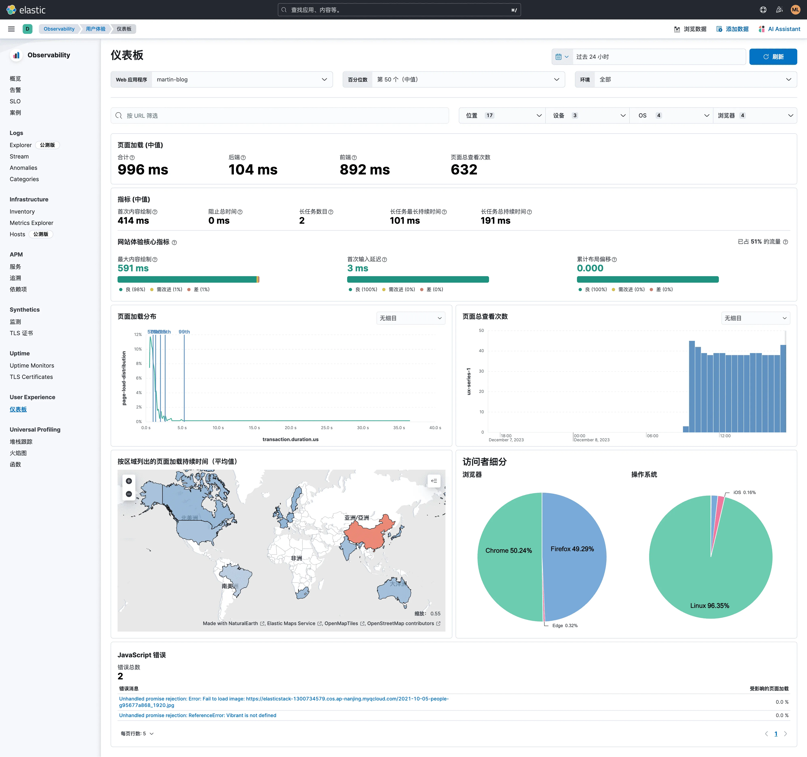
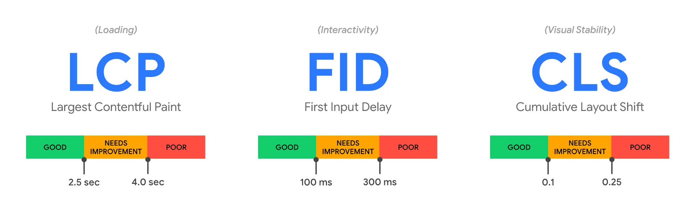
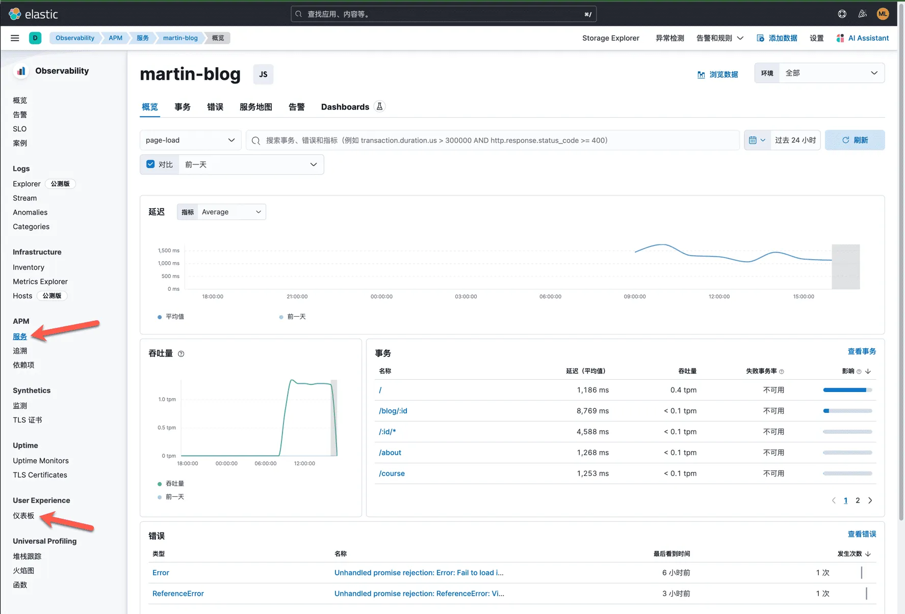

"Elastic RUM" 是指 Elastic Observability 中的实时用户体验监控（Real User Monitoring，RUM）功能，是 Elastic Stack 中的一部分。Elastic Stack 是一个开源的数据存储和分析平台，包括 Elasticsearch、Logstash、Kibana 和 Beats 等组件，用于处理和分析各种类型的数据。

Real User Monitoring（RUM）是一种用于监控网站或应用程序性能的技术。它通过追踪和分析实际用户与网站或应用程序交互的数据，从而提供有关用户体验的实时信息。RUM 的关键目标是了解用户在访问网站时经历的性能和交互情况，以便开发人员和运维团队可以识别并解决潜在的性能问题，从而提高用户满意度。

Elastic RUM 的优势包括：

1. **实时性能监控：** Elastic RUM 提供实时性能监控，使你能够迅速发现并解决用户可能遇到的性能问题。

2. **端到端可观测性：** 与 Elastic Stack 的其他组件集成，Elastic RUM 可以与日志、指标和其他数据源一起使用，为你提供端到端的可观测性，帮助你全面了解应用程序的运行状况。

3. **用户行为分析：** Elastic RUM 能够捕获用户与应用程序的交互信息，使你能够分析用户行为、浏览模式和访问路径，从而优化用户体验。

4. **可定制性：** 你可以根据特定的需求和业务场景定制 Elastic RUM 的配置，以满足不同应用程序和网站的监控需求。

5. **集成弹性搜索：** Elastic RUM 与 Elasticsearch 弹性搜索紧密集成，允许你使用 Elasticsearch 强大的搜索和分析功能来查询和可视化实时用户体验数据。

Elastic RUM 通过提供实时性能监控和与 Elastic Stack 的集成，帮助开发人员和运维团队更好地理解和优化用户体验，提高应用程序的性能和可用性。

## Elastic RUM 概述

Elastic APM实时用户体验监控（RUM）JavaScript代理提供了对你的Web应用程序的详细性能指标和错误跟踪。它内置了对流行平台和框架的支持，并提供了用于自定义仪表化的API。

该代理还支持所有出站请求的分布式跟踪。这使你能够分析整个微服务架构的性能——一切尽在一个视图中。

特性：

* 代理使用浏览器定时API（如导航定时、资源定时、绘制定时、用户定时等），并捕获以下信息：
* 页面加载指标
* 静态资产的加载时间（JS、CSS、图像、字体等）
* API请求（XMLHttpRequest和Fetch）
* 单页面应用程序导航
* 用户交互（触发网络活动的点击事件）
* 用户中心指标（长任务、FCP、LCP、FID等）
* 页面信息（访问的URL和引荐者）
* 网络连接信息
* JavaScript错误
* 分布式跟踪
* 拆分指标

## 准备 JS Agent 代码

本文以 Hugo 网站为例，介绍如何为 Hugo 网站添加 Elastic RUM 监控。我使用 Elastic Cloud 的 SaaS 服务作为数据存储和分析平台，你也可以使用自己搭建的 Elastic Stack 集群。

本博客所使用的主题是 [hugo-theme-stack 由 Jimmy 设计](https://github.com/CaiJimmy/hugo-theme-stack)。为其他主题添加 Elastic RUM 的过程类似，只是配置文件的位置和内容可能有所不同。

根据 Elastic Cloud 的页面上的配置向导，我们可以找到 Elastic RUM 的 JavaScript 代码，如下所示：

```html
<script src="https://your-cdn-host.com/path/to/elastic-apm-rum.umd.min.js" crossorigin></script>
<script>
  elasticApm.init({
    serviceName: 'my-service-name',
    serverUrl: 'https://d4c649267e404779a895b41199d5db98.apm.ap-east-1.aws.elastic-cloud.com:443',
  })
</script>
```

以上代码片段，你需要根据你的前端部署的实际情况，进行调整后，才能正常工作。

如下图所示：


在 APM 的配置向导里，我们先点击 RUM（JS）这个标签，然后页面中会出现为前端项目添加 Elastic RUM 的 JavaScript 代码的两种方式。

1. 可以使用 `npm install @elastic/apm-rum --save` 将代理作为依赖项安装到您的应用程序。然后可以在您的应用程序中初始化和配置代理。适用于与大多数的前端项目。而 Hugo 是一个静态网站生成器，不需要使用 npm 安装 Elastic RUM。
2. 本文直接使用的是选项二。将 Elastic RUM 的 JavaScript 代码复制到 Hugo 网站的 `layouts/partials/footer/custom.html` 文件中。

下面是我在 Hugo 网站的 `layouts/partials/footer/custom.html` 文件中添加的 Elastic RUM 的 JavaScript 代码：

```html
<script src="/js/elastic-apm-rum.umd.min-5.15.0.js" crossorigin></script>
<script>
  elasticApm.init({
    serviceName: 'martin-blog',
    environment: 'production',
    serviceVersion: '1.5.0',
    serverUrl: 'https://d4c649267e404779a895b41199d5db98.apm.ap-east-1.aws.elastic-cloud.com:443',
  })
</script>
```

相关参数的说明如下：

* `serviceName`：服务名称，这里我使用的是 Hugo 网站的名称。
* `environment`：环境名称，这里我使用的是 `production`。
* `serviceVersion`：服务版本，这里我使用的是 Hugo 网站的版本号。
* `serverUrl`：Elastic Cloud 的 APM 服务地址。
* `src="/js/elastic-apm-rum.umd.min-5.15.0.js"` 这里我将 Elastic RUM 的 JavaScript 代码下载到了 Hugo 网站的 `static/js` 目录下，然后在 `layouts/partials/footer/custom.html` 文件中引用。你也可以将其放在一个可用于你的多个网站共享参考的 CDN 上，然后使用 CDN 的地址。

对 Elastic RUM JS Agent 的其他详细参数的使用参考文档见：<https://www.elastic.co/guide/en/apm/agent/rum-js/current/configuration.html>

## Hugo 站点的改造

根据你所使用的 theme 的不同，你需要找到在 `footer` 中添加 Elastic RUM 的 JavaScript 代码的位置。根据我的Hugo主题用户文档的介绍：<https://stack.jimmycai.com/config/header-footer>。

我在 Hugo 网站的根目录下创建了目录：`layouts/partials/footer`，然后创建了文件：`custom.html`，并将 Elastic RUM 的 JavaScript 代码添加到了这个文件中。

我的具体实现结果，可以参考我的网站的代码：<https://github.com/martinliu/martinliu.github.io.git>

## Elastic RUM 的效果

在完成了以上的步骤后，我们可以在 Elastic Cloud 的 RUM 和 APM 页面上看到 Hugo 网站的用户体验监控数据了。

点击Kibana界面左侧导航栏里的 `User Experience 仪表板` 就可以看到下图。



### 页面加载持续时间

这个高层次的概述是你分析的起点，回答了诸如：“我的服务器响应请求需要多长时间？”、“解析和绘制内容花费了多少时间？”、“我的网站接收了多少页面浏览？”等问题。

仅从这些指标中观察，你可能无法解决任何问题，但当你深入挖掘数据时，你将对整体情况有所了解。

### 用户体验指标

用户体验指标帮助你了解你的网站的感知性能。例如，首次内容绘制是浏览器开始呈现内容的时间戳。换句话说，用户在这个时候首次得到页面正在加载的反馈。

指标参考如下：

* 首次内容绘制：侧重于初始呈现，测量从页面开始加载到页面的任何部分显示在屏幕上的时间。代理使用浏览器中可用的Paint定时API来捕获时间信息。
* 总阻塞时间：在首次内容绘制和事务完成之间发生的每个长任务的阻塞时间之和（持续时间超过50毫秒）。总阻塞时间是时间到交互（TTI）的极好伴侣，后者是实验室指标，不能通过浏览器API在领域中获取。代理根据页面加载生命周期中发生的长任务数量捕获TBT。
* 长任务：长任务是任何占用UI线程较长时间（大于50毫秒）并阻止执行其他关键任务（帧速率或输入延迟）的用户活动或浏览器任务。
* 长任务数量：长任务的数量。
* 最长长任务持续时间：页面上最长长任务的持续时间。
* 所有长任务的总持续时间：所有长任务的总持续时间

这些指标讲述了关于用户如何体验你的网站的重要故事。但开发人员不应该成为解释和采取这些信号的专家；他们应该花时间对这些指标提供的机会做出反应。因此（以及许多其他原因），Elastic已经采纳了Google核心Web Vitals。

核心Web Vitals是Google最近推出的一项倡议，旨在引入一组新的度量标准，通过量化真实用户体验更好地分类良好和糟糕的网站。这是通过查看三个关键指标来实现的：加载性能、视觉稳定性和互动性：


（图片来源：<https://web.dev/vitals）>

* 最大内容绘制（LCP）: 加载性能。LCP是页面的主要内容可能已加载的时间戳。对于用户来说，这是您网站的感知加载速度。为了提供良好的用户体验，Google建议将LCP控制在2.5秒以下。
* 首次输入延迟（FID）: 加载响应性。FID测量用户首次与页面互动（如点击）之间的时间，以及页面能够响应这些互动的时间。为了提供良好的用户体验，Google建议将FID控制在100毫秒以下。
* 累积布局偏移（CLS）: 视觉稳定性。由于异步资源加载或动态内容添加而导致内容移动了吗？CLS测量这些令人沮丧的意外布局变化。为了提供良好的用户体验，Google建议将CLS得分控制在0.1以下。

### 加载/查看分布

操作系统、浏览器家族和地理位置都可能对访问者体验你的网站产生巨大影响。这些数据可以帮助你了解用户何时、从哪里访问你的网站，并帮助你优化的优先级——例如，为访问你的站点最多的浏览器优先进行改进。

不要忘记，这些数据还会影响搜索引擎页面排名和内容站点在热门故事中的位置——而无需使用AMP。

### 错误细分

JavaScript错误可能对用户在你的网站上的体验产生负面影响。但是，用户软件和硬件的差异使得几乎不可能测试每种组合。而且，随着JavaScript变得越来越复杂，对用户体验监控和错误报告的需求也在不断增加。错误监控通过在生产环境中显示发生在你的网站上的JavaScript错误，使这些错误可见。

点击Kibana界面左侧导航栏里的 `APM 服务` ，选择我的 blog 的服务名称，就可以看到下图。



由于 Elastic RUM 和 Elastic APM 实现的是全链路的追踪，如果我的 Blog 会访问到其他后台服务，而且那些后台服务也接入了 APM 监控，那么在 APM 的界面里，就可以看到端到端的追踪监控视图。

虽然，我的这个 Blog 网站是一个无后台的静态网站，但是在 APM 中也能看到很多数据分析，包括：

* 延迟
* 吞吐量
* 事务
* 错误

当然，我们还可以根据这些数据，使用 Elastic 的机器学习进行异常检查分析，从而并不需要为任何一个指标的数值做阀值告警管理；当然如果某个指标恰好是我们所需要的 SLI，那么我们可以在 SLO 管理功能中，其设置 SLO 的数值，并增加告警策略。

在完成了以上配置之后，Elastic RUM 帮助我发现了一个问题：Blog 网站的部分图片使用了腾讯云的对象存储，我的腾讯云账户由于欠费，对象存储服务应该是已经停止服务一段时间了，因此部分图片已经无法正常加载，影响到很多篇文章上图片的正常显示。我会根据 Elastic RUM 的错误告警，尽快将那些无法加载图片的文章页面进行修复。

## 总结

本文介绍了如何为 Hugo 网站添加 Elastic RUM 监控。Elastic RUM 是 Elastic Observability 中的实时用户体验监控（Real User Monitoring，RUM）功能，是 Elastic Stack 中的一部分。

如果读者也运行着 Hugo 的网站，可以参考本文，完成 Elastic RUM 的接入。当然其他的静态网站生成器构建的网站也可以参考这个过程，只是具体的实现方式可能有所不同。这里所介绍的知识和配置方式，也同样适用于你正在工作的前端项目。

## 参考资料

* [Elastic RUM 产品文档](https://www.elastic.co/guide/en/observability/current/user-experience.html)
* [Real User Monitoring JavaScript Agent 配置参考](https://www.elastic.co/guide/en/apm/agent/rum-js/current/configuration.html)
* [Elastic RUM 概述](https://www.elastic.co/cn/what-is/real-user-monitoring)
* [Elastic Cloud](https://www.elastic.co/cn/cloud/)
* [Elastic Cloud APM 解决方案](https://www.elastic.co/cn/apm)
* [Elastic Cloud APM RUM 概述](https://www.elastic.co/cn/apm/real-user-monitoring)

Feature picture ❤️ Amina Filkins: <https://www.pexels.com/photo/crop-man-with-documents-and-laptop-at-table-5424636/>