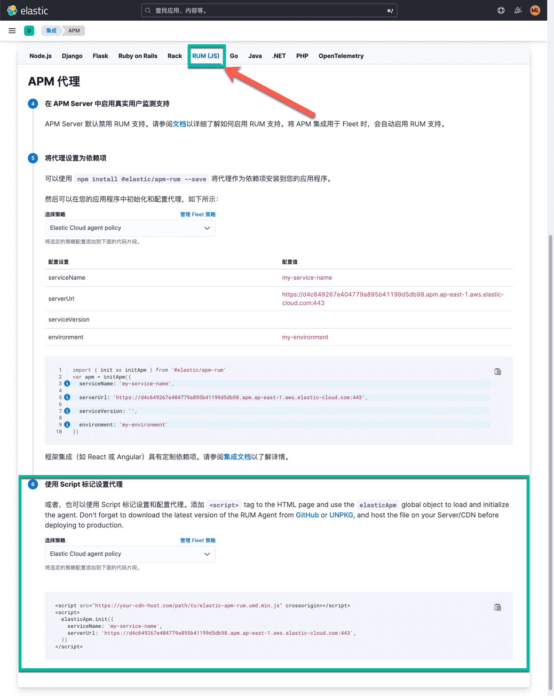

"Elastic RUM" 是指 Elastic Observability 中的实时用户体验监控（Real User Monitoring，RUM）功能，是 Elastic Stack 中的一部分。Elastic Stack 是一个开源的数据存储和分析平台，包括 Elasticsearch、Logstash、Kibana 和 Beats 等组件，用于处理和分析各种类型的数据。

Real User Monitoring（RUM）是一种用于监控网站或应用程序性能的技术。它通过追踪和分析实际用户与网站或应用程序交互的数据，从而提供有关用户体验的实时信息。RUM 的关键目标是了解用户在访问网站时经历的性能和交互情况，以便开发人员和运维团队可以识别并解决潜在的性能问题，从而提高用户满意度。

Elastic RUM 的优势包括：

1. **实时性能监控：** Elastic RUM 提供实时性能监控，使你能够迅速发现并解决用户可能遇到的性能问题。

2. **端到端可观察性：** 与 Elastic Stack 的其他组件集成，Elastic RUM 可以与日志、指标和其他数据源一起使用，为你提供端到端的可观察性，帮助你全面了解应用程序的运行状况。

3. **用户行为分析：** Elastic RUM 能够捕获用户与应用程序的交互信息，使你能够分析用户行为、浏览模式和访问路径，从而优化用户体验。

4. **可定制性：** 你可以根据特定的需求和业务场景定制 Elastic RUM 的配置，以满足不同应用程序和网站的监控需求。

5. **集成弹性搜索：** Elastic RUM 与 Elasticsearch 弹性搜索紧密集成，允许你使用 Elasticsearch 强大的搜索和分析功能来查询和可视化实时用户体验数据。

Elastic RUM 通过提供实时性能监控和与 Elastic Stack 的集成，帮助开发人员和运维团队更好地理解和优化用户体验，提高应用程序的性能和可用性。

## Elastic RUM 配置过程

本文以 Hugo 网站为例，介绍如何为 Hugo 网站添加 Elastic RUM 监控。我使用 Elastic Cloud 的 SaaS 服务作为数据存储和分析平台，你也可以使用自己搭建的 Elastic Stack 集群。

本博客所使用的主题是 [hugo-theme-stack 由 Jimmy 设计](https://github.com/CaiJimmy/hugo-theme-stack)。为其他主题添加 Elastic RUM 的过程类似，只是配置文件的位置和内容可能有所不同。

根据 Elastic Cloud 的页面上的配置向导，我们可以找到 Elastic RUM 的 JavaScript 代码，如下所示：

```html
<script src="https://your-cdn-host.com/path/to/elastic-apm-rum.umd.min.js" crossorigin></script>
<script>
  elasticApm.init({
    serviceName: 'my-service-name',
    serverUrl: 'https://d4c649267e404779a895b41199d5db98.apm.ap-east-1.aws.elastic-cloud.com:443',
  })
</script>
```

如下图所示：



在 APM 的配置向导里，我们先点击 RUM（JS）这个标签，然后页面中会出现为前端项目添加 Elastic RUM 的 JavaScript 代码的两种方式。

1. 可以使用 `npm install @elastic/apm-rum --save` 将代理作为依赖项安装到您的应用程序。然后可以在您的应用程序中初始化和配置代理。适用于与大多数的前端项目。而 Hugo 是一个静态网站生成器，不需要使用 npm 安装 Elastic RUM。
2. 本文直接使用的是选项二。将 Elastic RUM 的 JavaScript 代码复制到 Hugo 网站的 `layouts/partials/footer/custom.html` 文件中。


[]()


[]()

[]()


Feature picture ❤️ 