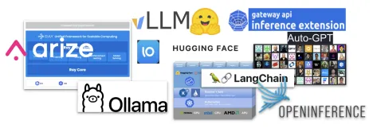
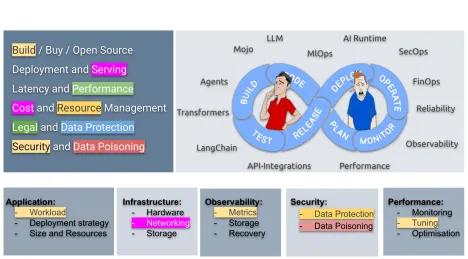
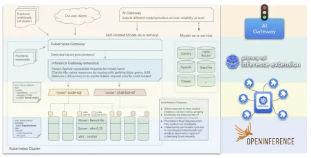

 Source: [Denys Vasyliev @ The New Stack](https://thenewstack.io/ai-reliability-engineering-welcome-to-the-third-age-of-sre/)

>SRE 必须构建值得信赖的 AI 系统，充分利用不断涌现的工具与标准化生态。

当 [Clayton Coleman](https://events.linuxfoundation.org/kubecon-cloudnativecon-europe/?p=clayton-coleman) 的这句话在 KubeCon 北美大会上被引用时，引发了强烈共鸣。仅仅五年前，问一位站点可靠性工程师（Site Reliability Engineer，SRE）他们的职责，回答通常围绕着让 Web 应用保持高性能、具备可扩展性和高可用性。而如今，整个技术格局已然发生深刻变化。AI 推理（Inference）工作负载——即训练完成的模型基于所学知识对新数据做出预测的过程——正逐渐成为像 Web 应用一样关键的核心系统。

“*Inference*——是指模型在推理阶段将其学到的模式应用于此前未见的数据，以生成预测或决策。在这个过程中，模型会利用其已有的知识，对来自真实世界的输入进行响应。”

这种演变催生了一个全新的工程领域：AI 可靠性工程（AI Reliability Engineering，AIRe）。我们面临的挑战早已不再是 HTTP 请求的延迟，而是如何减少大语言模型（LLM）在生成标记（token）时的卡顿。优化数据库查询显得有些传统，如今我们更需要关注如何提升模型的检查点（checkpoint）恢复效率和张量（tensor）处理性能。AI 模型，正如曾经的 Web 应用那样，也需要卓越的可扩展性、可靠性和可观测性——而这些能力的架构工作仍在持续进行中。

我已经深入从事 AI 可靠性工程近两年，专注于研究、原型设计，并构建实际的推理系统。从 DevOps 各类大会到 SRE Days，再到纽伦堡和伦敦的社区聚会，我不断与行业同行交流实践经验。现在，我希望在这里将这些珍贵的洞察与你分享。

**不可靠的 AI，甚至比没有 AI 更危险。**

* **推理（Inference）** 不仅仅是模型的运行过程，它是一门独立的运维工程学科，具备独特的架构抉择与工程范式。与训练阶段可以容忍时间与成本不同，推理处于生产的关键链路上，每一毫秒都可能影响最终体验。
* **实时 vs 批量**：推理运行方式主要分为实时（也称在线）和批量（离线）两种。实时推理支撑着聊天机器人、欺诈检测和自动驾驶等对低延迟有严苛要求的应用；而批量推理则周期性地处理大规模数据集，用于图像识别、日志分析或趋势预测等场景。
* **资源特征**：尽管相较训练更轻量，推理依然对性能要求极高。尤其在实时场景下，既需要快速计算，也要求基础设施具备高可用性。尽管 CPU 仍有用武之地，但现代推理系统越来越依赖 GPU、TPU，或专用芯片（如 AWS Inferentia、NVIDIA TensorRT）以实现极低延迟。
* **部署环境**：推理部署可以无处不在，从边缘设备到云端超大规模集群。你可以在 Serverless 端点、Kubernetes 集群，甚至微型 IoT 模块中找到它的身影。SageMaker、Vertex AI、Hugging Face 和 Together.ai 等平台让部署变得更轻松，但最终选择仍需在成本、控制力和延迟之间权衡。
* **性能优化手册(Playbook)**：性能与效率的挑战从未止步。团队广泛应用量化（例如将 FP32 精度转为 INT8）、模型蒸馏和神经架构搜索（Neural Architecture Search，NAS）等技术，以尽可能在不牺牲结果质量的前提下，打造更小、更快、更高效的推理引擎。
* **[可观测性与监控](https://thenewstack.io/monitoring-vs-observability-whats-the-difference/ "Observability and Monitoring")**：传统遥测系统难以满足需求。推理系统需要更精细的可观测性，涵盖预测延迟、token（标记）吞吐量、数据漂移，甚至模型幻觉（即生成虚假信息）的比率。OpenTelemetry、Prometheus 和专为 AI 打造的追踪工具如今已成为基础设施标配。
* **可扩展性**：推理流量不可预期，经常随着用户行为剧烈波动。因此需要通过 Kubernetes HPA、Cloud Run 实现高效自动扩容，并结合 Envoy、Istio、KServe 等实现智能流量调度，以确保系统始终从容应对。
* **安全防线**：AI 推理引入了新的安全挑战，包括对抗性输入攻击与潜在的数据泄露。工程师必须将模型端点像保护 API 端点一样严格防御，实施身份验证、访问频率限制、数据加密以及运行时完整性验证。

***推理已不再是机器学习的附属过程。它就是核心应用。它就是生产环境。而它也正在重塑整套运维架构体系。***

**传统的 SRE 原则虽为 AI 提供了基础，但已难以满足它的独特需求。**

* **模型的不确定性本质**：与典型的 Web 应用不同，AI 模型不是确定性的。同一个输入可能会产生不同结果。一个模型即便系统运行稳定、没有宕机，也可能输出错误、有偏差甚至荒谬的内容——这彻底颠覆了我们对“可靠性”的传统认知。
* **评估标准正在变化**：光靠“可用性 SLA”已远远不够。我们需要引入 *准确性 SLA* 的新范式，通过精确率、召回率、公平性以及模型漂移等维度，来衡量模型在实际环境下的表现。

* **基础设施变革**：随着 AI 工作负载的出现，传统的架构设计也在演进。像 Ingress、水平 Pod 自动扩缩（HPA）这些概念，正逐步被模型网格（Model Mesh）、LoRa 负载均衡、AI 网关等新技术所取代，尤其是在 GPU 资源密集的场景下尤为关键。Kubernetes 社区也在持续演进，推动包括“Serving 工作组”、动态资源分配（DRA）以及 Gateway API 等机制，以支持 AI 推理的特殊需求。
* **可观测性的盲区**：传统监控工具擅长监测 CPU、内存和响应延迟，但面对 AI 模型中的置信度、漂移情况，甚至幻觉（即模型生成虚假内容的倾向）等问题，常常无能为力。我们亟需构建 AI 专用的可观测性体系。
* **新型故障模式**：现在的问题已不再是“系统崩溃”，而是更隐蔽的“模型静默退化”。这种退化通常不会立刻显现故障，但模型的准确性、公平性会在不知不觉中下降，输出越来越偏离预期。将这种变化当作严重生产事故来看待，需要全新的监测机制和响应工具。

**模型衰减（Model Decay）**——也称为 *模型静默退化（Silent model degradation）*，不同于传统软件的崩溃报错，它表现为模型持续运行但输出质量悄然下降，可能变得不准确、带偏见或逻辑不一致。这种无声的“故障”，往往更难察觉也更难解决。

>我们为何将模型静默退化当作生产级事故来看待？

因为它本质上就是"silent failure"。与崩溃的 Pod 或无法响应的 API 不同，模型静默退化是悄无声息的——系统仍能正常响应请求，但返回的答案可能越来越模糊、偏颇甚至完全错误。用户不会看到直观的 500 错误页面，而是遇到“幻觉式”输出、有害内容，或基于错误数据做出的决策。这不只是代码 bug，更是对用户信任的严重破坏。在 AI 世界里，“正确性”本身就等同于可用性（uptime）。当“可靠性”意味着输出质量时，模型退化——就是宕机。

>我们或许不仅要为 AI 扩展 Kubernetes —— 甚至终有一天，我们不得不为它另起炉灶（fork）。

大语言模型（Large Language Models，LLMs）对流量路由、速率限制和安全防护提出了前所未有的要求，而这些功能并非 Kubernetes Ingress 机制的设计初衷。Kubernetes 架构自诞生以来就是围绕无状态 Web 应用打造的，推理场景从未被列为核心用例。尽管 Kubernetes 社区正积极适配，但关键差距依然存在。

推理工作负载需要更紧密集成的架构支持：既包括对 GPU/TPU 等硬件加速器的原生支持，也涵盖资源编排与高并发流控能力。为此，Kubernetes 正在推进多个项目，如 WG-Serving（针对 AI/ML 推理优化）、设备管理（通过 DRA 动态资源分配集成加速器），以及 Gateway API 推理扩展，这些都在为 LLM 的规模化、可靠路由打下基础。与此同时，新一代 AI 网关也应运而生，提供专为推理定制的流量控制、可观测性和权限管理能力。

但归根结底，我们仍是在一个“原本不是为 AI 而生”的编排平台上进行集成工作。Google 最近宣布，将 Kubernetes 的 etcd 存储引擎替换为基于 Spanner 的架构后，成功实现了单集群支持 65,000 节点的能力，这或许预示着未来我们不仅需要对 Kubernetes 进行功能扩展，甚至可能要彻底分叉（fork）一个属于 AI 推理的基础平台。

>那么，面对全新的 AI 现实，我们应如何实践 SRE 理念？

* **制定面向 AI 的服务目标与承诺（SLO/SLA）：** 传统的可用性指标已不足以衡量 AI 系统的可靠性。我们需要将准确性、公平性、延迟和模型漂移纳入考量，制定清晰的服务等级协议（SLA）。例如 TTFT（生成首个 token 的响应时间）、TPOT（每个输出 token 的平均生成时间）、准确率或偏差范围等，都是需要量化承诺的核心指标。
* **打造 AI 专属的可观测体系：** 在使用 OpenTelemetry、Grafana 等常规监控工具的基础上，结合 OpenInference 等 AI 专用追踪与评估平台，实现对模型响应分布、置信度评分和错误类型（如幻觉）的深入监测。
* **建立 AI 故障应急机制：** AI 系统可能出现特有问题，如突发的预测漂移或偏差上升。因此，我们需要制定专门的应急预案（playbook），包括模型自动回滚至稳定版本，或启用 AI 熔断机制，以保障系统稳定性。
* **兼顾扩展性与安全性进行架构设计：** 可通过模型副本负载均衡、缓存机制、GPU 调度优化（Kubernetes 仍在演进中）及 AI 网关等技术，管理推理流量并加强安全性。安全机制可涵盖基于 token 的限速、语义缓存与访问权限控制。同时，还需通过模型来源追踪、安全交付与运行时监控，确保模型始终可信、稳定。
* **构建持续评估机制：** 模型评估不应只在部署前完成。它应覆盖部署前的离线测试、上线前的影子测试与 A/B 测试，以及部署后的实时监控，持续检测模型是否出现性能漂移或精度退化。

## AI 网关：SRE 在 AI 时代的核心工具

在 SRE 发展的初期阶段，我们依靠负载均衡器、服务网格和 API 网关来管理流量、执行安全策略，并实现系统可观测性。而如今，AI 推理带来的工作负载同样需要这些能力——但复杂度更高，规模更大，且容不得半点延迟或错误。这就是 AI 网关登场的时刻。

你可以把它理解为现代 SRE 面对 AI 系统的一站式解决方案：它能将请求精准路由到正确的模型、在多个副本间实现高效负载均衡、实施速率限制与安全策略，并集成深度可观测性机制。像 Gloo AI Gateway 这样的项目正是这一领域的先锋，专注解决企业在 AI 落地中遇到的关键难题，如模型成本控制、基于 token 的权限机制、以及对 LLM 响应的实时追踪分析——这些都是传统服务网格难以胜任的。

这就是当代 SRE 的新定位：不仅要调节自动扩缩容机制，还要掌控 AI 系统的控制平面（control plane），成为智能系统运行的核心操盘手。

*AI 网关不仅是 SRE 新工具箱中的一员——它或许是最关键的那一个。*

## SRE 的第三个时代：AI 可靠性工程

SRE 的角色正在发生深刻转变。我们需要的是《97 条 SRE 必知法则》书中所强调的那种探索精神——对整个系统的深入理解，从芯片层的硬件架构到模型输出背后的微妙机制。我们要构建值得信赖的 AI 系统，并借助不断成熟的工具链与标准体系来实现这一目标。

Björn Rabenstein 曾提到 SRE 正步入“第三个时代”，一个其原则将全面融入系统建设的阶段。确实如此，但推动这个新时代到来的，不再是传统系统的演进，而是 AI 的崛起。AI 可靠性工程（AI Reliability Engineering）不仅仅是传统 SRE 的延伸，它代表了一次根本性的范式转移：从关注“基础设施是否可靠”，走向“智能系统本身是否可信”。
