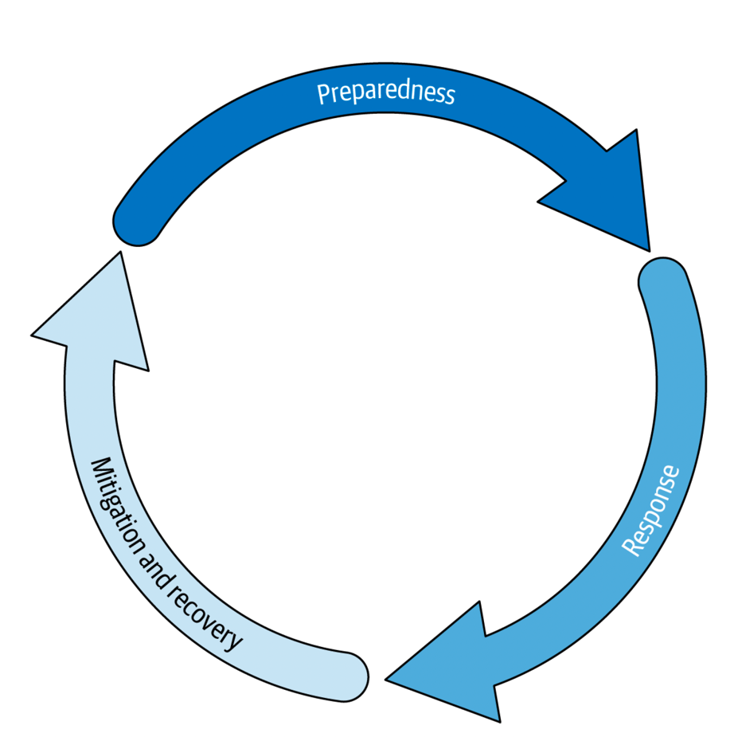

> 请不要误会——接下来的几周将会在个人和职业上带来巨大的压力，有时我们需要快速应对不断变化的情况。但我们已经为应对危机准备了十多年，并且已经做好了准备。在全球比以往任何时候都更需要信息、沟通和计算的时候，我们会确保 Google 能够提供帮助。
>
> ——Benjamin Treynor Sloss，Google 站点可靠性工程团队工程副总裁，2020 年 3 月 3 日

中断是不可避免的（这确实让人沮丧）。作为科学家和工程师，你们需要从长远角度看待问题，设计系统以实现最佳的可持续性、可扩展性、可靠性和安全性。但是，你们只能基于现有的知识进行设计。在实施解决方案时，你们也无法完全预知未来。你们不能总是预见到下一个零日事件、头条热搜话题、天气灾害、配置管理错误或技术变革。因此，你们需要随时准备应对这些可能影响系统的事件。

谷歌在过去十年中最大的技术挑战之一是 COVID-19 新冠疫情爆发所带来的。新冠疫情引发了一系列快速出现的事故，我们需要迅速应对以继续为用户服务。我们必须大幅提升服务容量，让员工在家高效工作，并在供应链受限的情况下找到新的服务器修复方法。正如 Ben Treynor Sloss 所言，谷歌能够在这一系列重大变故中持续提供服务，因为我们已经为此做好了准备。十多年来，谷歌积极投资于事故管理，这种准备是提高事故响应能力最重要的事情。准备工作能增强恢复力。恢复力和处理中断的能力是衡量技术长期成功（以数十年为单位）的关键因素。除了做好工程设计，还需要时刻准备应对业务服务的中断。

恢复力是公司运营的关键支柱之一。因此，事故管理是公司必不可少的流程。事故不仅对客户有影响，也对操作人员造成了负担。事故带来压力，通常需要人工干预。因此，有效的事故管理应该优先的考虑：预防性和主动性的工作，而不是被动应对。

我们知道管理事故压力大，找到和培训响应人员也很困难；我们也知道有些事故不可避免，中断会发生。与其问“如果发生事故你会怎么做？”，不如问“事故发生时你会怎么做？”。通过减少这种模糊性，不仅能减轻操作人员的负担和压力，还能缩短解决时间，减少对用户的影响。

我们写这份报告（白皮书）是为了总结一份：技术事故响应实践的指南。我们首先构建一些讨论事故的常用语言，然后深入探讨如何鼓励工程师、工程领导者和高管在组织内部思考事故管理。我们旨在涵盖从准备事故、响应事故、恢复事故，到保持健康组织的所有内容，以便大规模地应对各种突发情况。让我们开始吧。

## 什么是事故？

事故(incident)是一个含义广泛的词。其含义可能因不同群体而异。例如，在 ITIL 中，事故是指任何计划外的中断，如工单、报错或告警。无论这个词如何使用，重要的是要在其特定的定义上达成一致，以减少信息孤岛，确保每个人都在说同一种语言。

在谷歌，事故是指：

- 被升级的问题（因为影响太大，而无法单独处理）
- 需要立即响应的问题
- 需要有组织的进行响应的问题

有时，事故可能由服务中断引起，即服务在一段时间内不可用。中断可以是计划内的，例如在维护窗口期间系统故意不可用以进行更新。如果中断是计划好的并且已通知用户，则就不算是事故——并不需要开展立即、有组织的响应的事情。但通常情况下，我们指的是由未预见的故障引起的意外中断。大多数的意外中断都是事故，或最终会发展成为事故。

事故可能对客户造成影响。它们还可能造成收入损失、数据损坏、安全漏洞等，这些都可能影响客户。当客户受到事故影响时，他们对你的信任可能会动摇。因此，你需要避免过多或过于严重的事故，以保持客户满意；否则，他们会选择离开。

频繁的事故也会影响事故响应人员，因为处理事故的压力很大。找到具备适当技能来处理事故的站点可靠性工程师 (SRE) 既具挑战性又昂贵，因此你不希望通过让他们只负责事故响应来使其疲惫不堪。相反，你应该通过主动预防事故来提供他们技能成长的机会。在这份报告的后面，我们将进一步讨论这一点，以及减少压力和改善值班健康的方法。

## 并非所有问题都是事故

区分事故和中断很重要，同样重要的是区分指标、告警和事故。如何区分指标和告警，告警和事故？并不是每个指标都会成为告警，也不是每个告警都是事故。为了帮助你理解这些术语的含义，我们将首先讨论监控和告警在维护系统健康中的作用。

### 监控

监控是保持系统健康的最常见方法。根据《SRE Google 运维解密》的定义，监控是指收集、处理、汇总和展示系统的实时定量数据，例如查询计数和类型、错误计数和类型、处理时间和服务器在线时间。监控是一种度量。

在度量方面，我们建议采取以客户为中心的方法来制定服务质量目标 (SLO；在第 26 页的“减少事故的影响”中有更详细的讨论) 和优化客户体验。这意味着收集能准确反映客户体验的指标，并尽可能收集多种度量，如黑盒、基础设施、客户端和应用程序指标。使用不同方法测量相同的值可以确保冗余和准确性，因为不同的测量方法各有优势。以客户为中心的仪表板也能很好地反映客户体验，对于故障排除和事故调试至关重要。

重要的是，要专注于度量可靠性和对用户的影响，而不是度量已确认的事故个数。如果专注于后者，员工可能会因为害怕被惩罚而犹豫声明事故。这可能导致事故声明延迟，不仅浪费时间和丢失数据，还因为事后处理效果不佳。因此，声明事故并及时关闭比事后补救要好。

在这方面，有时人们会将可靠性和可用性混用，但可靠性不仅仅是“服务可用性”，特别是在复杂的分布式系统中。可靠性是指在大规模下提供一致服务水平的能力，包括可用性、延迟和准确性等方面。这在不同服务中可能（也应该）有不同的体现。例如，YouTube 和 Google 搜索的可靠性是否相同？根据你的服务，不同用户的期望会有所不同，可靠性也可能有不同的定义。

一般来说，如果系统的中断更少、更短、更小，它就更可靠。因此，最终取决于用户能容忍的停机时间。采用以客户为中心的方法，用户定义了你的可靠性。因此，需要尽可能接近地度量用户体验。（我们在第 26 页的“减少事故的影响”中对此进行了更详细的讨论。）

### 告警

我们已经讨论了系统健康监控。现在让我们谈谈监控的关键组成部分：告警(Alerting)。当监控发现系统行为异常时，会发送一个信号，这个信号就是告警。告警可能意味着两件事：某些东西已经损坏，需要有人修复；或者某些东西可能即将损坏，需要有人检查。紧急程度——即何时需要采取行动——应指导你选择如何响应。如果需要立即采取（人工）行动，应发送紧急通知。如果在接下来的几个小时内需要人工行动，应发送告警。如果不需要立即行动——例如信息是用于分析或故障排除——则信息保持为指标或日志的形式。

需要注意的是，告警的方式可能因组织偏好而异。例如，它可以在仪表板上显示，或以工单形式呈现。在谷歌，通常采用后者；监控系统在 Google 问题追踪器中创建一个具有不同优先级的“错误-bug”，这就是我们的工单形式。

现在你已经了解了基础知识，让我们深入探讨可操作的告警。

### 可操作告警的重要性

如前所述，当特定条件满足时，告警会触发。但你必须谨慎，只针对真正重要和可操作的事项发出告警。考虑以下场景：作为当班人员，你在凌晨 2 点被呼叫，因为过去 5 分钟内 QPS 增加了 300%。这可能是一个流量波动大的服务，有时流量稳定，但偶尔会有大客户发出大量查询。

这种情况下半夜叫醒你有何意义？实际上毫无意义。这个告警是不可操作的。只要服务没有崩溃的风险，就没有必要叫人起床。查看历史数据会显示服务需要应对这样的流量峰值，但这些峰值本身并不构成问题，不应生成告警。

再考虑一个更微妙但更常见的可操作告警问题。你的公司需要每晚备份生产数据库，因此设置了一个每四小时运行一次的 cronjob 进行备份。一次备份由于瞬时错误失败——用于备份的副本发生了硬件故障，并被负载均衡器自动移出了服务模式——但随后几次备份都成功了。结果还是创建了一个工单。

因为一次备份失败而创建工单是不必要的。这只会产生噪音，因为系统在无人干预的情况下自行恢复了。

这种情况经常发生。虽然最终只需简单地关闭工单并附上“处理时已经好了”的信息，但这种行为存在一些问题：

- **琐事 (toil)** 有人不得不花时间查看工单、分析图表和报告，最终发现他们不需要采取任何行动。
- **告警疲劳 (alert fatigue)** 如果 95% 的“数据库备份失败”告警只是被简单关闭，实际问题被忽视的风险会显著增加。

如前所述，事故是具有特定特征的问题。告警只是一个信号，表明可能有事故正在发生。你可能会遇到很多告警但没有实际事故。虽然这种情况不理想，但并不意味着你需要启动正式的事故管理技术；也许这是计划中的维护，你预期会收到这些告警。

同样，你也可能有事故但没有任何告警——例如，你从安全团队得知他们怀疑生产系统被入侵，但你的团队没有触发任何相关告警。

实际上，人们对告警和事故的感知有所不同：

- 正式的事故管理比简单处理告警要更有压力。
- 经验较少的响应者比经验丰富的响应者更不容易启动事故管理流程。
- 事故更可能需要额外的团队资源，因此其他团队成员可以更早判断是否需要介入。

这种情况不仅限于你的团队，事实上，它适用于整个组织。

告警通常比事故多。获取告警的基本指标（例如，每季度有多少告警）是有用的，但事故需要更详细的分析（例如，上季度的五个重大事故都是由于新功能在预生产环境中测试不足）。你不希望这些报告被所有收到的告警信息淹没。考虑到受众——告警指标主要对团队有用，而事故报告可能会被高层阅读，因此需要管理适用的范围。

希望这能澄清何时你可以更自信地说“这不是事故”。然而，这也带来了一个二分法：如果有些事情不是事故，那意味着有些事情是事故。你该如何处理这些事故？我们将在下一节探讨。

## 事故管理生命周期

最佳的事故管理不仅仅意味着尽可能快速地处理事故。良好的事故管理意味着关注事故的整个生命周期。在本节中，我们讨论一种系统化的事故管理方法。将事故视为系统中持续存在的风险。处理这些风险的过程称为事故管理生命周期。事故管理生命周期涵盖了准备、响应、恢复和缓解事故所需的所有活动。这是运营服务的持续成本。

所谓生命周期，我们指的是事故存在的每个阶段。这些阶段如图 1-1 所示，具体如下：

- **准备** ：包括公司或团队为应对事故发生而采取的所有措施。这可能包括工程上的安全措施（如代码审查或发布流程）、事故管理培训，以及识别错误的实验或测试演习。这还包括设置监控和告警。
- **响应** ：当触发因素导致潜在风险变为实际问题时的应对措施。这包括响应告警、决定问题是否是事故，并与受影响的人员沟通。
- **缓解和恢复** ：使系统恢复到功能状态的一系列行动。这包括为了避免影响或防止影响扩大的紧急缓解措施。恢复阶段还包括进行事后分析和反思，撰写事后报告。事后报告是一份关于事故的书面记录，包含采取的措施、影响、根本原因和防止再次发生或减少未来影响的后续行动。

一旦恢复阶段结束，你将重新进入准备阶段。根据系统的复杂性，所有这些阶段可能同时进行——但可以确定的是，至少总有一个阶段在进行中。

❤️ Photo by Pixabay: <https://www.pexels.com/photo/photo-of-a-2-fireman-killing-a-huge-fire-69934/>
