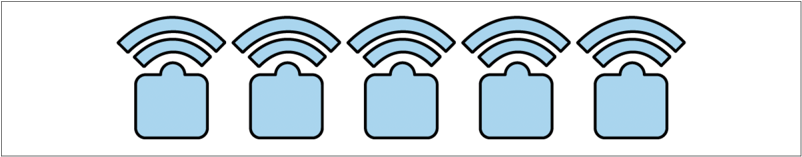
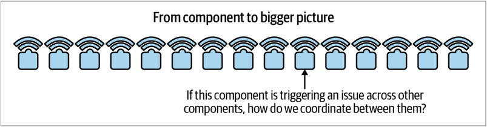
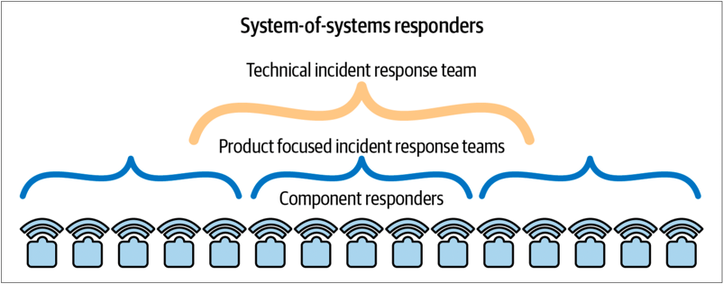
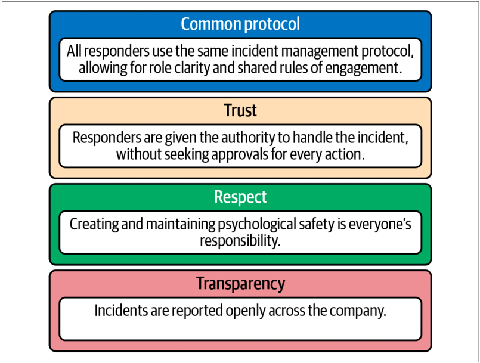

* [下载中文版 PDF 文件](/wp/anatomy-of-an-incident-cn.pdf)
* [下载英文版 PDF 文件](/wp/anatomy-of-an-incident.pdf)
* [从 Google 下载白皮书](https://sre.google/resources/practices-and-processes/anatomy-of-an-incident/)

我们已经讨论了通过事故响应演习、角色扮演和定期测试来练习事故响应准备。这些策略能帮助你在真实事故发生时做好准备并开始管理（见第31页“建立有组织的事故响应程序”）。但是，当你的组织开始扩展时【译者注：扩展是指将事故管理的流程在更大范围的业务系统上逐步应用推广的过程。】，如何管理事故呢？在本节中，我们讨论如何在大量的系统之上扩展事故管理（流程/实践）。

在 Google，我们为所有系统提供了最佳的事故管理覆盖。Google 规模庞大，每年处理超过 2 万亿次搜索，需要大量的数据中心、至少一百万台计算机和超过 80000 名员工。所有这些活动都通过一个庞大且高度互联的系统系（ system-to-system 简称 SoS）进行，依赖其技术堆栈保持生产运行。支持这个技术堆栈意味着适当的人员随时待命，以便在问题出现时进行故障排除和修复。这些人员是我们站点可靠性工程团队中的响应人员，他们为系统提供事故管理覆盖，并在事故发生时进行响应。

## 组件响应者

在站点可靠性工程团队中，我们还拥有组件响应者，他们负责 Google 技术基础设施中某个组件或系统的响应（图 3-1）。

组件响应者是某个单一系统的专家，精通该问题领域，是优秀的故障排除专家，并在危机期间实践缓解策略。他们可以持续访问执行紧急响应所需的工具和系统，能够很好地应对压力，并在危机期间保持清晰的思路。

单个组件响应者的责任范围有限，这使他们能够深入了解其领域及相关系统。这些响应者是防止故障从一个组件蔓延到整个堆栈的第一道防线。这些单独的组件比整体的系统体系级 SoS 堆栈要小，正如我们将在下面描述的“系统体系（SoS）响应者”一节中讨论的那样，通常具有明确且独立的系统边界。因此，可以设置合理的监控和告警机制，使组件响应者始终了解其系统的故障模式。

当技术堆栈的范围超出一个人可理解和维护的能力时，我们将技术堆栈拆分，以便多个响应者可以分别对整个堆栈的单个组件提供覆盖。随着时间的推移，这些组件变得更加复杂，并进一步分解。通过保持有限的范围，主要响应者可以在任何给定时间解决小范围内的问题。然而，也存在风险，即忽视了跨多个组件的生产故障，或者如果问题超出其专业范围，则无法为组件响应者提供足够的支持。

例如，假设一个底层故障在技术堆栈的显著部分发生级联效应。这种级联效应的速度超过了人类自我组织的速度。在一次影响范围广泛的事故中，我们很快就会达到每个组件团队都被呼叫、分配了响应人员并管理自己的状态。这些组件团队并行工作，但这些响应人员可能彼此并不知情（图 3-2）。其中一个响应人员处理的事故可能是根本原因，而其他则是后果。但究竟是哪一个呢？

在一个足够大且复杂的技术堆栈中，一个主要响应人员几乎不可能同时驱动缓解并维护所有依赖关系和被依赖关系的状态。为了缓解这种风险，除了出色的组件响应人员之外，我们还建立了一个二级响应人员的结构。我们在 Google 称这些二级响应人员为系统响应人员，接下来我们将讨论这一部分。

## 系统响应人员

系统响应人员（SoS 响应人员）负责处理跨多个组件系统、跨系统边界或复杂情况的事故。这些 SoS 响应人员经过专业培训，具有适当的权限和地位，并有权领导有组织的协调响应。他们是第二道防线，更全面地关注问题，并在应对分布式计算故障时提供关键优势支持（图 3-3）。

我们认为 SoS 响应人员是多系统事故管理者，技术全能，关注整体；他们在处理需要更广泛视角的事故方面有专业知识。通常，这些事故需要多个团队的参与；例如，一次重大系统级 SoS 故障会导致许多服务中断。这些事故可能会引发或已经引发下游故障，并可能扩展到服务边界之外。此外，这些事故可能已经持续了 30 分钟或更长的时间，且没有解决迹象，影响客户。

SoS 响应人员适合应对这些影响广泛的事故，因为他们知道如何组织他人并掌控复杂局面。他们还擅长诊断系统行为，找出根本原因，专注于扩展响应并广泛沟通事故情况。

在 Google，我们有两种类型的 SoS 响应人员。尽管每种类型都有其独特的功能，但它们经常协同工作：

* 产品专注的事故响应团队（IRTs）：这些团队保护特定产品领域的可靠性。例如，广告 IRT 和 YouTube IRT。并不是每个产品领域都需要事故响应团队，但随着产品不断推出新功能、变得更加复杂，并积累了技术债务，这些团队将非常有帮助。这些团队的成员不一定了解产品堆栈的每一个细节，但他们了解产品的整体运营和依赖关系。
* 技术事故响应团队（Tech IRT）：这是我们最广泛关注的事故响应团队。该团队专注于跨产品的事故、责任不明的事故或根本原因不清的普遍事故。Tech IRT 是我们的最后一道防线。成员是资深的 Google 员工，他们至少在两个不同的团队中担任过组件响应者，广泛了解系统运行，最重要的是，他们具备出色的事故管理技能。

Tech IRT 的成员继续为原团队工作，同时轮流进行全球 24/7 的值守/值班。他们能够在这些重大紧急情况下继续工作，因为他们经常练习这项专门技能。

Tech IRT 成员每年两次接受为期两周的生产培训，深入了解系统运行和故障的细节。他们还需要每季度展示有效使用紧急工具的能力。
图 3-4 描绘了 Google 的事故响应组织架构。随着架构级别的增加，产品日常功能的细节变得更加抽象。每个角色同样重要——金字塔的每个后续级别都承受较少的寻呼负载。如果组件响应人员无法解决问题且威胁到产品稳定性，他们可以将问题升级到产品专注的 IRT。

如果一个问题威胁到多个产品，或通过共享基础设施的解决方案可以更快缓解，Tech IRT 将被激活，作为所有下级问题的升级点，负责最广泛范围的操作。

那么，是什么使得这个组织架构能够无缝运行呢？答案是共同的协议、信任、尊重和透明度。接下来我们将详细探讨这些。

## 事故响应组织架构

成功的事故响应组织有四个特征：统一协议、信任、尊重和透明（见图 3-5）。

### 统一协议

在 Google，我们广泛使用 FEMA 事故指挥系统（ICS）的内部变体，其中事故响应人员有明确的角色，如事故指挥官、记录员和通信员。通过使用共享且明确定义的流程，我们建立了有效的紧急响应习惯，包括保持活跃状态、明确的指挥链和减少整体压力。每个人都了解交接流程，知道应该交接给谁，以确保知识的有效传递。就像象棋不能在麻将桌上玩，在紧急情况下，所有人都必须按照同一个规则行事。

### 信任

在事故发生期间，事故指挥官需要行使权威。他们需要指挥他人、组织混乱的能量，并判断合适的行动方案。对于许多组织来说，将权威级别与操作职责对齐是一个挑战，但我们的标准操作程序避免了只有高层业务主管才有权做出服务变更决策的惯例：我们将这种权威赋予具有背景知识和实时状态信息的主题专家（SME）。

### 尊重

确保所有响应人员在认为有必要时能够放心地升级情况非常重要。如果响应人员因为升级事故而受到审查、批评或被认为无能，他们可能不会在适当的时候进行升级。除了基本的礼貌，我们必须相信每个人在现有信息的基础上做出最佳决定。如果出现问题，关键不是责备某人，而是找出如何提供更准确和可操作的信息，以确保未来不再出错。这部分工作在事后分析过程中进行，Google 坚持严格的无责政策（稍后会详细介绍）【译者注：对事不对人策略】。

### 透明度

我们不进行信息隔离。当事故发生时，所有细节对所有人开放。如果禁止访问事故信息，就无法进行升级和互操作性——我们在事故解决后撰写的事后分析会在公司范围内的每周通讯中分享。我们鼓励通过阅读其他团队和产品领域发生的事故来进行跨团队学习。

### 风险管理

除了事故响应组织结构的特征外，还需要考虑如何管理风险。从识别到解决事故的时间不应超过三天。正如之前所说，事故管理在时间和人力上都非常昂贵。长时间保持在事故管理的活跃状态会导致疲劳和倦怠，可能促使你开始考虑跳槽。事故是已经升级并需要立即有组织响应的问题。这种紧急状态并非自然状态——人类的大脑延髓不应该被长时间刺激，他们的身体也不应该长期分泌大量皮质醇。

如果史前人类不断狩猎或被剑齿虎追捕，无法感到安全或休息，我们的进化会截然不同。如果你预计长时间处于战斗或逃跑模式，最终会导致团队成员的持续流失。

## 事故管理与风险的功能

为了减少事故管理的时间，重要的是认识到事故管理和风险的功能。事故管理是一项短期任务，旨在迅速纠正危险情况。事故的严重程度可以分为几个简单的类别。在 Google，我们根据组织的产品适当地量化了这些类别（见表 3-1）。

表 3-1. 严重性定义

| 严重性 | 定义 | 试金石 |
| ------- | ---- | ------ |
| 重大 | 面向用户的重大故障，产生负面新闻或对 Google 或特定 Google 客户造成巨大的收入影响。内部生产力故障只有在产生可见外部后果（如负面新闻周期）时才视为重大。 | 可能或已对 Alphabet/Google 品牌和业务造成损害。 |
| 严重 | 对用户可见的故障，但不会对 Google 服务或特定客户造成持久损害，或对 Google 或其客户造成可观的收入损失，或 50% 或更多的 Google 员工受到显著影响。 | 此类故障如果持续发生且未得到缓解，可能或将对 Alphabet/Google 品牌和业务造成损害。 |
| 中等 | 从差一点到重大/严重故障。大量内部用户受到显著影响。存在已知的解决方法，减轻了影响。 | 此类故障如果持续发生且未得到缓解，可能会随着时间推移导致越来越多的不稳定性和更高的维护成本。 |
| 轻微 | 外部用户可能未注意到故障。内部用户受到不便。导致网络、数据中心、实例等之间的流量发生意外波动。 | 此类故障如果持续发生且未得到缓解，不太可能随着时间推移导致更多不稳定性，但代表正常操作条件。 |
| 微不足道 | 事故对用户没有任何可见影响，对生产几乎没有实质性影响，但从中学到了宝贵的教训，需要以低优先级跟踪一些后续行动项目。 | 此类事故如果持续发生且未得到缓解，不会被视为过程失效。 |
| 忽略测试 | 这甚至不是一次事故。去做其他事情吧。 | 虚惊一场。 |

事故的规模大致反映了情况的“风险性”（根本原因/触发/影响）。事故管理旨在缓解短期影响，为组织的决策者争取时间来决定下一步措施。事故管理并不意味着要持续到避免所有短期和长期影响。对于庞大的技术堆栈或积累的技术债务，可能需要数月甚至数年才能彻底解决根本原因/触发条件。事故应只在短期影响尚未缓解时保持“开放”状态，并进行积极的管理。

在医院中，这相当于评估出血患者的紧急风险，并为其止血。那么接下来呢？医院会确定出血的原因并防止其复发。可能需要为患者制定长期计划，如避免再次遇到剑齿虎，或治疗引起出血的皮肤病。无论是哪种方式，一旦立即的危险消除，就会制定长期计划，包括必要时的全天候支持，以确保患者安全并防止再次出血。同样地，在你的技术堆栈中，一旦立即的危险解除，就应转向制定长期行动计划。

在事故管理中，通常可以在几分钟内重现事故的时间线。如果处理的是紧急问题，每一分钟都可能影响用户或造成收入损失。因为每一分钟都很重要，事故管理对经理们造成了很大压力——正如本节前面提到的，这不是一种长期的积极体验。当处理事故的长期后果（解决根本原因或触发因素）时，理想情况下，不再有立即的用户伤害或重大利润损失。这很好。这些高优先级工作需要立即执行，但不需要像管理事故那样紧迫。这些工作的时间线可以按天或周来衡量，而不必像之前提到的事故时间线那样不超过三天。在不需要的情况下，不要保持战斗或逃跑模式。关闭事故，转向恢复。

> 来源： <https://sre.google> ；本白皮书一共有 7 章，后续章节将陆续发布。完整中文版白皮书即将发布，敬请期待。

❤️ Photo by Pixabay: <https://www.pexels.com/photo/photo-of-a-2-fireman-killing-a-huge-fire-69934/>
