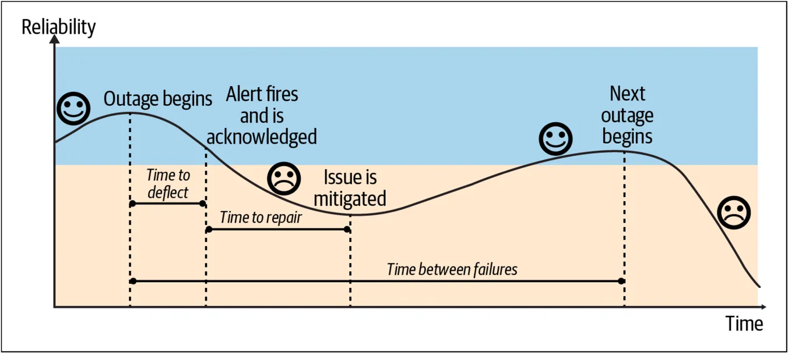
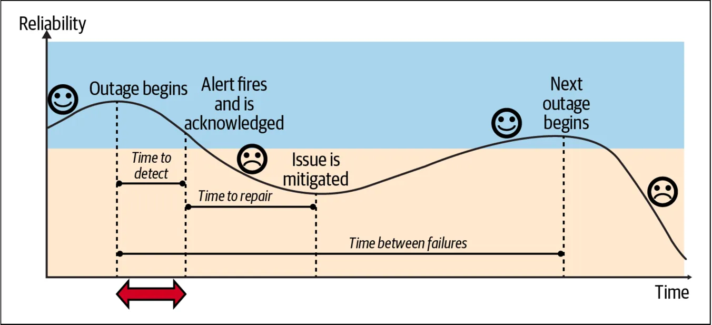
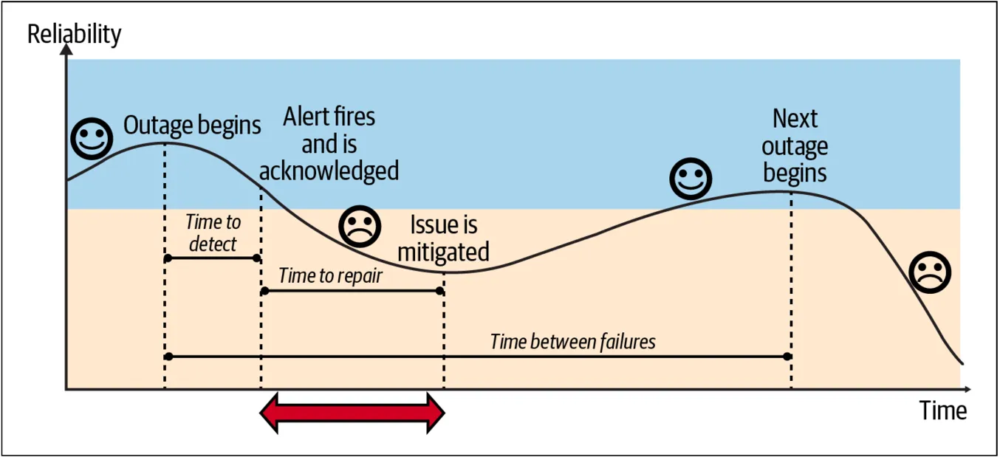
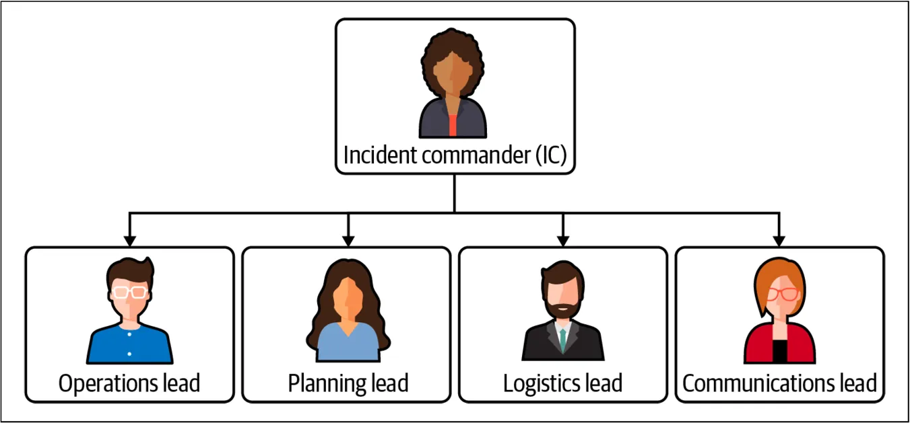
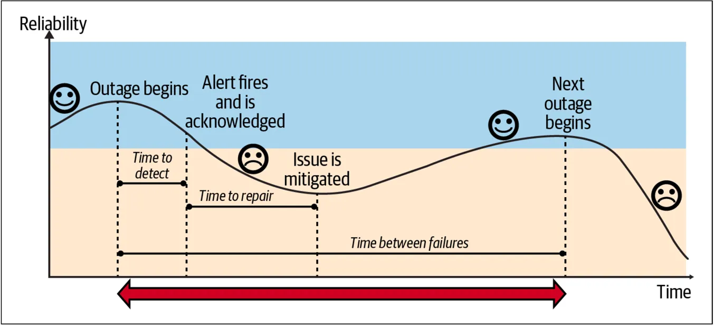

* [下载中文版 PDF 文件](/wp/anatomy-of-an-incident-cn.pdf)
* [下载英文版 PDF 文件](/wp/anatomy-of-an-incident.pdf)
* [从 Google 下载白皮书](https://sre.google/resources/practices-and-processes/anatomy-of-an-incident/)

我们已经讨论了如何扩展事故管理，使用组件响应者和 SoS 系统级响应者来帮助公司扩展时管理事故。我们还介绍了成功的事故响应组织的特征，并讨论了管理风险和防止值守人员倦怠。现在，我们来谈谈事故发生后的恢复工作。我们将从紧急缓解措施开始。

## 紧急缓解措施

之前我们提到在服务事故期间“止血”。恢复工作中包括必要的紧急缓解措施(Urgent Mitigations)[^1]，以避免影响或防止影响加剧。现在我们来谈谈这意味着什么，以及如何在紧急情况下，更容易的实施缓解措施。

假设你的服务遇到了一个严重的问题。中断已经开始，并已经被检测到了，用户正在受到着影响，而你负责解决这个问题。你的首要任务应该是：立即停止或减轻对用户的影响，而不是立即找出问题的原因。想象一下，你在家里，屋顶开始漏水。你首先会放一个桶在漏水处，以防止进一步受到水的损害，然后再去拿出需要的工具，去修补屋顶（稍后我们会发现，如果屋顶问题是根本原因，雨水就是触发因素）。桶的作用是减小影响，直到修复好屋顶。为了在服务中断期间减轻对用户影响，你需要准备好一些应急措施。我们称这些应急措施为**通用缓解措施**。

**通用缓解措施**是指在你找出具体问题之前，可以采取的减小各种中断影响的行动。

适用于你服务的缓解措施可能会有所不同，取决于用户受影响的方式。基本的措施包括：回滚代码、重新分配流量，以及增加服务器容量。这些临时措施旨在：为你和你的服务争取更多时间，以便找到彻底解决问题的方法。换句话说，它们修复的是中断的症状，而不是根本原因。你不需要等到完全的理解了中断的原因，就可以使用通用缓解措施。

考虑进行研究并投资开发一些快速“一键修复”（即比喻中的桶）。记住，尽管桶是一个简单的工具，但它仍然可能被误用。因此，为了正确使用通用缓解措施，重要的是要在定期的恢复力测试中进行演练。

## 减小事故的影响

除了用于应对紧急情况或事故的通用缓解措施外，还需要考虑从长远角度减小事故的影响 (Reducing the Impact of Incidents)。**事故**是一个内部术语。实际上，客户并不真正关心事故或事故的数量，他们关心的是可靠性。为了满足用户的期望，并实现用户所需的可靠性水平，需要设计和运行可靠的系统。

想要实现这一点，需要在事故管理生命周期的每个阶段中协调的行动：准备、响应和恢复。考虑在事故发生前、发生期间，和发生后可以做些什么，从而改进系统。

虽然很难直接衡量客户信任，但可以使用一些代理指标来评估提供可靠客户体验的效果。我们称客户体验的度量为服务质量指标 (SLI)。SLI 告诉你在任何时刻服务的表现如何，是否达到预期。

在这个范围内，客户可以是终端用户、人类或系统（如 API），或另一个内部服务。内部服务类似于为其他内部服务提供核心功能，而这些服务最终面向终端用户。你需要确保关键依赖项的可靠性（即硬性依赖或不可缓解的依赖——如果它失败，你也会失败）。这意味着如果面向客户的服务依赖于内部服务，这些服务需要提供更高水平的可靠性。

SLI 的可靠性目标称为服务质量目标 (SLO)。SLO 将目标汇总到一段时间内：它表示在某个管理时间窗口中，这是你要去实现的目标，体现了你的管理水平如何（通常以百分比衡量）。[^2]

可能大多数人都熟悉服务质量协议 (SLA)。SLA 定义了你向客户承诺的服务内容；即如果未能达到目标，你愿意采取的措施（如退款）。为了实现这一点，需要使 SLO（你的目标）设定的比 SLA 要更严格一些。[^3]

我们用来检查和衡量用户满意度的工具称为**用户旅程**。用户旅程是以文本形式编写的陈述，用来描述用户的视角。用户旅程探讨了：用户如何与服务互动的过程，以实现自己想要的目标。那些最重要的用户旅程被称为**关键用户旅程** (CUJ)。[^4]

一旦定义了对你和用户或客户重要的目标，就可以开始考虑：当未能达到这些目标的时候，都会发生什么。

### 计算事故的影响

事故会影响可靠性目标，影响的大小：取决于故障的数量、持续时间、影响范围和规模。因此，想要减小事故的影响，首先需要了解可以采取哪些措施。让我们先看看应该如何量化和衡量事故的影响。

图 4-1 显示了衡量影响的方法：计算不可靠的时间，包括检测到问题的时间和修复（缓解）问题的时间，然后将其乘以事故的次数，即事故的频率。

关键指标是检测时间、修复时间和故障间隔时间：

* 检测时间（TTD）是从中断发生到某个人被通知或告警的时间。
* 修复时间（TTR）是从某人被告警到问题缓解的时间。关键是缓解！这指的是响应者采取措施减轻客户影响的时间，例如通过将流量转移到其他区域。
* 故障间隔时间（TBF）是从一次事故开始到，同类型事故下一开始的时间。

想要减小事故的影响，并使系统恢复到已知正常的状态，需要技术和“人”的因素的结合，例如：流程和支持。在谷歌，我们发现一旦涉及人为干预，中断至少会持续 20 到 30 分钟。通常，自动化和自愈系统是很好的策略，因为它们会有助于缩短检测时间和修复时间。

需要注意的是，使用的方法也很重要。简单地降低告警阈值可能导致误报和噪音，过度依赖自动化快速修复可能减少修复时间，但会忽略根本问题。在下一节中，我们将分享几种策略，这些策略可以更有效地减少检测时间、修复时间和事故频率。

### 缩短检测时间

减小事故影响的一种方法是缩短检测事故的时间(Reducing the Time to Detect)（图 4-2）。在起草 SLO（可靠性目标）时，需要我们进行前置的风险分析，并确定出那些优先的待办事项，识别可能阻止实现 SLO 的因素，这也有助于缩短检测到事故的时间。此外，你可以采取以下措施来最小化检测时间：

* 将 SLI（客户满意度指标）尽可能与用户的期望对齐【译者注：考虑用户体验的好坏，以及关键用户旅程的可用性】，这些用户可以是实际用户或其他服务。将告警与 SLO（你的目标）对齐，并定期回顾评审，确保它们仍然能代表用户的满意度。
* 使用最新的信号数据。选择最佳的数据获取方式：流、日志或批处理。在这方面，在**告警速度**与**噪音数**之间找到合适的平衡度也很重要【译者注：SLI 告警的灵敏度高情况下，考虑到所选择 SLI 信号数据源的质量，如果假性告警越少，则噪音数量越低。】。噪音告警是 Ops 团队（无论是传统的 DevOps 团队还是 SREs）最常见的一个抱怨。
* 使用有效的告警以避免告警疲劳。在需要立即采取行动时使用呼叫【译者注：短信、电话外呼等任何快速触达的通知方式】。只有正确的响应者——特定团队和所有者——才应该收到告警。另一个常见的投诉是收到不可操作的告警【译者注：与事故无关的人员也经常会在半夜被值守的人喊醒，冤】。

随之而来的问题是：“如果只对需要立即采取行动的事情进行呼叫，那其余的问题如何处理？”一个解决方案是：为不同情况使用不同的工具和平台。可能“正确的平台”是，一个工单系统或仪表板，或者仅需要根据该指标，用拉取的处理模式，进行相应的故障排除和调试。

### 缩短修复时间

我们已经讨论了：用缩短检测时间作为减小事故影响的一种方法。另一种方法是：缩短修复时间(Reducing the Time to Repair)（图 4-3）。缩短修复时间主要涉及“人”的方面。使用事故管理协议和组织事故管理响应可以减少事故管理的模糊性，缩短对用户影响的时间。除此之外，你还需要培训响应者，制定明确的程序和手册，并降低值守的压力。让我们详细探讨这些策略。

**培训响应者**

未准备好的值守人员会导致更长的修复时间。考虑对值守人员进行灾难恢复测试培训，或者进行我们之前提到的“厄运之轮”演习。另一种方法是通过导师指导进行值守准备。让值守人员成对工作（“配对值守 pair on call”），或者让新人在他们的轮班期间与有经验的值守人员一起工作（“跟班 shadowing”），有助于增强新队员的信心。记住，值守可能是有压力的。制定明确的事故管理流程可以减少这种压力，因为它消除了任何模糊性，并明确了所需的行动。[^5]

**建立有组织的事故响应程序**

事故管理中存在一些常见问题。例如，缺乏责任感、沟通不畅、缺乏层次结构和自由发挥/英雄主义，可能导致更长的解决时间，也会增加值守人员和响应者的额外压力，并最终影响到客户。为了解决这个问题，我们建议通过建立一个层次结构明确的结构、任务和沟通渠道来组织响应。这有助于保持清晰的指挥链，并指定明确的角色。

在谷歌，我们使用 IMAG（谷歌事故管理），这是一个基于消防员和医护人员使用的事故指挥系统（ICS）的灵活框架。IMAG 教你如何通过建立层次结构明确的结构、任务和沟通渠道来组织紧急响应。它建立了一种标准、一致的方式来处理紧急情况和组织有效的响应。[^6]

IMAG 协议为解决事故的人提供了一个框架，使紧急响应团队能够自我组织和高效工作，通过确保响应者和相关利益相关者之间的沟通，控制事故响应，并帮助协调响应工作。它规定事故指挥官（IC）负责协调响应并分配职责，而其他人向 IC 报告。每个人都有一个具体的、明确的角色——例如，操作负责人负责解决问题，沟通负责人负责处理沟通。

通过使用这样的协议，你可以减少模糊性，明确团队合作，并减少修复时间。[^7]

**建立明确的值守政策和流程**

我们建议记录你的事故响应和值守政策，以及在中断期间和之后的应急响应流程。这包括明确的升级路径和责任分配，以减少处理中断时的模糊性和压力。

**编写有用的运行手册/操作手册**

文档很重要，它将工作经验转化为所有队员都能访问的知识，无论工作年限。通过优先记录和安排时间编写文档，并创建记录程序的操作手册和政策，队员们可以更容易识别事故的表现形式——这是一项宝贵的优势。操作手册一开始不必完备；从简单的开始，提供一个明确的起点，然后逐步改进。一个好的经验法则是谷歌的“看到问题，立即解决 see it fix it”的方法，并让新队员在入职时就来更新这些操作手册。

将编写操作手册作为事后复盘分析的重要行动项目之一，并将其视为个人对团队的积极贡献，这通常需要领导的优先支持和资源分配。

**减轻响应者的疲劳**

如第二章所述，响应者疲劳的心理成本是有据可查的。如果响应者疲惫，他们的解决问题能力会受到影响。确保班次平衡，如果不平衡，使用数据来找出原因，并减少琐事。[^8]

**投资于数据收集和可观测性**

做出基于数据的决策很重要，缺乏监控或可观测性是一种反模式。如果你无法看清路况，你就不知道前进方向。因此，鼓励组织内的度量文化，收集贴近客户体验的指标，并衡量你在目标和错误预算消耗率方面的表现，以便及时反应和调整优先级。还要衡量团队的琐事工作量，并定期审查你的 SLI 和 SLO。

尽可能收集高质量的数据，特别是更贴近客户体验的数据；这有助于排除故障和调试问题。收集应用程序和业务指标，以便拥有关注客户体验和关键用户旅程的仪表板和可视化。这意味着为特定受众和目标设计的仪表板。管理者对 SLO 的视角，将与用于在排查事故和故障过程中使用的仪表板非常不同。

如你所见，有许多方法可以缩短修复时间，并最大限度地减小事故的影响。现在让我们看看延长故障间隔时间来减少事故影响的另一种方法。

### 延长故障间隔时间

为了延长故障间隔时间并减少故障次数，可以重构架构，并解决在风险分析和流程改进中识别出的故障点（图 4-5）。此外，还有一些措施可以帮助延长 TBF（故障间隔时间）。

**避免反模式**

我们在本报告中提到了几种反模式，包括缺乏可观测性，缺乏正反馈回路，这会导致系统发生过载，并引发级联问题，如崩溃。这些反模式需要避免。

**分散风险**

通过冗余、解耦责任、避免单点故障，和用全局优化来分散风险，并采用高级部署策略。考虑渐进式的滚动和金丝雀发布，将更新工作分布在数小时、数天或数周内，这样可以在所有用户受到影响之前，减少风险并识别问题。同样，进行自动化测试、滚动发布和自动回滚，以便及早发现任何问题。主动发现问题，总要比让问题来骚扰你会更好；那就要通过实践混沌工程和引入故障注入，以及自动化灾难恢复测试（如 DiRT，见第二章）来实现这一点。

**采用开发实践**

采用促进质量文化的开发实践，并创建集成代码审查和健壮测试的过程，这些过程可以集成到持续集成/持续交付（CI/CD）流水线中。CI/CD 可以节省工程时间，并减小对客户的影响，使你能够自信地部署。

**以可靠性为设计原则**

在 SRE 中，我们有一句话：“碰运气不是一种策略。” 当谈到故障时，问题并不是会不会发生，而是什么时候发生。因此，从一开始就以遵循：可靠性为设计原则，构建能够应对故障的健壮架构。通过以下问题来了解你如何应对故障：

* 我的系统能够应对哪种类型的故障？
* 它能容忍意外的单实例故障或重启吗？
* 它如何应对区域性AZ或地区性Region故障？

意识到风险及其潜在影响范围后，进入风险缓解阶段（如在风险分析中所做的那样）。例如，为了缓解单实例问题，使用持久磁盘和配置自动化，并且备份数据。为了缓解区域和地区故障，可以在各个地区和区域分配资源并实施负载均衡。还可以进行横向扩展。例如，将单体架构解耦为微服务，更容易独立扩展它们（“做好一件事”）。横向扩展还可以意味着地理上（Region）的扩展，例如拥有多个数据中心以利用弹性。我们建议尽可能避免手工配置和特殊硬件。

**优雅降级**

在你的架构中实现优雅降级(Graceful degradation)方法非常重要。将降级视为一种策略，例如限流和负载分流。问自己，如果不能为所有用户提供所有功能，我能否可以最小功能为所有用户服务？能否限流用户流量并丢弃高成本的请求？当然，什么是可接受的降级程度，要依赖于服务和用户旅程。返回 x 个产品和返回未更新的账户余额之间存在差异。但作为经验法则，能提供降级的服务，总比停止服务的好。[^9]

**深度防御**

深度防御(Defense-in-depth)是构建系统以应对故障的一种方式，更准确地说，是容忍故障。如果依赖某个系统获取配置或其他运行时信息，确保有一个备用或缓存版本，当依赖项不可用时，而它们仍能继续工作。[^10]

**N+2 资源**

在分布式系统中，拥有 N+2 资源是实现可靠性的基本原则。N+2 意味着：你有 N 的容量来处理高峰期的请求，并有另外 2 的实例，其中一个可用于应对意外故障，另一个可用于计划升级。如前所述，你的可靠性取决于关键依赖项的可靠性，因此在架构中选择正确的构建块（Building block）。在云平台上构建时，确保使用服务的可靠性水平，并将它们与你的应用目标相关联。注意它们的范围（例如，在 Google Cloud Platform 中，范围可以是区域性的、区域间的或全球的[zonal, regional, global]）。记住，在设计时就主动解决可靠性问题，可以降低后期的成本。[^11] 并不存在一刀切的解决方案，应让需求指导你来做出因地制宜的设计决策。

>非抽象大型系统设计 (NALSD)
>
>在讨论可靠性和 SRE 的设计时，我们不能不提到非抽象的大型系统设计。在谷歌，我们发现，在设计阶段解决可靠性问题可以降低未来的成本。如果采用迭代式系统设计和实施风格，可以用更低的成本，开发出健壮且可扩展的系统。我们称这种方法为非抽象大型系统设计 (NALSD)，它描述了谷歌用于生产系统的迭代式设计过程。你可以在谷歌的 SRE 课堂栏目中了解更多相关内容。

**从失败中学习**

最后，你可以从失败中学习，使未来更好（更多内容请参见第40页的“心理安全”）。如前所述，事后分析是实现这一目标的工具。确保你有一致的事后分复盘析流程，能够产出错误修复（bug fix）、缓解措施和文档更新的后续跟踪落地行动项。像跟踪其他错误（bug）一样跟踪事后 复盘分析的行动项（如果还没有这样做），并应该优先考虑事后复盘分析工作，而不是“常规日常”的工作。[^12] 我们将在下一节中更详细地讨论事后复盘分析。

[^1]: 推荐阅读：Jennifer Mace 的《通用缓解措施》<https://www.oreilly.com/content/generic-mitigations/。>
[^2]: 参见《SRE Google 运维解密》（O'Reilly）中的第 4 章，“服务质量目标 (SLOs)”。<https://sre.google/sre-book/service-level-objectives/>
[^3]: 参见 Adrian Hilton 2021 年 5 月 7 日的文章《SRE 基础 2021：SLIs vs SLAs vs SLOs》。<https://cloud.google.com/blog/products/devops-sre/sre-fundamentals-sli-vs-slo-vs-sla>
[^4]: 参见《Google SRE 工作手册》（O'Reilly）中的第 2 章，“实施 SLOs”。<https://sre.google/workbook/implementing-slos/>
[^5]: 参见 Jesus Climent 2019 年 12 月 5 日的文章《缩短生产事故缓解时间—CRE 生活教训》。<https://cloud.google.com/blog/products/management-tools/shrinking-the-time-to-mitigate-production-incidents>
[^6]: 参见《Google SRE 工作手册》中的第 9 章，“事故响应”。<https://sre.google/workbook/incident-response/>
[^7]: 参见《SRE Google 运维解密》中的第 14 章，“管理事故”。<https://sre.google/sre-book/managing-incidents/>
[^8]: 参见 Eric Harvieux 2020 年 1 月 31 日的文章《使用 SRE 原则识别和跟踪琐事》。<https://cloud.google.com/blog/products/management-tools/identifying-and-tracking-toil-using-sre-principles>
[^9]: 关于负载分流和优雅降级的更多内容，参见《SRE Google 运维解密》中的第 22 章，“解决级联故障”。<https://sre.google/sre-book/addressing-cascading-failures/>
[^10]: 参见 Ines Envid 和 Emil Kiner 在 Google 博客上的文章《深入了解 Google Cloud 网络：确保环境安全的三项深度防御原则》，2019 年 6 月 20 日。<https://cloud.google.com/blog/products/networking/google-cloud-networking-in-depth-three-defense-in-depth-principles-for-securing-your-environment>
[^11]: 参见《Google SRE 工作手册》中的第 12 章，“引入非抽象大型系统设计 (NALSD)”。<https://sre.google/workbook/non-abstract-design/>
[^12]: 参见 Google Research 的 Betsy Beyer、John Lunney 和 Sue Lueder 的文章《事后分析行动项：计划工作并完成计划》。<https://research.google/pubs/postmortem-action-items-plan-the-work-and-work-the-plan/>

> 来源： <https://sre.google> ；本白皮书一共有 7 章，后续章节将陆续发布。完整中文版白皮书即将发布，敬请期待。

❤️ Photo by Pixabay: <https://www.pexels.com/photo/photo-of-a-2-fireman-killing-a-huge-fire-69934/>
