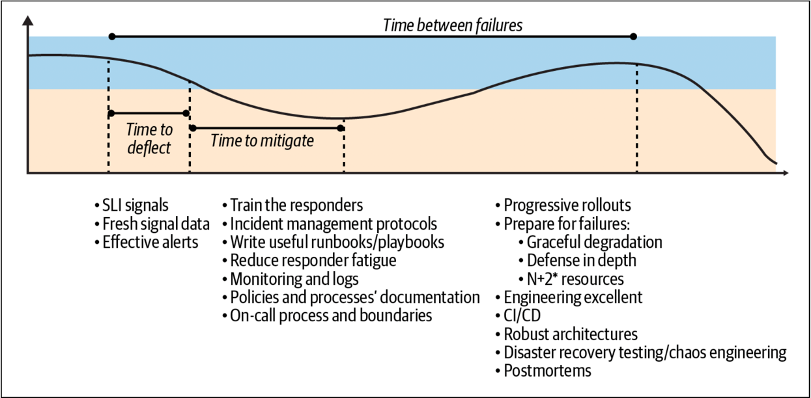
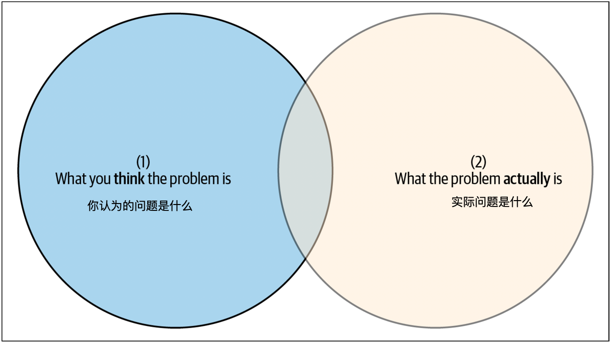
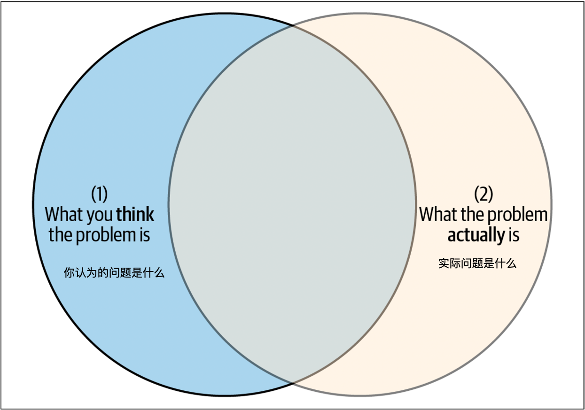
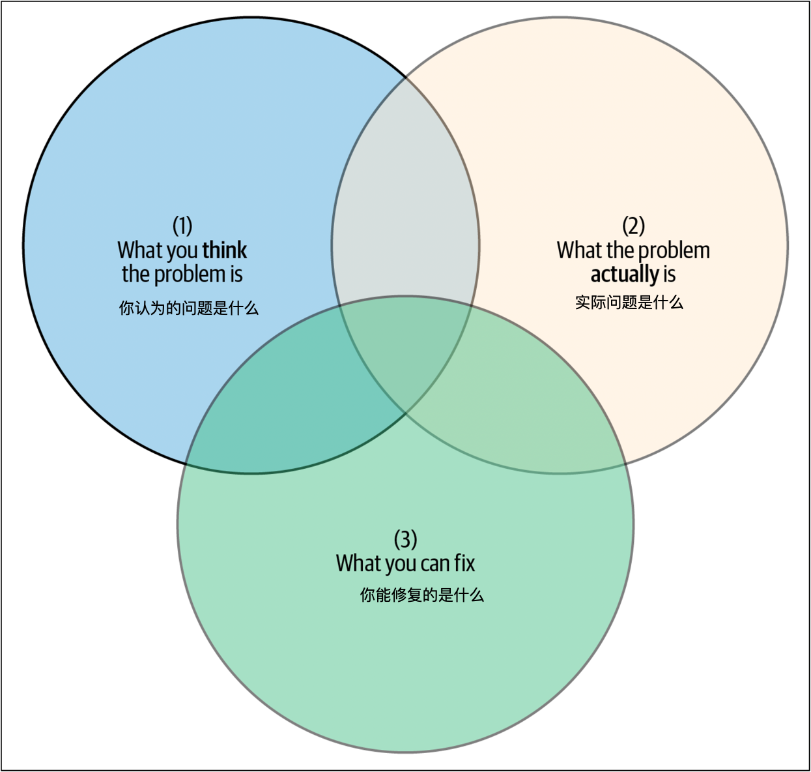
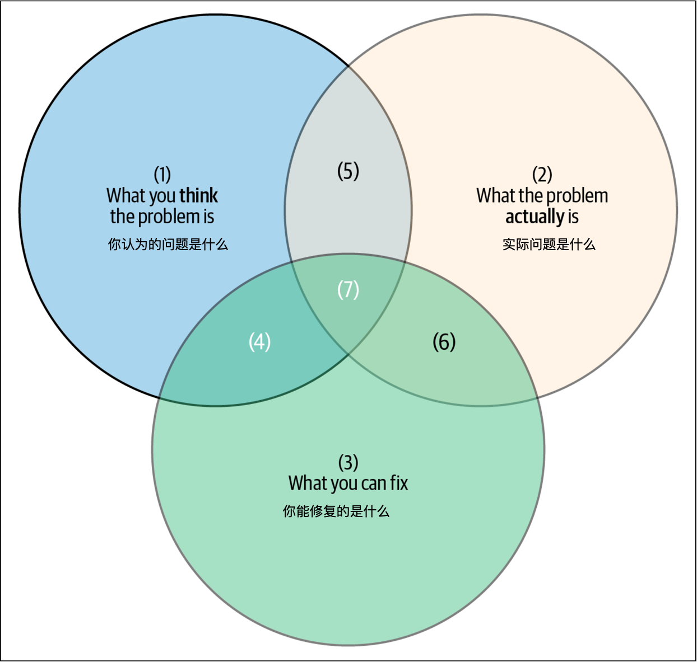

* [下载中文版 PDF 文件](/wp/anatomy-of-an-incident-cn.pdf)
* [下载英文版 PDF 文件](/wp/anatomy-of-an-incident.pdf)
* [从 Google 下载白皮书](https://sre.google/resources/practices-and-processes/anatomy-of-an-incident/)

在前一章中，我们介绍了几种减小客户影响的方法，包括技术和人员方面，因为两者都会影响检测时间、缓解/恢复时间和故障间隔时间。在本节中，我们将讨论事故结束后的工作：撰写事后复盘分析，并将其作为强大的工具来分析问题并从错误中学习。

在事故结束后，应该确保集中精力在如何减少未来的事故上？为了解决这个问题，我们建议采用数据驱动的方法（图 5-1）。这些数据可以来自风险分析过程，或者是我们之前提到的度量数据。依靠从事后复盘分析中收集的数据，以及对之前影响客户的事故的学习非常重要。

一旦你积累了足够多的事后复盘分析，就可以识别出模式。让事后复盘分析成为你的指南非常重要；在失败分析上的投资可以引导你走向成功。为此，我们建议创建一个共享库，并在内部团队中广泛分享事后复盘分析。

## 心理安全

在谈论事后复盘分析时，不可避免地要讨论心理安全(Psychological Safety)。因此，在深入探讨撰写事后复盘分析的细节之前，我们先来谈谈事故管理文化中固有的心理安全，并讨论早期升级的价值。

如果客户受到影响，应该尽快解决问题。如果组织内的人们不觉得升级或扩大事故规模是安全的，那么问题就难以解决。如果公司环境阻止人们质疑，或因升级事故而受到惩罚，响应者可能会犹豫是否质疑。如果是这样，事故只会在改善之前变得更糟。

失败是正常的，需要接受这一点。这就是为什么实施 SRE 原则需要支持性和赋权文化的原因。关键在于理解，在不断通过新功能和系统改进服务的过程中，事故和中断是不可避免的。因此，如果不从事故中学习，就错失了改进的机会。正如合气道创始人植芝盛平所说：“失败是成功之钥，每一个错误都教会我们一些东西。”

将运维问题视为软件工程问题，当事情出错时（而且确实会出错），要寻找的是系统中导致问题的缺陷。你要改进系统，以帮助避免人为错误。

>人类永远不是事故的原因，而是“允许”事故发生的系统和流程。

如果发生了中断，那是系统的错误，而不是人类的错误，因为人为错误是不可避免的。目标不是消除人为错误。【译者注：带有缺陷的系统导致了人为错误，或者人类遭遇到了事故；这里我们要把人的原因摘除的干干净净，这一点需要依靠大家构建心理安全的企业团队文化。】

### 实施事故管理实践时的心理安全

实施事故管理实践是一项组织变革，需要一些文化前提条件才能让团队从错误中创新和学习。拥有心理安全和无责流程是至关重要的。(Psychological Safety When Implementing Incident Management Practices)

>心理安全是一种信念，即谁不会因为提出想法、问题、质疑、担忧，或遭遇到了错误而受到惩罚或羞辱。
>——艾米·埃德蒙森，哈佛商学院诺华教授，领导力与管理学博士

心理安全促进了绩效导向型组织的一些主要特征，特别是将失败视为学习机会和接受新想法。例如，Westrum 的组织文化模型预测了基于心理安全的软件交付绩效：生机型组织比其他两种类型更有可能成为顶级绩效者。[^1]

具有较高心理安全的团队更能利用成员多样化的想法，销售目标超额完成17%（相比之下，不安全的团队错失目标19%），并且被高管评为有效的概率是其两倍。[^2]

### 处理事故时的心理安全

在风险管理中，每个人都知道自己可以表达意见和识别问题，而不会受到惩罚或嘲笑，这是至关重要的。当发生事故时，必须报告并宣告为事故【译者注：声明发生了事故，开始进入事故应急管理流程】。在事故期间，可能需要分享以前事故的信息，如果这样做可以揭示过去的错误（这与无责原则有关）。你还可能需要将事故移交给下一位值班工程师，并提出改进内部流程、工具和功能的建议。

没有心理安全和无责原则，人们会避免提出可能揭示事故根本原因的正确问题。因此，团队无法学习或创新，因为他们忙于管理形象，并且害怕承担个人后果。

为了在团队中培养心理安全和无责原则，关注学习机会：将每次事故视为学习机会，鼓励多样化的观点，邀请每个人（尤其是那些发表不同意的人）表达意见和想法。作为领导者，你还应该承认自己的不足【译者注：没有人是全知全能和权威的，大家都要从发问，和假设开始分析故障】，通过提问来展示好奇心。

**不归咎于个人**

无责原则和心理安全是相辅相成的，一个可能自然导致另一个。假设发生了一次中断。如果经理问的第一个问题是“是谁造成的？”，这会造成一种互相指责的文化，使团队害怕冒险，从而阻碍创新和改进。相反，你应该提倡无责原则：

>无责原则是将责任从个人转移到系统和流程上。[^3]

指责文化会妨碍人们迅速解决事故和从错误中学习的能力，因为他们可能会隐藏信息，避免因害怕受罚而宣告事故。而无责文化允许你专注于改进。你要假设个人是出于善意行事，并根据现有的最佳信息做出决策。调查误导性信息的来源对组织比归咎于人更有益。因此，支持团队的设计和维护决策，鼓励创新和学习，当事情出错时，关注系统和流程，而不是个人。

**从错误中学习**

错误是宝贵的学习和改进机会，但前提是正确识别错误的程序性和系统性原因。例如，在谷歌，Ben Treynor Sloss 发送季度工程报告《谷歌的成与败》，以培养一种能够从错误中学习的赋权文化。[^4]

### 促进心理安全环境的其他提示

事故响应者需要一定的信心才能有效应对事故。尽管他们可能处于压力大的情况下，但在处理事故时，响应者必须感到心理安全。

这种心理安全涉及多个层面：

**来自队友**

- 响应者不应该担心他们的行为会被同伴评判，尤其是在犯错误时。
- 说“我需要帮助”应该得到奖励，而不是质疑或责备。

**来自合作团队**

- 有些团队可能会觉得 X 团队的成员有居高临下的坏名声，因此不愿与他们交流。更糟糕的是，有些团队接受这种文化，或者利用它来避免与其他团队互动。[^5]这种态度不应被容忍——它会增加紧张情绪，并延缓事故响应。

**来自管理层 (From management)**

- 经理负责团队的心理安全。在事故期间，经理通常不做技术工作，而是专注于确保团队的福祉——观察压力和倦怠的迹象，也许在团队处理事故时订购披萨。有时经理可能只是简单地对事故响应者说，“休息五分钟，清理一下头脑。”
- 经理也可以在获取组织其他部分的额外帮助方面发挥重要作用。
- 经理为团队提供与组织其他部分之间的缓冲，并在发生冲突时介入解决。

**来自组织 (From the organization)**

- 心理安全只有在组织文化中得到认可时才能蓬勃发展。应该有一种无责文化，重点是修复导致事故的流程。
- 业界有诸如“三振出局”政策，这种政策要求对涉及三次影响生产的错误的个人进行解雇或严厉的训诫。虽然这种政策旨在鼓励响应者在事故期间格外小心，但它往往导致响应质量降低（“我不想成为那个做出错误决定的人”）、推卸责任（“我们没有弄坏它，是另一个团队弄坏的”）或隐藏有价值的信息（“不要透露我们已经知道这个问题的事实”）。
- 如果领导者希望他们的团队——以及整个组织——蓬勃发展，他们必须培养一种尊重、信任和协作的文化。这必须从组织的高层开始。

如前所述，心理安全环境的一个明显好处是缩短了升级时间。如果一个组织接受协作文化，事故响应者更有可能寻求额外的帮助，无论是来自自己的团队还是公司中的其他团队。

在审查事故时，一个反复出现的主题总是“如果我们早些升级，就可以节省 $XXX 的收入损失”，即使是在拥有健康、心理安全环境的团队/组织中。对于事故响应者来说，请求帮助很难，因为这可能被视为软弱或准备不足的表现。我们被训练去隐藏不安全感（即使是感知到的不安全感），并且通常被教导要成为英雄，全力以赴为团队贡献。这些行为在事故响应中实际上是负担，一个不堪重负或疲惫的响应者更容易犯错。因此，升级应该是廉价且快速的，不应有任何附加条件。始终假设最好的意图。如果事实证明升级是不必要的，找出为什么会发生升级，可能是因为文档不完整或缺失，并修复有缺陷的流程。

事故响应者应该高度警惕尝试独自完成所有工作的倾向，而是应该尽早且频繁地升级。在谷歌的一个事故响应团队中，有一句格言：“我们告诉其他团队，我们不介意被频繁呼叫，但我们仍然没有被足够频繁地呼叫。”

## 撰写事后复盘分析

现在我们已经深入讨论了心理安全，让我们转向撰写事后复盘分析。当事情出错时，这是你从中学习并改进未来的机会。虽然“糟糕的工程师”可能会想“希望没人看到”，但优秀的工程师会注意到问题并想“太好了！告诉大家！”这就是撰写事后复盘分析的意义所在。

撰写事后复盘分析是一种系统分析形式：它是深入研究导致事故的故障，并识别改进工程和工程流程的过程。撰写事后复盘分析不仅仅是一种额外的实践，而是一种在服务中实践系统工程的核心方式，以推动改进。

在撰写事后复盘分析时，创建一个无责文化和假设事故会发生的流程是很重要的。如前所述，防止失败很重要，但要意识到日常失败是不可避免的，特别是在大规模系统中。事故为你和你的团队提供了共同学习的机会。事后复盘分析是你们集体从错误中学习的系统解决方案，并帮助分享这些知识，以及从他人的错误中学习——例如，通过阅读他人的事后复盘分析。

事后复盘分析提供了一种正式的从事故中学习的过程，以及一种防止和减少事故、其影响和复杂性的机制。例如，你可能会学到避免使用补丁作为永久解决方案。事后复盘分析突出趋势并优先考虑你的努力。它们应该是无责的——这可以防止关于问题、谁做了什么以及谁可能有错的侧面讨论。事后复盘分析不是为了归咎于谁，而是专注于从事故中学到了什么以及未来的改进。

每个事后复盘分析都应该包括一些信息。例如，好的事后复盘分析包括明确的行动项（AI action item），以及这些行动项的负责人和截止日期。记住，这不是为了归咎，而是为了增加责任感，消除模糊性，并确保行动得到跟进。此外，重要的是要有一个清晰的时间线，包括中断开始时间、问题检测时间、升级时间（如果适用）、缓解时间（如果适用）、影响和中断结束时间。如果发生了升级，说明为什么以及如何发生的。为了避免混淆，澄清事故和中断的术语，以及事故开始和事故检测的术语。我们建议在事故发生期间保持一个“实时文档”，作为调试和缓解的工作记录，稍后可以用于事后复盘分析。该文档有助于正确记录时间线，并确保不会遗漏重要的行动项。

在事后复盘分析中避免责备性语言，并实践心理安全。以身作则，问很多问题，但绝不要寻求归咎于谁。这是关于理解事件的现实、采取的行动以及未来如何防止重发。

谷歌的最佳实践是将事后复盘分析分享给可能受益于所传授教训的最大范围受众。透明的分享使他人能够找到事后复盘分析并从中学习。[^6]

我们发现，建立一种无责的事后复盘分析文化会带来更可靠的系统，并且对于创建和维护一个成功的 SRE 组织至关重要。

### 用于组织改进的系统分析

我们已经讨论了无责的事后复盘分析，并提到事后复盘分析是一种系统分析形式。然而，你是否真正深入了解你的系统，充分理解发生了什么以及为什么？事件应该被分析以得出结论，而不仅仅是叙述。事故之后或在事后复盘分析中，分析的深度在于是否对事件和系统各方面进行了深入分析，以揭示和解释结论。这很重要，因为它增加了团队在事故之后解决正确问题的概率。

在撰写事后复盘分析时，你应该力求对系统有最完整和准确的了解，以确保所做的修复是正确的。在图 5-2 中，标有“你认为的问题是什么”的圆圈反映了你在事故期间对系统的理解——这是你能控制的部分。标有“实际问题是什么”的圆圈反映了事故期间系统的实际状态。在复杂技术生态系统中，理解所有细微差别是极其困难的（实际上，我们曾有一位高级工程师花了整整一个月时间来理解一个20分钟的事故！）。然而，事故之后的分析越深入，圆圈的重叠部分越大，你越接近理解根本问题（图 5-3）。

即使事故已经缓解，系统再次稳定，理解真正的问题仍然重要。这涉及可操作性——即你在事故之后有能力修复或更改的内容。事故后的系统增量改进有助于随着时间的推移建立恢复力。这是第三个重要的圆圈，代表你可以控制并可以实施修复的系统中的事物（图 5-4）。这个圆圈无法移动，因为总有一些你无法控制的事情会影响系统的健康（例如天气、地球的大小、光速）。

在中心的那个小交集（在集合理论中表示为 1 ∩ 2 ∩ 3）是你团队在事故之后可以做的最好的工作。“你认为的问题是什么”和“你能修复什么”的重叠部分 [(1 ∩ 3) – 2] 是危险的：这些是你认为在长期内会有帮助但实际上不会解决真正问题的解决方案。你可能正在解决与主要问题相关的某些事物，或者你可能正在处理另一个隐藏问题的表现症状。假设你已经解决了一个实际上没有解决的问题是一个危险的境地——因为缺乏对这一风险的认识，这种情况变得更加严重。如果特定事故再次发生，你将面临客户信任的降低和本可以更有效利用的时间的浪费。

通过更深入的系统分析，中心的那个小片段（1 ∩ 2 ∩ 3）在两个不动的圆圈中被最大化（图 5-5）。换句话说，你正在最大化你优先考虑的修复措施的有效性。如果你想确保你正在针对正确的问题，移动圆圈是值得的。关键是要在系统分析上投入足够多的时间，以便你和你的团队能够以高概率选择最适合的工程项目来提高系统的恢复力。但要注意收益递减——例如，花一个月时间调查每一次中断并不是明智的资源使用。在以下部分中，我们提出了一些关键点，可能有助于思考如何移动圆圈。

### 根本原因与触发因素

让我们从两个关键术语开始：根本原因和触发因素。

**根本原因 (Root cause)**

系统中的潜在危险，或者系统为什么变得脆弱。危险可能在系统中存在无限期——系统环境需要某种变化，才能将这种危险转化为中断。明确一点：在复杂系统中，事故很少只有一个根本原因。熟练的从业者认为，事故的根本原因是相互作用的一系列因果因素，导致危险状态。

**触发因素 (Trigger)**

使根本原因转变为事故的情况。这是相关但独立的概念！为了防止中断再次发生，有时重要的是解决根本原因。有时更合理的做法是围绕这些触发因素建立预防措施。

根本原因和触发因素共同作用造成了事故。当然，这是一种简化的说法。借用医学术语，根本原因与触发条件相互作用，产生了结果情景（即事故）。在复杂系统中，根本原因和触发因素与事故类型之间并不存在一一对应的关系，复杂性使得各种结果都有可能发生。让我们来看一些例子：

房屋火灾

- 根本原因：煤气泄漏
- 触发因素：靠近漏气炉子的电插头产生火花，引燃了泄漏的煤气并引发了房屋火灾
- 事故：房屋火灾（但这个根本原因可能导致其他事故）

蚂蚁入侵

- 根本原因：温暖的季节适合虫子和害虫在自然环境中繁衍生息
- 触发因素：随意吃东西，留下大量的碎屑
- 事故：蚂蚁入侵

内存不足 (OOM)

- 根本原因：配置文件更改引入了内存泄漏
- 触发因素：出人意料的大量请求
- 事故：OOM

在第三个 (OOM) 场景中，根本原因可能在触发条件存在之前的几年就已经存在了——这是技术债务最终比预期更昂贵的一种方式。而这个根本原因甚至可能不是一个错误，它可以是对系统行为的任何约束。约束本身并不是危险的，直到系统面临某种环境条件，将其转变为危险。需要澄清的是，触发因素可能不是二元的。触发条件可能存在于动态范围内，只有当系统的环境条件和根本原因相互作用时才会成为事故。这两者可以看作是创建事故生命周期的关键组成部分。

事后复盘分析中的根本原因部分应详细说明事故的根本原因和触发因素。为了防止中断再次发生，有时重要的是解决根本原因，有时更合理的是围绕触发因素建立预防措施。

然而，仅仅将根本原因和触发因素分开讨论并不会提高团队事后复盘分析的质量。所有部分都有适当的内容是最低要求，但事后复盘分析还应包括深入的分析，便于团队外的工程师理解，并且是可操作的。这是一个经常出现的问题吗？是否记录了缓解步骤，或者需要查找错误？事后复盘分析是否适当地解释或量化了系统的正常运行情况，以显示故障的对比和影响？如果你说产品 89% 的用户受到了影响，这具体意味着什么？

### 孤立的系统与整体堆栈

事故影响的系统不太可能在真空中存在（除非你来自 Hoover、Dyson 或 Roomba）。不幸的是，一个常见的反模式是将系统分析的范围限制在看似损坏的部分，而不考虑系统上下文（系统功能相关的环境部分）。以下是一些可以扩展系统分析深度的思考点：

- （如果适用）这个事故是作为单一事件进行审查，还是讨论了相关的/关联的/子事件？
- 你或任何主要的内部客户是否发现了以前未知的依赖关系？
- 端到端通信的效果如何？

虽然事故可能只发生在整体堆栈的一个子部分，但这并不意味着你的事故是孤立发生的。查看事故是否以及如何影响整体堆栈和公司的成员，可以揭示系统故障的见解。这可能包括你的事故是否引发了其他事故或级联故障，或者你的公司在事故期间是否能够有效沟通。

### 时间点与发展轨迹

在研究中，元分析技术是将多个研究汇总成更大的整体结论。如果你将每个事后复盘分析视为一个展示系统在某个时间点状态的研究，那么将这些分析综合起来可以帮助识别新兴的模式和见解。我们建议利用每个事后复盘分析作为检查系统随时间变化的机会。考虑以下几点：

- 这个事故是否从系统的长期轨迹进行审查？
- 是否存在相同类型的故障重复出现？
- 是否存在任何长期的强化或平衡循环？

整体系统思维的一部分是考虑系统随时间的变化。一般来说，避免同样的事故发生两次是件好事。

我们已经探讨了系统分析在组织改进中的应用及其对你和你的团队的好处。现在让我们来看一个实际的例子。

[^1]: 参见《DevOps 文化：Westrum 组织文化》。<https://cloud.google.com/architecture/devops?hl=zh-cn>
[^2]: 谷歌的 Project Aristotle 项目。<https://rework.withgoogle.com/>
[^3]: 参见 Coursera 的“Developing a Google SRE Culture”课程。 <https://www.coursera.org/learn/developing-a-google-sre-culture>
[^4]: 要了解更多关于从错误中学习的信息，请参见《Site Reliability Engineering》第 15 章，“Postmortem Culture: Learning from Failure”。<https://sre.google/sre-book/postmortem-culture/>
[^5]: 同上，参见《Site Reliability Engineering》第 15 章，“Postmortem Culture: Learning from Failure”。<https://sre.google/sre-book/postmortem-culture/>
[^6]: 欲了解更多信息，请参见《Site Reliability Engineering》附录 D，“Example Postmortem” <https://sre.google/sre-book/example-postmortem/，以及关于> Google Compute Engine 事故的公开通信。<https://status.cloud.google.com/incident/compute/16007>

> 来源： <https://sre.google> ；本白皮书一共有 7 章，后续章节将陆续发布。完整中文版白皮书即将发布，敬请期待。

❤️ Photo by Pixabay: <https://www.pexels.com/photo/photo-of-a-2-fireman-killing-a-huge-fire-69934/>
