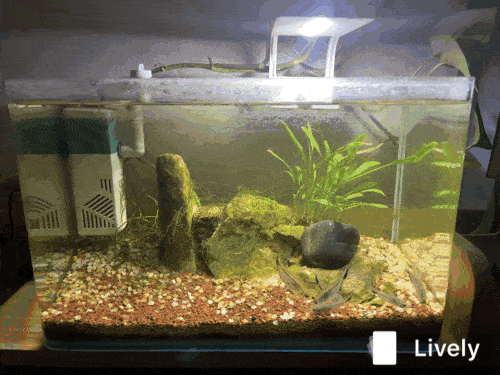
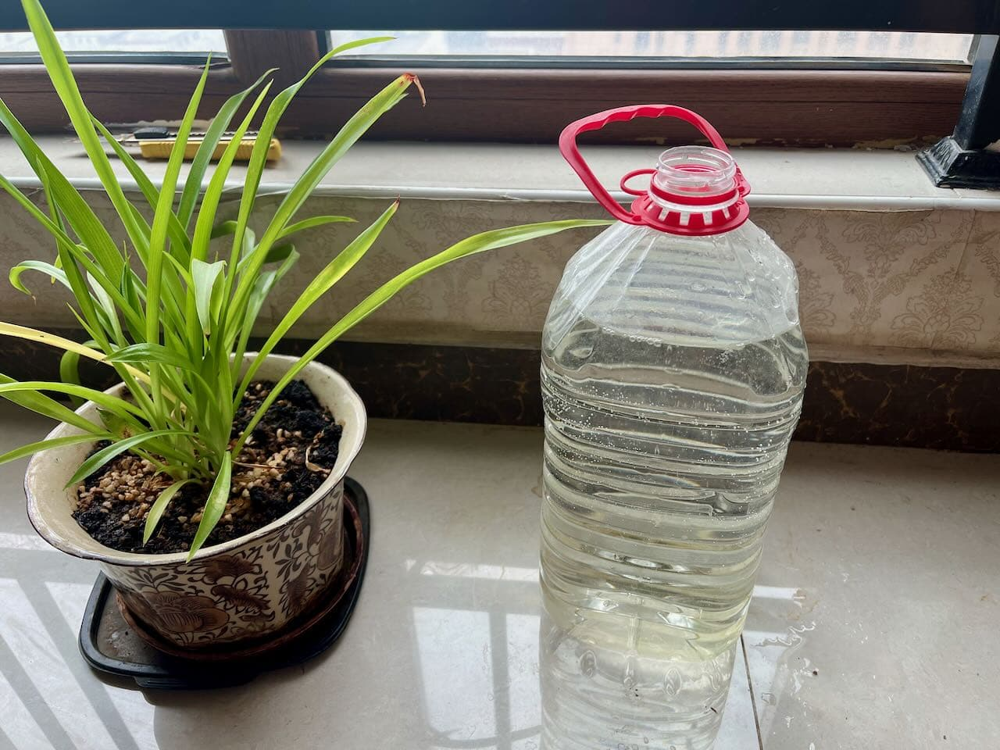
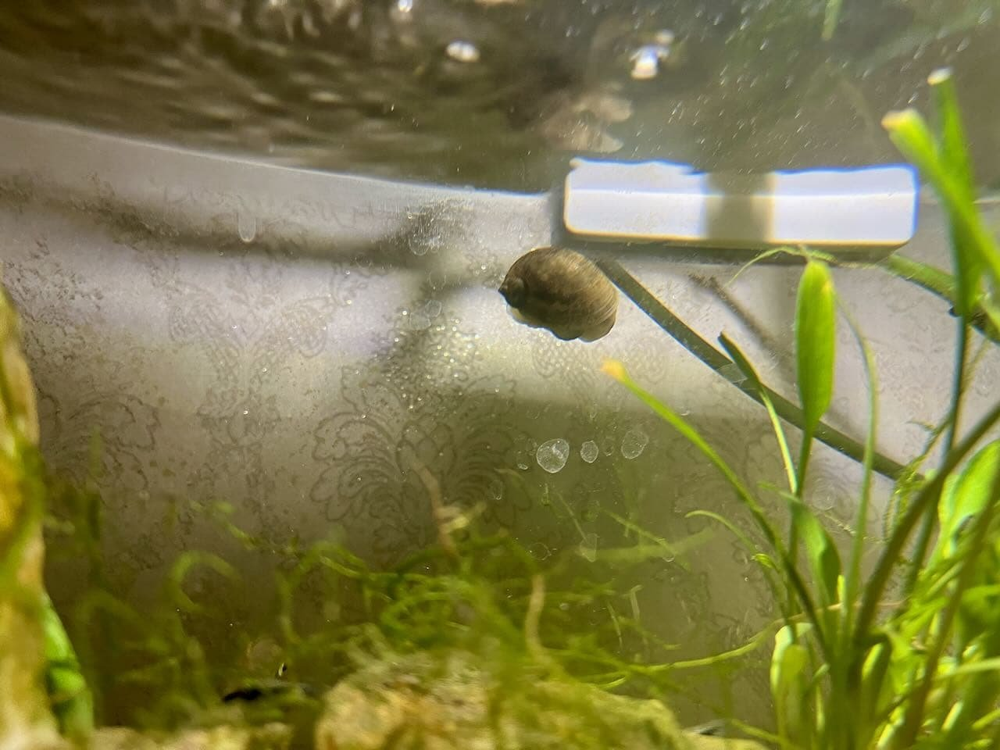
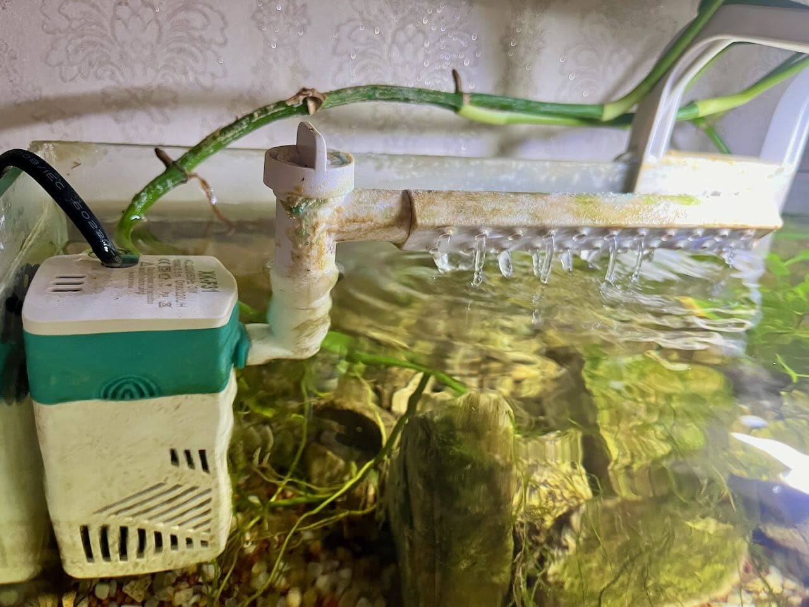
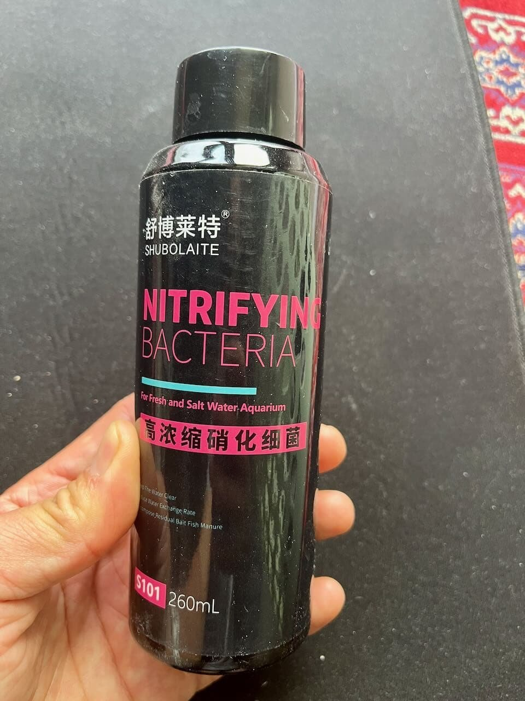
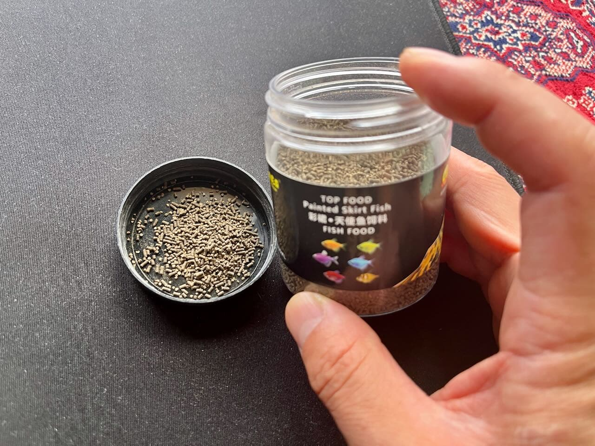
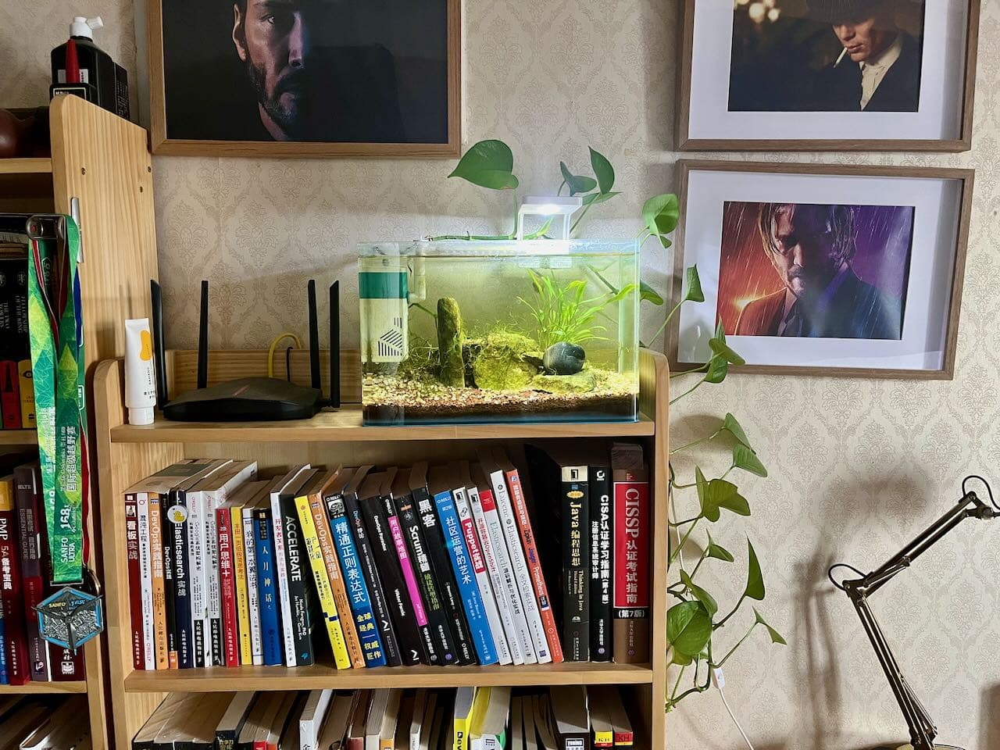

完全没有想到，上一篇鱼缸的介绍文章，居然是最近一年里最受欢迎的文章之一。这鼓励我继续更新一篇，也把这个过程中的一些关键点分享给大家。

从实用性方面看，鱼缸的价值其实并没有什么，主要是满足兴趣爱好的需求。想想近两年来，除了这一个鱼缸之外，我还放弃了另外两个比这大两到三倍的鱼缸。用那两个鱼缸测试了很多想法，水泵，滤材，折腾完了之后，剩下两个纸箱的剩余物。最近放弃的 60cm 的大白玻璃缸可能会在下次心血来潮的时候重新启用。

当我拍摄视频的时候，这个鱼缸在书架上的效果和没有也差不多。不过那根长期并没有啥变化的绿萝也是有一点装饰效果。绿萝的根系在水下并没有长得很多，但是基本上在底纱中扎根了，在水中的一些根须之间，有时候成为小鱼的避难所。

小鱼是水中氧气的消费者，而且它们应该可以产生一些水草所需要的二氧化碳。这7 条小鱼是我从最近放弃的 60cm 大缸里迁移过来的，没想到它们在这个新家里活的很滋润。

小灯基本上是不开的，这个房间的窗户朝东，上午有几个小时的直射阳光。有一次我离开家好几天，忘了关小灯，回家之后，发现水里的绿藻疯长的一弹糊涂。但是保持关灯了一周多以后，绿藻就慢慢退去，并且消失不见了。所谓流水不腐，这个内置的小水泵发挥着至关重要的作用。之前的侧挂式小水泵不如这个效果好，更重要的是，这个内置的水泵提升了鱼缸外部的观感，没有了那个挂在鱼缸外面的水泵，鱼缸看起来更加简洁。但是还是损失了一定的有限的内部空间。内置小水泵入水后就没有再取出来过。感觉水质长期这么清澈的情况下，它保持水循环流动，增氧这一项功能就足够了。水已经干净到不用过滤的程度。

当水里的硝化细菌建立起来之后，水质就清澈到不用刮擦鱼缸内壁的程度了。原因可能有一下几点：

- 底沙、鱼缸里的石头提供了足够大的细菌培养的表面积。
- 底纱的体积和水的总体积的比例是恰到好处的，这样硝化细菌的密度就足够大。
- 消化细菌前期是非常弱的，所以必须两周左右换一次水，用晒过一周的自来水，换掉一半的浑水，来保持水质的清澈。

在当前硝化细菌充分的情况下，每周就不需要换水了，只需要加 1~3 升自然蒸发掉的水就行了。

而且，我还从大缸中迁移过来一直田螺，实际证明它的工作非常努力，它是从野河里带回来的，它会不停的吸附在鱼缸内壁，水泵外侧，水草，石头，底沙上寻找事物吃。它会擦玻璃，会在底沙表面清理鱼的排泄物或者吃剩的鱼食。总之活动非常活跃，超出了我预期的效果。正所谓无心插柳。

田螺在鱼缸的内侧工作，我们可以清晰的看到最外侧缸壁上的水渍，其实这说明了外壁已经非常干净和透明了。

消化细菌很久都没有加过了，它是大缸换外置水泵的时候买的。放弃大缸的原因，还是水一直没有养好，现在觉得原因是底沙和火山石的体积总量太少了。

当时，每周给大缸中加两盖子消化细菌，给这个小缸加一盖子。对比测试发现，小缸的水质越来越好，越来越清澈，加了五六次以后，就不需要在加了。其实小缸开缸的时候在底沙里埋放了硝化细菌的胶囊，只是没有达到预期的效果。而这次加的液体的硝化细菌算是这个鱼缸一年后的最大转折点。我在也不用为它的水质担心了。

当前这款鱼食，小鱼们非常喜爱。成分蛋白质含量高，入水后会迅速沉底，水面上的少量漂浮。小鱼会迅速聚焦在水下，在底沙的表面，快速将鱼食颗粒搜寻完毕，然后迅速消灭水面上的剩余。ß

最后，看下鱼缸在书架上的效果。算是给书架增加了一些生机。给居室里带来了一点点的自然气息。ß

总之，上篇文章里所说的是愿景。而这篇文章里描述了一个实现后的效果。希望这个鱼缸能保持下去，目前的维护工作是非常低的：每周加一次水和投喂一次鱼食。免任何清理和维护。