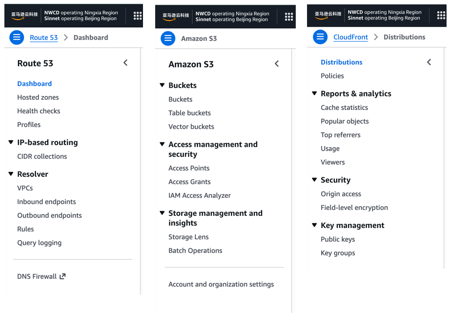

Which services are available in AWS China? I answered that question in the [Chinaready parity checklist](/chinaready/): 120 service rows, how Beijing and Ningxia split the coverage, and the absence of Bedrock, Q, Connect, and friends. Teams who have actually built on AWS China know the catalog is only the first gate. Even when a service has a checkmark, the real gap with AWS Global begins the moment you open the console.

This article is not another catalog comparison. Over several days I ran read-only API calls against the Beijing and Ningxia regions with a pair of accounts, and measured the gaps behind the checkmarks across five dimensions: version, features, quotas, experience, and cost. Before your next China architecture review or PoC planning session, these are the numbers you want in your back pocket. The article will be updated as testing continues (data collected 2026-10-07/09).

## Five Dimensions: From "Is It Listed" to "Does It Work"

The catalog answers a binary question: listed or not. Whether a service actually works in China takes at least five layers.

| Dimension | Question | What a gap means in practice |
|---|---|---|
| Version | Are engine/runtime/API versions in sync? | New features unavailable, migration scripts break, docs mismatch |
| Features | Are key sub-features (integrations, regional linkage, managed options) present? | You discover mid-build that you have to roll your own |
| Quotas | Do default quotas and increase paths match Global? | Test day arrives and you cannot launch instances |
| Experience | Do docs, sample code, and tooling work? | Following the official tutorial step by step into an error |
| Cost | Are pricing structure, free tiers, and billing consistent? | Your PoC budget doubles |

A concrete example first. Deploy a static site with CloudFront in Global and you can use a free AWS-managed SSL certificate alongside it. In China that path is closed: managed free certificates do not work with CloudFront, so HTTPS means uploading and maintaining your own certificate. Nothing in the catalog hints at this. You only find out by doing.

Each section below gives the measured data first, then the conclusions.

## Version: Core Services Are in Sync — Don't Trust the Stereotype

I went through 18 common engines and components across three regions. The result contradicts most expectations: **version lag is not the main problem in AWS China**.

**Open-source database engines**

| Engine | us-east-1 | Beijing | Ningxia | Verdict |
|---|---|---|---|---|
| RDS MySQL | 8.4.9 | 8.4.9 | 8.4.9 | Fully in sync |
| RDS PostgreSQL | 18.6 (56 versions) | 18.6 (45 versions) | Same as Beijing | Latest in sync, 11 fewer historical versions |
| RDS MariaDB | 12.3.3 | 12.3.3 | 12.3.3 | Fully in sync |
| Aurora MySQL 8.x | 3.13.0 | 3.13.0 | 3.13.0 | Latest in sync |
| Aurora PostgreSQL | 18.6 | 18.4 | 18.4 | **2 minor versions behind** |
| DocumentDB | 8.0.2 | 8.0.2 | 8.0.2 | Fully in sync |
| Neptune | 1.4.8.0 | 1.4.8.0 | **1.4.8.1** | Ningxia is actually newest |

**Cache, search, and messaging**

| Engine | us-east-1 | Beijing | Ningxia | Verdict |
|---|---|---|---|---|
| ElastiCache Redis / Valkey / Memcached | 7.1 / 9.1 / 1.6.6 | Same | Same | Fully in sync |
| MemoryDB Redis / Valkey | 7.1 / 7.3 | Same | Same | Fully in sync |
| OpenSearch | 3.7 (36 versions) | 3.7 (36 versions) | 3.7 (36 versions) | Fully in sync |
| Amazon MQ RabbitMQ | **4.3** | **4.2** | 4.2 | **1 major version behind** |
| Amazon MQ ActiveMQ | **5.19** | **5.18** | 5.18 | **1 major version behind** |

**Containers**

| Component | us-east-1 | Ningxia | Verdict |
|---|---|---|---|
| EKS cluster versions | 1.32–1.37 | 1.32–1.37 (identical) | In sync |
| EKS vpc-cni addon | 117 versions | 117 versions | In sync |
| EKS aws-ebs-csi-driver | 100 versions | 100 versions | In sync |
| EKS pod-identity-agent | 17 versions | 17 versions | In sync |
| EKS Auto Mode | Available | **Available** (verified) | In sync |

14 out of 18 are fully in sync. The open-source database line is the tightest: MySQL, MariaDB, and DocumentDB all match the latest version, and even Valkey, an engine that only appeared in 2024, is current. The widely repeated claim that "database versions lag in AWS China" is not supported by measurement.

Three gaps belong on your selection checklist. Aurora PostgreSQL sits two minor versions behind, so version-sensitive teams should read the version numbers before migrating. Amazon MQ is the only service among all 18 with a major-version gap: RabbitMQ and ActiveMQ are each one major version behind, and messaging-heavy architectures should price that in. One odd detail: the latest Neptune 1.4.8.1 exists only in Ningxia while Beijing is still on 1.4.8.0. Small inter-region skews are real; pick your region with eyes open.

EKS Auto Mode deserves its own paragraph. The managed mode, launched at the end of 2024, works in China too. You will not find a toggle for it in the API listing. I probed it by calling create-cluster with a computeConfig payload: the server error came back quoting Auto Mode's configuration-completeness rule, which means the validation logic is live. For migration teams this is unambiguously good news: EKS's newest managed form factor adds zero extra gap.

The big picture is clear. AWS China has roughly a third of Global's service count, but almost the entire core layer (EKS, RDS, Aurora, ElastiCache, OpenSearch) is version-current. What actually falls behind are two categories: policy-sensitive services (SES, SMS, anything touching personal identity data) and the new AI line (Bedrock, Q, CodeWhisperer). If your architecture leans on the former, version is a non-issue. If it leans on the latter, what is missing is the entire service, not a version.

## Features: The Switches That Go Gray After the Checkmark

This section covers two kinds of problems: entire product lines that are absent (Bedrock, training-grade GPUs), and services that exist with key sub-features grayed out (CloudFront certificates, Route 53 traffic policies).

**Table 1: AI, edge, and compute features**

| Service | In Global | Measured in China |
|---|---|---|
| CloudFront | Available (global CDN) | **End of support announced**: AWS will discontinue CloudFront in the China (Ningxia) region on May 31, 2027. [Official notice](https://www.amazonaws.cn/cloudfront/#end-of-support-notice) |
| EC2 instance types | 1,375 | Beijing 432 / Ningxia 461, **about one third of Global** |
| EC2 GPU chips | 9: T4/A10G/L4/L40S/A100/H100/H200/Trainium etc. | Only NVIDIA T4 (2018), NVIDIA A10G (2021), and AWS Inferentia (2020). **No A100/H100-class training cards** |
| EC2 GPU sizes within a family | g4dn 7 / g5 8 / inf1 4 sizes | g4dn 7 / g5 8 / inf1 4 sizes. **No shrinkage within families**. What is missing is whole product lines: g6, inf2, p4d, p5, trn1, 11 families entirely absent |
| Bedrock | Available (122 models) | Not deployed at all, not "coming soon" |
| Rekognition / Textract / Translate / Polly / Q / CodeWhisperer / OpenSearch Serverless | Mostly available | None available in Beijing |
| Route 53 | Available (full) | Ningxia only. Hosted Zones and health checks work; traffic policies do not; no domain registration |

The most important signal in this table is CloudFront's fate: AWS has officially announced the end of support for the Ningxia region on May 31, 2027. If CloudFront is in your China architecture, start planning the replacement now. This is not a feature gap; it is a service exit.

On the AI line, two conclusions. First, the most powerful single machine you can get in China is g5.48xlarge: 8 A10G cards with 24 GB each. Inference for models that fit in 24 GB works; training or fine-tuning anything above 70B parameters currently has no answer. Second, the managed AI APIs are absent wholesale: beyond Bedrock, Rekognition, Textract, Translate, Polly, Q, and CodeWhisperer are all unavailable in Beijing. SageMaker is the only fully functional AI service. Running AI in AWS China means a SageMaker do-it-yourself build as essentially the only official path, and that path hits the first wall: there are no large-memory training cards. Both walls stand together.

Beyond API probes, I clicked through the CloudFront, S3, and Route 53 consoles region by region. The manual comparison agrees with the APIs: these services expose visibly fewer options in China.

There is a quieter category that is easy to miss: data and governance plumbing. These services do not vanish wholesale the way AI does; the traps are better hidden. I tested seven of them.

**Table 2: Data and governance parity**

| Service | Parity | Differences |
|---|---|---|
| DynamoDB | Full parity | All APIs work; account/table throughput caps identical (80,000/40,000 CU). One caveat: global tables do not replicate across partitions |
| ElastiCache | Engines in sync, ~70% breadth | Engine versions identical across regions; purchasable node SKUs 167 vs 236 in Global |
| DocumentDB | Version in sync, instance classes trimmed | Latest engine identical; instance classes Beijing 33/39, Ningxia 27/39, missing mostly older r4 generation, core r5 intact |
| ECS | API parity | The difference is in quota management: service-quotas returns an empty list in China |
| CloudWatch metrics/synthetics/SLO | Parity | Metrics, Synthetics canaries, and Application Signals all work across regions |
| CloudWatch RUM | Unavailable | Service not offered |
| Organizations | Works within China | SCP and multi-account fully functional, but completely independent from the Global org. Two systems, no bridge |
| IAM Identity Center | Works within China | Permission Sets, application registration (OIDC/SAML), trusted token issuers, and local identity store all available, including recent features |

These results yield the feature dimension's most actionable conclusion: **the data layer is nearly a lift-and-shift**. DynamoDB is at full parity, ElastiCache even tracks the new Valkey engine, and DocumentDB only lacks older instance generations. For teams moving the data layer into China, the technical friction is small.

Two traps. Observability has a hole: metrics, canaries, and SLOs are present, but RUM (Real User Monitoring) is definitively unavailable, so frontend experience monitoring teams need an alternative lined up. Account governance is where misjudgments happen: Global Organizations and Identity Center do not extend into China, but China can host its own complete set, and it is not a stripped-down version. Recent feature APIs verified working. Your multi-account strategy, SCP hierarchy, and SSO all need to be rebuilt for China. In one sentence: the architecture can be copied, but governance cannot be inherited.

## Quotas: The Landmines You Step on During Load Tests

**Results (default and applied API layers)**

| Quota | us-east-1 | Beijing | Ningxia | Nature |
|---|---|---|---|---|
| EC2 On-Demand Standard vCPU (default) | 5 | **5** | **5** | Partition-consistent |
| EC2 On-Demand Standard vCPU (applied) | 32 | 8 | 8 | Account variance, not partition |
| Lambda concurrency (default) | 1,000 | **1,000, adjustable** | Same as Beijing | Partition-consistent |
| Lambda concurrency (applied) | 10 | Uninitialized | Uninitialized | Cold-start account state |
| ECS quotas (default layer) | 62 items | **62 items (identical)** | Same as Beijing | Partition-consistent |
| ECS quotas (applied layer) | 28 items (all adjustable ones) | Empty list | Empty list | Account has no adjustable-quota records yet |
| EKS quotas (both layers) | 13/12 items | **Both layers report "service unavailable"** | Same as Beijing | **The one real partition gap** |

One piece of background for reading this table: service-quotas data comes in two layers. The default layer holds AWS's documented defaults; the applied layer holds your account's values. EC2 applied values grow automatically with account usage and have nothing to do with partition. ECS's empty applied list is also account state: nearly all its quotas are non-adjustable, only adjustable ones enter the applied layer, and a fresh account has no such records. The console still shows the full catalog.

Filter out the account noise and exactly one partition-level gap remains in quotas: **EKS is not integrated with service-quotas in China at all**. Both API layers return "service unavailable," and EKS does not appear in the console's service list. There is no self-service way to check EKS node or cluster limits; the only channel is a support ticket. IaC that references EKS quota values as guardrails will fail right here.

That conclusion is itself the lesson: when comparing quotas across partitions, applied values are polluted by account history. Only default values reflect partition policy. Query the wrong layer and you will read account variance as partition difference.

A few default values from the console worth memorizing. Small numbers, zero room for negotiation:

| Scenario | Quota | Default | Who hits it first |
|---|---|---|---|
| BI concurrency | Athena active DML queries | **20** | Report queues |
| High-frequency deploys | Lambda control-plane API rate | **15/sec, not adjustable** | CI/CD pipelines |
| Elastic scaling | ECS task launch rate | 500, not adjustable | Scaling storms |
| Backup windows | EBS concurrent snapshots per volume | 5, not adjustable | Batch backup scripts |
| Cache busting | CloudFront active wildcard invalidations | 15, not adjustable | Release systems |
| Multi-cert sites | CloudFront SSL certs per distribution | **1, not adjustable** | Multi-domain architectures |

Note the words "not adjustable." Resource quotas can be raised with a ticket; this batch can only be solved by changing the architecture. More than half the quotas in the console carry that mark. Design around them from day one. Quota console: https://console.amazonaws.cn/servicequotas/home/dashboard .

## Developer Experience: Docs, Images, and Tooling

This section is for the people who write code every day. Architects read catalogs; developers care about three things: can I find the docs, can I pull the images, does CI pass.

China has its own documentation site: https://docs.amazonaws.cn . Docs for the same service are not always in sync with the global site, so when behavior contradicts documentation, first check which site you are reading.

Images are the most painful part. EC2 and EKS nodes run inside the mainland network, where Docker Hub, GitHub, and the official Kubernetes image registries are effectively unreachable. The workable substitute is pulling from a self-hosted registry or registry proxy outside the firewall. GitHub itself mostly works; cloning small-to-medium repositories takes acceptable time, and you can pull your own code into the China environment and build images there.

The AWS CLI is a non-issue. Two profiles on one machine, one pointing at China and one at Global, used side by side. China endpoints live on separate domains, but the difference is transparent to the CLI. Direct connectivity from mainland China to AWS China services is smooth.

Domains and DNS follow a different rulebook. China does not support domain registration. Buy your domain from a registrar licensed in China, complete the ICP filing, and only then can the domain be used with AWS China. An unfiled domain resolves fine, but the website will not open.

One more thing that is easy to miss: there is no CloudShell in China (Global has it). Engineers used to a browser terminal need to bring their own local tooling.

## Cost: The Beijing–Ningxia Price Inversion

**Linux/Shared/on-demand hourly prices (pricing API)**

| Instance | us-east-1 | Beijing | Ningxia (USD equiv.) |
|---|---|---|---|
| m5.xlarge | $0.192 | ¥2.026 ($0.285, +48%) | ¥1.356 ($0.191, **-1%**) |
| c6i.2xlarge | $0.340 | ¥2.958 ($0.417, +23%) | ¥1.972 ($0.278, -18%) |
| g4dn.xlarge | $0.526 | ¥5.223 ($0.736, +40%) | ¥3.711 ($0.523, -1%) |
| g5.12xlarge | $5.672 | ¥53.641 ($7.556, **+33%**) | ¥37.781 ($5.321, **-6%**) |

The numbers hide a counterintuitive conclusion: **Beijing and Ningxia pricing is inverted**. Beijing runs 23 to 48 percent above Global; Ningxia flips it, with general-purpose and GPU instances at or below Global prices. A g5.12xlarge in Ningxia works out to $5.32 an hour, 6 percent cheaper than us-east-1. A 30 percent price spread between two regions of the same country has no parallel in Global.

Ningxia is using price to pull compute westward, and AI inference workloads are the clearest example. If your workload tolerates latency, placing GPU inference in Ningxia instead of Beijing saves a third of the cost and beats Virginia. Within China alone, the region choice deserves its own line in the cost model.

## The One-Hour Pre-Launch Checklist

Everything measured above condensed into one checklist. Run it before the architecture review and most China surprises get caught early. Every command here was validated during this experiment.

1. **Check versions**: run `aws eks describe-cluster-versions` and `aws rds describe-db-engine-versions`, and compare the target region against your current one.
2. **Check instance types**: run `aws ec2 describe-instance-type-offerings` and confirm every instance type your architecture references exists in China. GPU workloads should additionally verify the chip model.
3. **Check service availability**: go through docs.amazonaws.cn and confirm the China support status of every service your architecture depends on.
4. **Check quotas**: run `aws service-quotas get-service-quota` first; if it comes back empty, run `get-aws-default-service-quota`. EKS in China reports "service unavailable" outright, and that error is your answer.
5. **Check pricing**: compare the three regions with the pricing API. The Beijing–Ningxia spread may change your deployment decision.

## From Gaps to Decisions

Put the five dimensions side by side and the conclusion stays cool-headed. AWS China is not a discounted clone of AWS Global. It is a target platform that deserves its own evaluation.

Versions are in sync: 14 of 18 measured items align exactly, and even EKS Auto Mode, the newest managed form factor, is present. Default quotas match, and the only partition-level quota gap is EKS's missing self-service integration. Ningxia pricing undercuts us-east-1, so the cost picture is calculable. The data layer is close to lift-and-shift, and the governance stack can be rebuilt in full.

But AI compute stopped in 2021, the managed AI API line is absent wholesale, and CloudFront already has its exit date on the calendar. None of this appears in the catalog.

So the real watershed in a migration decision is not "is AWS China good enough." It is which line your architecture leans on. On core compute, databases, containers, and observability, China is a respectable and price-friendly platform. On AI, there is currently one road, SageMaker self-managed, and the ceiling of that road is set by silicon.

This article will be updated as testing continues. If your team is running a China architecture review, [Chinaready's assessment service](/chinaready/) can turn this five-dimension check into a formal process. For a catalog-level parity list, see [the China market technical readiness checklist](/blog/china-market-technical-readiness-checklist/). And if your actual problem is "our overseas site is slow in China," start with [the troubleshooting guide](/blog/why-overseas-sites-slow-in-china/).
