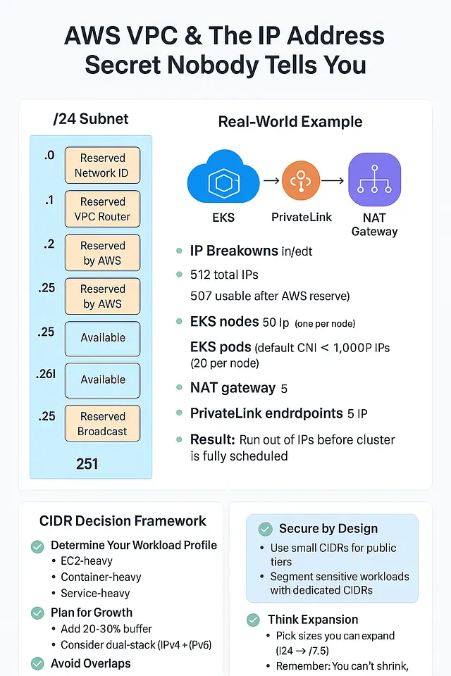

像专家一样学习 AWS VPC IP 地址分配。探索隐藏规则、专家技巧和 2025 年最佳实践，以设计安全、可扩展的 AWS 网络。DevOps 和云工程师的完美指南。

当大多数工程师启动一个新的 **AWS 虚拟私有云 (Virtual Private Cloud - VPC)** 时，他们会直接选择经典的 ` /16 ` CIDR 块。
为什么？因为它“感觉很安全”——**65,536 个 IP 地址**都在一个整齐的范围内。
不缺地址，没有规划烦恼……至少看起来是这样。

但现实是：在 AWS 网络中，**CIDR 块大小的选择并非一劳永逸**。错误的决策可能导致 **IP 地址耗尽、集成失败、安全漏洞和痛苦的迁移**。而且，AWS 仍然隐藏着**一个小的 IP 秘密**，这个秘密总是让新工程师头疼。

### 2025 年 CIDR 范围规划为何更加重要

您的 VPC CIDR 范围定义了您**有多少私有 IP 地址**——以及这些地址如何被使用、划分并与其他网络集成。

太多工程师仍然选择 `10.0.0.0/16`，然后就此作罢。问题出在哪里？

- 与企业本地网络重叠
- 在 VPC 对等连接 (VPC Peering) 或中转网关 (Transit Gateway) 期间与其他 AWS 账户发生冲突
- 当您扩展到多个区域时限制了增长

**2025 年最佳实践：**

- 创造性地使用 **RFC 1918** 范围 (`172.16.0.0/12` 或 `192.168.0.0/16`)
- 不要将 RFC 6598 (100.64.0.0/10) 用于 AWS VPC 或企业私有工作负载，它已被 ISP 保留用于运营商级 NAT (Carrier-Grade NAT)（根据 RFC 6598）。请坚持使用 RFC 1918 范围进行 VPC 设计。
- 在**组织层面**而非每个团队层面记录和预留 CIDR 块

| CIDR 块 | 总 IP 数 | 可用 IP 数 (AWS 保留后) | 最适用场景                    |
| ------- | -------- | ----------------------- | ---------------------------- |
| `/16`   | 65,536   | 65,531                  | 大型多服务环境               |
| `/24`   | 256      | 251                     | 小型生产工作负载             |
| `/28`   | 16       | 11                      | 测试/沙箱环境                |

**为什么这个选择在今天比以往任何时候都更重要：**

- **容器 (Containers) 和微服务 (Microservices)**：在 EKS 和 ECS 中，**每个 Pod/任务 (pod/task) 都会获得自己的 IP**（默认情况下），这使得小规模子网会 *很快* 被占满。
- **AWS PrivateLink 和 VPC Lattice**：每个终端节点或服务都会在您的子网中创建弹性网络接口 (Elastic Network Interface - ENI)——消耗额外的 IP 地址。
- **混合云 (Hybrid Cloud) 增长**：多 VPC 和多账户网络意味着重叠的 CIDR 块会破坏对等连接和中转网关集成。
- **IPv4 稀缺性**：您不能再将私有地址空间视为无限，尤其是在大型组织中。

### IPv4 耗尽与弹性 IP 经济学

2024 年 2 月，AWS 提高了闲置弹性 IP (Elastic IP) 的收费。到 2025 年年中，**公共 IPv4 地址将成为稀缺资源**。

**您现在应该怎么做：**

- 除非绝对必要，否则停止分配公有 IP 地址 (Public IP Address)
- 使用 NAT 网关 (NAT Gateway)，但要平衡成本（或者在小型环境中使用 NAT 实例 (NAT Instance)）
- 利用 AWS PrivateLink 和 VPC 终端节点 (VPC Endpoint) 完全避免公开暴露
- 开始使用 AWS Network Firewall 和 Route 53 测试 IPv6 入站/出站流量

### AWS 5 个 IP 地址规则（鲜为人知的细节）

无论您选择何种 CIDR，您都**永远无法使用子网中的所有 IP 地址**。
AWS **在每个子网中保留 5 个 IP 地址**。

**保留的 IP 地址：**

1. **第一个 IP** → 网络 ID（定义子网）
2. **第二个 IP** → 默认 VPC 路由器（网关）
3. **第三个 IP** → 由 AWS 保留（内部用途）
4. **最后一个 IP** → 广播地址（RFC 标准，未使用但已保留）
5. **额外一个** → AWS 内部未来使用

**计算示例：**

- `/24` = 总计 256 个 → 251 个可用
- `/28` = 总计 16 个 → 11 个可用

> *在设计跨可用区 (Availability Zone - AZ) 的高可用性时，应平均划分 CIDR 范围，**并**在估算容量之前减去 AWS 保留的地址。*

### 2025 年的实际陷阱

以下是我看到工程师（甚至经验丰富的工程师）仍然会犯错的地方：

| 错误做法                          | 影响                                | 解决方案                                     |
| --------------------------------- | ----------------------------------- | -------------------------------------------- |
| 为小型应用选择 `/16`              | 浪费 IP 空间，在对等连接中造成重叠  | 使用 `/24` 或 `/23` 合理调整大小             |
| 忽略容器 IP 需求                  | EKS 在部署中途耗尽 IP               | 使用前缀委托或 CNI 自定义网络                |
| VPC 之间 CIDR 重叠                | 对等连接/TGW 路由中断               | 使用 AWS IPAM 进行组织级管理                 |
| 在生产中使用过小的 `/28`          | IP 耗尽导致扩展事件失败             | 为增长预留 20-30% 缓冲                       |
| 忘记 AWS 保留 IP                  | 服务启动意外失败                    | 在规划中始终减去 5-IP 规则                   |

### 现代扩展注意事项

到 2025 年，占用 IP 地址的不再仅仅是 EC2。您的计划必须考虑：

- **Amazon EKS/ECS** → 默认情况下，每个 pod/任务一个 IP 地址。
- **NAT 网关** → 每个可用区预留多个 IP 地址用于扩展。
- **VPC 终端节点 (PrivateLink)** → 创建弹性网络接口 (Elastic Network Interface - ENI)，占用每个可用区中的 IP 地址。
- **负载均衡器 (应用负载均衡器 ALB/网络负载均衡器 NLB)** → 每个可用区的每个子网都需要 ENI。
- **AWS Lattice 服务** → 为服务间网络分配 IP 地址。

> *在 EKS 中，启用**前缀委托 (Prefix Delegation)**，以便 pod 共享 /28 前缀而不是获取唯一的 IP 地址 — 从而减少消耗。*

### 安全与影响范围

CIDR 规划也是一种**安全控制措施**：

- 更小、特定用途的子网可以在遭受攻击时限制影响范围。
- 通过 CIDR 而不仅仅是安全组 (Security Group) 来分段工作负载。
- 示例：`/28` 用于公有 ALB 层，`/24` 用于私有应用服务器，`/26` 用于数据库层。

### 混合云与多账户网络

CIDR 重叠 = 无法在网络之间路由。

通过以下方式避免这种情况：

- 使用 **AWS VPC IP 地址管理器 (IPAM)** 集中分配 CIDR。
- 为开发/生产/预发布 (dev/prod/staging) 遵循**保留范围策略**。
- 为所有 AWS 账户和本地网络保留一份记录完整的**IP 分配图**。

### 可观测性与故障排除

IP 相关问题可能导致静默故障。优秀的工程师会：

- 使用 **VPC 流日志 (VPC Flow Logs)** (在子网或 ENI 级别)
- 启用 **CloudWatch Logs Insights** 查询以进行 IP 级别故障排除
- 使用 **可达性分析器 (Reachability Analyzer)** 在更改前模拟数据包流
- 使用 **网络访问分析器 (Network Access Analyzer)** 持续验证最小权限网络

### AWS VPC 和无人提及的 IP 地址秘密

### 图 1: AWS 子网中的 5-IP 规则

*相同的 5-IP 规则适用于**每个子网**，无论大小如何。*

### 真实案例：EKS + PrivateLink 中的 IP 消耗

场景：

- `/23` 子网 (总共 512 个 IP，AWS 预留后可用 507 个)
- 50 节点 **EKS** 集群 (默认 CNI，每个节点 20 个 Pod)
- 每个可用区 1 个 **NAT 网关 (NAT Gateway)**
- 5 个 **PrivateLink 端点 (PrivateLink endpoints)**

**IP 分配明细：**

- **EKS 节点：** 50 个 IP (每个节点一个)
- **EKS Pod：** 1,000 个 IP (每个节点 20 个，唯一的 ENI (Elastic Network Interface)) → *已超出可用 IP 数量！*
- **NAT 网关：** 1 个 IP
- **PrivateLink：** 5 个 IP (每个端点 ENI 一个)

**结果：**
即使使用 `/23`，在集群完全调度之前，IP 就会耗尽。
➡ **解决方案：** 为 EKS 使用**前缀委托 (prefix delegation)** 或**自定义网络 (custom networking)**，以大幅减少每个 Pod 的 IP 消耗。

### 适用于 AWS 的 CIDR 决策框架 (2025)

#### Step 1 — 确定您的工作负载配置文件

- 以 EC2 为主：按实例数量加缓冲大小
- 以容器为重：计算 Pod/任务数量 (EKS/ECS)
- 以服务为重：计算 NAT、PrivateLink、Lattice 产生的 ENI 数量

#### Step 2 — 规划增长

- 为扩展事件增加 20–30% 的缓冲
- 从一开始就考虑**双栈 (IPv4 + IPv6)**

#### Step 3 — 避免重叠

- 使用 **AWS IPAM (IP Address Manager)** 进行组织范围的分配
- 为多账户和混合设置记录所有 CIDR

#### Step 4 — 从设计上确保安全

- 对公共层使用小 CIDR，对私有层使用大 CIDR
- 使用专用 CIDR 分段敏感工作负载

#### Step 5 — 考虑扩展性

- 选择可以扩展的尺寸 (`/24` → `/23`)，如果需要
- 请记住：您**无法缩小**，只能增加

### 2025 年主要启示

- **5-IP 规则**仍然适用并将永远适用。
- EKS、PrivateLink 和现代 AWS 服务消耗 IP 的速度远超 EC2 时代的架构。
- **IPAM** 是您在多 VPC/多账户世界中最好的朋友。
- **IPv6** 不是可选的 — 现在就开始双栈。
- CIDR 规划不仅关乎**容量**，更关乎**安全性和可扩展性**。

### 2025 年不可忽视的趋势

- **IPv6 Everywhere**：所有新的 VPC 都应采用双栈 (dual-stack) 模式，以便面向未来。
- **BYOIP (Bring Your Own IP)**：许多企业正在将 IPv4 地址空间带入 AWS，以避免冲突。
- **Automated IP Allocation**：IaC (基础设施即代码) 流水线现在集成了 IPAM (IP Address Management)，实现零人工 CIDR 分配。
- **Subnet CIDR Expansion**：AWS 现在支持无中断地扩展子网 — 如果您提前规划，这将是救星。

### AWS IP 小知识，却非常实用

- 您可以稍后向 VPC **添加** CIDR 块，但**不能缩小**它们。
- 始终预留未来 **2-3 年的增长空间**。
- 某些 AWS 服务（例如 FSx、Directory Service）需要**最小子网大小**。
- 在生产子网容量中保留 20-30% 的余量。
- 除了实例，NAT 网关 (NAT Gateway) 和负载均衡器 (Load Balancer) 还会额外占用 IP 地址。

### 子网规划速查表

| 环境类型        | CIDR  | 可用 IP 数 | 说明                     |
| --------------- | ----- | ---------- | ------------------------ |
| 沙箱/测试       | `/28` | 11         | 微小型，短期使用         |
| 小型生产        | `/24` | 251        | Web 应用，小型数据库     |
| 大型生产        | `/23` | 507        | 多层架构 + 扩展          |
| 服务密集型环境  | `/22` | 1019       | 多服务，多可用区         |

### 来自实践的最终建议

下次创建 VPC 时：

1. 除非有实际需求，否则**不要默认使用** `/16`。
2. 在每个子网中**考虑 5 个 IP 地址规则**。
3. **规划容器、端点和扩展** — 不仅仅是 EC2。
4. **使用 IPAM** 避免重叠并自动化分配。
5. **使用 CIDR 作为边界**，为安全性进行分段。
6. **现在就考虑 IPv6**，不要等到以后。

今天几分钟的 IP 规划，可以为你节省未来**数周的昂贵迁移成本**。

### 2025 年 AWS VPC 清单

上线前，请验证：

- 从第一天起就支持双栈 (IPv4 + IPv6)
- 跨组织和混合网络无重叠的 CIDR
- 私有连接 (VPC 端点 (VPC endpoint)、PrivateLink) 用于内部服务
- 最小化公共 IPv4 暴露，并有充分理由
- 子网大小与工作负载扩展对齐
- 安全组 (Security Group) 和网络 ACL (NACL) 根据使用的 IP 范围进行调整
- 已部署可观测性，用于数据包级别的故障排除

到了 2025 年，AWS VPC 设计不再仅仅是“选择一个 CIDR 并点击创建”那么简单。
它关乎**面向 IPv6 的未来规划，避免代价高昂的 IPv4 陷阱，实现私有优先的连接，以及从第一天起就设计混合/多云环境**。

掌握这些虽小但却至关重要细节的工程师——正确的 CIDR 选择、积极主动的 IPv6 设置、私有优先的理念——将是那些构建**弹性、安全且可扩展的云网络**，并能够经受未来十年考验的人。
