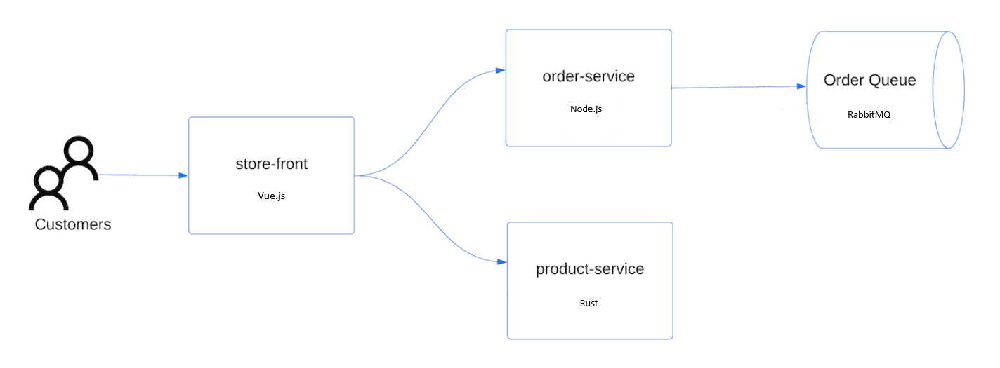

使用 Azure CLI 创建 K8S 集群是一种非常简单易用的方式。它的依赖就是 Azure CLI 命令行工具的安装，你可以安装在任何操作系统中； 或者启动含有 Azure CLI 的容器，然后在容器内使用 Azure CLI 。

## Azure CLI 的准备

本文的演示命令都是在 macOS 上操作的，Azure CLI 在任何 OS 上安装的文档见 [Install Azure CLI](https://docs.microsoft.com/en-us/cli/azure/install-azure-cli) 。

如果你不想在本机安装 Azure CLI 命令行工具，可以使用 Docker 容器的方式，启动一个含有 Azure CLI 的容器，然后在容器内使用 Azure CLI 命令行工具。

```bash
docker run -it --rm mcr.microsoft.com/azure-cli
```

下面这个参考命令，是在此容器中带入当前路径做为容器内工作目录，并且制定的 Azure CLI 版本的例子：

```bash
docker run -it --rm -v $(pwd):/work -w /work mcr.microsoft.com/azure-cli:2.0.80
```

## 登录 Azure

参考命令如下：

```bash
az login
```

假设你是使用本机安装的 Azure CLI 做 Azure 的命令登录认证，那么在运行了以上命令后，会弹出一个浏览器窗口，让你输入 Azure 的账号和密码，然后完成登录认证。

然后，你可以查看当前账号中的订阅；确保随后使用中一个正确的订阅，用于创建 K8S 集群。

```bash
az account list -o table
```

为了确保后续的命令行操作使用正确的订阅，可以用下面的命令，使用命令行变量的方式，设置当前使用的订阅。

```bash
az account set --subscription <subscription-id>
```

## 创建资源组

为了让本次操作的过程产物，都放在一个资源组中，我们先创建一个资源组。这样方便在测试完的时候，可以一次性删除所有曾经用到过的资源。

使用命令行变量设定资源组的名称和所在的区域：

```bash
export RESOURCE_GROUP_NAME=aks-getting-started
export LOCATION=eastasia
```

创建资源组：

```bash
az group create --name $RESOURCE_GROUP_NAME --location $LOCATION
```


## 创建 Service Principal

为了让 K8S 可以使用到 Azure 账号中的各种必要的资源服务（disk，负载均衡，存储等等），需要创建一个 Service Principal，用于 K8S 访问 Azure 资源。下面用新的命令行变量携带 Service Principal 的相关信息：

```bash

SERVICE_PRINCIPAL_JSON=$(az ad sp create-for-rbac --skip-assignment --name aks-getting-started-sp -o json)

#将 `appId` 和 `password` 保存在变量中，用于后续的命令行操作

SERVICE_PRINCIPAL=$(echo $SERVICE_PRINCIPAL_JSON | jq -r '.appId')
SERVICE_PRINCIPAL_SECRET=$(echo $SERVICE_PRINCIPAL_JSON | jq -r '.password')

#给上面所创建的 Service Principal 赋予 Contributor 角色，用于后续的 K8S 集群创建的参数

az role assignment create --assignee $SERVICE_PRINCIPAL \
--scope "/subscriptions/$SUBSCRIPTION/resourceGroups/$RESOURCEGROUP" \
--role Contributor

```

关于 Service Principal 的更多信息，可以参考 [Azure AD Service Principal](https://docs.microsoft.com/en-us/azure/active-directory/develop/app-objects-and-service-principals) 。

## 创建 K8S 集群

可以先使用下面的命令获取创建 aks 集群详细的帮助信息，以及丰富的可用选项；

```bash
az aks create -h
```

查看当前可用区中的 AKS 服务中的 Kubernetes 版本：

```bash
az aks get-versions --location $LOCATION -o table
```

为 AKS 集群创建 SSH 秘钥对，用于后续的 SSH 访问：

```bash
ssh-keygen -t rsa -b 4096 -N "VeryStrongSecret123!" -C "your_email@example.com" -q -f  ~/.ssh/id_rsa
cp ~/.ssh/id_rsa* .
```
如果你不想使用 SSH 访问，可以跳过上面的步骤。或者直接使用本机已有的 SSH 秘钥对，那么只运行第二条命令即可。

创建 AKS 集群：

```bash
az aks create -n aks-getting-started \
--resource-group $RESOURCE_GROUP_NAME \
--location $LOCATION \
--kubernetes-version 1.28.3 \
--load-balancer-sku standard \
--nodepool-name default \
--node-count 1 \
--node-vm-size Standard_DS2_v2 \
--node-osdisk-size 50 \
--ssh-key-value ./id_rsa.pub \
--network-plugin kubenet \
--service-principal $SERVICE_PRINCIPAL \
--client-secret "$SERVICE_PRINCIPAL_SECRET"
```

## 连接到 K8S 集群

使用下面的命令，获取 AKS 集群的连接信息：

```bash
az aks get-credentials --resource-group $RESOURCE_GROUP_NAME --name aks-getting-started
```

这条命令会将 AKS 集群的连接信息，写入到 `~/.kube/config` 文件中，然后你就可以使用 `kubectl` 命令行工具，连接到 AKS 集群了。

```bash
kubectl get nodes
```

以上忽略命令行 kubectl 的安装方式，详见 [Install and Set Up kubectl](https://kubernetes.io/docs/tasks/tools/install-kubectl/) 。

## 部署应用

下面参考 <https://learn.microsoft.com/zh-cn/azure/aks/learn/quick-kubernetes-deploy-cli> 文档中的操作步骤，部署
 [AKS 应用商店应用程序](https://github.com/Azure-Samples/aks-store-demo) 。该应用系统的示意图如下：



创建名为 [aks-store-quickstart.yaml](aks-store-quickstart.yaml) 的文件，并将以下清单复制到其中：

```yaml
apiVersion: apps/v1
kind: Deployment
metadata:
  name: rabbitmq
spec:
  replicas: 1
  selector:
    matchLabels:
      app: rabbitmq
  template:
    metadata:
      labels:
        app: rabbitmq
    spec:
      nodeSelector:
        "kubernetes.io/os": linux
      containers:
      - name: rabbitmq
        image: mcr.microsoft.com/mirror/docker/library/rabbitmq:3.10-management-alpine
        ports:
        - containerPort: 5672
          name: rabbitmq-amqp
        - containerPort: 15672
          name: rabbitmq-http
        env:
        - name: RABBITMQ_DEFAULT_USER
          value: "username"
        - name: RABBITMQ_DEFAULT_PASS
          value: "password"
        resources:
          requests:
            cpu: 10m
            memory: 128Mi
          limits:
            cpu: 250m
            memory: 256Mi
        volumeMounts:
        - name: rabbitmq-enabled-plugins
          mountPath: /etc/rabbitmq/enabled_plugins
          subPath: enabled_plugins
      volumes:
      - name: rabbitmq-enabled-plugins
        configMap:
          name: rabbitmq-enabled-plugins
          items:
          - key: rabbitmq_enabled_plugins
            path: enabled_plugins
---
apiVersion: v1
data:
  rabbitmq_enabled_plugins: |
    [rabbitmq_management,rabbitmq_prometheus,rabbitmq_amqp1_0].
kind: ConfigMap
metadata:
  name: rabbitmq-enabled-plugins            
---
apiVersion: v1
kind: Service
metadata:
  name: rabbitmq
spec:
  selector:
    app: rabbitmq
  ports:
    - name: rabbitmq-amqp
      port: 5672
      targetPort: 5672
    - name: rabbitmq-http
      port: 15672
      targetPort: 15672
  type: ClusterIP
---
apiVersion: apps/v1
kind: Deployment
metadata:
  name: order-service
spec:
  replicas: 1
  selector:
    matchLabels:
      app: order-service
  template:
    metadata:
      labels:
        app: order-service
    spec:
      nodeSelector:
        "kubernetes.io/os": linux
      containers:
      - name: order-service
        image: ghcr.io/azure-samples/aks-store-demo/order-service:latest
        ports:
        - containerPort: 3000
        env:
        - name: ORDER_QUEUE_HOSTNAME
          value: "rabbitmq"
        - name: ORDER_QUEUE_PORT
          value: "5672"
        - name: ORDER_QUEUE_USERNAME
          value: "username"
        - name: ORDER_QUEUE_PASSWORD
          value: "password"
        - name: ORDER_QUEUE_NAME
          value: "orders"
        - name: FASTIFY_ADDRESS
          value: "0.0.0.0"
        resources:
          requests:
            cpu: 1m
            memory: 50Mi
          limits:
            cpu: 75m
            memory: 128Mi
      initContainers:
      - name: wait-for-rabbitmq
        image: busybox
        command: ['sh', '-c', 'until nc -zv rabbitmq 5672; do echo waiting for rabbitmq; sleep 2; done;']
        resources:
          requests:
            cpu: 1m
            memory: 50Mi
          limits:
            cpu: 75m
            memory: 128Mi    
---
apiVersion: v1
kind: Service
metadata:
  name: order-service
spec:
  type: ClusterIP
  ports:
  - name: http
    port: 3000
    targetPort: 3000
  selector:
    app: order-service
---
apiVersion: apps/v1
kind: Deployment
metadata:
  name: product-service
spec:
  replicas: 1
  selector:
    matchLabels:
      app: product-service
  template:
    metadata:
      labels:
        app: product-service
    spec:
      nodeSelector:
        "kubernetes.io/os": linux
      containers:
      - name: product-service
        image: ghcr.io/azure-samples/aks-store-demo/product-service:latest
        ports:
        - containerPort: 3002
        resources:
          requests:
            cpu: 1m
            memory: 1Mi
          limits:
            cpu: 1m
            memory: 7Mi
---
apiVersion: v1
kind: Service
metadata:
  name: product-service
spec:
  type: ClusterIP
  ports:
  - name: http
    port: 3002
    targetPort: 3002
  selector:
    app: product-service
---
apiVersion: apps/v1
kind: Deployment
metadata:
  name: store-front
spec:
  replicas: 1
  selector:
    matchLabels:
      app: store-front
  template:
    metadata:
      labels:
        app: store-front
    spec:
      nodeSelector:
        "kubernetes.io/os": linux
      containers:
      - name: store-front
        image: ghcr.io/azure-samples/aks-store-demo/store-front:latest
        ports:
        - containerPort: 8080
          name: store-front
        env: 
        - name: VUE_APP_ORDER_SERVICE_URL
          value: "http://order-service:3000/"
        - name: VUE_APP_PRODUCT_SERVICE_URL
          value: "http://product-service:3002/"
        resources:
          requests:
            cpu: 1m
            memory: 200Mi
          limits:
            cpu: 1000m
            memory: 512Mi
---
apiVersion: v1
kind: Service
metadata:
  name: store-front
spec:
  ports:
  - port: 80
    targetPort: 8080
  selector:
    app: store-front
  type: LoadBalancer
```

使用 kubectl apply 命令部署上面的应用：

```bash
kubectl apply -f aks-store-quickstart.yaml
```

使用 kubectl get pods 命令，查看应用程序的所有 Pod 都处于 Running 状态：

```bash
kubectl get pods
```

使用下面的命令获取 store-front 服务的公共 IP 地址：

```bash
kubectl get service store-front --watch
```

最后，打开 Web 浏览器并转到服务的外部 IP 地址，以查看 Azure 应用商店应用的实际效果。

## 清理资源

使用下面的命令，删除整个测试的资源组、Service Principal 和 AKS 集群，以及当前命令行中 kubctl 的配置文件中的 K8S 集群的上下文。

```bash
az aks delete --resource-group $RESOURCE_GROUP_NAME
az ad sp delete --id $SERVICE_PRINCIPAL
kubectl config delete-content aks-getting-started 
```

## 总结

本文主要讲解了使用 Azure CLI 创建 K8S 集群所使用到的一般性流程和选项，目标是为你更复杂的使用场景打下基础。