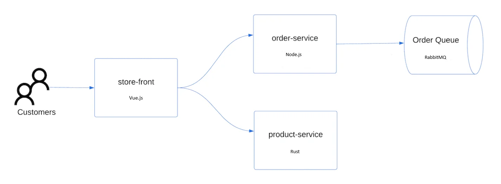

使用 Azure CLI 创建 K8S 集群是一种非常简单易用的方式。你可以在任何操作系统中安装 Azure CLI 命令行工具； 或者启动含有 Azure CLI 的容器，然后在容器内使用 Azure CLI 。




## 准备 Azure CLI

本文的演示命令都是在 macOS 上操作的，Azure CLI 在任何 OS 上安装的文档见 [Install Azure CLI](https://docs.microsoft.com/en-us/cli/azure/install-azure-cli) 。

如果你不想在本机安装 Azure CLI 命令行工具，可以使用 Docker 容器的方式，启动一个含有 Azure CLI 的容器，然后在容器内使用 Azure CLI 命令行工具。下面这个参考命令，是在此容器中带入当前路径做为容器内工作目录，并且指定运行特定 Azure CLI 版本的例子：

```bash
docker run -it --rm -v $(pwd):/work -w /work mcr.microsoft.com/azure-cli:2.0.80
```

## 登录 Azure

参考命令如下：

```bash
az login
```

假设你是使用本机安装的 Azure CLI 做 Azure CLI 的命令行登录认证，那么在运行了以上命令后，会弹出一个浏览器窗口，让你输入 Azure 的账号和密码，然后完成登录认证。

然后，你可以查看当前账号中的订阅；确保随后使用中一个正确的订阅，用于创建 K8S 集群。

```bash
az account list -o table
```

为了确保后续的命令行操作使用正确的订阅，可以用下面的命令设定订阅 ID；并且使用命令行变量的方式，设置当前使用的订阅。

```bash
az account set --subscription <subscription-id>
export SUBSCRIPTION=XXXXXXX-XXXX-XXXX-XXXX-XXXXXXXXXXXXXX
```

## 创建资源组

为了让本次操作的过程产物，都放在一个资源组中，我们先创建一个资源组。这样方便在测试完的时候，可以一次性删除所有曾经用到过的资源。

使用命令行变量设定资源组的名称和所在的区域，以及其他的参数：

```bash
export RESOURCE_GROUP_NAME=aks-getting-started
export LOCATION=eastasia
export AKS_CLUSTER_NAME=aks-4-devops
export AKS_CLUSTER_VERSION=1.28.3
export AKS_NODE_COUNT=2
export AKS_NODE_VM_SIZE=Standard_B2s
export AKS_NODE_DISK_SIZE=50
```

创建资源组：

```bash
az group create --name $RESOURCE_GROUP_NAME --location $LOCATION
```

## 创建 Service Principal

为了让 K8S 可以使用到 Azure 账号中的各种必要的资源服务（disk，负载均衡，存储等等），需要创建一个 Service Principal，用于 K8S 访问 Azure 资源。下面用新的命令行变量携带 Service Principal 的相关信息：

```bash
SERVICE_PRINCIPAL_JSON=$(az ad sp create-for-rbac --skip-assignment --name aks-getting-started-sp -o json)
SERVICE_PRINCIPAL=$(echo $SERVICE_PRINCIPAL_JSON | jq -r '.appId')
SERVICE_PRINCIPAL_SECRET=$(echo $SERVICE_PRINCIPAL_JSON | jq -r '.password')

az role assignment create --assignee $SERVICE_PRINCIPAL \
--scope "/subscriptions/$SUBSCRIPTION/resourceGroups/$RESOURCE_GROUP_NAME" \
--role Contributor
```

关于 Service Principal 的更多信息，可以参考 [Azure AD Service Principal](https://docs.microsoft.com/en-us/azure/active-directory/develop/app-objects-and-service-principals) 。

## 创建 K8S 集群

可以先使用下面的命令获取创建 aks 集群详细的帮助信息，以及丰富的可用选项；

```bash
az aks create -h
```

查看当前可用区中的 AKS 服务中的 Kubernetes 版本：

```bash
az aks get-versions --location $LOCATION -o table
```

运行创建 AKS 集群的命令：

```bash
az aks create -n $AKS_CLUSTER_NAME \
--resource-group $RESOURCE_GROUP_NAME \
--location $LOCATION \
--kubernetes-version $AKS_CLUSTER_VERSION \
--load-balancer-sku standard \
--nodepool-name default \
--node-count $AKS_NODE_COUNT \
--node-vm-size $AKS_NODE_VM_SIZE \
--node-osdisk-size $AKS_NODE_DISK_SIZE \
--network-plugin kubenet \
--service-principal $SERVICE_PRINCIPAL \
--client-secret "$SERVICE_PRINCIPAL_SECRET"
```

## 连接到 K8S 集群

使用下面的命令，获取 AKS 集群的连接信息：

```bash
az aks get-credentials --resource-group $RESOURCE_GROUP_NAME --name $AKS_CLUSTER_NAME
```

这条命令会将 AKS 集群的连接信息，写入到 `~/.kube/config` 文件中，然后你就可以使用 `kubectl` 命令行工具，连接到 AKS 集群了。

```bash
kubectl get nodes
```

以上忽略命令行 kubectl 的安装方式，详见 [Install and Set Up kubectl](https://kubernetes.io/docs/tasks/tools/install-kubectl/) 。

## 部署应用

下面参考 <https://learn.microsoft.com/zh-cn/azure/aks/learn/quick-kubernetes-deploy-cli> 文档中的操作步骤，部署
 [AKS 应用商店应用程序](https://github.com/Azure-Samples/aks-store-demo) 。该应用系统的示意图如下：



创建名为 [aks-store-quickstart.yaml ，清单文件点此下载](aks-store-quickstart.yaml) ，并将以下清单复制到其中：

使用 kubectl apply 命令部署上面的应用：

```bash
kubectl apply -f aks-store-quickstart.yaml
```

使用 kubectl get pods 命令，查看应用程序的所有 Pod 都处于 Running 状态：

```bash
kubectl get pods
```

使用下面的命令获取 store-front 服务的外网 IP 地址：

```bash
kubectl get service store-front --watch
```

最后，打开 Web 浏览器并转到服务的外网 IP 地址，以查看 Azure 应用商店应用的实际效果。

## 清理资源

使用下面的命令，删除整个测试的资源组、Service Principal 和 AKS 集群，以及当前命令行中 kubctl 的配置文件中的 K8S 集群的上下文。

```bash
az aks delete --resource-group  $RESOURCE_GROUP_NAME  --name $RESOURCE_GROUP_NAME --yes
az ad sp delete --id aks-getting-started-sp
kubectl config delete-content $AKS_CLUSTER_NAME
```

## 总结

本文主要讲解了使用 Azure CLI 创建 K8S 集群所使用到的一般性流程和选项，目标是为你更复杂的使用场景打下基础。

Azure CLI、Terraform 和 Pulumi 都是创建和管理云资源的工具，但它们各有优势：

Azure CLI：

* 简单易用：Azure CLI 的命令结构简洁明了，易于理解和使用。
* Azure 专用：Azure CLI 是专为 Azure 设计的，对 Azure 的各种服务和资源有深度集成。

Terraform：

* 提供声明式语法：Terraform 使用声明式语法，用户只需描述他们希望达到的最终状态，Terraform 将处理如何达到这个状态。
提供状态管理：Terraform 能够跟踪和管理每个部署的状态，这对于管理复杂的系统非常有用。
* 跨平台：Terraform 支持多个云服务提供商，不仅限于 Azure。

Pulumi：

* 使用常规编程语言：Pulumi 允许使用常规编程语言（如 Python、JavaScript、TypeScript、Go 等）来描述和管理云资源，这使得开发者可以利用他们已有的编程知识和技能。
* 提供状态管理：与 Terraform 类似，Pulumi 也提供状态管理功能。
跨平台：Pulumi 同样支持多个云服务提供商。

选择哪种工具取决于你的具体需求和偏好。后续我们演示使用 Terraform 和 Pulumi 创建 K8S 集群的方式。

## 参考

- [Quickstart: Deploy an Azure Kubernetes Service (AKS) cluster using the Azure CLI](https://docs.microsoft.com/en-us/azure/aks/kubernetes-walkthrough)
- <https://github.com/marcel-dempers/docker-development-youtube-series>
