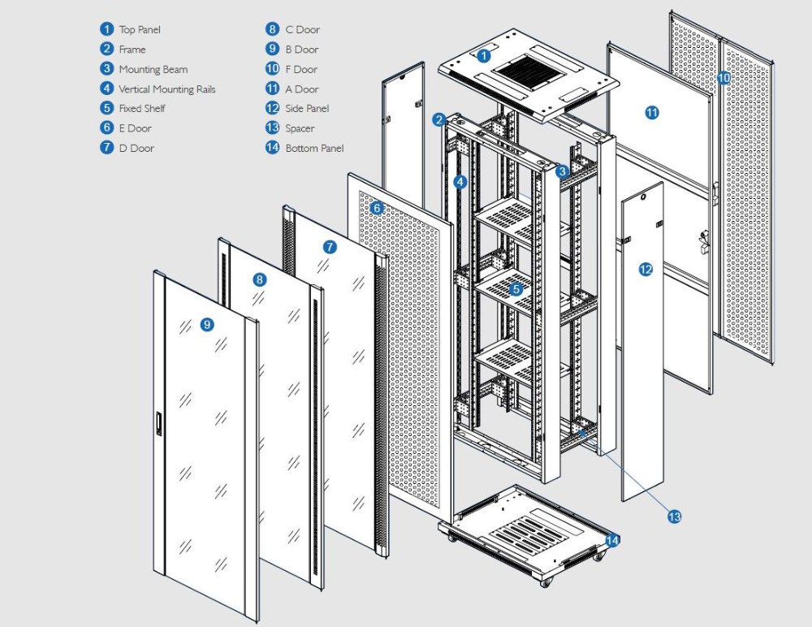
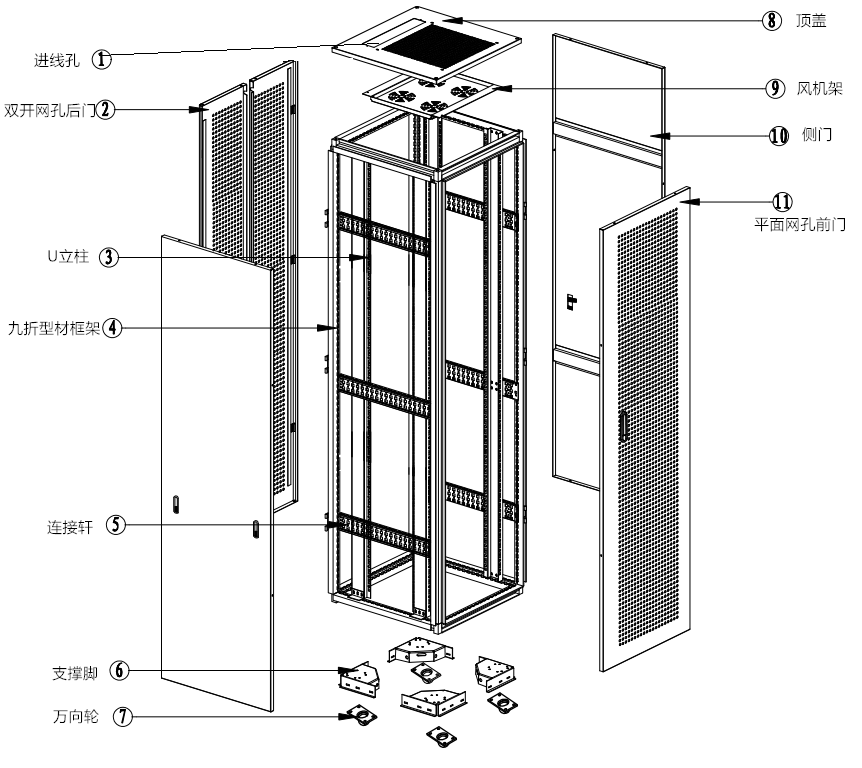
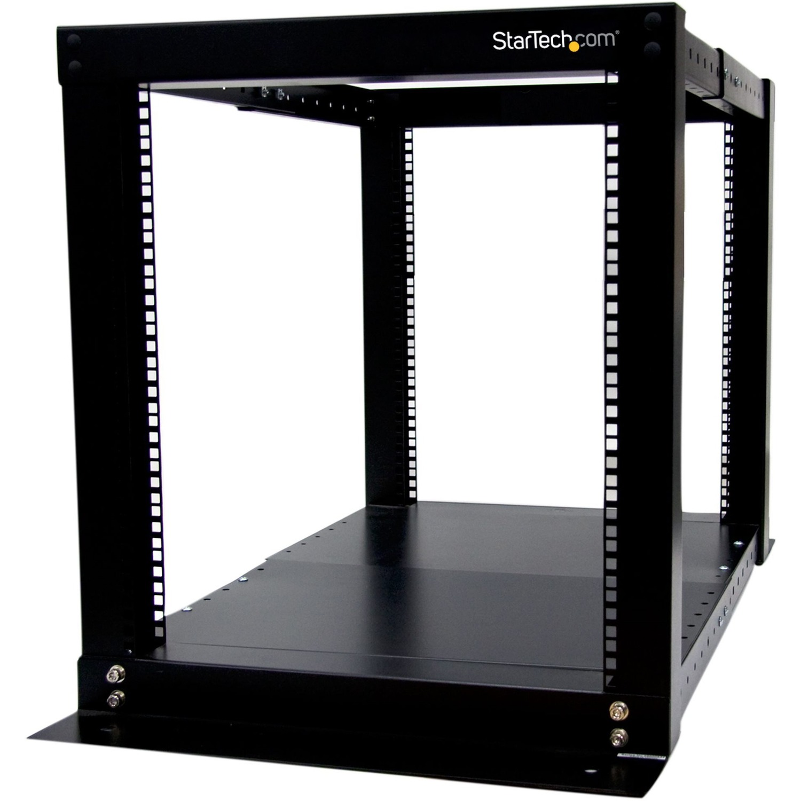
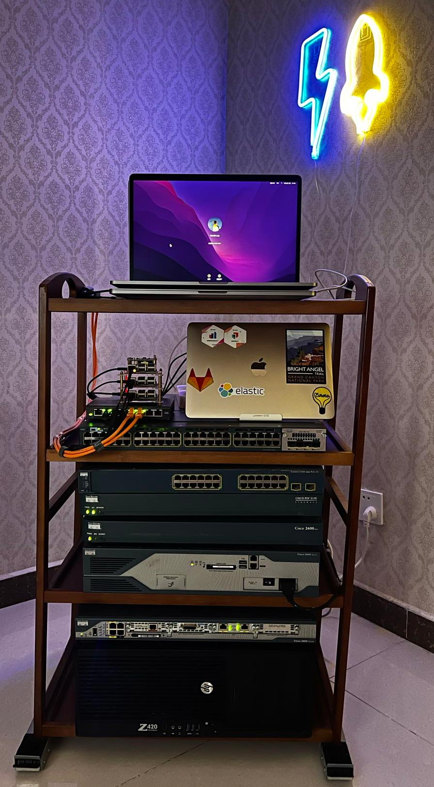
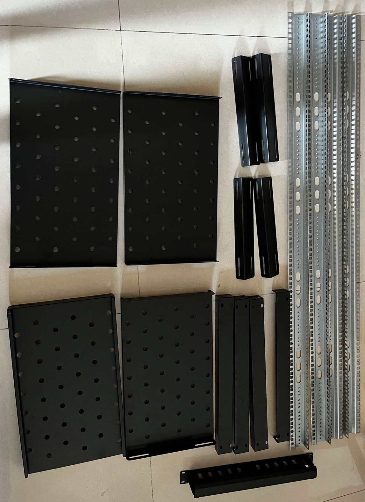
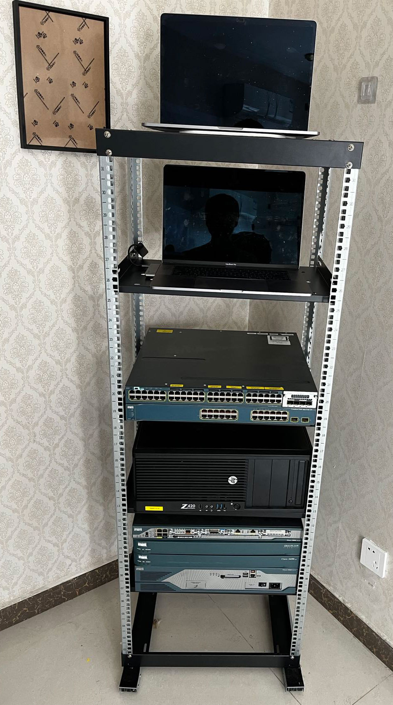
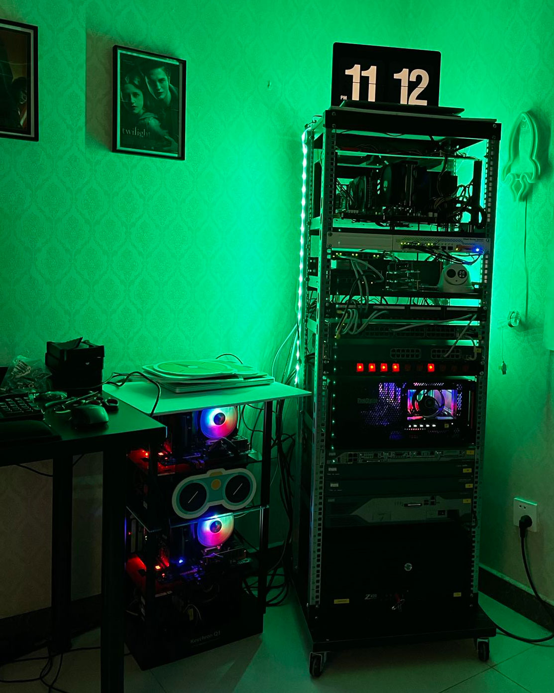

下面是标准的 IDC 机架结构示意图，结构比较复杂，发挥其所有功能还需要依赖于专业机房所提供的风火水电环境的各种配套支持。

下面这个标准规格【42u x 19 英寸】机架架结构图，这是最常见的服务器机柜，在普通的办公室里，或者公司专门的 server room 服务器机房中很常见。高低、深浅、能否墙挂都可以选择。

对我来说，显然以上两种的功能过于复杂，并不适合我在家庭使用；我个人比较偏爱 StarTech 公司的开放式机架。

但是，我发现 StarTech 公司的机架产品在国内没有代理商，在淘宝里也没有卖家。就算是有，价格也比较贵。不过它确实是国外 HomeLab 玩家评测的最多的。

总结一下我们置办家庭机架的几个所谓合理的动机：

* 整理收纳一定数量的电脑和网络产品，包括家用 NAS，wifi 和其他可能存在的新旧电脑（包括家用 PC、笔记本、服务器、网络设备等）。
* 给这些电子产品更好的运行环境，确保供电、散热、网络连接和安全性等需求。
* 让使用更加方便，需要开机的开机，用不到的关机省电。
* 目前真在，或者已经走向 HomeLab 的人，请自觉跳这个坑。
* 希望在本地组网，并自给自足一定数量本地虚拟机的需求，同时降低或者避免使用云主机的成本。
* 其他特殊需求：一个炫酷的机架也是不错的网络软件演示演示环境和直播的装饰背景。

下图是我的 HomeLab 机架的第一个版本。

设备包括：

* CCNA lab 测试设备一套。
* TrueNAS 服务器一台
* 四个旧树莓派
* 几个旧 MacBook Pro 电脑

这些版本基本上能满足以上列举的所有需求，成本可以忽略。缺点就是：它的承重能力有限，无法在堆放更多设备。由于疫情的原因，我需要把放在公司的四台PC服务器拿回家，方便使用。

由于比较了很久国内的品牌服务器机柜，他们的规格很齐全，很多人也都是买的这些成品机柜，到货开箱就可以使用，很方便。但是，成品并没有 DIY 的乐趣可言，我真的是不喜欢有全封闭式机柜，不想虑散机柜内的散热&热制冷问题（以及次生噪音），而且不方便触达设备的各个侧面。

因此我只能求助与万能的淘宝，在研究了一段时间自行搭建开放式机柜产品的可能性之后，我出手了。

这是第一次下单的产品，包括：

* 四根 32U 高的立柱：机架高度的选择是 DIY 搭建机架的最重要决策，考虑到一定的扩展性，应该至少规划 130% 的高度。 其次考虑深度，我铁定不想买全尺寸深度（600+mm）的设备，因此实际上就想搭建了一个：32U x 19 寸 x 19 寸的立方体，这就是成品机柜的瓤子，就是柜体里装的金属框架的部分。
* 四个服务器托盘 ：如果设备可以上下堆叠的话，其实也不用这么多，但是考虑到分层分区，设备取出和放入的方便性，需要计算好使用的个数。
* 四块盲板：是前后上下，将四根立柱连接起来的主要部件。
* 两幅服务器导轨：安装在了顶部和底部框架的侧面，将机架的前后链接起来，安装好这四根导轨，机架就可以站立起来了。居然前后左右都不怎么摇晃，整体框架还比较的支棱的 😄
* 一个理线架：其实不需要，由于你不可能有大量线需要整理，买多了。

销售以上产品的淘宝商家是：军臣机柜 1 店；前后从他们家下了两个单（320+38），第二个单补了四根导轨，起稳定机架，更优化的分层分区，更方便的叠放设备的作用，释放了两个托盘，托盘将主要用于在实现开放平层，起到设备物品的放置功能。安装起来后的效果如下。

在将设备放进去的过程中，发现了几个问题：

* 洗衣机用移动滑轨无法胜任如此重量机架前后左右的快速移动，而且只能前后移动；还需要一个更加稳定，且更方便四向移动的底座。
* 机柜还需封顶，只有封顶后，上面才能便于放置物品。

解决方法：

1. 在淘宝里买了一块底座板，规格 2cm 厚 x 53cm x 53cm 的压缩板，到货后发现：其实坚固程度不输于实木板。够用且耐用，全面黑漆，多种颜色可选。
2. 淘宝店家送了我四个万向轮和更多的机架螺丝，轮子安装在了底座板的四个角上，底座比机架大了一圈，既不占地方，也实现了稳定承载机架的目的，还可以四个方向顺滑的移动，其实用不到带锁死功能的万向轮。
3. 用一块大约19 寸 x 22 寸的房间隔音装修剩下的隔音板封顶，大小相当合适。用木螺丝和机架固定在了一起。

下面是将所有设备上架，网络连通后，晚上的效果。

这么多年来积累下来的所有 HumeLab 设备就都在这里了，堆叠在一起之后意识到，给自己挖的这个坑，是越挖越深了。

最后从几个方面讲讲当前这个阶段的经验总结。

**电源供给**

1. 机架专用 PDU 的好处多多，能用尽量用。
2. 前置 PDU A ：是一款 1U 高度，前面板 10 位独立开关，后身走电源线的，好处是省空间，后身走电源线更隐蔽、美观。但是需要重新买 10 根美标垂直三叉的电源线（5 根 1 米 + 5 根 1.5 米，这款 PDU 只能插这种电源线），目前还富裕了 2 到 3 根供电源线。
3. 后置 PDU B ：是一款 2U 高度，8 位独立开关。目前有一个空位；电源插头供电位的需求远远比你想的多得多，除非设备不会在增加了，千万别想一个插排就搞定。
4. 需要首选可以安装在机架上的 PDU 优于家用的插排。整合性极佳。
5. USB 供电，安装一个 10 位的 USB 插排，有了它给树莓派、风扇、灯光设备的供电就方便且统一了，一个电源插头位置就替代了 n 个 usb 变压器插头的需求。

**网络拓扑**

1. 入户光纤+光猫+WiFi 给所有无线设备使用，暂时没有无线访问机架内设备的需求，有的话，会首选在 pfSense 上做 NAT 的方式接入，从而最小化 WiFi 部署数量。
2. 通过房间内的走线管，从入户弱电箱的光猫上拉了一根网线到机架的房间，并且接到机架上。实现了机架的外网链接。在手里云主机资源充足的情况下，我完全忽略远程访问机架中设备的鸡肋需求。
3. 核心以太网交换机：一台 Cisco 48 口千兆交换机，可划分 VLAN，属于 CCNA Lab 设备的一部分。
4. 万兆存储网交换机：一台 MikroTik 8 口 SPF+ 交换机，功能很强大，学习曲线陡。用于 TrueNAS 存储服务，和 Nutanix 超融合集群的组网。
5. 山泽 24 口配线架：用了以后才能理解配线架的底层逻辑，将所有设备都统一终结在同一级，然后就可以在机架前面，按标签快捷的给设备分配不同的网络。
6. 买了一卷网线制作跳线：配合打线钳和测线器，一盒 50 个的水晶头，做完了一些跳线后，568B 线序就成了肌肉记忆了。推荐使用，虽然费事，但是可以让网线布线&走线更加简洁。
   
**风冷散热和用电方式**

1. 我坚守不使用大功耗&全尺寸服务器设备的原则。感觉只有这样才能实现通过房间环境的自然散热，注意房间的正常通风即可。
2. 给设备按需增加和升级必要的风冷风扇。
3. 最耗电的是联想 P720 两路工作站，它是 Nutnaix 集群的一部分，升级了 CPU 的散热器，加装了机箱前置风扇，解决旧风扇导致的无法正常开机和运行中过热机器卡死的问题。
4. 最牛的是给 8 口 pfSense 防火墙工控机扇热的 USB 桌面小风扇，它顺便还给树莓派集群风冷了；这是从家里小朋友哪里征用的。风量大，几乎静音，基本上能秒掉各种尺寸和价格的 DIY 机箱用风扇，已经买过几个了，它们的噪音大到不能忍。
5. 常开的设备包括：TrueNAS 服务器和 48 口核心交换机和 MikroTik 万兆交换机。其他的设备按需开机，保持最小的功耗和发热量。
6. 由于家庭 WiFi 和这个机架无关，因此在需要用的时候，或者人不在家的时候整个机架关机断电。

以上就是目前的经验总结分享，欢迎交流讨论。以后可能会以本文为大纲录制一期视频，在讲的细一些。