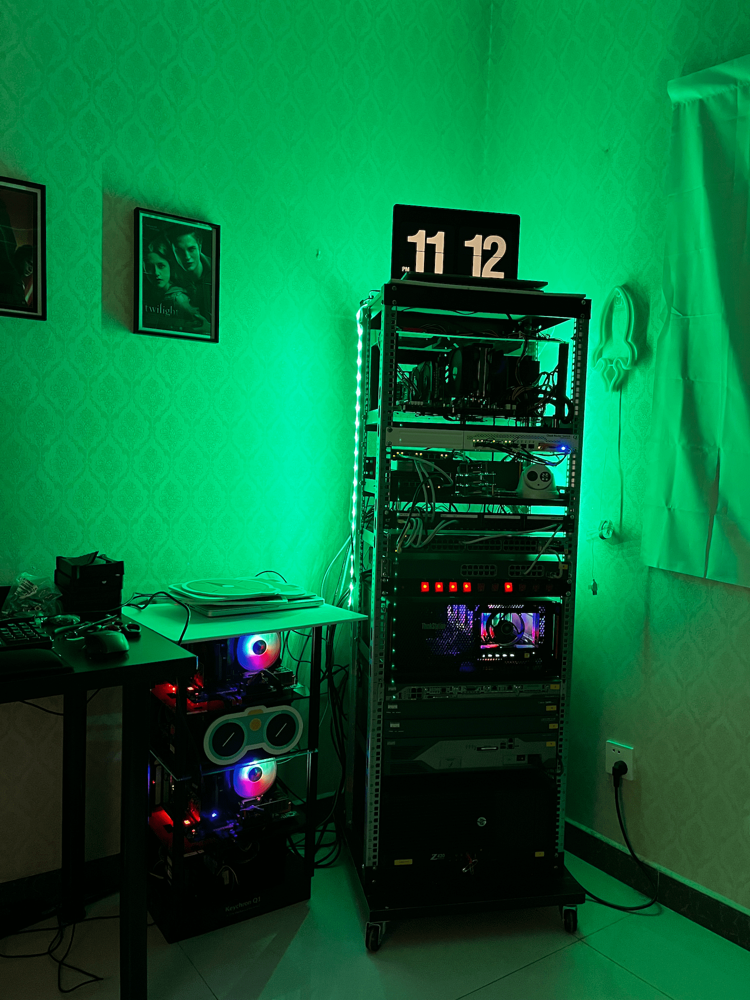

趁着更新 Blog 皮肤的机会，也把我拖延很久的一些优化补一补。

最新版本的 Hugo 可以使用 Hugo modules 功能加载一个新的 Theme，我是第一次通过这种方式添加新皮肤，犯了几个错误：

1. 首先不应该用 `git clone theme-url theme/` 或者其他手工下载的方式了，应该使用文档中说的 `hugo mod get -u github.com/CaiJimmy/hugo-theme-stack/v3` 方法。
2. 在本地测试的话，需要确保本地的 Hugo 安装的是 extended 的扩展版本，否则有些短代码用不了。用这条命令检查 `hugo version` ，应该返回类似这样的信息：`hugo v0.104.2+extended darwin/arm64 BuildDate=unknown`

更新了 GitHub Action 的工作流，实现了如下的想法：

* deploy-2-page.yml : 在所有分支的 push 操作上触发构建动作，并且把更新的网站内容发布到 GitHub Pages 的部署分支中，用这个方式实现线上的网站内容预览；当新的分支在本地预览正常后，就可以 push 到远程了，push 之后就可以先在 martinliu.github.io 的域名下实现分支合并前的线上预览，如果线上预览正常的话，在进行合并分支 pr 的操作；如果线上预览有问题，则继续在本地更新，直到线上预览正常之后在合并。
* page-deploy.yml : 当 master 分支上收到 pr 时触发这个发布操作，我将 GitHub Pages 的免费空间当做了发布前的预览的空间；而网站的内容是通过 CloudFlare 的 Pages 功能 host 的。通过这种方式，将 GitHub 的所有功能和空间作为开发服务；而 CloudFlare 定位为 DNS 和静态内的生产环境。

目前我的 blog 的工作流程是这样的：

```sh
# 第一步：在本地创建新的分支，并 push 同步到远程
➜  martinliu.github.io git:(master) git branch build-your-best-rack  
➜  martinliu.github.io git:(master) git checkout build-your-best-rack 
M       themes/hugo-theme-stack
Switched to branch 'build-your-best-rack'
➜  martinliu.github.io git:(build-your-best-rack) git push origin build-your-best-rack        
Total 0 (delta 0), reused 0 (delta 0), pack-reused 0
remote: 
remote: Create a pull request for 'build-your-best-rack' on GitHub by visiting:
remote:      https://github.com/martinliu/martinliu.github.io/pull/new/build-your-best-rack
remote: 
To github.com:martinliu/martinliu.github.io.git
 * [new branch]          build-your-best-rack -> build-your-best-rack

# 第二步：用 hugo 命令创建新文章的文件，然后开始编写更新新文章
➜  martinliu.github.io git:(build-your-best-rack) hugo new content/post/build-your-best-rack/index.md
Content "/Users/martinliu/code/martinliu.github.io/content/post/build-your-best-rack/index.md" created

# 第三步：本地预览正常后，push 到 GitHub Pages 空间在远程预览 https://martinliu.github.io
➜  martinliu.github.io git:(build-your-best-rack) ✗ git add .                           
➜  martinliu.github.io git:(build-your-best-rack) ✗ git commit -m "review new post online"[build-your-best-rack e21fffe8f] review new post online
 1 file changed, 6 insertions(+)
 create mode 100644 content/post/build-your-best-rack/index.md
➜  martinliu.github.io git:(build-your-best-rack) git push --set-upstream origin build-your-best-rack
Enumerating objects: 9, done.
Counting objects: 100% (9/9), done.
Delta compression using up to 10 threads
Compressing objects: 100% (5/5), done.
Writing objects: 100% (6/6), 540 bytes | 540.00 KiB/s, done.
Total 6 (delta 3), reused 0 (delta 0), pack-reused 0
remote: Resolving deltas: 100% (3/3), completed with 3 local objects.
To github.com:martinliu/martinliu.github.io.git
   49d889b6e..e21fffe8f  build-your-best-rack -> build-your-best-rack
branch 'build-your-best-rack' set up to track 'origin/build-your-best-rack'.

# 第四步：在 GitHub 上发起并合并 pr
# 第五步：删除本地特性分支，删除远程特性分支，更新本地 master 分支。

➜  martinliu.github.io git:(change-to-new-theme) git checkout master              
warning: unable to rmdir 'themes/hugo-theme-stack': Directory not empty
Switched to branch 'master'
Your branch is behind 'origin/master' by 5 commits, and can be fast-forwarded.
  (use "git pull" to update your local branch)
➜  martinliu.github.io git:(master) ✗ git push origin --delete origin/change-to-new-theme 
error: unable to delete 'origin/change-to-new-theme': remote ref does not exist
error: failed to push some refs to 'github.com:martinliu/martinliu.github.io.git'
➜  martinliu.github.io git:(master) ✗ git push origin --delete change-to-new-theme 
To github.com:martinliu/martinliu.github.io.git
 - [deleted]             change-to-new-theme
➜  martinliu.github.io git:(master) ✗ git pull                                    

```

根据这款新皮肤的提示，我查看了最新的 Hugo 的文档，为了发挥这个皮肤的图像 resize 功能，并且遵从新的编写 post 的规范。以后的所有新文章的 md 文件和图片文件都需要放到一个独立的新目录中。

新创建一篇 post 的时候使用这个命令：

```sh
hugo new content/post/new-blog-test/index.md
```

在站点的根目录下执行这条命令后，会帮你创建新的目录和 `index.md` 文件；由于我的站点默认使用了中文语言，因此，如果我想写一篇英文的文章的话，我就需要将 md 文件的名字写成 `index.en.md` ；这个皮肤支持双语的，如果这篇文章也有中英两个版本的话，md 文件就应该有两个：

* index.zh-cn.md
* index.en.md

这样就有了中英文的两个独立的页面，而且两种语言各自的页面上，都会有一个语言切换的按钮，所以这个皮肤对于双语，或者多语言写作的人来说，应该是非常顺手的一个选择。我将主导航的那些页面都做出了双语的版本。

由于，我最后的所有静态文件和图片都发布到了 CloudFlare 的 Pages 服务里，而且它们还提供 CDN 服务，而这个功能在 GitHub Pages 空间中是不提供的。因此，以前我用 GitHub Pages host 这个 blog 的时候，每次编写和发布新文章的时候，还需要手工的将图片上传到其它第三方的图床空间中，然后在更新 md 文章中图片的网址，其实还是比较繁琐和麻烦的。

这个国庆节期间，我基本上也完成了 home lab 的 Rack 搭建项目，初步效果如下：



以上这张图片放置在了和 md 文件相同的目录中，插入这张图片的代码就变得异常简单了 `` ；而且图片也被拉伸到了和文章页面宽度等宽，大小合适的情况下会充满页面宽度，而且能够自适应浏览器显示器的宽度。

后续会出一些关于这个 home lab 的文章。

关于这个皮肤的使用文档，请访问： https://docs.stack.jimmycai.com/

如果你也喜欢这个风格的皮肤，请查看： [hugo-theme-stack-stater](https://github.com/CaiJimmy/hugo-theme-stack-starter)


遗留问题：

* 左上角的头像图片无法正常显示
* 添加一种免费好用的评论互动插件
* 增加搜索功能


> [欢迎直接开通观测云商业版，即可获得 500 元无限制代金券，](https://auth.guance.com/businessRegister?source=martinLiu)
> [也可以选择开通个人体验版，每天有2000的免费额度畅快使用，可点此处参考费用表。](https://www.guance.com/billing#business#China?source=martinLiu)
