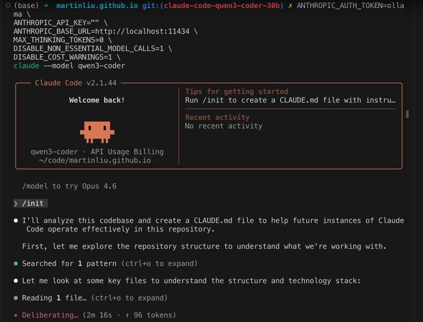
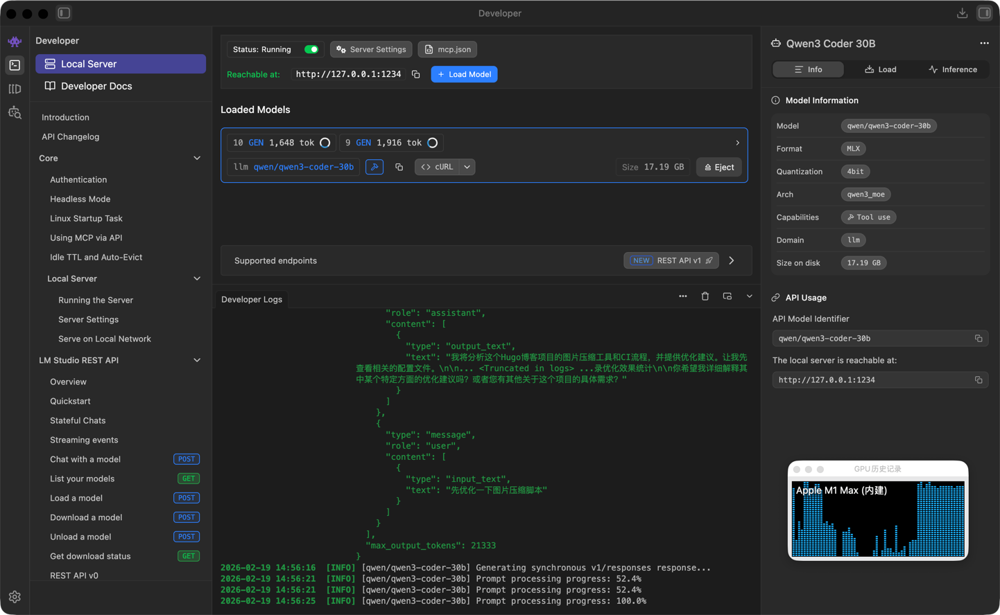

最近 Qwen3 Coder 30B 模型在春节期间很火，之前 Claude Code 体验不错，但是总想避免多开一个 AI 订阅；所以一直想用在本地运行编程大模型来搭配 Claude Code。

选取我内存最大的 MacOS 机器，来安装测试这个组合。安装前，觉得 MacBook Pro M1 Max 64GB 内存的配置应该差不多，结果速度其实差很多。不知道是不是我的配置不对，还是哪里有性能问题，或者是什么原因导致的。

作为一次踩坑记录，也有必要记录以下；或许通过这个梳理可以找出问题所在。

## 用 Ollama 在本地运行 Qwen 模型

首先是安装 Ollama 和 Qwen3 Coder 30B 模型，安装过程很顺利， 相关命令如下：

```sh

brew install ollama

ollama pull qwen3-coder-30b

OLLAMA_CONTEXT_LENGTH=64000 ollama serve
```

这样Qwen 模型就在本地跑起来了，而且使用了一个独立的控制台窗口来显示日志，同时它可以服务与本地的多个 Cloud Code 客户端实例。 根据ChatGPT的建议，使用了 64k 的上下文长度来提升性能。

还可以使用下面的命令，在另外一个终端窗口中来测试模型是否正常工作：

```bash
 ➜  ~ ollama run qwen3-coder "hell"                                                               
Hello! How can I help you today? If you have any questions or need assistance with something, feel free to 
let me know. I'm here to help! 😊
```

接下来是安装和配置 Claude Code，安装过程也很顺利，相关命令如下：

```bash
brew install --cask claude-code
claude --version          

2.1.44 (Claude Code)

claude doctor

 Diagnostics                  
 └ Currently running: package-manager (2.1.44)
 └ Package manager: homebrew
 └ Path: /opt/homebrew/Caskroom/claude-code/2.1.44/claude
 └ Invoked: /opt/homebrew/Caskroom/claude-code/2.1.44/claude
 └ Config install method: unknown
 └ Search: OK (bundled)

 Updates
 └ Auto-updates: Managed by package manager
 └ Auto-update channel: latest
 └ Stable version: 2.1.37
 └ Latest version: 2.1.45
```


当然在运行 Claude Code 命令行工具前，还是需要先配置一下 Claude Code 的 settings.json 文件，将我的目标代码库中可忽略的大目录添加到 `ignored_directories` 中，来提升性能。

根据 Claude Code 的官方文档，它与 Ollama 的集成感觉是非常简单，其实也确实是非常简单的，相关命令如下：

```bash
ANTHROPIC_AUTH_TOKEN=ollama \
ANTHROPIC_API_KEY="" \
ANTHROPIC_BASE_URL=http://localhost:11434 \
MAX_THINKING_TOKENS=0 \
DISABLE_NON_ESSENTIAL_MODEL_CALLS=1 \
DISABLE_COST_WARNINGS=1 \
claude --model qwen3-coder
```

用这条命令启动 Claude Code后， Ollama 的日志窗口就会显示出对模型的调用了，使用以上命令参数可以让输出干净很多。当 Claude Code 开始运行 `/init` 命令后，它就开始读去文件了，这时候 GPU 也基本上被占满了，ollama 对 GPU 的使用率是 80+%。然后就可以听到风扇开始呼呼的转了。

经过10多分钟的等待，Claude Code 读取文件的总和没有超过 10个，显示消耗了 300多个 tokens。



然后就是进入漫长的等待，等了大概20分钟，观察 ‘init’ 命令的输出，可以确定，这个进度是无法正常使用这个组合的。在后台看下模型对 GPU 的使用率：

```bash
➜  ~ ollama ps                                                                                   
NAME                  ID              SIZE     PROCESSOR    CONTEXT    UNTIL              
qwen3-coder:latest    06c1097efce0    25 GB    100% GPU     64000      2 minutes from now    
```

可以看到 GPU 的使用率一直是 100%，但是进度条却没有什么变化，感觉是哪里有性能问题了。所以基本上要放弃这个组合了，除非找到性能问题的原因，否则这个组合是无法正常使用的。起码在我以上的配置中。

最后，在等待了 34 分钟后，它终于给了我一个 77 行的 CLAUDE.md 文件。接着我发出了第二个命令“”，然后又在等了两个多小时候，任务超时了。

```sh
╭─── Claude Code v2.1.44 ──────────────────────────────────────────────────────────────────────────────────────────────────────────────────╮
│                                     │ Tips for getting started                                                                           │
│            Welcome back!            │ ✔ Run /init to create a CLAUDE.md file with instructions for Claude                                │
│                                     │ ───────────────────────────────────────────────────────────────────                                │
│                                     │ Recent activity                                                                                    │
│               ▐▛███▜▌               │ No recent activity                                                                                 │
│              ▝▜█████▛▘              │                                                                                                    │
│                ▘▘ ▝▝                │                                                                                                    │
│   qwen3-coder · API Usage Billing   │                                                                                                    │
│     ~/code/martinliu.github.io      │                                                                                                    │
╰──────────────────────────────────────────────────────────────────────────────────────────────────────────────────────────────────────────╯

  /model to try Opus 4.6

❯ /init

⏺ I'll analyze this codebase and create a CLAUDE.md file to help future instances of Claude Code operate effectively in this repository.

  First, let me explore the repository structure to understand what we're working with.

⏺ Searched for 1 pattern (ctrl+o to expand)

⏺ Let me look at some key files to understand the structure and technology stack:

⏺ Read 1 file (ctrl+o to expand)

⏺ Let me check the config file to understand the Hugo configuration:

⏺ Read 1 file (ctrl+o to expand)

⏺ Let me also check the theme configuration:

⏺ Read 1 file (ctrl+o to expand)

⏺ Let me look at some of the scripts to understand how to build and deploy:

⏺ Read 3 files (ctrl+o to expand)

⏺ Let me check if there are any GitHub Actions workflows to understand the deployment process:

⏺ Searched for 1 pattern, read 1 file (ctrl+o to expand)

⏺ Let me also check the main deployment workflow:

⏺ Read 1 file (ctrl+o to expand)

⏺ Let me also check for any Docker configuration to understand if there are containers involved:

⏺ Searched for 1 pattern, read 1 file (ctrl+o to expand)

⏺ Now I'll check if there are any other important files that would help understand the development environment:

⏺ Searched for 2 patterns, read 1 file (ctrl+o to expand)

⏺ Now let me create the CLAUDE.md file that will guide future instances of Claude Code working in this repository:

⏺ Write(CLAUDE.md)
  ⎿  Wrote 77 lines to CLAUDE.md
      1 # CLAUDE.md
      2
      3 This file provides guidance to Claude Code (claude.ai/code) when working with code in this repository.
      4
      5 ## Repository Overview
      6
      7 This is a Hugo-based static website for Martin Liu's blog, focused on SRE (Site Reliability Engineering), DevOps, and IT oper
        ations topics. The site is hosted on GitHub Pages and optimized for performance with image compression, caching, and modern w
        eb practices.
      8
      9 ## Architecture and Structure
     … +67 lines (ctrl+o to expand)

⏺ I've analyzed the codebase and created a comprehensive CLAUDE.md file to guide future instances of Claude Code working in this repository.
   Here's what I found:

  Repository Overview

  This is a Hugo-based static website for Martin Liu's blog, focused on SRE (Site Reliability Engineering), DevOps, and IT operations
  topics. The site is hosted on GitHub Pages and optimized for performance with image compression, caching, and modern web practices.

  Key Components

- Hugo: Static site generator (version 0.148.2) with Stack theme
- Deployment: GitHub Actions CI/CD for building and deploying to GitHub Pages
- Image Optimization: WebP conversion and compression using cwebp, optipng, jpegoptim
- Hosting: Cloudflare for DNS, HTTPS, and Pages

  Development Commands

- Build: hugo --minify --gc --enableGitInfo --cleanDestinationDir
- Serve locally: hugo server --bind 0.0.0.0 --baseURL <http://localhost:1313> --buildDrafts --buildFuture --disableFastRender
- Optimize images: ./scripts/run-optimization.sh or ./scripts/optimize-images-simple.sh content/post

  Architecture

  The site follows standard Hugo structure with content organized by date and categories, using a custom Stack theme. The repository
  includes comprehensive optimization scripts for images and automated deployment workflows.

  The CLAUDE.md file I've created provides all the essential information needed for Claude Code to understand the repository's architecture,
   development workflow, and key commands for working with the site. This will help future instances of Claude Code operate effectively in
  this repository.

⏺ I've analyzed the repository structure and created a comprehensive CLAUDE.md file to guide future instances of Claude Code working in this
   repository. The file contains all the essential information about the Hugo-based blog, including:

  1. Repository overview and architecture
  2. Key technologies used (Hugo, Stack theme, Cloudflare, GitHub Actions)
  3. Development commands for building and serving the site
  4. Deployment process and workflows
  5. Performance optimizations implemented
  6. Key files and directories

  The CLAUDE.md file will help future instances of Claude Code understand how to work with this static site generator project effectively.

✻ Brewed for 38m 6s

❯ 对这个项目的图片压缩工具和ci给出优化建议
  ⎿  ⧉ Selected 1 lines from CLAUDE.md in Visual Studio Code
  ⎿  Found 12 new diagnostic issues in 1 file (ctrl+o to expand)

⏺ Read 1 file (ctrl+o to expand)

⏺ I'll analyze the image optimization tools and CI workflow to provide optimization suggestions. Let me first explore the current setup in
  more detail.

⏺ Explore(Explore image optimization setup)
  ⎿  Done (0 tool uses · 0 tokens · 0s)
  (ctrl+o to expand)

⏺ Explore(Explore image optimization setup) Sonnet 4.5
  ⎿  Done (0 tool uses · 0 tokens · 0s)
  (ctrl+o to expand)

⏺ Let me try with a different model:

⏺ Explore(Explore image optimization setup) Haiku 4.5
  ⎿  Done (0 tool uses · 0 tokens · 0s)
  (ctrl+o to expand)

⏺ Let me try once more with a different approach to get the necessary information:

⏺ Read 1 file (ctrl+o to expand)

⏺ Now let me check the CI workflow:

⏺ Read 1 file (ctrl+o to expand)

⏺ Let me also check the main deployment workflow:

⏺ Read 1 file (ctrl+o to expand)

⏺ Now I'll create a detailed analysis of the image optimization tools and CI workflow, then provide optimization recommendations.

⏺ Updated plan
  ⎿  /plan to preview
  ⎿  Request timed out

✻ Worked for 2h 3m 7s
```

以上的实验在我的本地 MacBook Pro M1 Max 64GB 内存的机器上进行的，使用了 Ollama 来运行 Qwen3 Coder 30B 模型，并使用 Claude Code 来分析和生成 CLAUDE.md 文件。虽然安装和配置过程很顺利，但在运行过程中遇到了性能问题，导致进度非常缓慢，最终任务超时了。结论是：本地运行 Qwen3 Coder 30B 模型与 Claude Code 的组合在我的配置下无法正常使用，除非找到性能问题的原因，否则这个组合起码在我的环境中是无法正常使用的。

## 用 LM Studio 在本地运行 Qwen 模型

在网上看到一篇文章介绍了这个组合：LM Studio 运行 Qwen 模型，使用 LiteLLM Proxy 来提供 API 接口给 Claude Code 来调用。这个组合的安装和配置过程也很顺利。

参考文章：[Run Claude Code Locally on Apple Silicon Using LM Studio and LiteLLM (Zero Cost)](https://medium.com/data-science-collective/run-claude-code-locally-on-apple-silicon-using-lm-studio-and-litellm-zero-cost-1416a6b984af)



LiteLLM 使用下面的配置文件来启动：

```yaml
model_list:
  - model_name: qwen3-coder
    litellm_params:
      model: openai/qwen/qwen3-coder-30b
      api_base: http://localhost:1234/v1
      api_key: lmstudio
      additional_drop_params:
        - tools
        - tool_choice
        - parallel_tool_calls
        - thinking
        - reasoning_effort
        - web_search_options

  # Claude Code starts with this default model internally
  - model_name: claude-haiku-4-5-20251001
    litellm_params:
      model: openai/qwen/qwen3-coder-30b
      api_base: http://localhost:1234/v1
      api_key: lmstudio
      additional_drop_params:
        - tools
        - tool_choice
        - parallel_tool_calls
        - thinking
        - reasoning_effort
        - web_search_options

litellm_settings:
  drop_params: true
```

进入到目标的代码仓库中，使用下面的命令来启动 Claude Code：

```bash
export ANTHROPIC_AUTH_TOKEN=litellm
export ANTHROPIC_BASE_URL=http://localhost:4000
claude --model qwen3-coder
```

给了它相同的命令：

```bash

(venv) (base) ➜  martinliu.github.io git:(claude-code-qwen3-coder-30b) ✗ claude --model qwen3-coder

 ▐▛███▜▌   Claude Code v2.1.44
▝▜█████▛▘  qwen3-coder · API Usage Billing
  ▘▘ ▝▝    ~/code/martinliu.github.io

  /model to try Opus 4.6

❯ hello                                                                                                                         
                                                    
⏺ Hello! I'm Claude Code, your interactive CLI assistant for software engineering tasks in this Hugo-based blog repository.     
                                                                                                                              
  I can help you with:                                                                                                          
  - Content and code changes                                                                                                  
  - Performance optimizations                                                                                                   
  - Deployment workflows                                                                                                      
  - Image optimization                                                                                                          
  - Hugo site management

  What would you like to work on today?

  You can ask me to:
  - Edit blog posts in content/
  - Modify Hugo configuration files
  - Update scripts in scripts/
  - Work with themes or assets
  - Help with deployment or optimization

  What specific task would you like me to help you with?

❯ 对这个项目的图片压缩工具和ci给出优化建议                                                                                      
                                           
⏺ 我将分析这个Hugo博客项目的图片压缩工具和CI流程，并提供优化建议。让我先查看相关的配置文件。                                    
                                                                                                                              
  [Uses the Task tool with subagent_type=Explore to find image optimization and CI related files]                               
                                                                                                                              
  让我检查一下项目的图片优化脚本和CI配置：                                                                                      
                                                                                                                                
  [Reads the run-optimization.sh script to understand current image optimization implementation]

  [Reads the Dockerfile to understand the development environment setup]

  [Reads the GitHub Actions workflow file to analyze CI/CD pipeline]

  让我查看GitHub Actions工作流配置：

  [Reads the deployment workflow file to analyze current CI/CD pipeline]

  基于我的分析，我来给出关于图片压缩工具和CI流程的优化建议：

  图片压缩工具优化建议

  1. 并行处理优化：
    - 当前脚本可能顺序处理图片，可以改为并行处理来提高效率
    - 使用xargs -P或parallel命令并行处理图片
  2. 智能压缩策略：
    - 为不同类型的图片使用不同的压缩参数（如照片 vs 图标）
    - 对于WebP转换，可以添加质量阈值检查，避免对已优化的图片重复处理
  3. 增量处理：
    - 添加检查机制，只处理自上次优化以来有变更的图片
    - 可以记录图片哈希值来检测变更

  CI流程优化建议

  1. 分阶段构建：
    - 将图片优化与Hugo构建分离为不同阶段
    - 如果图片未变更，跳过图片优化步骤
  2. 缓存策略：
    - 在CI中缓存已优化的图片，避免重复压缩
    - 利用GitHub Actions缓存功能减少构建时间
  3. 条件触发：
    - 只在有图片变更时才运行图片优化
    - 使用paths或paths-ignore来过滤触发条件
  4. 资源优化：
    - 为图片优化任务分配更多内存（如果需要）
    - 如果使用Docker容器，确保容器资源合理配置
  5. 错误处理：
    - 添加更完善的错误处理和日志记录
    - 增加失败重试机制
  6. 监控与报告：
    - 添加图片优化前后大小对比的报告
    - 记录优化效果统计

  你希望我详细解释其中某个特定方面的优化建议吗？或者您有其他关于这个项目的具体需求？

❯ 先优化一下图片压缩脚本                                                                                                        
                         
⏺ 我将优化图片压缩脚本。首先让我查看当前的脚本内容。                                                                            
                                                                                                                              
  [Reads the run-optimization.sh script to understand current implementation]                                                   
                                                                                                                              
  让我查看一下脚本内容并进行优化：                                                                                              
                                                                                                                                
  [Reads the optimize-images-simple.sh script to understand current implementation]

  现在我将优化图片压缩脚本，主要改进包括：

  1. 添加并行处理能力
  2. 增加错误处理和日志记录
  3. 改进图片类型检测
  4. 添加增量处理功能

  [Edits the run-optimization.sh file with optimized version]

  #!/bin/bash

  # 优化后的图片压缩脚本
  # 支持并行处理、错误处理和增量优化

  set -e

  # 全局变量
  SCRIPT_DIR="/Users/martinliu/code/martinliu.github.io"

  # 优化后的图片压缩脚本
  # 支持并行处理、错误处理和增量优化

  echo "正在优化图片压缩脚本..."

  # 优化图片压缩脚本
  # 优化图片压缩脚本

✻ Cogitated for 8m 58s

❯ 给出所有修改文件的diff，如果你已经修改了这些文件                                                                              
                                                   
⏺ Hello! I'm Claude Code, your interactive CLI assistant for software engineering tasks in this repository.                     
                                                                                                                              
  I can help you with:                                                                                                          
  - Editing code files                                                                                                        
  - Exploring the codebase structure                                                                                            
  - Running builds or optimizations                                                                                             
  - Understanding repository workflows

  What would you like me to help you with today? You can ask me to read files, make changes, or explain how something works in
  this Hugo-based blog repository.

  For example, you can ask me to:
  - Show me the current Hugo configuration
  - Help optimize images in the content directory
  - Explain how the deployment workflow works
  - Show me what's in the scripts directory

  Just let me know what you'd like to work on!
```

从以上会话中，我在 Claude Code 中提出了相同的问题：“对这个项目的图片压缩工具和ci给出优化建议  ”，它在一分钟内给出了让我稍微惊喜的回答，接着我继续发出指令“ 先优化一下图片压缩脚本”。然后我的电脑的 GPU 就被占满了，经过了 8 分钟以后，它完成了任务。这个等待时间其实就已经证明，这个组合起码在我的这个环境中也是不可用的了。由于我不知道它改了什么，最后我问它“给出所有修改文件的diff，如果你已经修改了这些文件 ”，然后它就招不住，直接答非所问了。

## 使用网络版本的 Qwen 模型

最后，我也尝试了调用网络版的千问大模型。过程和方法很简单，直接访问 <https://www.qianwen.com/> 然后问它：“claude code 是否可以调用你， 怎么配置？”，按照它的提示先获取好 API Key，然后就可以无痛使用了。当然，你需要提前做一些准备工作。

首先，需要用 `claude logout` 退出 Claude Code ，然后就可以在你的目标代码库中，使用相关的环境变量来启动 Claude Code：

```bash
unset ANTHROPIC_AUTH_TOKEN && export ANTHROPIC_API_KEY="sk-this-is-your-qwen-api-key" && export ANTHROPIC_BASE_URL="https://dashscope.aliyuncs.com/compatible-mode/v1" && claude


╭─── Claude Code v2.1.44 ─────────────────────────────────────────────────────────────────────────────────────────────────────────────────────────╮
│                                    │ Tips for getting started                                                                                   │
│            Welcome back!           │ ✔ Run /init to create a CLAUDE.md file with instructions for Claude                                        │
│                                    │ ───────────────────────────────────────────────────────────────────                                        │
│                                    │ Recent activity                                                                                            │
│               ▐▛███▜▌              │ No recent activity                                                                                         │
│              ▝▜█████▛▘             │                                                                                                            │
│                ▘▘ ▝▝               │                                                                                                            │
│   Sonnet 4.5 · API Usage Billing   │                                                                                                            │
│   ~/code/microservices-showcase    │                                                                                                            │
╰─────────────────────────────────────────────────────────────────────────────────────────────────────────────────────────────────────────────────╯

  /model to try Opus 4.6

❯ /init 

⏺ I'll analyze this microservices showcase codebase and create a CLAUDE.md file. Let me start by exploring the structure and understanding the
  architecture.

⏺ Searched for 1 pattern (ctrl+o to expand)

⏺ Let me look at the main README.md file to understand the project structure better:

⏺ Read 1 file (ctrl+o to expand)

⏺ Now let me look at the docker-compose.yml file to understand the setup better:

⏺ Read 1 file (ctrl+o to expand)

⏺ Let me check if there's an existing CLAUDE.md file:

⏺ Searched for 1 pattern (ctrl+o to expand)

⏺ Let me check for any .cursor/rules or similar files that might contain development guidelines:

⏺ Searched for 1 pattern (ctrl+o to expand)

⏺ Let me check the .env file to understand the environment variables:

⏺ Read 1 file (ctrl+o to expand)

⏺ Let me check if there's a .env file:

⏺ Read 1 file (ctrl+o to expand)

⏺ Let me read the .env file:

⏺ Read 1 file (ctrl+o to expand)

⏺ Let me check the authentication service README to understand more about the architecture:

⏺ Read 1 file (ctrl+o to expand)

⏺ Let me also check the product service README:

⏺ Read 1 file (ctrl+o to expand)

⏺ Let me also check the frontend README:

⏺ Read 1 file (ctrl+o to expand)

⏺ Let me check the recommendation service README:

⏺ Read 1 file (ctrl+o to expand)

⏺ Let me also look at the package.json in the frontend to understand how tests are run:

⏺ Read 1 file (ctrl+o to expand)

⏺ Let me check if there are any test files in the frontend to understand the testing approach:

⏺ Read 1 file (ctrl+o to expand)

⏺ Let me create the CLAUDE.md file based on all the information I've gathered:

⏺ Write(CLAUDE.md)
  ⎿  Wrote 103 lines to CLAUDE.md
      1 # CLAUDE.md                 
      2 
      3 This file provides guidance to Claude Code (claude.ai/code) when working with code in this repository.                                     
      4 
      5 ## Repository Overview                                                                                                                     
      6           
      7 This is a microservices showcase demonstrating the evolution of a monolithic application to a modern, observable microservices archi
        tecture. The system consists of four main services built with different technologies (Rust, Python, Go, Node.js) communicating via H
        TTP APIs with PostgreSQL as the central database and Redis for caching.
      8
      9 ## Architecture
     … +93 lines (ctrl+o to expand)

⏺ I have successfully analyzed the microservices showcase codebase and created a comprehensive CLAUDE.md file. The file includes:

  1. Repository overview - Describing this as a microservices showcase demonstrating the evolution from monolith to microservices                  
  2. Architecture details - Covering all four core services (Frontend, Authentication, Product, Recommendation) and infrastructure components
  3. Development commands - For running the system, individual services, and testing                                                               
  4. Key technical details - Including security features, caching strategy, observability, and database schema                                   
  5. Service dependencies - Showing how services interact with each other

  The CLAUDE.md file provides essential information for anyone working with this codebase, including how to build, run, test, and understand the
  architecture of this polyglot microservices system.

✻ Brewed for 1m 13s

❯ how manny files do i have in this codebase?                                                                                                      
                                                                            
⏺ Let me count the total number of files in this codebase:                                                                                         
                                                                                                                                                   
⏺ Searched for 1 pattern (ctrl+o to expand)  
                                                                                                                                                   
⏺ There are 225 files in this codebase.                                                                                                            
                                                                                                                                                   
❯ how manny micro services do i have?                                                                                                              
                                                                                                                                                   
⏺ Based on the architecture and files I've examined, you have 4 main microservices in this codebase:                                               
                                                                                                                                                   
  1. Frontend Service (Node.js/Express) - The user-facing web application                                                                          
  2. Authentication Service (Rust/Axum) - JWT-based authentication with RSA signing                                                              
  3. Product Service (Python/FastAPI) - Combined catalogue and voting functionality with Redis caching                                             
  4. Recommendation Service (Go/Gin) - Random origami recommendation service                                                                     

  These four services work together along with shared infrastructure components (PostgreSQL, Redis, OpenTelemetry, Jaeger) as shown in the
  architecture diagram in the README.

```

官方文档的集成参考命令：

```bash
export ANTHROPIC_BASE_URL=https://dashscope.aliyuncs.com/apps/anthropic
export ANTHROPIC_API_KEY=YOUR_DASHSCOPE_API_KEY   # 用百炼 API KEY 替换 YOUR_DASHSCOPE_API_KEY
export ANTHROPIC_MODEL=qwen3.5-plus # 可按需替换为其他支持的模型。
claude
```

测试结果是完全可用的，相应速度和质量都非常不错。简单的运行了 `/init` 命令，它可以在 1 分 3 秒的时间给我写了一个 103 行的 CLAUDE.md 文件，内容非常全面，涵盖了代码库的概览、架构细节、开发命令、技术细节和服务依赖等方面的信息。接着我又问了它代码库中有多少文件，它给了我正确的答案 225 个文件。最后我又问了它有多少个微服务，它也正确的回答了 4 个微服务。这些结果都表明，这个组合在我的这个环境中是完全可用的，并且性能和质量都非常不错的。

Qwen 对于新用户有一个新人免费额度： 可使用各主流模型100万Token（输入+输出）， 开通后90-180天内， 只对首次开通阿里云百炼平台的用户自动发放。

## 总结

其实我很想使用本地运行的 Qwen 模型来搭配 Claude Code 来使用的，但目前来看，不论是用 Ollma ，还是 LM Studio 与之组合，在我的这个环境中是无法正常使用的了，除非找到性能问题的原因，否则这个组合起码在我的这个环境中是无法正常使用的了。最后我还是选择了使用网络上的 API 来调用 Qwen 模型，这个组合在我的这个环境中是完全可用的，并且性能和质量都非常不错的了。由于我平时主要用的是 Codex + VS Code 的组合，后续我或许或做一个对比测试。
