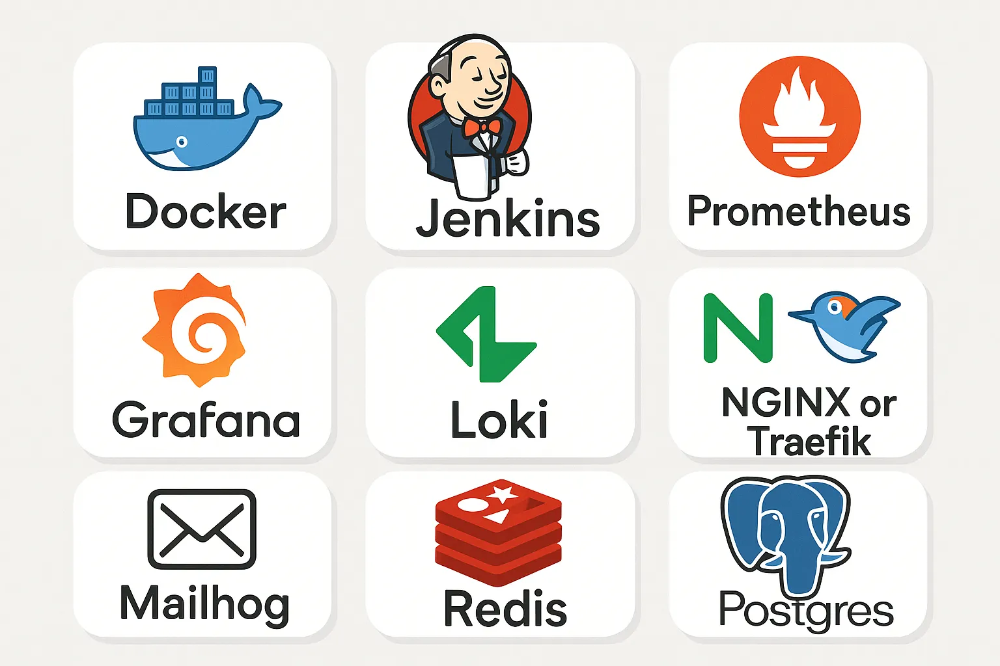

## ✨ TL;DR — 一套真正可用的本地 DevOps 技术栈

**问题**：云端 DevOps 费用高、迭代慢，还难调试。  
**解决方案**：用 Docker Compose 跑起来的一套完整 DevOps 技术栈，全部本地化。

## 核心组件包括：

- Jenkins（CI/CD）
- Prometheus + Grafana（监控）
- Loki + Promtail（日志聚合）
- NGINX / Traefik（反向代理）
- Mailhog（邮件测试）
- Postgres + Redis（辅助服务）

## 我的经验总结：

- 从小起步，逐步扩展。
- 固定版本，避免意外变更。
- 健康检查能救命。
- Docker Compose 胜过过早引入 Kubernetes。
- 养成写“技术栈日志”的习惯。

我的需求其实很简单。

我只想要一个稳的 CI 流水线、一套能看懂的监控指标，以及在部署前能本地测试全部功能的方式，不必再为云服务花冤枉钱。

结果呢？Jenkins 启动就挂，Prometheus 抓不到数据，Docker Compose 日志铺天盖地像在写小说。

我差点放弃。但在无数次试错、两次烧坏电脑，还有通宵翻遍 DevOps 博客之后，我终于搞出了一套真的能用的本地环境。

**不用 Kubernetes。不付 AWS 账单。没有凌晨四点的 Slack 报警。**

这不是教程，而是我自己打磨出来的生存指南，你完全可以照着用。🤝

## 什么才是 DevOps 技术栈（本地，而非理论）

提到 DevOps，大多数人想到的是云原生架构、Kubernetes 自动扩容集群，还有那种比房租还贵的精美仪表盘。但如果你是独立开发者、在搞实验，或只是想学习而不影响线上环境，**你需要的，是能直接在自己电脑上跑的东西。**

对我来说，一个“本地优先”的 DevOps 技术栈应该包含：

- **Docker：** 容器的基础设施。所有服务都运行在容器里，包括 Jenkins 和 Prometheus。
- **Jenkins：** 仍然是最灵活的 CI/CD 引擎。虽说有点老派，但用得好依然顶用。
- **Prometheus + Grafana：** 用于采集与可视化监控指标。Prometheus 负责抓，Grafana 负责看。
- **Loki：** 日志聚合利器。因为容器一多，`docker logs` 根本不够用。
- **NGINX 或 Traefik：** 做反向代理，把多个服务统一映射到本地域名下。
- **Mailhog / Redis / Postgres：** 可选组件，用于测试邮件、缓存或数据库相关功能。

这就是基础配置。没有 AWS，没有 GCP，也不用托管的 EKS。只有 **容器、端口，以及偶尔崩溃的终端窗口**。



## 让我豁然开朗的 docker-compose.yml 配置

谈本地 DevOps，绕不开 `docker-compose.yml`。它是整个系统的指挥中枢，决定了你是轻松一键部署，还是陷入无尽的手动操作噩梦。

下面是我用的一个简化版本配置：

```yaml
version: "3.8"

services:
  jenkins:
    image: jenkins/jenkins:lts-jdk17
    ports:
      - "8080:8080"
    volumes:
      - jenkins_home:/var/jenkins_home

  prometheus:
    image: prom/prometheus
    ports:
      - "9090:9090"
    volumes:
      - ./prometheus.yml:/etc/prometheus/prometheus.yml

  grafana:
    image: grafana/grafana
    ports:
      - "3000:3000"
    volumes:
      - grafana_data:/var/lib/grafana

  loki:
    image: grafana/loki:2.9.0
    ports:
      - "3100:3100"
    command: -config.file=/etc/loki/local-config.yaml

  nginx:
    image: nginx:stable
    ports:
      - "80:80"
    volumes:
      - ./nginx.conf:/etc/nginx/nginx.conf

  mailhog:
    image: mailhog/mailhog
    ports:
      - "8025:8025"
      - "1025:1025"

  redis:
    image: redis
    ports:
      - "6379:6379"

  postgres:
    image: postgres:14
    ports:
      - "5432:5432"
    environment:
      POSTGRES_USER: dev
      POSTGRES_PASSWORD: dev
      POSTGRES_DB: app_db
    volumes:
      - pgdata:/var/lib/postgresql/data

volumes:
  jenkins_home:
  grafana_data:
  pgdata:
```

## 让我少走弯路的配置笔记

- **分离 `.env` 文件**：不要在配置中硬编码密钥或端口。
- **挂载配置文件**：Prometheus 和 NGINX 的配置最好通过挂载方式管理，方便随时调整。
- **状态服务使用数据卷**：Jenkins、Grafana、Postgres 等需要持久化的服务应该使用数据卷。
- **尽量避免使用 `depends_on`**：它不会真正等待服务就绪。建议用 `restart: unless-stopped` 配合健康检查来提升稳定性。

这套配置让我可以放心地搭建和试验。每个服务都在容器里运行，出问题直接重建，简单又高效。

## 我的本地 DevOps 文件结构（也就是理智的来源）

尝试了多个混乱结构之后，我最终找到了这样一套清晰、模块化的目录布局，让调试更高效。

```bash
/devops-stack
├── docker-compose.yml
├── .env
├── README.md
├── prometheus/
│   └── prometheus.yml
├── grafana/
│   └── provisioning/
│       ├── datasources/
│       └── dashboards/
├── loki/
│   └── local-config.yaml
├── nginx/
│   └── nginx.conf
├── jenkins/
│   └── jobs/
│       └── sample-job.groovy
├── volumes/
│   ├── grafana/
│   ├── jenkins/
│   └── postgres/
└── logs/
    └── stack.log
```

## 为什么这套结构有效？

- 🔹 prometheus/  自定义抓取配置都放在这里。我用 Git 做版本管理，便于追踪每次修改。
- 🔹 grafana/provisioning/  通过这个目录预配置仪表盘和数据源，重建容器时无需手动重复设置。
- 🔹 loki/  Loki 的 `local-config.yaml` 存放位置。如果你聚合多个容器日志，这个配置经常需要调整。
- 🔹 nginx/  将代理配置从项目根目录独立出来，便于快速热更新和测试路由变更。
- 🔹 jenkins/jobs/  用于保存流水线定义、Groovy 脚本或种子任务，比每次在 Jenkins UI 操作方便得多。
- 🔹 volumes/  可选目录，用于挂载持久化数据。无需深入 Docker 内部也能查看状态数据。
- 🔹 logs/  集中存放容器日志或自定义输出，调试更高效。特别是在 Promtail 表现不稳定时很有用。

## 如果重来一次，我会这样做：

### 1. 不要从 Jenkins 起步  
Jenkins 虽然强大，但太笨重。如果你只是想学习 CI/CD，建议先从 GitHub Actions（可通过 [act](https://github.com/nektos/act) 本地运行）或 Drone CI 开始。Jenkins 附带插件多、配置烦人，还有那些让人头大的 XML 配置文件（Extensible Markup Language）。

### 2. 不要过度设计监控  
就算你是为了跑个博客，也没必要一开始就上 Prometheus + Grafana + Loki + Tempo。先用简单的日志输出（`docker logs`，或者加个 Mailhog）起步，有需要时再慢慢加监控。

### 3. 坚持用 Docker Compose  
我曾花了好几天尝试 Minikube、Kind 和 Kubernetes，结果发现其实一个靠谱的 `docker-compose.yml` 足以应付本地需求。除非你要部署到云上或准备考 Kubernetes 认证，不然 **K8s 只会拖慢你的前期学习节奏**。

### 4. 保持“技术栈日志”  
每次出错或修好 bug，我都会记一笔。这份日志成了我的生存手册，也成了这篇文章的基础。强烈推荐你也开始记录，真的有用。

## 复制即用：最简本地 DevOps 技术栈

如果你读到这里心想“我就想马上试一把”，下面就是你需要的——一套**最小可行的 DevOps 技术栈**：

```bash
mkdir devops-mini && cd devops-mini
touch docker-compose.yml
```


编辑 *docker-compose.yml* 文件

```yaml
version: '3.8'

services:
  jenkins:
    image: jenkins/jenkins:lts-jdk17
    ports:
      - "8080:8080"
    volumes:
      - jenkins_home:/var/jenkins_home

  grafana:
    image: grafana/grafana
    ports:
      - "3000:3000"

volumes:
  jenkins_home:
```

启动本地技术栈。

```bash
docker compose up -d
```

搞定了。CI + 监控，完全本地，不靠云。

等你准备好折腾时，再加上 Postgres、Redis、Loki、Prometheus 或 NGINX。  
放心，总会出点问题。

## 收尾：搭建它，搞崩它，掌握它

搭一套本地 DevOps 技术栈并不轻松、不优雅，更不会很快。

但这个过程教会我的，比任何云服务仪表盘或 YouTube 教程都更接近真实世界。

当你亲手跑 Jenkins、从头配置 Grafana 仪表盘、或者搞清楚容器间为什么无法通信时，  
**你就不再只是执行脚本的人，而是真的开始具备系统工程师的思维了。**

所以，如果你还在等 CI 部署完成，或厌倦了在黑盒云服务里调 bug……

🔥 **自己动手搭一套。搞崩它。修复它。大胆去学。**

如果这篇文章哪怕帮到你一点点，  **点个赞、写评论、转发一下。**  让更多开发者不再害怕从零搭建基础架构。

>source: Medium - Level Up Coding