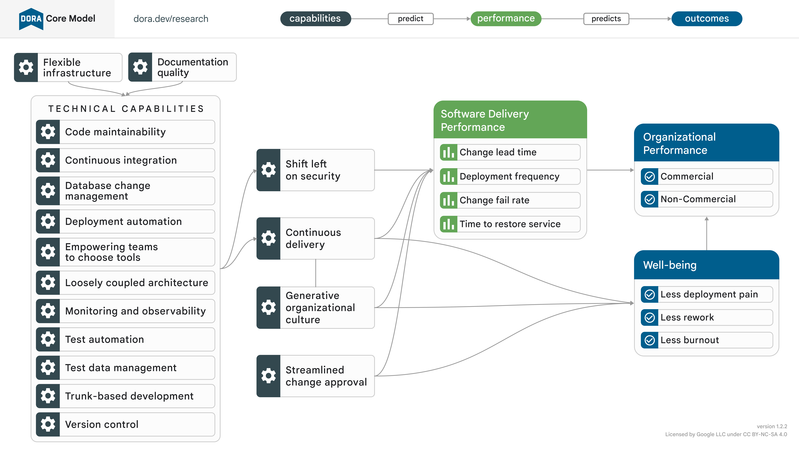

## DORA Core 模型

[下载 PDF 版](dora-core-model-v1.2.2.pdf)

关于这个模型：DORA Core是DORA研究计划历史和广度的最牢固的发现的一系列能力、指标和结果的集合。核心是从DORA的持续研究中得出的，包括我们年度《加速DevOps状态报告》中提出的分析。核心旨在在从业者的背景中作为指南使用：它有意追随研究，更保守地发展。核心模型中显示的概念和关系已经在我们的研究中反复证明，并已成功被软件工程团队用于优先考虑持续改进。常见问题解答见下文。

## DORA Core 是什么？

DORA的研究项目是持续而不断的；每年都带来新的调查方向，每次分析都带来新的见解。在前沿领域，新概念经常被引入，而文献（尤其是DevOps状态加速报告）的不断发布，揭示新的见解和动态。随着每项研究，一些先前的发现得到强化，而其他一些可能受到质疑。这是良好科学的标志：任何新发现都应该被视为可疑的——引人入胜，但可疑——直到通过复制和应用得到验证。与此同时，鼓励从业者将研究应用于自己的专业背景中。在这种背景下，跟上DORA的最新发展可能是具有挑战性的：在大型组织中进行文化转型需要稳健的手段，要在跨越多年的时间段内持续进行。试图更新实践以匹配研究的速度可能导致逆生产的变动。在这些情境中，更实际的做法是依赖于“常青”文献。DORA Core代表了DORA最基础的发现的精髓：研究一再展现的指标、能力和结果。它使团队能够更精确地将改进努力集中在可能为其组织目标和生活质量产生有形利益的方面。

## 核心包含哪些概念？

DORA Core涵盖了DORA长期研究并得到良好支持的概念集。这些概念包括连续交付和生成性组织文化等能力，以及“四个关键”指标等指标，以及组织绩效等结果。这些已建立的思想与研究中表现出有希望但（尚未）得到DORA预测模型支持的领域或不同的预测路径形成对比。如果一个概念符合以下条件之一，则可以考虑纳入核心：

* a)已研究至少两次；
* b)从业者发现它有价值；
* c)继续探索是有必要的。

这个标准是有意主观的：它在很大程度上依赖于数据和分析，但最终是由直觉引导的。因此，请贡献出你的观点！您的直觉是宝贵的；如果您觉得某事没有准确反映研究，请告诉我们。

## 核心会变吗？

会！研究的应用比研究本身更稳定。但它并非静止不动。核心会随着时间的推移而发展，我们目前正在调查的事物将来一旦确立，就会“毕业”进入核心。纳入核心需要一定的支持阈值；同样，如果收集到足够的证据来支持核心中的某个部分的移除或修改，它将被弃用。核心是由研究启发并随研究演变的——但速度较慢。

## 什么是核心模型？

DORA核心模型是DORA自成立以来一直在开发的预测框架的视觉总结。它借鉴了多年来开发的所有结构方程模型（SEMs），以突出最受支持的实体和预测路径。鼓励从业者研究模型并将其用于指导他们的持续改进之旅。

## 所有研究年份都被平等对待吗？

不是。一些发现被证明非常耐久，年复一年地复制。但是，当研究动态背景时，其他发现已经发生了变化。此外，每年我们都会增加或减少研究领域。我们的目标是在多年内创造出一些持久的东西，同时在我们继续学习的过程中发展。为此，比起较旧的研究，最近的研究权重更大。这就是为什么，例如，“安全向左移”与技术能力分开的原因，它反映了从2021年和2022年的研究中显示出安全实践对软件交付性能的独特影响的发现。

扩展阅读：感兴趣下载中文版本的研究报告，可以在这里下载[https://www.devopschina.org/sdm_downloads/](https://www.devopschina.org/sdm_downloads/)