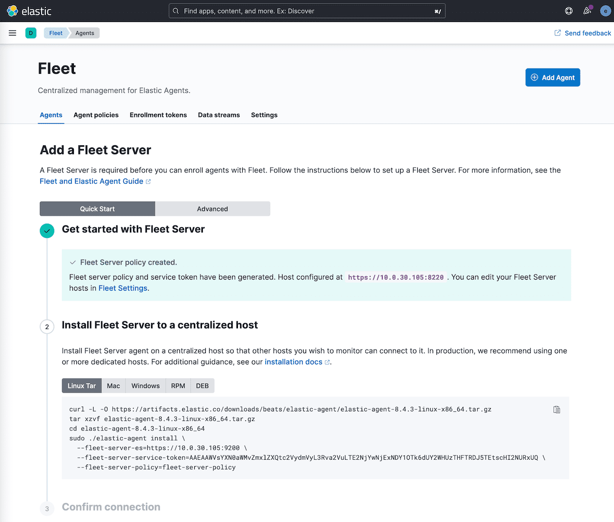
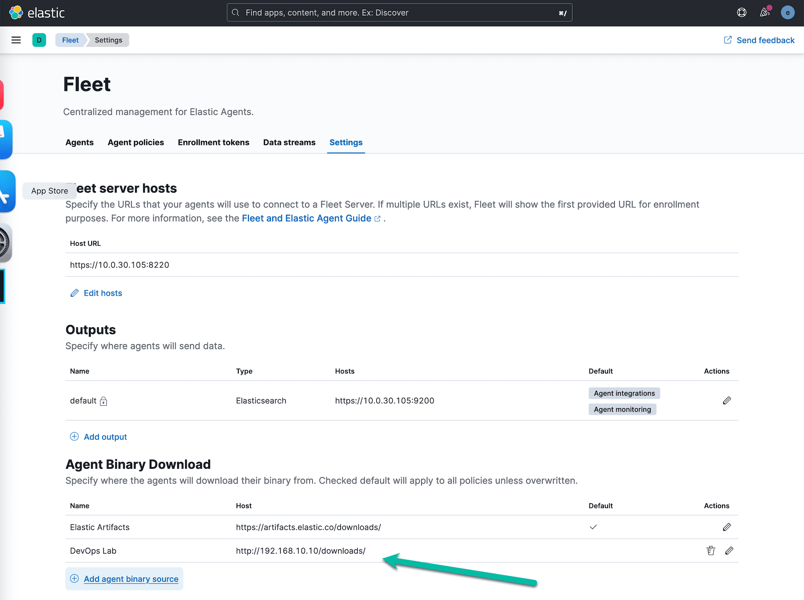
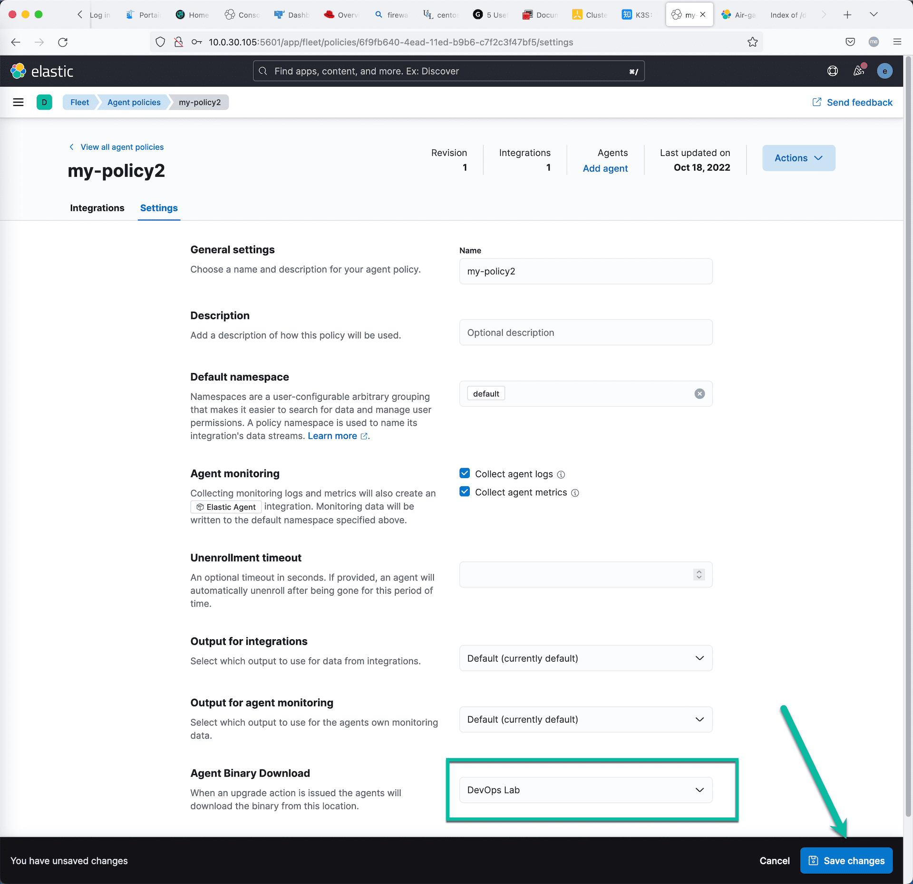
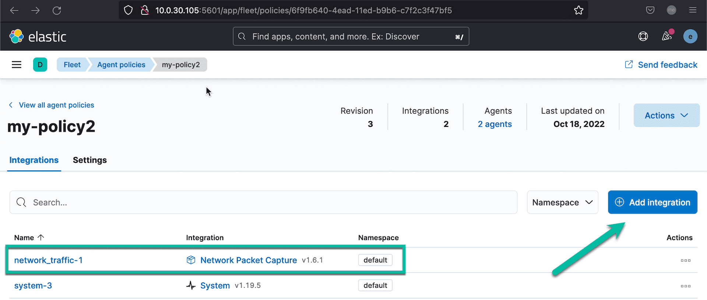
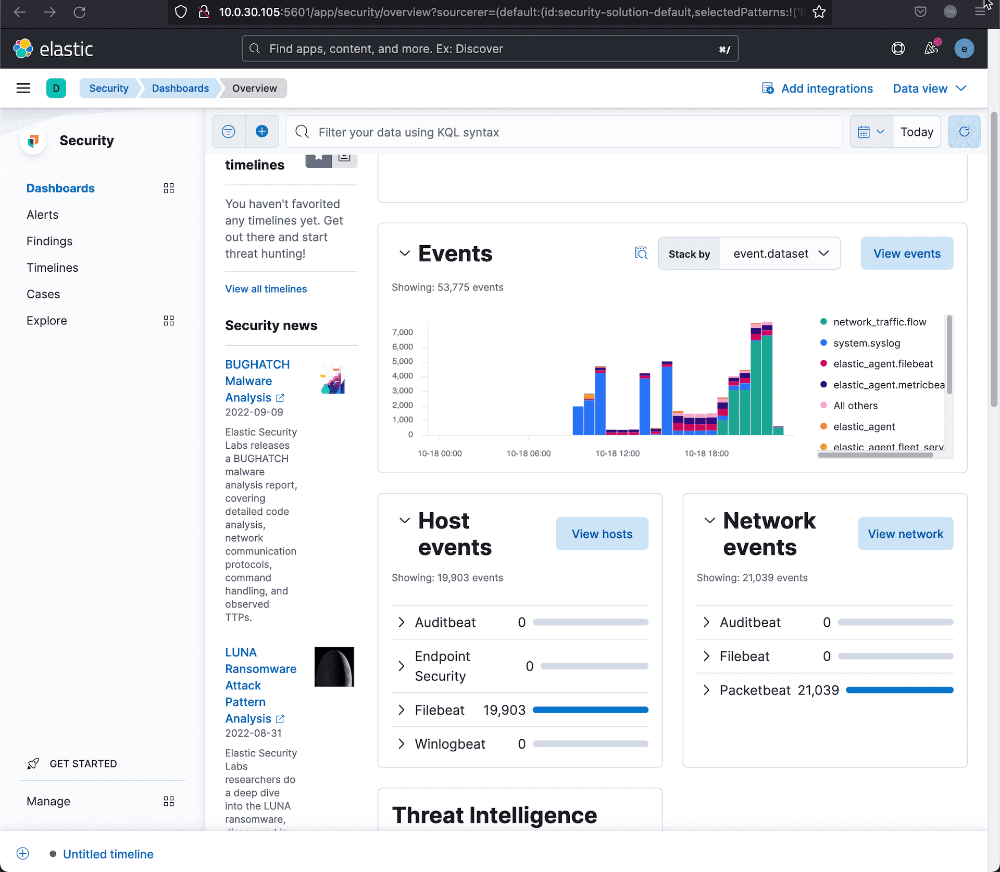

测试过程和环境概述：

* 用一个 RHEL 9 虚拟机安装 Elasticsearch 和 Kibana；然后部署 Fleet 服务器。
* 在另外一个虚拟机安装 Elastic Agent，初始化注册到 Fleet 服务器，然后更新对它的管理策略。
* 在 Kibana 的可观测性和安全解决方案中观察采集到的数据。


## 安装 Elasticsearch

下载 Elasticsearch 的 rpm 安装包，用 rpm 的方式安装 Elasticssearch 服务器。 `dnf install elasticsearch-8.4.3-x86_64.rpm `

```sh
[root@elk8 ~]# dnf install elasticsearch-8.4.3-x86_64.rpm 
Updating Subscription Management repositories.
Red Hat Enterprise Linux 9 for x86_64 - BaseOS (RPMs)                                        3.9 kB/s | 4.1 kB     00:01    
Red Hat Enterprise Linux 9 for x86_64 - AppStream (RPMs)                                     3.9 kB/s | 4.1 kB     00:01    
Dependencies resolved.
=============================================================================================================================
 Package                          Architecture              Version                    Repository                       Size
=============================================================================================================================
Installing:
 elasticsearch                    x86_64                    8.4.3-1                    @commandline                    540 M

Transaction Summary
=============================================================================================================================
Install  1 Package

Total size: 540 M
Installed size: 1.1 G
Is this ok [y/N]: y
Downloading Packages:
Running transaction check
Transaction check succeeded.
Running transaction test
Transaction test succeeded.
Running transaction
  Preparing        :                                                                                                     1/1 
  Running scriptlet: elasticsearch-8.4.3-1.x86_64                                                                        1/1 
Creating elasticsearch group... OK
Creating elasticsearch user... OK

  Installing       : elasticsearch-8.4.3-1.x86_64                                                                        1/1 
  Running scriptlet: elasticsearch-8.4.3-1.x86_64                                                                        1/1 
--------------------------- Security autoconfiguration information ------------------------------

Authentication and authorization are enabled.
TLS for the transport and HTTP layers is enabled and configured.

The generated password for the elastic built-in superuser is : guJrLagKN5bsmUh72bha

If this node should join an existing cluster, you can reconfigure this with
'/usr/share/elasticsearch/bin/elasticsearch-reconfigure-node --enrollment-token <token-here>'
after creating an enrollment token on your existing cluster.

You can complete the following actions at any time:

Reset the password of the elastic built-in superuser with 
'/usr/share/elasticsearch/bin/elasticsearch-reset-password -u elastic'.

Generate an enrollment token for Kibana instances with 
 '/usr/share/elasticsearch/bin/elasticsearch-create-enrollment-token -s kibana'.

Generate an enrollment token for Elasticsearch nodes with 
'/usr/share/elasticsearch/bin/elasticsearch-create-enrollment-token -s node'.

-------------------------------------------------------------------------------------------------
### NOT starting on installation, please execute the following statements to configure elasticsearch service to start automatically using systemd
 sudo systemctl daemon-reload
 sudo systemctl enable elasticsearch.service
### You can start elasticsearch service by executing
 sudo systemctl start elasticsearch.service

/usr/lib/tmpfiles.d/elasticsearch.conf:1: Line references path below legacy directory /var/run/, updating /var/run/elasticsearch → /run/elasticsearch; please update the tmpfiles.d/ drop-in file accordingly.

  Verifying        : elasticsearch-8.4.3-1.x86_64                                                                        1/1 
Installed products updated.

Installed:
  elasticsearch-8.4.3-1.x86_64                                                                                               

Complete!
[root@elk8 ~]# 


```

安装完毕之后，用 vi 编辑器打开 `/etc/elasticsearch/elasticsearch.yml` 配置文件 ； 在这个默认配置文件中寻找类似这样的一行 `cluster.initial_master_nodes: ["elk8"]` ；将这一行注释掉。

然后在此配置文件的最下面增加下面这几行。

```yaml
cluster.name: homelab-elk8
discovery.type: single-node
network.host: 0.0.0.0
xpack.security.authc.api_key.enabled: true
```

启动 Elasticsearch 服务，并查看服务的状态。

```shell
sudo systemctl daemon-reload
sudo systemctl enable elasticsearch.service
sudo systemctl start elasticsearch.service
sudo systemctl status elasticsearch
```
在使用 ES 前，可以先修改ES服务初始化的内建用户密码，改成自己好记的安全可控密码。否则需要到 ES 的启动日志里寻找系统自动生产的管理员密码。

运行 `/usr/share/elasticsearch/bin/elasticsearch-reset-password -u elastic -i` 命令修改 ES 的管理员账号 elastic 的密码。

```shell
[root@elk8 ~]# /usr/share/elasticsearch/bin/elasticsearch-reset-password -u elastic -i
This tool will reset the password of the [elastic] user.
You will be prompted to enter the password.
Please confirm that you would like to continue [y/N]y


Enter password for [elastic]: 
Re-enter password for [elastic]: 
Password for the [elastic] user successfully reset.
```

在启动 ES 服务前，打开后续测试所需要的防火墙端口。

```shell
firewall-cmd --permanent --add-port=9200/tcp
firewall-cmd --permanent --add-port=5601/tcp
firewall-cmd --permanent --add-port=8220/tcp
firewall-cmd --reload
```

在浏览器里访问 es 的访问网址 https://10.0.30.105:9200/ ，忽略关于证书的安全提示，输入上面所修改的 elastic 账户信息，测试是否可以正常登录。

## 安装 Kibana

下载 Kibana 的 rpm 安装包到服务器，然后执行下面的安装命令

```shell
[root@elk8 ~]# dnf install kibana-8.4.3-x86_64.rpm 
Updating Subscription Management repositories.
Last metadata expiration check: 0:22:56 ago on Sun 16 Oct 2022 02:20:20 PM CST.
Dependencies resolved.
=======================================================================================================================================
 Package                       Architecture                  Version                         Repository                           Size
=======================================================================================================================================
Installing:
 kibana                        x86_64                        8.4.3-1                         @commandline                        274 M

Transaction Summary
=======================================================================================================================================
Install  1 Package

Total size: 274 M
Installed size: 649 M
Is this ok [y/N]: y
Downloading Packages:
Running transaction check
Transaction check succeeded.
Running transaction test
Transaction test succeeded.
Running transaction
  Preparing        :                                                                                                               1/1 
  Running scriptlet: kibana-8.4.3-1.x86_64                                                                                         1/1 
  Installing       : kibana-8.4.3-1.x86_64                                                                                         1/1 
  Running scriptlet: kibana-8.4.3-1.x86_64                                                                                         1/1 
Creating kibana group... OK
Creating kibana user... OK

Created Kibana keystore in /etc/kibana/kibana.keystore

/usr/lib/tmpfiles.d/elasticsearch.conf:1: Line references path below legacy directory /var/run/, updating /var/run/elasticsearch → /run/elasticsearch; please update the tmpfiles.d/ drop-in file accordingly.

  Verifying        : kibana-8.4.3-1.x86_64                                                                                         1/1 
Installed products updated.

Installed:
  kibana-8.4.3-1.x86_64                                                                                                                

Complete!

```

在启动 Kiban 服务器之前，先需要创建 Kibana 需要的各种加密 key ，执行下面的命令。

```shell
/usr/share/kibana/bin/kibana-encryption-keys generate

xpack.encryptedSavedObjects.encryptionKey: 2e71f1b16031c2b111b76276268dbf9e
xpack.reporting.encryptionKey: 84cb58b5e944fa9f65f73382384612a5
xpack.security.encryptionKey: c5ac5b306ee011838a67e2eaf4154dd0
```

记录以上三行配置参数，并增加2行新参数，将它们全部添加到 Kibana 默认的配置文件中。

```yaml
server.host:  0.0.0.0
server.publicBaseUrl: "http://10.0.30.105:5601"
xpack.encryptedSavedObjects.encryptionKey: 2e71f1b16031c2b111b76276268dbf9e
xpack.reporting.encryptionKey: 84cb58b5e944fa9f65f73382384612a5
xpack.security.encryptionKey: c5ac5b306ee011838a67e2eaf4154dd0
```
用 vi 打开 Kibana 的默认配置文件 `/etc/kibana/kibana.yml` ，将上面的 5 行配置参数添加到文件中。

在命令行执行  `systemctl enable --now kibana` 命令启动 Kibana 服务器.

然后执行命令 `tail -f /var/log/messages` ， 在日志中寻找 Kibana 服务启动的信息，等待出现 Kibana 配置的访问 URL。在日志中寻找类似这样的信息：

```json
Oct 18 10:36:48 elk8 kibana[2163]: i Kibana has not been configured.
Oct 18 10:36:48 elk8 kibana[2163]: Go to http://0.0.0.0:5601/?code=732948 to get started.
```

将 0.0.0.0 替换为这台虚拟机的 IP 地址，然后在浏览器中打开这个类似这个 `http://10.0.30.105:5601/?code=732948` 网址。网页中会出现一个大输入框，等待输入Kibana 注册秘钥。

在命令行执行 `/usr/share/elasticsearch/bin/elasticsearch-create-enrollment-token -s kibana` 命令，从而获取 Kibana 的注册令牌。

```shell
[root@elk8 ~]# /usr/share/elasticsearch/bin/elasticsearch-create-enrollment-token -s kibana
eyJ2ZXIiOiI4LjQuMyIsImFkciI6WyIxOTIuMTY4LjEwLjEwOjkyMDAiXSwiZmdyIjoiZTdlOTdlZWU2YWVlYjVmYTczZWM1YTVkNzBiNDJkZGUzZjlkZmNjMDJhNTVmZDcwZjAxOTQwZmExNzE5YWM2MSIsImtleSI6IjNHLVEzNE1CYnA4c3p4TEZEZXpCOk0wUDMzRC1VVFAyT0ZxQVFBekNKSWcifQ==
```

将这个 Token 复制到网页里，完成Kibana 的初始化配置，最后用 es 的管理员账号登录 Kibana。

从 kiban 目录中找到 es 的根 ca 证书，将其安装在系统的默认根证书目录中。查看 Kibana 的配置文件找到类似这样的一行配置信息。

```sh
elasticsearch.ssl.certificateAuthorities: [/var/lib/kibana/ca_1666060779947.crt]
```

运行下面的命令安装这个根证书。

```sh
update-ca-trust enable
cp /var/lib/kibana/ca_1666060779947.crt  /etc/pki/ca-trust/source/anchors/
update-ca-trust extract
```

建议将这个根证书也用这个方法复制到其他需要用 Elastic Agent 采集监控数据的操作系统中，并安装备用。也可以在 Elastic Agent 安装的时候指定忽略 ES 证书校验的参数。

## 安装 Fleet 服务器


在 Kibana 的菜单中找到， Fleet 选项，点击 Settings，然后点击 Edit Hosts ，选择增加 Fleet server 配置信息，输入 `https://10.0.30.105:8220` ，注意这里必须是 https协议。

回到 Fleet 主页，找到 agent 管理的地方，按照流程做，点击创建 Fleet  Server 配置。然后就会在页面上生成 Fleet 服务器的安装配置命令。



按着提示的命令参数安装 Fleet 服务器。

```shell
curl -L -O https://artifacts.elastic.co/downloads/beats/elastic-agent/elastic-agent-8.4.3-linux-x86_64.tar.gz
tar xzvf elastic-agent-8.4.3-linux-x86_64.tar.gz
cd elastic-agent-8.4.3-linux-x86_64
sudo ./elastic-agent install \
  --fleet-server-es=https://192.168.10.10:9200 \
  --fleet-server-service-token=AAEAAWVsYXN0aWMvZmxlZXQtc2VydmVyL3Rva2VuLTE2NjU5MTM3ODg1NTA6aWdrR1pvNk9SWmk5N09tV3pUQktTUQ \
  --fleet-server-policy=fleet-server-policy
  --insecure
```

上面是连续四条安装命令，需要在最后一条命中，增加一个参数 `--insecure` ；这样可以确保 Fleet 服务器的正常配置。

在 Fleet 服务器正常启动以后，上面创建 Fleet 服务器配置的网页上的最后一步就会显示：Fleet 服务器已经连接正常，等待注册 Elastic Agent 。这样表明 Fleet 服务器已经安装正常，并且运行在默认的代理配置采集策略下。

可以在 Kibana 的界面里查看 Fleet 服务器的监控信息。点击 Kibana 左上角的菜单：Observability ->      Infrastructure  ->   Inventory ，即可看到 Fleet 服务器的监控数据。


## 安装 Elastic Agent 监控代理

在 Fleet 的管理界面中新增一个名为 my-policy1 的管理策略，避免和 Fleet 服务器使用相同的策略。点击 Add agent 连接，获取如下代理注册命令。

```sh
curl -L -O https://artifacts.elastic.co/downloads/beats/elastic-agent/elastic-agent-8.4.3-linux-x86_64.tar.gz 
tar xzvf elastic-agent-8.4.3-linux-x86_64.tar.gz 
cd elastic-agent-8.4.3-linux-x86_64 
sudo ./elastic-agent install --url=https://10.0.30.105:8220 --enrollment-token=NW9ZTjZZTUJtUENhc0ZFTDI5SV86MkZQT1hlc2dUOEdWZnRrWWhNbXVjdw==  
```

将上面的命令复制到一个写字板中，修改最后一条命令，在最后增加` --insecure ` 参数 

```sh
./elastic-agent install --url=https://10.0.30.105:8220 --enrollment-token=NW9ZTjZZTUJtUENhc0ZFTDI5SV86MkZQT1hlc2dUOEdWZnRrWWhNbXVjdw==   --insecure
```
通过执行上面的命令，我们就在被管理服务器上，一键式的安装了用于数据采集功能的 Elastic Agent ，并将其注册到 Fleet 服务器上。你也可以手工下载好 `elastic-agent-8.4.3-linux-x86_64.tar.gz ` 文件，但是反复在多个被管理服务器上复制也很麻烦。

## 搭建本地安装包下载服务器

为了让局域网中的操作系统能就近下载 Elastic Stack 技术栈中，所有可以通过 Fleet 服务器管理（安装、配置、升级、删除等）的组件，我们可以参考文档的方法：https://www.elastic.co/guide/en/fleet/8.4/air-gapped.html#host-artifact-registry 在本地部署一个安装包下载服务器。

首先，安装一个 Nginx 服务器，在根目录下创建目录 downloads ，并且运行下面的下载脚本。

```shell
curl -O https://artifacts.elastic.co/downloads/apm-server/apm-server-8.4.3-linux-x86_64.tar.gz
curl -O https://artifacts.elastic.co/downloads/apm-server/apm-server-8.4.3-linux-x86_64.tar.gz.sha512
curl -O https://artifacts.elastic.co/downloads/apm-server/apm-server-8.4.3-linux-x86_64.tar.gz.asc
curl -O https://artifacts.elastic.co/downloads/beats/auditbeat/auditbeat-8.4.3-linux-x86_64.tar.gz
curl -O https://artifacts.elastic.co/downloads/beats/auditbeat/auditbeat-8.4.3-linux-x86_64.tar.gz.sha512
curl -O https://artifacts.elastic.co/downloads/beats/auditbeat/auditbeat-8.4.3-linux-x86_64.tar.gz.asc
curl -O https://artifacts.elastic.co/downloads/beats/elastic-agent/elastic-agent-8.4.3-linux-x86_64.tar.gz
curl -O https://artifacts.elastic.co/downloads/beats/elastic-agent/elastic-agent-8.4.3-linux-x86_64.tar.gz.sha512
curl -O https://artifacts.elastic.co/downloads/beats/elastic-agent/elastic-agent-8.4.3-linux-x86_64.tar.gz.asc
curl -O https://artifacts.elastic.co/downloads/beats/filebeat/filebeat-8.4.3-linux-x86_64.tar.gz
curl -O https://artifacts.elastic.co/downloads/beats/filebeat/filebeat-8.4.3-linux-x86_64.tar.gz.sha512
curl -O https://artifacts.elastic.co/downloads/beats/filebeat/filebeat-8.4.3-linux-x86_64.tar.gz.asc
curl -O https://artifacts.elastic.co/downloads/beats/heartbeat/heartbeat-8.4.3-linux-x86_64.tar.gz
curl -O https://artifacts.elastic.co/downloads/beats/heartbeat/heartbeat-8.4.3-linux-x86_64.tar.gz.sha512
curl -O https://artifacts.elastic.co/downloads/beats/heartbeat/heartbeat-8.4.3-linux-x86_64.tar.gz.asc
curl -O https://artifacts.elastic.co/downloads/beats/metricbeat/metricbeat-8.4.3-linux-x86_64.tar.gz
curl -O https://artifacts.elastic.co/downloads/beats/metricbeat/metricbeat-8.4.3-linux-x86_64.tar.gz.sha512
curl -O https://artifacts.elastic.co/downloads/beats/metricbeat/metricbeat-8.4.3-linux-x86_64.tar.gz.asc
curl -O https://artifacts.elastic.co/downloads/beats/osquerybeat/osquerybeat-8.4.3-linux-x86_64.tar.gz
curl -O https://artifacts.elastic.co/downloads/beats/osquerybeat/osquerybeat-8.4.3-linux-x86_64.tar.gz.sha512
curl -O https://artifacts.elastic.co/downloads/beats/osquerybeat/osquerybeat-8.4.3-linux-x86_64.tar.gz.asc
curl -O https://artifacts.elastic.co/downloads/beats/packetbeat/packetbeat-8.4.3-linux-x86_64.tar.gz
curl -O https://artifacts.elastic.co/downloads/beats/packetbeat/packetbeat-8.4.3-linux-x86_64.tar.gz.sha512
curl -O https://artifacts.elastic.co/downloads/beats/packetbeat/packetbeat-8.4.3-linux-x86_64.tar.gz.asc
curl -O https://artifacts.elastic.co/downloads/cloudbeat/cloudbeat-8.4.3-linux-x86_64.tar.gz
curl -O https://artifacts.elastic.co/downloads/cloudbeat/cloudbeat-8.4.3-linux-x86_64.tar.gz.sha512
curl -O https://artifacts.elastic.co/downloads/cloudbeat/cloudbeat-8.4.3-linux-x86_64.tar.gz.asc
curl -O https://artifacts.elastic.co/downloads/endpoint-dev/endpoint-security-8.4.3-linux-x86_64.tar.gz
curl -O https://artifacts.elastic.co/downloads/endpoint-dev/endpoint-security-8.4.3-linux-x86_64.tar.gz.sha512
curl -O https://artifacts.elastic.co/downloads/endpoint-dev/endpoint-security-8.4.3-linux-x86_64.tar.gz.asc
curl -O https://artifacts.elastic.co/downloads/fleet-server/fleet-server-8.4.3-linux-x86_64.tar.gz
curl -O https://artifacts.elastic.co/downloads/fleet-server/fleet-server-8.4.3-linux-x86_64.tar.gz.sha512
curl -O https://artifacts.elastic.co/downloads/fleet-server/fleet-server-8.4.3-linux-x86_64.tar.gz.asc
```

将下载后的目录结构整理的和下载路径一致，目录结构如下所示：

```shell
[root@elk8 html]# tree downloads/
downloads/
├── apm-server
│   ├── apm-server-8.4.3-linux-x86_64.tar.gz
│   ├── apm-server-8.4.3-linux-x86_64.tar.gz.asc
│   └── apm-server-8.4.3-linux-x86_64.tar.gz.sha512
├── beats
│   ├── auditbeat
│   │   ├── auditbeat-8.4.3-linux-x86_64.tar.gz
│   │   ├── auditbeat-8.4.3-linux-x86_64.tar.gz.asc
│   │   └── auditbeat-8.4.3-linux-x86_64.tar.gz.sha512
│   ├── elastic-agent
│   │   ├── elastic-agent-8.4.3-linux-x86_64.tar.gz
│   │   ├── elastic-agent-8.4.3-linux-x86_64.tar.gz.asc
│   │   └── elastic-agent-8.4.3-linux-x86_64.tar.gz.sha512
│   ├── filebeat
│   │   ├── filebeat-8.4.3-linux-x86_64.tar.gz
│   │   ├── filebeat-8.4.3-linux-x86_64.tar.gz.asc
│   │   └── filebeat-8.4.3-linux-x86_64.tar.gz.sha512
│   ├── heartbeat
│   │   ├── heartbeat-8.4.3-linux-x86_64.tar.gz
│   │   ├── heartbeat-8.4.3-linux-x86_64.tar.gz.asc
│   │   └── heartbeat-8.4.3-linux-x86_64.tar.gz.sha512
│   ├── metricbeat
│   │   ├── metricbeat-8.4.3-linux-x86_64.tar.gz
│   │   ├── metricbeat-8.4.3-linux-x86_64.tar.gz.asc
│   │   └── metricbeat-8.4.3-linux-x86_64.tar.gz.sha512
│   ├── osquerybeat
│   │   ├── osquerybeat-8.4.3-linux-x86_64.tar.gz
│   │   ├── osquerybeat-8.4.3-linux-x86_64.tar.gz.asc
│   │   └── osquerybeat-8.4.3-linux-x86_64.tar.gz.sha512
│   └── packetbeat
│       ├── packetbeat-8.4.3-linux-x86_64.tar.gz
│       ├── packetbeat-8.4.3-linux-x86_64.tar.gz.asc
│       └── packetbeat-8.4.3-linux-x86_64.tar.gz.sha512
├── cloudbeat
│   ├── cloudbeat-8.4.3-linux-x86_64.tar.gz
│   ├── cloudbeat-8.4.3-linux-x86_64.tar.gz.asc
│   └── cloudbeat-8.4.3-linux-x86_64.tar.gz.sha512
├── endpoint-dev
│   ├── endpoint-security-8.4.3-linux-x86_64.tar.gz
│   ├── endpoint-security-8.4.3-linux-x86_64.tar.gz.asc
│   └── endpoint-security-8.4.3-linux-x86_64.tar.gz.sha512
├── fleet-server
│   ├── fleet-server-8.4.3-linux-x86_64.tar.gz
│   ├── fleet-server-8.4.3-linux-x86_64.tar.gz.asc
│   └── fleet-server-8.4.3-linux-x86_64.tar.gz.sha512
└── pull-bin.sh

12 directories, 34 files
[root@elk8 html]# 
```

为了方便查看这个目录的内容，修改 nginx 的默认配置文件，在 http 这个部分增加下面三个参数：

```yml
    autoindex on; 
    autoindex_exact_size off;
    autoindex_localtime on; 
```
重启 Nginix 服务器后，在浏览器中可以访问： http://192.168.10.10/downloads/ ，确保可以看到正确的目录结构和文件。

进入 Fleet 的配置页面，在  `Agent Binary Download` 下面点击 “Add agent binary source” ，新建一个新的代理安装包下载来源网站。



在 Agent Policies 页面新建一个新的测试用 Agent 管理策略，名为 “my-policy2”；进入这个策略的配置界面，修改 *Agent Binary Download* 为刚才创建的下载源。保存并测试这个策略。



点击 “Add agent” 连接，获取下面的新注册代理注册命令。

```sh
curl -L -O https://artifacts.elastic.co/downloads/beats/elastic-agent/elastic-agent-8.4.3-linux-x86_64.tar.gz tar xzvf elastic-agent-8.4.3-linux-x86_64.tar.gz cd elastic-agent-8.4.3-linux-x86_64 sudo ./elastic-agent install --url=https://10.0.30.105:8220 --enrollment-token=R29qRDZZTUJtUENhc0ZFTFNDSW06bVFOeW5vcUpTQmFmZDBwLUgyTDBYZw==
```

修改这些命令参数，如下：

```shell
curl -L -O http://192.168.10.10/downloads/beats/elastic-agent/elastic-agent-8.4.3-linux-x86_64.tar.gz 
tar xzvf elastic-agent-8.4.3-linux-x86_64.tar.gz 
cd elastic-agent-8.4.3-linux-x86_64 
sudo ./elastic-agent install --url=https://10.0.30.105:8220 --enrollment-token=R29qRDZZTUJtUENhc0ZFTFNDSW06bVFOeW5vcUpTQmFmZDBwLUgyTDBYZw==  --insecure
```

SSH 登录到另外一个虚拟机，用新创建的 Agent 管理策略，一键式安装 Elastic Agent 并注册到 Fleet 服务器。由于这个策略使用了本地的安装包（默认会使用到 Filebeat 和 Metricbeat），所以它的部署速度应该会比较快。

在 Elastic Agent 的日志文件中应该可以看到类似这样的信息。

```sh
cat /opt/Elastic/Agent/elastic-agent-20221018.ndjson

```json
{"log.level":"info","@timestamp":"2022-10-18T14:37:26.697+0800","log.origin":{"file.name":"artifact/config.go","file.line":138},"message":"Source URI changed from \"https://artifacts.elastic.co/downloads/\" to \"http://192.168.10.10/downloads/\"","ecs.version":"1.6.0"}
```

这个信息表示：当前的 Agent 会使用上面自建的安装包下载源服务器。

用这个命令 `elastic-agent inspect` 也可以确认这个配置。

## 万用采集端的好处

在上一篇文章中已经说过了这个问题，这里不赘述。

为了验证这个功能，可以尝试更新当前的一个 policy，增加 Packetbeat 数据采集能力。操作步骤如下：

1. 打开当前的一个正在使用中 policy
2. 点击 Add intergation 按钮，在众多选项中选择 Network Packet Capture 模块。
3. 增加新的采集模块后，保存这个策略。
4. 它更新了版本，观察 Fleet 界面上所有使用这个策略的节点的状态变化。
5. 这些节点会自动的，很快的更新到新的管理策略中，Elastic Agent 会自动化安装 Packetbeat 采集模块。
6. 返回 Kiban ，进入安全管理解决方案，我们可以看到 Filebeat 和 Packetbeat 的采集结果。



在策略更新了以后，我们没有在 Elastic Agent 端做任何操作，它就已经自动化的下载新的策略，并更新了自身。




## 常见问题

Elastic Agent 在采集数据的服务上安装正常，在 Fleet 服务器的管理界面中也可以看到其状态正常。但是在可观测性的页面中看不到它的任何数据。

可能的原因：Elastic Agent 采集端程序和 ES 后台服务器的通讯不正常，检查 9200 端口，用 curl + ES 服务器端的数字证书，用户名和密码，尝试访问 ES 的服务地址 `https://192.168.10.10:9200`。

也可以尝试在 Fleet 的管理页面上删除这个 Agent；然后在被管理服务器上，用命令 `elastic-agent uninstall` 删除服务，然后重新安装注册这个被管理服务器，注意在注册命令的最后面可以尝试增加这两个参数：`
--insecure --fleet-server-es-insecure` 第一个参数是忽略 Fleet 服务器的 ssl 证书校验，第二个参数是忽略 es 服务器的 ssl 证书校验。或者尝试重新手工安装一遍 es 服务器上的 ca 根证书。


Feature picture ❤️ Brett Sayles图片: https://www.pexels.com/zh-cn/photo/2881224/