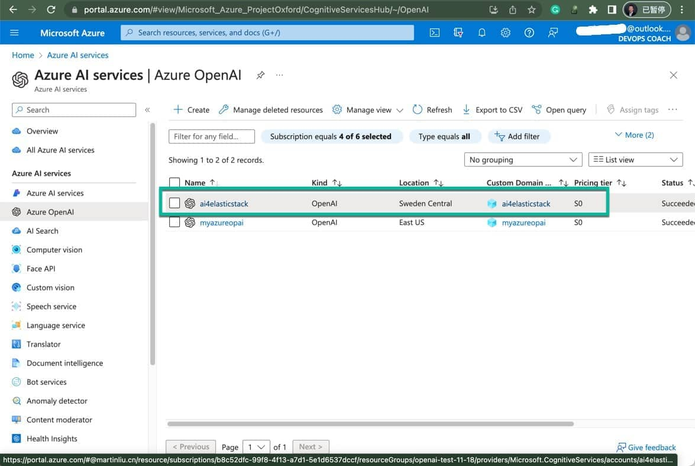
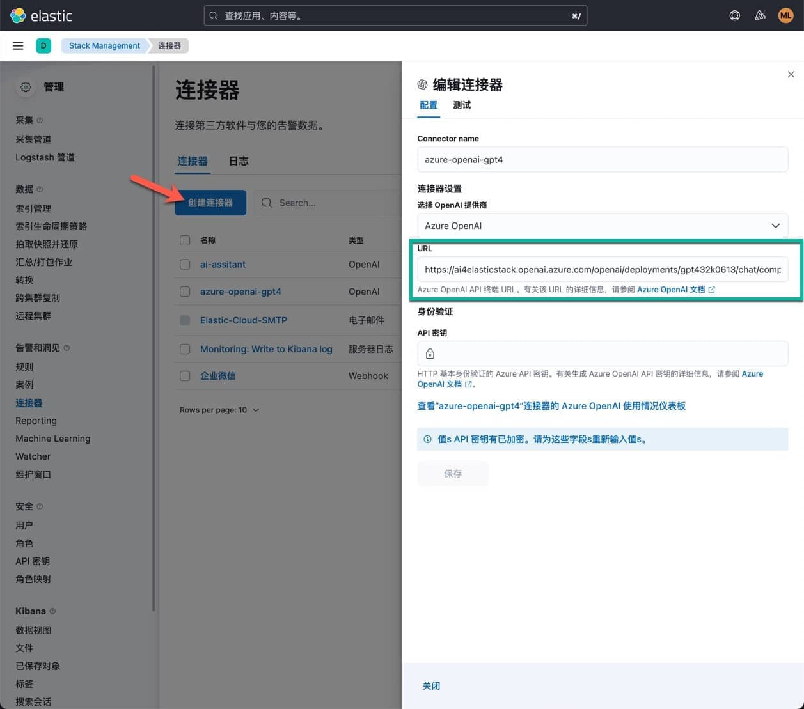

在最近的 ElasticON 大会上，Elastic 可观测性的 AI Assistant 得到了充分曝光。在 Keynote 中，还专门做了一个演示，展示了 AI Assistant 的功能，以及如何使用 AI Assistant 来解决问题。

我最近好在学习微软的 Azure OpenAI 服务，在我的 Azure 环境中，已经创建了一个 OpenAI 服务，可以用于AI Assistant 的测试。因此，我就想看看 Elastic 的 AI Assistant 和 Azure 的 OpenAI 服务结合起来的效果如何。


## Elastic 可观测性的 AI Assistant

它有两个使用方式：

1. Contextual insights ： 在可观测性 APP 的界面中，在很多特定的位置，都可以点击右上角的 AI Assistant 链接，然后进入当前界面的上下文分析，在日志和 APM 中都已经做了集成。此功能的目标是：帮你理解错误日志和指标信息，并尽可能的给你一定的解释和建议。
   1. Universal Profiling - 解释了运行的应用里最昂贵的库和函数，并提供优化建议。
   2. 应用性能监控（APM） - 解释了APM错误并提供纠正建议。
   3. 基础设施可观测性 （Infrastructure observability）- 解释了在主机上运行的进程。
   4. 日志 （log）- 解释了日志消息并生成搜索模式以查找类似问题。
   5. 告警 （alerting） - 为日志速率变化提供可能的原因和纠正建议。
2. Chat 聊天会话 ： 以可观测性数据为基础，你可以请求机器人为你汇总、分析、和可视化数据。从而得到你想要的结果，可能是为了制作某个报表，也可以能是开始探索分析某个性能问题。

运行这个功能的前提条件：

* Elastic Stack version 8.9 或者更高
* 拥有  Elastic Enterprise 订阅
* 一个 AI 服务方的账号，比如 Azure OpenAI gpt-4(0613) 或 gpt-4-32k(0613) 服务， 或者 OpenAI gpt-4 服务
* 为了使用私域文档作为知识库，还需要一个至少 4GB 的机器学习节点。

## 准备 Azure OpenAI 服务

首先，你需要在 Azure 的 Portal 中创建一个 OpenAI 服务，这个服务提供 OpenAI GPT-4 模型，我创建的服务名称是 `ai4elasticstack`。



这里确保选择 Azure OpenAI 的服务所在区域里能提供 gpt-4 模型，比如我选择的是瑞士中部。

然后，是在这个区域中部署所需要的模型。


这里我部署了 gpt-4-32k 模型，需要注意的是：token 的限速需要调整到最大，这样才能保证 AI Assistant 的正常使用。

## 创建 AI Assistant 的连接器

在 Elastic Cloud 中，创建一个 AI Assistant 所需要使用到的连接器，这个连接器的类型是 Azure OpenAI，然后，填写 Azure OpenAI 服务的相关信息，如下图所示。



URL 是一个重要的参数，它的格式如下：

```
https://{your-resource-name}.openai.azure.com/openai/deployments/{deployment-id}/completions?api-version={api-version}
```

其中，`{your-resource-name}` 是你创建的 Azure OpenAI 服务的名称，`{deployment-id}` 是你创建的 Azure OpenAI 服务的部署 ID（即名称），`{api-version}` 是你创建的 Azure OpenAI 服务的 API 版本。这里的 `{deployment-id}` 与 `{api-version}` 有一定的排列组合，某些组合是不工作的，我当前的选择是可以工作：`gpt4（32k 0613 版本） 和 2023-07-01-preview`

```
https://ai4elasticstack.openai.azure.com/openai/deployments/gpt432k0613/chat/completions?api-version=2023-07-01-preview
```

这里配置完 URL 和 API 秘钥之后，点击“测试”页面，如果一切正常，你会看到一个绿色的正常调用 OpenAI 的返回。这样你的 AI Assistant 就可以正常工作了。

## 理解日志中的错误

进入可观测性 app，点击 Stream，在这里选中一条报错的日志，内容如下：

```
16:23:13.729 
elastic_agent.metricbeat
[elastic_agent.metricbeat][error] Error fetching data for metricset docker.memory: No memory stats data available
```

点击 `view detail`，查看这条日志的详细信息。


AI Assistant 会自动分析这条日志，然后给出两个选项。

1. 点击“What's this message?”, AI Assistant 会给出这条日志的解释，以及可能的原因。这个 host 上由于 Docker 服务没有启动，导致 Metricbeat 无法获取到 Docker 的内存信息。AI Assistant 首先对这条日志，做了解释，解释内容里包含了你可能会关注的元数据信息，包括：版本号、操作系统、日志级别等。然后推测出是 Docker 服务没有启动的原因。最后，说明这是不正常的情况，应该尽快排查 Docker 服务。同一条错误信息，也可能会出现不同的解释。下面是整个 AI Assistant 的解释内容：

>The log entry you provided is from an Elastic Agent running on a host named "linux-dev-02" with the IP address "10.1.0.4". The host is running Ubuntu 22.04.3 LTS (Jammy Jellyfish) with kernel version 6.2.0-1017-azure. The Elastic Agent version is 8.10.4 and it's not a snapshot version. The agent is running on a cloud instance in the "eastasia" region of Azure.

>The component that generated this log entry is Metricbeat, which is a lightweight shipper that you can install on your servers to periodically collect metrics from the operating system and from services running on the server. The specific Metricbeat module in use here is the Docker module, which collects metrics and logs from Docker containers.

>The log level of the message is "error", which indicates that an error or problem has occurred. The specific error message is "Error fetching data for metricset docker.memory: No memory stats data available". This suggests that Metricbeat was unable to fetch memory statistics for a Docker container. This could be due to a number of reasons, such as the Docker container not being active, the Docker daemon not being accessible, or the Docker API not returning memory statistics.

>Whether this is expected or an issue depends on your specific setup and expectations. If you expect to be collecting memory statistics from Docker containers and this error is preventing that, then it would be an issue. If you're not using Docker or not interested in collecting memory statistics from Docker containers, then it might not be an issue. However, it's generally not expected for errors to be occurring, so it might be worth investigating further to understand why this error is happening.

2. 如果点击“How do i find similar log messages?” , AI Assistant 会给出一个 KQL 查询语句，使用这个查询语句会返回与这条日志相似的日志。这个查询语句的结果，可以帮助你更好的理解这条日志的上下文。
3. 链接器选择：你可以在 Elastic Stack 中，配置多个 AI Assistant 的连接器，可能对应到不同的 OpenAI 服务+版本的组合。

这个功能的好处：

* 通过 AI Assistant 的解释，它可以帮助你更全面的理解日志的内容本身，由于每个人并不是熟悉所有的技术领域，AI 在这里可以很好的补充你的知识短板。
* 在高压力的排错环境中，从模糊的日志事件内容中，很快的得出下一步排查的方向是比较有意义的。人脑很有可能在疲惫状态下，很难准确地得出下一个排查的动作。
* AI 对错误原因的推理，看着并不一定高明，但是作为排错的起点，还是比较有用的。你可以在这个基础上，点击界面上的 “Start Chat” 按钮，进入到 Chat 聊天会话功能模式，然后，继续与 AI 机器人对话，追问：“其他潜在的故障原因是那些？”；这样 AI 给我了另外不同的 4 种故障可能，涉及 Docker 服务器、配置、Metricbeat 的配置等等。可见 AI 在细分领域里的知识的深度还是一些的。

下面是我的追问和 AI 的回答，这里是支持中文：

“
You：还有什么可能的原因会导致这个问题？

Elastic Assistant ：这个错误信息表示 Metricbeat 无法获取 Docker 容器的内存统计信息。可能的原因包括：

1. Docker 容器未运行：如果你试图获取一个未运行或不存在的 Docker 容器的内存统计信息，将会出现这个错误。

2. Docker 守护进程无法访问：Metricbeat 需要能够访问 Docker 守护进程来获取容器的统计信息。如果由于某种原因（例如权限问题或网络问题）无法访问 Docker 守护进程，将会出现这个错误。

3. Docker API 未返回内存统计信息：Metricbeat 通过 Docker API 获取容器的统计信息。如果 Docker API 未返回内存统计信息，将会出现这个错误。这可能是因为 Docker API 的问题，或者是因为容器本身没有生成内存统计信息。

4. Metricbeat 配置问题：如果 Metricbeat 的 Docker 模块没有正确配置，可能也会导致这个问题。例如，如果 Metricbeat 没有正确配置 Docker 守护进程的地址，或者没有提供正确的证书来访问需要 TLS 的 Docker 守护进程，将会出现这个错误。

你可以根据这些可能的原因进行排查，看看哪一项可能是问题所在。
”

这个功能还在可观测性的其它功能模块中也做了深度的集成，例如在 APM 等模块中，也可以调用到 AI Assistant 的 “上下文洞见”；基本上，就是 Elastic Stack 在多个场景中，人类可用将自己分析错误信息的工作一定程度的交给 AI 去做；这样，我们就可以更加专注于问题的解决，而不是在监控数据、时序信息的分析上浪费更多的时间。从长远来看，这个上下文洞见的辅助排查功能，确实是有辅助驾驶和导航的意义，还是比较有用的。

## Chat 聊天会话功能

我测试了一个开放式的问题，希望 AI 能帮我分析出：我的服务器是否即将有磁盘空间用尽的情况发生。如下图所示：


下面解释一下 AI Assistant 的回答：

1. 我使用英语提问，其实你可以用任何语言提问，OpenAI 都可以正确理解。
2. 点击这里折叠隐藏的 7 个步骤，这些步骤是 AI Assistant 为了回答我的问题，所做的推理思考和处理过程。这里使用了多个方法调用，包括在 Elasticsearch 数据库中查找任何它想要的信息。 AI Assistant 的知识库【你可以将知识库配置在 Elasticsearch 中，AI 的分析流水线，读取并理解知识条目内容，并调用这些知识】，以及我的问题的上下文信息，AI Assistant 会根据这些信息，做出推理，然后给出回答。
3. 最终 AI 用绘图的方式给出主机的磁盘空间利用率的汇总情况，很可惜的是，它几乎就做对了；这个图形没有显示出来的原因是：在最后还应该调用一个 max 或者 avg 的运算函数。
4. 最后一句话，再次解释并总结了我的提问。

我并没有继续这个会话，如果继续问答下去的话，如果 AI Assistant 的聊天内容总是我所期望的正确的结果内容；那么，很可能我们就不需要去各种界面里到处点击、查看和分析各种数据图表和原始数据了。假如以后接入了自然语音的输入界面，那么，未来这种排错和分析场景还确实是一种比较科幻的感觉。

AI助手使用函数通过文本、数据和可视化组件在聊天对话中包含相关上下文。您和AI助手都可以提出函数建议。您还可以编辑AI助手的函数建议并检查函数响应。

以下表格列出了可用的函数：

* summarize ：总结对话的部分。

* recall ：回顾先前的学习。

* lens ：使用Lens创建自定义可视化，可以添加到仪表板中。

* elasticsearch ：代表您调用Elasticsearch API。

* kibana ：代表您调用Kibana API。

* alerts ：获取可观测性的警报。

* get_apm_timeseries ：显示任何服务或所有服务及其任何或所有依赖项的不同APM指标（如吞吐量、故障率或延迟）。既显示为时间序列，也显示为单一统计数据。此外，该函数返回任何更改，如峰值、步进和趋势更改或下降。您还可以使用它通过请求两个不同的时间范围，或者例如两个不同的服务版本来比较数据。

* get_apm_error_document ：根据分组名称获取示例错误文档。这还包括错误的堆栈跟踪，这可能提示错误的原因。

* get_apm_correlations ：获取在前景集中比背景集更突出的字段值。这对于确定哪些属性（例如error.message、service.node.name或transaction.name）对高延迟的贡献是有用的。另一个选项是基于时间的比较，您可以在更改点之前和之后进行比较。

* get_apm_downstream_dependencies ：获取服务的下游依赖项（服务或未被检测的后端）。通过返回span.destination.service.resource和service.name两者将下游依赖项名称映射到服务。如果需要，可以使用此功能进一步深入挖掘。

* get_apm_service_summary ： 获取单个服务的摘要，包括语言、服务版本、部署、环境以及它运行的基础设施。例如，pod的数量和它们的下游依赖项列表。它还返回活动警报和异常。

* get_apm_services_list ：获取受监控服务的列表，它们的健康状态和警报。

## 总结

由于时间有限，我并没有做知识库的导入，从文档中看到，知识库私域信息的注入基本上是这样的过程：首先将知识库文档整理后导入到 Elasticsearch 的一个索引中，然后使用结合 Elasticsearch 本身的 ELSER 自然语音处理能力和 OpenAI 的理解推理能力，来支撑 AI 辅助分析排查问题的过程。

以上功能测试的配置非常简单，在 Elastic Cloud 的环境中，参考本文，你应该在 10 分钟内就可以完成所有配置。从上下文分析和聊天的两个场景中，我们可以很快的找到 AI 辅助运维的感觉。

> 参考文章 ：
>
> * <https://www.elastic.co/guide/en/observability/current/obs-ai-assistant.html>
> * <https://www.youtube.com/watch?v=AQ4sPC_O2Ck&ab_channel=Elastic>
> * <https://www.elastic.co/blog/context-aware-insights-elastic-ai-assistant-observability>
> * <https://www.elastic.co/blog/whats-new-elastic-observability-8-9-0>
> * <https://www.elastic.co/blog/whats-new-elastic-observability-8-10-0>

Feature picture ❤️ cottonbro studio : <https://www.pexels.com/zh-cn/photo/6153354/>
