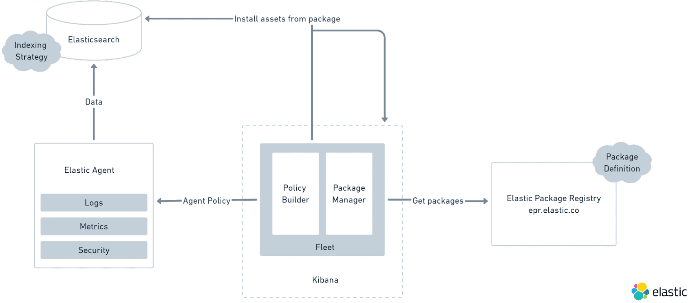

## 数据摄入的痛点

安装、升级和维护各种数据采集工具，包括 Filebeat、Metricbeat、APM 埋点、Logstash数据重整转发、端点安全控制，还有很多很多其它功能选项，貌似每增加一丁点功能，以前的数据采集项目又要重新再来一遍。

采集管理的配置文件不光只是 YAML 文件，越写越长的 YAML 文件渐渐将你带入了十八层地狱。

在每个端点上启用和配置不同采集模块行为参数，很多情况下，你不得不在大量采集点的命令行里执行配置命令。

不同采集模块在采集节点上都需要创建新的用户，不仅复杂化了操作系统用户的管理，还可能引入更多的风险。

自动化配置管理工具可以批量分发和部署这些数据摄入配置文件，但是你又不得不为此学习另外一种新的武功。

## 优化的方向

### 简化采集端部署

下面是 Elastic Agent 所实现的效果。减少采集不同类型数据的采集代理程序的种类，最好能只使用一个全功能的采集代理程序；有可能的话用一种万能的采集代理程序替代所有单点采集程序，诸如：Filebeat， Metricbeat， APM Agent， Heartbeat， Winlogbeat 等等各种 Elastic Stack 的采集程序。其他的这种类型的各个厂商和各种开源工具你可以自己联想。

尽量发挥万能型采集代理程序的特性，最好它能够一键式的安装，能支持上百种流行的开源软件、商业软件和云服务。

在采集代理程序开始正常工作以后，避免在端点的命令做任何配置工作。

以上的数据采集端点程序部署在大多数情况下，都是覆盖可观测性解决方案的需求；如果可能的话，能够兼顾信息安全管理需求是一种更高效的做法；如果能一石二鸟，那又何乐而不为呢。

### 直观的集中统一管理

使用一个统一的采集代理管理中间层 Fleet 掌控全局。在这里一站式的实现采集代理的配置分发、更新等变更；实现采集代理程序的持续版本升级；随着采集端点数量的蔓延，横向扩展 Fleet 层，用一个 Fleet 服务器对接分布在各地的数千个 Elastic Agent。

## ELK 数据摄入架构变迁

7.13 的 ELK 架构是持续了很久的传统模式，是社区里存在着大量描述文章，本文忽略对其的解释。

渐进式的架构变化是从 7.13 开始初具雏形的，Fleet 功能组件作为 Kibana 的内置功能，正式登场。

Kiban 的定位是作为 Elastic Stack 的数据探索窗口，和管理控制平面。统一管理 Elastic Agent 需要增加两个功能：策略管理器和配置包管理器。需要引入新的 Fleet 服务器实现下面的需求：

* 对 n 多采集点的更小暴露平面。
* 降低了 Kibana 服务器本身资源消耗和部署工作量。
* 更容易管理并发模式。

从 7.14 以后的架构图如下。这是以后的发展方向。

Fleet 服务器的代码和 Elastic Agent 是一套程序。它就像是一个万能工具一样。

它在对底层的采集端点上，实现的是全能型代理程序的管理。他在 Fleet 这个模式的主要功能是：从 Elasticsearch 后端或许最新版的 Agent 管理策略；相应采集端点上采集代理的管理策略拉取请求。管理策略的单向下发，采集数据的单向上传可以有几个选项，或者集中目标：

1. 自己部署管理的 Elasticsearch 集群
2. 自己部署管理的 Logstash 服务器
3. Elastic Cloud SaaS 服务里的 Elasticsearch 服务端点
4. Elastic Cloud SaaS 服务里的 Logstash 服务端点

Elastic Agent 采集端进程管理所有其他 Beats 进程，使用 GRPC 通讯协议发送数据，和下拉管理策略更新。

Elastic Agent 可以工作在被 Fleet 服务器统一管理的模式；也还可以运行在独立自管理状态，从而满足极端少量的特殊需求。

其他周边的重要组件：

1. Elastic Package Registry - 包含了 Elastic Stack 技术栈中所有组件的配置细节，包括安装、升级、更新和删除等等。用 zip 压缩包文件的方式分发。
2. Policy Builder - 在 Kibana 的界面里展现所有可以让用户掌控/修改定制的配置细节，用简单的开关按钮和输入框完成不容易出错的采集配置细节的定制，这样就消除了对 YAML 配置文件的管理。

参考信息：

* [Fleet and Elastic Agent Guide](https://www.elastic.co/guide/en/fleet/current/index.html)
* [Review testing methods for Elastic integrations using the elastic-package tool](https://www.elastic.co/blog/review-testing-methods-for-elastic-integrations-using-the-elastic-package-tool)

Feature picture ❤️ analogicus图片: https://www.pexels.com/zh-cn/photo/5516029/
