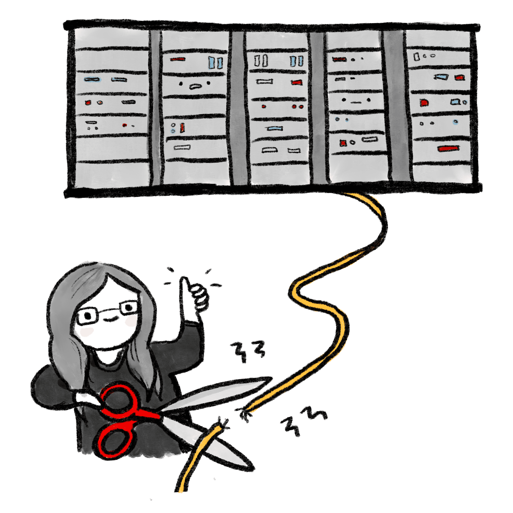
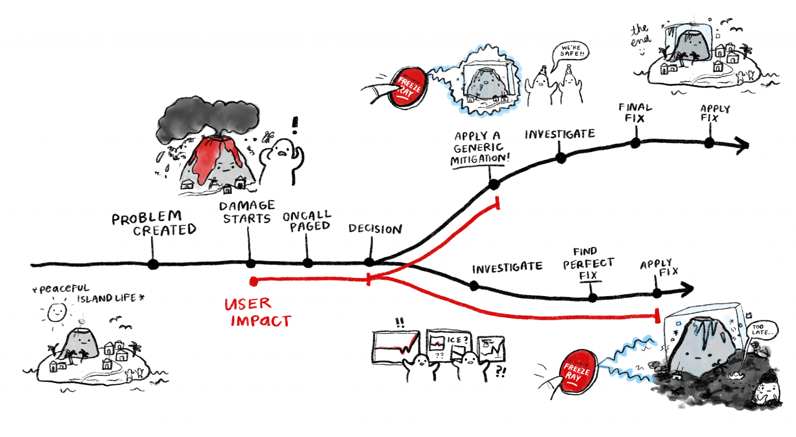
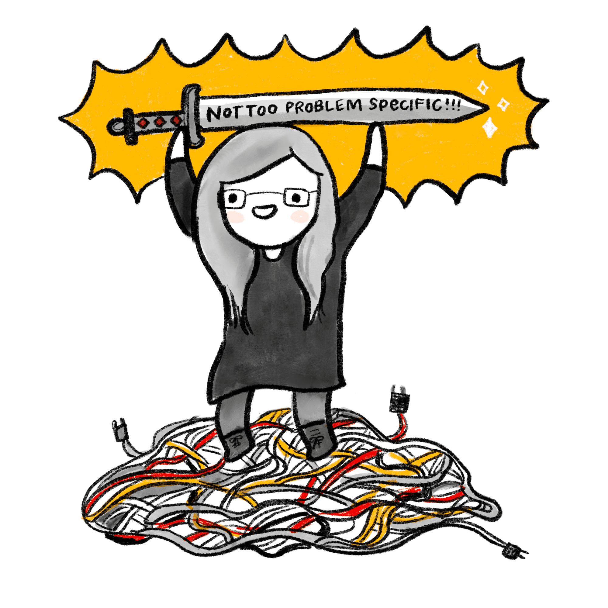
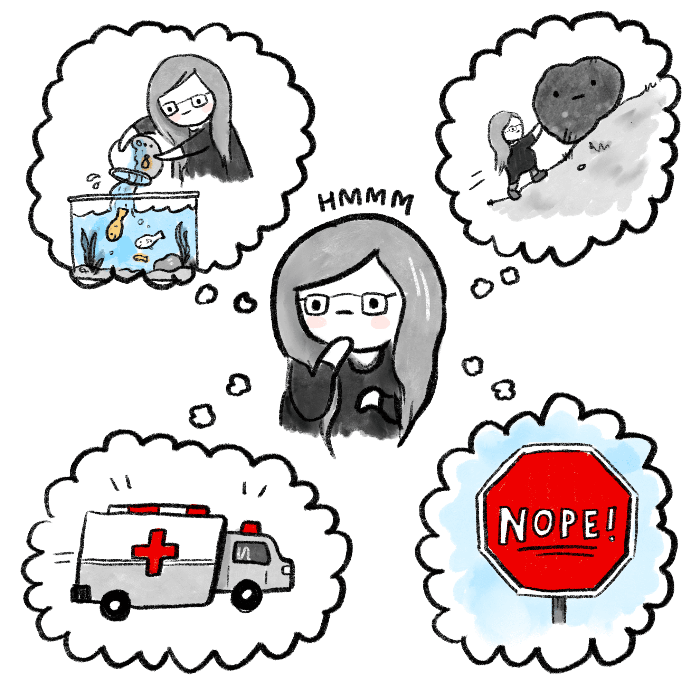
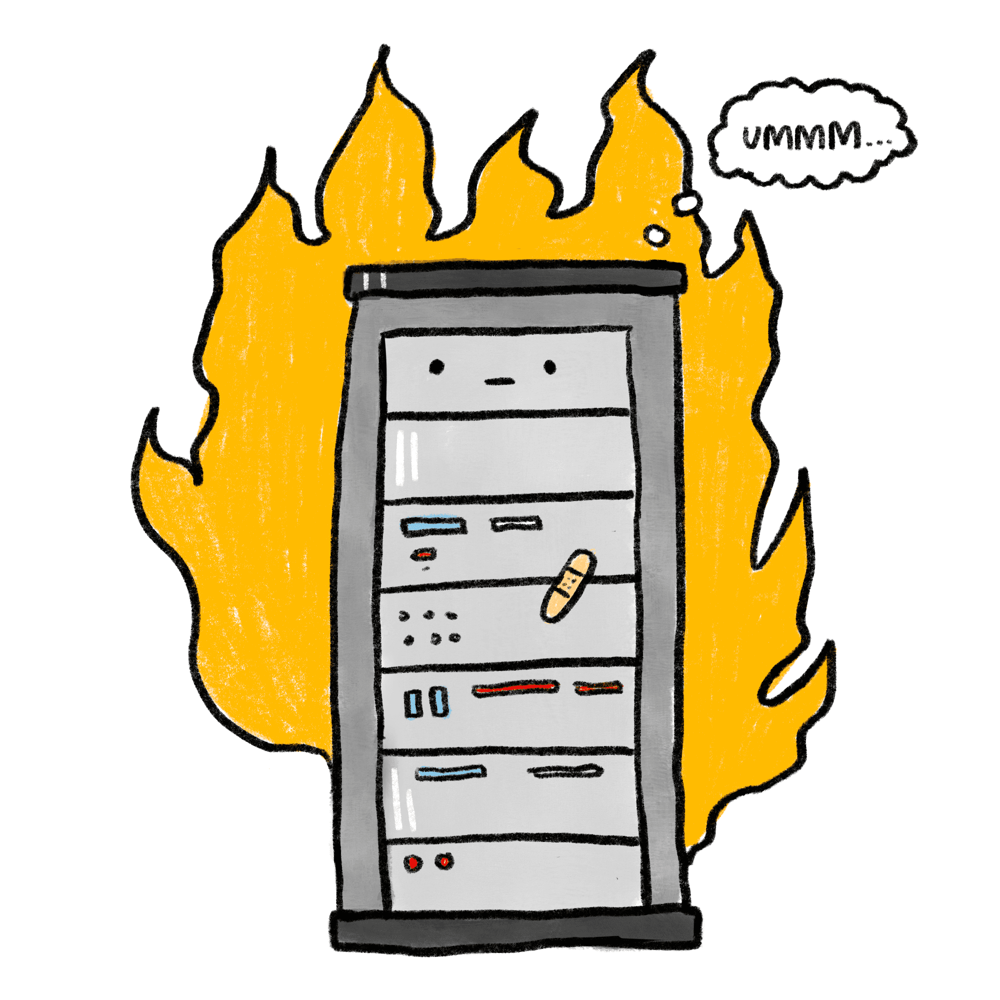
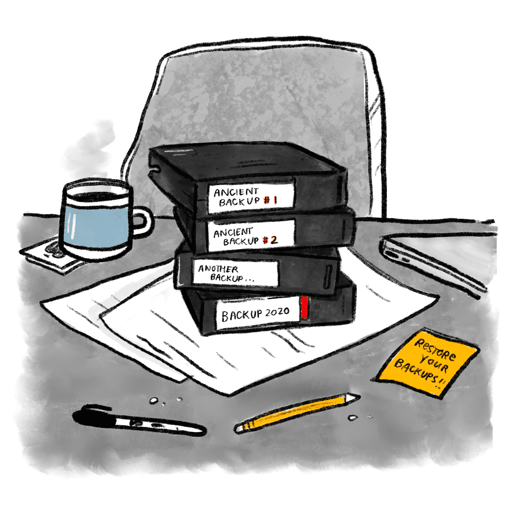
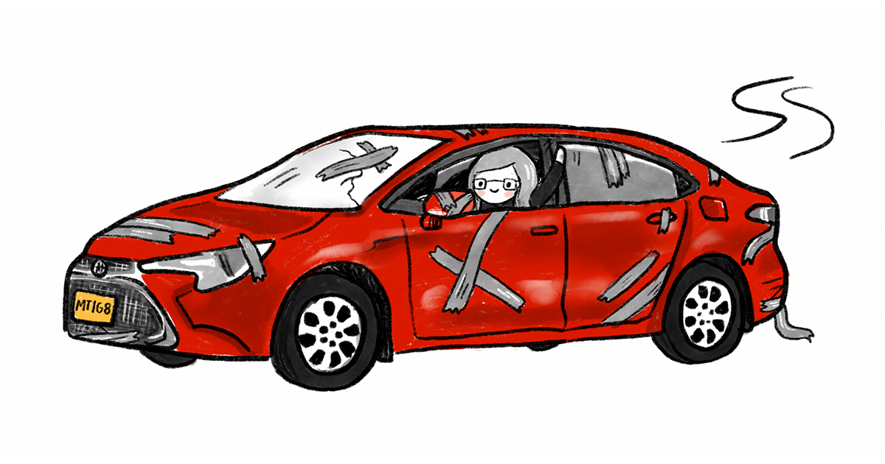

>原作者：Jennifer Mace ；from <https://www.oreilly.com/content/generic-mitigations/>

亲爱的读者，你好！试想你是否负责一项你和你的用户希望一直正常运行的服务？如果是这样，我在这里要告诉你，你的服务应该准备好至少一两个通用的缓解措施。如果没有，你可能会遇到麻烦。如果有，请珍惜它们，维护它们，并使用它们，否则它们可能会失效。

## 什么是通用缓解措施？

好的，从头开始：缓解措施是你可能采取的任何行动，以减少故障的影响，通常在生产环境中。热修复是一种缓解措施。通过 SSH 登录进入实例，并清除缓存也算是一种缓解措施。用胶带把备用电池固定在破旧的笔记本电脑上也算。我猜切断数据中心的电源，以关闭漏洞也是一种缓解措施，就像用断头台治疗普通感冒一样。

>漫画中，值班的 Macey 用滑稽的大剪刀剪断数据中心机架的电缆，同时竖起大拇指。

通用缓解措施是指那些在缓解各种故障中都很有用的措施。

例如，二进制回滚可能是最常见的通用缓解措施。许多多宿主服务都会有一个紧急按钮，用于将流量从故障副本中排除，这是基于查询服务的一个很好的通用缓解措施。其他的可能有单独的数据回滚工具，或快速增加大量额外容量的工具。

通用缓解措施最重要的特征是：你不需要完全了解你的故障就可以使用它。

## 难得不应该排查故障吗？

不。

好吧，让我详细解释一下：你应该在故障被缓解后，再去排查理解它。让我们画一个典型故障的简图。

>漫画中，时间轴图示了两种不同的处理故障的方法。时间轴开始相同，从“问题产生”到“损害开始”（此时出现红色的“用户影响”条）到“值班人员接到通知”，但在决策点上分叉：如果选择“应用通用缓解措施”，用户影响停止，时间轴继续到“调查”、“最终修复”和“应用修复”。如果选择不缓解，用户影响继续——通过“调查”、“找到完美修复”，最后在“应用修复”时停止。时间轴上装饰有火山岛爆炸的插图；显然，在“早期缓解”时间轴中，岛民要快乐得多，而如果选择先调查，岛屿最终被灰烬覆盖，居民悲伤。

构建好的通用缓解措施的目标是尽早在时间轴上准备好一个武器。如果你能使用的缓解措施都是特定于问题的，那么在你详细了解问题之前，你将无法帮助你的用户。减少了解问题所需时间是非常困难的；如果我们能轻松找到问题，那么我们很可能一开始就不会引发这些问题。

所以假设团队的事故管理成功的衡量标准不是“修复时间”，而是“缓解时间”，我们想要最小化的是用户完全崩溃的时间。构建广泛适用的缓解措施比加快根本原因分析要容易得多。

>漫画，中的 Macey 高举一把标有“不是太特定问题的！！！”的剑。她站在一团复杂的电缆上。

## 难点是什么？

具有讽刺意味的是，通用缓解措施非常具体。

这句话听起来很矛盾。再解释一下。一个好的、通用的“快速修复”按钮在紧急情况下使用应该是简单且安全的；但一个稳固的通用缓解工具需要在事前做大量工作，并需要仔细调整以适应所缓解的服务。

然而，有一些非常好的通用缓解模式可以学习，虽然这些需要仔细调整以适应你的特定服务。

## 通用缓解模式有哪些？

很高兴你问了！这里有一些可以让你开始使用的模式。

- **回滚**: 将你的服务恢复到已知的良好状态，通常是恢复二进制文件，但也有其他选项。几乎每个服务都可以实现这个策略的版本。很多服务以为自己有安全的回滚措施，但在故障期间才发现并非如此。
- **数据回滚**：这是前一种情况的一个子案例——它只恢复你的数据。内容密集型服务特别需要这个，尤其是那些依赖数据管道的服务。
- **降级**：你的服务过载了吗？能减少工作但保持运行总比崩溃好得多。在系统崩溃时尝试创建新的降级机制总是让人头疼。
- **扩展/扩容**：流量太大？或者所有东西无缘无故地运行过热？增加更多副本。这虽然昂贵，但比因为故障而惹恼用户要便宜。注意，这通常不像“扩展一个二进制文件”那么简单；系统扩展是复杂的。
- **屏蔽**：有致命查询？单个垃圾用户导致一个区域瘫痪？屏蔽他们。
- **引流/切流**：将你的流量转移到其他地方。如果你是多宿主和流量驱动的服务，这个方法效果很好：如果一个区域看到高错误率，将请求转移到其他地方。
- **隔离**：一个好方法是隔离“问题实例”。将一个使用单元隔离开来——一个热点数据库行、一个垃圾用户、一个有问题的流量——这样它碰到的任何问题都不会影响其他部分。

>漫画中的 Macey，看起来在深思，头上有“嗯”的字样，思考四个可能的缓解选项。顺时针从左上角开始，泡泡中有：Macey 将一个小鱼缸倒入一个大鱼缸；Macey 将一块巨石推上山；一个写着“NOPE！”的大红色停止标志；一辆飞驰的救护车。

## 什么不是通用缓解措施？

没错，如果你因为最近的发布触发了错误而排空了一个实例，却在 30 分钟后下一个实例升级时再次看到相同的错误，你会显得很愚蠢。没有什么是魔法：你需要诊断到能够理解你所处理的故障场景的程度。

>漫画中，一台数据中心的服务器机架看起来很痛苦，它着火了，前面贴了一块创可贴。显然这个解决方案不足以解决问题。

这些模式对所有服务的用处也不尽相同。例如，对于很多固定在单一物理区域的本地化产品来说，排空实例是没有意义的。当你的工作负载无法分离或已经完全隔离时，隔离也没有用。降级模式并不总是可行的。

所以问问自己哪些策略对你的服务有意义。把它作为生产就绪评审（ <https://landing.google.com/sre/sre-book/chapters/evolving-sre-engagement-model/> ）的一部分——记录现有的通用缓解措施，如果不够，就计划添加更多。（但不要太多！质量胜过数量！）缓解措施越好、越标准化，支持的扩展就越容易；如果缓解措施能撑到早上，就不需要在凌晨 2 点叫醒专家。

另外？如果你不使用它们，它们就不会工作。

即使是熟练的值班人员，使用不熟悉的工具也是危险的。无论你选择哪种方法——进行演练、添加自动化测试、编写新团队成员必须完成的小清单以获得生产凭证——确保你的团队接触过你的缓解措施。毕竟，如果没人练习过恢复磁带备份，当有人在生产环境中运行 `rm -r /*` 时，它们就只能是高级的纸镇。

>四个磁带备份堆叠在凌乱的桌子上的文件上，标签分别是“古老备份 #1”到“2020 年备份”。附近的一张便签写着“恢复你的备份！”

通过定期演练你的缓解措施，你还可以验证它们的行为。我们的系统足够复杂，只有在真正使用你的通用缓解措施时，才能知道它们的连锁效应。

目标是为你的服务创建易于使用、安全、无摩擦的紧急按钮，让任何值班人员在稍有怀疑时都能安心使用。这并不容易构建。但提前构建它们比忍受没有缓解措施的长时间停机要便宜得多。

## 总结

简而言之：故障中最昂贵的阶段是用户能看到的时候。一个快速到达“基本正常”的路径比等待“完全修复”对用户来说要好得多。如果你开的是一辆老款的丰田卡罗拉，有时最好的策略是确保手套箱里有胶带，这样当后视镜掉下来时，你可以开到修理厂。

知道你的胶带是什么。你会需要它。

>漫画中一个快乐的值班人员 Macey 从一辆极其破旧的红色轿车的车窗外挥手。这辆车由胶带固定，车牌上写着“MTIG8”。

这篇文章是 O'Reilly 和 Google 的合作。请参阅我们的编辑独立声明。( <http://www.oreilly.com/about/editorial_independence.html> )

>本文所有图片均由 Emily Griffin 绘制。( <https://www.daybrighten.com/> )
