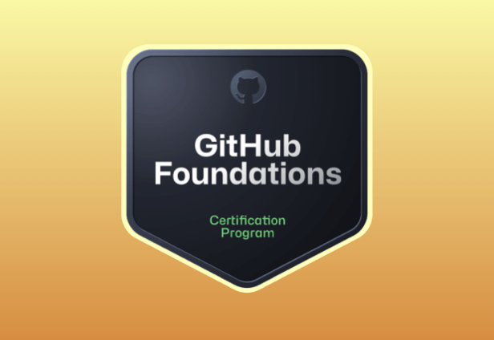
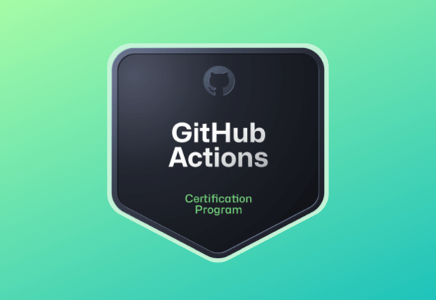
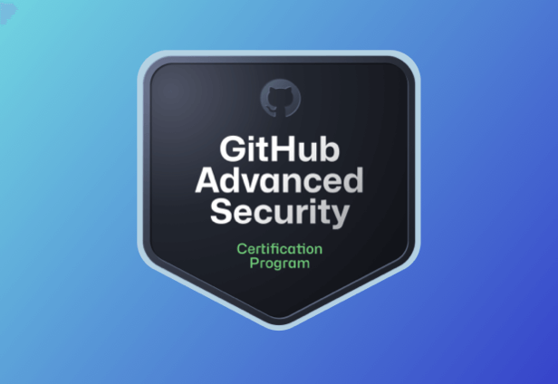
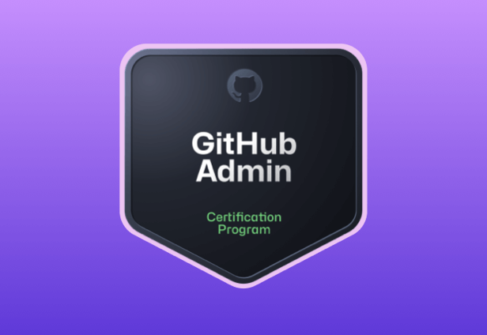
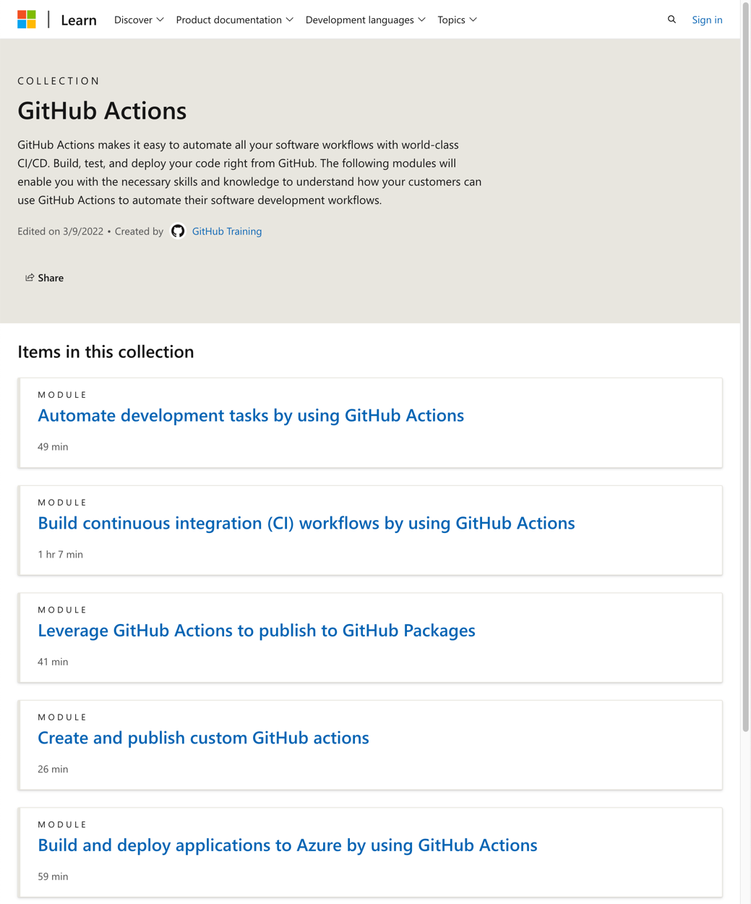
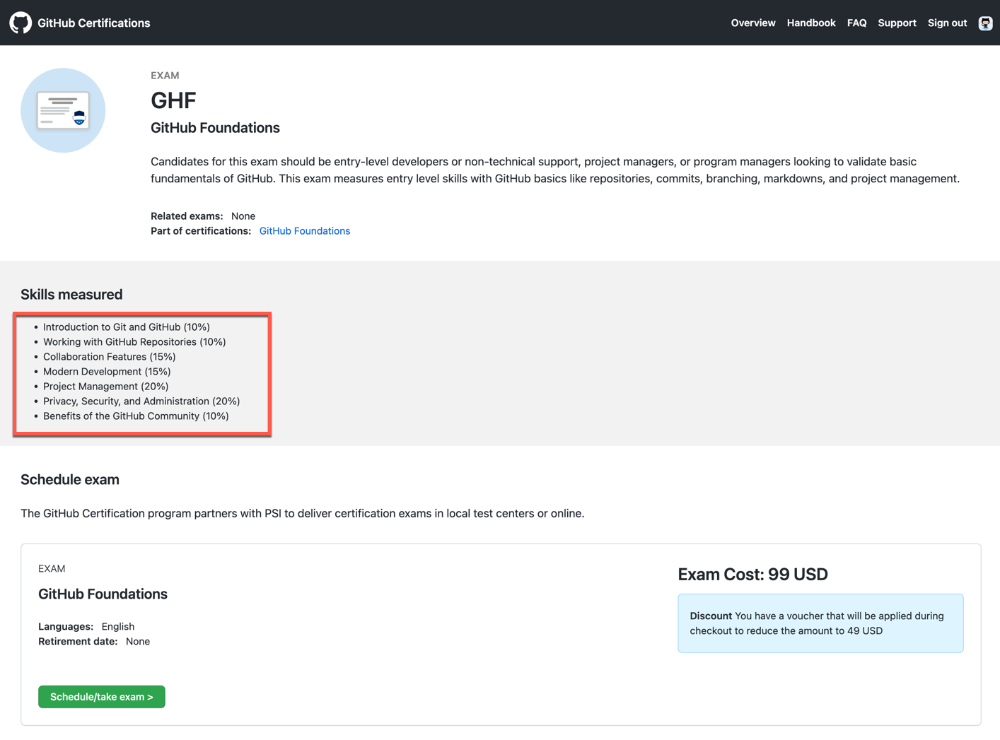
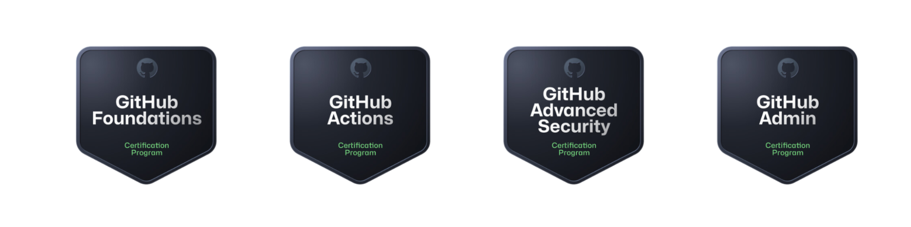

> 通过GitHub认证释放您的全部潜力！获得GitHub认证将让您在展示为GitHub专家方面具有竞争优势。

认证是打开职业机会之门的黄金钥匙，可以为您的职业生涯提供强大动力，提升工作效率，增加薪资。对雇主而言，认证是增加生产力的秘密武器，它在招聘过程中为您的技能提供不可辩驳的证明，并在组织内激发创新。

之前GitHub的认证计划，仅供员工和合作伙伴使用，现在已经向全球所有客户开放！现在每个人都可以访问注册站点，开始学习并准备考试。

## 4 门认证课程

获得GitHub认证将让您在展示为GitHub专家方面具有竞争优势。让我们来看看每个路径。

### GitHub基础认证

GitHub基础认证计划：旨在向初学者介绍GitHub平台的基本概念和产品。您将学习如何使用git，并探索GitHub的核心功能，如存储库管理、提交、分支、合并和项目管理。您还将了解如何为GitHub上的开源项目做贡献，并有效地使用markdown。您可以在此查看完整课程表（<https://learn.microsoft.com/en-us/collections/o1njfe825p602p>），以了解此路径中涵盖的更多主题。

### GitHub Actions认证

GitHub Actions证书:向您介绍GitHub Actions，以便您可以学会自动化软件开发工作流程。您将学习如何构建CI/CD管道，管理GitHub Actions，以及许多其他内容。到最后，您将准备好成为团队中处理所有与操作有关事务的人。在此查看完整课程表（<https://learn.microsoft.com/en-us/collections/n5p4a5z7keznp5>）。

### GitHub高级安全认证

GitHub高级安全（GHAS）证书：旨在教您如何在开发生命周期的每个阶段使用高级安全功能保护您的代码。GHAS专门针对GitHub企业版，因此该证书旨在供企业开发人员评估和配置私有存储库上的秘密扫描、使用CodeQL进行代码扫描、依赖关系管理等等。在此查看完整课程表（<https://learn.microsoft.com/en-us/collections/rqymc6yw8q5rey>）。

### GitHub管理认证

GitHub管理认证:将教您如何维护一个健康、强大和安全的GitHub环境，以满足组织的需求。您可以在此查看完整课程表（<https://learn.microsoft.com/en-us/collections/mom7u1gzjdxw03>）。

## 学习备考指南

GitHub认证官网为每个认证计划创建了详细的学习指南。您可以从此存储库【<https://github.com/LadyKerr/github-certification-guide>】获取每个证书的学习指南，以及帮助您准备考试的资源。

每一门课程的学习资料都可以在微软学习网站上免费访问并学习。

建议的学习路径是：

1. GitHub Foundations ：【推荐】这虽然是一门基础的课程，但是可以说它为你提供了非常丰富的学习内容，包括：GitHub Copilot、Codespaces。还涵盖了项目管理、如何参与开源项目、安全防护代码仓库、处理 PR 等高级内容。即使不一定参加考试，也建议完成的学习一遍。适合人群：想更多了解 GitHub 的人群。
2. GitHub Actions：【推荐】这门课程主要是讲解 GitHub Actions 的使用，包括：如何使用 GitHub Actions、如何创建流水线进行 CI、如何管理软件包、如何开发和发布 GitHub Actions 等。适合人群：长期在工作在 GitHub 项目上的人群，你想在项目上使用自动化的 DevOps 流水线和 CI、CD 实践。
3. GitHub Advanced Security：【可选】这门课程主要是讲解 GitHub 的安全防护，在 GitHub 上如何做 DevSecOps，需要的产品功能是GitHub企业版的附加功能，如果你的公司没有购买 GitHub企业版，那么这门课程并不适合学习。
4. GitHub Administration：【可选】这门课程主要是讲解：如果你是你们公司的一名 GitHub 管理员，你如何维护一个健康、强大、安全的 GitHub 环境，以满足组织的需求。如果你不是你们公司的 GitHub 管理员，或者没有这个想法，那么这门课程可以不用学习。

在学习完之后，如果你想报名考试，请访问：<https://examregistration.github.com/overview>

每一门认证考试的费用是 $99，；由于这个培训认证是刚刚 GA 不久，目前 “GitHub基础认证” 认证考试是打折促销，折后只需要
$49 。

我目测了一下考试的范围和难度：感觉广度是一个挑战，毕竟不是每个人都会参与项目管理、协作、安全、开源/内源这些相关的工作内容。深度上应该不太难，毕竟假如你是天天在 GitHub 上工作的人，都会有一定最基础的经验。建议可以先学习了在说，毕竟学习的内容是免费的。如果想报名考试，报名和考试都是线上进行的，还是比较方便的，特别是 GAF 的折后价格还不错。

在考试通过之后，就可以获取Credly验证的凭证：您将收到Credly徽章和证书，以验证您的资格。就像其他的电子徽章一样，你可以发朋友圈或者在 LinkedIn 上展示你的徽章。

下面是四种GitHub认证考试的徽章：GitHub基础、GitHub Actions、GitHub高级安全和GitHub管理。

GitHub 的官网和微软的学习网站所提供的学习资料和备考指南手册文档都是丰富且详尽的。如果您对认证计划有任何疑问，请务必查看官方的FAQ页面「<https://examregistration.github.com/faq>」和备考人手册『<https://examregistration.github.com/handbook>』。