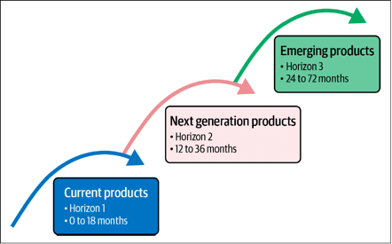

>译者：刘征

* [下载中文版 PDF 文件](/wp/enterprise-roadmap-to-sre-cn.pdf)
* [下载英文版 PDF 文件](/wp/enterprise-roadmap-to-sre.pdf)
* [从 Oreilly 阅读白皮书](https://www.oreilly.com/library/view/enterprise-roadmap-to/9781098117740/)
* [从 Google 下载白皮书](https://sre.google/resources/practices-and-processes/enterprise-roadmap-to-sre/)

可靠性并非新鲜事物。企业一直将其视为业务系统需要不断提升的重要品质，无论是在服务质量、可靠性还是系统正常运行时间方面。那么，SRE方法又有何独特之处呢？为何当下引起如此关注？它与传统方法有何异同？对企业来说，又意味着什么？

## 将可靠性作为产品的关键差异化因素

为什么企业要建立 SRE 团队或者追求可靠性呢？他们希望实现什么样的结果？行业技术的流行趋势总是在不断的变化（技术、流程），但它们需要有实质性的商业价值才能被企业留存下来。考虑到可靠性和安全性，它们起初都不是产品明显的差异化因素，而是被视为必备的需求而已。只有在出现问题，并且期望产品具有高可靠性，或其依赖性时，它们才会变得更加突出。例如，多年前，安全漏洞和黑客攻击相对较少见，因此安全性是存在的，但并不会出现在面向消费者，或企业的产品营销材料中。现在，随着漏洞越来越普遍，并成为人们关注的焦点，我们将安全性视为产品的差异化因素之一。

可靠性（更常见的是可用性或正常运行时间）往往主要会在服务级别协议（SLA）和类似协议或期望设定的详细条款中提及。然而，我们在客户满意度（CSAT）评分、像 Downdetector 这样的第三方网站，以及将更多的生活和业务转移到互联网的整体趋势中，才会感受到可靠性的存在。在 COVID-19 疫情期间，许多软件即服务（SaaS）产品经历了业务的高速增长，并且不得不大幅提高对 SaaS 产品可靠性的期望。

除了“可用性”之外，作为可靠性特性常见的代名词，我们还可以想到：耐久性、数据持久性、在负载下的速度或性能、一致性和返回结果的质量等各种特性描述，与作为消费者级和互联网服务客户隐性的可靠性诉求相似的特性。

一旦我们理解到了：可靠性实际上是产品的高期待特性，我们甚至可以大胆地说，它是产品最需要必备的特性。因为，如果产品一旦不可用了，那么它的任何功能（增删改查...）也都无法发挥作用。如果产品在性能或质量方面的糟糕使用体验导致用户感到沮丧，那么产品服务将不会令用户满意。如果产品服务在高峰时段、关键业务时刻无法使用了，那么产品服务就会让用户感到不值得拥有，而离你而去。

谷歌搜索以“始终可用”的特点而闻名，以至于认为它是无处不在的服务（甚至用于测试网络是否通畅）。谷歌搜索的可用性是它与竞争对手进行对比时的关键差异化因素，与速度、质量、易用性和用户体验并列。这并非偶然，而是谷歌十多年来的一个刻意选择和投资的成果。

## 应该何时关注可靠性？

当初创公司考虑是否要在可靠性方面进行投资时，可能会认为可靠性还是为时尚早。特别是当他们考虑到像谷歌这样的大型组织所采取的全面措施时。这是可以理解的，因为：初创公司首要的工作是构建一个最小可行产品（MVP），而不是一个耐用的、有韧性的服务。然而，一旦产品的可行性确定了，那就应尽快将可靠性纳入产品路线图，与安全性和其他“横向”工作（国际化、可访问性等）一起开展起来。

在这些初创公司或早期企业中，关于可靠性的高成本定制化开发投资可能尚早，但与安全管理类似，在可靠性管理领域中，也有许多产品通过开源软件，以及通过第三方提供的服务和工具变得更加通用化。可以尽早的开始利用这些通用的工具和服务，从而避免在后期，不得不在已经发展壮大的复杂系统中进行痛苦的集成工作，或是被动响应可靠性问题。积极的前瞻性考虑是可靠性，及其相关准备工作的关键。另外，值得注意的是，尽管像谷歌这样的公司在内部构建了许多可靠性管理系统，但这绝不是最具成本效益的方法。利用外部的服务和工具是很早就经过验证的最佳实践。外部采购胜过内部自研是值得推荐的做法，特别是在诸如安全性（“永远不要自己编写加密算法”）和可靠性等领域，因为，自研可能会产生大量边缘场景和副作用。虽然，目前可靠性管理供应商领域的成熟程度和规模尚不如安全性，但它正在增长中，并且会对不断发展的公司产生重大影响。

在规划稳定性投资时，麦肯锡的“增长的三个阶段”模型（见图 2-1）可能会对你有所帮助。它描述了公司未来发展的三种思考方式：

* 阶段 1 是当前已经很重要的工作领域。
* 阶段 2 是预期中新的增长领域。
* 阶段 3 是未来潜在的长期增长领域，目前处于研发阶段。

通过考虑对每个阶段的不同投资水平，各个团队就可以拆解可靠性领域中不断涌现的工作内容。

首先，让我们从阶段 1 模型的产品开始，我们应该专注于确保：让可靠性工作能够为公司当前的业务模式保驾护航，同时助力短期需求的持续创新。这相关的工作包括：对于传统的运维工作，可以通过 SRE 实践进行自动化。其他工作内容还包括：服务监控（服务质量目标 [SLO]）、事故响应和持续集成/持续交付（CI/CD）等等。

阶段 2 模型产品考虑的是：将核心业务扩展到新的市场和面向新客户。将现有的可靠性功能进行扩展，从而支持到更广泛的消费者，并可能在必要的情况下在全球范围内扩展基础设施。这些情况都将带来新的可靠性挑战，例如：分布式团队（7x24覆盖）、针对多个客户群体的容量规划、多区域部署，以及传统的维护窗口应用就不太现实了，这类工作事项本质上仅适用于本地化产品，而不适用于全球化产品（不是“所有用户都在深夜中”）。

最后，与阶段 3 模型产品相关的可靠性工作包括：公司可能扩展其业务提供的方式。为了应对未来颠覆性机遇或应对竞争威胁，公司应该用新的能力和新的商业模式来实现。投资于阶段 3 的公司将确保其平台和架构不会被绑定在单一的商业模式上，而是允许各种形态的系统的生成和演变，同时保持控制和质量标准。在这里，系统需要是可靠的，但不能僵化。诸如集中式批准委员会和自上而下的架构标准等工作会扼杀阶段 3 模型产品所需的创新。

因此，将 SRE 应用于阶段 1 可以对您当前重要的业务产生立竿见影的影响。将 SRE 作为阶段 2 的核心基础可以保障未来的成功。然而，阶段 3 并不是开展 SRE 的最佳领域，因为在那里做投资的可行性还不明朗。

## 为什么 SRE（站点可靠性工程）在现在才开始流行?  

为什么 SRE 不是在 20 世纪 70 年代或者 2010 年被发明并流行起来？显然，基于互联网的服务的复杂性近年来已经明显增长，尤其值得注意的是伴随着云计算的崛起。从商业上讲，我们将云视为分布式系统的后浪，而分布式系统是计算机科学中的一个深入研究的领域。只有在过去的十多年里，这个计算机科学的分支才对个人消费者（例如，Google，Facebook，Apple）和企业（如 Salesforce）产生了重要影响，或者说，它的原则早已经被服务提供商（如 Akamai，Stripe）广泛有效地用于提供可扩展的互联网系统，更不用说云服务提供商了。  

“数据仓库级计算”（这是 Google 的一个概念，将数据中心比喻为一个超级的数据仓库计算机的模式）的引入改变了企业构建、交付、运营和扩展服务的方式。这些新模式明显改变了企业对待成本（CapEx）的方式，从租赁或建造空间和购买计算机系统的资本支出模型转向了按需租赁计算服务片段的运营支出模型（OpEx）。然而，这还涉及到系统设计、架构和应对不断变化的故障模式的问题。  

传统的基础设施遵循类似建筑行业或金字塔的模型：从底部向上构建的大而坚固的基座。如果基座出现了问题，对其上面的所有东西都会是灾难。我们将这种模型称为基于组件的可靠性模型，或者联合模型，即需要使系统中的所有组件都可用，系统才能正常运行；如图 2-2所示，

在云计算中使用的新模型是概率可靠性或交集模型，由于架构选择是期待故障的，所以只要系统的一部分子集可用，系统就可以正常工作。  

虽然这个概念并不新颖或难以理解，但对于云服务的使用者来说，特别是当我们提出“迁移上云”的建议时，这并不显而易见，因为他们认为旧模型和新模型之间存在这等同性。虽然在新平台上运行旧模型是完全可能的，但必须考虑许多其他因素，这经常会让那些没有做好准备的人感到困惑。例如，传统的 IT 部门可能会为任何特定的虚拟机（VM）的正常运行时间而感到自豪，而对云 VM 则预期其实生命更为短暂：它们会被任意地创建和销毁，而且这个过程通常会非常快。  

企业在像 Google，Facebook 和 Apple 这样的现代公司中看到了成功的案例，发现了两个主要的优势：（1）大规模创新，以及（2）大规模可靠系统。这些公司不仅可以构建新系统，而且可以保持它们的可用性，敏捷性和正确性。这个组合对于企业来说非常有吸引力，因为这使企业也能够快速响应市场需求，并向整个市场提供广泛的解决方案。

## 超越 Google 的光环  
  
当然，Google 并不总是如此庞大。实际上，在早期，Google 以更传统的方式管理服务器群。使 Google 与众不同的是，它早期从垂直扩展转向了水平扩展其服务器群，也就是说，从购买更大更强大的计算机转向了购买更多更便宜的计算机。  
  
你可以通过走过早期托管设施的走道看到这种变化。虽然在第一次互联网热潮期间，许多租户的机架里都有看起来很酷、昂贵的硬件，但 Google 却使用的是大量标准商用硬件，预期任何时候某个机器都可能会发生故障，并在软件设计中也考虑到这种故障。  
  
引发这个转变的一个重要因素是，这是一个有意为之的选择：在进行水平扩展的过程中，避免相关的运营成也线性增长。也就是说，从财务的角度看，当水平扩展时，也持续雇佣更多人来维护新增的机器是没不合理的。  
  
在这种技术和财务选择的双重推动下，Google做出了自己的选择——这就是 SRE 部门的诞生。Google 只是在大多数其他公司之前做出了这个选择，因为它是一个非常早期的互联网规模化公司。  
  
我们相信，许多公司现在面临的扩展挑战与 Google 当时面临的挑战相似。只不过现在这些公司有公共云的优势，而不必在自己的数据中心中填充大量的标准商用硬件。我们相信，Google 能够通过发展 SRE 职能部门来克服这种方法的变化，这意味着 SRE 也可以帮助在其他公司克服同样的难关。  
  
我们在 Google 学到的一个关于 SRE 与传统 IT 运维人员配备水平的重要观点是，那就是亚线性扩展。我们的意思是，运维一个系统的团队的规模不应该与系统本身的增长速率相同。如果你的系统的使用量翻倍了，那么你也不应该需要两倍的运维团队。Google 选择不按机器数量进行扩展，而是按其他更高级的指标进行扩展：集群、服务或平台。通过关注更高的抽象层级，团队可以做更多的事情，而开销更小。  这些抽象层级往往是由那些以前运维过这些系统的人来构建和扩展的。  
  
复杂性可以增加对 SRE 的需求，但你的SRE人员配备应该比服务的接入增长得更慢，这个概念被称为亚线性扩展。这实际上直接与减少团队中的重复劳动琐事的原则有关。随着系统的增长和衍生，团队需要做更多的重复的任务来保持系统的健康。SRE 管理必须积极防止并跟踪这一点。如果团队允许过多的重复劳动琐事发生，不主动察觉，这可能会是一个下滑的开始，会导致团队无法维持，同时宕机时间也会增加。

## 为什么不选择更传统的运维方式？  
  
你的组织可以通过利用 Google 从垂直扩展转向水平扩展的经验，以及通过发展 SRE 而产生的相关变化，更早地享受到规模的优势，同时也可以节省资金。想一下另一种方式：为了降低扩展团队的成本，而随着复杂性的增加，团队的责任也在增加，人们也可能会从外部寻找更便宜的劳动力（例如，“外派员工”或“正确的离岸外包”）。这是处理规模和复杂性时一个太常见的方法。这通常会导致系统增长受阻，导致发生停机事故，实际上随着时间的推移，增加的成本会更高。这些意外的成本可能不仅来自停机或对品牌的损害，还可能来自于执行或扩展速度降低、新产品的上市时间延长，甚至最终被竞争对手超越等其他形式的业务收入损失。在选择如何优化运营和可靠性投资的成本时，组织需要考虑全局。  
  
因此，配备合适的 SRE 团队是很重要的。其实你不需要都去雇佣博士学历，但你也不能吝啬。尽量不要只关注运维人员的单位成本，而是要关注整个系统的综合成本。做个类比，工业食品包装使用着价值百万的机器设备，将桃子装入罐头盒中。你可能会想，“为什么不雇佣非熟练工人？那会比百万美元的机器便宜得多。”乍一看，这听起来更便宜。然而，当你考虑到雇佣非熟练工人的整个系统成本时，实际上更贵。因此，使用价值百万的机器的整个系统最终比雇佣非熟练工人更好、更便宜。如果你让他们，SRE 和平台工程师来为你建造你的罐头机器人。不要因为你过去常做的事情，就强迫他们手动填装桃罐头。  
  
如果没有高效能的员工，采用像 SRE 这样的高性能实践会更困难。那么现有的团队是不是就没有希望了？一点也不。完全有可能，并且强烈建议开发现有的人才。团队可能会试图雇佣一个外部专家，甚至是一个拥有 SRE 经验的外部团队，但这可能是一个错误。同样，期望通过外派员工或离岸外包获得（长期的）SRE 能力，也不太可能得到你期望的结果。SRE 人员的单位成本往往比传统的运维团队高，试图削减人员预算，或者想在在配备 SRE 团队时，以低成本获得高价值的方式往往都会失败。如果你的组织重视可靠性，你应该能够合理化这个成本，我们将在后面的部分探讨如何做到这一点。  
  
将运维只看做成本中心是一个常见的错误。你应该考虑收入和总拥有成本的全局，避免局部优化成本，并认识到，只关注短期削减成本最终可能会让你的公司付出更大的代价。例如，通过评估发生事故的情况，估计事故将对收入或品牌的影响，投资一个 SRE 团队的定位，就可以视为一种长期的保险，包括一系列的事故缓解和预防策略。理想情况下，这个团队不仅仅是“保险”，实际上还是驱动改善（可靠性！）向客户交付创新的驱动力。考虑以你的阶段 2 模型产品为目标，并统筹规划你的平台。不要只解决今天的问题；还要为将来做计划。  
  
考虑转型现有员工的好处。只要给予正确的激励、机会和足够的时间，一个组织就可以改变其常态，并优雅地接受其人员的现代化角色和责任，同时也尽可能地减少了不必要的人员流动。因为，毫无疑问，一个组织最宝贵的资产永远是它的人员。在评估员工的技能集时，不应低估了他们对公司核心业务的真正理解。

Feature picture ❤️ Anete Lusina: <https://www.pexels.com/photo/miniature-toy-car-on-top-of-monopoly-board-game-4792380/>
