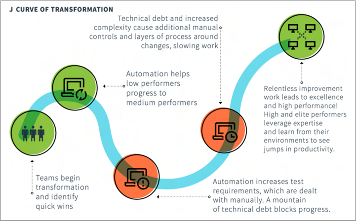

>译者：刘征

在我们探讨具体的实践方法之前，首先要明白的是原则的重要性，这就像法律中遵守法律的字面含义和精神含义。单单实践方法本身并不足够；SRE 的核心精神在于它的原则中。实践方法也面面俱到————它们只是原则的外在体现，也会随着时间和组织的不同而随机应变。

原则是你转型基础的基本真理，它们在你的决策过程中提供帮助和指导。实现业务目标通常有多种方式，因此鼓励人们充分理解和执行核心原则，要优于：设定一套面子工程的详尽的规则，那只让人按照字面意义去机械的执行，而忽视了核心精神。以 Google 的原则为例，虽然我们有多种：关于如何设计和构建新服务的内部政策，但我们始终坚持的核心原则是：“以用户为中心，其他一切都会随之而来”。  
  
你的重点应该是：激发每个层次的人，使其都展示领导力，而不是从各种方面剥夺他们的个人意识，不是用指令束缚他们。特别是，业务部门和经理需要认可转型的原因和动机，并必须愿意在他们的专业领域的范围内调整和进行详细的指导。一旦说服了这些有影响力的人，他们就会成为你最大的资产（资源），如果没有被说服，他们就会成为你最大的障碍。  
  
与原则类似，良好的政策关注的是产出，而不是任务的完成；然而，它们更像观察视角方面的指导。它们是你用于牵引业务的抓手，而不是对抗业务流程的工具。政策和政策框架应该让人们在明确的界限内安全地运行。同时，它们也应该包含合理的默认设置，以便引导行为朝着正确的方向发展。  
  
>反模式：**关于如何实施SRE，预先规划一个大而全的计划或设计。**  
>本质上，你需要花费大量的时间来学习，我们建议：你构建一个由一致的原则指导的反馈循环（也就是说，通过反馈改进，形成一个良性的循环）。  
  
我们将简要介绍 SRE 书中的每一个原则，以及如何在你的组织中应用它们。若想要获得更多细节，我们建议你阅读《Google SRE运维解密》一书中的相关章节。

## 拥抱风险

*详见：《GOOGLE SRE运维解密》第三章*
  
这是在初始阶段最难迈出的一步。我们通常把这个问题描述为：可靠性与速度之间的权衡；然而，这并不一定是真的。对企业来说，对于理解可靠性，最有帮助的方式，是将其与指数级的运维成本联系起来。大约每提高一个"9"（例如，从 99.9% 提高到 99.99%）都会导致成本增加一个数量级，无论是软件、硬件还是人力资源。考虑是否能从这种投资中获得良好的回报，有助于根据业务需求进行调整。故障的类型也非常重要。例如，需要全天候运行的服务会更适合实施 SRE（相比那些公司内部的一周只运行 8 小时，每周 5 天的系统）。另外，对于那些没有得到积极维护的服务，SRE 的作用将会大打折扣，因为这些服务在持续改进方面的机会本来就会很少。尤其是在你故意不进行太频繁的版本发布，或不在编写新的代码时，这点尤为明显。  
  
>反模式：**服务 100% 可靠性目标。**
>对于几乎所有事情来说，100% 都不是正确的目标。  

>反模式：在“常规”的运维中实现了 99.999% 的可靠性  
>月度指标或维护窗口可能会掩盖灾难带来的巨大影响。

## 服务质量目标

*详见：《GOOGLE SRE运维解密》第四章*
  
在你开始考虑实施 SLO 和 SLA 之前，先从服务质量指标（SLI）开始，并根据你系统的实际观测数据，来制定和校准的 SLI，然后用来支持 SLO/SLA 协商（利益干系人间的对齐）。不要让你现有的业务承诺影响你对 SLO/SLI 准确性和相关性的判断————你可以选择使用指标来驱动工作的变化，或者反之亦然。总之，不能进行粉饰，或者挑选优点展示。而要，花时间理解你的客户想要的是什么，而不能，为了支持&证明你理论，使用方便的数据点。简单来说，让事实证据（SLI/SLO）来驱动你的结论（SLA）。尝试关注那些 >99.9% 的服务，对于 <99.9% 的服务而言，SRE 可以先不参与相关维护工作（直到它们产生了需求）。我们反复强调：如果一个服务不从 SLO/SLI 中受益，那么它可能也不会从 SRE 中受益。最后，如果在 SLO 不违规的情况下，你就不能对软件或流程做任何变更了，那么 SRE 对你的收益也会甚微。
  
>反模式：SLO = SLA
>你应该总是将 SLO 设置得比 SLA（例如，SLO：99.95%，SLA：99.9%）更严格。
  
>反模式：SLI = OKR（目标和关键结果）/KPI（关键绩效指标）  
>Goodhart 的法则在这里适用：当一个度量成为了目标，它就不再是一个好的度量。
  
## 消除琐事

*详见：《GOOGLE SRE运维解密》第五章*
  
这可能是最重要的原则之一，因为它与 SRE 成功所需的创新文化密切相关。大多数时候，企业领导层希望加快进度，并通过确保将所有资源都 100% 的利用来实现这一点。如果你真的希望能确保：你的团队正在做正确的事情，而不是快速地做错误的事情，那么你的目标应该是少于 50% 的繁琐工作（或者我们所说的琐事）。这是可靠性（和速度）在大规模下的秘密。不要将其等同于技术债务，即可以把它们都攒起来，以后一起偿还，或者以“琐事周”的形式，每个季度解决一次这个问题。一旦琐事压制住了你的团队，那么所有 SRE 的所有其他活动都会停滞不前。你必须为组织来定义：什么是琐事，并且这必须由 SRE 实践者来决定，而不是自上而下的指令。琐事的定义也会随着时间的推移而改变（定义再次由实践者更新）。
  
>反模式：将琐事作为一个可有可无的原则  
>忽视消减琐事会对应用 SRE 产生很大的影响。如果你没有时间减少琐事，那么你就没有时间实施 SRE。  
  
>反模式：琐事是某个人/某个团队的工作，而不是每个人的工作  
最接近工作的人需要是修复它的人。如果你试图把这个工作转嫁出去，它会驱动错误的行为。  
  
>反模式：琐事清除周  
>每季度举行一次“琐事清除周”是常见的诱人的做法，但这是这样是行不通的。你需要采取更系统、更持续的消除琐事的方法。  
  
## 监控分布式系统

*详见《GOOGLE SRE运维解密》第六章*
  
可观测性是一门独立的专门学科，它需要像其他开发实践一样受到同等的重视和思考。实际上，大多数企业应当预期投资于多种系统，这些系统将帮助团队更高效地工作。单一的监控平台（大而全的统一控制台）并不能很好地运作；同样，使用数百种功能叠加在一起的工具也不可行。通过理解你独特的 SRE 用户路径，以及他们需要使用多种工具来诊断和解决系统间的逻辑关系，找到适合你的平衡点。将可观测性系统视为：需要投资和精心设计的内部产品，强调工具的实用性，而不是“完美”的仪表板，因为系统总是在变化。记住，告警过度和告警不足同样的糟糕：告警不应直接发送给人类，除非需要他们采取行动。构建这种告警学习循环是加速学习的常见方法；弄的不合理，会迅速使 SRE 精疲力竭。

>反模式：告警信息过载
>告警的电子邮件充斥了你的收件箱，我们会忽略所有信息，这意味着高优先级的告警也无法得到必要的响应，因为告警噪音太多。

>反模式：“NoOps”工具会替代 SRE
>工具可以增强 SRE 的能力，但还不能替代他们。完全消除运维是不可能的，这样会迅速的让你的 SRE 团队渐行渐远。

>反模式：告警即是原因
>你可以记录很多事情，但告警总是针对症状而不是原因发出。

## Google 自动化的演变

*详见《GOOGLE SRE运维解密》第七章*
  
当涉及到极高的可靠性水平 (99.99% 或更高) 时，自动化是最重要的，因为在这个时候，如果需要人工介入，你几乎总是会经历的的是：服务水平目标 (SLO) 违约。随着系统错误预算的逐渐缩减，干预的平衡点也随之变化，最终转变为主动维护，会采用的技术手段包括优雅降级、重试等。自动化本身也会成为一个常见的问题，花时间修复不良流程是非常重要的，但很难融入团队文化。自动化也需要和系统其他部分一样的容易维护。

>反模式：不管流程的质量或适用性，默认一切自动化
>最好的代码是并不写的代码！对于不很频繁的流程，操作手册（Playbook）是一个很好的中间解决方案。

>反模式：对于“非常重要”的部分也不要人工介入
>只有当你真正需要又人来做决定，并且他们有权这样做时，才让人工介入。

## 发布工程

*详见《GOOGLE SRE运维解密》第八章*
  
发布工程与你的 DevOps 团队可能已经在进行的持续集成/持续交付 (CI/CD) 实践有广泛重叠。要充分利用这些现有工作，而不试图自上而下的强加另一套实践。强调结果和流程指标以对齐团队，并确保你在一个平台团队 (或根据规模的不同而有多个团队) 上有足够的投资。

尽可能提前发布相关的工作，即尽早让测试团队也参与进来，并在所有阶段考虑测试。

不要让开发人员负担过重，但确保发布周期的每个部分都被视为有价值的，并与其他部分保持一致。对于 SRE 来说，发布流水线是导致大多数问题的原因 (因此也是解决问题的关键)。与值班和维护人员也需要紧密的配合。

>反模式：DevOps/SRE 团队负责所有的发布
>那是让不同职位的人都来干运维的活。

>反模式：发布工程必须引入 CI/CD
>持续交付本身就是一门学科，你的平台和开发团队需要在这方面打好基础 (SRE 可以提供帮助)。

## 简单性

*详见《GOOGLE SRE运维解密》第九章*

团队的认知负荷很重要，并且会随着团队职责的扩展或缩减而变化。确保允许团队合并或拆分，从而让认知负荷匹配。基本上，复杂性意味着很多事情都会很难理解；因此，要尽可能的激励：减少不必要的复杂性，并将复杂的事情拆分成更小、更易管理的部分，例如领域驱动设计 (DDD)。另一个从 DevOps 中重用的重要概念是：高上下文 (High Context) 与低上下文 (Low Context)，以及 SRE 的一些概念如操作手册（Playbook）、文档、灾难恢复测试 (DiRT) 演习等，这些都是使事情变成低上下文的重要部分。拥有更少的代码和更少的产品特性，可能会与大多数产品的激励相悖，因此：要考虑其可靠性影响时，请确保对此进行控制。

>反模式：简单意味着我能理解它
>用一个高管专用的仪表盘，并不可能有意义地显示所有内容。更不要试图强行的实现它。

>反模式：基于年度评估的静态团队
>动态团队的形成需要一年多次。

## 如何引入这些原则？

如何将这些原则映射到你组织？将这些原则完全与您的组织对齐的可能性很小，但这没关系！你的 SRE 版本并不需要完全和 Google 的相同，只需要原则一致。但是，请确保你特意地选择将要追求的目标，检查与现存原则之间的差异，并利用这段时间仔细检查面子指标 (参见 Eric Ries 在《精益创业》中解释的“成功剧场”)。在不稳定的基础上进行变革可能很难，因此如果你没有信心，请假设你需要检查和改变。尽量不要在原则上犹豫不决，如果你认为某事无法完成，那么推迟它的实施，要比假装工作更好。

## 防止组织破坏性错误

变更可能会潜在的产生非常不同影响。采纳新原则时，进行的一些变更不一定总是有效。变更所带来影响，通常比能否恢复原样更不重要，这意味着最难逆转的变更，通常也会造成最大的痛苦。专注于更容易逆转的改变，即使这些变更是错误的，它们仍然会带来经验教训。例如，如果第一次重组不成功，你可以随时进行另一场重组，但你不能让解雇的人重新回到公司。

>反模式：解雇所有不会编程的运维人员
>除了显而易见的道德或法律影响，你根本无法逆转这个决定。

>反模式：给所有开发人员生产的 root 访问权限
>良好的安全和运维实践包括：与过往的任何时候相比，最小可用权限最适用于自动化。

>反模式：选择业务中最关键的系统作为起点
>你不会在马拉松训练计划的第一天就跑 26 英里。

## 建立安全失败的环境

为你的采纳之旅创建一个安全失败的环境，期望失败会发生，但确保你从中学习并长进。在做复杂的事情时，请确保有主题专家（SME）的参与，但在做复杂的事情时，请确保你要么奖励失败，要么有失败预算。在大多数组织中，真正奖励失败很难，因此有时失败预算更合适。这意味着：你根据成功的前 n% 进行衡量，而不是平均/中位数。领导团队中这些行为的榜样作用至关重要，否则他们将无法在整个组织中融入这些行为。

>反模式：我们会支持你的任何冒险，只要结果成功就行
>真正的风险预算意味着接受一系列的失败。

## 当心优先级分歧

整个领导团队完全支持你的可能性很小。更可能的是，人们想要可靠性，但对变更和成本有合理的担忧。我们建议承认变更的 J 型曲线，如图 3-1 所示，这意味着在一开始的几个相对容易的胜利之后，实现有影响的变更的曲线变得困难。例如，采用自己的新自动化可能感觉像是一个倒退，然后才会实现显著的收益。通过进行屋顶射击而不是月球发射来确保成功。你仍然可以追求显著的改进，但一开始要保守一些。

>反模式：过早放弃。例如，尝试 SRE 六个月，然后在没有立即胜利的情况下停止
>这并不意味着你需要立即完成所有事情，但在几个季度之后，必须有一个明确的方向感，表明在朝着正确的方向前进。

## 如何取得支持

如何获得这些原则的支持，获得你需要的关键批准和支持？通过考虑 John Kotter 或 BJ Fogg 提到的一般企业变革原则，确保你为 SRE 成功做好准备。即使你的领导团队不完全相信你正在尝试的事情，也没关系，但你需要确保至少有足够的紧迫感来进行变革，并有动机去实施它。

在技术领域，我们经常奖励解决问题，而不是防止问题的发生，SRE 原则和实践的采用，可能会成为这种操作模式的牺牲品。通过找到适合你组织的指标来确保 SRE 采纳的持续价值是显而易见的。例如，在零售业，你可能专注于在黑色星期五期间最大化销售额，而在医疗保健领域，你可能专注于持续合规性和可用性，在金融领域，可能是关于交易系统的吞吐量或完成分析流水线处理的速度。

>反模式：如果你构建 SRE，他们就会来
>实践不能孤立存在。你必须开始实际的工作，才能做出真正的改进。

>反模式：稳步上升的进展
>现实世界的变革有起有落。如果你没有失败，那么你就没有在学习。

Feature picture ❤️ Anete Lusina: <https://www.pexels.com/photo/miniature-toy-car-on-top-of-monopoly-board-game-4792380/>
