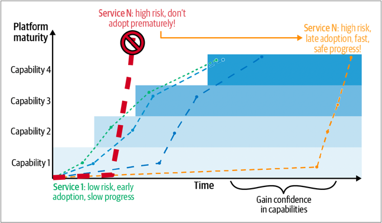

>译者：刘征

* [下载中文版 PDF 文件](/wp/enterprise-roadmap-to-sre-cn.pdf)
* [下载英文版 PDF 文件](/wp/enterprise-roadmap-to-sre.pdf)
* [从 Oreilly 阅读白皮书](https://www.oreilly.com/library/view/enterprise-roadmap-to/9781098117740/)
* [从 Google 下载白皮书](https://sre.google/resources/practices-and-processes/enterprise-roadmap-to-sre/)

一旦你建立了第一个 SRE 团队并掌握了这些原则，就该制定一套实践了。团队的实践由以下组成部分：成员能做什么、他们知道什么、他们拥有的工具，以及他们对这些工具的使用舒适度。

团队的任务和环境最初决定了他们的工作内容。通常情况下，这意味着那些“开发团队未做的一切”，可能是一些列危险的稳定性缺陷。通过将团队聚焦于部分运维职责，他们可以产生一个能力循环，随着时间的推移相互增强。如果将他们投入到一个未定义范围的复杂环境中，那么结果必然是琐事和沮丧。另一个常见的反模式是将 SRE 工作添加到已经超负荷的团队中。

团队的知识可以通过教育来扩展，无论是通过自我组织的还是企业集中组织的形式。应该鼓励团队定期举行团的内（间）的交叉培训会议，例如，每周一小时的会议，欢迎研讨任何关于生产环境的问题，无论是新成员还是资深成员都参与其中。如果问题有人能回答，则可以进行经验学习。如果没有人知道答案，可以转变为协作调查。根据我们的经验，这些会议对团队中的每个人都非常有价值。初级团队成员可以学习到新事物，资深成员也有机会传播他们的知识，通常还会发现一些大家都不知道的新事物。类似地，可以开展厄运之轮“Wheel of Misfortunes” 或桌面演练，在非正式的环境中，让团队成员讨论：他们在紧急情况下的角色和响应方式，对于让人们在无压力的环境下，更加舒适地接触生产环境非常有帮助。重现最近的所发生的故障是一个容易开始的起点。如果一个团队成员可以扮演指挥者的角色（会议主持人），并按照现实生产工作中的情况展示证据，其他团队成员就可以讨论：他们会怎么做和/或直接使用什么工具来调查事故发生期间的系统。

还应该鼓励团队：从开发团队那里获得更多，有关他们正在运维的系统的知识。这不仅是更好地理解现有系统的很好的练习，也是直接引入新监控工具、讨论和规划系统变更（如性能改进）或解决可伸缩性或一致性问题的机会。这些对话在建立团队之间的信任方面通常非常有价值。

团队的能力也可以通过引入新的第三方工具、开源软件工具或团队编写自己的工具来扩展。

## 从哪里开始？

在为我们的团队赋予新的能力时，应该从哪里入手呢？可靠性和 SRE 的领域非常广泛，并不是所有 SRE 都能适合于一个全新的团队。我们建议从一套能够帮助团队学习成长的，并有具体的下一步工作内容的实践开始。抽象地说，我们推荐使用所谓的“计划－执行－检查－行动（PDCA）”模型。通过根据系统当前的工作状态来决定下一步计划，你的每一步都将需要是能落地的。我们将在本章后面的内容里，解释如何构建这些能力的平台，以及建议从哪里开始。这些初期的能力将形成一个良性循环，团队就不必猜测：接下来应该构建或采用什么，他们将能够根据对系统的观察自然而然地得出下个迭代的工作内容的结论。

## 你的目标是什么？

设定适当的目标非常重要。并不是所有系统都需要达到“五个九”（99.999%）的超高可靠性。我们建议根据你的服务和应用的可靠性需求进行分类，并相应地设定投入水平。如我们之前提到的，记住每提升一个“九”成本可能是前一个“九”的十倍，即99.99%的成本可能是99.9%的十倍。虽然这个说法很难精确证明，但这个原则是成立的。因此，如果在没有深思熟虑的情况下，就盲目或过于广泛地设定目标，可能会让你的投入变得非常昂贵，并在投入中陷入新的困境。过分追求不必要的高可靠性目标也可能导致团队顶尖人才的流失。如果你的目的只是到达近地轨道，那就没有必要设定登月的目标。

确保你成功的路径是一个可循序渐进实现的目标，而不是期望通过一次性的大型项目或革命性变革来实现。在这里，渐进式改进才是关键。

当你的团队开始尝试新的实践时，确保记录下所取得的成果，并在团队内部及对外宣传这些成果。同行间的认可非常重要，可以通过在团队站立会议中表扬成员、在会议上让人们分享他们是如何避免灾难的、在内部通讯中发布近失事件，以及向整个组织展示如果没有采取预防措施会发生什么等方式来进行。庆祝这类工作成果非常重要，尤其是在过去没有这样做习惯的环境中。口头表扬和书面表扬可以与奖金或礼物相结合。即使是小礼物，也能产生很大的鼓励作用。

## 如何到达目标

不要制定一个长期且过于详细的计划，例如三年的详细规划。相反，你应该专注于确定前进的大方向。了解你的长期目标，但根据当前完成的任务来决定下一步。确立了方向之后，不必急于全面改变现有的团队和流程来适应新模式。相反，应该逐步引导团队步入正确的方向发展。

我们将这种方法称为“战争迷雾”策略，意味着你清楚最终的目的地，但也为途中可能遇到的任何小问题做好了准备。在这个过程中，短期规划和灵活性至关重要，尤其是在初期，迅速取得成效，并立即展示其影响力，对于一个刚刚起步的项目和团队的士气有着极大的积极作用。设定可达成的短期目标来解决当下问题，同时开始构建可通用、可复用的长期能力，让多个团队都能受益。通过构建一个能够提供这些能力的基础设施，你可以放大投资的影响力。我们将在本章后面进一步详细阐述这个平台和能力的概念。

组织内不同的产品开发团队在需求和现有能力方面都有所不同。在引入 SRE 时，你应当在参与模式（engamement model）上保持灵活，以适应各个团队的具体情况。通过理解产品团队的现状，你可以解决当前的问题，同时引入全组织范围的标准和最佳实践。当 SRE 团队刚开始运作时，如果有很多团队都想寻求他们的帮助，他们可能会感到负担过重。通过制定明确的参与“菜单”，你可以避免一次性的合作，或其他不可持续的合作模式。参与模式有几种类型，包括嵌入式、咨询式、基础设施支持等，这些在谷歌客户可靠性工程（CRE）团队的博客文章以及《Googel SRE 运维解密》的第32章中有很好的描述。

对于 SRE 的采用，明确的汇报结构在早期就很关键。我们建议建立一个独立的组织，并且 SRE 领导应在管理团队中拥有一席之地。通过将 SRE 的领导层与产品开发部门分开，SRE 团队将更容易专注于可靠性这个核心目标，而不会受到那些更关注速度和功能交付的团队的直接压力。然而，在这样做时，要避免形成一个孤立的“运维”部门，因为 SRE 与企业其他部分的紧密合作至关重要。开发团队应该与这些共享的 SRE 团队开展紧密合作的投入，从而确保从 SRE 团队获得的价值大于自行构建 SRE 功能。

## SRE 成功的关键

SRE 的成功不仅仅取决于实践方法，如服务水平目标（SLO）和事故回顾（postmortem）。这些实际上是创造 SRE 工作文化起步阶段的产物。因此，成功地采用 SRE 不仅需要模仿这些实践，还必须采纳一种兼容的文化才能取得成功。

这种文化建立在团队自身的信任和安全感之上。当团队负责控制重要系统时，他们必须感到在心理上是安全的。他们必须能够在不担心惩罚的情况下对同事和领导说“不”。他们必须感到自己的时间被重视，他们的意见受到倾听，他们的贡献得到认可。最重要的是，SRE 不应该感到自己比开发部门的同事更为“另类”或“次等”。基于历史上的原因 Dev 与 Ops 对立模型是一种常见陷阱。

无责事故回顾就是一个著名的例子。通过记录“出了什么问题”，团队可以协作地确定导致故障的各种因素，无论是技术问题还是程序问题。经常，当人为错误发生时，将错误归咎于“人的因素”可能很有诱惑力，但这已被证明是没有意义的，也不是改进系统的有效方式。相反，SRE 倡导无责文化。可以这样理解：系统应该让人很难犯错。应当有自动化和检查措施来验证操作者的输入，并且鼓励用同行审查（peer review）来促进双方的共识和协作。当人们在报告中自由地提及自己的名字，并且知道不会因为可能发生在任何人身上的简单错误而受到羞辱、降级或负面绩效评估时，这表明你已经实现了无责事故回顾。如果你看到事故回顾中使用了“工程师”或用“人员1”这样的表述，你可能认为这是一种良好的无责实践，但这实际上可能反映了潜在的文化问题，必须直接解决。如果文件中的名字被隐去并替换为“工程师”或“人员1”，但在事故回顾之外仍然对工程师进行指责，那么责任文化问题就没有得到解决。你绝对不应该自动化地从记录或文件中删除任何人的名字——由于这并不能解决根本的文化问题，只会使文件更加难以阅读和理解。与其表面上删除名字，不如直接解决潜在的文化问题，从而实现真正的无责文化。

一个不良文化的标志是*西瓜指标*：外表看似绿油油，实则内部问题重重。这类指标反映了团队的努力，它们被精心设计，看上去很美好，但实际上隐藏了真正的缺陷。这与古德哈特法则类似，即任何成为目标的指标就不再是好的衡量指标。例如，过分关注支持工单数量，或整体平均解决时间（MTTR）往往会被滥用，不管是故意的还是出于好意，但都不主动认知自己的错误。通过度量团队的活动，我们把这些活动变成了目标，而不是客户的成果。相反，团队应该定义自己的成功指标，这些指标直接反映了客户满意度、系统稳定性和开发速度等因素。

SRE 不应仅仅被视为“20%的时间”角色，而应该是组织内一个明确的职位和头衔。应该有一个公开的职业晋升路径，包括转岗要求和晋升期望。团队间的级别和薪酬应该公平对等。转岗不应该有任何显著的影响。

判断一个成熟的 SRE 团队是否成功的好方法是：观察人员转入和转出SRE的情况。确保人员转移是常规的且没有任何官僚主义或限制，这样你可以快速了解人们是否感到在 SRE 团队中“被困”，或者它是否是一个理想的角色。通过观察从开发转移到 SRE 的自愿转移率，你可以判断这一角色是否吸引人。

SRE 必须知道他们的时间是被重视的，尤其是当他们的工作需求超出了“正常工作时间”。例如，在谷歌，当 SRE 需要在正常工作时间以外值班时（即“on-call”），他们应该获得加班费补偿。谷歌的一些团队允许值班工程师在金钱补偿和休假之间二选一，按值班时间的一定比例看，通常设置一个值班时间的上限。不应该对一个团队提出超出其交付能力的需求，因此，确保值班池足够大是很重要的。常见的错误是：仅将值班池限定为 SRE 人员，这是不必要的限制。值班池也应该是基于自愿加入的。一旦团队感觉他们的时间被滥用，就会导致士气的迅速下降。

另一个文化抓手是规划和目标设定。由于 SRE 最接近生产问题，他们通常很清楚最重要的是什么，哪些问题最紧急，哪些问题造成了最大的痛苦。允许 SR E团队设定自己的优先级和路线图，你就赋予了团队权力，他们将会更加有效率和愉快的工作。管理层应遵循共同制定，并达成对预期成果的共识的做法。业务需要加速开发吗？用户需要更快获得发布结果（新版本）吗？一个常见的反模式是泰勒主义，即领导者专权设定和优先考虑详细的计划和任务，然后将它们分配给下属。

## 构建能力平台

SRE 团队可以构建一个平台，向合作团队提供能力，理想情况下，随着时间的推移，他们的贡献将扩展到整个组织。通过在共享服务、实践、规范和代码中引入弹性机制，这些团队可以开发出由：自动化、代码、共享库、管道、流程、规范、文档、手册组成的共享平台，甚至包括那些只存在于人们头脑中的特殊未记录知识。与其让每个团队都试图创建自己的最佳实践，不如将这些实践融入到平台中。产品可以从头在平台上构建（所谓的“数字原住民”），也可以移植到平台上。随着平台能力的增长，团队对其操作特性越来越有信心和体感舒适，逐渐将更加关键的工作负载都可以迁移过来。通过采纳这种将能力编码到平台中的模型，SRE 团队可以通过将能力同时应用到多个服务中来放大他们的影响力。平台是一个内部产品，应该像产品一样进行管理，将服务团队视为客户，接受功能请求，并跟踪缺陷（见图4-1）。

当一个 SRE 团队开始来构建这个平台时，他们会面临一个问题：“首先应该构建什么能力？”通过分析前期采用 SRE 的低风险服务，你就可以将需求列表最小化为一个最小可行产品（MVP）。随着时间的推移，你会添加更多的能力。但下一步是什么呢？有两个来源：你的开发人员和你的环境。也就是说，根据他们的需求来构建，例如，“我们需要一个消息总线！”以及根据你所知道他们将需要的来构建，例如，“必须有一个可扩展的服务发现系统，否则这将无法工作。”

对于环境所需的能力，这些通常包括：

* 对 DevOps 进行优化改进，例如：增强软件开发生命周期（SDLC），更快、更安全地发布更多代码；
* 可靠性工程的改进：最小化那些已经潜伏于系统中的错误带来的风险。

为了增强可靠性工程，我们推荐在团队中培养一种持续改进的机制。如果你不确定应该从哪里开始，可以从分析已经发生的系统中断事故入手，采取以下措施：

* 制定服务水平目标（SLO），明确可接受的系统性能标准。
* 建立一套正式的事故响应流程，确保在发生故障时迅速有效地响应。
* 开展无责任的事故回顾和审查，鼓励团队成员坦诚地分析问题，而不担心受到指责。
* 利用风险建模来确定改进的优先顺序，确保优先处理最关键的风险点。
* 使用错误预算或其他风险管理方法，来消化待解决的可靠性问题，以保持系统的整体稳定性。

让这种持续改进成为推动团队不断创新的动力。例如，如果有一次的部署导致了整个服务器群的宕机，你可能需要探索减少此类风险的方法，比如通过限制影响范围、实施金丝雀发布，或使用其他灰度（渐进式）部署策略。如果发现了内存泄露问题，你可以在部署的前置流程中加入新的压力测试方法。这些新能力将被集成到你的基础设施平台中，为平台上的每项服务提供额外的保护和收益。随着这些通用的缓解策略逐步的证明了它们的价值，单次修复的情况将会大幅降低。

## 领导力

想要构建一个这样的技术平台，你就需要投入宝贵的工程资源，这些资源本可以用于开发新的业务功能。这就要求从基层到高层都需要施必要的加影响力。在功能开发和系统稳定性之间进行权衡时，决策者必须具有全局视野并得到适当的激励。我们越来越多地看到“首席可靠性官”这一职位，他们在组织内应当占有一席之地，参与制定战略性的可靠性决策（这一概念在马克·施瓦茨的《在桌边》一书中有所讨论）。虽然这是 SRE 成功实施的关键角色，但并不是一个常见的职位名称，通常是现有高管的额外职责。

**了解效果**

一个运作良好、重视可靠性的组织会展现出几个明显的特征。首先是面对可靠性问题时，能够及时缓解或暂停新功能的发布。如果唯一目标是快速发布，可靠性和其他非功能性需求就会被牺牲。你的组织是否总是将可靠性工作位居新功能开发之后？是否有因“时间不足”而永远无法完成的项目？重要的是，这并不意味着：你应该放慢代码交付流程的速度，而是保持持续的推进。

另一个成功的迹象是，个体英雄主义不再受到赞扬，反而积极的劝阻。当系统的成功依赖于少数人的担当时，团队就会形成一种不可持续的英雄主义文化，这种文化终将崩塌。英雄们会被鼓励独占特定领域知识，而不愿意去系统地预防问题的发生。这与《凤凰项目》一书中的布伦特角色类似。依赖个体英雄不仅效率低下，而且可能非常危险。团队必须积极阻止个体英雄行为的发生，同时保持团队责任感，因为英雄主义在短期内看似合理，但实际上不可取。

一个表现良好的团队还会在出现中断前就对可靠性工作进行投资，并作为主动规划的一部分。在表现不佳的团队中，我们看到仅在发生一系列中断之后，才开始对可靠性进行投资。虽然这可能是必要的增加，但这种投资需要长期维持，而不是被视为一次性的应对措施或在情况好转后就被撤销。

进一步说明，设想你的组织对于可靠性有两种不同的态度：和平时期和战时。它们分别对应于“一切正常”和“所有人都知道问题即将爆发”。通过区分这两种状态，你可以做出关于投资的决策。在战时，你会在平台的隐性特性、基础设施、流程和培训上投入更多的时间和金钱。而在和平时期，你也不会放弃这些工作，但你肯定会减少投资。

然而，谁决定公司何时进入战时？这个决定是如何做出的？它如何在整个公司传达，而不造成恐慌或人才流失？一种方式是使用优先级代码，比如黄色警报或红色警报。这些是帮助团队确定工作优先级的组织实践。黄色警报意味着在一个季度内，当前的技术问题可能会变成一定的业务紧迫性。红色警报则表示问题可能在几天内发生，或者是已经存在的稳定性威胁。这些警报应该有明确的标准，所有领导团队成员都必须理解并同意这些标准。宣布这些警报必须得到领导层的批准才能产生预期效果。这些警报的结果应该是改变团队当前的工作优先级，可能会暂停现有的工作（如红色警报的情况），批准大批量投入，并能够直接协调其他团队来提供帮助。优先级警报对企业来说是一项代价昂贵的操作，因此你应该确保它们有明确的预期结果。这些结果应该在一开始就定义好退出标准，并在完成时清晰地传达出结束的信号。否则，团队会经历信号疲劳，而不再进行适当的响应。

**选择投资于可靠性**

那么，作为一个可靠性领导者可能会做出哪些较不戏剧性的改变呢？这将涉及政策和投入。当政策是从基层向上的推动时，那么设置的全组织范围政策往往会是不一致的。如果存在一个领导的角色，由他来进行审核、消除重复、批准和传播这些政策，那将更为有效。同样，公司的资金支出，包括人员、硬件、软件、差旅和服务，通常是以分层的方式进行的。

在构建前面提到的结构之前，必须考虑组织内可靠性的价值。为了使其有意义，组织必须将可靠性视为一项投资，甚至是业务产品差异化的竞争因素，而不是成本中心。应该明确可靠性是最重要的隐性产品特性。一个不可用、卡顿或充满 bug 的产品，无论具有多么丰富的功能，对客户的价值都会大打折扣。想要设定这个方向，你必须在高层进行操作，以确保持一致性，特别是：如果这是一个新的方向。

一个简单的论点是，可靠性还可以作为更容易理解的概念的代名词，例如代码质量。如果系统出现了用户可见的问题，那么诸如灰度变更等可靠性实践的应用，就可以使系统在直接解决代码质量问题之前，让最终用户感觉更加稳定。例如，通过只对1%的用户发布带有缺陷的版本，那么99%的用户就不会发现问题。这使得系统看起来比实际上好100倍，并显著的降低了支持成本和声誉的损害。

**做出决策**

在你将可靠性设定为对更强大产品的投资后，你就可以制定更长远的计划了，并会产生更大的影响。传统模式将 IT 视为成本中心，完全倾向于随着时间的推移逐渐降低成本投入。但最终，如果服务不可用了，无论它的后续运维成本是多么的廉价都将失去意义。你仍然可以实施成本的削减，但应该是在实现了可靠性目标之后再予以考虑。如果你发现维持所设定的可靠性目标的成本过高，你可以明确重新定义这些目标——比如，降低一个“9”的标准——并评估由此产生的权衡。

要实现这些目标，你可能需要说服某个管理委员会、决策者群体或高层管理。你需要他们的支持，以便随着时间推移为供给和维护团队，提供必要的资源，并培训及进一步发展团队成员。这应该被视为长期投资，并明确得到相应的资金支持，而不是隐藏在其他预算项里。

>反模式：忽略奥德修斯
>在涉及可靠性时，一个常见的反模式是让停机或其他“坏消息”影响你的计划周期，即使这些情况是预期的。领导层在面对坏消息时，往往会感到需要“做点什么”，而“坚持计划”通常看起来没有影响力。然而，如果计划已经考虑到了停机，除非对系统的理解发生重大变化，否则“坚持计划”正是正确的做法。“奥德修斯契约 (Ulysses pact)”这个术语在这里是一个有用的例子。领导者奥德修斯告诉他的团队在他被绑在桅杆上时，坚持计划，驶过塞壬。当他的团队坚持计划（尽管他在挣扎和乞求停下），他表扬了他们。他们没有被短期思维所诱惑。他们的计划考虑了长期影响，并在混乱开始前制定了一个清晰的计划。
>如果允许团队在当下做出决定，你往往会选择忽略一个好的计划，而做出情绪化或以自我为中心的选择。一个经典的例子是领导者介入故障处理中，而没有全面了解情况，尽管一个有能力的团队已经在控制局势。这通常是公司文化的结果。一种高薪人员的意见 (HiPPO) 文化可能对事件管理和整体可靠性产生极其不利的影响。相反，听从奥德修斯，坚持计划，不要弃船。这不仅适用于事件响应，还适用于错误预算耗尽或在面对“非常糟糕”的事件时跟踪 SLO。如果你的计划是在错误预算耗尽时停止功能发布，但你每次都为“这个重要功能”做例外，你的领导力将受到严重削弱。一个有效的改善措施是引入“银弹”，即领导者被授予三颗银弹，用于在必要时覆盖预期计划。通过引入这种人为的稀缺性，领导者必须做出明确的权衡。同样，如果单一的坏事件消耗了一个 SLO，不要忽略它。召集团队分析这如何改变你们对系统的共同理解。这种类型的故障以前从未被考虑过吗？对故障的响应是否不足？

>反模式：同时采用
>另一个反模式是尝试在不进行修改的情况下混合旧模型和新模型。这会使团队偏离正确的方向，应避免这种情况。例如，在 ITIL 问题管理中，通常期望一个中心团队通过问题经理来减少问题的原因并缩短解决时间。相比之下，SRE 期望嵌入的工程师通过事后总结和评审来推动他们自己的问题解决。虽然结果仍然一致（更少且更短的停机时间），但方法和角色大不相同。尝试同时做这两件事，你最终会陷入混乱，并且这两种方法的预期结果相互冲突，效果不佳。
>我们称这些 SRE 和非 SRE 原则的糟糕混合为“有毒组合”，类似于医学术语中指的不良药物混合。单独使用时每种原则可能是有益的，但两者结合在一起会导致意外的坏结果。我们经常发现使用两者的初衷是好的，通常是为了让现有员工参与进来，或者为了报告的连续性。然而，这种做法的吸引力远不及其带来的更糟的结果：更长的停机时间，更多的琐事和更低的可靠性。

## 人员配置和留任

在人员配置和角色定义上也可能出现反模式。在建立 SRE 团队时，很容易会选择从外部聘请 SRE 来对现有团队进行整顿。但这实际上可能导致精力的浪费，通常新聘请的 SRE 无法理解团队或现有技术的细微差别，回归到应用以前使用的方法，而不知道这些方法在新工作中是否合理。

我们建议将现有团队发展成 SRE 团队。仅仅重新命名是不够的，但提供一个结构化的学习路径和一个成长和发展的环境肯定是有效的。当然，有些情况下过渡可能会失败。如果个人没有被设置在一个成功的环境中，而是被期望仅通过“阅读书籍”立即成为高级 SRE，他们可能会感到沮丧并寻找其他工作。同样，一些工程师看不到变革的理由，没有激励机制，或者非常抵制接受新角色。通过提供带薪教育、时间和学习的空间，并提供背景信息帮助团队理解变革的必要性，你可以成功地将团队过渡到 SRE 角色。这需要时间、精力和耐心。在过渡不成功的情况下，进行离职面谈是很重要的，特别是要解决过渡的问题，个人的感受和效果。你可能会发现你的计划中的缺陷，或发现它没有按你预期的方式执行。最后，当你要求团队做更复杂且影响更大的工作时，请注意这确实是更高价值的工作，团队应该为此获得相应的报酬。也就是说，当你的团队开始像 SRE 那样运作时，你应该支付他们 SRE 的薪酬，否则他们会转到能这样做的地方去。如果你提供团队学习高价值技能的机会，而他们离开去别处使用这些技能，你只能责怪自己。

## 技能提升

在培养和过渡现有员工成为 SRE 时，制定一个技能提升计划至关重要。这包括“需要哪些技能”和“如何获得这些技能”——即角色需要的技能以及如何使员工掌握这些技能。技能差距分析和调查等工具在这方面非常有用，用来核实对工作所需基础技能的假设。这些技能在 SRE 文献中往往没有具体提及，但它们对于 SRE 在全组织范围内扩大贡献至关重要。例如，传统运维团队对软件工程基础（如版本控制、单元测试和软件设计模式）不熟悉并不罕见。确保这些基本技能包含在你的技能提升计划中，并针对每个学习者的特点进行调整至关重要，这不仅是为了在团队中建立足够的技能基础，还为了为个人提供一个顺利过渡到新角色预期的路径（从而减少团队成员的流失）。

Feature picture ❤️ Anete Lusina: <https://www.pexels.com/photo/miniature-toy-car-on-top-of-monopoly-board-game-4792380/>
