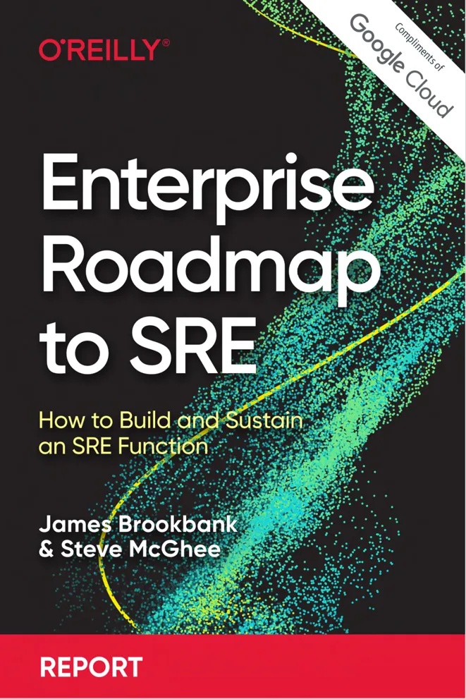

* [Read from Oreilly](https://www.oreilly.com/library/view/enterprise-roadmap-to/9781098117740/)
* [Download from Google](https://sre.google/resources/practices-and-processes/enterprise-roadmap-to-sre/)
* [Download PDF](/wp/enterprise-roadmap-to-sre.pdf)

The document is a book titled "Enterprise Roadmap to SRE," authored by James Brookbank and Steve McGhee, which provides guidance on how to build and sustain a Site Reliability Engineering (SRE) function within large and complex organizations. Here is a summary translation of the key points mentioned in the document:

**Preface**
The book builds upon two previous works from Google, "Site Reliability Engineering" and "The Site Reliability Workbook," offering a deeper dive into the challenges of adopting SRE in large enterprises. Despite the growing popularity of SRE, there is a notable gap between enthusiasm and adoption levels within enterprises. The authors argue that reliability is increasingly a key differentiator for businesses.

**Chapter 1: Getting Started with Enterprise SRE**
The chapter discusses how to introduce SRE into an existing enterprise by evaluating the current environment, setting expectations, and ensuring a strategic approach to SRE implementation.

**Chapter 2: Why the SRE Approach to Reliability?**
This chapter explores why enterprises aim to build SRE teams or pursue reliability, highlighting that reliability is often the most desired product feature since a non-operational product cannot leverage any of its features.

**Chapter 3: SRE Principles**
Before delving into specific practices, the authors emphasize the importance of principles, which form the foundation of the transformation and guide decision-making. Key principles include embracing risk, service-level objectives (SLOs), eliminating toil, monitoring distributed systems, and more.

**Chapter 4: SRE Practices**
With an established SRE team and an understanding of the principles, the development of a set of practices can begin. These practices are shaped by the team's capabilities, knowledge, tools, and comfort levels.

**Chapter 5: Actively Nurturing Success**
The authors provide advice on ensuring the success of SRE within an organization, emphasizing iterative and incremental changes, building sustainable and happy teams, and acknowledging the dynamic nature of SRE.

**Chapter 6: Not Just Google**
The authors share conversations with three SRE leaders from different industries who have adopted SRE in various forms, offering unique insights into the adoption process and its effectiveness in different organizational contexts.

**Conclusion**
The authors express hope that the report will aid enterprises in adopting SRE, leading to more reliable technology experiences. They suggest that success is more likely if SRE principles are clearly defined and mapped to practices and capabilities, with a focus on growth and nurturing within the team.

**About the Authors**
James Brookbank is a cloud solutions architect at Google, focusing on solving complex technical problems and providing architectural guidance. Steve McGhee is a reliability advocate, helping teams build and operate reliable services. He spent over a decade at Google as an SRE, managing engineering teams globally.

Please note that this is a brief summary translation, and the document contains much more detail and in-depth discussion. For a more detailed translation, please let me know.

Feature picture ❤️ Anete Lusina: <https://www.pexels.com/photo/miniature-toy-car-on-top-of-monopoly-board-game-4792380/>
