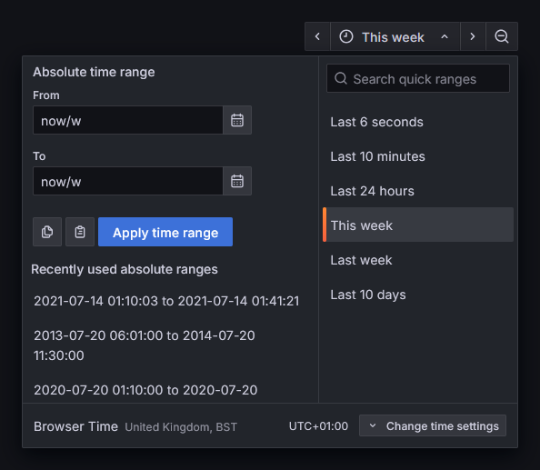
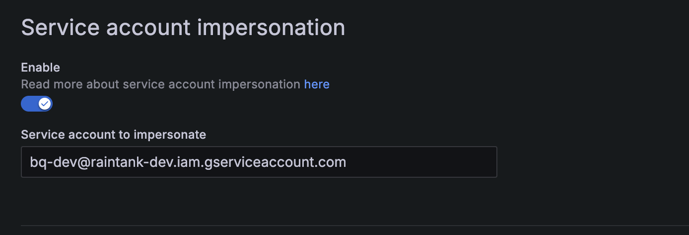

最新版本带来了多项新功能，简化了 **Grafana 实例（Grafana instances）** 的管理方式，也优化了 **告警规则（alert rules）** 的管理体验，方便你快速定位所需的告警内容。此外还有更多改进。

以下是本次 Grafana 版本的一些亮点。如果你想了解本次发布的全部更新内容，请参考 [更新日志](https://github.com/grafana/grafana/blob/main/CHANGELOG.md) 或 [新版功能文档](https://grafana.com/docs/grafana/latest/whatsnew/whats-new-in-v12-1/?pg=blog&plcmt=body-txt&src=li&mdm=social&camp=blog)。

## Grafana Advisor：智能化运维监控

我们一直在探索降低运维负担的方法，帮助你更高效地进行维护与故障排查。因此，在 Grafana 12.1 中，我们很高兴地宣布 [Grafana Advisor](https://grafana.com/whats-new/2025-07-22-keep-instances-running-smoothly-with-grafana-advisor/?pg=blog&plcmt=body-txt&src=li&mdm=social&camp=blog) —— 一个用于帮助管理员保持 Grafana 实例稳定和安全运行的监控工具 —— 现已进入公开预览阶段。

**Grafana Advisor** 最初在 Grafana 12 中作为实验性功能推出，如今它能够自动对你的 Grafana 服务器执行定期健康检查，提供可操作的洞见与建议，帮助你维持系统的最佳运行状态。


目前，**Grafana Advisor** 会定期检查 **数据源连接（data source connections）**、**插件（plugins）** 和 **SSO 设置（SSO settings）**，未来版本中我们计划扩展其功能范围。

在 **Grafana Cloud** 中，Advisor 默认启用。若要在 **Grafana OSS** 与 **Enterprise 版** 中启用该功能，可通过配置开关 `grafanaAdvisor` 实现。详情请参见我们的 [技术文档](https://grafana.com/docs/grafana/latest/administration/grafana-advisor/?src=li&mdm=social&camp=blog)。

## 告警功能的重大升级

告警是任何可观测性策略中的关键组成部分。在 Grafana 12.1 中，我们带来了几项新的告警功能，包括重新设计的 **告警规则列表页面（alert rule list page）**，帮助你以更可扩展、直观的方式管理告警。

### 全新设计的告警规则列表页面

*适用于所有版本的 Grafana*

在 [Grafana Alerting](https://grafana.com/docs/grafana/latest/alerting/?src=li&mdm=social&camp=blog) 中，一个 [告警规则（alert rule）](https://grafana.com/docs/grafana/latest/alerting/fundamentals/alert-rules/?src=li&mdm=social&camp=blog) 定义了触发告警的评估条件。你可能拥有数百甚至上千条这样的规则，而在本次发布中，我们通过完全 [重新设计的规则列表页面](https://grafana.com/whats-new/2025-07-15-alert-rule-list-page-updates/?src=li&mdm=social&camp=blog) 让浏览管理更加轻松。

新版页面整体提供了更流畅、更快捷、更灵活的使用体验。它支持两种视图模式，满足不同使用场景：

- **分组视图（Grouped view）**：按命名空间组织，便于深入查看特定规则组。
- **列表视图（List view）**：展示所有告警规则的完整列表，支持快速搜索与过滤。近期的性能优化大幅提升了使用效率。

我们还对界面进行了简化，聚焦于“管理告警规则”这一核心任务。现在你将看到一个更简洁、更清晰的视图，仅显示最关键的信息字段，包括 **规则名称（rule name）**、**所属位置（location）**、**类型（type）** 和 **状态（state）**。

此外，我们还为规则列表页面引入了新的分页 API，使管理操作更轻松便捷。无论你是希望查看结构化的告警规则层级，还是需要快速检索和筛选成千上万条规则，现在都能获得更简洁、更流畅的体验。

对于 **Grafana Cloud 用户**，我们正逐步向所有实例推出新版规则页面；对于 **Grafana OSS 用户**，当前可通过功能开关启用。请在 Grafana 配置文件的 `feature_toggles` 部分中添加开关 `alertingListViewV2`：

```yaml
[feature_toggles]
alertingListViewV2 = true
```

重启 Grafana 后，即可访问新版规则列表页面。

### 支持 Prometheus YAML 文件导入规则

我们近期还 [新增支持](https://grafana.com/docs/grafana-cloud/alerting-and-irm/alerting/alerting-rules/alerting-migration/?src=li&mdm=social&camp=blog)：可以将由数据源管理的规则导入为由 Grafana 管理的告警规则（Grafana-managed alert rules）。不过，以前用户在没有配置 ruler 的情况下，无法导入现有的 **Prometheus 规则（Prometheus rules）**。

而在 Grafana 12.1 中，你现在可以直接 [通过 Prometheus YAML 文件导入规则](https://grafana.com/whats-new/2025-06-02-add-ability-to-import-rules-to-gma-from-prometheus-yaml/?pg=blog&plcmt=body-txt&src=li&mdm=social&camp=blog)，并使用同一套 Alerting UI 完成配置。


### 引入“活动时间区间”（active time intervals）

在本次告警功能更新中，我们将原先的 [静默时间区间（mute time intervals）](https://grafana.com/docs/grafana/latest/alerting/configure-notifications/mute-timings/?src=li&mdm=social&camp=blog) 重命名为 [活动时间区间（active time intervals）](https://grafana.com/whats-new/2025-07-09-active-time-intervals-in-grafana-alerting/?pg=blog&plcmt=body-txt&src=li&mdm=social&camp=blog)，以更准确地反映其用途 —— 即定义告警“何时应当触发”。

如需进一步了解 Grafana 告警功能中的这些改动和其他更新，请查看我们的 [官方文档](https://grafana.com/docs/grafana/latest/alerting/?pg=blog&plcmt=body-txt&src=li&mdm=social&camp=blog)。

## 用更灵活的方式查询与可视化数据

无论你是想深入分析某项指标，还是构建复杂的仪表盘，这些新功能都将帮助你以更符合需求的方式探索数据。

### 趋势线转换（Trendlines transformation）

*适用于所有版本的 Grafana*

在 Grafana 中，[转换操作（transformations）](https://grafana.com/docs/grafana/latest/panels-visualizations/query-transform-data/transform-data/?src=li&mdm=social&camp=blog) 是一种强大手段，用于在系统进行可视化之前处理查询返回的数据。Grafana 12.1 中新增了一个全新的转换类型：[趋势线（trendlines，也称回归分析）](https://grafana.com/whats-new/2025-07-21-transformations--regression-analysis/?pg=blog&plcmt=body-txt&src=li&mdm=social&camp=blog)。

这一新转换会对任意数据集拟合一个数学函数 —— 支持线性或多项式回归 —— 以预测原始数据中未直接体现的某一时间点的数值。

换句话说，你可以基于统计模型生成一个新序列，用于表示趋势线中的预测值。这在处理波动剧烈、难以洞察趋势的数据时尤为有用。

你可以在 [Grafana Play 示例](https://play.grafana.org/goto/9o1-SMyNg?orgId=1&src=li&mdm=social&camp=blog) 中查看这一转换的实际效果，或在我们的 [文档](https://grafana.com/docs/grafana-cloud/visualizations/panels-visualizations/query-transform-data/transform-data/#regression-analysis?src=li&mdm=social&camp=blog) 中了解更多细节。


### 可视化操作中支持自定义变量

*适用于所有版本的 Grafana*

我们很高兴地宣布，你现在可以在 [可视化操作（visualization actions）中定义自定义变量](https://grafana.com/whats-new/2025-07-14-custom-variable-support-in-visualization-actions/?pg=blog&plcmt=body-txt&src=li&mdm=social&camp=blog) 了。

当你触发一个 [操作（action）](https://grafana.com/docs/grafana/latest/panels-visualizations/configure-data-links/#actions?src=li&mdm=social&camp=blog)（例如调用 API 创建支持工单）时，系统会提示你填写这些变量的值。这样一来，操作变得更加动态、交互性更强，你无需修改仪表盘配置就能实时定制请求内容。

这项功能在触发告警、过滤 API 调用，或将用户定义参数传递给外部系统时尤其有用。

### 仪表盘支持服务器配置的快捷时间范围

*适用于 Grafana OSS 与 Grafana Enterprise*

Grafana 服务器管理员现在可以为仪表盘的 [时间选择器（time picker）](https://grafana.com/grafana/plugins/williamvenner-timepickerbuttons-panel/?src=li&mdm=social&camp=blog) 定义自定义的时间范围预设。这一功能非常适合那些需要经常分析特定上下文时间窗口的团队。



*服务器配置时间范围的截图*

只需在你的 [服务器配置](https://grafana.com/docs/grafana/next/setup-grafana/configure-grafana/?src=li&mdm=social&camp=blog) 文件中配置 `[time_picker] quick_ranges`，即可根据监控数据的实际情况设置全局默认值。

```yaml
[time_picker]
quick_ranges = """[
{"from":"now-6s","to":"now","display":"Last 6 seconds"},
{"from":"now-10m","to":"now","display":"Last 10 minutes"},
{"from":"now-25h","to":"now","display":"Last 24 hours"},
{"from":"now/w","to":"now/w","display":"This week"},
{"from":"now-1w/w","to":"now-1w/w","display":"Last week"}
]"""
```

特别感谢社区成员 Chris Hodges [为该功能贡献代码](https://github.com/grafana/grafana/pull/102254)！


### 增强的自定义货币格式

*适用于所有版本的 Grafana*

你现在可以 [显示精确的财务数值](https://grafana.com/whats-new/2025-06-12-enhanced-custom-currency-format--display-exact-financial-values/?pg=blog&plcmt=body-txt&src=li&mdm=social&camp=blog)（或按需缩写），以便更灵活地控制仪表盘中的展示方式。

此前，Grafana 会自动缩写较大的货币数值 —— 例如 `$1,235,667` 会显示为 `$1.24M`，`$555,558` 会变成 `$555.6K`。虽然这种方式适用于大多数可视化场景，但财务数据往往需要显示精确数值。

为此，我们增强了自定义货币格式。你现在可以使用 `currency:financial:<unit>` 格式完整显示数字。例如：使用 `currency:financial:$` 会将 `1235667` 格式化为 `$1,235,667`，而非 `$1.24M`。

财务格式还支持灵活的货币符号位置，包括：

**前缀**（默认）：`currency:financial:$` 会显示为 `$1,235,667`

**后缀**：`currency:financial:€:suffix` 会显示为 `1,235,667€`

### Microsoft Entra Workload Identity 支持

*适用于所有版本的 Grafana*

Grafana 现在 [支持 Microsoft Entra Workload Identity](https://grafana.com/whats-new/2025-07-15-entra-workload-identity-support/?pg=blog&plcmt=body-txt&src=li&mdm=social&camp=blog)，显著增强了基于联合凭据的身份验证能力。该更新简化了 OAuth 流程，并提升了在 Microsoft Azure 上运行 Grafana 实例的安全性。

关于 Entra ID（前身为 Azure AD）身份验证配置的更多信息，请参见我们的 [官方文档](https://grafana.com/docs/grafana/next/setup-grafana/configure-security/configure-authentication/azuread/?pg=blog&plcmt=body-txt&src=li&mdm=social&camp=blog)。感谢社区成员 [mehiglow](https://github.com/mehighlow) 对该功能的宝贵贡献！

## Grafana 扩展性：数据源新增功能

在 Grafana Labs，我们始终相信 —— 不论你的数据存储在哪里，你都应该能够查询和可视化它。因此，我们持续扩展并改进 Grafana 的数据源支持能力。

以下是最新的数据源相关更新。


### 可视化 LogicMonitor 数据

[LogicMonitor](https://www.logicmonitor.com/) 是一个可观测性平台，提供基础设施监控、AIOps 和 IT 运维洞察。现已进入公开预览阶段，全新的 [LogicMonitor Devices Enterprise 数据源](https://grafana.com/grafana/plugins/grafana-logicmonitor-datasource/?src=li&mdm=social&camp=blog) 让你可以在 Grafana Cloud 或 Grafana Enterprise 中直接查询与可视化 `Device Instance Data`，以及列出 `Devices`、`Datasources` 和 `Instances`。

你可以在我们的 [官方文档](https://grafana.com/docs/plugins/grafana-logicmonitor-datasource/latest/?src=li&mdm=social&camp=blog) 中了解如何使用与安装该数据源。如需全面了解 Enterprise 数据源，请参考这篇 [指南](https://grafana.com/blog/2024/05/13/grafana-enterprise-data-source-plugins-a-brief-guide-to-what-they-are-and-how-to-get-started/?src=li&mdm=social&camp=blog)。

### BigQuery 数据源支持服务账号模拟（Service Account Impersonation）

为提升安全性，Google 建议使用服务账号令牌配合 [服务账号模拟（Service Account Impersonation）](https://cloud.google.com/iam/docs/service-account-impersonation)。一旦服务账号令牌遭到泄露，若未关联可模拟的服务账号，该令牌将无法访问 Google Cloud API，从而显著降低未授权访问的风险。

这一额外的安全层级现已在我们的 [BigQuery 数据源](https://grafana.com/grafana/plugins/grafana-bigquery-datasource/?src=li&mdm=social&camp=blog) 配置中 [正式支持](https://grafana.com/whats-new/2025-06-18-support-for-service-account-impersonation-in-bigquery/?src=li&mdm=social&camp=blog)，可有效防止令牌泄露后被滥用。目前该功能已全面开放。




你可以通过我们的 [插件目录](https://grafana.com/grafana/plugins/grafana-bigquery-datasource/?src=li&mdm=social&camp=blog) 或这篇 [最新博客文章](https://grafana.com/blog/2025/06/18/visualize-google-cloud-bigquery-data-in-grafana-the-latest-updates-key-features-and-more/?src=li&mdm=social&camp=blog) 深入了解 Grafana 中 BigQuery 数据源的使用方式。

如需查看 Grafana 中全部新增功能，请参阅我们的 [官方文档](https://grafana.com/docs/grafana/latest/?pg=blog&plcmt=body-txt&src=li&mdm=social&camp=blog)、[更新日志](https://github.com/grafana/grafana/blob/main/CHANGELOG.md)，或 [新版亮点文档](https://grafana.com/docs/grafana/latest/whatsnew/whats-new-in-v12-1/?pg=blog&plcmt=body-txt&src=li&mdm=social&camp=blog)。
