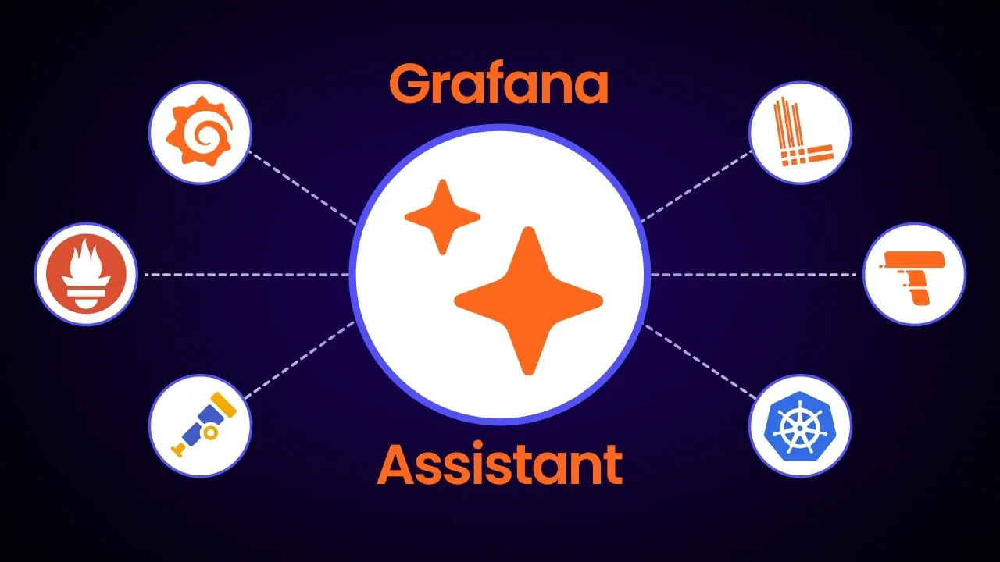
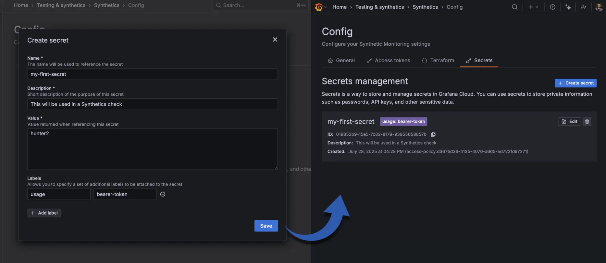
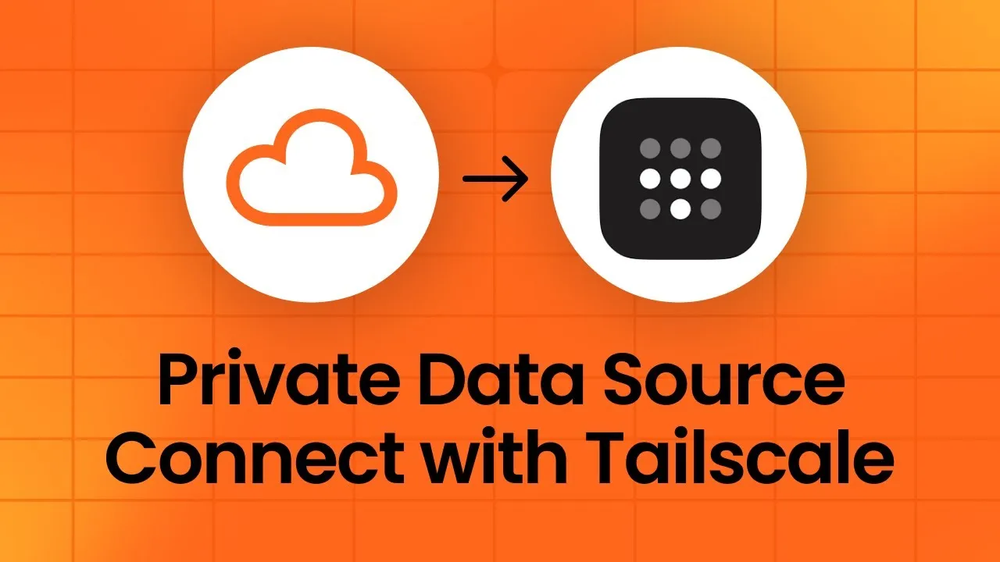
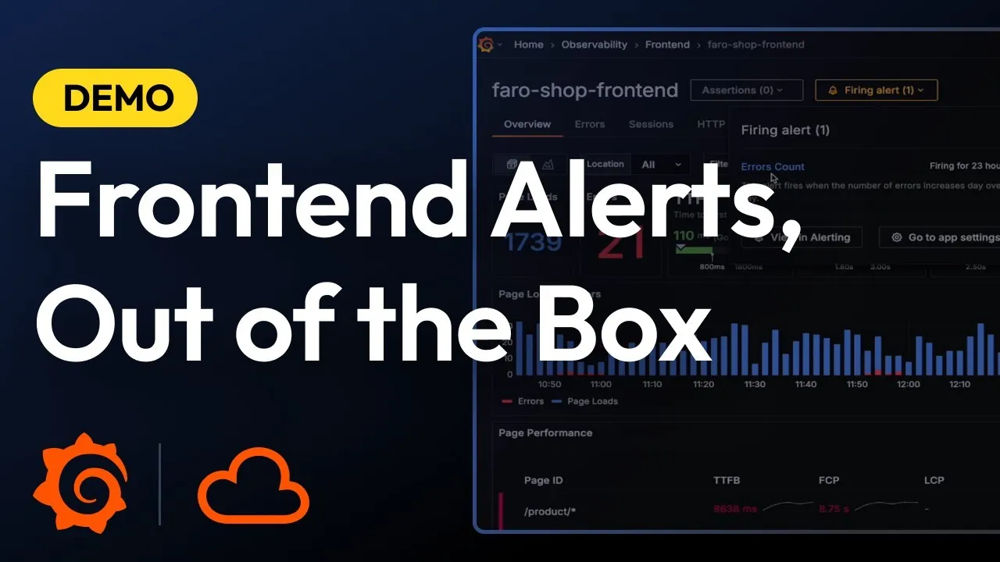
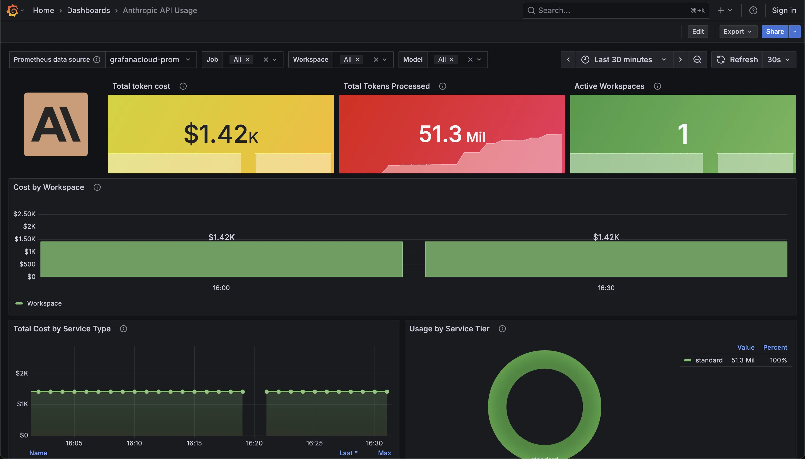
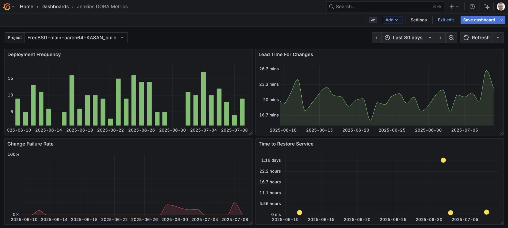

>From: [Grafana Labs Blog](https://grafana.com/blog/2025/08/20/grafana-cloud-updates-onboard-teams-with-new-ai-powered-tooling-secrets-management-for-enhanced-security-and-more/)

我们持续为 Grafana Cloud 推出实用更新和新特性。Grafana Cloud 是一款由开源的 Grafana LGTM Stack 提供支持的全托管可观测性平台，其中包括 [Loki](https://grafana.com/oss/loki/?pg=blog&plcmt=body-txt)（日志）、[Grafana](https://grafana.com/oss/grafana/?pg=blog&plcmt=body-txt)（可视化）、[Tempo](https://grafana.com/oss/tempo/?pg=blog&plcmt=body-txt)（链路追踪）和 [Mimir](https://grafana.com/oss/mimir/?pg=blog&plcmt=body-txt)（指标监控）。

还不是 Grafana Cloud 用户？[立即注册](https://grafana.com/auth/sign-up/create-user/?pg=blog&plcmt=body-txt) 账户，使用我们的 Cloud Free 免费计划即可试用所有功能。

## 更轻松上手 Grafana Cloud：Grafana Assistant 现已开放公开预览

在 Grafana Labs，我们始终[坚信](https://grafana.com/blog/2025/08/14/ai-in-observability-at-grafana-labs-making-observability-easy-and-accessible-for-everyone/)，AI 不只是可观测性领域的一时潮流，它将在未来成为保障系统稳定运行的重要基石。

这一理念也持续推动我们构建新的工具。例如，本月我们很高兴宣布：Grafana Assistant——一款嵌入于 Grafana Cloud 的 AI 助手，现已进入公开预览阶段。它支持自然语言操作，帮助你更高效地进行查询、构建和故障排查。

Grafana Assistant 可简化常见的工作流程，比如编写 PromQL、LogQL 或 TraceQL 查询，以及创建仪表盘等，同时始终让你掌控操作过程。它能帮助你减少重复性工作，提升整体效率，包括：

- 更快速地编写和调试查询语句  
- 构建并优化可视化仪表盘  
- 排查系统问题与异常  
- 分析观测数据中的趋势与模式  
- 更直观地使用 Grafana 界面  
- 降低团队上手门槛，加速使用流程  

想深入了解 Grafana Assistant 的功能和应用场景，欢迎访问[官方文档](https://grafana.com/docs/grafana-cloud/machine-learning/assistant/?pg=blog&plcmt=body-txt)。

## 安全凭证管理：Grafana Cloud Synthetic Monitoring 引入密钥管理功能

随着基础设施的不断扩展，安全管理可观测性系统中的 API 密钥、密码、Token 等敏感信息也变得愈发复杂和重要。

为了解决这一问题，我们本月在 Grafana Cloud 中[推出了机密管理功能](https://grafana.com/whats-new/2025-08-12-secrets-management-for-synthetic-monitoring/?pg=blog&plcmt=body-txt)，目前已开放公开预览。该功能为 API 密钥、密码、Token 和凭证等数据提供了集中化、安全存储与统一管理的能力。首个集成此功能的产品是 Synthetic Monitoring。

借助 Grafana Cloud Synthetic Monitoring 中的机密管理，你可以：

- 创建密钥，并附加描述、标签等元数据信息  
- 在 [k6 脚本型](https://grafana.com/docs/grafana-cloud/testing/synthetic-monitoring/create-checks/checks/k6/?pg=blog&plcmt=body-txt) 和 [k6 浏览器型](https://grafana.com/docs/grafana-cloud/testing/synthetic-monitoring/create-checks/checks/k6-browser/?pg=blog&plcmt=body-txt) 检查中通过名称引用密钥  
- 重置或吊销已有的密钥  

当前，密钥的创建、修改和删除权限仅限于管理员用户。不过，只要用户具备检查项的编辑权限，且知晓密钥名称，即可在相应脚本中调用密钥。

Synthetic Monitoring 用户界面截图，左侧显示“创建密钥”对话框，右侧是“密钥管理”部分。

目前，密钥仅支持在脚本型和浏览器型检查中使用，但未来将扩展支持更多类型的监控检查。

如需详细了解，请查阅我们的[博客文章](https://grafana.com/blog/2025/08/20/secure-credential-storage-for-your-observability-stack-introducing-secrets-management-in-grafana-cloud/)与[密钥管理官方文档](https://grafana.com/docs/grafana-cloud/testing/synthetic-monitoring/create-checks/manage-secrets/?pg=blog&plcmt=body-txt)。

## LLM 驱动的追踪数据洞察：Grafana Cloud Traces 现已支持 MCP 协议

分布式追踪数据是一种独特而强大的可观测性信号，能够帮助你深入了解系统中服务之间的交互关系。然而，将这些原始数据转化为可操作的洞察往往充满挑战。

为此，我们在由 [Grafana Tempo](https://grafana.com/oss/tempo/) 驱动的全托管分布式追踪系统 [Grafana Cloud Traces](https://grafana.com/products/cloud/traces/?pg=blog&plcmt=body-txt) 中，现已[新增对 Model Context Protocol（MCP）](https://grafana.com/whats-new/2025-08-08-access-tracing-data-using-mcp-server-in-grafana-cloud-traces/?pg=blog&plcmt=body-txt) 的原生支持。

[MCP 协议](https://modelcontextprotocol.io/overview) 是由 Anthropic 推出的标准协议，广泛用于定义应用程序如何向大语言模型（Large Language Model，LLM）提供上下文信息。通过将 MCP 集成进 Grafana Cloud Traces，你现在可以使用如 [Claude Code](https://www.anthropic.com/claude-code) 和 [Cursor](https://cursor.com/en) 等基于 LLM 的工具，更高效地分析追踪数据并获取深度洞察。

具体来说，这项集成可以帮助你：

- **探索服务结构与交互**：通过 LLM 分析追踪数据，新入职的开发者可以快速了解系统中服务之间的调用关系。  
- **快速定位与诊断问题**：LLM 可辅助识别调用链中的异常或错误，加快问题定位流程。  
- **优化性能，降低延迟**：通过分析链路数据，LLM 可帮助识别延迟瓶颈，指导优化策略。  

要在 Grafana Cloud Traces 中配置 LLM 智能体，需要提供 Grafana Cloud API Token 并完成相应的[配置流程](https://grafana.com/docs/grafana-cloud/send-data/traces/mcp-server/?pg=blog&plcmt=body-txt)。该功能目前处于公开预览阶段。

如需进一步了解 MCP 支持及其使用方式，请参阅我们的[博客文章](https://grafana.com/blog/2025/08/13/llm-powered-insights-into-your-tracing-data-introducing-mcp-support-in-grafana-cloud-traces/)和[技术文档](https://grafana.com/docs/grafana-cloud/send-data/traces/mcp-server/?pg=blog&plcmt=body-txt)。

## 安全访问私有数据源：Tailscale 与 Grafana Cloud 全新集成上线

我们深知，用户在希望通过 Grafana Cloud 实现数据可视化和洞察分析的同时，也极为关注数据源的私密性与安全性。

为此，我们推出了全新的 [Tailscale](https://tailscale.com/) 与 Grafana Cloud 集成方案。该集成现已开启私密预览，允许你通过 [Private Data Source Connect](https://grafana.com/docs/grafana-cloud/connect-externally-hosted/private-data-source-connect/?pg=blog&plcmt=body-txt)，从 Grafana Cloud 直接安全访问位于 Tailscale 网络（称为 [tailnet](https://tailscale.com/kb/1136/tailnet)）中的数据源。

该集成带来的关键优势包括：

- **安全私密的数据访问**：借助 Tailscale，无需将数据源暴露在公网环境中，即可安全地进行查询操作。
- **配置简便，减少运维负担**：使用 Tailscale 搭配 Private Data Source Connect，无需部署 PDC agent。你只需通过 MagicDNS 填写数据源的 tailnet 地址或机器名，并提供 Tailscale 授权密钥，即可完成连接。
- **扩展 Grafana Cloud 的可观测性覆盖**：相比自托管方案，Grafana Cloud 提供更强大的可观测能力和使用便捷性。你可以在任何地点访问私有网络中的数据源，特别适合远程办公和分布式团队。

想了解该集成的更多细节及使用方式，欢迎阅读[官方博客](https://grafana.com/blog/2025/07/24/securely-query-data-sources-on-your-tailscale-network-using-private-data-source-connect-in-grafana-cloud/)，以及查阅我们的 [Private Data Source Connect 文档](https://grafana.com/docs/grafana-cloud/connect-externally-hosted/private-data-source-connect/?pg=blog&plcmt=body-txt)。

## 前端可观测性新增开箱即用告警功能

[Grafana Cloud Frontend Observability](https://grafana.com/products/cloud/frontend-observability-for-real-user-monitoring/?pg=blog&plcmt=body-txt) 是我们为 Web 应用推出的真实用户监测（Real User Monitoring，RUM）托管服务，能够即时提供清晰且可操作的终端用户体验洞察。

本月，配置前端可观测性告警的流程变得更加轻松便捷。

随着开箱即用的告警功能[正式发布](https://grafana.com/whats-new/2025-07-22-frontend-observability-out-of-the-box-alerting/?pg=blog&plcmt=body-txt)，Grafana Cloud Frontend Observability 向前迈出了重要一步，即使是首次使用 Grafana 告警功能的用户，也可以通过 [Grafana 托管告警](https://grafana.com/docs/grafana/latest/alerting/alerting-rules/create-grafana-managed-rule/?pg=blog&plcmt=body-txt) 快速上手，无需预先了解复杂的配置流程。

借助简化的工作流，你可以：

- 基于 Web 应用中的错误或 Web Vitals 指标启用并配置告警  
- 快速定位并排查前端问题，因告警规则由系统自动配置与管理  
- 编写可复用模板，拓展前端告警策略的覆盖范围  

想了解更多详细内容，请访问我们的 [Frontend Observability 文档](https://grafana.com/docs/grafana-cloud/monitor-applications/frontend-observability/alerting/?pg=blog&plcmt=body-txt)。

## Grafana Cloud IRM 事件管理功能全面升级

### 快速通报事件状态更新

在 [Grafana Cloud IRM](https://grafana.com/blog/2025/03/11/oncall-management-incident-response-grafana-cloud-irm/) 中，你现在可以为事件添加结构化的[状态更新](https://grafana.com/whats-new/2025-07-23-communicate-incident-status-updates-with-grafana-irm/?pg=blog&plcmt=body-txt)，帮助团队与干系人实时掌握处理进展。

状态更新贯穿整个事件生命周期，无论是确认影响、交由其他团队处理，还是完成事件解决，都能以统一格式高效传递关键信息，提升沟通透明度。

你可以直接在 Web 界面中添加状态更新，或在关联的 Slack 事件频道中使用以下指令：

- `/grafana incident update add <内容>`：发布新的状态更新  
- `/grafana incident update`：查看最新状态更新  

该功能现已全面上线。只需打开任一事件页面，在 **活动时间轴（activity timeline）** 中找到 **状态更新（Status updates）** 区域即可使用。如需了解详情，请查阅[使用指南](https://grafana.com/docs/grafana-cloud/alerting-and-irm/irm/use/incident-management/status-updates/?pg=blog&plcmt=body-txt)。

### 全新 Webhook 集成体验

Grafana Cloud IRM 的外发 Webhook 现已支持事件相关触发器，为自动化告警分组和事件处理提供更强大的统一工作流管理能力。你可在 **Outgoing Webhooks** 配置页中设置，在事件声明、更新或解决时自动触发请求。

新版本 Webhook 支持以下能力：

- 支持任意 HTTP 方法，灵活配置请求  
- URL、Header、请求体均可模板化定义  
- 可动态引用事件数据和先前 Webhook 响应结果  
- 可在事件或告警分组时间轴中直接查看执行记录  
- 支持使用 Terraform 进行配置管理  

现有旧版 Incident Outgoing Webhooks 及其配置仍可继续使用。但为获得更好的功能体验和长期支持，我们建议迁移至新版统一 Webhook 集成。

更多信息请参阅[官方文档](https://grafana.com/docs/grafana-cloud/alerting-and-irm/irm/configure/integrations/webhooks/outgoing-webhooks/?pg=blog&plcmt=body-txt)。

## Grafana Cloud k6 正式支持扩展机制，现已全面上线

我们正式推出 [Grafana Cloud k6](https://grafana.com/products/cloud/k6/) 的扩展功能支持！Grafana Cloud k6 是一款基于 [Grafana k6](https://grafana.com/docs/k6/latest/) 构建的托管性能测试平台，适用于多种测试场景。

通过 [k6 扩展机制](https://grafana.com/docs/k6/latest/extensions/)，你可以扩展 k6 的核心功能。开源版本用户需自行编写扩展并重新编译 k6，而在 Grafana Cloud k6 中，你可直接使用平台支持的一部分扩展模块，无需构建自定义二进制文件。

你可以通过以下方式灵活执行测试脚本：

- 本地运行测试：`k6 run test.js`  
- 在云端运行测试：`k6 cloud run test.js`  
- 本地运行并将测试结果实时传输到云端：`k6 cloud run test.js --local-execution`  

如需进一步了解扩展功能和使用方式，请访问[官方公告](https://grafana.com/whats-new/2025-08-18-extensions-and-version-support-in-grafana-cloud-k6/)。

## Grafana Cloud 全新 Enterprise 数据源与集成支持上线

我们还新增了多项集成与 Enterprise 数据源，帮助你进一步扩展 Grafana Cloud 的可观测能力。

### 使用 Anthropic 集成监控 Claude 模型的使用与成本

全新发布的 [Anthropic 集成](https://grafana.com/blog/2025/08/19/how-to-monitor-claude-usage-and-costs-introducing-the-anthropic-integration-for-grafana-cloud/) 允许你直接在 Grafana Cloud 中连接 [Anthropic Usage and Cost API](https://docs.anthropic.com/en/api/admin-api/usage-cost)，实时监控 Claude 系列大语言模型（Large Language Models, LLM）的使用情况与开销。

通过这一集成，你可以在统一平台中查看 Claude 模型的调用频率、响应时间和累计费用，配套的预设仪表盘与告警机制可帮助你迅速启动监控并及时采取优化措施。

详细信息请参阅[官方文档](https://grafana.com/docs/grafana-cloud/monitor-infrastructure/integrations/integration-reference/integration-anthropic/?pg=blog&plcmt=body-txt)。

### 可视化 Jenkins 数据指标

全新上线的 [Jenkins Enterprise 数据源](https://grafana.com/grafana/plugins/grafana-jenkins-datasource/?pg=blog&plcmt=body-txt) 现已支持在 Grafana Cloud 和 Grafana Enterprise 中，查询并展示 [Jenkins](https://www.jenkins.io/) 自动化服务器中的性能指标。Jenkins 是开源的持续集成（CI）/持续部署（CD）平台，用于项目的构建与发布管理。

该数据源内置两个预设仪表盘，助你快速上手 Jenkins 数据可视化：

- **Jenkins 概览仪表盘**：展示整个 Jenkins 实例的运行状况，包括所有项目、节点、执行器状态和构建队列等信息。  
- **Jenkins DORA 指标仪表盘**：聚焦衡量研发效能的四项核心指标：部署频率、变更交付时长、变更失败率与服务恢复时间。

