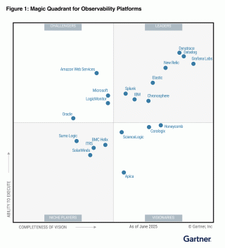

> From: Grafana Labs 官网

我们很高兴地宣布，**[Grafana Labs has been recognized as a Leader in the 2025 Gartner® Magic Quadrant™ for Observability Platforms](https://www.grafana.com/resources/grafana-observability-platforms-gartner-magic-quadrant-2025/?pg=blog&plcmt=body-txt)**，这是我们连续第二年获此殊荣。

今年的报告将 Grafana Labs 定位在“愿景完整性 (Completeness of Vision)”方面最靠前的位置，我们认为这反映了我们对构建一个真正开放、可组合的可观测性（Observability）堆栈的坚定承诺，该堆栈为用户提供了灵活性、控制力以及自主制定可观测性策略的工具。

我们为过去一年所产生的影响感到自豪，我们支持了超过 2500 万用户和 5000 多家客户，助力他们实现可观测性之旅。

除了在魔力象限（Magic Quadrant）中的位置，Grafana Labs 还被纳入 2025 Gartner® 可观测性平台关键能力（Critical Capabilities）报告。该报告对关键用例进行了更深入的评估。我们很自豪能成为所有用例中得分最高的四家供应商之一，其中包括：

- **成本优化** (4.18/5)
- **IT 运维** (4.15/5)
- **平台运维** (4.15/5)
- **软件工程** (4.15/5)
- **SRE** (4.14/5)
- **业务洞察** (4.10/5)
- **AI 工程** (3.96/5)

## 我们的表现和影响力

我们相信，今年在魔力象限中的排名反映了我们在开放可观测性堆栈中实现的创新所带来的实际影响。Gartner 强调了 Grafana Labs 表现突出的几个领域——特别是在成本优化和开源生态系统领导力方面。同时，我们也为过去一年中持续推出的 [持续创新](https://grafana.com/blog/2025/05/07/grafanacon-2025-announcements/) 和 [产品更新](https://grafana.com/blog/2024/09/24/observabilitycon-2024-announcements/) 感到自豪。

正如关键能力报告中所述，一个主要差异化因素是我们的 [自适应遥测 (Adaptive Telemetry)](https://grafana.com/blog/2025/01/14/what-is-adaptive-telemetry-and-how-can-it-reduce-mttr-noise-and-cost/) 套件，它帮助客户显著降低可观测性成本——平均可节省 20% 到 50% 的指标费用和 20% 到 40% 的日志费用。这些成本效益的实现无需牺牲可见性或性能，使团队能够更可持续地扩展可观测性。

Gartner 还指出我们深度参与了开源社区，尤其是 Prometheus 和 OpenTelemetry，根据我们最近的 [可观测性调研](https://grafana.com/observability-survey/?pg=blog&plcmt=body-txt)，这两个项目目前被 71% 的组织使用。我们对开放标准的承诺不仅体现在贡献上，也体现在领导力方面：我们最近 [欢迎 OpenTelemetry 联合创始人 Ted Young 加入 Grafana Labs](https://grafana.com/blog/2025/03/27/meet-ted-young-opentelemetry-co-founder-and-the-newest-grafanista/)，并向 OpenTelemetry 项目 [捐赠了我们的 eBPF 自动检测工具 Beyla](https://grafana.com/blog/2025/05/07/opentelemetry-ebpf-instrumentation-beyla-donation/)，这进一步强化了我们致力于构建一个以互操作性 (interoperability) 和透明度 (transparency) 为常态的未来的决心。

尽管 Gartner 的评估中没有明确提及，但我们在过去一年中推出的两项重大增强功能获得了客户的强烈积极反馈，这两项功能都旨在帮助团队更快地行动，并以更小的阻力获取洞察。

首先，[Grafana Drilldown 应用](https://grafana.com/blog/2025/02/20/grafana-drilldown-apps-the-improved-queryless-experience-formerly-known-as-the-explore-apps/) 让探索数据变得前所未有的简单，无需编写复杂的查询语句。其次，客户越来越多地采用 [Grafana Cloud Asserts](https://grafana.com/products/cloud/asserts/?pg=blog&plcmt=body-txt)——我们的持续关联 (continuous correlation) 和根本原因分析 (root cause analysis) 工具。Grafana Cloud Asserts 能够自动映射你的整个技术栈中的依赖关系，持续分析信号，并呈现相关洞察，从而帮助你在问题升级前发现、理解并解决它们。

各组织已经在使用这些工具来更智能地工作和更快地响应，我们很高兴能将这一切与 [Grafana Assistant](https://grafana.com/blog/2025/05/07/llm-grafana-assistant/)（目前处于私有预览 (private preview) 阶段）整合起来，它是一个上下文感知 (context-aware)、集成的聊天代理，可帮助用户了解 Grafana，探索和查询他们的可观测性 (observability) 数据，管理仪表盘，并进行调查——所有这些都通过自然语言 (natural language) 完成。

## 用户评价

我们很荣幸被 Gartner 评为领导者，但我们最重要的反馈来自每天使用 Grafana 的用户。

截至 2025 年 7 月 1 日，在 [Gartner Peer Insights™](https://www.gartner.com/reviews/market/observability-platforms/vendor/grafana-labs) 上：

- Grafana Labs 的**整体评分为 4.5/5**
- 基于 268 条经过验证的客户评论
- 91% 的评论者表示会推荐我们的产品

以下是用户们的评价：
- “LGTM 堆栈 (LGTM stack) 在易用性和功能性方面都是最佳选择——而 Grafana Cloud 则是扩展它的最佳方式。” - [一家软件公司的工程师](https://www.gartner.com/reviews/market/observability-platforms/vendor/grafana-labs/product/grafana-cloud/review/view/5725094)
- “在使用我们之前的可观测性 (observability) 工具之后再用 Grafana Cloud，感觉耳目一新。它满足了我对可观测性提供商的所有期望。” - [一家软件公司的软件开发人员](https://www.gartner.com/reviews/market/observability-platforms/vendor/grafana-labs/product/grafana-cloud/review/view/5725094)
- “它帮助我们整合了所有不同的监控解决方案。其中的‘自适应’功能极大地节省了成本。” - [Manager of IT services at a bank](https://www.gartner.com/reviews/market/observability-platforms/vendor/grafana-labs/product/grafana-cloud/review/view/5812548)

我们非常感谢我们的用户和社区给予的信任、反馈和伙伴关系。可观测性的未来是开放、灵活和用户驱动的——而这仅仅是个开始。

## 常见问题解答：Grafana Labs 与 2025 年 Gartner® 魔力象限™

**什么是 Gartner 魔力象限？**

魔力象限报告是在特定市场进行严谨、基于事实的研究的成果，它为高增长且供应商差异显著的市场中的供应商相对位置提供了广阔的视角。供应商被分为四个象限：领导者 (Leaders)、挑战者 (Challengers)、远见者 (Visionaries) 和特定领域者 (Niche Players)。该研究使组织能够根据其独特的业务和技术需求，最大程度地利用市场分析。

**被评为领导者意味着什么？**

领导者能够很好地执行其当前愿景，并为未来做好了充分准备。对于 Grafana Labs 而言，这验证了我们对开放性、创新以及帮助用户掌控其可观测性堆栈 (observability stack) 的承诺。

**这是 Grafana Labs 第一次获得认可吗？**

不是，这已是 Grafana Labs 连续第二年被评为领导者。

**什么是关键能力报告，Grafana Labs 的表现如何？**

Gartner 可观测性平台关键能力 (Gartner Critical Capabilities for Observability Platforms) 报告提供了对供应商更深入、基于用例 (use cases) 的评估。Grafana Labs 是所有用例中得分最高的四家供应商之一，其中包括在成本优化 (Cost Optimization)（4.18/5）和平台运营 (Platform Operations)（4.15/5）中排名第三。

**客户是怎么说的？**

截至 2025 年 7 月 1 日，Grafana Labs 在 Gartner Peer Insights™ (Gartner Peer Insights™) 上的总体评分为 4.5/5，基于 268 份经过验证的客户评论，91% 的评论者推荐我们的产品。

**在哪里可以了解更多或开始使用？**

- [阅读完整的 Gartner 魔力象限报告](https://www.grafana.com/resources/grafana-observability-platforms-gartner-magic-quadrant-2025/?pg=blog&plcmt=body-txt)
- [了解更多关于 Grafana Cloud 的信息](https://grafana.com/products/cloud/?pg=blog&plcmt=body-txt)
- [立即创建永久免费 Grafana Cloud 账户](https://grafana.com/auth/sign-up/create-user/?pg=blog&plcmt=body-txt)

Gartner，《可观测性平台关键能力》（Critical Capabilities for Observability Platforms），作者：Matt Crossley, Gregg Siegfried, Padraig Byrne, Andre Bridges, Martin Caren，发布日期：2025年7月8日

GARTNER 是 Gartner, Inc. 和/或其在美国和国际上的关联公司的注册商标和服务标志，MAGIC QUADRANT 和 PEER INSIGHTS 是 Gartner, Inc. 和/或其在美国和国际上的关联公司的商标和服务标志，本文经许可使用。保留所有权利。

Gartner 不对其研究出版物中描述的任何厂商、产品或服务进行认可，也不建议技术用户仅选择那些获得最高评级或其他称号的厂商。Gartner 研究出版物包含 Gartner 研究组织的观点，不应被解释为事实陈述。Gartner 对本研究不作任何明示或暗示的保证，包括任何适销性或特定用途适用性的保证。

Gartner Peer Insights 的内容包含基于个体最终用户自身经验的观点，不应被解释为事实陈述，也不代表 Gartner 或其关联公司的观点。Gartner 不对此内容中描述的任何厂商、产品或服务进行认可，也不对该内容的准确性或完整性作任何明示或暗示的保证，包括任何适销性或特定用途适用性的保证。
