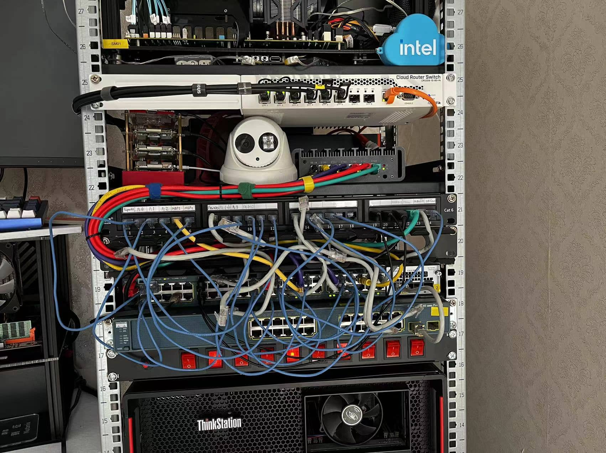
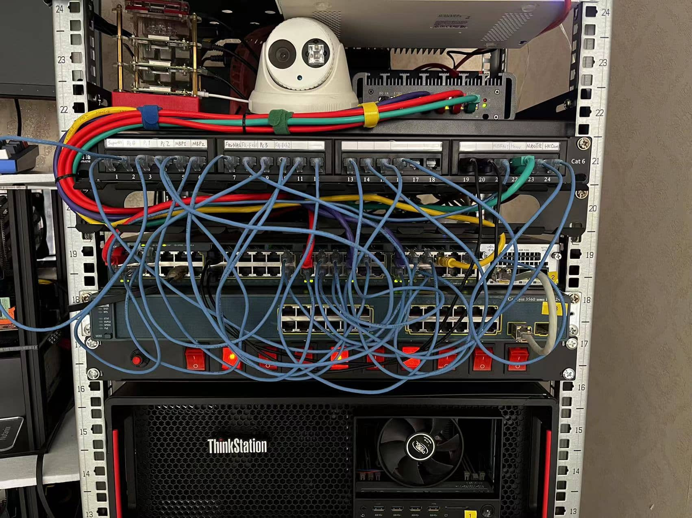
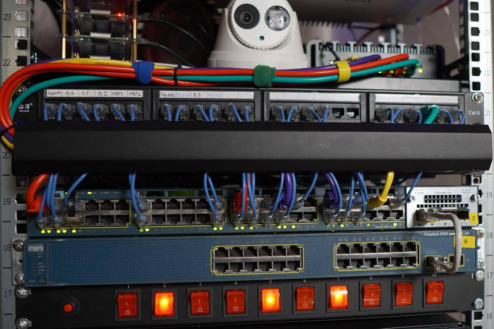

从 homelab 的规模上来说，我的这个并不算什么，可是从设备的种类和目标上来说，就稍微有点复杂了，和我多年积累电子设备有关，和我的好奇心有关。

* cisco ccna lab: router = 2x2800 + 1x2600, sw = 2 x 3560; firewall = 1x pix 515; 希望有机会用他们恢复一下我生锈的网络知识。
* 4 x raspberry pi ，没有玩多久就放一边吃灰了。 
* 2 x MacBook Pro，之中一台 2011 年的老款，外壳上亮灯型号。1 x MacBook
* 1 x Hp Z420 当时想用来做 TrueNAS 的，后来运行 esxi 了。
* 1 x Dell R220，身材精干，莫却虽小五脏俱全的企业级服务器。
* 1 x Lenovo P710 是 Homelab 从 Intel NUC 升级上来的败笔，从买了这个机器以后，后续各种想法和需求就决堤了。
* 2 x 华南金牌组装服务器，搭配 P710 成功搭建了 Nutanix CE 集群。
* 1 x SuperMicro 服务器，配合外置的硬盘支架，用 6 个 4TB 西数红盘组成了 TrueNAS 服务器，说真话，对于 homeLab 而言，其实这一个服务器就够了。真的不需要上面所有设备

## 交换机 - core switch

我用了一台 48 口的 Cisco 3560-x 作为核心交换机，对于我这个 32U 高的机架而言，它提供了足够的网口空间，再用了将近一年后，觉得选择稍微高于当前想法的交换机是非常正确的选择。建议采购 1.3 ~ 1.5 计划需求的交换机。

* VLAN ：必用功能，特别是在虚拟化场景和多个子网隔离的需求下。
* Trunk / Access mode 端口：VLAN+Access port 的模式是最多用的；在 esxi 虚拟化服务器上会用到 VLAN+Trunk port 的需求。
* Routing / DHCP ： 可以开启 VLAN 之间的路由功能，由于我用 pfSense 服务器做的防火墙，因此 DHCP 和各个子网的网关都用 pfSense 服务器做了；因此这个功能在我这里就测试了一下，据说这个功能开启了以后也会比较消耗资源。 
* 我还配备了一台  Cisco 3560 PoE-24，最初是为了试一下我的两个 PoE 供电的设备，它们是 piHat 和 海康威视监控头。不过这个设备以后主要会用于 NetDevOps 的研究，Ansible 的 Cisco 模块一直没有研究过。

## 配线架 - patch panel

如果你准备入手机架，或者正在规划中，都一定不要忘了这个重要的组件。它最终帮我实现了一次性网线布线，轻松在机架前调整网络配置的便利性。特别是在后续经常调整设备网络配置的时候，越用越能感受到这个神器的价值。

我在配线架跳线（patch cable）上所走的弯路：

1. 我买了一卷网线用于配线架后所有设备的连接，配合网线钳和水晶头，我将24 口配线架的后面都布满了长度和是的网线；这个用法和做法是没有问题的。
2. 然后，我用相同的方法开始做长短不一的短跳线，等我做完了十几根跳线以后，意识到：网线的线径太粗，中间的芯太硬，他们横七竖八的排列着非常难看。
3. 让误以为是鸡肋的理线器上岗，在交换机和理线架中间挪动出 1U 的空间后，理线架将张牙舞爪的跳线都收纳起来后，视觉上感觉好多了。可是跳线太粗，与从 pfSense 上走下来的 6 根网线混居到一起后，居然就已经把配线架的狭小空间塞满了，这意味着，我发在塞入以后新增的跳线需求了，还有七八个口没有跳线。
4. 买了 24 根超细的 0.5m 的跳线，不忍彻底更换下来辛辛苦苦做的我十指发麻的 n 多根跳线。

下面是更换细跳线的过程。

这个视觉效果应该是可以了，而且从功能上来说，理线器中宽松的空间，让我以后给不同的配线架端口变更网络配置的时候，就轻松自如多了。

## 网线 - cables

除了专门买的那一卷 25m 的网线，我手头还是有不少长短各异的网线。

* 超五类：外皮较柔软
* 六类/超六类：都是长短不同的成品网线，有些被我掐掉一端的水晶头后，利旧部署在配线架上了，虽然都是8 芯的双绞线，不同的中间塑料芯和双绞线的粗细和硬度都是不同的。
* 扁网线：收纳方便，柔软，用于临时飞一根网线出来。
* 纤细的跳线：适合在高密度配线的地方使用。

通过使用这套工具，可以让你充分理解什么是物理层。在制作水晶头的过程中，也会屡屡失手。

最后值得一提的是这个细跳线，并不是为了美观，主要是为后期更改跳线操作。留下更多的操作空间。

在过几天，我当前的网络配置就会固定下来，起码所有网口都就位，后续网线布线方面的待办事项：

* 打印 1 ~ 24 的网线标签纸，贴到配线架后面的网线上。
* 更新配线架上网口上面的标签纸，标明后面接的是什么设备的那块网卡。
* 用尼龙绷带，将位置基本上固定不变的设备的网线固定在机架的立柱上。
* 优化核心交换机的 VLAN 配置，调整VLAN 中的端口数量。调整 esxi 服务器管理网和虚拟机网的端口配置（Trunk 配置）
* 优化 10GB 光纤交换机上 1GB 以太网口的配置，将其作为 Trunk 模式，接入存储网 VLAN 意外的其他 VLAN。让后续 Nutanix CE 重构后，虚拟机和存储网可以都在这个万兆交换机上，但是流量是隔离开的。