## 前言

### 摘要

评估由于**流程变化、产品采购或技术变革**所产生的提升改进是一种常见的工作。在可靠性工程中，通常会测量平均恢复时间（MTTR）或平均缓解时间（MTTM）等指标。这些指标有时用于评估上述变化所带来的改进效果或跟踪其发展趋势。

在本报告中，我通过一个简单的蒙特卡洛模拟过程（可应用于许多其他情况）和统计分析，展示了这些指标在生产事故管理的背景下，并不适用于决策或趋势分析的方面。为此，我提出了一些：在特定情况下会更有效的替代方法。

### 介绍

站点可靠性工程师（SRE）的主要职责之一是管理其负责的生产系统所发生的事故。在事故发生时，SRE 负责调试系统，选择合适且即时的缓解措施，并在需要时组织更大范围的事故响应。

然而，SRE 的职责不仅限于事故管理，还包括预防工作，例如：制定在生产环境中执行变更的稳健策略，或自动响应问题，并将系统恢复到已知的安全正常运行状态。这些工作还包括改进沟通流程、提升监控能力，或开发有助于事故调试的工具。实际上，有一些产品都是专门用于改进事故响应流程。

希望事故（如果必须发生的话）对业务的影响尽可能小。这通常意味着事故的持续时间要短，这是我将在这里重点讨论的内容。了解流程变化或产品采购会怎样缩短事故持续时间是重要的，尤其当事故涉及实际成本时。然而，我们不能仅凭一次事故就得出结论，需要对多个事故进行综合分析。

用搜索引擎搜索一下，你可能会发现：许多文章声称的 MTTx 指标（包括平均恢复时间和平均缓解时间）应被视为服务可靠性的关键性能指标。这些文章有时由：拥有良好服务口碑或提供可靠性相关工具的知名公司撰写的。但这些指标真的是良好的可靠性管理指标吗？实际上，它们能否作为有效的指标来使用？该如何判断？

应用 MTTx 指标的目的是了解系统可靠性的演变。但实际情况是，应用这些指标比看起来要复杂得多，而且在大多数情况下，这些流行指标往往具有误导性。

本报告将展示 MTTx 在大多数典型 SRE 环境中无效的原因，这些原因适用于许多总结性统计数据，与公司规模或生产实践的严格程度无关。不论选择何种指标，重要的是测试它在不同的事件持续时间分布下是否能够提供可靠的见解。尽管可能没有一种通用的“银弹”指标能替代 MTTx，但通过根据具体问题定制指标，您可能会在度量方面取得更好的效果。在本报告的最后，我将探讨一些替代方法来实现这些测量。

## 事故生命周期和时间节点

在分析事故的总体情况前，我想先介绍一些相关术语。这些术语可能因公司而异，但基本原则是一致的。

图 1 展示了一个简单的事故时间线模型，我将在后续内容中使用这个模型。在这个模型中，事故经历以下关键阶段：

1. **首次产品影响**：对产品产生严重影响的第一个时刻。
2. **检测**：系统操作员意识到正在发生的问题。
3. **缓解**：产品不再受到严重影响，但系统可能仍存在着部分的功能退化。
4. **恢复**：系统完全恢复正常运行；有时缓解和恢复是同一时间点，但有时恢复时间之后，具体会有所不同。

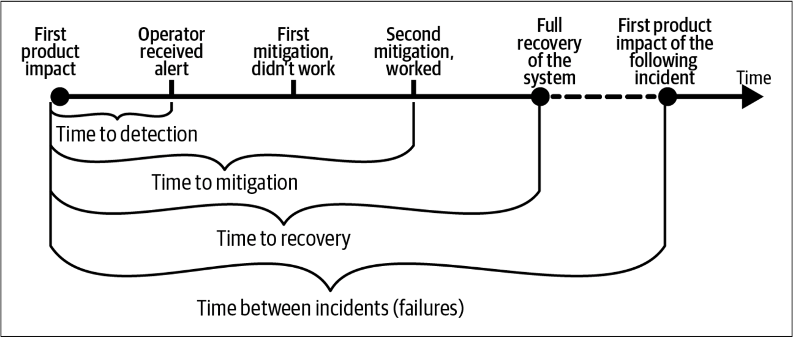

我将分析事故的持续时间周期，并探讨应用统计数据的有效性。有几个公开的资源库汇集了事故复盘回顾，展示了时间线和关键事件[^1]。在这次分析中，我特别关注事故对用户影响的时间窗口。

图 1 的事故时间线模型简化了现实，就像所有模型一样。“浅层事故数据”存在一些问题。例如，在这次分析中，一个问题是：“如果你已经消除了 90% 用户的影响，但还有 10% 仍然受影响，你会认为事故已经缓解了吗？” 如果还有 5% 或 20% 呢？使用这个模型，你需要做出一个二元决策。这种分类方式常常因为主观性和不一致的原则而受到批评。

你可能不会太在意事故数据中[^2]的这些不准确之处。对于许多实际应用——包括我将重点关注的总体分析——更高的精确度并不是必须的，而实现这种精确度的成本可能超过提高数据质量的潜在好处。著名统计学家 George Box 说过：“所有模型都是错的，但有些是有用的”，我认为这个模型可以用来理解 MTTR 和类似指标的可行性。

### MTTR 和 MTTM 指标，探讨与应用

一次事故可能会提供其相关数据，但你需要分析整体情况[^3]。平均恢复时间 (MTTR) 是行业中常用的术语。类似于平均故障间隔时间 (MTBF) 的术语也很常见，特别是在分析硬件组件的可靠性时。

在这里，MTTR 被定义为所有适合分析的事故中，从首次产品影响到恢复的平均时间。同样，平均缓解时间 (MTTM) 被定义为从首次产品影响到缓解的平均时间。

### 事故持续时间的分布

要分析事故持续时间的统计数据，需要多样化的数据来源，以避免仅依据一个公司或产品得出结论。我收集了三家知名互联网公司的公共事故状态仪表板数据（员工数量在一千到两千之间）。图 2 展示了事故持续时间的分布。

我没有区分事故类型：如果公司认为事故值得向用户公布，我就将其纳入分析。这些事故的持续时间代表了从首次影响到最后影响的用户沟通时间。我简化称之为恢复时间，虽然这种叫法并不完全精确。因为恢复时间和缓解时间通常相同，我发现它们遵循类似的分布，这种不精确性不会影响分析结果。

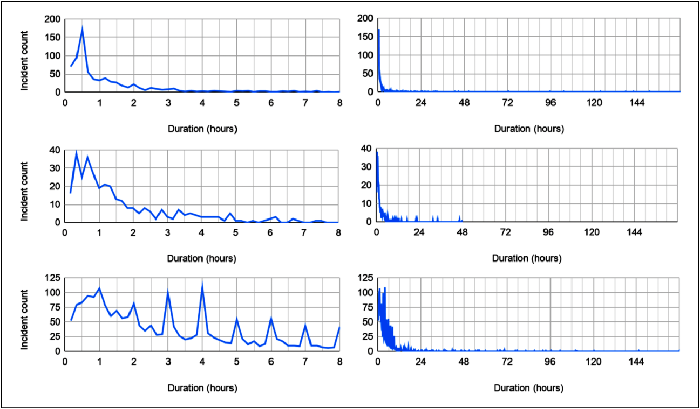

行的顺序依次为公司 A (N = 798；2019 年 173 起)，公司 B (N = 350；2019 年 103 起)，和公司 C (N = 2,186；2019 年 609 起)。列显示了每家公司在短期和长期内分布的尾部。

我还收集了 Google 的事故数据（见图 3），在我的分析中，Google 的数据集代表了一家专注于互联网服务的巨型公司。这个数据集是在一年的时间内收集的，时间比图 2 中的任何数据集都短，但它还包括内部事故（例如，仅影响开发人员生产力的事故）。虽然我不能分享具体的数字，但可以预见，Google 的事故数据集比三个公共数据集中任何一个都大好几倍。

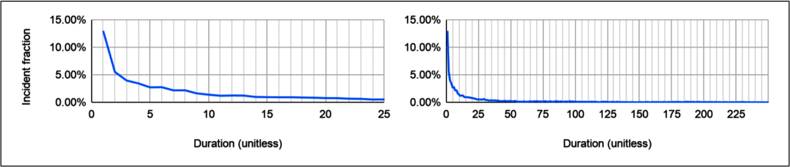

得出的关键观察是：在每种情况下，事故都呈现出正偏分布，大多数事故能迅速解决。图 4 显示，这些分布大致接近对数正态（或伽玛）分布，但我没有对经验数据进行概率分布拟合。所有数据集都显示了事故持续时间的巨大差异。这与我的经验相符：大多数事故能相对较快解决，但一些更复杂且持续时间较长，还会有少数灾难性的“黑天鹅事件”发生。[^4]

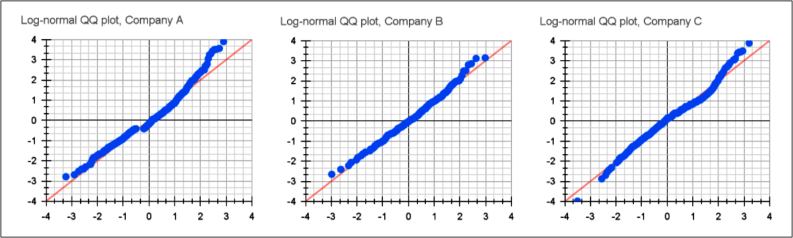

显示它们如何接近对数正态分布[^5]。请注意，这不能用来得出对数正态分布是最佳拟合的结论，仅供参考。

我排除了公共数据集中持续时间少于三分钟和超过三天的事故，这些事故占每个数据集的约 1-2%。对数据集中随机选择的事故进行手动检查，确认这些异常值是有效的，并且我也知道，从事故回顾中可以得知确实存在影响重大的多天事故，甚至更长时间的事故[^6]。但是，我认为包括这些异常长的事故，即使它们在实际中发生，可能会对分析带来不必要的质疑。

从这些经验数据中，可以看到事故持续时间的分布，但仅根据事故数量或持续时间来判断公司的可靠性实践是错误的。这些数据集来自不同业务模式、可靠性需求和事故沟通方式各有差异的公司。[^7]

## 分析改进

现在你已经清楚了解了事故持续时间的情况，是时候缩短事故时间了！

假设你获得了一款可以提高可靠性的产品，能够将事故的缓解和解决时间缩短 10%。例如，一个持续一天的事故可以缩短到约 21.5 小时。你有机会进行试用来评估该产品的效果。如何确认产品能兑现其承诺呢？这份报告将探讨使用 MTTR 和类似指标，因此我们将使用这个指标。

我故意选择了这个模拟场景，因为它适用于许多现实中的情况。无论是更改策略、开发软件，还是引入新的事故管理流程，目标往往是缩短事故时间，并评估这些改变所带来的效果。

### 判定 MTTR 的改进

那么，你如何测试该产品是否真正兑现了承诺呢？一个简单直观的测试方法是：“如果每次事故的持续时间，都能按产品所述的减少了，我们就能看到 MTTR 指标的改进。”

然而，这仍然相当不精确。“我们能够看出改进”具体意味着什么？最终，你需要做出一个明确的判定。在这种情况下，你需要判断产品是否取得了成功，并选择是否购买。

为了评估产品是否实现了缩短事故持续时间 10% 的承诺，你可以设置一个阈值，即 MTTR 与使用产品前相比减少 10%。一个更宽松的标准是：只要有任何改进就算成功。如果你看到任何事故时间的缩短，无论幅度大小，你就会认为产品成功了。

你需要明确了解你期望指标的表现，并确信所选指标（如 MTTR）能够准确衡量你想要的内容。如果依赖于一个不佳的指标，可能会带来实际且严重的风险和成本。这些风险可能是直接的，例如因为错误的原因购买产品，但也可能非常微妙。例如，员工意识到：他们的事故管理工作是通过未经验证，或有问题的指标进行评估时，士气可能会受挫。

### 在平行宇宙中模拟 MTTR

你只能在一个宇宙中生活，因此在这个场景中你只有一次机会评估产品。但直觉告诉你，事故是多变的，你希望确保能看到改进，且不是随机巧合。

为了更确定这一点，你可以进行蒙特卡洛模拟[^8]。假设事故遵循获得的数据集的经验分布，并评估在一定数量的事故后你会看到哪些改进及其置信水平。

模拟过程如下：

1. 从事故持续时间的经验分布中随机抽取两个样本，样本量为 N1 和 N2（N1 = N2 以实现完美的 50/50 分割）。
2. 修改其中一个样本的事故持续时间，缩短 10%。
3. 计算每组的 MTTR，即 MTTRmodified 和 MTTRunmodified。
4. 计算差值，观察到的改进 = MTTRunmodified − MTTRmodified（负差异意味着 MTTR 恶化）。
5. 重复这个过程 100,000 次。

你正在进行两个样本的实验，样本大小为 N1 和 N2，其中 N1 = N2。50/50 的分割能提供最强的分析；在第 18 页的“分析方法”中，我将简要讨论原因。

简单来说，你访问成千上万个平行宇宙，模拟产品兑现其承诺，并将结果的 MTTR 与未处理的事故进行比较。从操作上讲，这可以使用 Python 脚本和包含数据的 CSV 文件或足够强大的 SQL 引擎来完成，不需要任何专业工具或额外知识。

现在你在操作概率，所以需要为测试添加一个条件：对随机巧合的某种容忍度。假设你容忍最多 10% 的平行宇宙误导你。更正式地说，这意味着你需要统计显著性 α = 0.10。这个值可以说是比较宽松的。

**场景模拟与评估**

在这个场景中，我选择了两个等量的事故样本（N1 和 N2，其中 N1 = N2）。我选择的 N1 + N2 等于 2019 年的事故数量（见表 1）[^9]。具体来说，公司 A、B 和 C 的事故数量分别为 173、103 和 609 起。

表 1. 三个数据集的事故数量、均值和方差。

|  | 公司A | 公司B | 公司C |
| --- | --- | --- | --- |
| 事故(所有) | 779 | 348 | 2157 |
| 事故（2019） | 173 | 103 | 609 |
| 均值 | 2h26m | 2h31m | 4h31m |
| 方差 | 5h16m | 5h1m | 6h53m |

进行模拟后，我绘制了图表来观察结果（见图 5）。

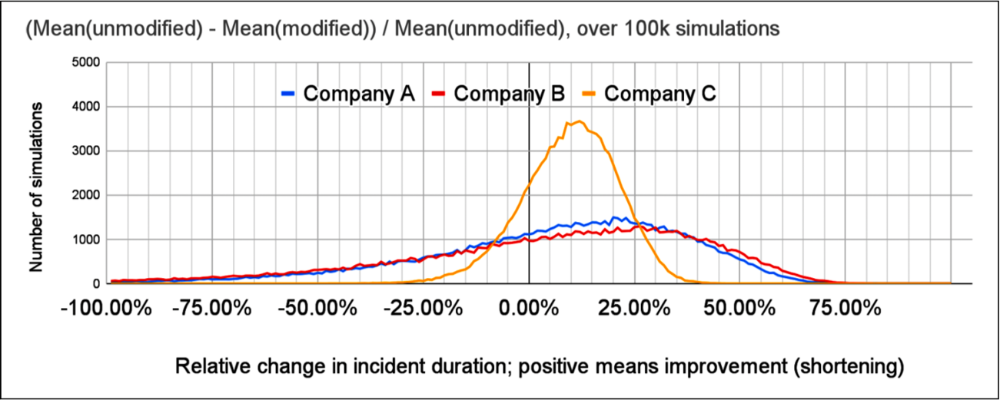

如果改进实际发生，模拟的 MTTR 变化分布，作为相对改进。

即使在模拟中改进总是有效，38% 的模拟中公司 A 的 MTTR 差异低于零，40% 的公司 B 和 20% 的公司 C 也是如此。观察 MTTR 的绝对变化，看到至少 15 分钟改进的概率分别只有 49%、50% 和 64%。即使场景中的产品有效并缩短了事故，检测到任何改进的几率也远超出 10% 随机误差的容忍度。

**不改变事故情况下统计数据的变化**

更糟糕的是，你可能会看到 MTTR 的显著减少，甚至超过产品的承诺。这可以通过运行与之前相同的模拟更清楚地证明，但在这种情况下，产品对事故没有任何影响。将步骤 2 替换为 new_duration = old_duration。

果然，图 6 显示公司 A 有 19% 的几率 MTTR 改进半小时（或更好），公司 B 有 23%，公司 C 有 10%……即使在这个模拟中，你没有对事故做任何改变[^10]。换句话说，即使假设的产品对你没有任何作用，你也会认为它有效并决定购买产品。

> 注意：对此发现，一个愤世嫉俗的回应是开始销售虚假的缩短事故时间的产品。这种商业行为会设定价格，使得部分客户仅凭运气看到宣传的改进并购买产品，从而盈利。我绝不支持这种商业计划。然而，这确实突出了使用低质量指标可能带来的问题。

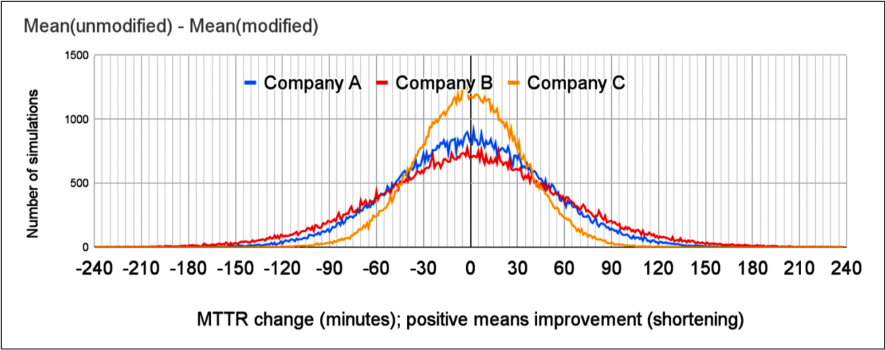

在事故没有变化的情况下，模拟的 MTTR 变化分布。

我们了解到，即使没有对事故持续时间进行任何有意的改变，许多模拟的场景仍然会让你认为 MTTR 大大缩短或延长，而实际上没有任何结构性的变化。如果你无法辨别出事故没有变化的情况，那么当它们真的发生变化时，你也会难以判断。

### 改变思维实验

之前的场景假设有一个产品可以缩短事故持续时间，你想了解这种变化如何反映在 MTTR 中。但实际上，预测和建模潜在的改进非常困难。

可以通过换个角度来解决这个问题。与其寻找特定的改进，不如观察在事故没有结构性变化的情况下 MTTR（或其他统计数据）的变化。换句话说，你的事故持续时间依旧来自相同的分布（未受任何事故处理改进的影响），你评估的是统计数据的典型变化。

接下来，我将简化讨论，只关注在事故没有变化的情况下 MTTR 变化的场景，不再分析改进。因此，最有趣的是结果分布的形状：简单来说，我们想知道它有多平坦。

### 通过更多事故进行更好的分析

你可能会直觉上理解为什么观察到的 MTTR 会有如此广泛的变化：事故的方差太大。这种直觉有统计学依据。

中心极限定理告诉我们，随着样本数量的增加，样本和的分布趋向于正态分布[^11]。你可以在之前的分析中看到一些证据（例如图 6），这些分布看起来有些正态。虽然不能自动假设结果分布总是正态的（稍后会详细说明），但这也意味着在极限情况下方差会趋于收敛。

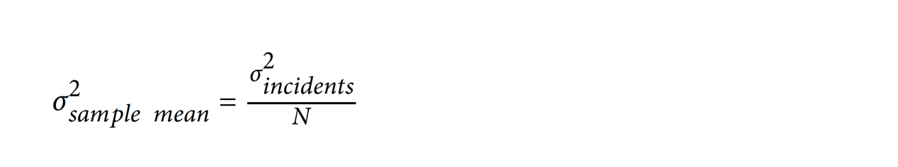

这与直觉一致，表明随着样本大小（即事故数量）的增加，观察到的 MTTR 值的方差会减少。这很容易证明。表 2 显示了多个事故数量下 MTTR 的 90% 置信区间。

回想一下，你是从事故持续时间分布中抽取两个样本。因此，如果你想知道用 N 个事故总数进行分析的效果，你需要抽取两个样本，样本大小为 N1 和 N2，其中 N1 = N2。

表 2. 基于 100,000 次模拟，从两个随机抽样的事故集合（N1 = N2）中计算出的两个 MTTR 差异的 90% 置信区间。
|              | Company A        | Company B        | Company C        |
|--------------|------------------|------------------|------------------|
| 原始数据TTR的均值 | 2h 26m           | 2h 31m           | 4h 31m           |
| 2019的事故数据          | 173              | 103              | 609              |
| N1 + N2 = 10               | mean difference ≅ 0   90% CI [−5h41m; +5h42m] | mean difference ≅ 0   90% CI [−5h25m; +5h18m] | mean difference ≅ 0   90% CI [−7h4m; +7h15m] |
| N1 + N2 = 100              | mean difference ≅ 0   90% CI [−1h44m; +1h44m] | mean difference ≅ 0   90% CI [−1h39m; +1h39m] | mean difference ≅ 0   90% CI [−2h16m; +2h16m] |
| N1 + N2 = 1,000            | mean difference ≅ 0   90% CI [−33m; +33m] | mean difference ≅ 0   90% CI [−31m; +31m] | mean difference ≅ 0   90% CI [−43m; +43m] |

随着样本数量的增加，标准差会下降，从而提高检测较小显著变化的能力。在原始场景中，你评估的产品承诺将事故持续时间减少 10%；即使有一千起事故，这仍然会落入 90% 置信区间。即便有一年的数据，你也无法得到一个有信心的结论。

公司 A 和公司 B 的相似结果是巧合。这两家公司提供的服务非常不同，但它们的平均事故持续时间和标准差却相似。如果只考虑一年的事故数据，差异会很大：公司 A 的平均事故持续时间是 4 小时 35 分钟，而公司 B 是 2 小时 38 分钟。它们的其他统计数据，如中位数，也比平均值差异更大。

即使事故数量很多（超过每年的总数），方差仍然太高。图 7 显示，即使 MTTR 观察到的变化很大，仍然在 90% 置信区间内。虽然增加事故数量有助于获得更好的信号，但这与可靠性工程的整体目标相违背。

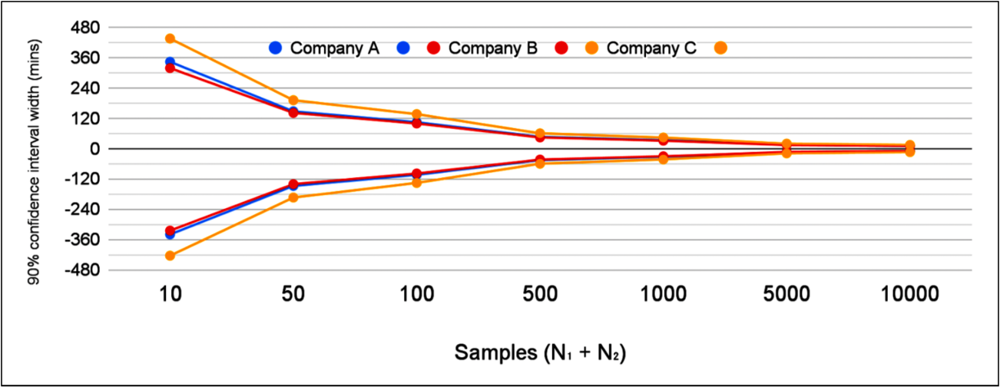

随着样本数量增加，90% 置信区间的宽度减少。

### 超越平均值

对算术平均值的一个常见且合理的批评是它对异常值过于敏感。尽管已经排除了最严重的异常值事故（如少于三分钟或超过三天的事故），这一点依然成立。我们可能需要考虑其他统计方法，让我们来探讨一下。

**中位数和百分位数**

中位数常用于避免少数极端异常值过度影响结果，这里也可以使用——大多数事故不会持续几天。

需要注意的是，如果要分析中位数，你也需要调整你的分析方式。如果你在寻找任何类型的相对差异，它应该是相对于中位数的。例如，用 MTTR 的一部分进行测试可能会非常误导。

如表 3 所示，即使在 N = 1,000 起事故的情况下，90% 置信区间相对于中位数统计数据仍然很大，并且涵盖了讨论中的 10% 中位数 TTR 目标。问题不仅限于 MTTR 的“平均值”；中位数 TTR 也无法解决。

表 3. 基于 100,000 次模拟，从两个随机抽样的事故集合（N1 = N2）中计算出的两个中位数 TTR 差异的 90% 置信区间。

|                       | Company A        | Company B        | Company C        |
|-----------------------|------------------|------------------|------------------|
| Median TTR of original data | 42m              | 1h 7m            | 2h 50m           |
| Incidents in 2019           | 173              | 103              | 609              |
| N1 + N2 = 10                | mean difference ≅ 0   90% CI [−1h46m; +1h46m] | mean difference ≅ 0   90% CI [−2h13m; +2h12m] | mean difference ≅ 0   90% CI [−4h8m; +4h7m] |
| N1 + N2 = 100               | mean difference ≅ 0   90% CI [−29m; +29m] | mean difference ≅ 0   90% CI [−29m; +29m] | mean difference ≅ 0   90% CI [−1h20m; +1h19m] |
| N1 + N2 = 1,000             | mean difference ≅ 0   90% CI [−11m; +11m] | mean difference ≅ 0   90% CI [−9m; +9m] | mean difference ≅ 0   90% CI [−29m; +29m] |

较高的百分位数，如第 95 百分位，表现更差。直观上，这是合理的。较高百分位数的事故持续时间会受到最严重事故的影响，而这些事故又非常罕见。因此，它们的方差非常高。表 4 列出了一些具体数值。

表 4. 基于 100,000 次模拟，从两个随机抽样的事故集合（N1 = N2）中计算出的第 95 百分位 TTR 差异的 90% 置信区间。

|                       | Company A        | Company B        | Company C        |
|-----------------------|------------------|------------------|------------------|
| 95th percentile TTR of original data | 10h 45m          | 8h 48m           | 12h 59m          |
| N1 + N2 = 100               | mean difference ≅ 0   90% CI [−12h19m; +12h22m] | mean difference ≅ 0   90% CI [−8h34m; +8h36m] | mean difference ≅ 0   90% CI [−12h29m; +12h30m] |
| N1 + N2 = 1,000             | mean difference ≅ 0   90% CI [−5h23m; +5h25m] | mean difference ≅ 0   90% CI [−3h18m; +3h17m] | mean difference ≅ 0   90% CI [−3h33m; +3h32m] |

虽然公司 A 和公司 B 的 MTTR 在这些百分位数测量中的结果相似，但你可以看到事故持续时间差异的影响。

几何平均数

你可能感兴趣的另一个汇总统计量是几何平均数，其计算公式为。

鉴于事故持续时间分布与对数正态分布相差不远，几何平均数在这里特别有吸引力。几何平均数对于对数正态分布而言，就像算术平均数对于正态分布一样。同样，这可以快速模拟（见表 5）。

表 5. 基于 100,000 次模拟，从两个随机抽样的事故集合（N1 = N2）中计算出的两个几何平均数差异的 90% 置信区间。

|                          | Company A        | Company B        | Company C        |
|--------------------------|------------------|------------------|------------------|
| Geometric mean TTR of original data | 54m              | 1h 9m            | 2h 24m           |
| N1 + N2 = 100                    | mean difference ≅ 0   90% CI [−24m; +25m] | mean difference ≅ 0   90% CI [−27m; +27m] | mean difference ≅ 0   90% CI [−56m; +56m] |
| N1 + N2 = 1,000                  | mean difference ≅ 0   90% CI [−7.2m; +7.2m] | mean difference ≅ 0   90% CI [−8.5m; +8.7m] | mean difference ≅ 0   90% CI [−18m; +17m] |

到目前为止，我们在实际数量的事故中还没有得到足够好的结果。在有一千起事故的情况下，90% 置信区间仅刚好超过指标变化的 10%。

**事故持续时间总和**

你可能更感兴趣的是减少事故持续时间总和，而不是单个事故的持续时间。这是直观的：你想提供可靠的服务，但服务的可靠性更多取决于总的不可用时间，而不是平均事故持续时间。[^12]

我们已经进行过这样的分析！算术平均数是事故持续时间总和除以事故数量，因此你可以简单地将 MTTR 模拟结果乘以 N/2（即两个样本中任意一个的元素数量），就能得到总和的模拟结果。为了确认这一点，我生成了一些总和模拟，显示置信区间等于 MTTR 置信区间乘以相应的 N（见表 6）。

表 6. 基于 100,000 次模拟，从两个随机抽样的事故集合（N1 = N2）中计算出的两个事故持续时间总和差异的 90% 置信区间。

|                          | Company A        | Company B        | Company C        |
|--------------------------|------------------|------------------|------------------|
| N1 + N2 = 100                    | mean difference ≅ 0   90% CI [−87h; +87h]  | mean difference ≅ 0   90% CI [−82h; +82h]  | mean difference ≅ 0   90% CI [−113h; +113h] |
| N1 + N2 = 1,000                  | mean difference ≅ 0   90% CI [−275h; +274h] | mean difference ≅ 0   90% CI [−260h; +259h] | mean difference ≅ 0   90% CI [−359h; +357h] |

事故数量对总和的观察值有很大影响。让我们简要看一下事故数量。

**统计事故**

本报告讨论了你是否能够检测到事故处理的改进，重点分析事故的解决过程。从发生事故到完全没有事故超出了本文的讨论范围。

然而，既然我已经收集了所有这些数据，至少可以简要查看这些数据集，以了解事故数量随时间的变化。我不会在这里进行更深入的分析。

事故数量和事故持续时间一样不稳定。即使按全年汇总，如图 8 所示，数值也会大幅波动。在月度或季度的分辨率下，这种波动更为严重。最多可以从这个图表中看到一些明显的趋势：公司 C 的事故数量在 2019 年急剧增加（这一趋势在 2020 年继续，但图中未显示），与之前的年份相比。这一趋势只有在多年时间尺度上才明显，尤其是与公司 A 和公司 B 的不稳定趋势相比时更为明显。

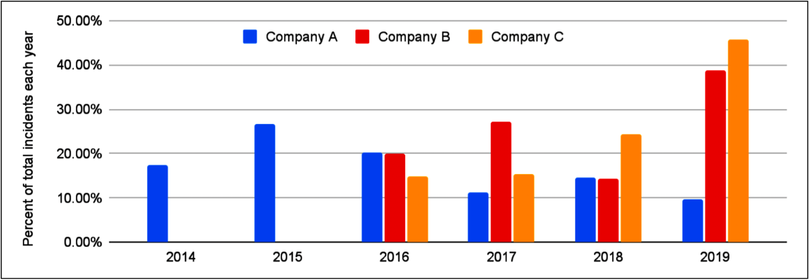

每年每个公司的事故数量，占总事故数量的比例。排除了数据不完整的年份（2020 年和每个数据集的第一年）。

但这种趋势可能根本无法反映系统可靠性。可能是由于外部世界事件导致的使用模式变化？还是产品组合的变化？或者是相同生产事件的事故报告方式变化，例如法规要求的变化？我只能猜测，但这些通常无法避免的因素可能会影响甚至使你自己公司的分析无效。

过去也提出了其他反对统计事故数量的观点[^13]。我不会再花时间进一步分析这些数据，但我期待未来更多关于这一主题的研究。现在我们快速浏览了事故数量，让我们利用这些知识回到分析事故缩短的主题。

## 分析方法

到目前为止，我一直在使用蒙特卡洛模拟。然而，你也可以采取分析方法。能否依靠中心极限定理来计算置信区间，而不是通过模拟来实现呢？答案是，有时候可以。

中心极限定理指出，样本均值的分布在极限情况下会趋向于正态分布。然而，由于事故发生频率低，数量可能不足以使中心极限定理适用。

你的团队或公司可能没有足够的事故数量来使样本均值的分布趋向于正态分布。

一种测试方法是运行模拟以生成样本均值分布的正态概率图（Q-Q 图）。[^14]
在图 9 中，我对公司 A 的数据进行了这样的模拟。随着样本量的增加（例如一年的事故数量），图表趋向于正态分布。但对于仅三个月的事故数量，图表明显偏离正态分布。
假设持续时间是正态分布的可能会误导并影响后续的计算。

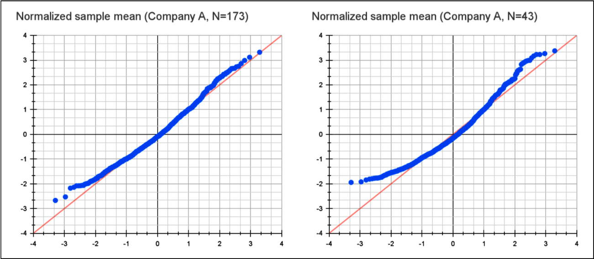

公司 A 样本均值事故持续时间的正态概率图，由 1,000 次模拟生成，模拟事故数量为 2019 年的全年事故数和大约一个季度的事故数。

一旦确定样本均值分布是正态的，你可以使用标准工具，例如 z 检验或 t 检验来建立置信区间[^15]。我们特别关注的是两个分布之间的差异。既然它们来自同一总体，均值差异（以及样本总体差异的正态分布的众数）将趋于零，正如我们在模拟中所见。更有趣的是标准差，它决定了置信区间。

样本均值的方差收敛到：[^16]

两个正态分布差异的方差是：[^17]

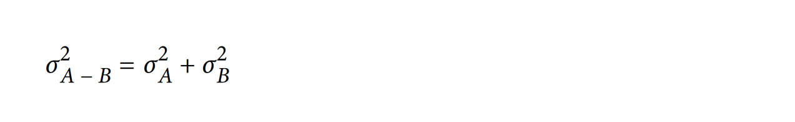

在这种情况下，两个样本均值正态分布的方差和样本量相同，结果是：

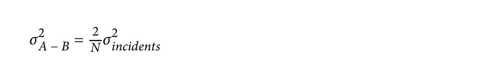

这也解释了为什么 50/50 分割是最佳选择，因为不同的样本比例会导致更大的方差，从而得到更差的结果。

然后你可以应用双尾 z 检验。你可以扩展 z 检验公式；知道分布均值是 0，你可以寻找 MTTR 的特定变化，同时扩展方差计算：

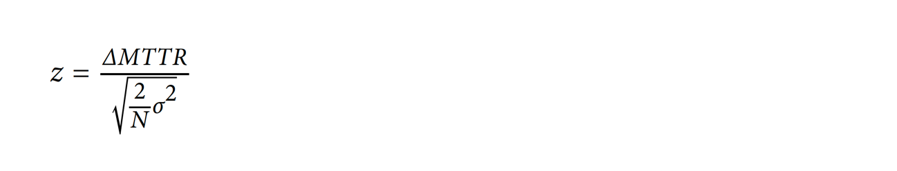

你也可以反过来：查找相应的 z 分数（双尾检验在 α = 0.10 时的 z 分数约为 1.644），找到 MTTR 变化的置信区间：

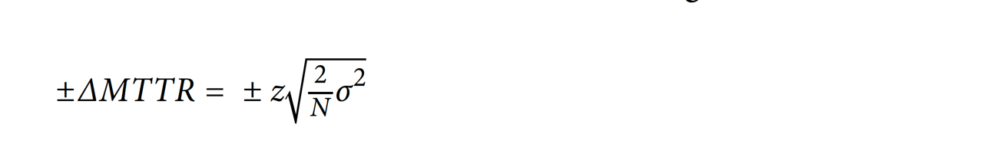

对于公司 A，事故持续时间的标准差为 5 小时 16 分钟，使用 N1 = N2 = 100/2 = 50 的样本来计算 90% 置信区间：

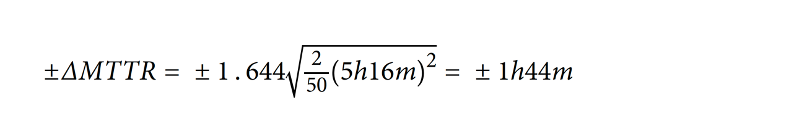

这个结果与模拟结果中看到的 90% 置信区间相对应。

虽然有时你可以使用公式来进行事故统计分析，但我更喜欢模拟方法。我发现用模拟来讨论这个话题比用公式更容易理解。它还提供了更多的灵活性，可以进行建模和分析。计算 95 百分位恢复时间的解析解决方案可能非常具有挑战性，但在模拟中，这只需要一行代码的改变。

你可能也对模拟不同的变化和情况感兴趣。如果提议的事故缩短比简单的 10% 减少更复杂怎么办？也许你期望根据事故类别有不同的减少？如果 SRE 团队由狼人组成，他们只在满月后开始处理事故怎么办？你的场景可能没有那么奇幻，但模拟可以让它们更容易实现。

## 大型公司事故数据集

之前的分析显示，随着样本数量的增加，方差会下降。Google 拥有的员工数量约是三家匿名公司总和的一百倍，事故数量也显著多于这些公司。这是否有助于获得更可靠的事故指标？

我们将以相同的方法分析 Google 的事故数据，并利用更丰富的数据集（包括内部元数据）进一步细分数据。

图 10 显示了所有重大事故和最严重事故的持续时间分布。这两个数据集中还包括内部事故，例如仅影响 Google 员工及其生产力的事故，甚至是对任何用户（内部或外部）完全不可见的事件。最严重事故的数据集中包含了更高比例的面向用户的事故（例如，会在服务状态仪表板上列出）。

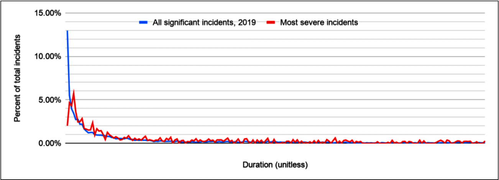

2019 年 Google 所有事故的持续时间分布。

除了更广泛的事故集中有更多非常短的事故外，图表显示这两个分布大致相似。所有 Google 事故的数据集大约是所选的面向用户的 Google 服务事故数据集的 15 倍，这也是公司范围内的分布图显得更平滑的原因。

在三个公共数据集中，排除超过三天的事故去除了约 1% 的事故，但两个 Google 数据集中都有相当多的事故持续时间超过三天。与之前的公共数据集一样，由于事故跟踪方式不同，得出关于可靠性的结论是不正确的。我尝试了两种方法：在三天处截断和排除长度排名前 5% 的事故。结果显示，相对 MTTR 的置信区间仅有略微差异，结论相同。表 7 显示了以三天为截断点的模拟数据，与其他模拟一致。

表 7. 基于 100,000 次模拟，从 Google 事故数据集中两个随机抽样的事故集合（N1 = N2）中计算出的两个平均 TTR 和中位数 TTR 差异的 90% 置信区间。事故数量对应每个数据集中一年中的一部分。

|                                 | 2019 年 Google 最严重的事故（通常但不总是面向用户） | 所有重大事故（通常不面向用户） |
|---------------------------------|--------------------------------------------------------|--------------------------------------------------|
| Incidents in 2019 (approximate relative size) | 1 * X                                              | 15 * X                                            |
| Mean TTR N1 + N2 = ¼ year       | mean difference ≅ 0   90% CI [−35%; +35% of MTTR]   | mean difference ≅ 0   90% CI [−11%; +11% of MTTR] |
| Mean TTR N1 + N2 = ½ year       | mean difference ≅ 0   90% CI [−25%; +25% of MTTR]   | mean difference ≅ 0   90% CI [−7.6%; +7.6% of MTTR] |
| Mean TTR N1 + N2 = 1 year       | mean difference ≅ 0   90% CI [−18%; +18% of MTTR]   | mean difference ≅ 0   90% CI [−5.3%; +5.4% of MTTR] |
| Median TTR N1 + N2 = ¼ year     | mean difference ≅ 0   90% CI [−53%; +52% of median TTR] | mean difference ≅ 0   90% CI [−20%; +20% of median TTR] |
| Median TTR N1 + N2 = ½ year     | mean difference ≅ 0   90% CI [−35%; +35% of median TTR] | mean difference ≅ 0   90% CI [−14%; +14% of median TTR] |
| Median TTR N1 + N2 = 1 year     | mean difference ≅ 0   90% CI [−25%; +25% of median TTR] | mean difference ≅ 0   90% CI [−10%; +10% of median TTR] |

从数学上讲，在所有重大事故的一年数据中事故数量（虽然具体数字无法分享，但比我们之前测试的 1,000 起更多）有助于获得更可信的结果，这与之前的发现一致。然而，你需要注意你所看的数据和所应用的测试。事实证明，虽然在数学上成立，但这一发现实际上并没有特别实用。

所有事故的数据集包含各种类型的事故，从面向用户的服务系统故障到长期存在的处理管道问题、网络配置和公司设备软件安装——这些通常对终端用户是不可见的。对于一些事故，解决时间也可能相当长（例如，事故本身就很长或可以等到周末之后），这会推高 MTTR 值。

在如此广泛的事故中，我没有任何实际的开发工作可以保证实现这种程度的事故持续时间减少。在一年事故数据中，能够自信地检测到 5.3% 的均值变化，并没有使 MTTR 成为一个实际有用的事故统计数据。

## 这与数据质量有关吗？

汇总事故分析的挑战似乎并不在于事故元数据的质量。提高元数据收集准确性的努力不太可能引起显著变化。在检查 Google 内部事故元数据时，我发现那些有更严格事故报告要求的团队（例如，直接由 SRE 支持或运行高可用性、对收入至关重要服务的团队），在事故持续时间分析上并没有显著改进。所有三个公共事故数据集也显示出类似的行为。

你也可以通过生成完全合成的事故分布来验证这个问题。如果假设事故遵循某种分布（例如伽马分布或对数正态分布），你可以选择参数，使其在主观判断中“看起来正确”，然后进行评估。

这种方法可以应用于任何分布，但需要谨慎。假设事故持续时间呈正态分布或均匀分布可能并不现实。从这种分布的分析中得出的结论可能会产生误导。

## 这就是为什么 MTTx 可能会误导你

像收集到的事故数据（也可能包括你公司的事故数据）这样的分布具有非常高的方差，以至于均值、中位数或总和都无法很好地汇总统计来理解事故趋势。事故问题领域固有的高方差和小样本量使得进行稳健的事故持续时间分析变得不可取，如在三个示例数据集中所示。这里的分析是在理想条件下进行的，现实中的表现可能更差。

从可靠性角度来看，缓解和恢复之间确实存在差异，但在本分析范围内，这并不重要[^18]。我称之为“MTTx”，因为只要实际测量遵循类似的分布属性和样本量（即事故数量），它对分析没有影响。许多其他事故指标，例如检测时间，也存在同样的问题。[^19]

这意味着 MTTx 不适合用于评估典型变更对 TTx 的影响：

- 它不能很好地衡量系统的整体可靠性。仅仅得出这一结论不需要这种分析，我可以总结《实施服务质量目标》中的一个论点：如果事故数量翻倍，而事故分布大致相同，系统的可靠性显然变差了，但你的指标却没有发生太大变化。
- 它无法提供任何关于事故响应实践趋势的有用见解。模拟显示，即使事故性质没有变化，你也能看到大量变化。
- 无法通过 MTTx 评估事故管理过程或工具变更的成功或失败。方差使得难以区分任何改进，并且即使承诺的改进实现了，该指标也可能会恶化。

这些结果适用于典型的可靠性工程情况，例如网络服务上的事故。默认情况下，应拒绝将 MTTx 指标用于上述目的。然而，也有例外情况。例如，如果你有大量数据可以进行汇总 MTTx 分析。一个实际例子是大规模硬盘驱动器采购，如 Backblaze 公司定期发布的每个型号的硬盘驱动器可靠性统计数据，覆盖了数万个设备[^20]。此外，同一型号硬盘之间的相似性比事故之间更大。同样，数量和较低的方差是你能够自信地看到典型服务系统平均延迟变化的原因。[^21]

另一个例外情况是剧变，例如将事故持续时间缩短到原来的 20%。如前所示，你很可能能够自信地在数据中检测到它。然而，你也可能通过其他方式检测到它，因此不需要使用仍存在问题的 MTTx 指标。

## 更好的分析选项

MTTx 的挑战在于它是一个错误的观察指标。这个指标的行为特性使得分析变得困难。

另一个挑战在于，这个指标可能根本没有测量到你真正关心的内容。当我们谈论 MTTR 改进时，通常是在问：“我们的可靠性提高了吗？”或者，“我们在应对事故方面变得更好了？”选择一个更准确地代表决策目标的指标是其他文献中也讨论的重要话题。[^22]

我没有找到任何可以像 MTTx 那样被普遍应用的“银弹”指标。然而，我们可以探讨在特定背景下选择更好指标的一些方法。

### 根据问题定制指标

我用模拟测试产品是否影响 MTTx。然而，现实中的产品或流程变更并不是这样运作的。相反，它们改善了事故的某些方面，可能是事故沟通过程，或是自动事故分析工具提出的假设。[^23]

如前所述，事故是由不同持续时间的步骤组成的。[^24]这些步骤在各种出版物中都有研究。如果你在改进事故过程中的某一步，将所有其他步骤包括在内会使你更难理解变更的影响。

尝试分析每个事故的具体行为可能并不实际。你无法依赖人类输入元数据，也难以紧密观察每个事故。相反，实际的解决方案可以是对选定的事故样本进行用户研究。这些研究可以专注于你感兴趣的事故方面，并提供比汇总统计数据更丰富的理解。正确构建这些研究并不总是容易的，如果可能，建议寻求专家意见。考虑到这一点，有些文献在建立低成本用户测试方面提供了帮助，我已经成功地将这些经验应用于构建实际系统。[^25]

### 考虑直接的可靠性指标

也许你在问：“作为公司，我们的可靠性在变好还是变坏？” 这时可用性的概念就显得尤为重要。在 SRE 实践中，服务质量指标（SLIs）和服务质量目标（SLOs）是常用的术语。理想情况下，这些指标应该反映用户感知的产品可靠性，而 SLOs 则应该设定为符合业务权衡的目标。通常，这两者并不完全准确，有时甚至与理想情况相去甚远。

即使你的 SLIs 和 SLOs 尽可能真实地反映业务目标，这仍不意味着它们可以用汇总统计数据来分析，例如每年消耗的错误预算总和。由于 SLI（即使是接近理想属性的 SLI）可以通过多种方式实现，这里给出的答案可能不具有普遍适用性。我在这方面没有进行过分析，但这是一个有趣的未来研究方向。你可能可以在公司内部使用前面讨论过的工具轻松完成这项工作。

根据你的业务，另一个衡量标准可能是已打开的支持案例总数，或因服务不可靠而导致的客户电话，或其他更高级的综合指标。

### 测试你的选择指标

可能有比这里建议的更好的方法，我期待该领域未来的工作。关键在于，分析应关注你真正关心的问题；明智地选择你的指标。
可靠性事故是多种多样的，需要回答的关于可靠性度量的问题也同样多样。关键是以批判的眼光看待你的指标。它们是否真的在测量你想要测量的内容？它们在面对随机性时是否稳健？你是否有证据支持你的答案？
我用来研究 MTTx 的工具同样可以用于其他你正在考虑的指标。过程大致相同：确定对你有意义的变化水平（这取决于指标，也取决于你的业务），然后分析你是否可以在数据中自信地看到它。

## 结论

我已经证明，即使在有利的分析设置中，MTTx 也不能用于许多被宣传为有用的实际用途，例如评估可靠性趋势、评估政策或产品的结果，或了解整体系统可靠性。系统运营者、DevOps 或 SRE 应该不再默认 MTTx 是有用的。除非在特定情况下已证明其适用性，否则应对其应用持怀疑态度。

问题并不仅限于使用算术平均数作为指标；我已经证明，中位数和其他指标也存在同样的问题。这是由于事故数量通常较少且持续时间方差较大的结果。在三家匿名公司的实际数据集中以及 Google 的混淆数据集中都观察到了这种分布。

与其使用 MTTx 分析整体事故统计数据，你可以专注于事故生命周期中的更具体问题，更贴近你想要评估的内容。这可能会导致选择不同的指标或完全不同的测量过程。选择更好的指标应当带来更好和更稳健的决策过程。例如，可以专门测量和研究检测时间，或在一些常见事故响应活动上花费的时间。

也许还有其他统计数据可以提供更多的价值。事故持续时间的方差本身可能也是有用的，因为它可以证明响应能力的一致性。无论情况如何，有一点是肯定的：你应该批判性地思考你的指标并对其进行测试（或许可以使用本报告中提到的一些工具）。超越依赖假设、直觉或行业趋势，寻找证据证明你选择的指标可以指示你希望它们指示的内容。

## 致谢

作者感谢 Kathy Meier-Hellstern 的审阅、建议和意见；感谢 Ben Appleton 审阅此作品以及一些初步工作的贡献，这些工作促成了本文的完成；感谢 Michael Brundage 进一步审阅并激发了额外的分析；感谢 Scott Williams 的进一步审阅；感谢 Cassie Kozyrkov 为使统计思维成为一个越来越易于理解的主题所做的努力。

## 关于作者

Štěpán Davidovič 是 Google 的一名站点稳定性工程师，目前致力于内部自动监控基础设施的开发。在之前的 Google SRE 职位中，他开发了金丝雀分析服务，并参与了许多共享基础设施项目和 AdSense 可靠性工作。他于 2010 年毕业于布拉格捷克技术大学，获得学士学位。

[^1]: 请参阅，例如，《A List of Post-mortems!》<https://github.com/danluu/post-mortems> 和《Postmortem Index》<https://postmortems.app/>。
[^2]: John Allspaw，《Moving Past Shallow Incident Data》，Adaptive Capacity Labs，2018 年 3 月 23 日。
[^3]: 《Mean time to recovery》，Wikipedia。<https://en.wikipedia.org/wiki/Mean_time_to_recovery>
[^4]:  Laura Nolan，《What Breaks Our Systems: A Taxonomy of Black Swans》（视频），SREcon19 Americas，2019 年 3 月 25 日。<https://www.usenix.org/conference/srecon19americas/presentation/nolan-taxonomy>
[^5]: 《Normal probability plot》，Wikipedia。<https://en.wikipedia.org/wiki/Normal_probability_plot>
[^6]: 请参阅，例如，《A List of Post-mortems!》<https://github.com/danluu/post-mortems> 和《Postmortem Index》<https://postmortems.app/。>
[^7]: 请注意，例如，公司 C 的事故持续时间通常对齐到整小时，这在图表上表现为一些峰值。
[^8]: 通过重复抽样来模拟行为的过程——在这种情况下，是模拟事故解决时间的行为。
[^9]: 截至 2020 年夏末，我认为仅使用过去 12 个月的数据可能会受到世界事件的影响，从而导致数据集不寻常。
[^10]: 针对这种特定情况，事故被缩短了 10%。
[^11]: 参见《在线统计教育》中的“均值的抽样分布”，“均值差异的抽样分布”，“均值的检验”等章节，项目负责人 David M. Lane，莱斯大学。<https://onlinestatbook.com/>
[^12]: 根据你的业务，这种推理可能存在缺陷。考虑到每月一次一小时的事故对用户和业务的影响，与 60 次一分钟的事故非常不同。这同样适用于常用的服务质量目标（SLO）语言。
[^13]: Rick Branson, "Stop Counting Production Incidents", Medium, 2020 年 1 月 31 日。
[^14]: “Normal probability plot”，Wikipedia。<https://rbranson.medium.com/why-you-shouldnt-count-production-incidents-38616d8e6329>
[^15]: 参见《在线统计教育：多媒体学习课程》中的“均值的抽样分布”，“均值差异的抽样分布”，“均值检验”等章节，项目负责人 David M. Lane，莱斯大学。
[^16]: 参见《在线统计教育》中的相关章节，以及 Wikipedia 上的“样本均值分布”。<https://en.wikipedia.org/wiki/Mean#Distribution_of_the_sample_mean>
[^17]: Eric W. Weisstein，《正态差异分布》，来源于 MathWorld—A Wolfram Web Resource，更新于 2021 年 3 月 5 日。<https://mathworld.wolfram.com/NormalDifferenceDistribution.html>
[^18]: Jennifer Mace, "Generic Mitigations: A Philosophy of Duct-Tape Outage Resolutions", O'Reilly, 2020 年 12 月 15 日。<https://www.oreilly.com/content/generic-mitigations/>
[^19]: Alex Hidalgo, Implementing Service Level Objectives, O'Reilly, 2020。<https://www.oreilly.com/library/view/implementing-service-level/9781492076803/>
[^20]: “Hard Drive Data and Stats”，Backblaze。 <https://www.backblaze.com/cloud-storage/resources/hard-drive-test-data>
[^21]: 尽管其他统计数据（例如更高的百分位数）通常是衡量服务系统延迟的更好指标。
[^22]: Douglas W. Hubbard，《How to Measure Anything》第三版（新泽西州霍博肯：John Wiley & Sons，2014 年）。
[^23]: Andrew Stribblehill，“Managing Incidents”，载于 《SRE Google 运维解密》（O'Reilly，2016）。
[^24]: John Allspaw，“Moving Past Shallow Incident Data”；Charisma Chan 和 Beth Cooper，“Debugging Incidents in Google’s Distributed Systems: How Experts Debug Production Issues in Complex Distributed Systems”，Queue 第 18 卷第 2 期（2020 年 3 月-4 月）。<https://queue.acm.org/detail.cfm?id=3404974>
[^25]: Steve Krug，《Rocket Surgery Made Easy》（加利福尼亚州伯克利：New Riders，2010）。

❤️ Photo by Kevin Bidwell: <https://www.pexels.com/photo/firefighter-holding-hose-with-water-flowing-3013676/>
