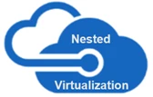
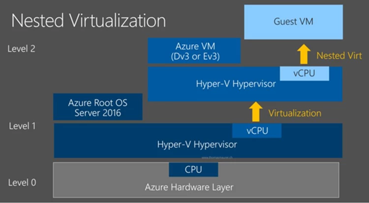
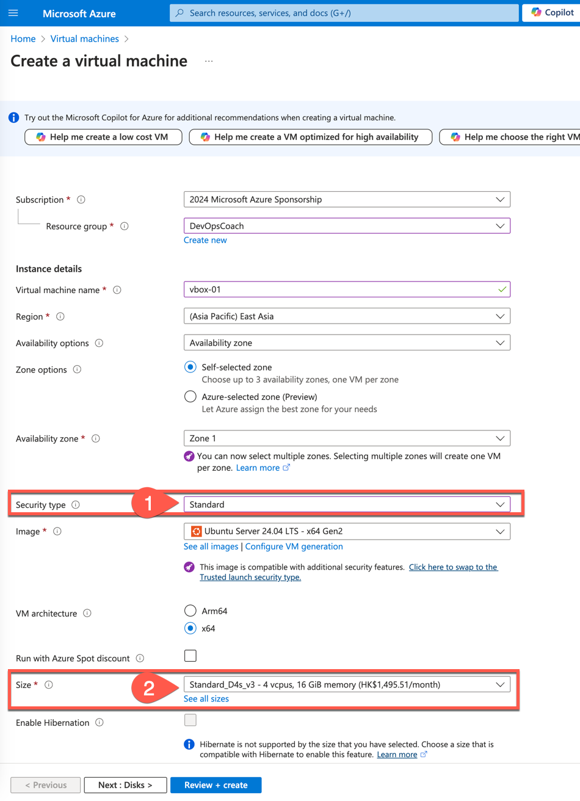
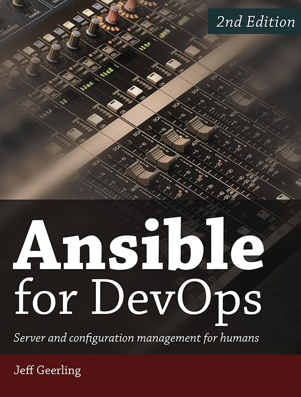

## Azure 支持嵌套虚拟化

嵌套虚拟化是一种经常在物理服务器实验环境中所使用到的场景。例如，你可以在 VMware ESXi 或者 Hyper-V 虚拟机中运行 ESXi，KVM，Hyper-V 等一种或者多种虚拟机管理服务器，然后最内层的 Hypervisor 上运行虚拟机。在 Azure 的虚拟机中，运行 VirtualBox ，重建 VirtualBox 的虚拟机测试环境，就这种情况。



Azure 是在 2017 年 1 月，宣布支持两个新的可支持嵌套虚拟化的机型 Dv3 和 Ev3。「参见：<https://azure.microsoft.com/en-us/blog/nested-virtualization-in-azure/」；在创建虚拟机时，你需要在> Azure CLI 或者 Azure PowerShell 中设置 `--nested-virtualization` 参数。或者在 Azure 门户中，需要在创建虚拟机时选择 `Dv3 或者 Ev3` 系列的虚拟机。



注意：如果没有选择合适于嵌套虚拟化的机型，你依然可以在虚拟机中安装 VirtualBox，可以创建虚拟机，但是无法正常启动运行嵌套的虚拟机。

## 创建 Azure 虚拟机

在 Azure 门户中，选择 `虚拟机`，然后选择 `创建`，选择 `Dv3 或者 Ev3` 系列的虚拟机，其它相关选项如下图所示。



1. 安全类型：这里选择 “Standard” ，这里默认的是 “Trusted launch virtual machines” , 如果选择了默认选项，嵌套虚拟机的虚拟机是无法正常启动的。
2. 在选择机型的时候，选择 `D` 或者 `E` 开头的，并且是 `v3` 结尾的系列。
3. 这里操作系统的选择的是 `Ubuntu Server 22.04 LTS`，Ubuntu 操作系统可以使用 VirtualBox 或者 Kvm 等虚拟化技术。

在使用了上面的选项之后，你就可以在 Azure 虚拟机中正常安装和使用虚拟化软件了。就可以使用你所选择的虚拟机管理软件，在 Ubuntu 操作系统中运行虚拟机测试环境。当然你也可以使用 Windows Server 系列操作系统中的 Hyper-V 虚拟化技术。

## 用 Vagrant 管理虚拟机环境

Vagrant 是一个用于构建和管理虚拟机环境的工具，它可以用于在虚拟机中自动化的安装软件，配置网络等操作。Vagrant 使用 Ruby 语言编写，使用 Ruby 的 DSL 语言来描述虚拟机的配置。

请参考 Vagrant 的官方文档，学习如何安装和 Vagrant 来管理虚拟机环境。

在 Ubuntu 系统中，可以通过以下命令安装 VirtualBox 和 Vagrant。

### 安装 VirtualBox 和 Ansible

1. 更新系统软件包列表：

```bash
sudo apt-get update
```

2. 安装 VirtualBox：

```bash
sudo apt-get install virtualbox ansible
```

### 安装 Vagrant

1. 下载 Vagrant 的 Debian 安装包。请访问 [Vagrant 官方下载页面](https://www.vagrantup.com/downloads) 获取最新版本的链接。例如：

```bash
wget https://releases.hashicorp.com/vagrant/2.3.4/vagrant_2.3.4_x86_64.deb
```

2. 使用 `dpkg` 安装 Vagrant：

```bash
sudo dpkg -i vagrant_2.3.4_x86_64.deb
```

3. 如果安装过程中出现依赖问题，可以使用以下命令解决：

```bash
sudo apt-get install -f
```

### 验证安装

安装完成后，可以通过以下命令验证安装是否成功：

1. 检查 VirtualBox 版本：

```bash
virtualbox --help
```

2. 检查 Vagrant 版本：

```bash
vagrant --version
```

3. 检查 Ansible 版本：

```bash
ansible --version
```

通过这些步骤，你可以在 Ubuntu 系统中安装并配置好 VirtualBox、ansible 和 Vagrant。

### 创建 Vagrantfile

Vagrantfile 是 Vagrant 的配置文件，用于描述虚拟机的配置。你可以使用 Vagrantfile 来定义虚拟机的操作系统、网络、共享文件夹等配置。

以下是一个简单的 Vagrantfile 示例：

```ruby
# -*- mode: ruby -*-
# vi: set ft=ruby :

Vagrant.configure("2") do |config|
  config.vm.box = "geerlingguy/rockylinux8"

  # Provisioning configuration for Ansible.
  config.vm.provision "ansible" do |ansible|
    ansible.playbook = "playbook.yml"
  end
end
```

z这个 Vagrantfile 使用 `geerlingguy/rockylinux8` 作为基础镜像，并使用 Ansible 来配置虚拟机。你可以根据自己的需求修改 Vagrantfile。

下面创建一个简单的 Ansible playbook 文件 `playbook.yml`：

```yaml
---
- hosts: all
  become: yes

  tasks:
  - name: Ensure chrony (for time synchronization) is installed.
    dnf:
      name: chrony
      state: present

  - name: Ensure chrony is running.
    service:
      name: chronyd
      state: started
      enabled: yes

# The same as the above play, but in super-compact form!
- hosts: all
  become: yes
  tasks:
  - dnf: name=chrony state=present
  - service: name=chronyd state=started enabled=yes
```

这个 playbook 会安装 `chrony` 时间同步服务，并启动该服务。

这个测试示例的目的是：在 Ubuntu 虚拟机中运行 Vagrant，使用 Vagrantfile 来配置虚拟机，使用 Ansible playbook 来配置虚拟机。

### 启动 Vagrant

在包含 Vagrantfile 的目录中，运行以下命令启动 Vagrant：

```bash
vagrant up
```

Vagrant 会根据 Vagrantfile 的配置创建虚拟机，并使用 Ansible playbook 配置虚拟机。

### 连接到虚拟机

使用以下命令连接到虚拟机：

```bash
vagrant ssh
```

登录到虚拟机后，你可以验证 `chrony` 服务是否已经安装并运行：

```bash
systemctl status chronyd
```

如果一切正常，你应该看到 `chronyd` 服务已经启动。

使用 vagrant 查看虚拟机的状态。

```bash
vagrant status
```

使用 virtualbox 查看虚拟机的状态。

```bash
vboxmanage list vms
```

使用 virtualbox 查看虚拟机的详细信息。

```bash
vboxmanage showvminfo <vm-name>
```

到目前为止，我们成功的完成了 Azure Ubuntu 虚拟机 + virtualBox 虚拟化 + vagrant + Ansible 的环境搭建。这是一个非常好的学习和开发环境，你可以在这个环境中学习DevOps技术，Ansible 自动化运维管理的知识。

## 推荐学习资源

强烈推荐这本书《[Ansible for DevOps](https://www.ansiblefordevops.com/)》，这是一本非常好的 Ansible 入门书籍，作者 Jeff Geerling 是一位非常有经验的 DevOps 工程师，他在这本书中详细介绍了 Ansible 的基本概念和高级用法，非常适合初学者学习。



* 书的代码库：<https://github.com/geerlingguy/ansible-for-devops.git>
* 书的全文：<https://github.com/geerlingguy/ansible-for-devops-manuscript.git>

经过我的测试，Azure 的 Ubuntu 虚拟机中运行的 VirtualBox 虚拟机，可以正常运行，但是性能会有所下降。请选择具有足够内存和 CPU 的机型，加快 Ansible playbook 的执行速度。在有些时候也发现：嵌套虚拟机的网络下载速度非常慢，这可能是 Azure 的网络问题，或者是虚拟机的网络配置问题。在网络速度上应该还有优化的空间。

 ❤️ Photo by cottonbro studio: <https://www.pexels.com/photo/2-blue-and-yellow-ceramic-owl-figurines-4966171/>
