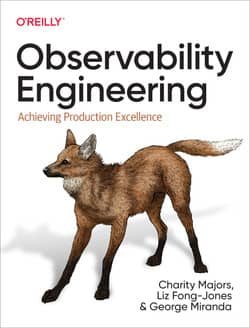
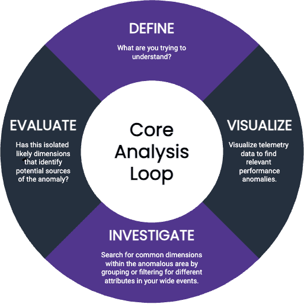

“可观测性工程”(Observability Engineering) 是一个近年来在软件工程和系统管理领域中逐渐受到关注的概念。它主要关注的是：如何更好地理解、监控和调试复杂的分布式系统。

DevOps浪潮已经给“软件工程”相关的实践带来了极大的影响。首先表现在各个职能团队已经越来越更加紧密的协作和沟通，部门墙正在逐渐消失，有更多的产品团队转型为“Two pizza team”风格的全功能团队，开发、测试、运维、数据库专家、云计算专家都融合在一起，自给自足的独立发布产品。其次软件流水线的工艺也更加的自动化，有朋友曾这样告诉我：他们的 CI/CD 已经可以实现每日多次自动化发布，产品团队每周持续交付到了手发麻的程度。

然而，不管我们如何娴熟的使用云平台、容器平台和微服务所带来的高可靠性、自愈能力和稳定性等等优势。当我们在生产环境中 debug 故障的时候，我们依然是云里雾里的凭经和灵感验猜测，还是不得不在多种监控工具之间解读着七长八段的数据， MTTR 故障修复时间仍然长的忍无可忍。我们应该能逐渐意识能到：应用系统的现代化所带来的也不都是好处，还有更多的是“复杂度”。软件应用系统本身和其运行环境的复杂度都在逐渐攀升，四分五裂的运维管理的工具集正在迅速蔓延。

在最近的三年多以来，我逐渐开始对曾经经典的“可观测性 == 三根支柱”的理解有所动摇；简单的信号量数据的叠加和关联就足够了么？监控工具手段的更新换代是否就可以实现可观测性。在持续没有找到答案的时候，《observability engineering》这本书出版了。

- 作者： Charity Majors, Liz Fong-Jones, George Miranda
- 出版日期： 2022 年 5 月
- 出版社： O'Reilly Media, Inc.
- URL：<https://www.oreilly.com/library/view/observability-engineering/>

Liz Fong-Jones 曾经是 Google 资深的 SRE 工程师和布道师。我几乎看过她的所有相关视频，也转发了一些在我的 B 站里。她离开了 Google 之后，与 Charity 一起创立了 Honeycomb 公司。 George Miranda 是后加入 Honeycomb 公司的员工，他加入这本书的写作时，这本书已经基本是个半成品。

本书是第一本只讨论“可观测性”这一主题的书籍，围绕这个主题做了相当深度和广度的讨论。这本书的完整目录在网上都可以找到，下面是关于核心内的脑图。

>“可观测性” - 应该成为软件在交付生命周期中的不容忽视的一个重要属性。不只是一个技术问题，在软件系统中实现和提升可观测性同样需要 DevOps 风格的多团队协作。

>"可观测性工程"的价值 - 增强可观测性的主要好处是提高系统的可靠性、性能和安全性。当系统出现问题时，拥有良好的可观测性意味着可以更快地发现、定位和解决问题。

>“可观测性工程”的文化和实践：可观测性不仅仅是一组工具或技术，它也是一种文化和实践。这意味着，开发者和运维人员需要紧密合作，共同关心系统的健康和性能。

随着现代软件系统变得越来越复杂，可观测性工程成为了确保高可用性、性能和用户满意度的关键要素。

《可观测性工程》这本书分为五个部分，从历史到未来，从理论到落地，从团队到组织，从商业到文化，内容非常全面。对不同角色和职位的人都有不同的意义：

- 运维：学习掌握本书的内容，可以提升你的眼界和实践能力；你会更好的识别和反思当前所处的困局，你会从分门别类的监控工具集应用，转向“聚焦生产环境问题的快速识别和解决”。
- SRE：使你对基于 SLO 的监控更加有信心，特别是升级你对遥测数据采集、数据结构、后台存储和在团队中推广等方面的认知。你将会更有效的和产品团队合作。
- 开发：希望这是你学习可观测性的第一本书，本书的前三个部分就是你需要学习掌握的部分。掌握了可观测性驱动开发的概念，你以后就会对应用系统的运行状态了如指掌，它是你 DevOps 和 SRE 技能组合中不可缺少的一个部分。
- 经理和管理者：建议完整的阅读本书的所有内容，重点理解第一、四和五这三个部分。如果您已经熟知可观测性这个概念，可以直接重点阅读第四和第五部分。这是你在产品团队中，在整个组织里大范围落地可观测性左移的必备常识。分布在各个章节里的真实案例分析是不可错过的内容。
- CxO：建议至少阅读中的案例研究，然后重点了掌握第四和第五部分。从这些内容中，你可以轻易的了解到投资可管的测性的技术要点，用于前期的投资和收益的评判，用于中后期管理的成熟度模型（PS：适用于产品团队自身的成长和进度评估，不建议用于产品团队间/部门间的横向比较和绩效考核）。

《可观测性工程》书籍中的亮点和创新之处在于：将可观测性的基础知识部分，用开发一种全新的可观测性程序的方式进行描述。首先解释：这个程序最底层的构建要素的角度是什么？分析可观测性的最底层数据结构是什么？然后，我们可以很容易的将这些数据应用到用它们来描述：应用系统在生产环境中的状态的变化过程。同时还提到了如何对接开源的 OpenTelemetry 数据；希望开发的同学能对此种描述方法倍感亲切，同时让运维和 SRE 同学也能拥有一个全新的视角。

《可观测性工程》一书的另外一个独特之处，是在第八章中引入的“用第一性原理调试应用故障”。虽然可观测性管理的基本流程也是收集、存储和分析使用数据的过程，这看起来和其它单点的监控功能相似。但是，有没有一个统一的思路可以贯穿这个过程始终，并且推动这个过程不断的循环起来。我总是听说马斯克怎样运用第一性原理指导他在造车和火箭过程中的各种创新，并没有想到和监控运维管理会有什么关系。但是本书中所描述的“核心分析循环”还是令我耳目一新。在生产环境排错的过程中，所有人都将关注点和焦虑点都放在“谁？什么时候？可以在系统中定位到哪个最准确的唯一（假想中的）的根因（root cause）”。这种过分关注的结果想法，让我们已经忽略了，在 Debug 过程中，我们应该使用什么思路，去探索未知现象中隐藏的未知的应用运行的多重故障原因。

“核心分析循环”并不是系统宕机后的救命稻草，而是一种理性冷静的思考方法，你可以在事故的前中后的任何时刻想到它。它能指导我们进行更加深度的分析思考，在一个理智的探索过程中，你会更加有条理的得出一连串假设，并逐个求证，在评判各种已知数据的时候，你同样需要不停的怀疑一切，推翻一切结论的勇气。切勿让单点工具的片面观察角度、对历史经验数据的依懒性，限制了我们 debug 生产系统的想象力，限制了人脑更适合做网状的复杂关联分析的能力。

下面是本书中的一些精彩片段。

> 【序言 - Cindy Sridharan】：本书没有关注协议或标准，甚至各种遥测信号的低级表示，而是将可观测性的三大支柱
设想为结构化事件、假设的迭代验证以及“核心分析循环”的三位一体。根据第一性原理对可观测性的构建要素进行整体重构，有助于强调仅通过遥测信号（或简单使用获取这些信号的工具）并不能最大限度地践行观测系统的所有行为。

> 【11.6 章 -- 可观测性左移】：可观测性驱动开发允许工程团队将他们的玻璃城堡变成可以互动的游乐场。生产环境不是一成不变的，而是充满了活力。工程师应该有能力和自信来应对任何异常并且取得胜利。

> 【14.4 章 - Slack 案例研究结论】：我分享了Slack 如何探测CI 流水线以及如何调试分布式系统的示例。开发人员了解生产环境中的代码情况，首先要考虑的应该是调试分布式系统的复杂性。但是，在发布到生产环境之前，如何正确理解和调试分布式系统同样具有挑战性。

我个人认为：本书完整的回答了大量的问题，可观测性是什么？如何构建？如何左移？实现可观测性管理平台中的重要技术要点？如何在团队和组织中落地和规模化可观测性？怎样构建可观测性文化？等等。即使作者在序言和文中郑重提出，作者团队尽量避免持有任何立场，避免推广其公司产品和技术的意图。但是从文章中所引用的工具界面上看，从对核心数据结构“事件”的论述过程中看，从所引用的他们与 Slack 公司的合作案例上看；都难免脱离所在公司产品的身影。而公正的看，我们无法称之为瑕疵和片面。读者需要在理解此背景的前提下，批判性吸收书里的内容，从而避免在理解上以偏概全的可能性。本书的行文内容上看，那些高调的、上得了厅堂的内容可以用来与 CxO 对话；那些深入的、下得了厨房的代码可以用来与开发工程师沟通。本书使用了大量的篇幅在讨论“可观测性”的来龙去脉，讨论与传统监控的区别和关系，论述落地实现的细节；总的来说：这是一本在“可观测性”主题上用心良苦的作品。意在苦口婆心的引导大家走上构建应用系统可观测性的正确道路。

下面是在 Amazon 上关于本书的评论总结：

1. 本书深入介绍了可观测性的实际含义，强调它能够解决新问题，构建可观测系统不一定需要添加新遥测数据。
2. 书中讨论了可观测性的基本概念，指出它是社会技术系统，能够促进开发人员和业务人员之间的沟通。
3. 可观测性在大型公司内部的推广是社会问题，需要说服管理层，书中提供了这方面的指导。
4. 书籍中有关构建可观测性堆栈的高级方法的简要说明。
5. 可观测性不仅仅是监控，它强调了从"为什么"出发，涉及实现细节和相关技术。
6. 评论者强调可观测性是在分布式系统中获取有用信息的关键，提到了跟踪数据流和高基数跟踪的重要性。
7. 书中包含了一些行业领导者的案例研究，介绍了他们如何应用可观测性方法监控生产环境。
8. 书中涉及了日志、度量、span、追踪、警报等概念，强调了原则胜过具体代码。
9. 评论者强烈推荐本书，认为它适用于任何希望为客户构建系统的人，并具有实际应用价值。
10. 评论者认为本书是向可观测性转变的人的必读之作，介绍了关键概念和工具的应用。

中文版书籍在各大电商平台有出售。感兴趣的朋友可以入手学习。

最后，我认为一个软件系统应该拥有三只眼：

1. 👁 稳定之眼：从 SRE 站点稳定性工程的角度讲，系统的稳定性是最重要的feature，没有之一。我深度认同这个观点。稳定性包含了服务必须具备的可用性和足够的性能。只有运行在生产环境中，被用户能正常访问和使用的代码才能发挥出它应有的价值。在运行的过程中，应用系统会宕机，运行环境可能会出问题，这都会导致应用系统的无法访问和使用；或者系统的 Bug 导致的高错误率，让系统处于半死不活的状态，用户也能从界面上看到千奇百怪的错误。系统是否进入了非正常的不可用状态？系统是否正在经历着性能抖动的过程？错误率是否高涨到即将溃坝？这些现象本质是产品的稳定性不足导致的，而这些现象是否可见，故障根源是否能快速定位？我们就需要用到第三只眼。
2. 👁 混沌之眼：这是一只作死之眼，它是混沌工程。混沌工程旨在对生产环境中注入人为的故障，在云环境中可以使用的手段很多：随机的关闭虚拟机、随机的杀死正在运行的进程、在网络中注入导致网络拥塞的数据包等等。在错误注入的过程中，我们关注于应用系统还是否能正常使用？应用系统如果宕机了的话，它的故障模式是怎样的？然而，可视化这个过程，可视化应用宕机现场的细节，都需要用到第三只眼。对于混沌工程的复盘和数据分析能帮助应用系统提高稳定性，消除单点故障，提升故障容忍度和自动化迁移等等。
3. 👁 可观测之眼：可观测性是应用系统本身的一种属性，可观测性的呈现不仅需要在应用程序代码中进行埋点增强（充分条件），还需要方便的采集遥测数据，这些都需要用到可观测性管理平台：可观测信号量的收集、上报、存储和展现分析等功能。可观测性管理平台是‘可观测性’显现（外显）/表现出来的必要条件。

以上是我对《可观测性工程》这本书的简介，希望对大家学习可观测性知识有所帮助。在结尾我用比喻的方式引出了应用系统应该拥有的三只眼的观点，它们是相辅相成且相互成就的关系。

❤️ Feature Photo by RealToughCandy.com: <https://www.pexels.com/photo/person-holding-a-sticker-11035393/>
