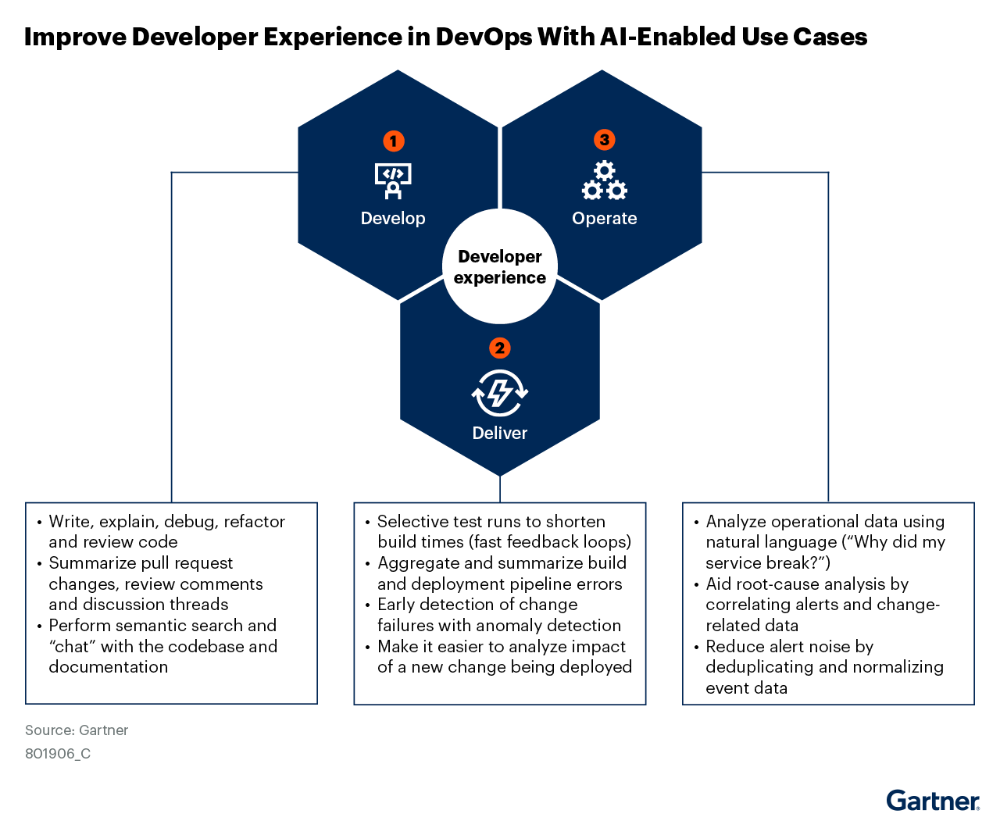
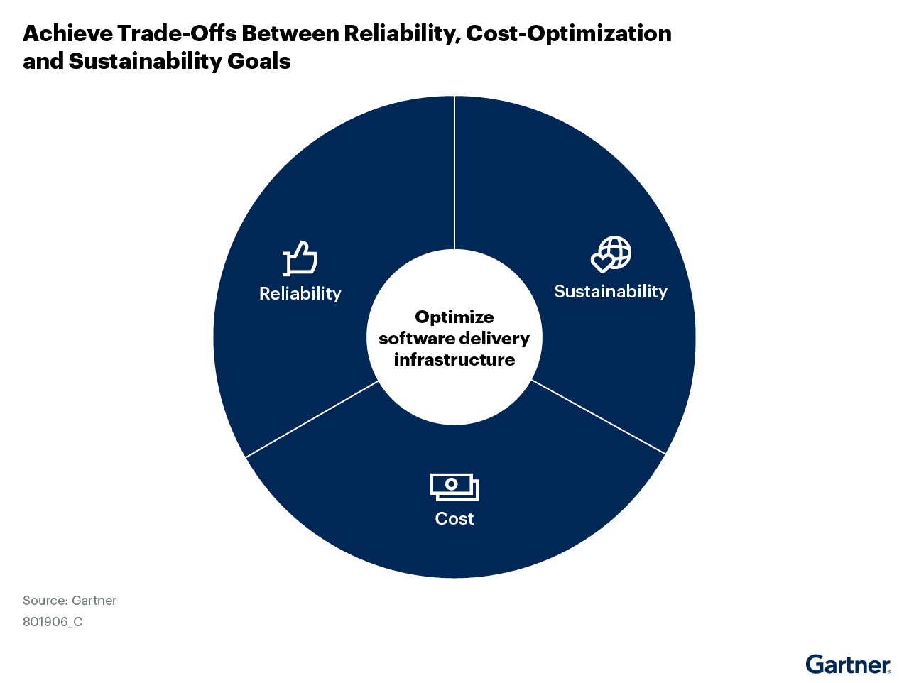
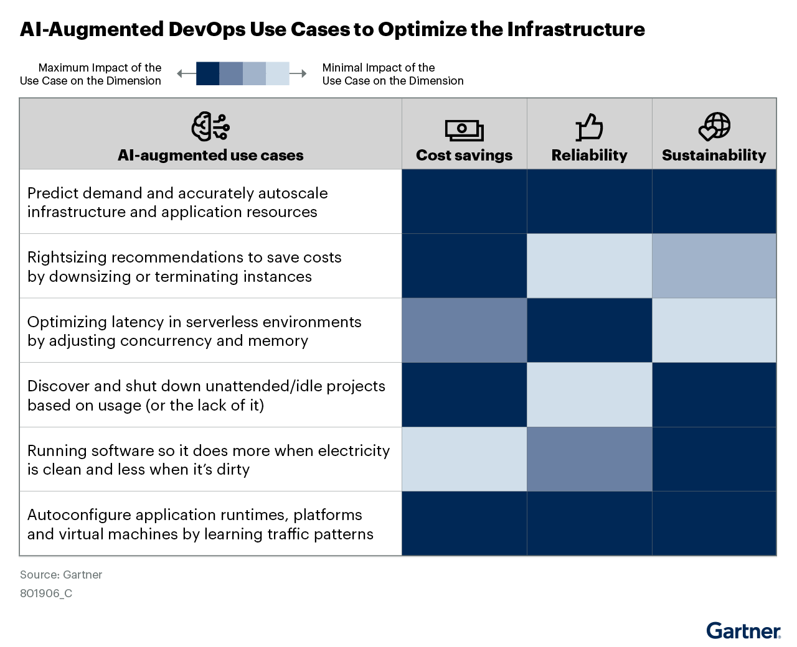

>本文来源 Gartner ：[《How Platform Engineering Teams Can Augment DevOps With AI》](https://www.gartner.com/doc/reprints?id=1-2G9VK5IK&ct=240117&st=sb)

## 概述

### 主要发现

* 许多组织已经在使用 AI 编码助手、AI 测试工具和 AIOps 平台来优化 DevOps 的特定活动。然而，要缩短整体交付时间，必须识别并克服软件交付各阶段的瓶颈。
* 生成式 AI 为在软件开发生命周期 (SDLC) 的多个阶段中，减少开发者摩擦，并提升开发者体验方面，带来了新机遇。这些摩擦包括：对代码库的理解不足，以及调试、代码审查和根本原因分析中花费的大量时间。
* 提升软件交付流程的效率需要优化和协调 SDLC 的所有阶段。常见的低效表现包括：长时间的构建过程、分析构建流水线错误、变更影响分析和缓慢的事件响应。
* AI 提供了传统自动化无法比拟的优势，帮助产品团队以更可靠、可持续和成本效益高的方式，来管理其软件交付基础设施。

### 建议

推动平台工程计划的软件工程领导者应：

* 通过识别和优先解决软件交付流程中的瓶颈，确定适合的 AI 应用场景，从而系统地改进 SDLC。注意供应商的“AI 洗涤”现象，避免在传统自动化手段已经足够的情况下，还要使用 AI 技术进行过度设计。
* 通过支持 AI 增强的工作流来改善开发者体验，减少认知负担，帮助开发者在开发、交付和运营阶段实现流畅的工作状态。
* 通过将 AI 优化集成到 DevOps 流程中，提高各个 SDLC 活动的反馈效率。
* 在内部开发平台中，提供自助式 AI 基础设施管理能力，以优化软件交付基础设施。

## 战略规划假设

预计到2027年，使用 AI 增强 SDLC 每个阶段的平台工程团队的比例将从 5% 增至 40%。

## 介绍

随着 AI 编码助手和 ChatGPT 的推出，软件开发成为生成式 AI 的主要应用领域之一。在 2023 年 Gartner 关于生成式 AI 的 IT 领导者调查中，52% 的 IT 领导者表示：他们期望团队在软件开发中使用生成式 AI。Gartner 同行社区成员的调查显示，61% 的软件工程领导者对生成式 AI 在代码生成中的潜力感到兴奋。

然而，开发人员并不总是花大部分时间在编写代码上。他们平均只有 10% 到 25% 的时间用于编写代码。其余的时间则用在阅读规范、写文档、做代码审查、参加会议、帮助同事、调试代码、与其他团队协作、配置环境、处理生产故障、学习技术及业务知识等方面。因此，若只关注代码编写，而忽略了 DevOps 流程的其他环节，可能就不会暴露出开发周期中的其他低效问题，而无法提升整体性能。

因此，我们的客户开始从更广泛的角度看待 AI 在 DevOps 中的应用，并提出诸如：“在未来三年内，AI 将如何影响 DevOps/DevSecOps？”，以及“我们如何在敏捷和 DevOps 流程中全面应用 AI？”等问题。

>集中化平台的快速发展，以及在软件开发生命周期各阶段（从构思和规划到生产部署管理）整合 AI/ML，将彻底改变软件工程。
>——JPMorgan Chase 工程师平台和体验负责人 Sandhya Sridharan

平台工程团队将在解决这些问题中起到关键作用，因为他们的职责是：帮助开发团队提升交付速度、软件质量和大规模的开发者体验。他们需要了解现有和潜在平台用户的需求，从多个产品开发团队的挑战中获取独特的洞见。

平台工程团队应采取三管齐下的方法，通过 AI 工具和技术来增强 DevOps 工作流（见图 1）：

1. **改善开发者体验**：在 SDLC 各阶段，AI 增强的用例包括：代码建议和代码解释、总结拉取请求的变更，解释流水线错误，以及使用自然语言查询操作数据和服务健康状态。
2. **提升软件交付工作流的效率**：AI 优化的例子包括：测试影响分析（缩短构建时间）、自动化代码审查和变更影响分析（辅助人工监督）、以及事件关联（缩短事故解决时间）。
3. **优化软件交付基础设施**：AI 技术的例子包括：自主工作负载优化和增强的 FinOps，从而优化可靠性、成本和环境可持续性。

## 分析

### 识别并优先解决 SDLC 中的瓶颈

想要通过 AI 增强 DevOps 工作流的平台工程团队，应该先识别并优先解决阻碍 SDLC 工作流的瓶颈。

这些瓶颈主要有两种：

1. 跨越 SDLC 各阶段的工作流障碍
2. SDLC 每个阶段内部的工作流障碍

第一类瓶颈可以在系统性审视整个软件交付价值流时得到显现。系统性视角让我们能够识别到，哪些存在于 SDLC 各角色和团队“交接工作”过程中的瓶颈。

涉及多个阶段或多个团队的瓶颈示例如下：

* 开发人员等待设计师和产品经理的输入
* 运营团队等待分析变更的影响
* 安全团队执行部署前检查

某些瓶颈可能被认为是“必要的”，但无论如何，这些延迟对客户来说并没有增加价值（见图 2）。

--Some-examples-of-such-constraints-include-necessary-and-unnecessary-non.png)

第二类限制更容易发现，因为它们出现在“单一工作线程”中。这些逻辑上的工作线程的例子如下：

* 开发流程内部（编码、构建、测试、调试、重构、提交）
* 代码检入过程（拉取请求、代码审查、安全检查）
* 持续集成（构建代码、运行单元测试、运行 SAST/DAST 测试、运行服务健康检查）
* 环境管理（创建虚拟机、容器编排、设置基础设施）
* 事故响应（分类警报、事件关联、分析日志、根本原因分析）

在每个阶段，不同团队可能面临着不同的限制。例如，处理遗留代码库，并进行增量更改的团队发现最大的限制不是编码效率，而是对旧代码库缺乏理解。因此，平台工程团队需要与产品工程团队合作，了解开发者的痛点，确保 AI 功能的实现是基于实际需求的。

图 3 重点分析了在每个工作线程中的具体活动，并展示了 AI 如何解决这些限制和瓶颈。无法一次解决所有问题—— 因此，应识别并迭代地解决此时此刻的最大的限制约束点（见注释 1）。

-phase--As-all-constraints-can't-be-resolved-at-once,-identify-and-resolve-the-greatest-constraint-within-each-S.png)

### 改善开发者体验

改善开发者体验已成为软件工程领导者的关键优先事项，58% 的领导者表示，这对他们的组织高管层非常重要。提升开发者体验或生产力是开发者平台和工具类技术和实践的首要价值因素。因此，平台工程团队在使用 AI 增强 DevOps 工作流的第一步应集中在改善使用平台的人员体验上。

图 4 展示了在软件开发、交付和运营过程中，通过 AI 增强改善开发者体验的使用案例。

通过 AI 使能开发者的使用案例改善的开发者体验涵盖整个 SDLC，从开发、交付到运营。以下是 AI 在各阶段提升开发者体验的方式：

#### 开发

在开发阶段，开发者体验主要受认知负荷和上下文切换次数的影响。AI 编码助手可以在 IDE 内提供相关信息，减少开发者的上下文切换，避免他们需要离开开发环境去网上查找信息。

帮助开发者减少认知负荷并实现流畅工作的 AI 功能包括：

* 代码生成
* 代码理解
* 辅助调试
* 文档生成
* 漏洞解释
* 自动修复

有关提供这些功能的代表性工具的详细分析，请参见《AI 编码助手创新指南》和《AI 增强软件测试工具市场指南》。

#### 交付

在软件交付阶段，改善开发者体验的重点是缩短反馈周期和减少重复的低价值工作。AI 使能的功能示例包括：

* 自动建议修复构建错误
* 预防变更失败（通过变更影响分析和变更风险预测）
* 缩短构建时间（使用智能测试选择）

这些功能可以为开发者提供更快的反馈。CircleCI、Digital.ai、GitLab 和 Harness 等供应商正将 AI 增强功能集成到 DevOps 平台中（见《DevOps 平台魔力象限》）。

#### 运营

这一阶段传统上主要依靠 AIOps（预测 AI）功能，通过异常检测、事件关联和基于警报和遥测数据生成见解来加速事故响应（见《AIOps 平台市场指南》）。

生成式 AI 可以通过以下方式进一步消减常规任务：

* 根据事故模式自动生成运行手册-run-book（例如 Shoreline 和 Transposit 等供应商）
* 在事故响应期间通过总结、解释、翻译、内容生成、预测和建议来减少值班工程师的认知负荷。这在值班工程师不熟悉引发事故的代码时尤为重要（例如 BMC、PagerDuty、ServiceNow、Shoreline 和 Transposit 等供应商）。
* 在故障排除或自动化 DevOps 工作流时，使用自然语言（例如“描述最近对生产环境的变更有哪些？”）（例如 Cortex、Kubiya、New Relic 和 Dynatrace 等供应商）。

### 提升软件交付效率

除了改善软件交付工作流中的开发者体验，AI 还具有优化工作流效率的潜力。平台工程团队可以在创建“铺装道路”时集成 AI 功能，以简化从构思到生产的价值流动。在此过程中，他们可以系统地了解从客户承诺到客户看到结果的整个工作过程。系统视图通常是价值流映射的一部分（见《DevOps 流程价值流映射指南》）。

单靠自动代码生成来提升软件交付性能，在超过一定阈值后会，所产生收益会递减——因为最大的价值交付瓶颈可能在其他地方（见注释 1）。图 5 显示了帮助克服 SDLC 限制（约束点）的 AI 使能案例（如第一部分所述）。

-include-planning,-creating,-verifying,-reproducing,-releasing,-configuring-and-monitoring--Focusing-solely-on-automated-code-generation-to-enh.png)

图 6 展示了用于实现上述使用案例的一些工具，并不限于所展示的示例。供应商正在迅速扩展其功能，因此一个供应商可能支持比这里描述的更多使用案例。

-includes-test-optimization,-vulnerability-remediation,-incident-response,-AIOps,-cost-optimization,-automating-configuration-toil-and-other.png)

>**AI 增强开发的下游影响**
>
>AI 编码助手使开发者的编写代码效率提升，但这也带来一个意外的副作用：代码审查和安全审查的工作量积压增加。缓慢的代码审查会降低整体开发效率。根据 2023 年 DORA 报告，代码审查速度快的团队其软件交付性能提高了 50%。平台工程团队可以看清这些系统性互相关系，适合推动系统性变革，而不仅仅是局部改进。
>
>因此，平台工程团队在支持 AI 增强开发工具的同时，必须补充卓越的 DevSecOps 实践。否则，我们将面临开发者产生虚假的安全感、重复代码和未经审查的代码推送，进而导致质量和安全问题。

### 优化软件交付基础设施

平台工程团队负责管理、治理并向产品团队提供软件交付基础设施。然而，规模化管理软件交付基础设施非常复杂，如下公式所示：

> 软件交付基础设施 = （支持所有环境中应用及其组件的完整 SDLC 的基础设施）x（应用数量）

软件交付基础设施不仅限于生产环境，还包括开发、测试、压力测试和预发布环境。此外，基础设施还必须支持部署和测试应用所需的各个组件。这些组件可能包括源代码管理系统、云开发环境、持续集成服务器、数据库服务器，以及运行时基础设施堆栈（由物理主机、虚拟机容器和应用运行时组成）。

产品团队越来越期望自助工具能够在成本、可靠性和可持续性之间实现优化（见图 7）。

**通过自助内部开发平台优化云原生软件交付基础设施**

优化公有云基础设施变得尤为困难，但也非常重要。这主要是由于云服务种类繁多、定价模式不一致、云原生应用的分布式特性以及流量模式的季节性变化。为了可靠、经济和可持续地管理基础设施，平台工程团队应为产品团队提供支持 AI 增强的自助平台和工具，以优化成本、可靠性和可持续性。

新兴技术如自主工作负载优化和增强的 FinOps，可以自动化优化价格和性能，同时实现预定义的业务目标。供应商包括 Akamas、Anodot、Apptio、Avesha、CAST AI、Densify、Google Cloud（Active Assist、Duet AI）、IBM（Turbonomic）、Sedai 和 StormForge。图 8 显示了这些工具支持的 AI 增强使用案例。

平台工程团队应将这些技术整合到内部开发平台中，以优化计算基础设施。这使开发人员和站点可靠性工程师能够可靠且经济地管理和运行应用程序（见 2023 年 IT 管理智能炒作周期）。

### 快速回答

**在使用 AI 增强 DevOps 工作流时需要注意哪些陷阱？**

软件工程领导者必须警惕潜在的陷阱和意外的副作用：

* 注意供应商的“AI 洗涤”，避免在传统自动化选项足够时，还用 AI 技术过度再造设计。通过组建跨职能团队进行试点，创建和验证相关假设进行前后对比分析。使用结果驱动的 KPI 来定义和衡量成功。
* 将 AI 应用于 SDLC 的某个部分（局部），可能会导致工作量的转移，而不是节省，从而产生一种虚假的时间节省感。例如，在编码过程中节省了时间，可能会因为代码审查和调试时间的增加，而正负抵消（见评估生成式 AI 如何改善开发者体验）。
* 尽管 AI 旨在降低认知负荷，但它也可能无意中降低认知技能水平。是人类员工的认知技能在不使用的情况下，而随之退化，这使我们在 AI 工具达到其极限时，反而无法做出正确决策。使用 AI 作为决策引擎的另一个风险是，它会降低人类对系统运行方式的理解，并导致缺乏情境意识。
* 大多数生成式 AI 工具无法确保输出的一致性、准确性、可重复性和可预测性。“幻觉”使当前的技术难以胜任关键任务。然而，涉及检索增强生成（RAG）和模型微调的技术，可以通过访问最新的知识源和特定上下文数据来减少幻觉。使用基础模型作为控制器来构建执行狭窄任务的智能体也有前景。例如，Adept、AgentGPT、AutoGPT 和 Agents for Amazon Bedrock。Gartner 称这些为“自主智能体”（见 2023 年生成式 AI 炒作周期）。

## 证据

1. Gartner IT 领导者对软件工程生成式 AI 的调查：这项调查于 2023 年 5 月 2 日至 8 日在线进行，旨在收集生成式 AI 在软件工程中的当前和预期使用情况数据。共有 91 名 IT 领导者参加，他们是 Gartner 研究圈的成员，一个由 Gartner 管理的小组。参与者主要来自北美（n = 44）和 EMEA（n = 33）；其他受访者来自亚太地区（n = 12）和拉丁美洲（n = 2）。免责声明：本次调查结果仅反映受访者和其公司的观点，不代表全球情况或整个市场。
2. 生成式 AI 对软件工程团队的影响
3. 软件开发人员的日常工作：微软
4. 软件开发中 AI 的现状，GitLab
5. 全球代码时间报告，基于 25 万多名开发人员的数据，Software.com
6. 2023 年 DevOps 状态报告，基于 3000 名专业人员的数据，Google Cloud
7. 自动化的讽刺——Lisanne Bainbridge
8. 国家人类系统集成委员会（BOHSI）小组：人类与 AI 团队合作：研究前沿，ResearchGate

## 注释 1

在《目标》一书中，Eliyahu Goldratt 博士将约束定义为“限制系统实现更高性能的因素”。

缓解最关键的约束对整体系统性能有着巨大影响。因此，我们必须迭代地识别、优先处理，并解决阻碍团队交付价值的最大约束。

❤️ Photo by Pavel Danilyuk: <https://www.pexels.com/photo/a-robot-holding-a-cup-8439093/>
