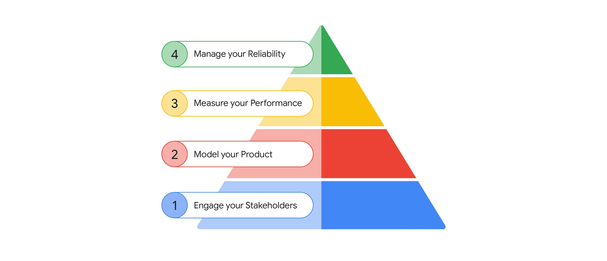
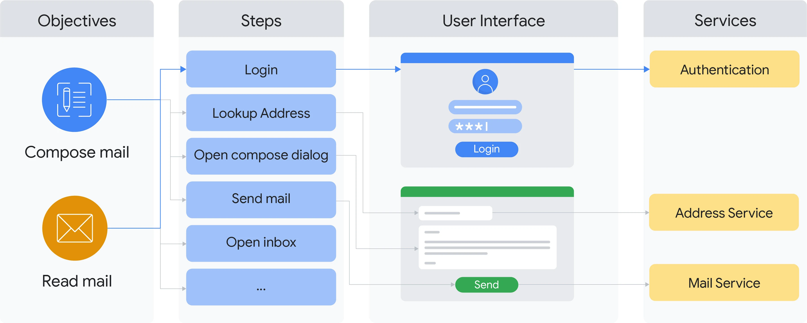
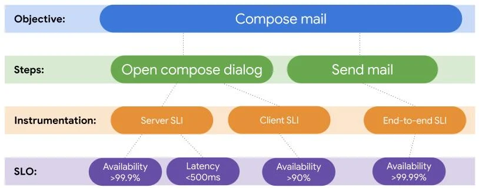

>作者：Carl Crous, Parker Roth 和 Victoria Hurd； 译者：刘征

## 介绍

站点可靠性工程师（SRE）传统上通过其服务间接支持产品，负责服务质量目标（SLO），并提高服务的可靠性。然而，这种方法存在一些限制，可能影响产品和用户体验：

- 服务仅能部分满足用户需求和业务目标。度量服务的可靠性只是对用户需求或业务目标的近似。
- 用户界面（UI）越来越复杂。在 UI 和 SRE 度量的服务之间存在许多层次，导致产品覆盖的显著差距。
- 服务增长可能轻易超过组织的工程增长，导致服务被忽视或团队负担过重。
- 服务支持优化了产品整体可靠性和性能的一小部分，而在这些服务范围之外存在显著风险。
- 服务本质上是同步的。异步流程常常被忽视或难以优先处理，因为其成功无法通过单一服务来度量。

本文探讨了这些限制，并讨论了一些 Google SRE 团队如何通过将支持重新聚焦于产品和最终用户需求来解决这些问题，而不是集中于基础设施和服务。我们还讨论了 SLO 策略，描述了 Google SRE 如何定义产品，并解释了如何决定哪些因素对实现产品可靠性至关重要。

**产品参与度**

为了支持产品，SRE 需要熟悉产品及其功能的设计和开发。同时，还需要了解终端用户在使用产品时的目标。

为了获取产品和用户信息，SRE 需要与产品经理和用户体验研究人员合作。这些人根据“要完成的工作”（Jobs to be Done）和 Google 的关键用户旅程（CUJs）等框架定义产品和功能，这些框架识别终端用户的目标和期望结果。

使用这些信息，SRE 可以识别出对产品及其用户重要的内容，并用定义产品的相同语言来定义可靠性。

## 服务支持模型

SRE 的核心责任是“负责其 [SRE] 服务的可用性、延迟、性能、效率、变更管理、监控、应急响应和容量规划”[3]。

在这种模型中，服务是 SRE 团队的主要所有权单位和工作对象。这种对服务的关注是 SRE 团队传统上建立的方式。它驱动了 SRE 如何优先处理工作、度量绩效，并扩大范围以支持更多服务。

SRE 传统上在基于服务的工作中表现出色，确保他们支持的服务具有高可用性。然而，服务可用性并不总是能带来用户对产品的满意，原因如下：

- 产品仍然会遇到超出 SRE 团队范围的故障，例如 Web 或移动应用中的问题。
- SRE 团队花时间响应可能对用户没有影响的情况。例如，HTTP 404 错误可能不会影响用户。

当 SRE 职责范围仅限于某一组服务时，SRE 团队通常没有足够的信息来有效解决这些问题。相反，SRE 被迫在不了解服务应如何表现的情况下评估这些服务。

SRE 团队可以接受对产品本身的责任，而不是对服务可靠性的责任。这种更高层次的**承诺优先考虑产品，而不是服务**。我们称这种方法为产品支持模型，它开启了一种新的可靠性思维方式。

## 产品支持模型

这种新产品支持模型的核心是 SRE 负责产品关键功能的可靠性。过去，SRE 被分配了一组在某个时间点都被重视的关键服务。现在，SRE 被分配了一组功能和用户期望的结果。在没有传统服务所有权固定边界的情况下，SRE 团队可以将其优先事项与业务和用户成果对齐，并在服务堆栈的每一层处理更广泛和更有影响力的工作。

>“如果你不能度量它，你就不能改进它。” — 彼得·德鲁克

在工程团队能够管理产品的可靠性之前，必须首先能够度量其可靠性。建立一套提供足够广度和深度覆盖的度量标准，对于团队识别最具影响力的工程工作，并避免过度优化任何特定系统的诱惑至关重要。

在团队能够度量产品的可靠性之前，必须首先知道要度量什么以及如何度量。知道要度量什么来自于将产品建模为一组用户可见的行为或功能，并根据它们为用户带来的价值，对这些行为进行优先级排序。掌握这份优先级列表后，团队可以开始从支持团队和服务转向支持产品及其用户。

图 1 说明了如何通过利益相关者对齐、产品建模和度量的坚实基础，来实现提高产品可靠性的最终目标。这些概念共同使团队能够将资源投入到对最终用户和业务最具影响力的问题上。

## 开始

在本节中，您将学习如何实施以产品为中心的可靠性参与，包括以下关键步骤：

1. 与利益相关者互动
2. 建模产品
3. 度量性能
4. 管理可靠性

每个步骤列出了为 SRE 团队带来价值的中间交付物及其解锁的机会。我们鼓励您按顺序进行，但也指出了可以利用现有指标和关系的领域。

### 1. 与您的利益相关者互动

与任何 SRE 参与过程类似，第一步是确定相关的利益相关者。在基于服务的参与中，依赖于 SRE 和开发团队之间的合作，而以产品为中心的参与则需要更多样化的合作伙伴。这里的更广泛的合作伙伴通常包括以下角色：

- 产品经理：定义产品策略和需求。
- UX 设计师和研究人员：将需求转化为用户体验。
- 工程团队：开发必要的功能和基础设施以实现用户体验。
- 支持专家：通过直接或书面沟通与最终用户互动。

为了成功管理产品可靠性，关键是要确定每个角色的责任。

>交付物：记录角色和职责的文档，例如 RACI 矩阵[7]。

确定所有相关利益相关者后，与他们会面，启动 SRE 的合作伙伴关系。

### 2. 建模产品

人们使用产品是为了实现现实世界的目标。为了帮助产品团队构建能够促进用户目标的产品和服务，您需要了解产品用户的目标。

本节介绍了两个关键概念：用户目标和步骤。用户目标描述了用户的意图和他们想要实现的目标。例如，邮件服务的一个目标可能是“与人交流”。步骤是用户为实现其目标而采取的各个独立操作。

“要完成的工作”（JTBD）[1,5] 框架将用户目标建模为工作，而 Google 的关键用户旅程（CUJs）[2] 将用户目标建模为伴随一系列任务或步骤的目标。

了解用户在使用产品或功能时的目标是软件开发的有力工具，因为它为您提供了关于产品最重要方面的清晰信号。用户的意图也是 SRE 可以利用的强大可靠性工具。

假设您的产品是使用“要完成的工作”框架构建的，那么您将拥有一份产品旨在促进的用户目标列表。产品经理、UX 设计师和其他非工程学科可能部分拥有这份列表。这份列表提供了用户想要实现的高级描述，基于跨职能的数据，为涉及软件开发生命周期的许多学科提供了共同的语言。利用这些共享的用户目标作为产品支持的基础是建模产品可靠性的基本第一步。

然而，如果您没有用户目标列表，可能需要自己开发这份列表，这将带来显著的工程成本，并导致只有 SRE 愿意使用的列表。更好的方法是与产品经理合作，并鼓励他们采用这些框架之一并负责定义用户目标。

用户目标被分解为用户为实现总体目标所采取的一系列步骤。每个步骤都是独立的工作单元，与其他步骤无关。这些步骤提供以下信息：

- 用户使用产品时在做什么的解释，或用户目标。
- 每个步骤的开始条件和多个成功或失败条件的定义。
- 可以与产品界面或基础设施相关联的具体操作列表，例如用户发送电子邮件时调用的 RPC。
- 目标只是将步骤组合在一起的组织元素。

基于这些步骤，您可以确定完成这些步骤所需的产品界面和基础设施的哪些部分。单一界面或基础设施服务的某些部分可能涉及不同的目标，因此可以具有不同的重要性级别。

>交付物：包含高级描述的用户目标和步骤的产品登记册。

**邮件服务产品定义示例**

让我们考虑一个允许用户发送和接收电子邮件的邮件产品，包括一些增值功能。我们将根据表 1 中详述的目标和步骤来建模此产品，并在图 2 中进行了说明。表 1 提供了可以被产品开发和支持中涉及的多个学科使用的基本产品模型。

 表 1: 用户目标和步骤示例
| 目标       | 步骤        | 描述                                                   |
|----------|-----------|------------------------------------------------------|
| 撰写邮件    | 登录        | 用户在登录页面进行身份验证。                                      |
|          | 打开撰写对话框 | 用户点击“撰写”按钮，撰写对话框被显示出来。                               |
|          | 查找地址     | 用户开始输入收件人的电子邮件地址，系统显示匹配的地址供选择。                        |
|          | 检查拼写     | 当用户输入消息时，系统会突出显示拼写错误。                                |
|          | 发送邮件     | 用户点击“发送”按钮，邮件被排队等待发送。                                 |
| 阅读邮件    | 登录        | 用户在登录页面进行身份验证。                                      |
|          | 打开收件箱    | 用户打开收件箱页面，显示所有邮件。                                   |
|          | 打开邮件     | 用户选择一封邮件，系统显示邮件内容。                                 |
|  |  接收邮件（异步）  | 当邮件服务收到新邮件时，它们会自动显示在用户的收件箱中。                     |

**产品重要性和优先级**

在转向产品支持模型时，请记住，SRE 团队在学习这种新方法时会面临更大的认知负荷。请通过战略性选择支持的方式和位置，来管理 SRE 团队的额外工作量。

例如，您可能希望将大量支持集中在核心用户目标及其步骤上，并用高成本但准确的端到端 SLO 对其进行检测。在这种情况下，您可以通过更便宜和传统的基于服务器的 SLO 支持较不重要的目标。

安排 SRE 工作的优先级本身就是一个具有挑战性的问题。我们通过基于特定目标与产品关键绩效指标（KPI）之间的关系，来定义重要性来解决这个问题。这些指标通常已被用来评估停机的严重性，因此使用这些 KPI 来安排 SRE 任务的优先度，可以确保 SRE 跟上不断变化的产品需求。

在 Google，我们使用特定产品的严重性指南（如 Google Cloud 重大事故 [6] 的场景）来指示停机对产品的严重性和影响。在 Google Ads 中，收入是评估停机严重性的关键指标，而在 YouTube 中，严重性指南包括用户观看视频的时间。参见邮件服务严重性示例，了解如何为典型的邮件服务定义严重性指南。这种分类主要用于衡量停机的影响，但也提供了一个明确的重要性信号，您可以将其应用于其他领域。

严重性指南通常以对用户的影响为准，因此与用户目标和步骤密切相关。使用严重性指南，您可以根据严重停机对产品或功能的影响来组织用户目标和步骤，这被定义为产品重要性。参见邮件服务产品重要性示例，了解如何为典型的邮件服务定义产品重要性。

这种重要性定义为优先安排 SRE 工作提供了明确的指导方针。确保整个基础设施有良好的基本覆盖，并制定评估更有针对性努力的投资回报的原则。考虑在关注不太重要的目标之前，您希望为最重要的目标实现什么级别的可靠性。

通常，团队会陷入开发一种新方法来解决可靠性问题的陷阱，然后试图将这种方法应用于所有场景，而不考虑适用性。然而，初始检测成本和在各处部署改进的持续维护成本并不总是合理的。例如，离线或批处理流量与互动用户流量的可用性和延迟要求不同，因此每类流量需要不同的 SLO。

更深入地了解对产品重要的内容具有许多好处，从知道测试覆盖的重要性到更好的事故响应。如果 SRE 知道问题很严重，他们会更快地反应和升级，从而更快地解决问题。

> 交付物：一套与产品的用户目标和步骤一致的严重性和重要性定义。

**邮件服务严重性示例**

继续邮件服务产品定义示例，我们定义了产品的事故严重性指南如下：

表 2: 事故严重性指南示例
| 严重性  | 描述                         |
|-------|----------------------------|
| 重大   | 任何影响接收或发送邮件的情况。对核心功能有 >20% 的影响。 |
| 中等   | 对核心功能有 >5% 的影响。对辅助功能有 >20% 的影响。 |
| 轻微   | 对任何功能有 >0% 的影响。            |

在这个例子中，核心功能是用户需要用来读取和撰写邮件的功能，例如认证系统或地址簿。辅助功能例如拼写检查和自动完成，虽然增加了价值，但并不是产品使用的关键。

影响的定义因产品而异，取决于独特的用户和业务需求。一些产品可能只关注技术影响，例如失败请求的百分比或延迟超过可接受阈值的请求百分比。其他产品可能关注收入损失、品牌损害或其他与业务 KPI 更直接相关的概念。无论为产品选择哪些标准，考虑以下关键原则是很重要的：

- 结果集合应覆盖用户感知行为和业务优先级的所有方面。
- 应能够以及时和可持续的方式确定事故的严重性。
- 产品和工程领导层之间应对事故严重性指南有广泛一致的意见。

**邮件服务产品重要性示例**

使用邮件服务严重性示例中的严重性指南，我们定义产品的重要性如下：

表 3: 产品重要性定义示例

| 重要性  | 描述                                      | 用户目标 > 步骤                           |
|-------|-----------------------------------------|-------------------------------------|
| 关键    | 负责邮件传输和投递的服务，是核心功能的关键（非可有可无）依赖项。              | 撰写邮件、 阅读邮件                |
| 重要    | 非关键的核心功能依赖项（优雅失败）或辅助功能的依赖项。           | 撰写邮件 > 检查拼写 、 阅读邮件 > 过滤垃圾邮件  |
| 无     | 所有其他服务，通常是内部或未发布的功能。                  | 所有未被识别为产品优先级的其他产品功能。        |

您可以看到，重要性定义是围绕用户目标（例如撰写和发送邮件）建模的，而不是系统如何实现这些需求。一些具体步骤（例如检查拼写和过滤垃圾邮件）如果不被视为目标的关键组成部分，其重要性可能会有所不同。一些方面没有明确列出，例如身份验证，因为这是大多数目标中的一个步骤。

**附加价值**

虽然 **度量性能** 讨论了如何使用这个产品模型作为衡量产品性能的基础，但这不是该模型提供的唯一价值。对产品的用户目标有清晰的理解，可以在用户需求的共享基础上，协调测试策略、产品使用指标和其他生产问题。

### 3. 度量性能

服务质量目标（SLO）是任何 SRE 团队的关键组成部分，提供反映系统可靠性的实际指标。《Google SRE 工作手册》[4] 是定义 SLO 和服务质量指标（SLI）的详细资源，并描述了如何使用它们，特别是针对服务。

基于服务的 SLO 通常无法提供足够的产品覆盖。一些问题无法通过单个服务器测量，例如网络或移动应用程序中的问题，或异步操作产生的问题。

当 SRE 团队发现基于服务的 SLO 存在差距时，他们开始以多种方式扩展 SLO。提供更广泛产品覆盖的 SLO 主要有三类：服务 SLO、客户端埋点和端到端 SLO。

**服务 SLO**

服务 SLO 是最常见的 SLO 类型。它们通过服务本身的度量进行仪表化，例如应用服务器日志或实时监控指标。也可以通过服务上层的日志进行度量，例如负载均衡器。你还可以使用黑盒监控结果来度量服务正常运行时间。

以下是服务 SLO 的主要特征：

表格 4: 服务 SLO 特征

| 特征          | 描述                                         |
|-------------|--------------------------------------------|
| 低成本        | 服务 SLO 常见且广泛使用。                         |
| 高信心        | 服务 SLO 的数据在您的控制之下，可以提供非常高的可用性保证，例如对 SLO 数据的 SLO 保证。 |
| 低延迟        | 您可以以非常低的延迟收集和处理数据，从几秒到几分钟。              |
| 覆盖范围狭窄    | 这些 SLO 仅涵盖服务能看到的内容。通过在服务堆栈的更高层次度量 SLO，可以改善这一点。如果返回结果被服务视为成功，则通过 SLO。然而，成功的结果并不总是保证结果有用，例如返回空响应或向旧客户端返回不兼容的新数据。 |

**客户端埋点**

随着网络和移动应用程序用户界面变得越来越复杂，越来越多的 SRE 团队开始直接支持这些界面。这可以通过直接从用户界面检索遥测数据来实现。

这种遥测需要记录事件的日志或监控侧通道，这些事件可以处理并用于定义 SLO。

这些数据通常需要批处理，并在后台发送，与交互式 RPC 请求分开。当应用程序关闭或失去网络连接时，一些遥测数据可能会丢失。所有这些因素都会影响数据的可靠性，预计会有一些个位数百分比的损失。此外，测量客户端设备上的信号还包括测量设备的性能和互联网连接。

然而，客户端 SLO 提供了用户实际体验产品性能的有用见解。您可以使用这些 SLO 为连接较不可靠的用户提供更好的体验。当可以从用户界面测量开始和结束条件时，界面行为的复杂性，例如缓存、重试和异步 RPC 请求，都是透明的。

在决定何时以及如何使用客户端 SLO 时，请考虑以下所有特征：

表格 5 : 客户端 SLO 特征

| 特征          | 描述                                                                 |
|-------------|----------------------------------------------------------------------|
| 中等成本      | 客户端 SLO 的埋点需要在用户界面中添加功能以获取数据，并需要一个系统来接收、处理数据并提供 SLO。 |
| 低信心        | 预期会有数据丢失。测量可能会受到性能较差的客户端设备和互联网连接的影响。                       |
| 中等延迟      | 信号通常从客户端设备批量传输。这些信号需要额外处理才能用于 SLO，从而导致 15 分钟到 1 小时的延迟。|
| 广泛覆盖      | 来自客户端设备的测量允许 SLO 直接衡量用户对产品性能和可靠性的体验。                             |

**端到端 SLO**

有些产品功能和业务指标不能通过服务或客户端埋点直接度量。这些通常需要结合来自多个来源的数据，并涉及异步任务。

例如，用户可能要求生成报告。用户界面发送一个 RPC 请求，该请求在报告被排入系统队列后成功。但这并不意味着报告成功生成。某些后台系统从队列中取出报告并生成它，或未能生成。要度量报告是否成功生成，您需要将用户的原始 RPC 请求与最终的报告生成结果结合起来。

端到端 SLO 通常根据用户交互来度量其 SLI，因此可以提供相当准确的结果。

实现端到端 SLO 需要相当多的工程工作量，因为您需要完成以下任务：

- 确定度量 SLI 所需的数据集。
- 记录和记录所需的数据。
- 汇总并结合来自多个来源的数据。

端到端 SLO 的主要特征如下：

表格 6: 端到端 SLO 特征

| 特征          | 描述                                                                 |
|-------------|----------------------------------------------------------------------|
| 非常高的成本    | 端到端 SLO 的埋点可能需要数月的工程工作。每个 SLO 都可能带来独特的工程挑战和约束。 |
| 高信心        | 您可以使用多个数据源，并且可以通过交叉引用来跟踪任何数据源中的丢失数据。                       |
| 高延迟        | 结合来自多个来源的信号可能既耗时又复杂。持续处理新数据成本高，因此通常优先选择离线批处理解决方案（通常每天或每几小时运行一次）。|
| 窄覆盖范围    | 端到端 SLO 旨在覆盖非常特定的功能或业务指标，并且以最高的信心度进行。                             |

**优先级**

网站、移动应用程序和其他互联网连接设备变得越来越复杂，这推动了微服务架构的兴起，简化和扩展了运行现代应用程序所需的服务。

全球服务器数量呈指数级增长，这在 GCP 等公共云提供商的增长中可以看到。然而，全球软件工程师的数量增长较为缓慢。

需要认识到，每个 SLO 都有维护其底层数据和响应 SLO 失效的持续成本。某些产品功可能会随着时间的推移变得不那么重要，而其他功能可能在产品的整个生命周期中保持关键地位。

软件工程师和站点可靠性工程师需要优先考虑哪些 SLO 仍然相当重要，它决定了 SRE 要在哪些方面投入时间以提高产品的可靠性。

**产品 SLO**

产品级 SLO 是围绕用户实现目标的步骤定义的。通过用用户目标步骤信息注释和扩展，任何 SLO（如服务、客户端或端到端）都可以转换为产品级 SLO。

将 SLO 与用户目标联系起来的相对简单任务使您能够理解 SLO 对用户的意义以及对产品的重要性。

当 SLO 以服务和基础设施为框架时，设置目标或延迟阈值是个挑战。但当 SLO 具有用户目标的附加背景时，测量的内容变得更加清晰。例如，与其问“用户数据服务器上的地址查找服务应该有多可靠和快速？”，不如问“用户在查找电子邮件地址时可以容忍多少错误，这些地址应该多快返回？”

结合产品的关键性，您可以验证 SLO 设置是否适当，且不过于严格。这种方法为您提供了更广泛的 SLO 目标范围，代表了对产品重要的内容。

>可交付成果：列出覆盖不同 SLO 类型（可用性、延迟）和埋点方法（服务、客户端、端到端）的优先级产品 SLO。实施最高优先级的 SLO，并将较低优先级的 SLO 创建为待办事项，稍后再进行优先级排序。

**遥测/监控**

在实现产品 SLO 之前，必须提供指标（也称为 SLI），以跟踪相关的产品功能。为开发这些指标，需将产品模型的概念世界与实际基础设施连接起来。这是产品可靠性模型的关键价值驱动因素。

例如，团队对 SLO 性能的理解曾经仅限于“数据库写入的可用性为 98%”。而专注于产品的 SLO 可以显示，这 2% 的错误导致 100% 的“保存电子邮件草稿”步骤失败。

将总体可用性度量转化为准确且可操作的产品性能指标的关键在于：了解每个请求支持的产品功能。除了简单的可观测性需求外，请求级信息还可用于流量路由和负载分发策略，确保低优先级功能不损害更关键的功能。

虽然您可以通过多种方式将请求与产品功能关联起来，但有两种主要方法需要考虑：客户端注释和服务器端注释。

表 7: 客户端注释和服务器端注释的比较

| 注释类型 | 描述 | 用例 |
| --- | --- | --- |
| 客户端注释 | 更新用户界面（网页和移动应用程序），将用户目标步骤的元数据附加到发送到后端服务的 RPC 请求上。这在技术上具有挑战性，需要 UI 团队帮助设计，并最终负责维护这些注释。 | 使用客户端注释是最准确的映射用户通过界面实现目标的方法。注释是在单个 RPC 请求上进行的，因此具有最高的保真度。 |
| 服务器端注释 | 分析后端服务器接收到的 RPC 请求，并推断用户的目标步骤。 | 当修改客户端的成本太高或您不拥有客户端（如 REST 服务）时，必须使用此方法。服务器端注释不如客户端注释准确，因为服务器需要做出许多假设来推断 RPC 请求所服务的步骤。 |

您可能无法注释所有流量。根据产品的关键性指南，您可以决定哪些地方值得注释；您可能只注释最关键的用户目标。

注释一个 RPC 请求后，您的服务需要在整个基础设施堆栈中传播该注释。这有助于您在许多 SRE 工具和流程中理解用户的目标及其重要性，包括以下内容：

- 在监控仪表板和应用程序日志中，通过用户目标步骤了解问题及其影响。
- 快速确定哪个用户目标受到问题影响，从而确定事故的严重性。
- 识别只考虑特定用户目标步骤并忽略不重要请求（如批处理和测试流量）的服务质量目标 (SLO)。

### 4. 可靠性管理

现在您已经确定了利益相关者、用户目标和步骤、关键性定义以及产品 SLO，您已准备好支持产品。

我们建议您从小规模开始支持一个产品或服务。可以先为一些 SLO 启动一个单一目标或步骤，然后迭代扩展团队的责任和范围。支持产品是一个持续进行的过程。在每个阶段，您将与利益相关者一起确定以下投资领域之间的权衡：

1. 改进支持目标集的指标，以增加这些目标符合预期的信心。
2. 扩展支持目标集，确保产品的所有方面都符合预期。
3. 解决由投资领域 #1 和 #2 产生的指标所突显的性能差距。

确保在所有三个领域都有所投资。在领域 #1 和 #2 投资不足会导致团队错过领域 #3 中最有影响力的问题。另一方面，仅在领域 #1 和 #2 投资不会导致对用户和组织业务目标有帮助的改进。使用在关键实施步骤中收集和产生的信息，帮助组织确定在每个领域投资多少。

**纳管**

纳管是 SRE 团队评估其将承担责任的产品或服务的过程。此过程通常包括了解产品或服务以充分支持，并确保其符合 SRE 团队定义的一系列要求。

在 SRE 团队承担产品的用户目标和步骤责任之前，团队需要定义一个正式的纳管流程，以确保以下内容：

- 目标和步骤足够重要。
- 步骤映射到所使用的服务，并在这些服务中进行了注释。
- 潜在的 SLO 已被识别并在整体产品优先级中进行优先排序。
- SLO 稳定，支持它们不会对团队或服务所有者构成过度负担。

SRE 团队推动这个过程，与相关利益相关者会面，并与产品团队合作解决任何不足之处。

**迭代**

在完成一个目标和其部分步骤的纳管过程之后，您可以通过以下方式迭代和改进团队的覆盖范围：

- 纳管更多的用户目标和步骤。
- 优化已经纳管的用户目标和步骤的覆盖范围。
- 改进工具，以更好地支持用户目标和步骤。

我们建议不要试图支持每一个用户目标，而是为您支持的产品中最重要的方面设定一个门槛。同样，我们建议您决定哪些用户目标使用更昂贵的 SLO 方法进行埋点。一些用户目标可能只需要基于服务器的 SLO，而其他用户目标可能会受益于客户端或端到端的埋点。

最后，为了确定在哪里和何时投资改进工具，请评估支持的可持续性。不足的工具会导致扩展限制，使团队在支持目标集的无效分类、调试和缓解工作中不堪重负。

**离岗**

为了确保团队专注于产品的正确部分，我们建议团队定期重新评估支持的用户目标、步骤和 SLO。一些 SLO 可能随着时间的推移变得不那么重要，而一些用户目标可能会变得过时。

维护一个所有支持的用户目标、步骤和 SLO 的优先列表是很重要的。使用此列表来验证团队是否在最重要的领域上花费时间和资源。当列表中的项目不再重要（或远不如不支持的项目重要）时，请考虑将它们离岗，以便团队可以重新专注于产品的最重要方面。

**服务器支持**

在关注产品的同时，不能忽视支撑产品的基础设施服务器。始终需要确保服务器及其提供的服务保持健康。无论服务器对产品有多么重要，确保服务器健康是必要的，因为您花费了资源来运行它们。

在 Google 专注于产品之前，提出了提供基础支持的概念。基础支持是一组由 SRE 定义的标准和最佳实践，使他们能够在不了解服务器具体用途的情况下为任何服务器提供一般支持。例如，基础支持可以要求某些库和框架提供常见功能，如负载平衡、服务间通信（RPCs），甚至是由主要负责服务器的开发团队拥有的最小 SLO。在这种情况下，平台而不是 SRE 提供基础可靠性支持，从而使 SRE 能够专注于不包含在基本策略中的更具影响力的可靠性改进。

对于最关键的基础设施，可能需要额外的支持，但这不是强制性的。如果 SRE 主要负责最关键的用户目标，关键基础设施中的重大故障将导致产品级别 SLO 失败。此外，基础设施层面上的故障如果不影响产品 SLO，将不会提醒 SRE，可以由拥有该服务的开发团队处理（如未发布的功能和不太关键的批处理服务的问题）。

将 SRE 支持集中在产品 SLO 上而不是服务上，可以使 SRE 支持更多产品，并将这种支持与产品最重要的部分对齐。

## 何时适用产品可靠性模型

产品导向支持模型并不适用于所有用例。在实施前，建议您评估项目是否满足以下要求，以确定模型的适用性。

**明确的角色和责任**

该模型需要比传统服务导向的参与更多的利益相关者。传统的 SRE 参与通常局限于工程团队，而产品导向的参与则需要与更多角色（如 PM 和 UX）协作。有效的利益相关者互动需要明确的角色和责任分工。即使是加载主页这样简单的操作，也需要有人明确速度标准。如果无法达成共识，就无法用这些结果来度量和管理产品的可靠性。

**用户目标和步骤定义**

正如在“建模产品”中提到的，采用产品导向支持模型需要明确的用户目标和步骤定义。

SRE 可以尝试为现有产品重新调整和推导用户目标，但没有组织的支持，许多好处将会丧失。如果决策者不接受并维护产品定义，它将很快过时且不准确。

因此，正确的利益相关者拥有并维护的产品模型是关键要求。

**易于维护的服务器**

服务器支持提供了产品支持模型所需的详细信息。

基本要求是单个服务器必须相对容易支持。这需要足够的标准和框架，使开发团队能够自行部署和维护，并在必要时由 SRE 提供帮助。

如果 SRE 大部分时间都在支持单个服务器，他们将没有精力关注产品级别的问题。

**与用户功能的直接连接**

必须尽可能在接近用户的地方度量用户目标和步骤（例如，在用户界面或处理用户界面请求的服务器中），因此更紧密地与堆栈入口点的服务器对齐。

提供服务API的基础设施服务器通常解决特定问题，可能与用户目标无关。例如，数据存储服务可能有一个低级API，仅包含与用户目标无关的简单加载和存储命令。

以下是将产品支持模型应用于基础设施服务器的几种选项：

表 8: 基础设施服务器产品支持模型的应用选项

| 选项                        | 描述                                           | 用例                                                         |
|-----------------------------|------------------------------------------------|--------------------------------------------------------------|
| 将基础设施客户端视为用户，并为基础设施的API定义用户目标和步骤。 | 这是最不理想的选项，因为它等同于没有用户目标的产品。然而，在某些情况下，基础设施本身可以被视为一个产品。在这些情况下，产品决策者必须定义产品，而不是SRE的责任。 | 可能适用于基础设施本身被视为产品的情况。                               |
| 配置基础设施客户端，根据其终端用户的输入提供用户目标信息。 | 此选项通过以下方式帮助基础设施团队：提供有关终端用户目标的有价值信息；帮助基础设施团队识别对终端用户重要的RPC请求。 | 提供有关终端用户目标的有价值信息；识别对终端用户重要的RPC请求。       |
| 不采用产品聚焦方法。                | 基础设施服务由其服务API定义，可能会从传统的服务支持模型中受益。如果您希望获得产品支持模型的好处，考虑通过其他方式实现这些好处。 | 传统的服务支持模型可能更适合基础设施服务。                                 |

## 结论

产品支持模型为 SRE 团队提供了一个框架，使他们能够将支持工作集中在对用户和业务最重要的方面。该模型使 SRE 团队与组织的其他部分保持一致，并支持统一的术语和目标。

该模型通过帮助 SRE 团队理解产品的关键点，并利用这些知识更好地填补服务支持模型的空白，解决了传统服务支持模型的许多问题。最终，产品支持模型让 SRE 团队专注于用户，确保产品满足最终用户的实际需求。

## 参考文献

[1] Ulwick, A.W. 和 Osterwalder, A. (2016). Jobs to be done: Theory to practice. [在线] Idea Bite Press. 可在： <https://jobs-to-be-done-book.com/>

[2] chang, austin (2017). What To Do If Your Product Isn't Growing. [在线] Initialized Capital. 可在： <https://medium.com/initialized-capital/what-to-do-if-your-product-isnt-growing-7eb9d158fc>

[3] Beyer, B., Jones, C., Petoff, J. 和 Murphy, N. (2016). Site reliability engineering: How Google runs production systems. Sebastopol, Ca: O'reilly Media.

[4] Beyer, B., Murphy, N., Rensin, D.K., Kawahara, K. 和 Thorne, S. (2018). The site reliability workbook: Practical ways to implement SRE. Cambridge O'reilly.

[5] Kalbach, J. (2020). The jobs to be done playbook: Align your markets, organizations, and strategy around customer needs. New York: Two Waves Books.

[6] Google Cloud. (n.d.). Incidents and the Google Cloud Service Health Dashboard | Support Documentation. [在线] 可在： <https://cloud.google.com/support/docs/dashboard#major_incident> [访问时间：2023 年 4 月 20 日]。

[7] Wikipedia Contributors (2019). Responsibility Assignment Matrix. [在线] Wikipedia. 可在： <https://en.wikipedia.org/wiki/Responsibility_assignment_matrix>

 ❤️ Photo by Pavel Danilyuk: <https://www.pexels.com/photo/group-of-people-discussion-on-a-wooden-table-7868970/>
