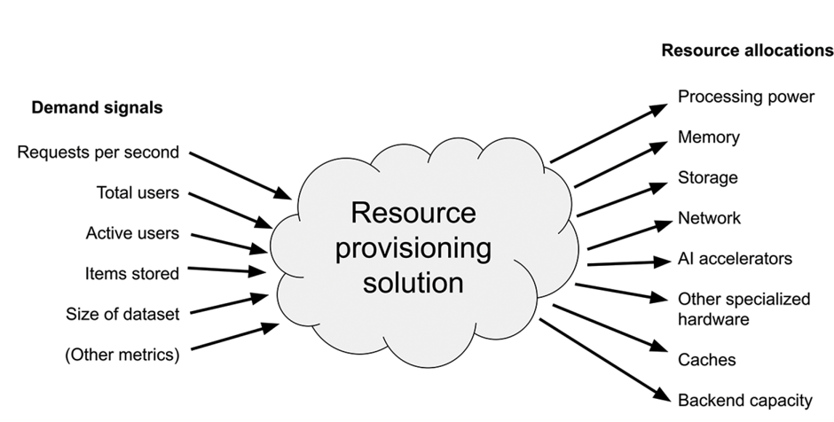
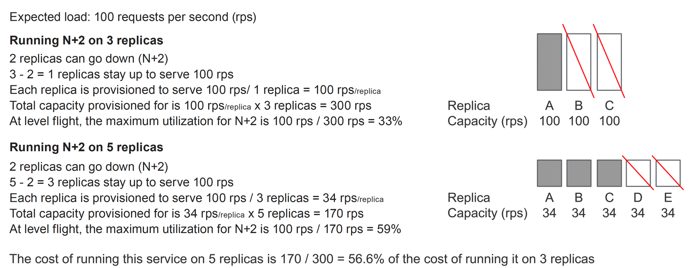

作为 SRE，您需要确定服务的初始资源需求，并确保服务在意外需求下仍能稳定运行。容量管理是指确保您的服务拥有足够的资源，从而实现可扩展性、高效性和可靠性。无论是用户端服务还是公司内部服务，都必须应对预期和意外的增长。我们将利用率定义为资源使用的百分比。确定初始资源利用率并预测未来需求并不容易。我们提供了一些估算利用率和识别盲点的方法，并讨论了构建冗余以避免故障的好处。利用这些信息，您可以设计架构，使每个组件的资源分配增加能够有效地线性提升整个服务的容量。

## 容量管理原则

在本文中，服务被定义为提供一组功能的所有二进制文件（服务栈）的集合。成功的容量管理需要从两个复杂的角度出发：资源制备，即现在运行服务所需的初始容量；以及容量规划，以保障未来服务的可靠性。

容量管理的核心原则包括以下三点，以保持服务的可扩展性、可用性和可管理性：

1. 服务必须高效利用资源。大型服务需要大量资源，部署和维护成本高。
2. 服务必须可靠运行。限制资源容量以提高效率可能导致服务故障和停机风险，因此需要在效率和可靠性之间找到平衡。
3. 必须预见服务的增长。增加服务资源可能需要较长时间，且存在实际部署限制。这可能涉及购买新设备或建设新数据中心，也可能需要增加其他依赖系统和基础设施的容量。

## 容量管理的复杂性

大型服务如同复杂的生命体，其行为有时难以预期。做出可能改变服务范围的工程决策时，需要考虑以下几个方面：

- 服务性能。了解不同组件在负载下的表现。
- 服务故障模式。考虑已知故障模式下服务的表现，以及面对未知故障模式时的可能行为。通过列出可能的瓶颈和服务依赖项，做好准备。
- 需求。首先要确定预期的用户数量和流量、用户分布的位置以及他们的使用模式。
- 自然增长。估计随着时间推移，需求可能会如何增长。
- 功能扩展。考虑新增功能或服务比预期更成功时，对长期资源需求的影响。
- 扩展能力。了解在增加资源分配时，服务的扩展情况。
- 市场分析。评估市场变化对获取额外资源能力的影响。研究新技术，这些技术可以提高服务的性能、可靠性或效率，以及实施这些技术的成本。调查如何快速采用新技术，例如用 SSD 替换 HDD。

容量管理的目标是控制不确定性。在未知环境中，服务必须现在可用，并在未来继续运行。这是一种充满挑战但值得追求的微妙平衡：在效率与可靠性、准确性与复杂性、努力与收益之间做出权衡。

使用数据来驱动容量决策。尽管你仍然会犯一些不可避免的错误，并需要创造性地解决问题，但最终的结果是一个可靠的关键业务服务。

资源制备解决的是战术问题：“如何保持服务马上能立即运行起来？” 而容量规划解决的是战略问题：“如何在可预见的未来保持服务运行？”

以下章节将详细讨论这些主题。

## 资源制备

我们将讨论集中在服务系统上，即通过查找数据来响应用户请求的服务。不过，这些原则同样适用于数据存储服务、数据转换服务以及其他大多数计算机任务。

资源制备涉及确定服务所需资源的目标利用率并分配这些资源。目标利用率被定义为在保证服务可靠运行的情况下，特定资源类别的最高可能利用率。资源类别指的是特定类型的计算资产，比如 CPU、RAM 和存储。

要为你的服务进行资源制备，需要使用需求信号作为输入，并创建包含具体资源分配的生产布局，如图 1 所示。服务通常使用多种资源类别。

**资源短缺的影响**

资源短缺会导致服务以不同方式失败，这取决于资源类别。

当资源成为服务关键路径中的瓶颈时，用户会遇到延迟增加的情况。在最糟糕的情况下，瓶颈会导致请求积压，延迟不断增加，最终导致排队请求超时。如果没有缓解计划，服务将无法处理请求，进而发生故障。故障将持续，直到传入流量减少使服务恢复，或者服务重新启动。

经常在关键路径中出现的资源包括：

- 处理能力
- 网络
- 存储吞吐量

当资源成为非关键路径中的瓶颈时，服务的一些非时间关键功能（如维护或异步处理）会出现延迟。如果这些任务被延迟过长，它们可能会影响服务性能、功能、数据完整性，甚至在极端情况下导致故障。

当服务用尽存储时，写入操作会失败。如果某些读取依赖于写入操作，例如服务或存储解决方案存储 Paxos 状态以进行一致性读取，或者存储解决方案跟踪所有访问的数据及其访问时间，这些读取操作也可能会失败。

当其他资源（如内存或网络套接字）不足时，服务可能会崩溃、重启或挂起。资源不足的服务可能会因为垃圾收集而陷入频繁操作，或者以其他方式表现异常。这些故障会降低服务的容量，并可能触发需要人工干预的级联故障。

有关缓解策略，请参见下文的“减少故障影响”部分。

**估算利用率**

由于服务和资源类别的不同，每个服务的资源使用率和目标利用率都不同。为了准确估算特定服务的目标利用率，需要考虑以下几个方面。

**峰值使用率**

峰值使用率是指在特定时间段内的最高使用率，取决于服务的性质和用户群体。例如，业务相关服务在工作日早晨可能达到使用高峰，而社交相关服务则在下午晚些时候、晚上、周末或社交活动期间达到峰值。突发事件也可能导致使用率骤降或飙升。全球服务的用户群分布在不同国家和时区，形成更复杂的日流量模式。

假设负载不恒定，资源利用率在峰值流量期间不应超过服务分配资源的100%。这样，服务在应对峰值时不会因过度制备而浪费资源。

**最大峰值利用率**

即使在峰值时，也不应让服务以100%的利用率运行。一些软件、语言或平台在CPU使用率接近100%时会出现性能问题或垃圾回收抖动。如果某个组件的内存利用率达到100%，服务可能会因内存不足（OOM）错误而崩溃。

调整监控以捕捉足够小时间帧（微秒或秒）内的精确资源利用率是件繁琐的事情。因此，很难确定低延迟应用程序的资源使用峰值。

**冗余**

发布问题、硬件故障、软件错误甚至计划维护都会导致服务组件失败或重启。这可能导致从单个组件崩溃到整个服务下线的各种故障。

冗余是一种系统设计原则，指在替换失败组件时激活的重复组件。冗余程度由N+x表示，其中N是活动组件的总数，x是备份组件的数量。例如，N+3表示系统可以有三个组件故障，因为有三个备份组件可以替换它们。这样，无论组件总数（N）是多少，服务都能正常运行。

冗余可以在区域内或跨区域应用。区域是位于不同物理地点的独立故障域，这样网络问题或自然灾害不会同时影响多个区域。

**可用区域内冗余**

实现可用区域内的冗余相对简单。在一个区域内，需要保护服务免受二进制文件或物理机器故障的影响。通常，可以通过在每个区域运行额外的服务二进制文件实例，并使用负载平衡解决方案在出现故障时重定向流量来实现。冗余程度与基础设施的服务质量协议 (SLA) 相关。SLA 考虑了可同时处于故障状态的机器总数以及在新机器上重新启动二进制文件实例的速度。

需要注意的是，可用区域内冗余无法保护服务免受导致整个区域瘫痪的故障（如电力、网络或自然灾害）的影响。

**跨区域冗余**

跨区域冗余更加复杂。为了防止整个区域的中断，需要在多个区域部署副本或完整的服务堆栈副本，以实现跨区域的冗余，从而应对高峰期的服务负载。注意，每个副本必须有足够的容量，以便在声明的冗余情况下，任何数量的副本停机时都能服务所有预期负载。无论副本的数量（N）是多少，服务的区域冗余程度定义如下：

- N+0：服务运行但无法容忍任何区域中断
- N+1：服务能承受单个区域中断
- N+2：服务在两个区域中断时仍能运行
- 等等

虽然部分冗余涉及容量，但也与服务架构本身有关。例如，一致性存储服务通常要求大多数副本处于运行状态，以确保写操作不会被回滚。
为 N+2 制备服务对可靠性有积极影响：可以计划整个区域的维护，但在维护期间会将冗余降至 N+1。服务仍然可以容忍另一个区域的意外事件。这将冗余降至 N+0，但不会导致中断。需要注意的是，切换到另一个区域可能会对可见的延迟产生影响。

当冗余为 N+0 并且无法容忍进一步的故障时，优先任务是尽快缓解或解决意外事件。一个选项是完成或回滚计划的维护工作，以将服务恢复到 N+1。否则，任何其他区域出现事件都可能导致面向用户的中断。

以上算法解释：

【需求】预期负载：每秒 100 次请求 (rps)

**在 3 个副本上运行 N+2**

- 允许 2 个副本宕机 (N+2)
- 3 - 2 = 1 个副本继续运行，处理 100 rps
- 每个副本被配置处理 100 rps / 1 个副本 = 100 rps/副本
- 总制备容量为 100 rps/副本 x 3 个副本 = 300 rps
- 在平稳状态下，N+2 的最大利用率为 100 rps / 300 rps = 33%

**在 5 个副本上运行 N+2**

- 允许 2 个副本宕机 (N+2)
- 5 - 2 = 3 个副本继续运行，处理 100 rps
- 每个副本被配置处理 100 rps / 3 个副本 = 34 rps/副本
- 总制备容量为 34 rps/副本 x 5 个副本 = 170 rps
- 在平稳状态下，N+2 的最大利用率为 100 rps / 170 rps = 59%

【方案对比】在 5 个副本上运行该服务的成本是运行在 3 个副本上的成本的 56.6%。这个比率是通过计算 170/300 得出的。

**冗余的成本**

服务在越多的区域运行，运行任何级别冗余的成本就越低。考虑图 2 中描述的服务。它需要运行在 N+2 冗余模式下。在第一个设置中，它运行三个副本（N=3），在第二个设置中，它运行五个副本（N=5）。两种配置都有两个备用副本（+2），因此可以承受两个副本的故障。
接下来，检查五个副本的设置。其副本较小，即使两个副本失败并且两个备用副本都在使用中，仍有三个活动副本共享负载。这导致五个副本的 N+2 设置成本是三个副本服务使用相同冗余级别成本的 56.6%。参见图 2 中提供的计算。

**同质和异质服务**

实现同质大小副本的服务冗余比实现异质大小副本的服务冗余更容易。您的服务必须准备好处理最大的区域故障。如果区域容量不同（即异质），在每个区域中，承受其他最大区域不可用的容量需求是不同的。结果是，较小的区域需要更多的资源，整体所需的资源来提供相同的负载更高。

**复制和分布式流量**

为冗余制备资源还取决于服务流量的特性。无状态服务（如处理用户请求的 Web 服务器）接收分布在副本之间的流量。从存储服务读取的请求也可以分布在不同区域的副本之间。为这些服务制备 N+1 或 N+2 冗余是简单的，遵循前面例子的逻辑。处理跨区域复制请求（如写入）的服务行为不同。每次写入实体的请求需要最终写入每个副本，以保持服务数据在副本之间的一致性。当副本变得不可用时，复制写入请求不会对保持可用的副本产生额外的负担。然而，当不可用的副本重新上线时，会产生成本。此副本需要赶上停机期间错过的未完成写入。这一操作增加了其负担。保持运行的副本提供了同步恢复副本所需的数据，在恢复期间增加了所有副本的负载。理想情况下，应限制这一操作以避免影响整个副本集的低延迟流量。每个服务和每个组件接收的复制和分布流量的比例不同，这需要在资源制备时考虑。

**对延迟不敏感的进程**

服务通常有对延迟不敏感的进程，如批处理作业、异步请求、维护和实验。然而，这些进程在处理生产负载（对延迟敏感）时给服务带来额外的压力。因此，服务需要额外的资源来容纳更高的峰值，增加了其成本。您可以通过分配较低优先级或在低负载期间调度来最小化对延迟不敏感请求的额外成本，以减少整体峰值。注意，这两种解决方案都需要经过适当测试并仔细部署以防止服务中断。

**未知的额外资源**

最后一个要考虑的方面是未知因素。制备服务时有许多正当理由添加额外资源：例如，由另一个团队支持的底层库的性能回归，或实施外部团队要求（如加密所有 RPC）。如果出现问题，备用容量可以保持服务在延迟和错误方面按预期运行。然而，请记住，这一决定可能很昂贵，因此请确保在可靠性、可预测性和扩展性之间的权衡是值得的。

## 容量规划

资源制备是指确定当前保持服务运行所需的资源量，而容量规划则是预测未来的资源需求以确保资源供应。

**容量规划概述**

与资源制备类似，容量规划旨在确定维持服务所需的每种计算资源的数量。然而，容量规划需要在多个时间点上做出预测，例如三个月、六个月或一年的资源需求。

对于现有服务，容量规划通过分析历史需求来预测增长，并在此基础上考虑服务的最大峰值利用率、冗余需求、对延迟不敏感的进程以及未知因素进行资源制备。通常，您还需要在预测中加入计划中的新资源消费者，如新服务、营销活动和新功能等。

您需要为服务中的每个组件分配不同数量的每种资源。例如，对于 RAM，Web 服务器可能需要大量 RAM，而代理服务器可能只需要很少的 RAM。为了在规划未来容量时确定每种资源的需求量，需要考虑以下因素：

- 您服务中的不同组件数量（如数据库、代理、应用）
- 每个组件的实例数量（如 1 个数据库，2 个代理，2 个应用）
- 您的服务运行的区域（如跨区域 N+1 或 N+2）
- 您的预测所需的数据点数量

虽然这是复杂公式的一个简单示例，但像 RAM 这样的资源类别可能需要按照以下公式进行计算：

>（不同组件的数量）×（每个组件的实例数量）×（区域数量）×（数据点数量）×（其他影响因素）

由此可见，当您考虑所有区域中所有服务器类型的所有资源类别并加入冗余时，所需确定的容量值数量将呈指数增长。

**预测资源**

容量规划是一个极其复杂的过程，因为有无数因素在起作用，而且每个因素都可以独立变化。基于上述高级概述，预测时请考虑以下因素：

- 按组件分类的资源类别 ：除了确定组件的总数外，还必须考虑每个组件使用的各种资源类别：例如 RAM、CPU、存储、网络等。一个组件可能使用一组资源类别，而其他组件可能使用完全不同的资源类别。如果您的服务包含许多组件，那么需要跟踪的资源类别会迅速增加。
- 多个区域 ：如果需要在全球多个区域运行，可以想象预测各种机器（如 Web 服务器、数据库服务器、应用服务器、代理服务器等）CPU 等单一资源类别的难度会更大。再加上所有机器的其他资源类别，以及跨所有区域的冗余，在给定的时间段内（如六个月或一年后）进行规划时难度更大。
- 服务需求：需求取决于新服务的成功和采用率，只有在服务推出后才能知道。需要随时间更新预测并修正长期预测。需要为突然的未计划负载增加做好准备，否则可能会导致服务中断。

其他意外事件如自然灾害、网络中断或停电会大幅改变流量模式。即使是计划中的事件，如社交活动或假期的开始或结束，也会以意想不到的方式影响服务。随着新功能的推出或用户基础的变化，这些事件每年的变化影响难以推测。

不同时区的用户分布变化也会对服务产生影响。流量可能会在一天内分布更多或更少，意外地增加或降低峰值需求。

**增长**

服务的增长取决于其成功与否。用户可能需要一些时间（以及营销活动）来了解您的服务并对其产生兴趣，而这种兴趣可能会随着时间慢慢增加或迅速飙升。其他互联网服务可能依赖于您的服务，它们的成功或失败可以直接影响您的服务。成功的外部服务可以为您带来更多流量，反之亦然。

社会、经济、政治或其他因素可能会增加或减少您的用户流量。您需要确定您的增长率，并在容量规划会议中考虑这些因素。

**预测示例**

为了说明服务所有者必须正确预测的各种资源类别值，我们使用一个简单的示例：

1. 两组件服务的资源类别：假设您有一个小型服务，如社交媒体应用。该服务由两台机器组成，一台 Web 服务器和一个数据库。Web 服务器使用 CPU 和 RAM，数据库使用 CPU、RAM、HDD 存储、HDD 吞吐量和 SSD 存储。这一共是六个独特的资源类别值。这远不是现实应用中的完整值集合。如果有三个副本，您需要定义 18 个值。如果按季度预测未来 12 个月，则需要定义 72 个值（每年四个季度 × 18）。
2. 影响您服务的趋势：您了解到，您的社交媒体服务受季节性趋势影响。在假期开始时（11 月至 12 月），流量会增加，春假和夏季开始时也会有流量高峰。预测时，不能只考虑资源的线性增长，还要考虑一年中高峰时段的流量峰值。每个月批处理任务（如数据清理或数据库压缩）期间，负载可能也会有所不同，甚至每周负载也会变化，这使得预测更加复杂。

## 最佳实践

我们提出了一些容量管理的最佳实践，帮助您预见和解决常见问题和陷阱。

**负载测试**

在目标利用率及以上运行服务的小副本，进行故障切换、缓存失效、发布等操作。评估服务如何应对和恢复过载，通过实验证实资源分配是否足以应对定义的负载。在从数据中推断估计值时要小心。如果一个分配有一个 CPU 的二进制实例每秒可以处理 100 个请求，那么通常可以假设两个分配有一个 CPU 的二进制实例总共每秒可以处理 200 个请求。但不能假设一个分配有两个 CPU 的二进制实例每秒可以处理 200 个请求，因为可能存在其他瓶颈。

**全面评估容量**

尽管需要为未知情况添加额外容量，但要避免堆积过多资源而无意中使服务过度制备。应提供足够的备用资源，使服务能够应对突发问题。这可以在服务比预期更成功且资源不足时，争取一些额外时间来获取资源。

**降低停机影响**

可以对服务进行准备，使其在资源耗尽时停机的影响降到最低。建议的预防措施包括：

- 优雅降级：当服务负载过大时，禁用一些非关键功能以减少资源使用。
- 拒绝服务 (DoS) 攻击保护：防止流量增加来自恶意方。
- 有效超时：请求最终超时，服务放弃这些请求而不再浪费资源。
- 负载分流：当服务负载过大时，快速拒绝请求，允许上层路由层重试请求或使其快速失败。这样可以避免服务落后并浪费资源在最终会超时的请求上。

**配额管理和限流**

部署配额系统有助于限制服务与后端之间的吞吐量，为使用同一后端的其他服务提供隔离。当服务发送的请求超过预期并达到配额限制时，后端会限制服务，而不是让自己过载并影响其他使用同一后端的服务。

**监控**

通过监控服务收集的相关指标为资源制备和容量规划决策提供数据。使用我们上面的示例服务作为模型，以下是非常有用的：

负载指标

- 每秒的传入请求数
- 对延迟不敏感的负载
- 活跃用户数
- 总用户数

资源指标

- 资源分配
- 实际资源使用情况
- 配额使用情况
- 被限制的请求数量

性能指标

- 延迟
- 错误

高阶健康指标（用于过滤其他受污染的指标数据）

- 服务受到停机影响的时间
- 服务正在进行维护的时间

**告警**

通过告警进行资源制备和容量规划，以防止停机。一些有用的告警示例包括：当服务未达到预期的冗余水平时触发的告警，表示资源不足的告警，以及性能问题的告警等。

**资源池化**

资源池化是将资源分组，使多个服务共享它们，而不是为每个服务单独分配。池化通常用于减少规划复杂性和资源碎片化，从而提高服务效率。实施该策略时，大型服务的规划仍需详细且精确，但小型服务可以共享一个大致和保守制备的资源池。这种方法减少了容量规划的工作量，但牺牲了服务的隔离性。

**一般 SRE 最佳实践**

遵循适用于所有服务的基本 SRE 原则。例如，将容量状态作为配置存储在版本控制系统中，并要求对任何更改进行同行评审。自动化执行、逐步推出所有更改、持续监控服务，并准备在需要时进行回滚。

在发生故障或其他问题时，进行无责后事件审查，诚实地从错误中吸取教训，并致力于改进系统，以避免重复这些错误。

## 评估服务容量

在评估新服务或现有服务的容量时，我们建议按照以下步骤来确定其资源需求：

| 硬件    | 规格                                   |
| ------- | -------------------------------------- |
| 处理器  | CPU 类型和核心数量                      |
| 图形处理单元 | GPU 类型和数量                     |
| 存储    | HDD（硬盘驱动器）和 SSD（固态硬盘）：    |
|         | • 存储容量（TB）                       |
|         | • 带宽                                 |
|         | • IOPS（每秒输入输出操作）              |
| 网络    | 数据中心内部、数据中心之间、ISP 访问：   |
|         | • 延迟                                 |
|         | • 带宽                                 |
| 后端    | 所需的服务和容量                        |
| 其他    | AI 加速器及其他特殊硬件                 |

1. 估算服务所需的资源，以应对预期负载。使用表 1 的模板，填写不同资源类别的预期服务需求。
2. 计算并考虑服务各组件的目标利用率。您可能需要进行负载测试来评估：
   - 峰值使用率
   - 最大峰值利用率
   - 冗余
   - 对延迟不敏感的过程
   - 未知情况下的备用资源
3. 考虑以下因素：
   - 优先级
   - 地区
   - 服务组件
   - 具体时间点及未来时间（如每月、每季度、六个月、一年等）
4. 进行预测，考虑是否需要按以下方面规划容量：
   - 优先级
   - 地区
   - 服务组件
   - 每年的时间点数量
5. 持续学习容量管理：
   - 观看视频《分布式服务的容量管理复杂性》，了解该主题的详细技术讲解 [1]。
   - 阅读 ;login: 文章《容量规划》 [2]。
   - 查看 Google 的《Site Reliability Engineering》中的《软件工程在 SRE 中的应用》、《管理关键状态》和《大规模可靠产品发布》章节 [3]。

## 结论

在本文中，我们探讨了容量管理的组成部分及其复杂性。我们将这个主题分为两个部分：资源制备和容量规划。资源制备解决了战术问题，即“如何保证服务现在能正常运行？”；而容量规划则关注战略问题，即“如何确保服务在未来也能持续运行？”回答这些问题并不简单，每个问题都需要仔细审查服务的不同方面。

在进行资源制备时，需要检查各种需求信号（输入）及其对资源分配（输出）的影响。了解服务可能面临的预期高峰需求以及需要构建的冗余量非常重要。你是否考虑过资源短缺和供应商供应的影响？

容量规划迫使你尝试预测服务及其负载在不断变化的未来会是什么样子。为了做到这一点，你必须充分了解你的服务。例如，你需要确定高峰周期及其发生时间，确定需要运行的地点数量及每个地点的不同能力，并预测可能影响服务的自然、社会甚至法律事件。当需要增加容量时，你是否有批准或资金来支持这一增长？

虽然我们提出的许多最佳实践都很重要，但遵循可靠的 SRE 原则有助于简化容量管理：进行适当的负载测试，实施广泛的监控和警报，使用源代码控制系统，了解服务的优点和缺点，制定容量计划，并准备在需要时预测增长和扩展。

**致谢**

作者感谢 JC van Winkel、Michal Kottman、Grant Bachman、Todd Underwood、Betsy Beyer 和 Salim Virji 的建议。

作者：

1. Luis Quesada Torres 是谷歌的一名站点可靠性工程师和经理，他负责确保谷歌云的人工智能 (AI) 产品可靠高效地运行。在业余时间，Luis 拥有多种爱好：他在多个音乐流派中作曲和制作音乐，他喜欢玩滑板，并且他会说西班牙语、英语、德语、瑞士德语和世界语。他很快还会学习日语。你可以通过 <luis@google.com> 联系他。
2. Doug Colish 是谷歌在纽约市的一名技术作家，支持站点可靠性工程 (SRE) 团队。他为谷歌的《构建安全可靠系统》一书的多个章节做出了贡献。Doug 拥有超过三十年的系统工程经验，专注于 UNIX 和安全。他的爱好包括对汽车进行细节处理和改装，参加音乐会，以及观看和讨论优秀电影。你可以通过 <dcolish@google.com> 联系他。

**参考文献**

- [1] L. Quesada Torres, “Complexities of Capacity Management for Distributed Services,” Google Tech Talk: <https://www.youtube.com/watch?v=pOo0oKNM9I8>.
- [2] D. Hixson and K. Guliani, “Capacity Planning,” ;login:,vol. 40, no. 1 (February 2015): <https://www.usenix.org/system/files/login/articles/login_feb15_07_hixson.pdf>.
- [3] B. Beyer, C. Jones, N. R. Murphy, and J. Petoff, eds., Site Reliability Engineering, Chapters 18, 23, and 27: <https://landing.google.com/sre/sre-book/toc/index.html>.

>原文地址: <https://static.googleusercontent.com/media/sre.google/en//static/pdf/login_winter20_10_torres.pdf>

❤️ Photo by FOX: <https://www.pexels.com/photo/clear-drinking-glass-with-brown-liquid-9097039/>
