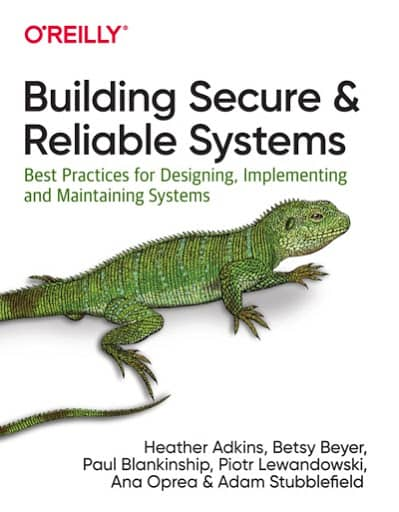

> 直播预告。在 10 月 19 日晚上，我会在社区里再次为大家梳理一下 SRE 的知识体系模型，还是用脑图的方式，向大家讲解 SRE 都有相关部分组成。

本次直播活动的录播视频。



下面这幅脑图是在我翻译完了《SRE Workbook》之后编写的，用了我好几天的时间，并且前后改了好几版。

编制这个脑图的出发点在于：SRE 从来源到 5 大基础模块，到推广实施的方法论都看似比较完整，比较成体系。这种脉络明晰的知识体系（knowledge body）本来就有画出脑图的可能性；而且脑图应该是一种比较便于吸收和学习的形式。

脑图的第一个版本是从 《SRE Workbook》的目录开始的，我尝试用最精简的方式，梳理每一章节中的知识点。可是在编制了前两章以后，就发现这个工作量其实非常的大。然后，我果断的放弃了“完美”的目标，然后将目标定位为：先完成一版。下图就是这样一个版本。后续我们讨论还有那些改进和与社区协作的想法。

后续的未尽事项：

* 细化现有版本，将《SRE Workbook》中的知识点尽量都涵盖尽量。
* 将 SRE 的第一本出版物《Google SRE 运维解密》也梳理进来，由于它已经被 Workbook 彻底包含，并且多次引用。
* 将 SRE 安全那本书也梳理进来，由于安全的特殊性，独立做一个节点梳理比较现实；如果能融入的更好，则更加。
* 需要找到一种方便人们协作的线上脑图协作软件，应该至少具备一下功能：
  * 多人协作
  * 评论知识点
  * 支持导入导出标准格式的脑图文件
  * 支持导入导出 pdf，png，jpg ，html 等方便人们引用的文档

欢迎范围和参考 Google 官方 SRE 独立站点。https://sre.google/

网站中的相关出版书籍如下。

## Site Reliability Engineering

* 中文版书名：[SRE：Google运维解密](https://book.douban.com/subject/26875239//)
* [英文版线上阅读](https://sre.google/sre-book/table-of-contents/)

## The Site Reliability Workbook

* 中文版书名：[Google SRE 工作手册](https://book.douban.com/subject/35224058/)
* [英文版线上阅读](https://sre.google/sre-book/table-of-contents/)

## Building Secure & Reliable Systems

* 中文书名：[《Google系统架构解密》](https://book.douban.com/subject/35585206/)
* [英文版 PDF 版 官方免费下载](https://sre.google/static/pdf/building_secure_and_reliable_systems.pdf)