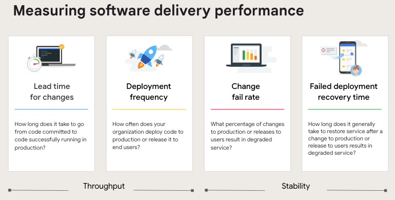
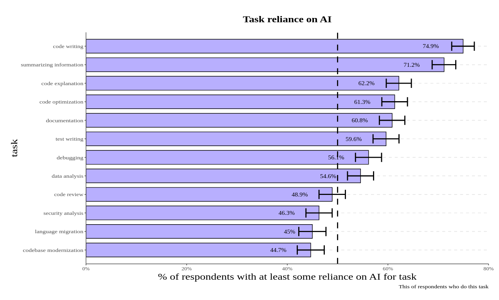
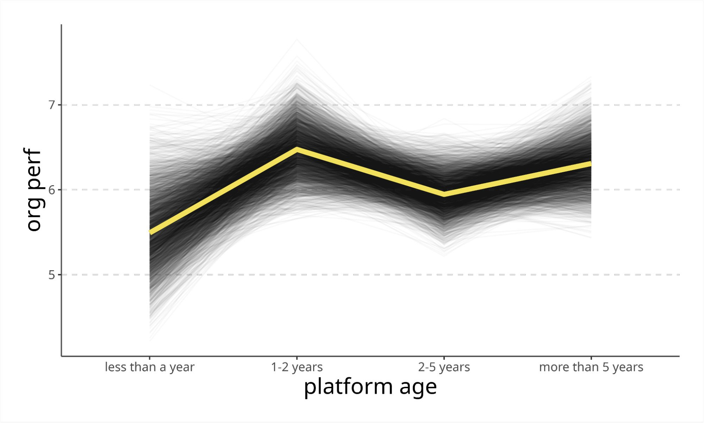

> 作者 Nathen Harvey （DORA Lead），Derek DeBellis （DORA 研究项目负责人）

**[下载中文版报告 PDF 文件](/blog/state-of-devops-2024-zh-cn/)**

DORA 研究项目已经对高绩效技术团队和组织的能力、实践和度量标准进行了长达十多年的研究。该项目基于每年对技术人员（包括软件开发人员、管理者和高管）的调查数据发布报告。

今天，我们正式发布《2024 年 加速：DevOps 现状报告》，标志着 DORA 已经在高绩效技术团队和组织的研究领域持续了十年。DORA 在 2013 年提出的四项关键指标已成为衡量软件交付绩效的行业标准。

每年，我们都深入研究 DORA 标准绩效指标，并探索它们如何与个人、工作流、团队和产品绩效相互作用。今年，我们还新增了 AI 采用在各个层面上对软件开发影响的分析。

我们每年设立基准，帮助团队了解他们相对于同行的表现，并激励他们认识到每个行业都可以实现卓越的表现。DORA 过去十年的研究旨在帮助团队不断提升自身的能力，力求每年改进都能取得更大进展。

如果想快速了解今年的报告内容，可以阅读我们的 DORA 报告摘要，聚焦于技术采用趋势、AI 的影响、平台工程的兴起，以及开发者体验的重要性。

各行业的组织都在优先考虑将 AI 集成到应用和服务中。开发人员越来越依赖 AI 提高工作效率，并更好地履行其核心职责。今年的研究揭示了 AI 采用带来的复杂利弊和权衡。

报告强调平台工程需要慎重实施，并指出开发者体验在实现高绩效中的关键作用。

### AI 的优势、挑战与信任建设

AI 的广泛应用正在改变软件开发方式。超过 75% 的受访者表示，他们在日常工作中至少有一个职责依赖于 AI。最常见的使用场景包括代码编写、信息总结和代码解释。

报告显示，AI 有效地提升了开发人员的生产力。超过三分之一的受访者表示，AI 为他们带来了“中等”到“极大”的生产力提升。

AI 采用率提升 25% 带来了几个关键领域的改进：

- 文档质量提升 7.5%
- 代码质量提升 3.4%
- 代码审查速度提升 3.1%

然而，尽管 AI 有其优势，我们的研究也发现了一个重要问题：AI 采用可能对软件交付绩效产生负面影响。随着 AI 应用的增加，软件交付吞吐量估计下降了 1.5%，交付稳定性下降了 7.2%。我们的数据显示，仅改进开发流程并不足以自动提升交付绩效，尤其是在没有遵循如小批量处理和完善测试机制等基本原则的情况下。虽然 AI 对个人和组织的多个方面有积极影响，为高软件交付绩效创造了条件，但它并非万能的解决方案。

此外，尽管生产力有所提升，39% 的受访者对 AI 生成的代码仍缺乏信任。这一低信任度表明，AI 的集成需要更加谨慎的管理。团队必须仔细评估 AI 在开发流程中的作用，以减轻潜在的负面影响。

基于以上发现，我们提出三项核心建议：

1. 通过调整 AI 采用策略，使其更好地赋能员工，减少繁琐任务，从而提升员工的工作效率。
2. 制定明确的 AI 使用规范，解决相关程序问题，并鼓励就其影响进行公开讨论。
3. 鼓励团队持续探索 AI 工具，并提供实验时间，以通过实际操作建立信任感。

### 平台工程：新的转变

我们今年研究的另一个新兴领域是平台工程，专注于搭建和运营内部开发平台，以优化流程并提升效率。

我们的研究总结了平台工程的 4 个关键发现：

- 提升开发人员效率：内部开发平台能够有效提升开发人员的生产力。
- 更常见于大型企业：这些平台通常在大型组织中使用，表明它们更适合应对复杂的开发环境。
- 可能出现的性能下滑：在平台工程计划实施初期，性能可能会有所下降，直至平台逐渐成熟后才能显现出改进效果。
- 强调用户导向和开发人员自主性：为了达到最佳效果，平台工程应优先考虑用户导向的设计、开发人员的独立性，以及产品导向的方法。

一个重视用户需求、赋能开发人员、并能预见潜在挑战的周全策略，是最大化平台工程计划收益的关键。

### 开发者体验：成功的关键

去年报告中指出，健康的工作文化有助于减少倦怠、提升生产力和提高工作满意度。今年的研究结果依然如此。那些营造稳定、支持性环境并激励开发者发挥潜力的团队，往往能够取得显著的积极成果。

“快速行动、频繁调整”的心态会对开发者的身心健康产生负面影响，进而影响整体绩效。即便拥有强有力的领导、完善的文档以及用户导向的开发方式，若优先级不稳定，仍然可能显著阻碍团队的进展。

创造一个支持、重视团队，并让开发者有机会展现自身价值的工作环境，是实现卓越绩效的基础。

### 如何利用这些发现来帮助你的 DevOps 团队

十年的研究表明，软件开发的成功不仅依赖于技术实力，更取决于建立支持性的文化、重视用户需求和提升开发者体验。我们鼓励各团队在实际环境中验证和应用我们的研究成果。

这些发现可以成为你团队实验和持续改进项目的依据。我们也欢迎你将这些实践分享给我们和 DORA 社区，让你的经验成为我们共同学习和进步的一部分。

我们开展这项研究是为了为那些希望改进实践、推动创新和合作，并实现业务成功的团队和组织提供一条清晰的路径。未来十年，我们将继续开展平台无关的研究，专注于技术中的人性化因素。

了解更多：

- [下载完整报告](/blog/state-of-devops-2024-zh-cn/)
- 分享你的经验，[加入 DORA 社区](https://dora.community/)，学习他人的做法并获取灵感
- 使用 [DORA 快速检查](https://dora.dev/quickcheck/)，在不到一分钟内评估你的团队的软件交付绩效
