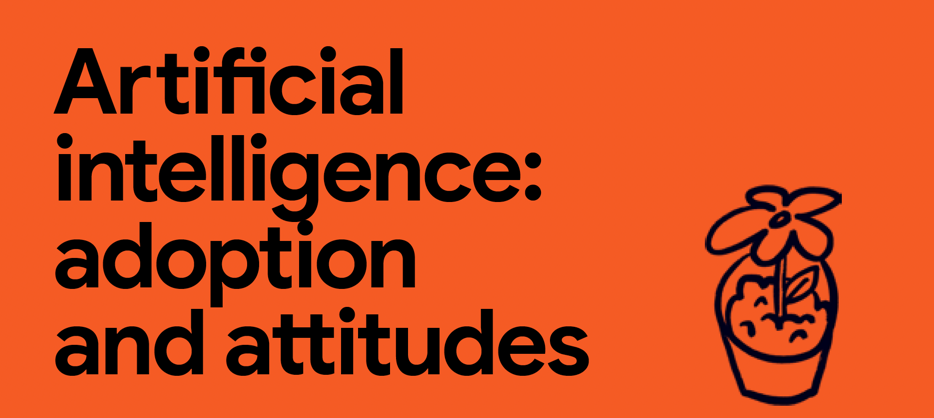
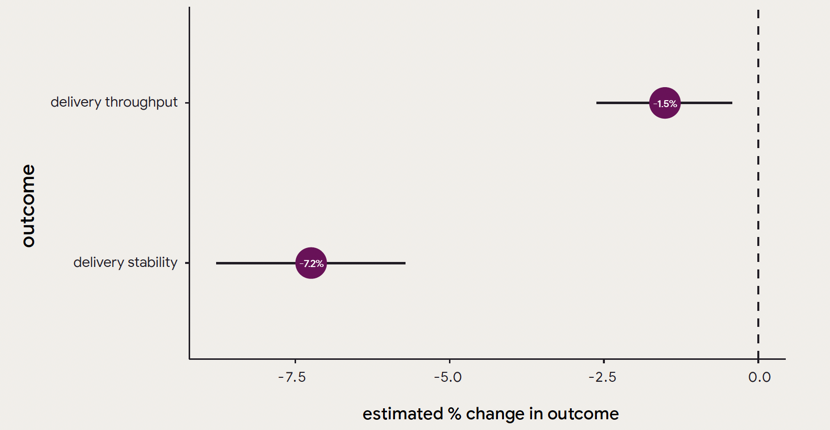

[【中文试读版 PDF 文件】- 即将完成](2024-dora-accelerate-state-of-devops-report-zh-cn-martinliu.pdf) | [【英文版全文 PDF 文件】](2024_final_dora_report.pdf)

> 官方中文版本尚未发布，请关注：https://dora.dev/research/2024/ 以获取最新信息。2023 年和之前 Google 官方发布的多语言版本报告，也可以在这里找到。

## 内容提要

DORA 过去十多年来一直在研究高绩效技术团队和组织的能力、实践和评估标准。这是我们的第十份 DORA 报告。全球各行各业、不同规模的公司中，超过 39,000 名专业人士参与了我们的调研。感谢大家与我们同行，并成为研究的一部分！

DORA 通过每年一次的全球调查收集技术及相关岗位的专业人士的数据。调查问题涉及工作方式和整个组织及员工的成就。

DORA 采用严格的统计分析方法，研究这些因素之间的关系，以及它们如何分别推动团队和组织的成功。

今年，我们还加入了对专业人士的深入访谈，以获取更深层次的见解、验证数据，并为研究结果提供更多背景信息。详情请参阅方法论章节。

我们在今天调查中的主要成果和发现包括：

* **减少倦怠**：倦怠是一种由于长期或过度压力导致的情绪、身体和心理上的疲惫状态，通常表现为冷漠、疏离感以及缺乏成就感。
* **流动性**：衡量个人在进行开发任务时的专注水平。
* **工作满意度**：衡量个人对工作的整体满意程度。
* **组织绩效**：衡量组织在盈利、市场份额、客户数量、运营效率、客户满意度、产品和服务质量，以及达成目标能力等方面的表现。
* **产品性能**：评估产品的易用性、功能性、价值、性能（如延迟）、安全性等多个方面。
* **生产力**：衡量个人在工作中感受到的效率和效果，包括创造价值和完成任务的程度。
* **团队绩效**：评估团队在合作、创新、效率、互相支持和适应变化方面的表现。

### 关键发现

**AI 正在产生广泛影响**

AI 正在软件开发领域带来重大变化。早期的应用已经展现出一些积极的成果，但也伴随着谨慎的态度。

AI 采用的优势：

* 流动性
* 生产力
* 工作满意度
* 代码质量
* 内部文档编写
* 代码审查流程
* 团队绩效
* 组织绩效

*【译者注：以上是 DORA 核心能力模型中的各种能力。】*

然而，AI 的引入也带来了一些负面影响。我们发现软件交付的绩效有所下降，且其对产品性能的具体影响尚不明确。此外，随着 AI 应用的增加，员工报告他们花在高价值工作上的时间有所减少。这是一个有趣的现象，本报告后续将深入探讨。

团队应继续探索 AI 依赖性增加对工作的影响，并在实践中不断学习。

* **随着对 AI 信任度的提升，AI 采用率也在上升** ：生成式 AI (gen AI) 的使用让开发人员感到工作效率更高，而那些信任 gen AI 的开发人员则更频繁地使用它。不过，这方面仍有改进空间：有 39.2% 的受访者表示他们对 AI 的信任度较低甚至完全没有信任。
* **用户导向提升绩效** ：重视用户体验的组织通常能够开发出更高质量的产品，使开发人员的工作效率更高，满意度更高，并且更不容易产生倦怠感。
* **变革型领导力的重要性** ：变革型领导力不仅能提升员工的生产力、工作满意度、团队合作效果、产品表现和组织绩效，还能有效减少员工的倦怠现象。
* **稳定的优先级提升生产力和员工幸福感** ：组织优先级不稳定会显著影响生产力，并导致员工倦怠的显著增加，即使组织内部具备强有力的领导、完善的内部文档以及用户导向的开发方法，仍然难以避免。
* **平台工程有助于提升生产力** ：平台工程在提升生产力和组织绩效方面有显著的积极作用，但在软件交付绩效上仍需注意潜在的警示信号。
* **云计算带来基础设施的灵活性** ：云计算提供了更灵活的基础设施，这有助于提升组织的整体绩效。但如果在迁移到云端时未能充分利用云计算的灵活性，可能会比继续使用数据中心带来更大的问题。因此，成功的迁移需要对方法、流程和技术进行全面转型。
* **高水平的软件交付绩效是可以实现的**: 表现最好的团队在四个软件交付指标（变更前置时间、部署频率、变更失败率以及失败部署恢复时间）上都表现优异，而表现较差的团队在这四个指标上都表现不佳。我们在各个绩效群体中都发现了来自不同行业的团队。

### 应用 DORA 的见解

利用 DORA 改进团队和组织，需要评估当前的状况，找出需要投入和改进的领域，并建立反馈机制来监测进展。持续改进的团队往往能够获得最大的收益。建议组织投入资源，培养出能够长期重复改进的能力。

我们的研究结果可以为你的实验和假设提供参考。进行测试并评估变更效果，找到最适合团队和组织的改进方式。这样做有助于验证我们的发现。请注意，你的结果可能会有所不同，欢迎分享你的进展，以便大家共同学习。

**我们建议以实验为基础的改进方法：**

1. 确定你想改进的领域或目标。
2. 评估当前的基准状态。
3. 制定假设，找出可能帮助你达成目标的方法。
4. 制定并执行改进计划。
5. 开始行动。
6. 评估取得的进展。
7. 重复这一过程。

改进需要通过迭代和逐步推进来实现。

## 软件交付绩效

技术驱动型团队需要有效的绩效评估方法，以了解当前状态、优先改进事项，并验证改进成果。DORA 提出的四大关键指标，已被验证为衡量软件交付过程成效的有效工具。

### 四大关键指标

DORA 的四大关键指标用于评估软件变更的效率和稳定性，适用于所有类型的变更，包括配置和代码的变更。

* 变更前置时间：从代码提交或变更开始到成功部署到生产环境的时间。
* 部署频率：应用变更被部署到生产环境的频率。
* 变更失败率：生产环境中导致失败的部署百分比，通常需要紧急修复或回滚。
* 失败部署恢复时间：从失败的部署中恢复到正常状态所需的时间。

我们观察到，这些指标通常同步提升或下降。表现最佳的团队在所有四项指标上均表现优异，而表现较差的团队在这四项指标上则表现不佳。

### 软件交付绩效的演变

在分析四大关键指标时，变更失败率一直是个例外。尽管它与其他三个指标高度相关，但统计测试方法限制了将四个指标合并为一个因素。我们对受访者的回答方式进行调整后，增强了关联性，但我们认为可能还有其他因素在发挥作用。

我们一直认为，变更失败率可以作为团队返工量的一个指标。当交付失败时，团队通常需要通过引入新的变更来修复问题。

为了验证这一假设，今年我们新增了一个问题，询问应用程序的返工率：“在过去的六个月内，您负责的主要应用或服务中，有多少次部署是为了解决用户可见的错误而非计划中的操作？”

数据分析证实了我们的假设：返工率和变更失败率密切相关。这两个指标共同构成了软件交付稳定性的可靠度量。

在软件性能水平分析中，我们也发现了这一点。今年有超过一半的团队在软件吞吐量和稳定性方面表现出明显差异。基于这些差异，我们将软件交付绩效分为两个因素：

* 概念
  * 软件交付绩效

* 因素
  * 软件交付吞吐量
  * 软件交付稳定性

* 使用的指标
  * 变更前置时间
  * 部署频率
  * 失败部署恢复时间
  * 变更失败率
  * 返工率

本报告的分析中，我们使用了软件交付绩效及其两个因素的概念。所有五项指标均用于描述软件交付绩效。

在描述软件交付吞吐量时，我们使用变更前置时间、部署频率和失败部署恢复时间，这个因素衡量变更速度，包括正常变更和故障修复的速度。

在描述软件交付稳定性时，我们使用变更失败率和返工率，衡量部署是否会无意间导致更多的返工需求。

### 绩效水平

每年，我们都会询问受访者关于其主要应用或服务的软件交付绩效情况。我们通过集群分析方法，识别出回答中的相似群体，找出不同的绩效水平。

我们使用原始的四项软件交付指标进行集群分析，以保持与往年一致性。

在今年的分析中，我们发现了四个不同的绩效集群。我们并不预先设定这些水平，而是让它们从调查数据中自然浮现。这使我们能够获得所有受访者的软件交付绩效的整体情况。

今年的数据中呈现出四个独特的集群，具体如下所示。

| 绩效水平 | 变更前置时间      | 部署频率                      | 变更失败率 | 失败部署恢复时间 | 受访者比例*        |
|----------|-------------------|-------------------------------|------------|------------------|--------------------|
| 精英     | 小于 1 天         | 按需（每天多次部署）           | 5%         | 小于 1 小时      | 19%（18-20%）      |
| 高       | 1 到 7 天         | 每天至每周一次                 | 20%        | 小于 1 天        | 22%（21-23%）      |
| 中       | 1 到 4 周         | 每周至每月一次                 | 10%        | 小于 1 天        | 35%（33-36%）      |
| 低       | 1 到 6 个月       | 每月至每半年一次               | 40%        | 1 到 4 周        | 25%（23-26%）      |

**89% 置信区间*

#### 追求吞吐量还是稳定性？

在所有四个集群中，吞吐量和稳定性之间都存在关联。即便是在中等绩效集群（橙色）中，吞吐量较低但稳定性高于高绩效集群（黄色），这种关联依然存在。这表明，除了吞吐量和稳定性之外，还有其他因素影响集群的整体表现。例如，中等绩效集群可能会受益于更频繁的变更发布。

更频繁的部署和更少的失败，哪个更优？

这个问题并没有通用的答案，取决于具体的应用或服务、团队的目标以及用户的期望。我们将速度更快的团队称为“高绩效团队”，而将速度较慢但更稳定的团队称为“中等绩效团队”。这一命名方式突显了一个潜在的问题：团队应该更关注持续改进，而非仅仅追求某一特定的绩效水平。最佳团队是那些实现精英改进的团队，而不一定是达到精英绩效的团队。

**与低绩效团队相比，精英团队实现了显著成果。**

#### 如何使用绩效集群

绩效集群提供了本年度调查受访者的软件交付绩效的基准数据。其目的是激励所有团队实现精英水平的绩效。相比追求特定绩效水平，我们认为团队应更加专注于整体的持续改进。实现精英改进的团队才是最佳团队，而不一定是达到精英绩效的团队。

#### 行业对绩效的影响不显著

我们的研究很少发现行业能够预测软件交付绩效；各个行业中均存在高绩效团队。这并不意味着没有行业特有的挑战，但在软件交付绩效方面，没有任何行业具有独特的优势或劣势。

### 使用软件交付绩效指标

每个应用或服务的环境都是独特的，因此很难预测任何一个变更对系统整体绩效的影响。此外，在组织中几乎不可能一次只改变一个方面。那么，我们如何有效地利用软件交付绩效指标来指导改进？

首先，明确您希望衡量和改进的主要应用或服务。我们建议召集负责该应用的跨职能团队，评估并达成共识，确定当前的交付绩效。DORA 快速检查 (<https://dora.dev/quickcheck>) 可帮助引导讨论，设定基准。团队需要明确是什么在阻碍更好的绩效。

找到这些障碍的一个有效方法是和团队一起完成价值流映射。接下来，确定并同意一个改进计划。此计划可聚焦于 DORA 研究的能力之一，或针对您应用或组织的特殊需求。

制定好计划后，是时候付诸行动了！为改进工作分配资源，并关注在过程中学到的经验。

在变更实施并产生效果后，重新评估四大关键指标。变更后这些指标有何变化？学到了哪些经验？

不断重复这一过程，将帮助团队建立起持续改进的习惯。

请记住：改进需要时间。采用迭代方法，营造学习、快速流动和即时反馈的环境至关重要。

## 人工智能：应用与看法

**要点**

各行业的绝大多数组织正在调整优先级，以更深层次地将 AI 集成到其应用和服务中。大多数开发人员也依赖 AI 辅助完成核心任务，并报告生产力因此得以提升。开发人员普遍认为，使用 AI 是在当今市场中保持竞争力的关键，这一观念推动了 AI 在组织和个人层面的广泛应用。

**简介**

随着今年大量报道呈现出 AI 对开发工作产生的深远影响，无论是积极的、消极的，还是引发担忧的，AI 的影响已经无法忽视。因此，尽管在 2023 年《加速: DevOps 现状报告》中，AI 只是众多影响绩效的技术能力之一，但今年我们对这一话题进行了更深入的探讨。

随着 AI 在专业开发工作中迅速从边缘应用走向普及，我们认为 2024 年《加速: DevOps 现状报告》为评估开发人员对 AI 的采纳、使用和态度提供了一个重要的时机，正值行业的关键转折点。

### 主要发现

***人工智能的采用***

研究表明，AI 已不再是“未来趋势”，而是已经完全进入了我们的日常工作并很可能长期存在。

***组织层面的 AI 采用情况***

绝大多数受访者（81%）表示，他们的组织已将更多资源投入到 AI 的应用和服务中。49.2% 的受访者甚至认为这一转变的程度是“中等”或“显著”的。

3% 的受访者则表示其组织对 AI 的关注有所减少（在本次调查的误差范围内）。78% 的受访者表示，他们信任组织在调整优先级后会透明地告知 AI 的使用计划。图 2 展示了这些数据。

**组织优先级关于 AI 的变化**

*误差条表示 89% 置信区间*  

来自各行业的受访者报告了在日常工作中对 AI 依赖的相似程度，这表明 AI 的快速应用在各行业中同步展开。这一点令人意外，因为各行业的监管要求和创新步伐通常不同，而这些差异通常会影响技术的应用速度。

不过，我们发现大型组织的受访者在日常工作中对 AI 的依赖性相对较低，这与先前研究一致，即大型公司由于组织复杂性和协调成本的原因，适应技术变革较慢。

***个人层面的 AI 采用情况***

在个人层面，75.9% 的受访者在其日常职责中至少部分依赖 AI。对于以下任务，多数受访者依赖 AI 来完成：

1. 编写代码
2. 总结信息
3. 解释陌生代码
4. 优化代码
5. 编写文档
6. 编写测试
7. 调试代码
8. 数据分析

在所有被调查的任务中，最常见的 AI 用例是代码编写和信息总结，分别有 74.9% 和 71.2% 的受访者在这些任务中依赖 AI（至少部分依赖）。图 3 展示了这些数据。

**任务对 AI 的依赖性**

*误差条表示 89% 置信区间*

在日常工作中，受访者最常通过聊天机器人使用 AI（78.2%），其次是外部 Web 界面（73.9%）和集成在 IDE 中的 AI 工具（72.9%）。相比之下，内部 Web 界面（58.1%）和作为自动化 CI/CD 流水线的一部分使用 AI 的比例较低（50.2%）。

我们注意到，受访者对其 CI/CD 流水线和内部平台中的 AI 使用情况的了解，可能受限于与这些技术的接触频率。因此，这些数据可能存在低估。

数据显示，数据科学家和机器学习专家比其他职位的受访者更依赖 AI。而硬件工程师则较少依赖 AI，这或许是因为硬件工程师的职责不同于 AI 常用于辅助的开发任务。

***人工智能采用的驱动因素***

访谈中，参与者普遍认为，采用 AI 的决策受竞争压力的驱动，以及跟随行业标准的需求推动。如今，行业标准越来越认可开发人员和组织应具备 AI 技能。

对于一些受访者所在的公司来说，使用 AI 本身就是一个“重要的营销亮点”（P3），有助于与竞争对手区分开来。竞争对手开始引入 AI 的消息甚至促使某家公司突破了“庞杂的官僚流程”，急于采用 AI，并提出“如果竞争对手先于我们行动会怎样？”（P11）。

在个人层面，许多参与者表示，熟练使用 AI 现已成为“工程师的新入门标准”（P9）。部分参与者还建议开发人员快速将 AI 纳入开发流程，因为“这个领域变化太快了，几乎跟不上……如果不使用 AI，很快会被淘汰”（P4）。

### 人工智能的应用感受

**人工智能带来的绩效提升**

在广泛采用 AI 的组织和开发人员中，AI 在开发工作中的效益显著。75% 的受访者表示，在 2024 年初的调查前的三个月内，他们因 AI 获得了生产力提升。

值得注意的是，超过三分之一的受访者表示其生产力提升“中等”（25%）或“极大”（10%）。少于 10% 的受访者报告了因 AI 带来的轻微负面影响。图 4 展示了这些数据。

**AI 对生产力的影响**

*误差条表示 89% 置信区间*

在不同职位中，因 AI 获得最大生产力提升的受访者主要是安全专业人员、系统管理员和全栈开发人员。相比之下，移动开发人员、站点可靠性工程师和项目经理的提升幅度较小。

尽管我们曾怀疑 AI 的新颖性和学习曲线会阻碍开发人员编写代码的能力，但数据并未支持这一假设。仅有 5% 的受访者表示 AI 影响了他们的编程能力。实际上，67% 的受访者表示 AI 辅助工具在一定程度上提升了他们的编程能力，约 10% 的受访者观察到编程能力的“极大”提升。

**对 AI 生成代码的信任**

参与者对 AI 生成代码的信任度看法不一。尽管 87.9% 的受访者表示在一定程度上信任 AI 生成代码的质量，但总体信任度不高，39.2% 的受访者表示信任较少（27.3%）或完全不信任（11.9%）。这些数据在图 5 中展示。

**AI 生成代码的质量信任度**

*误差条表示 89% 置信区间*

尽管调查显示开发人员迅速采用 AI 并依赖它来提升绩效，但信任度普遍不足令人意外。许多访谈参与者表示，愿意或预期会对 AI 生成的代码进行调整。

有位参与者将审查 AI 代码输出比作“早期的 StackOverflow，那时你认为上面的人都很有经验，知道如何解决问题。但你复制粘贴代码时，却发现它会出问题”（P2）。

或许因为类似问题已不新鲜，像 P3 的参与者认为，公司并不担心有人会直接复制 Copilot 或 ChatGPT 代码，“因为有多层代码质量检查”。

我们假设开发人员并不需要对 AI 生成代码的准确性有绝对信任，也无需绝对信任才能使其发挥作用。相对准确并可通过调整完善的 AI 代码足以让开发者觉得有价值，并且能与现有的质量保证流程相兼容，激励广泛采用。

### 对 AI 未来的展望

我们的研究表明，AI 已对开发人员的工作产生了重大影响，预计这一趋势将继续增长。虽然很难预测 AI 对未来开发工作乃至世界的具体影响，但我们邀请受访者分享了他们对 AI 在未来 1 年、5 年和 10 年内影响的看法。

受访者普遍认为，AI 近期对开发工作带来了积极的影响，但对 AI 未来的影响持较为谨慎的态度。

从乐观角度看，受访者期待未来 1 年、5 年和 10 年内，AI 能持续改善产品质量，这是基于 AI 对开发绩效已有的积极作用。

然而，受访者也预计 AI 会对职业生涯、环境及社会整体产生负面影响，并认为这些负面影响将在约 5 年内显现。图 6 展示了这些数据。

**AI 的预期负面影响**

*误差条表示 89% 置信区间*

访谈参与者对 AI 未来的看法也较为复杂。一些人担心未来的法律监管，害怕“如果监管落地，可能会站在错误的一方”（P3）。

另一些人则表达了长期存在的焦虑，质疑“AI 会不会取代人类？谁知道呢？也许吧。”（P2）。而另一些人则以过去为例来平息这种担忧，回忆当年“人们说‘Y2K 会让一切崩溃！’……但什么也没有发生。相反，还创造了更多的工作。我相信 AI 也会有类似的结果”（P1）。

AI 对世界的未来影响仍然未知。不过，今年的调查清晰地显示，AI 已在软件开发领域带来了无法忽视的深刻变革。截至目前，这些变革受到开发人员的广泛欢迎。

## AI 的深层次影响

**要点**

本章探讨了 AI 采用对从个人开发者到整个组织的广泛影响。研究结果显示了一个复杂的现状：AI 带来了显著的好处，但也产生了一些意想不到的负面影响。AI 虽然提升了个人的生产力、流动性和工作满意度，但可能也减少了用于有价值工作的时间。

AI 还改善了代码质量、文档和审查流程，然而，这些进步并未转化为更高的软件交付绩效。实际上，AI 的应用在这一领域反而显示出负面影响，对产品性能的作用也几乎可以忽略不计。

尽管存在这些挑战，AI 仍与团队和组织绩效的提升有关。本章呼吁对 AI 在软件开发中的作用进行理性评估，并主动调整其应用，以实现最大化的收益并减少潜在的负面影响。

### AI 时代与 DORA

估计表明，领先的科技巨头将在未来五年内投入约 1 万亿美元用于 AI 开发。这与“人工智能：采用与态度”一章的统计数据一致：81% 的受访者表示其公司已将资源转向 AI 开发。

AI 带来的环境影响进一步推高了成本。部分估计显示，到 2030 年，AI 将导致数据中心的电力需求增长 160%。 训练一个 AI 模型的耗电量相当于“1000 多个美国家庭一年的用电量”。3 因此，超过 30% 的受访者认为 AI 将对环境带来不利影响。

除开发和环境成本外，AI 的采用成本也不容忽视。

这种成本包括生产力的潜在下降和专家招聘需求，甚至在社会层面上也会产生影响。超过三分之一的受访者认为 AI 在未来十年可能对社会造成损害。面对这些成本，人们对其回报的强烈好奇心显得顺理成章。

这种好奇心已经反映在大量媒体报道和研究中，人们对 AI 的观点也各有不同。一些人认为 AI 极大地提升了人类能力，另一些人则认为 AI 只是一个辅助工具，也有人担忧 AI 将成为人类的威胁。

就近端成果而言，如完成具体任务的能力，AI 的正面效果相对明显。然而，当关注点转向更远端的结果，如团队代码库时，结果变得模糊。例如，有研究表明代码变更量可能是 2021 年前基线的两倍。

理解这些下游影响的挑战不言而喻。影响距离因果关系越远，效果越难以明确归因。

评估 AI 的下游影响类似于量化石头投入湖中的涟漪。最容易观察到的是近处的波纹，而越远离入口点，波动的影响越小，也越难将波浪归因于石头。

AI 就像投进充满复杂流程和动态变化的海洋中的一块石头。理解 AI（或任何技术和实践）所引发的广泛影响非常具有挑战性。这也许正是行业难以建立一套系统的测量和分析框架来全面理解 AI 影响的原因之一。

我们的方法专为应对此类挑战而设计。DORA 旨在评估实践的正面或负面效应。在过去十年中，我们探索了多种实践的下游影响，包括安全实践、变革型领导力、生成性文化、文档管理、持续集成、持续交付以及以用户为中心的策略。

我们相信，DORA 的方法可以帮助我们深入了解 AI 的影响，尤其是在多个层面探索 AI 的综合作用时。

### 衡量 AI 的使用情况

评估 AI 使用影响的首要挑战在于如何准确测量 AI 的应用情况。我们发现，与其关注使用频率，不如关注依赖程度更能反映 AI 在开发工作流中的核心作用。你可能每隔几周才进行代码审查或文档编写，但仍将这些任务视为关键。

相反，频繁使用 AI 并不一定意味着你在核心工作中依赖 AI。

基于此，我们询问了受访者对 AI 的总体依赖情况以及特定任务中的依赖程度。上一章已详细介绍了调查结果及其分析。

通过因子分析，我们发现“总体” AI 依赖与以下任务的依赖高度相关：

* 代码编写
* 信息总结
* 代码解释
* 代码优化
* 文档编写
* 测试编写

这些任务间的高度关联和一致性表明了一个我们称之为“AI 采用”的潜在因素。

### AI 对个人的影响：显著益处与潜在利弊

与往年一样，我们评估了多个与个人成功和幸福感相关的指标：

| 指标               | 描述                                                                                             |
|--------------------|--------------------------------------------------------------------------------------------------|
| 工作满意度         | 衡量个人对工作整体满意度的指标。                                                                   |
| 倦怠               | 反映倦怠在身体、情绪和心理方面影响的综合指标，涵盖对个人生活的各方面影响。                          |
| 流动性             | 衡量个人在开发任务中专注程度的指标。                                                               |
| 生产力             | 评估个人在工作中高效完成任务与创造价值能力的综合得分。                                             |
| 处理琐事的时间     | 衡量个人在重复性、手动且价值有限的任务上所花费时间比例的指标。                                     |
| 从事有意义工作的时间 | 衡量个人在自认为有价值的任务上所花费时间比例的指标。                                              |

我们希望了解 AI 采用是否会影响受访者的回答方式。结果表明确实如此。

图 7 展示了我们对 AI 采用对个人成功与福祉影响的最佳估计。

**如果个人的 AI 采用增加 25%……**

*点 = 估计值*  
*误差条 = 89% 置信区间*

**明显的好处**

AI 对个人的好处总体上是显著的，但也存在一些小问题。*显然，AI 对流动性、生产力和工作满意度有明显的积极作用（见图 7）。*

例如，个人的 AI 采用增加 25% 时，生产力大约增加 2.1%（见图 7）。虽然这看似微小，但在个人层面仍有意义。试想这种提升推广至几十人甚至数万人，将带来显著的效果。

我们认为这种效果部分得益于 AI 整合不同信息源并提供个性化反馈的能力。自主完成这些工作耗时较多，并涉及频繁切换上下文，难以维持流动性。

生产力和流动性与工作满意度密切相关，因此 AI 采用提高工作满意度也不足为奇。

**潜在的利弊**

这里情况变得复杂起来。AI 的一个核心价值主张是帮助人们将更多时间花在有价值的工作上，即通过自动化琐碎任务，使人们能够专注于“更有意义的事情”。然而，数据显示，增加 AI 采用可能会带来相反的效果——用于有价值工作的时间减少了，而琐碎任务的时间似乎未受影响。

福祉指标（如流动性、工作满意度和生产力）通常与有价值工作的时间相关。因此，虽然这些指标上升，但有价值的工作时间却减少，着实令人意外。

要合理解释这些模式，需要应对这种表面上的矛盾。好的解释不能忽视其中不吻合的部分。

我们提出了一个称为“真空假设”的假设。AI 提升了生产力和流动性，使人们更高效地完成有价值的工作，从而腾出更多时间。

这就是“真空”的产生点；多出了额外时间。AI 并未减少工作中的价值，而是加速了其实现。

**那么，什么是有价值的工作？**

为了理解这些看似矛盾的发现，我们进一步探讨了受访者认为的“有价值”工作和“琐碎”工作的类型。

根据传统观点、以往报告以及访谈中的定性数据，受访者普遍认为开发相关的任务（如编写代码）是有价值的工作，而与组织协调相关的任务（如参加会议）则通常被视为琐碎甚至低价值的工作。在这种分类下，AI 更擅长协助完成“有价值”的工作，而不太能帮助处理“琐碎”的任务。

在访谈中，我们还发现，参与者往往根据自己工作的影响力来衡量其价值。当被问及是否认为自己的工作“有意义”时，参与者常常提到工作的影响。

DORA 的两年数据进一步表明，以用户为中心的工作对提升工作满意度有极大的帮助。

例如，在谈到最近的角色变动时，P1012 表示这样做是为了“影响更多人和更多事”。P11 也提到：“当你从头构建一个东西，看到它被交付给用户或客户时，会感到成就感，可以对自己说，‘是的！这是我交付的，别人正在使用它！’”

理解到开发工作的“意义”源于解决方案的影响力，而不仅仅是代码编写的过程，有助于解释为何受访者在有价值工作上的投入时间减少，但工作满意度却更高。

尽管 AI 让有价值的任务更轻松高效，但它对人们不喜欢的任务帮助不大。琐碎任务和倦怠感依然存在，这说明 AI 还未能帮助我们避免会议、官僚主义等琐事（见图 8）。

好消息是，AI 没有使情况更糟，也没有对受访者的福祉产生负面影响。

### AI 对开发工作流的积极影响

上一节关注个人层面的影响，本节则聚焦于流程、代码库和团队协作。以下是我们测量的相关结果：

| 指标                          | 描述                                                                                                                                      |
|-------------------------------|-------------------------------------------------------------------------------------------------------------------------------------------|
| 代码复杂度                    | 代码复杂性对生产力的影响程度。                                                                                                             |
| 技术债务                      | 过去六个月内技术债务对生产力的影响。                                                                                                       |
| 代码审查速度                  | 完成代码审查的平均时间。                                                                                                                   |
| 审批速度                      | 从提出代码更改到获得生产批准的平均时长。                                                                                                   |
| 跨职能团队协作 (XFN)          | 对过去三个月跨职能协作有效性的评价。                                                                                                       |
| 代码质量                      | 对过去六个月内主要服务或应用的代码质量的满意度。                                                                                           |
| 文档质量                      | 对内部文档（手册、README、代码注释）的可靠性、可查找性、更新情况及支持能力的评价。                                                        |

与之前一样，我们的目标是了解这些方面是否因 AI 采用而有所不同。图 9 展示了在 AI 采用增加 25% 时，这些结果的最佳估计变化。

整体来看，数据呈现了 AI 的强大影响力。以下是本节的关键结果：

* 文档质量提升 7.5%  
* 代码质量提升 3.4%  
* 代码审核加速 3.1%  
* 审批加速 1.3%  
* 代码复杂性降低 1.8%  

**如果 AI 采用增加 25%……**

  

*点 = 估计值*  
*误差条 = 89% 置信区间*

“人工智能：采用与态度”一章的数据表明，AI 最常用于代码编写。67% 的受访者表示 AI 帮助他们提升代码质量。在这里，我们得到了进一步的证实。AI 似乎确实改善了代码质量并降低了代码复杂性（见图 9）。如果对旧代码进行重构，AI 生成的高质量代码可能会使代码库整体变得更优。通过 AI 生成的高质量文档也将进一步提升代码库的质量（见“人工智能：采用与态度”）。

更高质量的代码使得代码审核和批准更加迅速。结合 AI 辅助的代码审核，审核和批准速度明显加快，这在数据中清晰体现（见图 9）。

当然，代码审核和批准加快并不意味着流程本身更加全面。我们可能是因为过度依赖 AI 辅助或对 AI 生成代码的信任而获得速度提升。这一现象并不与图 9 的模式相矛盾，但并非唯一结论。

此外，目前还不清楚代码和文档质量的提高是否由于 AI 生成，还是因为 AI 增强了我们从原本认为低质量的内容中获取价值的能力。如果因为 AI 的强大，我们能更好地理解这些内容，那么我们对质量的标准是否有所降低？这两种解释并不矛盾，可能共同促成了这些模式。

可以明确的是，AI 有助于人们更高效地利用文档和代码库，并减少代码审核和批准流程中的瓶颈。但尚不清楚 AI 如何实现这些优势，以及这些优势是否会带来进一步的下游好处，例如软件交付的改进。

### AI 对交付绩效的负面影响

过去几年，我们观察到软件交付吞吐量和稳定性之间的联系逐渐弱化，表现出一定的独立性。虽然吞吐量和稳定性之间的传统关联仍然存在，但新兴证据显示，这两个因素的独立性值得单独考量。

**如果 AI 采用增加 25%……**

*点 = 估计值*  
*误差条 = 89% 置信区间*  

出乎意料的是，研究结果表明，AI 采用对软件交付绩效带来了负面影响。数据显示，AI 对交付吞吐量的影响虽小但可能为负（AI 采用每增加 25%，吞吐量估计减少 1.5%）。而在交付稳定性方面，负面影响更为显著（每增加 25% 的 AI 采用，稳定性估计减少 7.2%），具体数据见图。

以往研究表明，提升文档和代码质量、加快代码审查与审批速度、降低代码复杂性，通常会改善软件交付绩效。因此，看到 AI 改善了这些流程指标，却对吞吐量和稳定性产生负面影响，确实令人意外。

根据以往的研究结果，我们推测 AI 在提高生产力和代码生成速度方面的根本性转变，可能让人忽略了 DORA 的基本原则之一：小批量的重要性。由于 AI 加速了代码生成，变更列表的规模可能增加。DORA 一贯表明，较大的变更通常更慢且更容易引发不稳定性。

总体而言，我们的数据表明，优化开发流程并不会自动改善软件交付，至少在不遵循小批量和强测试机制等关键原则的情况下不会如此。

因此，尽管 AI 对许多个人和组织因素产生了积极影响，为高效软件交付创造了条件，但它显然不是解决一切问题的灵丹妙药。

### 高绩效团队和组织在使用 AI，但产品收益不明显

**在这里，我们关注 AI 与以下下游结果之间的关系：**

| 指标                | 描述                                                                                                                                    |
|---------------------|-----------------------------------------------------------------------------------------------------------------------------------------|
| 组织绩效           | 衡量组织整体绩效的综合评分，包括盈利能力、市场份额、客户总量、运营效率、客户满意度、产品/服务质量及目标达成能力。                           |
| 团队绩效           | 衡量团队协作、创新、工作效率及适应能力的评分。                                                                                           |
| 产品绩效           | 衡量产品的可用性、功能性、价值、性能（如延迟）及安全性的评分。                                                                            |

将这些结果与个人的 AI 采用之间的联系是复杂且充满噪声的。有时，这种分析就像是在探讨今天的午餐对公司全年表现的影响。

在微观层面（例如个人）和宏观层面（例如组织）之间建立关联是有逻辑的，我们在“方法论”一章中讨论了这一推理跃迁。现在，让我们先来看一下这些关联：

**如果 AI 采用增加 25%……**

 

*点 = 估计值  
误差条 = 89% 置信区间*

数据显示，AI 采用每增加 25%，组织绩效估计提升 2.3%，团队绩效提升 1.4%（见图 11）。然而，产品绩效与 AI 采用之间并未显现出明显关联。我们可以进一步探讨其中的原因。

我们推测，团队和组织的强劲表现与产品表现的影响因素有所不同。

团队和组织的成功在很大程度上依赖沟通、知识共享、决策和健康的文化，而 AI 在这些方面缓解了一些瓶颈，从而对团队和组织产生了积极影响。

然而，产品的成功可能涉及更多因素。尽管优秀产品的基本要素与高绩效团队和组织相似，但其与开发流程和软件交付的联系更加直接紧密。AI 引入后，这些方面可能尚在稳定过程中。

产品技术的重要性可能是其中一个原因，但产品开发中的创造性和用户共情因素也很重要。对于那些认为所有问题都可以通过计算解决的人而言，这或许难以接受，但某些产品开发过程（如用户体验设计）可能仍然（甚至永久）依赖人类的直觉和专业知识。

尽管如此，组织、团队和产品绩效之间确实相互关联。皮尔逊相关分析表明，产品绩效与团队绩效具有中等正相关性（r = 0.56），与组织绩效的正相关性也在中等水平（r = 0.47）。

这些结果相互影响，形成依赖关系。高绩效的团队通常会开发出更好的产品，但如果接手的是表现欠佳的产品，可能会影响团队的成功。同样，高绩效的组织通过资源和流程支持高绩效团队，但组织的问题也可能制约团队表现。因此，如果 AI 能显著提高团队和组织的绩效，产品受益的可能性也是合理的。

AI 采用才刚刚开始。某些益处和弊端可能需要时间才能显现，这可能与 AI 影响的特性或其有效利用的学习曲线有关。

或许我们正在逐步了解 AI 如何帮助组织和团队，而产品创新和开发的潜力尚未完全实现。图 12 尝试可视化这种逐步展开的情形。

### 那么，接下来该怎么做？

我们希望了解当前 AI 的潜力，以帮助个人、团队和组织。从显现的模式来看，这不仅仅是空谈，AI 确实正在发挥作用。

有明确的证据支持采用 AI。然而，潜在的阻碍、成长中的挑战，以及 AI 可能带来的负面影响也是不可忽视的。

在大规模应用 AI 时，可能并不像按下播放按钮那样简单。灵活而透明的策略可能带来巨大收益，这一策略需要由领导者、团队、组织、研究人员以及 AI 开发者共同制定。

领导者和组织应优先在支持员工的领域采用 AI。

**以下是一些有关制定 AI 采用策略的建议：**

**定义清晰的 AI 使命和政策，以增强团队和组织。**

向员工清晰传达 AI 的使命、目标和实施计划。通过阐明总体愿景和具体政策——如代码使用规定和工具许可——可以减少顾虑，并将 AI 定位为帮助员工专注于更有价值、更具创造性工作的工具。

**培养持续学习和 AI 实验的文化。**

营造鼓励探索 AI 工具的环境，为个人和团队提供时间去发现有益的用例，并赋予自主选择的权利。通过在沙盒或低风险环境中实践，与 AI 技术建立信任。考虑进一步降低风险，重点开发健全的测试自动化。实施一个评估框架，不仅以 AI 采用数量衡量，而是关注其如何帮助员工成长、惠及用户并释放团队潜力。

**认识并利用 AI 的利弊来获取竞争优势。**

承认潜在的缺点，如减少用于有价值工作的时间、对 AI 的过度依赖、一个领域的收益导致另一领域的挑战，以及对软件交付稳定性和吞吐量的影响。通过识别风险并积极引导 AI 的应用，可以加速学习曲线，支持探索，并将所学转化为行动，形成真正的竞争优势。

AI 的发展充满期待，并有许多值得学习的内容。DORA 将继续关注，致力于提供诚实、准确和有价值的观点，正如过去十年一样。

## 平台工程简介

### 引言

平台工程是一门新兴学科，正在行业内获得越来越多的关注和发展。Spotify、Netflix 等行业领军企业，以及《Team Topologies》一书1，都激起了广泛的兴趣。

平台工程是一门结合社会和技术的学科，工程师在这里关注不同团队之间的互动，以及自动化、自助服务和流程可重复性的技术交叉点。平台工程的概念已被研究多年，DORA 也对此进行了研究。

通常，我们的研究重点是如何将软件交付给外部用户，而平台团队则主要提供一组面向内部的 API、工具和服务，以支持软件开发和运维生命周期。

在平台工程中，大量精力用于通过创建“黄金路径”来改善开发者体验。黄金路径是一种高度自动化、自助化的工作流程，用户可以在交付和运营应用程序的过程中通过它来管理所需资源。这些路径的目的是简化软件构建和交付的复杂性，使开发人员专注于代码本身。

通过黄金路径自动化的任务包括新应用程序的配置、数据库配置、模式管理、测试执行、构建和部署基础设施配置以及 DNS 管理等。

平台工程的一些概念，比如将某项功能向下移动到共享系统中（有时称为“向下转移”），看似与“你构建它，你运行它”的方法相悖。然而，我们认为平台工程是一种在整个组织中推广这些实践的方法，因为一旦某个功能进入平台，团队几乎可以免费获得该功能。

例如，如果平台具备执行单元测试并向开发团队反馈结果的能力，而无需团队构建和管理测试执行环境，那么持续集成平台功能将使团队更专注于编写高质量测试。这样，持续集成功能可以在更大规模的组织中推广，使多个团队更便捷地提升在持续测试和测试方面的能力。

成功的关键在于在平台工程中保持用户中心理念（在内部开发者平台中，用户即开发者）、开发者独立性以及产品思维。这一点并不令人意外，因为用户中心性已被证明是今年和往年提升组织绩效的关键因素之一。缺乏用户中心理念的情况下，平台可能更是阻碍而非助力。

在今年的报告中，我们测试了平台与软件交付和运维绩效之间的关系，并发现了一些积极的结果。使用内部开发者平台的用户，其个人生产力提高了 8%，团队绩效提升了 10%。此外，组织的软件交付与运维绩效提升了 6%。不过，这些提升也伴随着一些代价：吞吐量和变更稳定性分别下降了 8% 和 14%，这一结果令人意外。

在接下来的部分中，我们将更深入地分析这些数据、细微差别以及调查中发现的一些意外情况。无论您的平台工程计划是刚刚启动还是已进行多年，应用这些关键发现都能帮助您的平台更为成功。

每个点代表 8000 个最可能的个人生产力平均分之一  
图 13：使用或不使用内部开发者平台时的个人生产力因素。

### 平台工程的潜力

由于平台工程对效率和生产力的潜在提升，内部开发者平台正在吸引软件开发和 IT 行业的广泛关注。今年的调查中，我们对内部开发者平台的定义较为宽泛6，结果显示有 89% 的受访者在使用内部开发者平台，不同用户的交互模式差异较大。

这些数据反映了平台工程在行业中的广泛兴趣和作为新兴领域的不断发展。

整体来看，平台的影响是积极的。使用内部开发者平台时，个人生产力提高了 8%，团队绩效提升了 10%。

除了生产力的提升外，使用平台还能带来组织整体绩效的增长，达 6%。总体上，平台帮助组织更快速地交付软件、满足用户需求并推动业务价值。

图 14：使用内部开发者平台时，组织绩效随平台年龄变化的情况。

考虑到平台年龄与生产力的关系，我们看到平台工程在初期带来性能提升，随后随着平台的成熟出现短暂下滑，接着恢复。这种模式在转型计划中较为常见，早期容易实现的收益达到后会遇到一些阻力。

从长远来看，生产力提升得以维持，展现了内部开发者平台在软件交付和运维流程中的长期潜力。

**关键发现 - 开发者独立性对生产力的影响**

在使用内部开发者平台进行软件交付时，开发者独立性对个人和团队的生产力产生了显著影响。开发者独立性是指“用户可在应用生命周期内独立完成任务，无需依赖支持团队”。

当平台用户无需支持团队即可独立完成任务时，团队和个人的生产力均提升了 5%。这一发现强调了平台工程的关键原则之一，即支持自助式工作流。

对于平台团队而言，这一发现尤为重要，因为它突显了平台工程中的一个重要环节，即收集用户反馈。尽管调查未指出最有效的反馈形式，但常见的方法包括非正式交流、问题追踪，以及持续的协同开发、问卷调查、遥测和访谈。

这些方法能有效判断用户是否可独立完成任务。调查数据还显示，缺乏平台反馈会带来负面影响。

**次要发现 - 专门平台团队的影响**

有趣的是，专门平台团队对个人生产力影响不大，但在团队层面带来了 6% 的生产力提升。此结果较为意外，表明专门的平台团队对个人有所帮助，但对团队整体的影响更为显著。

团队通常由多名开发人员组成，职责和技能各异，与单个工程师相比，任务更具多样性。专门的平台团队可能更好地支持团队中的多样化任务需求。

总体来看，内部开发者平台的引入对生产力有积极影响。

关键因素：

* 以用户为中心的方法，通过自助服务和可自主完成的工作流程实现开发者独立性。此处的用户即内部工程和开发团队。
* 像其他转型项目一样，平台工程也会经历“J 曲线”效应，生产力的提升会通过持续改进逐渐趋于稳定。

**意外的缺点**

尽管平台工程在提升团队、个人生产力和组织绩效方面带来了显著的好处，但也伴随着一个意外的缺点：吞吐量和变更稳定性有所下降。

我们意外地发现了变更不稳定性与倦怠之间存在一种非常有趣的联系。

**吞吐量**

在吞吐量方面，与未使用平台的团队相比，使用平台的团队约下降了 8%。我们对这一现象提出了一些假设。

首先，变更在部署到生产环境之前必须经过的额外步骤可能导致吞吐量的整体下降。通常，当使用内部开发者平台进行软件构建和交付时，系统与团队之间的“交接”次数会有所增加。

例如，当代码提交到源代码库时，不同系统会自动接收它并进行测试、安全检查、部署和监控。

每个交接环节都有可能增加整个流程的时间，导致吞吐量下降，但总体上增加了完成工作的能力。

其次，对于那些“必须完全依赖平台来完成整个应用生命周期任务”的受访者来说，吞吐量下降了 6%。虽然这一现象并不完全明确，但可能与第一个假设有关。

随着平台的引入，开发和发布所涉及的系统和工具增加，因此当被要求必须使用平台时，可能会出现流程不适应任务需求或延迟增加的情况，从而导致生产力下降。

为应对此类问题，在平台工程计划中保持以用户为中心并推动用户独立性至关重要。

**变更不稳定性与员工倦怠**

在使用内部开发者平台开发和操作应用程序时，我们观察到变更稳定性下降了 14%，这一结果令人惊讶。这表明使用平台时，变更失败率和返工率显著增加。

更有趣的是，数据显示不稳定性与平台的结合会加剧员工倦怠。这并不意味着平台会直接导致倦怠，而是说不稳定性与平台结合时，倦怠问题尤为严重。与吞吐量下降的现象相似，我们尚未完全理解这种倦怠变化的原因，但有一些假设。

首先，平台让开发者和团队更有信心推动变更，即使变更失败也能迅速修复。在这种情况下，不稳定性未必是坏事，因为平台鼓励团队尝试和发布变更，从而导致更高的变更失败和返工率。

其次，平台可能在确保变更和生产环境部署的质量方面效果欠佳。

另外一种可能是，平台提供的自动化测试功能可以运行应用程序中的所有测试，但应用团队并未充分利用这一功能，而是优先考虑吞吐量而忽视质量，未能改进测试流程。在这种情况下，错误的变更可能通过了流程，导致频繁的返工。

第三种可能是，高变更不稳定性和倦怠的团队通常会创建平台以提升稳定性和减少倦怠。这是合理的，因为平台工程常被视为一种减少倦怠并提升持续交付小规模变更的实践。基于此假设，平台工程或许正是应对倦怠和变更不稳定的解决方案。

在前两种情况下，平台导致的频繁返工可能加剧负担，进而加剧倦怠。尤其是在第二种情况下，平台让错误变更通过流程，更容易引发倦怠。然而，在这些情况下，由于团队或个人能够持续推送变更和新功能，他们仍可能感到富有成效。而在第三种情况中，变更不稳定性和倦怠的存在促使平台工程的启动，平台则被视为应对这些挑战的途径。

**权衡利弊**

虽然平台工程并非万能之法，但在软件开发和运维流程中，它具有极大的潜力。与其他学科一样，平台工程既有优势也存在一定的局限性。

根据我们的研究，在启动平台工程时，有几项措施可以用于权衡利弊，从而帮助组织在享受平台工程带来优势的同时，有效监控和管理潜在的负面影响。

首先，优先考虑能够实现开发者独立性和自助服务的平台功能。在此过程中，需注意避免在应用程序的所有环节强制使用平台，以免影响开发者的独立性。

作为良好实践，平台应为用户提供选择跳出平台工具和自动化的途径，以增强独立性。尽管这会带来一些复杂性，但可以通过一个专门的平台团队来缓解，该团队需积极与用户协作并收集反馈。

协作与反馈能够提升平台的用户中心性，有助于平台的长期成功。正如我们在数据中所见，反馈收集的方式多种多样，建议采用多种方法以最大化反馈效果。

其次，仔细监控应用变更的稳定性，并尝试判断不稳定性是故意设计还是意外情况。平台可以通过解锁不稳定性实验来提升生产力和规模化性能。

然而，这种不稳定性也可能导致倦怠，因此在整个平台工程过程中必须密切关注并管理不稳定性。了解自身对不稳定性的容忍度至关重要。可以借助站点可靠性工程 (SRE) 中的服务级别目标 (SLOs) 和错误预算，帮助评估风险容忍度和平台在支持安全实验方面的有效性。

虽然内部开发者平台高度关注开发者体验，但其他团队（如数据库管理员、安全和运维团队）也在软件交付和运维中扮演着重要角色。

在平台工程计划中，推动各团队之间形成用户中心与持续改进的文化，并确保其与组织目标一致。

这样一来，平台的功能、服务和 API 能更好地服务于个人和团队需求，支持他们更高效地交付软件和实现业务价值。

-- to be continued 中文版 PDF 文件正在编辑中，即将提供下载  --