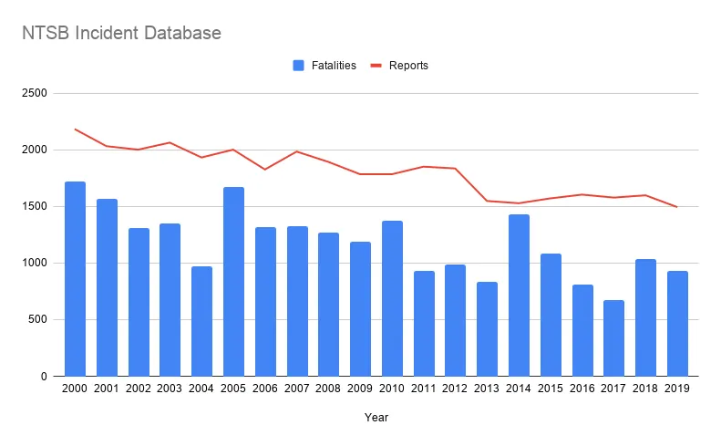

>原作者：Rick Branson；[原文链接](https://rbranson.medium.com/why-you-shouldnt-count-production-incidents-38616d8e6329)

航空事故和死亡人数随着时间推移而减少。上图告诉了我们这一点。它还揭示了另一点：每次事故的死亡人数差异很大！**仅仅统计事故报告数量会掩盖这一非常重要的事实。**

高效的互联网服务团队都有一个共同点：有效的事故管理和无责后期分析流程。然而，这样的流程往往会导致一个不幸的结果——有人会提出一个看似合理的建议：将事故报告数量作为衡量产品质量的标准。

Facebook 坚决反对统计事故报告——至少在我在那里的时候是这样。似乎基础设施团队的负责人 Jay Parikh 的一项重要任务就是不断提醒大家不要统计事故报告。当有这样的仪表板或报告出现时，他会在极短的时间内发现。

如果你是始作俑者，你的手机会很快响起 Messenger 标志性的“PING！”声。你会低头看通知。“哦，糟了。” 是 Jay Parikh 本人，他礼貌但坚定地请求“请将其撤下。” 自然地，你会感受到潜在的“否则后果自负”的威胁。

为什么如此激进呢？有三个主要原因说明这个看似不错的想法为何如此危险。

## 1. 这是一个借口

有有效的方法来衡量服务质量，但绝对不是通过事故的数量。因为数据已经存在，所以很容易让人产生更多事故不好，少事故好的想法。

问题在于，这成为了衡量实际客户体验的借口。推导出这些指标需要大量精力，所以人们容易选择走捷径。选择正确的客户体验指标完全取决于特定产品或服务的细节，需要对产品有深刻的理解以及对客户重视内容的敏锐洞察。

对于 web 应用程序的后端服务，一个与客户体验直接相关的质量指标可能是客户端观察到的不可恢复请求错误的频率。客户不应该遇到这种错误，如果遇到了，就表明存在实际的体验问题。这种指标特别强大，因为它综合了各种潜在原因。

高层通常希望将质量汇总成每个产品领域的总分。这可能看起来有点偷懒，但他们的工作是确保改进集中在最需要的地方。我已经写了一个简要的草图来实现这一点。

## 2. 反向激励

>摘自《哈佛商业评论》：你可能会争辩说，这不可能这么简单——但心理学家和经济学家会告诉你，事实就是如此。人类会根据被评估的指标调整行为。你衡量什么，人们就会努力优化该指标的得分。你测量什么，就会得到什么。就是这样。

行为必然会符合测量的证据是压倒性的。测量事故报告的数量会导致提交的事故报告减少。

我已经听到有人说：“但是，我们公司的价值观是诚实和合作，所以情况不同。” 尽管有类似的压倒性证据，相信化学尾迹阴谋论的人还是很多。

一个精心安排的事故管理和事后分析流程的根本目标是学习和改进。事故报告正是实现这一目标的工具。通常，报告越少，流程的效用就越低。实际上，应该鼓励人们尽早为任何可验证的严重事故提交报告。

虽然事故确实需要分配严重等级，但其目的是为了明确传达在事故期间适当的响应措施。如果一个团队根据提交的事故报告数量来评估，他们不可避免地会在提交或升级时犹豫不决。测量带来的寒蝉效应不应该在生产事故的压力环境中发生。

## 3. 实际上并无用处

事故报告的频率与组织的成功或失败并没有什么有意义的相关性。因为严重等级通常表示事故期间的最高影响值，所以它并不能准确反映总影响。因此，十小时的 SEV2 不一定比十分钟的 SEV2 更好或更差——这是模糊的。

然而，有一些非常有用的指标可以在事故报告过程中收集。以下是每个事故报告中应包含的四个通用数据点：

1. 影响开始的时间
2. 团队意识到问题的时间
3. 事故影响被缓解的时间
4. 团队如何意识到问题（例如，通过机器警报、员工报告、客户报告或《纽约时报》头版）

这些数据点可以用来推导出以下指标：

1. 从影响开始到意识到问题的延迟
2. 从意识到问题到解决问题的延迟（即 MTTR）
3. 响应的主动性

这些指标对于推动改进非常有用。任何改善这些指标的服务团队都将提供更高的质量……这是可以保证的。尽管每份报告都需要准确的损害评估，但这些数据通常无法在不同的事故之间进行普遍比较。

“但是 Rick，你不是刚刚提到测量带来的反向激励吗？这不会激励人们篡改这些数据吗？” 首先，尽量避免与撒谎者共事。考虑提交事故报告是否合适与篡改客观事实之间有很大的道德差异。

其次，事后审查的一个重要部分是将报告中的数据点与现有数据进行验证。这不是某种“信任但验证”的偏执行为。这是关于过程的完整性。人们会犯错误，他们可能因为事故而疲惫不堪，并希望尽快恢复正常生活。即使在最极端的情况下，事故报告也是相对罕见的，因此，确保每一份报告的准确性是必不可少的，如果改进是真正的目标。

## 但需注意

最高的事故严重等级应保留给“所有东西都出问题了”的情况。在这种影响水平下，没有人会犹豫提交报告。

你可能会想到一些可靠地表明这种情况的警报。Facebook 最具行动力的警报之一是可怕的出口流量下降。我从未遇到过出口流量下降警报是误报的情况。

网络团队会跟踪每个边缘路由器的全球总吞吐量。如果这个数字突然大幅下降，比如 50%，那么“所有东西都出问题了”的阈值已经达到。虽然仍需要人类提交报告，但这主要是形式上的。每次这种情况都是 SEV1，最糟糕的情况——所有人都得参与。

如果你的流程中的最高严重等级并不等同于“所有东西都出问题了”，那么可能是时候调整等级以达到这种程度了。

这些事故是绝对不应该发生的。没有地方可以隐藏，所以没有任何测量会对报告机制产生寒蝉效应。甚至 Jay Parikh 也曾引用 SEV1 的频率来证明公司优先事项的调整。

## 最后的忠告

事故报告的价值在于收集到的数据。

回到衡量质量的问题，记住事故报告最终是在最糟糕的情况下捕获的数据是很有帮助的。我们可以承认事故的不可避免性和从中学习的价值，同时也要认识到绝大多数的质量改进不会来自这个过程。改进质量不应该依赖于事故的发生。

事故应当被视为神圣的，所以不要破坏这个神圣的过程。不要为了统计而降低其价值。停止统计生产事故！

 ❤️ Photo by Oleksandr P: <https://www.pexels.com/photo/hand-stopping-domino-effect-12955678/>
