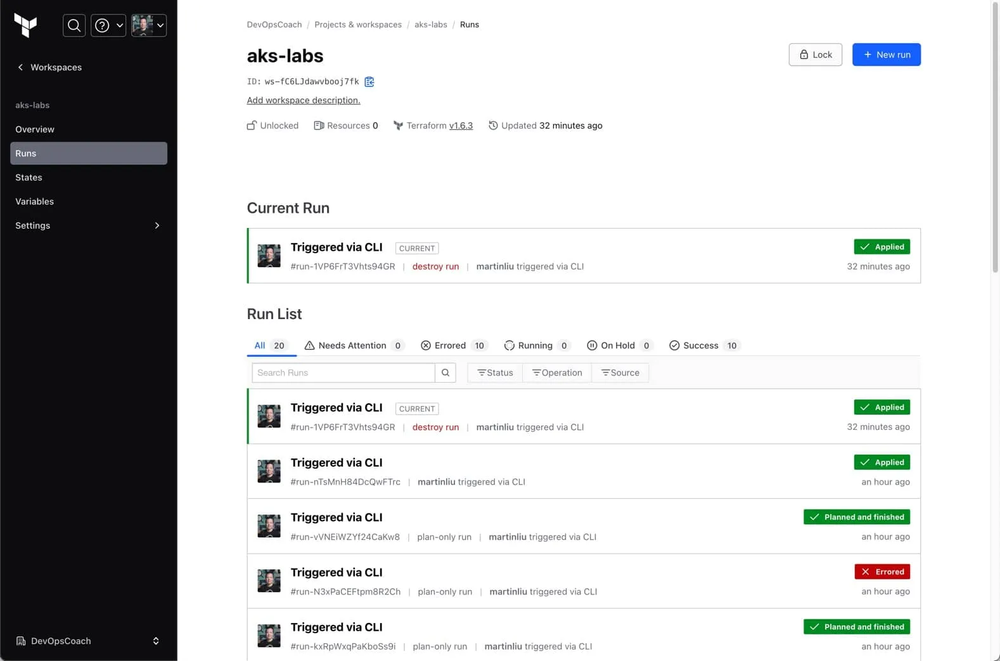

本文介绍如何使用 Terraform 创建一个基础配置的 Azure Kubernetes Service (AKS) 集群，可以用于快速的启动一个开发测试环境，基础特性如下。

* 使用尽可能多的默认值
* node pool 使用了自动扩展，最小节点数为 1，最大节点数为 10
* AKS将使用由Azure自动创建和管理的托管身份

## 登录 Azure

参考这篇文章《[创建用于命令行登录认证 Azure 的 Service Principal 必读](https://martinliu.cn/blog/create-azure-sp-for-cli/)》，创建一个用于在命令行登录认证 Azure 的 Service Principal。

为了将创建的 Service Principal 的细节信息，用于命令行变量，方便 Azure CLI 命令的参数化，还为了将所有必要的变量带入 `.tf` 文件的变量中。可以参考下面的命令：

```bash
export TF_VAR_subscription_id=XXXXXXX-XXXX-XXXX-XXXX-XXXXXXXXXXXXXX

SERVICE_PRINCIPAL_JSON=$(az ad sp create-for-rbac --name aks-getting-started-sp --role Contributor --scopes /subscriptions/${TF_VAR_subscription_id} -o json)
TF_VAR_client_id=$(echo $SERVICE_PRINCIPAL_JSON | jq -r '.appId')
TF_VAR_client_secret=$(echo $SERVICE_PRINCIPAL_JSON | jq -r '.password')
TF_VAR_tenant_id=$(echo $SERVICE_PRINCIPAL_JSON | jq -r '.tenant')

az login \
--service-principal \
--tenant $TF_VAR_tenant_id \
--username $TF_VAR_client_id \
--password $TF_VAR_client_secret \
--output table
```

以上在创建 Service Principal 的时候，使用了 `--scopes /subscriptions/${TF_VAR_subscription_id}`，这样就可以在任何一个资源组中使用这个 SP 了。假如你需要在多个不同订阅之间工作，可以灵活的使用 `${TF_VAR_subscription_id}` 这个环境变量，来指定不同的订阅 ID。

这段命令中一共设置了四个命令行的环境变量，由于需要在 .tf 文件中作为变量使用，因此需要使用 `TF_VAR_` 前缀，这样 Terraform 才能识别到这些变量。

## 登录 Terraform Cloud

Terrafrom 命令行工具的安装本文忽略，详见官方文档 [Terraform CLI](https://www.terraform.io/docs/cli/index.html) 。

Terraform Cloud 是 Terraform 官方提供的一种 SaaS 服务，可以用于管理 Terraform 的状态文件，以及执行 Terraform 的计划和应用。本文中使用 Terraform Cloud 来管理状态文件，以及执行计划和应用。

首先，你需要在 Terraform Cloud 中创建一个组织，然后创建一个工作区，用于存放状态文件。然后，你需要在本地安装 Terraform CLI 命令行工具，然后使用 Terraform CLI 命令行工具，登录 Terraform Cloud。

```bash
terraform login
```

## 创建 AKS 集群

本文使用的样例代码在 [GitHub](https://github.com/martinliu/azure-labs/tree/main/lab02) 上，你可以直接使用这个样例代码，也可以参考这个样例代码，自己创建一个 AKS 集群。

下面是样例代码中的 `main.tf` 文件，这个文件中包含了创建 AKS 集群的所有必要的配置。

```hcl
terraform {
  # 使用远程 Cloud 后端
  cloud {
    organization = "DevOpsCoach"
    workspaces {
      name = "aks-labs"
    }
  }
}
provider "azurerm" {
  features {}
  # 下面的配置允许 Terraform 以您的身份与 Azure API 进行交互，从而管理您的资源。
  # 从 CLI 的环境变量中取得这些实际的数值
  tenant_id       = var.tenant_id
  subscription_id = var.subscription_id
  client_id       = var.client_id
  client_secret   = var.client_secret
}

resource "azurerm_resource_group" "example" {
  name     = "${local.prefix}-rg"
  location = local.location
}
```

以上文件中引用了两种变量，一种是从 locals.tf 文件中引用的本地变量，另一种是从命令行的环境变量中读取到的`TF_VAR` 开头的变量。这样从 Terraform 命令行执行之前，就可以将这些变量设置好，然后 Terraform 就可以使用这些变量了。

下面是样例代码中的 `locals.tf` 文件，这个文件中包含了创建 AKS 集群的所有必要的本地变量。

```hcl
locals {
  prefix = "aks4devops"
  location = "eastasia"
}

variable "client_id" {
  description = "Client ID for the Azure provider"
  type        = string
}
variable "client_secret" {
  description = "Client Secret for the Azure provider"
  type        = string
}
variable "subscription_id" {
  description = "Subscription ID for the Azure provider"
  type        = string
}

variable "tenant_id" {
  description = "Tenant ID for the Azure provider"
  type        = string
}
```

这里文件中设定了两个变量参数，另外还声明了四个命令带入的变量，它们是从命令行的环境变量中读取到的`TF_VAR` 开头的变量。

下面是样例代码中的 `aks.tf` 文件，这个文件中包含了创建 AKS 集群的所有必要的配置。

```hcl
resource "azurerm_kubernetes_cluster" "example" {

  # AKS cluster basic information
  name                = "${local.prefix}-k8s"
  location            = azurerm_resource_group.example.location
  resource_group_name = azurerm_resource_group.example.name
  dns_prefix          = "${local.prefix}-k8s"

 # node pool settings 
  default_node_pool {
    name       = "default"
    node_count = 2
    min_count = 1
    max_count = 10
    vm_size    = "Standard_DS2_v2"
    enable_auto_scaling = true
  }

  # AKS use system auto created identity 
  identity {
    type = "SystemAssigned"
  }
}
```

以上集群基本上使用了所有的系统默认配置，除了设定了一个 node pool，这个 node pool 使用了自动扩展，最小节点数为 1，最大节点数为 10。

在阅读了这些文件之后，就可以在本地执行 Terraform 的计划和应用了。

```bash
terraform init
terraform plan
terraform apply
```

在执行以上命令的过程中，我们可以在 Terraform Cloud 的 Web 界面中，看到 Terraform 的执行过程。




在测试完成了之后，可以使用下面的命令，删除 AKS 集群。

```bash
terraform destroy
```

## 参考

* [Terraform Cloud](https://www.terraform.io/docs/cloud/index.html)
* [Terraform Cloud - CLI](https://www.terraform.io/docs/cloud/cli/install-bash.html)
* [Terraform Cloud - CLI - Login](https://www.terraform.io/docs/cloud/cli/login.html)
* [Azure CLI Login](https://docs.microsoft.com/en-us/cli/azure/reference-index?view=azure-cli-latest#az-login)
* [Azure AKS documentation](https://docs.microsoft.com/en-us/azure/aks/)
* [Azure AKS Terraform documentation](https://registry.terraform.io/providers/hashicorp/azurerm/latest/docs/resources/kubernetes_cluster)