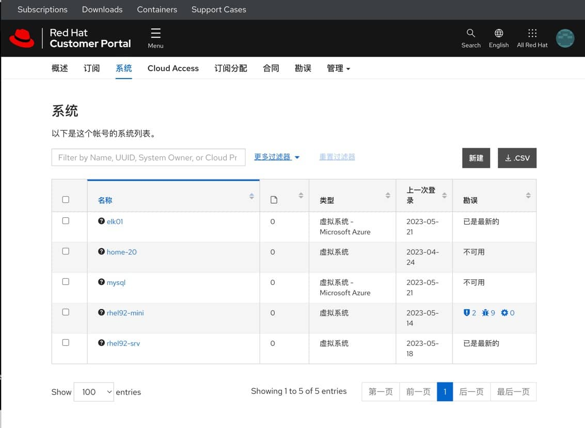
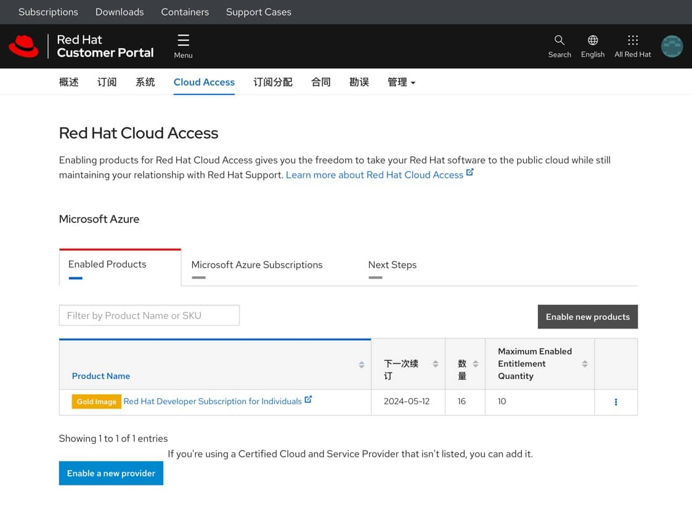
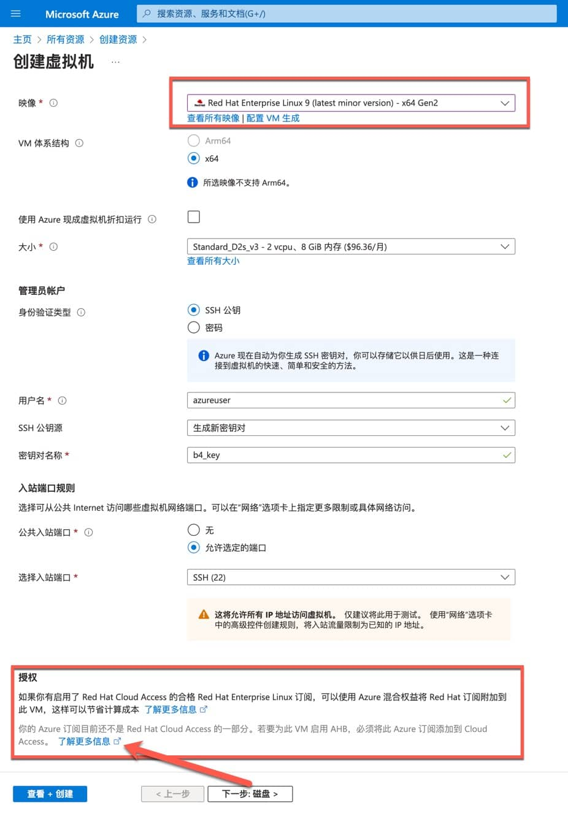

如果你是红帽开源软件的个人开发者（用户），你可以通过“红帽开发者计划”实现访问、下载和使用红帽全系列产品的福利。

红帽开发者会员的好处是可以免费获得广泛的资料库，包括：

- 所有红帽软件 （含所有产品及时的更新）
- 开发者资源 (technical articles, e-books, cheat sheets, and more)
- Interactive tutorials on the latest technology and Red Hat products
- Free in-person and virtual events with Developer experts
- Free Developer Sandbox to build your apps

会员资格包括访问：

- Red Hat 所有和刹那品，包括 Red Hat Enterprise Linux, OpenShift 和 Ansible 等等
- Red Hat Customer Portal 客户门户的访问权限

重要资源：

- 开发者计划介绍：<https://developers.redhat.com/about>
- 无费用的 Red Hat Enterprise Linux 个人开发者订阅的常见问题：<https://developers.redhat.com/articles/faqs-no-cost-red-hat-enterprise-linux#>

## Red Hat 提供开发者订阅

- Red Hat Enterprise Linux 个人开发者订阅的数量为16个RHEL操作系统实例。
- 需要在使用开发者订阅的操作系统上联网激活订阅
- 激活的账号和密码与开发者门户的账号相同。
- 在 Red Hat 客户门户网站上，你可以管理和续订开发者订阅。

下图是在客户门户网站上查看当前订阅使用状况的界面。



如果你所使用的公有云里有Red Hat官方支持的 RHEL 镜像，你可以将你的开发者订阅使用在公有云的虚拟机上。在Cloud Access这个页面上，可以看到我将微软的Azure账户和红帽开发者订阅做了关联。

这样就可以实现：有限数量的 Azure 虚拟机可以运行最新版的 RHEL 操作系统，这些操作系统的 License 计费到了 Red Hat 开发者订阅上；而开发者订阅又是有限免费的，因此实现了这些虚拟机的免费使用 RHEL 订阅。由于我在 Azure 中的长运行虚拟机并不多，因此这些虚拟机目前都是使用的 Red Hat Enterprise Linux。



## Azure 支持 AHB 的混合权益

参考这篇 Azure 的官方文档[《Red Hat Enterprise Linux (RHEL) 和 SUSE Linux Enterprise Server (SLES) 虚拟机的Azure 混合权益》](https://learn.microsoft.com/zh-cn/azure/virtual-machines/linux/azure-hybrid-benefit-linux?tabs=rhelpayg%2Crhelbyos%2CrhelEnablebyos%2Crhelcompliance)

Azure 提供的 AHB（Azure Hybrid Benefit）使用中携带你自己的订阅到公有云里使用的方式。如下图所示。


右侧的这个框的说明了 Azure 虚拟机的成本结构。除了计算资源这部分需要计费意外。如果你在 Azure 中开启了 RHEL 虚拟机实例，默认情况下 RHEL 的许可证费用是有 Azure 代收的，Azure 的账单里包含了这部分。

对于我在 Azrue 中的长运行虚拟机来说，经过我的配置之后，Azure 的账号和 RedHat 开发者订阅关联在了一起。所以这些 RHEL 虚拟机实例上的 RHEL 许可证费用就是在 RedHat 客户门户账号（来自于红帽开发者计划福利）中计费，最多支持 16 个虚拟机的免费使用。

## 如何在 Azure 中配置个人（公司）的 RHEL 订阅

如下图所示，在创建 Azure 的虚拟机的时候，选择 Red Hat Enterprise Linux 模板。



在授权这个部分，点击第二个“了解更多信息”链接。这时候，浏览器会跳转到红帽客户门户中，在输入了用户名和密码登录了以后，你就完成了红帽开发者订阅和当前 Azure 账户的关联。

在虚拟机创建完成以后，你可以用 RHEL 的订阅管理命令将当前的 RHEL Linux 操作系统注册到红帽客户门户的订阅上。参考命令如下：

```
subscription-manager register --org=1234567    --activationkey=DevOps
```

- ---org ：是你在红帽门户中的组织 ID。
- --activationkey ： 是自己定义的激活秘钥；一个组织可以定义多个激活秘钥，用户部门和用途的区分。

这条命令中虽然 ID 是不适合明文暴露的；但是，这样避免了将红帽客户门户账户的用户名和密码都以明文的形式写入配置文件，或者在命令中出现：`subscription-manager register --username <username> --password <password> --auto-attach`

在当前操作系统注册成功以后，你可以在`/etc/yum.repos.d`下能找到一个`redhat.repo`文件。这个文件里包含了当前操作系统所有能使用的红帽产品的订阅。

```
[root@mysql yum.repos.d]# dnf repolist
Updating Subscription Management repositories.
repo id                            repo name
packages-microsoft-com-prod        packages-microsoft-com-prod
rhel-8-for-x86_64-appstream-rpms   Red Hat Enterprise Linux 8 for x86_64 - AppStream (RPMs)
rhel-8-for-x86_64-baseos-rpms      Red Hat Enterprise Linux 8 for x86_64 - BaseOS (RPMs)
```

参考这篇文章《<https://access.redhat.com/solutions/253273》>》；就可以启用或者禁用所需要的产品。

## 在其他环境中的使用

红帽开发者订阅可以让你在客户门户中下载 RHEL 安装 DVD。可以用 DVD 在私有云或者个人电脑（Home Lab）中安装 RHEL 操作系统。

使用上面相同的方法，既可以实现 RHEL Linux 操作系统的注册，然后完全合理合法的使用全套红帽产品线。

红帽开发者订阅的有效期是一年；在到期之后，在还需要在客户门户中免费续签。如果当前的开发者订阅过期了，所有 RHEL 操作系统实例就都不能正常更新和安装新的软件包了。在网站上完成了开发者订阅的免费续签之后，所有系统就可以恢复正常使用，无需做其他任何操作。

开发者订阅的数量是 16 个，更具我最近一年的使用体验看来，这个数量是足够用的。假如你的虚拟机模板激活了订阅，根据这个虚拟机克隆出来的虚拟机是不需要使用注册命令就可以正常更新和安装软件包的。如果订阅数量真的被用完了，可以暂时从红帽客户门户中暂时删除几个不常用的系统，这样就释放出来几个可用的 RHEL 订阅。

## 排错

新创建的 RHEL 8 的虚拟机，在激活红帽 RHEL 订阅之后，在更新系统软件安装包的时候，报 SSL 证书过期错误，可以参考下面的命令进行解决。

```
yum --disablerepo='*' remove 'rhui-azure-rhel8'
wget https://rhelimage.blob.core.windows.net/repositories/rhui-microsoft-azure-rhel8.config
yum --config=rhui-microsoft-azure-rhel8.config install rhui-azure-rhel8
yum update ca-certificates
yum clean all
```
