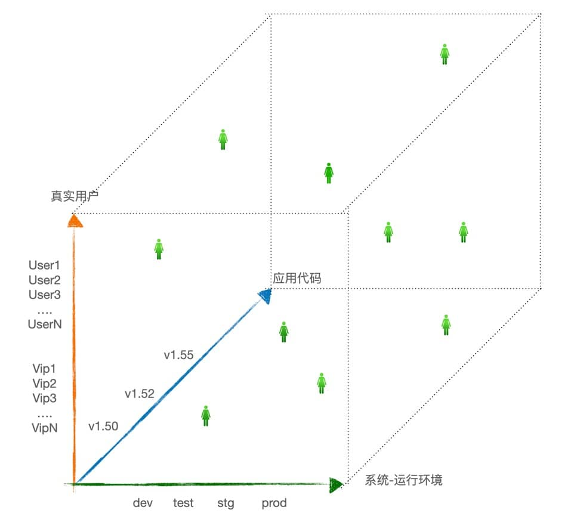

“可观测性”英文 observability ，缩写 o11y 。

## 常见定义

最常见的引用来自机械工程领域中关于“控制论”的研究，1960 年鲁道夫·E.卡尔曼首次提出了“可观测性”这个词。

在控制论中，这个概念涉及：物理机械系统和与之对偶关系的数学模型。然而，这个机械工程师用来研究物理系统的术语，并一定能完全的适用于我们所研究软件应用系统。

大多数人将“可以根据系统的外部输出信息推断出系统内部状态的好坏（源自于《控制论》）”全盘接受，并套用在了软件行业相关讨论的上下文中。

## 常见误解

降维误读：“可观测性”就是“遥测-telemetry”和“监控-monitor”的同义词。它与监控并没啥区别。就是通常所说的三大支柱（日志、指标和 Trace）。

厂商的市场宣传：由于市场宣传的需要，目前几乎所有传统做指标、日志和 APM - Trace 的厂商都直接宣称他们都是做可观测性的厂商，提供可观测性产品、解决方案或者 SaaS 服务。常见做法：可观测性是他们扩展出来的，用旧产品改名。

有些公司会直接的进行概念替换：“我们就是可观测性”。

以上现实情况，给所有人对可观测性的理解带来了一定的障碍。

## 应有的定义

在我们排除以上学术上的认祖归宗，以及市场宣传的张冠李戴以后。

我们应该可以给出一个关于可观测性更加严谨的定义：

1. 可观测性是应用系统的一种内在属性，我们可以通过可观测性管理工具将其显性的展现出来，用于探索分析。
2. 度量能力：无论系统中发生着多么费解的现象，它的度量数据能帮助你更好地理解和解释系统当前的状态。可以解答：系统处于什么状态？
3. 探索能力：我们能够在各类系统状态数据的所有维度和组合之间进行关联分析，并无需遵循某种预定的调试&排查模式和路径，用于解答：系统中发生了什么变化？为什么会发生这样的变化？
4. 可按需调整能力：最好是不需要改变原有软件系统的代码，如有需要，也能随心所欲的按需埋点覆盖新的洞察认知。

以上是关于可观测性定义应该具备的描述信息。适用于我们在对软件系统进行运行和维护的上下文中，这个概念应该具有的含义和外延还有很多。

## 为何现在o11y很重要？

特别是在云原生的运维场景中，传统监控并非唯一的最佳方法；而且，传统的指标和日志监控已经捉襟见肘；产品团队和运维人员始终处于很被动的状态，传统监控数据仅限于让我们了解有限的历史状态，很难推理和预测未知故障。在创建了大量告警规则后，告警事件的数量和信噪比都居高不下，运维值守人员终日忙于关闭噪音事件，很难聚焦在有意义的事件上。

## 调试&排查应用系统

在生产环境中，调试和排查应用系统的故障和性能问题充满着各种挑战。任意一个人是无法完全的理解复杂的软件系统，大部分人都是习惯于使用分解法思考系统故障；先脑补系统的整体架构，然后怀疑某个系统组件，再考虑组件之间的关联关系。在云原生系统中，我们很难准确的在大脑中勾勒出系统架构的全貌，甚至都不能准确的定位出某个组件（子服务）是运行在什么地方（AZ，Host，Pods）。而且，现代分布式系统所发生的故障，是一系列持续的不同的新问题，发生故障的代码有可能是自己开发的，也很可能是第三方依赖组件&外部服务。人的诊断故障的直觉和经验只能对已知的错误模式有效，传统监控就是面向已知问题的，先假设每一个监控点都是确定的未来的故障点。而使用可观测性进行故障诊断，是面向未知问题的，是用来解释未知问题是如何发生的。

用可观测数据度量和感知应用系统的状态，以及状态的变化，就需要认识到数据的两个维度“基数”和“维度”。

### 基数

基数的定义：关注于一条可观测性数据的某个字段，如果每个字段都是一个 Key - value 对，维度指的是这个组合中 value 的唯一性，也就是值的唯一数量。

* 高基数字段的例子：用户 ID、UUID、购物车 ID、请求 ID、容器 ID、主机名（弹性、不可变架构）、Pod ID等等。
* 低基数字段的例子：性别、种族、国家、婚姻状态等等

基数对于可观测性的作用是：通过聚合采集到的高基数数据集合，得到低基数的分析结果；可观测性管理拥抱高基数数据，也就拥抱更多未知的可能性，因此它具备感知未知故障模式的先天优势。

而传统监控（日志、指标）数据的基数一般处于一个合理的规模，默认规避高基数，希望用尽可能少的指标分析定位问题，从工具上反映出来的是枚举法；在日常实践中：监控工具的使用者，倾向于关闭大量的认为没什么用的，或者不会出问题的故障采集点。即使是指标全开，日志尽采，而后续的数据分析和洞察手段往往是低效且滞后的，数据后期处理的高价值工作不是没有能力做，就是没有人力和成本做。

工具厂商（指标、日志、APM）可能会按照所能覆盖到的监控指标的数量，而增加工具使用的费用。

### 维度

维度的定义：关注于一条可观测性数据的所有字段的数量，如果每个字段都是一个 Key - value 对，维度指的是这个组合中 key 的数量，也就各种 key 键的多寡。

高维度可观测性数据是一条结构化数据，代表这一次事件，亦或是一个状态，它的“宽度”可以高达上千个键值对（字段），事件越宽所携带的上线文信息就越丰富。高维度数据的作用是用来回答：到底发生了什么？

用一组可观测性数据，在多个维度上进行排列组合分析，就是剖析现代软件系统中的所有故障模式的可能性。

最常见维度组合包括：

1. 用户
2. 代码
3. 系统-运行环境

## 使用可观测性调试

基于充足的应用系统的可观测性数据，进行开放式的探索数据分析，你就能理解系统所进入的任何状态，而且通过多维度的关联分析，还能知道为什么会形成这个状态。

可观测性管理工具是鼓励开发人员主动的收集应用运行时可能发生的任何事件，包括携带丰富的上下文，充足的遥测数据是日后探索分析的基础。

可观测性管理工具平台应该是专门为高基数、高维度的遥测数据而设计的，它鼓励应用系统的所有参与方都参与：主动建立有利于故障调试的可观测性数据的活动中来。包括分工完成下面的各种工作：

* 开发者在可观测性驱动开发思想的指导下，有意识的在代码中引用埋点框架（如 OpenTelemetry），对代码进行必要&足够的埋点。
* 运维人员确保不同语言的应用程序在运行前都携带了自动化埋点的探针（Agent）程序，如果是容器化程序，还可以在打镜像的时候设置这个检查点。确保在任何运行环境（开发、测试、准生产、生产）里APM 或者 RUM 的埋点数据都可以在正确的配置下发送回后台的可观测性管理平台，完成数据的采集。操作系统及以下系统环境的指标和日志是基础工作，是参考数据，这里不赘述。
* 测试人员和其他，都有使用可观测性数据的习惯，利用可观测性数据回答：bug 修复了么？性能回顾解决了么？错误率和延迟是否都很低了？
* 产品经理和服务交付经理通过可观测性数据整理出每一套应用系统的 SLO 管理报告，指导下个迭代的工作方向，安排 bug 修复和特性交付的优先级，评估生产的运行风险。

分析调试现代化应用系统的难度包括两个层面：

1. 相对简单：系统的硬件和基础设施、云平台等方面，也就是代码以下的所有。
2. 相对困难：代码、真实用户的问题，也就是代码本身及以上的所有。

## 适用于现代应用系统

现代化应用系统指的是运行在云上的，并经过适配改造的，与云平台的各种服务有很多集成的应用系统。它也可能是一个单体的运行在云主机中的应用，但更多的是容器化、微服务化、分布式的应用系统。前者用传统的监控方法也可以有效管理；后者使用可观测性管理方式更加适合。

具备可观测性的软件的各种运行状态天然能被理解，我们无须猜测其内部状态，无须提前预判可能的故障模式，无须更新程序代码来暴露盲区。

现代应用系统的故障模式的特点是：以新的、罕见、没发生过的故障模式为主；通常不可预测；需要使用支持高基数、高维度、可自由探索分析的可观测性管理平台进行配套管理。

点击以上图片查看或者下载高清大图。

>本文参考《可观测性工程》第一章内容。

❤️ Feature Photo by Joshua Woroniecki: <https://www.pexels.com/photo/person-holding-a-compass-3832684/>
