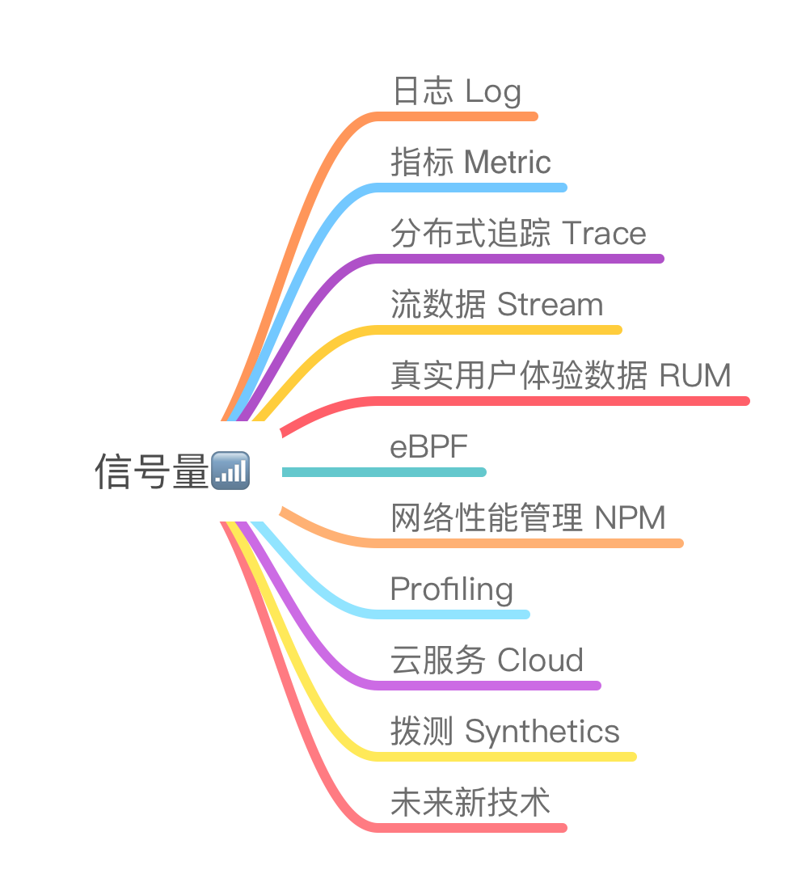
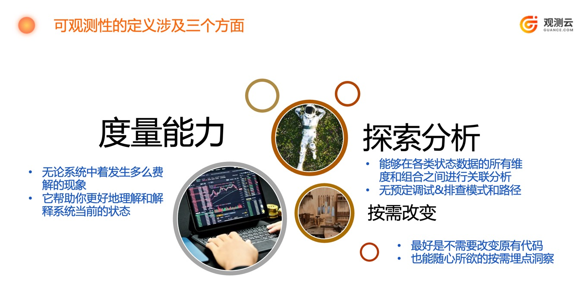

可观测性并不是空穴来风，也非关键词炒作。大家不妨回顾一下我们所熟知的运维管理的演化历程，抛开运维管理中关于流程和人的那些繁文缛节。让我们只关注于：基础设施和应用架构的变迁，关注于这些层出不穷的技术工具侧面。

## 兼容全域信号量

从遥测方式的角度看来：任何类型的信号都有各自的用途和道理。武断地选取其一作为可观测性的代名词是一种比较偏激的想法，在Debug生产环境的道路上，我们难以依靠单一方法，一招鲜吃遍天的情况是不可能存在的。我们要根据不同应用系统的特点和服务类型，选择合理的SLI组合，用恰当的信号量来覆盖目标应用系统，目标是打造应用系统本身的可观测性“属性”。这样，你就必须要明智地选择、添加或变化信号类型，要能做到按需求，对症下药。这里不是监控数据源越多越好，盲目的全面覆盖亦是事倍功半的做法；在应对高维度、高基数的运维大数据的场景中，我们很容易走向存储成本飙升的局面，无效杂音数据还能严重稀释有价值的信息点。

所谓全域信号量究竟都有那些：

1. **日志 Log**：文本记录系统和应用的活动、事件和错误，提供详细上下文。
2. **指标 Metric**：定量的性能度量，如CPU使用率、请求速率，帮助监控系统状态。
3. **分布式追踪 Trace**：跟踪请求在分布式系统中的路径和性能瓶颈。
4. **流数据 Stream**：实时产生的数据，如用户行为，用于即时监测和分析。
5. **用户体验数据 RUM**：记录用户在应用中的交互、操作和反应，评估体验质量。
6. **eBPF**：扩展 Berkeley Packet Filter，收集内核级别的数据，用于分析和监控。
7. **网络性能管理 NPM**：监测网络带宽、延迟和连接状况，优化网络性能。
8. **Profiling**：分析代码运行时的性能特征，帮助优化应用程序。
9. **云服务 Cloud**：从云提供商获取的监测数据，跟踪资源使用和性能。
10. **拨测数据 Uptime/synthetics**：定期对系统进行外部测试，监测系统在不同地点和条件下的可用性和性能。
11. 未来新技术：未知类型数据。

“可观测性管理平台”应当以兼容并蓄全方位的信号量为初始设计目标。这意味着：在观测数据的采集、上传、存储、展示以及关联分析的整个过程中，各类数据都需要能被正确的处理，要能更能合理、有效地进行跨类型的数据关联；在数据下钻的过程中，可以自由地在各种时间线之间跳转和探索。

当然，监控已知的“未知”是一项基本的管理需求，你应当能使用某一种信号量即可实现。而可观测性更多的是要讨论：对“未知”对象，在“未知”状态间进行变化的管理；这就需要“可观测性平台”能处理多层级、高依赖、多云环境、分布式系统下的高“复杂度”，信号量的全面准备和按需取用往往也只是一个必要条件。

目前市场上已经有许多运维管理平台都自称为“可观测性”管理平台。但他们中的大多数都是从某个特定监控类型开始，并逐渐扩展覆盖其他更多信号类型的。通常，只有能够涵盖3种以上信号类型的平台，才可能具有出色的实用效果；对于那些已经是有3至5年历史的‘可观测性’产品而言，他们不太可能在短期内实现华丽的转身，也不可能会从头重构一遍自己的产品。

## 统一采集和上传工具

在物理机大行其道的时代中，对于一台主机（虚拟机或者物理机）而言，由于它很可能承担着多重角色。而且根据不同团队的管理需求，在其操作系统中会安装多种管理监控代理程序Agent，例如：操作系统指标、日志、数据库、中间件、安全巡检等等；这种叠罗汉的形式不仅给操作系统的资源带来了严重的消耗，甚至还给服务器的管理带来了大量的琐事，例如：数据库监控 Agent 还需要创建专用的用户账号等。为了解决这个问题，很多公司希望使用尽可能少的单一采集代理的模式，例如：BMC 公司的 Patrol 监控产品，拥有多种采集模块 KM（数据库、中间、web 服务器等等），用户可以按需要进行配置，而不需要部署多个采集代理程序。然而，BMC 公司会逐渐收购很多新产品，后来的产品有动态性能基线管理、自动化配置管理等等。从工具厂商的角度看， 他们无法进行快速的产品整合，很难维持单一采集代理的局面。

在甲方企业的环境中，不同部门会根据自己的需求采购不同的管理工具，部门间的差异导致了工具的重复建设，数据的重复采集，而且数据并不会很轻易的在部门间共享。这样不仅带来了采集工具在同一个主机上的叠加部署，还会导致：独立的运行着大量具有重复数据的孤岛运维数据数据库。这种局面进一步导致了其他问题，例如：同一个主机的同一个故障会在各种工具中都触发多条告警事件；事件风暴来临了。这种混沌的局面，给 AIOps 的工具带来了生存的空间，即使可以产生一些事件收敛和压缩的收益，但这里存在着一个很明显的“治标不治本”的错误。

时光穿梭到了虚拟化&云原生时代，以上局面并没有发生根本性的改变。反而带来了套娃式深层依赖关系的困境。我们不会把 web、中间件、数据库、消息队列等功能跑在一个 POD 中，但是将其各自独立部署在可横向扩容的子服务（容器服务）中后，这就带来了管理对象的数量呈现指数级飙升的现状。

容器时代带来了新鲜的监控工具，包括：Prometheus、Grafana、FluntD、Graphite、cAdvisor、Loki、EFK等等。我们可以观察到，新生的工具并不会完全改变：多种采集功能代理并存&叠加的局面。Elastic 看到了部署多种相似代理程序的问题后，最近几年很快的将之前的多种 Beats 程序（多次收购的项目）整合成到了一个统一代理 Elastic Agent中，而这个程序目前还只是多个 Beats 程序的马甲（包装壳）程序。Zabbix 是一个依然长期存在的常见采集代理，我个人推测：在当今容器环境居多的情况下，容器内用云原生监控工具集，容器外依然使用老牌监控工具的组合做法，依然是一个普遍存在的现状。

多种采集工具集不仅在端点上会造成大量部署和配置的琐事，而且，它们的后台都对应着各自的独立的数据库部署。同一个管理对象在不同的数据库中的字段描述基本上都不同，这导致了：工具集的使用者很难在各类数据库中实现关联分析，用人脑携带着排错的上下文，在一堆控制台之间跳转是相当消耗体力的工作，对齐时间线和监控对象会很快耗尽人的认知上限。CMDB 可能是一个解决方法，而 CMDB 的设计和建设的难度并不亚于构建任何一个监控系统项目本身， 用CMDB解决这个问题的实现难度大，成本高。数据治理也会是一个常见做法，而在这些运维数据库集合之间做 ELT，做数据治理工作，最终实现异类运维信息的归一化的解决方式，也只是一个顺坡下驴的无奈之举，相关实施人员在项目中必将饱尝：将计就计的辛酸。

貌似最早由 Elastic 推出的统一数据模型（ECS）<https://www.elastic.co/cn/elasticsearch/common-schema> 是一个让数据走向标准化定义的可行之道。我们也看到了：OpenTelemetry 项目很快就采纳了 Elastic ECS。CNCF 在随后也推出了相似的观测数据定义模型。我相信 CNCF 一定是看到了，在它的技术蓝图中，可观测性和分析分类中相似&同类工具的快速繁荣。而这些标准也只能让我们望梅止渴，由于目前还没有看到多数厂商、大量开源项目都快速跟随实现和兼容落地的局面。

观测云的 DataKit 是一款多功能的采集代理程序，它具备解决上述问题的设计，它已经在兼容和对接更广泛的技术生态系统。任何采集代理程序在采集或者对接到了目标数据之后，它其实还需要处理一些列的细节，否则就仍然无法实现“源头治理”，无法避免“garbage in gargage out”的窘境。首先，DataKit 在组织封装数据的时候，所有字段的定义都遵从着一个观测云定义的数据字典（等同于 Elastic ECS ）；其次，上报数据包在封包前，还能做数据的 Pipline 处理，实现了数据字段的丢弃、质量控制、治理和脱敏等问题。最后，DataKit 的采集还可实现对接开源&闭源生态系统，例如接收 DataDog 的 APM 探针数据，对接 OpenTelemetry 的数据等等。它还能实现观测数据在网际、网络间的转发等。

## 统一的存储后台

在构建可观测性平台的过程中，每种类型的信号量都理应得到它最佳的容身之处：

* Elasticsearch ：在 Elastic 的 ECS 的加持之下，貌似它是一个很恰当的一库存所有的方案，但前提是你需要能 hold 住性价比。
* 时序数据库：不一一列举，适合指标类时序数据。
* 列数据库：以 ClickHouse 为代表的实时数据分析的列数据库，可兼容多种信号。
* 关系型数据库：WHY NOT。

从数据入库的角度看，给每种信号量配置其最佳的数据库类型，貌似是一个皆大欢喜的局面。这也不辜负，目前各种开源数据库百花齐放的形势。

略过上面已经提到的数据孤岛和治理问题不谈。从查询的角度看，用户将不得不学会多种查询语言，前方有 n 种 SQL 语法需要你学习，否则你不得不开发维护一个一对多的查询界面。这里我们暂且不论述：你会如何实现可观测性数据的跨库数据关联分析。

问题：是否存在一种多模态的统一数据库，将多种类型的信号量数据融入一个统一的数据仓库中？

实际上，目前的可观测性 SaaS 提供商们，已经给他们的用户提供了这样一种统一融合的数据后端，起码从查询探索可观测性数据的使用体感的角度上，确实是已经做到了。而观测云也正在推出这样一款解决以上统一融合多态并存管理需求的数据库。观测云用户很快将在 SaaS服务中，在私有部署的产品上使用到这种技术。

## 自由探索和综合使用数据

可观测性数据的价值体现在使用上，能自由的探索和综合的使用各种数据，才能放大数据的价值。在考虑到可观测性数据使用场景的时候，我强烈建议大家运用“第一性原理”来进行思考。这样才能避免对经验的依赖，排除对新可观测性技术能平替所有旧技术的单纯幻想，才能回到可观测性技术的概念本源。

此处省略 n 百字，仅以上图与读者们一起随时随刻的校准自己对“可观测性”定义的理解。

## 总结

本文从四个层面对可观测性平台实现的技术要点，做出了一定深度和时间跨度上的探讨。希望：在您的工作环境中，统一融合的可观测性平台可以很快的落地。穿上两只靴子的你，可以脱离以前赤足上阵，光脚救火的困境。希望可观测性平台能够帮助到软件交付流水线中的所有人，运用可观测性来补Ops的锅，助SRE的威，壮Dev胆。
